사실 그동안 원신에 현자 타임이 와서 원신을 아예 하지 않았다.

그래서 이벤트도 몇 번 놓쳤고, 해당 이벤트에서 주는 장식도 얻지 못했다.

아쉽다면 아쉽고, 아쉽지 않다면 아쉽지 않은 그런 느낌이다.

옛날 클레가 가챠에서 나오지 않아 꼬접했을 때와 다르게, 이번 원신을 접은 기간이 그리 길지 않아서 그렇게 느끼는 것일지도 모르겠다.

&nbsp;

곧 있으면 2.4 버전 업데이트가 있을 예정인데, 그전에 밀린 것을 좀 끝내기로 했다.

임무 창을 열어보니 여러 임무가 쌓여 있었는데, 그 중 '마신 임무'로 분류된 임무를 먼저 하기로 했다.

&nbsp;

이번 마신 임무는 특이하게 '중간장'이라는 표현을 쓴다. 채널에서 주워들은 바에 따르면, 이 '중간장'이라는 단어는 해당 임무가 여행자가 아직 이나즈마로 떠나기 전, 리월에서 있었던 일임을 의미한다고 한다.

즉, 급하게 메인 스토리에 끼워 넣은 이야기란 말이다.

&nbsp;

처음에는 이 임무에서 사진을 찍을 생각이 전혀 없었다.

그야, 이번 중간장 이야기는 그냥 새로 추가한 리월 캐릭터인 신학과 운근이 그동안 코빼기도 내비치지 않다가 이제서야 등장한 이유를 설명하기 위한 것으로밖에 보이지 않았기 때문이다.

한술 더 떠서, 이번 중간장은 차라리 신학 전설 임무라고 하는 게 더 어울릴 정도로 신학 위주로 이야기가 흘러갔다.

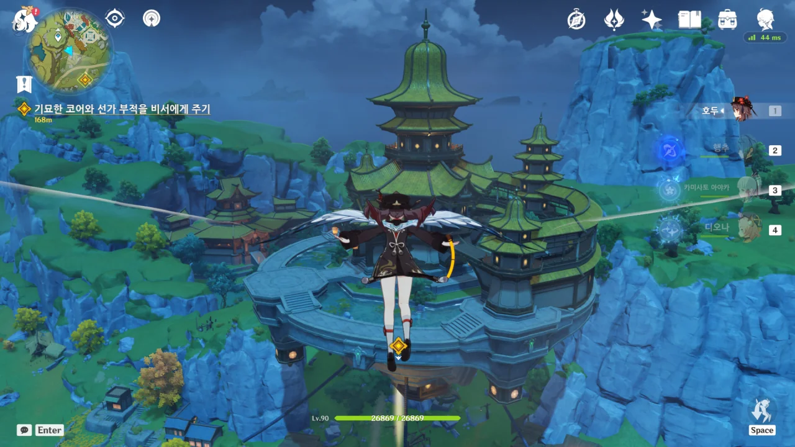

아니, 근데 내가 군옥각이 재건되는 걸 보게 될 줄은 몰랐지.

&nbsp;

현재까지의 상황은 대충 이러하다.

응광이 군옥각을 재건하는 데 필요한 재료를 세 가지 모두 모아오면 자신에게 질문을 세 번 할 수 있는 권리를 주겠다고 공표했다.

이 말을 들은 북두와 운근, 여행자, 그리고 신학은 서로 담합해서 세 재료를 싹쓸이하기로 했다.

그리고 정말로 세 재료를 모두 모아왔다.

군옥각을 다시 보게 될 줄이야...

&nbsp;

내가 군옥각을 다시 보길 원한 것은 단 하나의 이유 때문이었다. 옛날에 마신 임무를 진행할 때, 군옥각에서 책 몇 권을 미처 수집하지 못했거든.

나중에라도 다시 가고 싶었지만, 마신 임무 도중 응광이 군옥각으로 로드롤러를 시전해 버리는 바람에 군옥각 자체가 산산이 조각나버렸다.

그래서 게임 내 모든 도서를 모은다는 계획을 더 이상 이루지 못할 것으로 생각해 포기하고 있었는데, 군옥각이 재건된다는 말이 나오네? 그러면 설마 군옥각 안에 있는 책을 다시 수집할 수 있는 거야?



아니, 왜 이 좋은 날에 초를 치는 거지? 군옥각을 재건한 다른 이유가 있었던 건가?

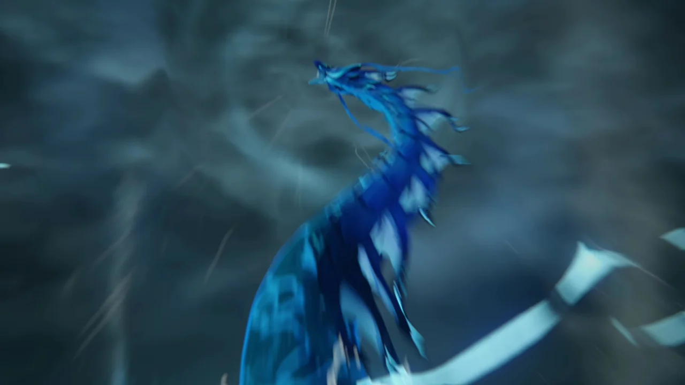

진짜로 뱀장어가 하나 더 나왔다.



군옥각으로 로드롤러를 당한 오셀의 원한을 갚겠다고 오셀의 아내, 「소용돌이의 여세」 베이슈트가 찾아왔다.

뭐지, 부부가 쌍으로 로드롤러를 당해 또다시 운래해에 수장되고 싶다는 의미인가?

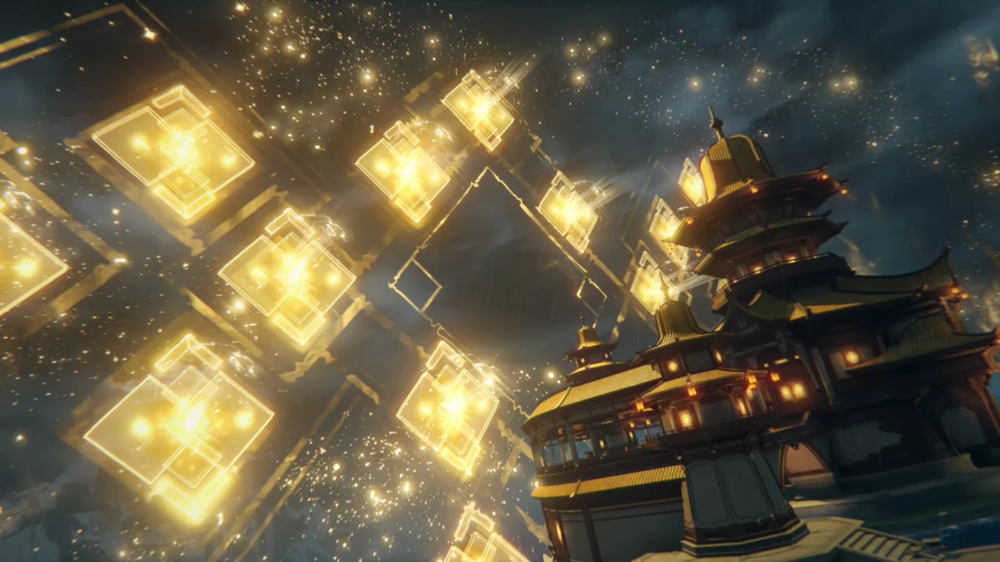

응광이 '이번에는 선인의 힘이 아닌 인간의 힘으로 해결하겠다'라며 군옥각 뒤에 패널 같은 것을 띄운다.

근데... 저거 게이트 오브 바빌론 표절 아니냐?

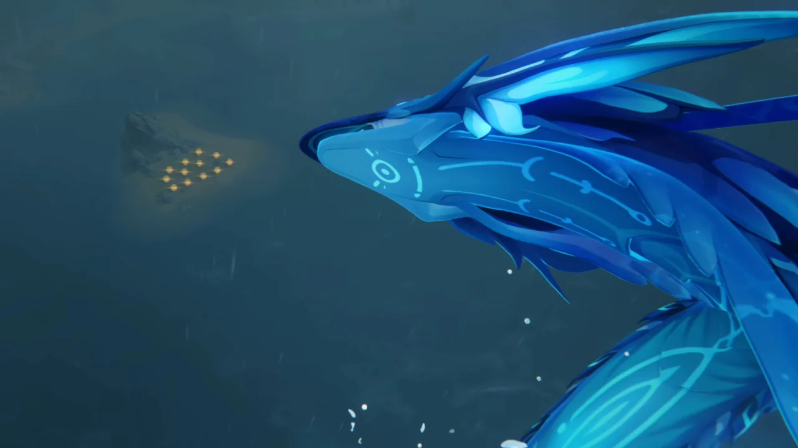

군옥각뿐만 아니라 지상에서도 베이슈트를 향해 포격이 날아온다.

&nbsp;

군옥각 재건 재료를 모은답시고 돌아다닐 때, 다른 캐릭터들을 만날 수 있다는 이야길 들었다. 

치치가 리월항에 있고, 각청이 고운각에 있으며, 소는 임무 도중 '내게 말을 걸어줘'라고 하는 것처럼 자연스럽게 발견할 수 있다고 하더라.

이때 각청이 고운각에서 뭘 하고 있나 궁금해했었는데, 응광이 개량해 원본보다는 성능이 조금 떨어져도 대량 양산이 가능한 신형 귀종기를 고운각에 설치하고 있다고 했다.

그리고 그 신형 귀종기로 베이슈트를 쏘고 있고.

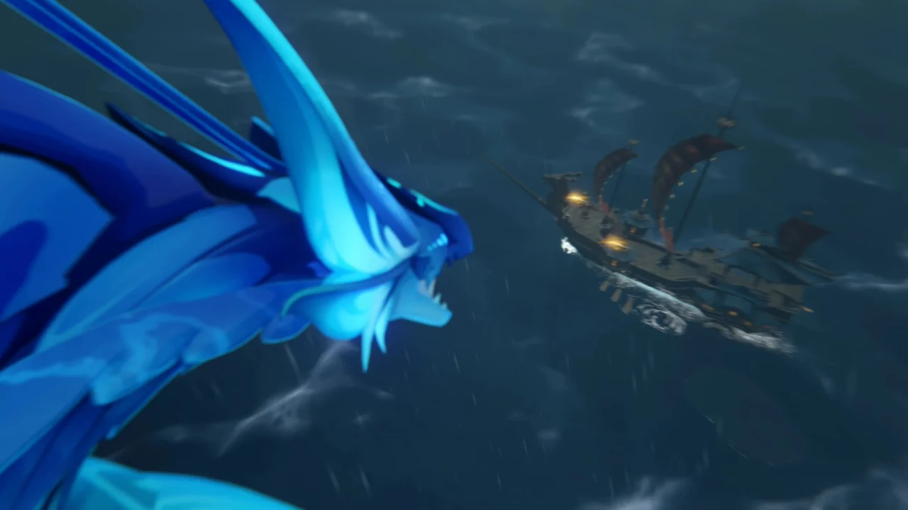

잔뜩 빡친 뱀장어가 군옥각에 빔포를 쏘려는 순간, 배에서 포격이 날아온다.

북두가 왜 군옥각 재건에 참여하나 궁금했었는데, 이 모든 게 베이슈트의 리월 침공을 막기 위해서였다.

베이슈트가 리월로 다가옴에 따라 바다의 기상 상태 등이 나빠졌고, 북두가 이를 응광에게 알린다. 응광은 뱀장어를 제거하기 위해 군옥각 재건을 서둘렀고, 재료를 시급히 모으기 위해 대회까지 열었다. 그동안 각청은 고운각에 신형 귀종기를 잔뜩 설치하고 있었고.

&nbsp;

세 곳에서 귀종기를 펑펑 쏴대니, 뱀장어가 이리 맞고 저리 맞으며 아주 정신을 못 차린다.



세 곳에서 조리돌림당하는 뱀장어. 꼬시다. ㅋㅋㅋㅋㅋㅋ

북두의 배와 군옥각이 빠른 속도로 이동하며 귀종기를 다발로 쏴대는 걸 보니, 역시 거함거포주의는 옳았던 것이 아닐지 생각이 들더라.

아이오와급 전함이 함포를 쏘는 걸 보면 진짜 가슴이 웅장해진다니까?



제대로 빡쳐 빔포를 발사하려는 베이슈트에게 여행자가 달려들지만, 생채기조차 내지 못하고 그대로 고운각에 처박혀 버렸다.

오셀과 싸울 때는 여러 선인의 백업을 받았지만, 이번에는 선인의 백업 없이 혼자 덤빈 탓인지, 상대조차 되지 못했다.

선인이 세긴 셌구나.

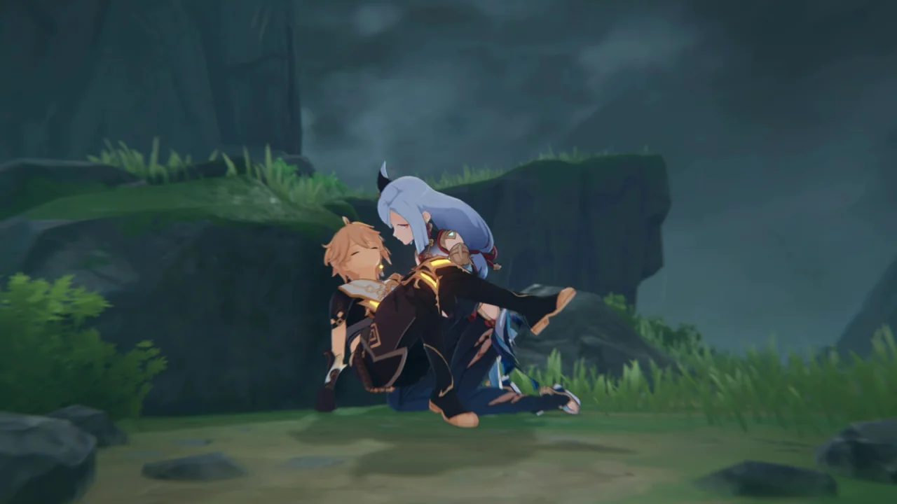

추락하는 여행자를 신학이 받아준다.

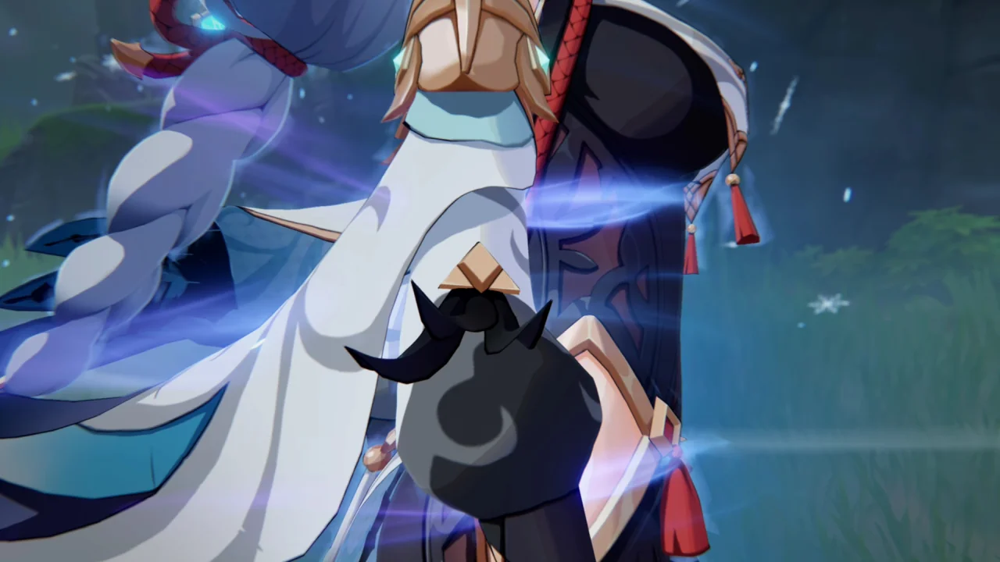

그동안 신학은 끊임없이 자신이 리월항의 일원이 될 수 있을까 고민하고 있었다. 그때 류운차풍진군이 했던 말이 있다. 자신의 힘을 남을 위해 쓸 수 있을 때, 그들의 일원이 된 것이라고.

그리고 신학이 지금, 자신의 힘을 쓰려고 한다.

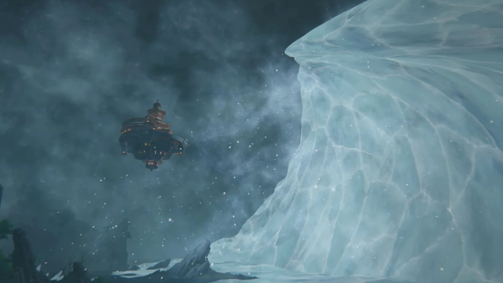

뱀장어가 불러일으킨, 군옥각까지 집어삼킬 수 있을 정도로 높은 파도를 순식간에 통째로 얼려버렸다.

와, 바닷물이라 잘 얼지도 않을 텐데, 저걸 통째로 얼렸다고?

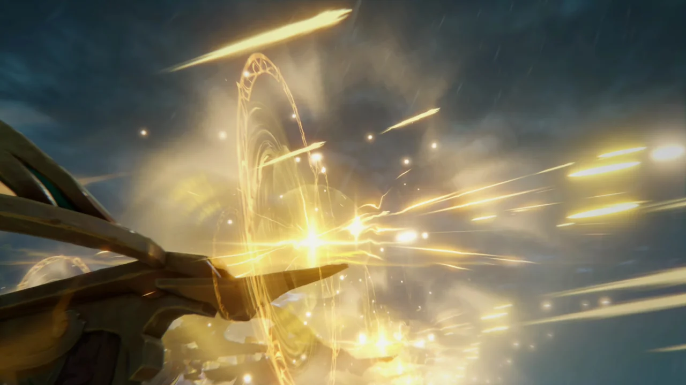

뱀장어가 당황해하는 사이, 일제 발사된 귀종기가 뱀장어를 흠씬 두들겨 팬다.

신나게 귀종기에 얻어맞고 바닷속으로 사라진 뱀장어를 쫒아 신학이 뛰어든다.

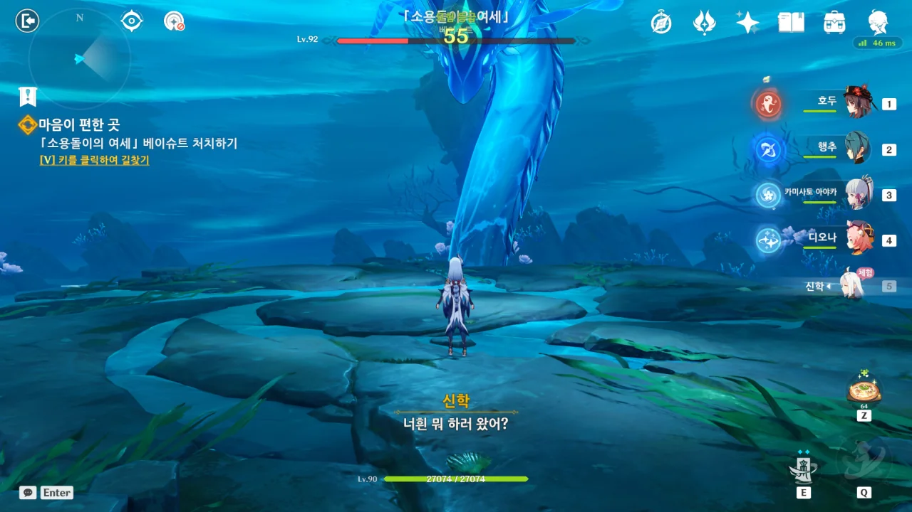

아니, 거기서 그냥 '신학은 실종되었다가 다시 돌아왔습니다, 해피 엔딩!' 이런 전개로 끝날 줄 알았는데, 여기서 베이슈트와 보스전을 한다고?

심지어 난 이때 스토리만 볼 생각으로 전투용 파티를 들고 다니지 않고 있었기에, 정말 당황했다.

그나마 다행스러운 점은 귀종기의 공격 때문에 보스의 체력이 고작 30% 정도밖에 남지 않았다는 건데, 그와는 별개로 보스의 공격 패턴이 너무 어렵더라.

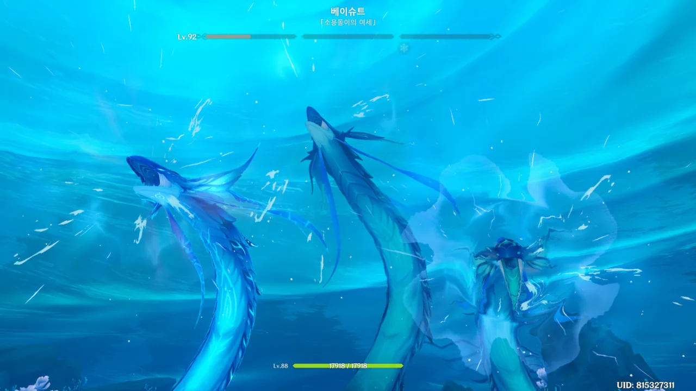

베이슈트의 머리가 하나인 줄로만 알고 있었는데, 누가 오셀의 아내 아니랄까 봐 머리가 세 개였다. 아니, 하이드라도 하나를 베어내면 두 개만 다시 돋아난다고...

게다가 정말 치사하게, 머리의 체력을 전부 깎으면 그 머리는 공격을 아예 하지 않을 줄 알았다. 그런데 머리 두 개의 체력을 다 깎아 놓으니, 극도로 적은 체력만 남은 채로 무적 상태가 되더라.

그래서 강제로 세 머리의 체력을 다 깎아야 했다.

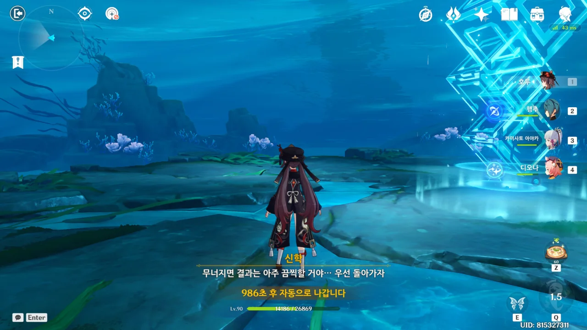

활 캐릭터가 없었던지라, 보스가 공격 후 제풀에 지쳐 머리를 내려놓을 때만 보스를 공격할 수 있었다.

호두의 레벨을 90까지 올려둬서 그런지, 궁 대미지가 아주 미쳐 날뛰더라. 보스가 고개를 들려고 하는 것 같아 다급히 호두 궁을 썼는데, 보스가 그걸 맞고 꽥 죽어버렸다.

&nbsp;

아야카만 레벨을 90으로 올리면 모든 주력 딜러의 레벨이 90이 될 것이다. 그런데 경험치 책이 없다.



응광이 "그렇게 오랫동안 관찰하셨는데, 결론이 났나요?"라고 하길래 누구에게 하는 소리인가 했더니, 류운차풍진군에게 하는 소리였다.

이 아줌마, 지금까지 전부 다 보고 있었던 거야?

> 정 안 되면, 군옥각 하나 더 부수죠, 뭐.

정말 패기가 넘치는 대사이다. 군옥각이 응광의 평생 숙원으로 알고 있었는데, 그걸 별것 아니라는 듯이 내다 버릴 수 있다는 듯이 말하는 저 패기를 보라.

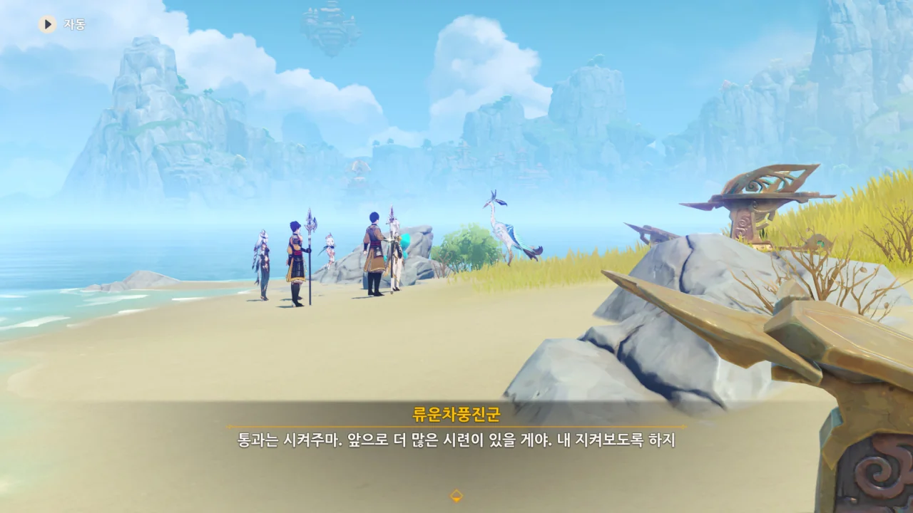

류운차풍진군의 시험은 일단 통과라고 한다.

그러니까, 리월항에 닥쳐온 위기를 정말 인간의 힘으로만 극복할 수 있는지 시험해 본 거지?



또 잔뜩 신이 나 신학의 옛날 썰을 좀 풀어보려다, 신학이 "그건 됐어요"라고 하자 금세 삐져서 돌아가 버리는 아줌마.

이 아줌마는 나이만 잔뜩 먹었지, 하는 행동은 완전 어린애와 다를 바가 없다. 아니, 감우도 그렇고 신학도 옛날이야기 하는 거 싫어하는 거 같은데, 그걸 꼭 이야기해야겠어?

이벤트에서 기계장치를 만드는 걸 보면 손재주 하나는 정말 좋은데...

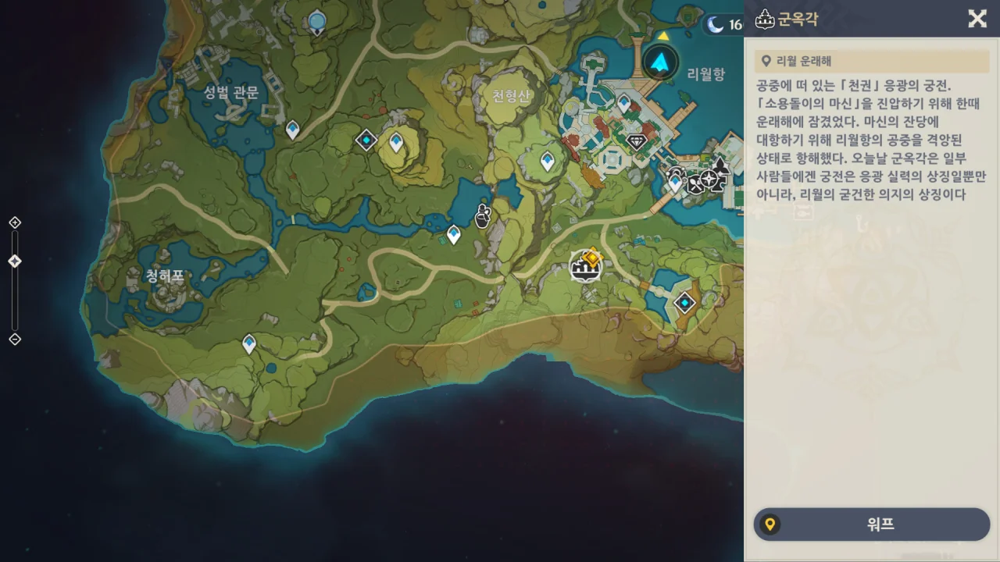

지도에 군옥각이 추가되며 군옥각으로 워프할 수 있게 되었다.

이제 리월항에 있는 NPC를 찾아 말을 걸지 않아도 된다.

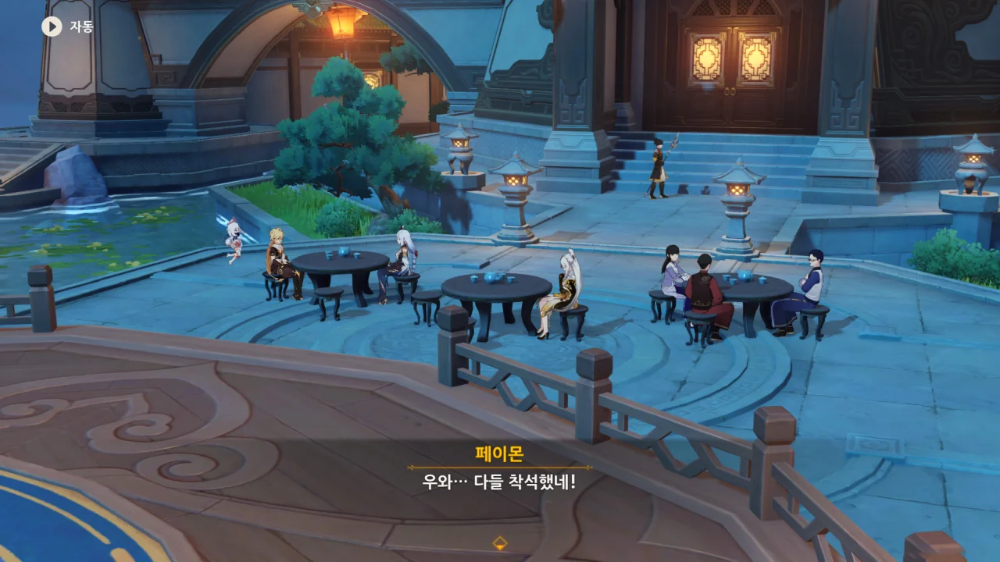

군옥각에서 연회가 열렸다.

내가 아는 연회는 사람이 가득가득 모인 그런 잔치 비슷한 건데... 뭐, 사람이 적을 수도 있지.

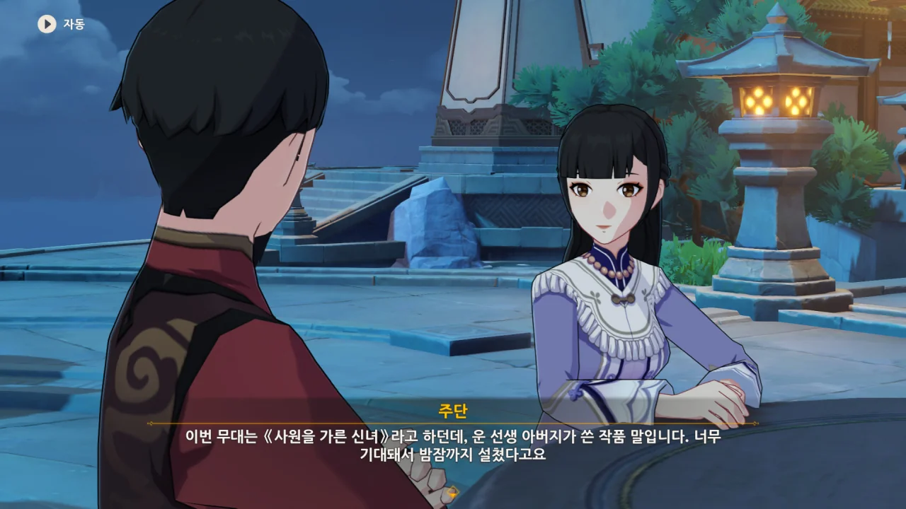

응? 여기서 운근이 공연한다고?

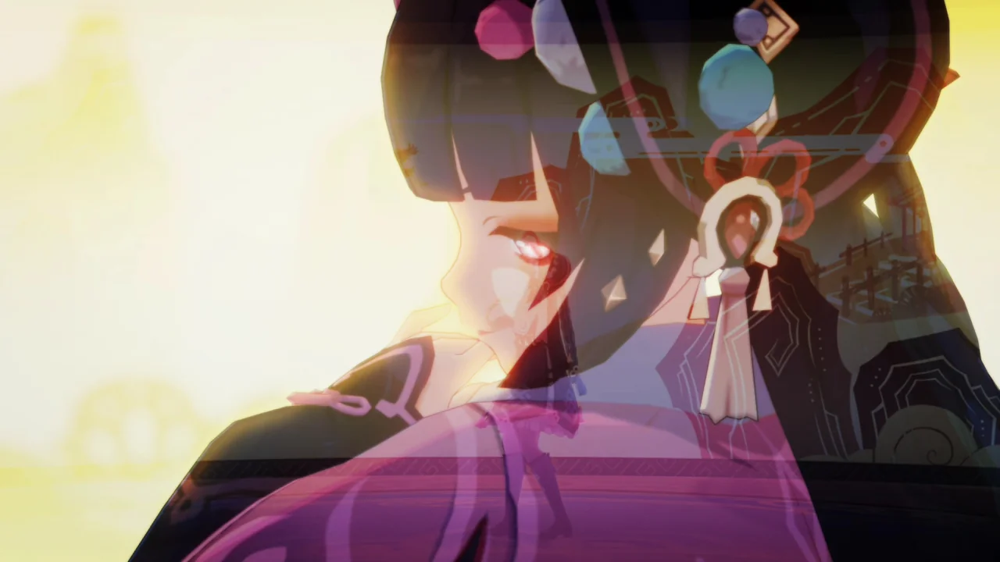

네! 맞아요!

&nbsp;

이 컷신은 게임 더빙 언어와 관계없이 무조건 중국 경극 가수가 부른 노래가 나온다고 한다.

다른 사람들은 이걸 '이이이잉'이라며 엄청나게 싫어하던데, 직접 들어보니 그리 나쁜 노래는 아니더라. 한국식으로 비유하자면 판소리와 밴드 연주를 잘 섞은 노래다. 노래 자체는 정말 괜찮았다.

하지만 사람들이 이걸 싫어한 이유는 하나겠지. 뜬금없이 중국어 노래가 나온다는 것.

목소리는 사람마다 다르다. A 성우와 B 가수의 목소리는 확연히 다르다. 그런데 그걸 무시하고 경극 가수 목소리를 넣었으니, 어울리지 않는다.

게다가 그 '이이이잉'이라는 표현도 딱히 틀린 말이 아니다. 중국어를 모르니 노래 가사가 '이이이잉'으로밖에 들리지 않거든.

&nbsp;

사실 이보다 더 심각한 건, 운근이 대기 중일 때에도 그 경극 가수의 목소리가 나온다는 것이다.

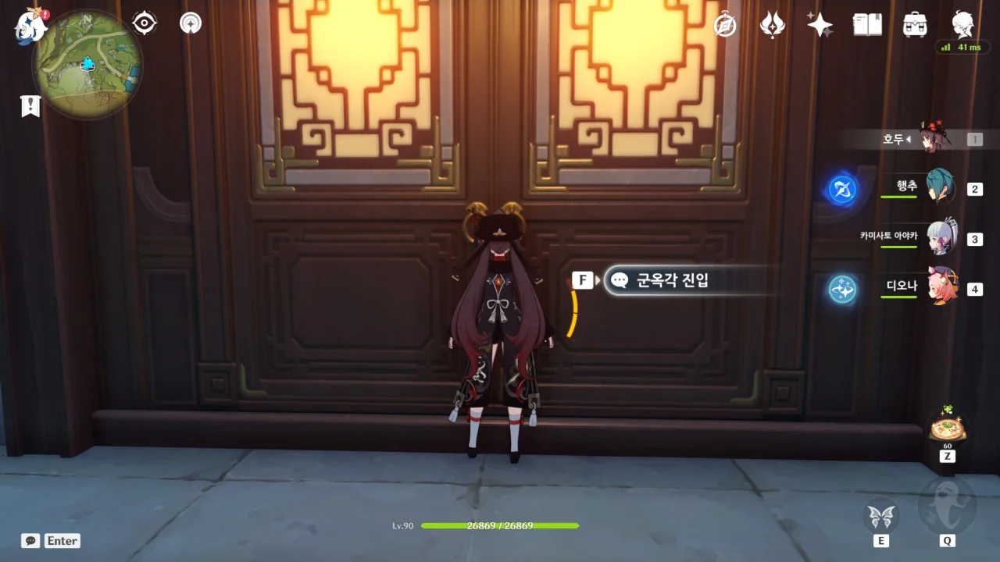

그래, 이제 고운각에 들어갈 수 있어!

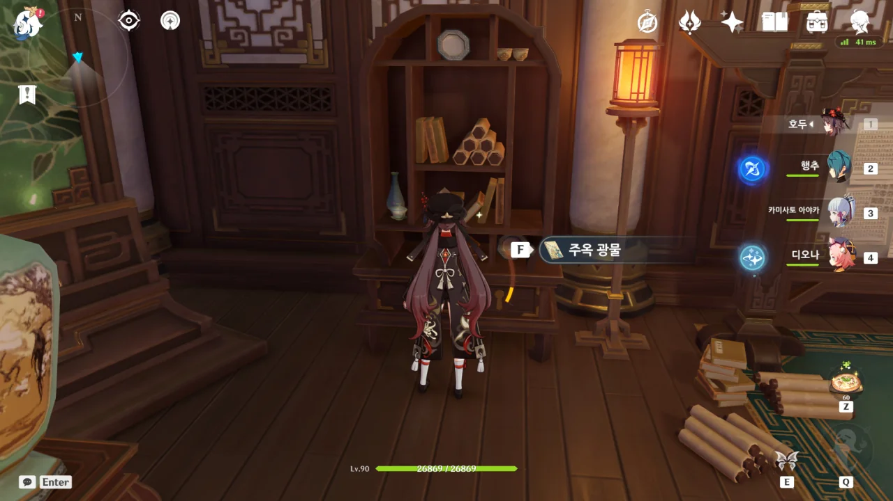

예전에 미처 먹지 못했던 책 두 권을 획득했다.

***

내친김에 다른 임무도 시작했다.

동작? 아, 설마 이 임무가 동작을 위한 신사를 재건하는 그 임무야?

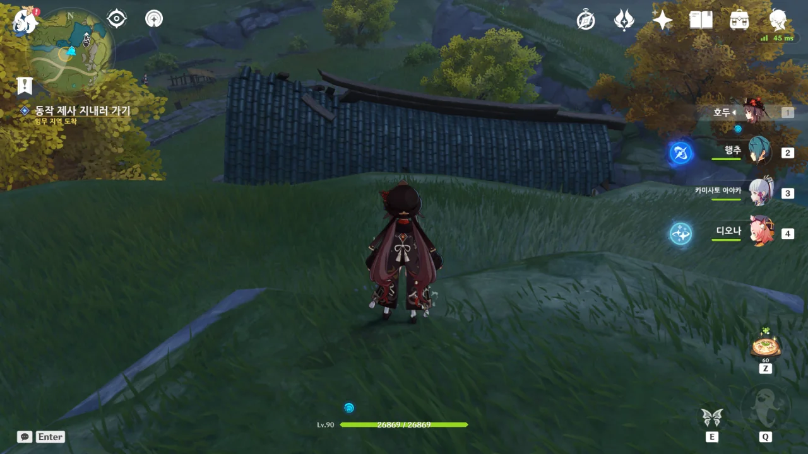

옛날, 원신을 같이 하던 사람과 함께 광물을 캐러 다닐 때, 이곳을 지나쳐 내려가 밑에 있는 보물 사냥단을 잡곤 했는데...

한동안 원신을 접었다 돌아오니, 이젠 원신을 하는 사람이 별로 없다.



소와 이야기하다 사람의 비명이 들리자 서둘러 달려가는데, 페이몬 이 녀석은 사람 목숨보다 먹을 것이 더 중요한가 보다.

이 비상식량이.





이 사람이 누군가 했는데, 옛날에 만났던, 선인을 자칭하던 사기꾼이었다.

개과천선이라도 한 것인지, 동작의 신사를 재건하려고 한다.

&nbsp;

정말 개과천선한 것인지는 지켜봐야 알겠지만...

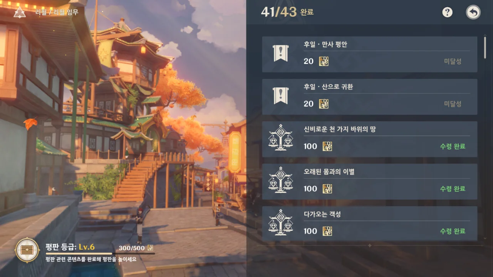

이 임무 역시 단발성 임무인 줄 알았는데, 아무래도 그 뒷이야기가 더 있는 것 같다.
