사실 이번에 무얼 먼저 할지 조금 고민을 했었다.

새로운 마신 임무인 '마신 임무 제4장 제1막, 흰 이슬과 검은 물결의 서시'를 할 것인가? 아니면 예전에 하던 나히다 전설 임무, '지혜의 주인의 장 제2막, 귀향'을 마저 할 것인가?

둘 다 매력적인 선택지였으나, 앞으로 다가올 미래를 위해 마신 임무를 하기로 했다.

여태껏 나온 이벤트 중 상당수가 선행 조건으로 특정 마신 임무 완료를 달고 나왔으니, 곧 있을 4.0 버전 이벤트 역시 그럴 것이라는 추측 때문이었다.



***

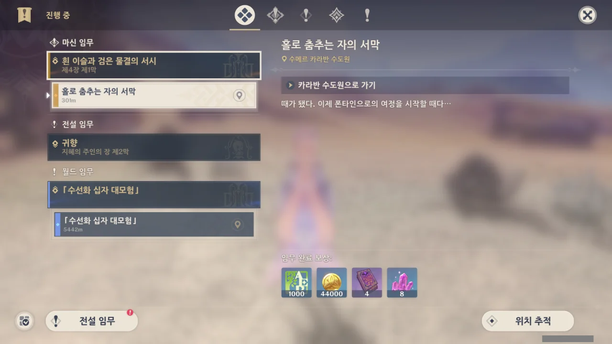

> 때가 됐다. 이제 폰타인으로의 여정을 시작할 때다...
{.bq}

그래, 폰타인으로의 여정을 시작할 때가 되긴 했지. 이미 폰타인의 모든 워프 포인트를 씹고 뜯고 맛본 후이긴 하지만.



수메르 마신 임무를 한 것이 그리 오래되지 않았다고 생각하고 있었는데, 돌이켜 보니 꽤 오래전 일이었다. 3.1 버전 업데이트가 작년 9월이니, 벌써 1년 전의 일이다.

수메르 마신 임무 중 제일 충격적이었던 때가 바로 그때였다.

도토레에게 세뇌된 도금 여단 용병이 나히다가 빙의한 캐서린의 등짝을 찌름과 동시에 여행자와 캐서린의 손이 맞닿았다. 이후 여행자가 본 건 정선궁에 갇혀있는 나히다에 빙의한 자신이었다. 여행자가 상황을 깨닫고 당황스러워하던 찰나, 조루리 공방에 있는 칠엽 적조의 비밀주와 연결된 스카라무슈가 여행자의 시야에 들어왔다. 스카라무슈가 정면을 똑바로 바라보며 '네가 보여'라고 말하자마자 여행자가 다시 자신의 몸으로 되돌아왔었지.

그때 스카라무슈가 본 건 여행자였을까, 아니면 나히다였을까? 아마 나히다였겠지?



모든 일이 끝나고, 나히다는 아카데미아를 재편해 다시 순수 학문 연구 기관으로 되돌려놓은 후, 수메르의 모든 정무를 손수 도맡아 처리하고 있다. 그 덕분인지, 수메르는 빠르게 제자리를 되찾아가고 있고.

다만 이 평화로움이 언제까지 지속될지는 아무도 모르는 일이다.



아니, 페이몬 이 녀석이 갑자기 여행자를 '여행자의 체질이 문제를 몰고 다니는 체질 아냐?'라며 음해한다.

그런데 말이야... 그렇게 따질 거라면 반대로 페이몬이 문제를 몰고 다니는 체질이라고 해도 되지 않아? 여행자와 페이몬은 항상 붙어 다녔잖아.



게다가 지금까지 공개된 페이몬의 행적은 여행자가 페이몬을 물에서 낚은 시점에서 시작하기 때문에, 여행자의 행적이 곧 페이몬의 행적이 된다. 페이몬이 그렇다고 여행자에게 여행자와 만나기 전의 이야기를 한 적도 별로 없지.

결국 제 얼굴에 침 뱉는 꼴이란 걸 깨달은 페이몬이 황급히 말을 돌린다.



데히야를 만났다.

> 여기저기 돌아다닌 게 아니라 문제를 해결하느라 바빴던 거지. 「여행」하고는 딱히 관계없는 일도 많았지만...

여행자가 「여행」하는 본래 목적은 '잃어버린 여동생을 찾기 위해서'였다. 하지만 어째서인지 방문하는 곳마다 굵직한 사건에 휘말리더라고.

이건 여행자가 문제를 찾아다니는 게 아니라, 문제가 여행자를 찾아온다고 하는 게 더 옳은 말일 것이다.

그런 주제에 정확히 무슨 문제를 해결했냐고 물으면 말문이 막힌다. 워낙 한 일이 많아서, 정확히 언제부터 언제까지 무슨 일을 해결했는지 정리가 하나도 안 되거든.



데히야는 사막에서의 호송 임무를 무사히 끝마치고 그 결과를 보고하기 위해 카라반 수도원에 왔다고 한다.

여행자가 폰타인으로 갈 예정이라고 하자, 그 말을 누군가가 엿듣는다. 생김새로만 보면 폰타인 사람인데...





여행자가 떠날 거라곤 전혀 예상하지 못한 것인지, 적잖이 당황해하는 데히야.

데히야가 여행자에게 정이 잔뜩 든 건지, 아니면 수메르에 머무르고 있는 여행자의 모습에 익숙해진 건지 잘 모르겠다.

여행자가 수메르를 떠나는 게 못내 아쉬운지, 다른 용병 형제들과 함께 폰타인으로 가는 길을 호송해 주겠다고 제안한다.

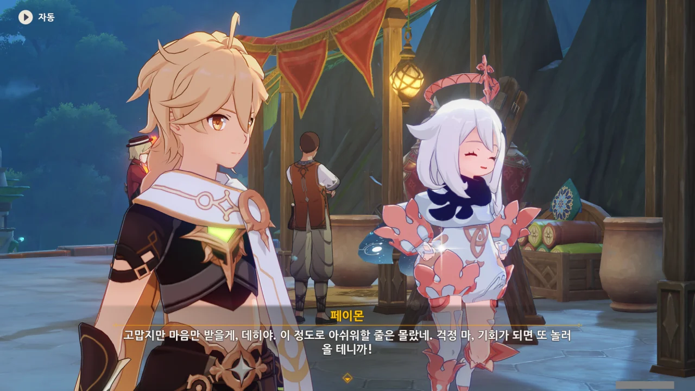

하지만 마음만 받기로 했다.

여기서 헤어진다고 영영 헤어질 것도 아니잖아? 분명 이벤트 때문에 수메르에 볼일이 생겨 다시 수메르에 오거나, 반대로 데히야가 폰타인으로 올 일이 생기겠지. 몬드에서 축제가 열렸는데 멀리 수메르에 있던 캐릭터들이 몬드에 방문한 적도 있고 말이다.

앞으로의 일은 한치도 모르는 법이다.

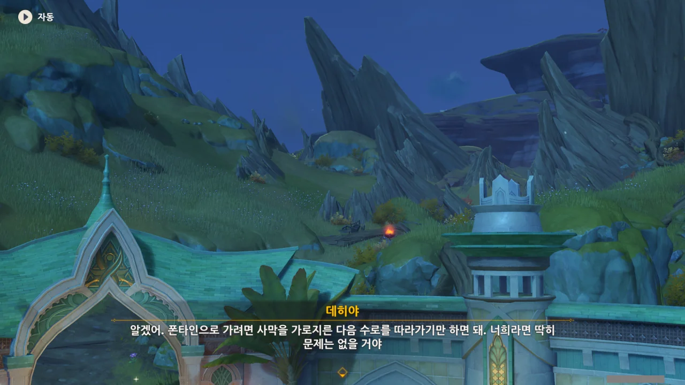

수메르에서 폰타인으로 가려면 사막을 가로질러 수로를 따라가면 된다고 한다.

아까도 말했지만, 폰타인 지도 밝힌다고 이미 가봤다. 

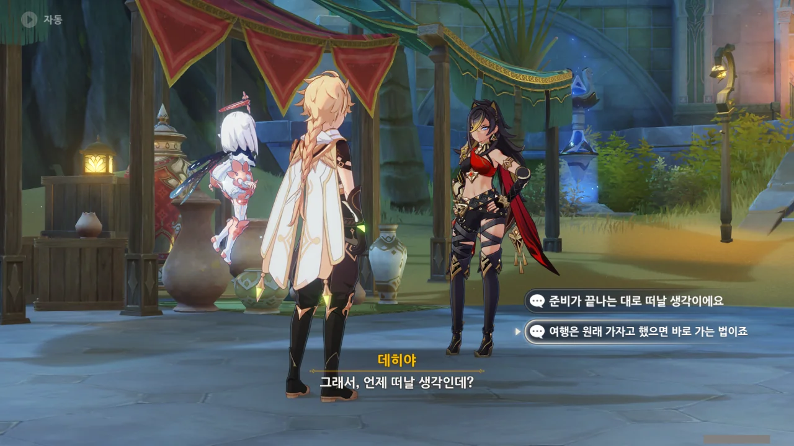

원래 이런 일은 '할까?'라는 마음이 들었을 때 곧바로 해버려야 한다. 내가 '폰타인 지도 좀 밝혀볼까?'라고 생각하자마자 곧바로 폰타인으로 향한 것처럼 말이다.



지금 당장 떠난다고 하니까 황급히 아직 못 먹어본 음식 리스트를 떠올리는 페이몬. 역시 먹보답다.

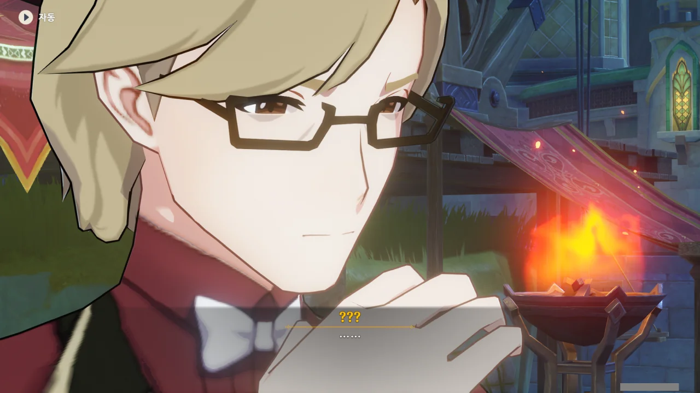

이 남자는 대체 누구길래 여행자의 대화를 엿듣고 있는 걸까?

게다가 대화를 듣다 말고 어디론가 가버리기까지 하더라고.



어차피 이벤트 등을 통해 다시 보게 될 운명인데, 송별회를 할 필요가 과연 있을까?

수메르를 구한 것도, 어쩌다 보니 구한 것이라, 여행자가 수메르의 영웅이라는 자각은 전혀 들지 않는다.

> 역시 영웅은 조용히 퇴장하는 쪽을 좋아하나 보네.

저 말을 듣자마자 생각난 건 다크 나이트에서 하비 덴트가 한 말이었다.

> 영웅으로 죽던가, 아니면 스스로 악당이 되어가는 걸 깨달을 만큼 오래 살던가.
{.bq}

물론 데히야가 그런 의도로 한 말은 아니겠지만, 저 대사를 머릿속에서 떨쳐내기가 쉽지 않더라고.



나히다에게 아무 말도 하지 않고 떠나도 아마 괜찮을 것이다. 일 하느라 바쁠 나히다를 귀찮게 할 필요는 없지 않겠는가.

정 필요하다면, 꿈사과 제도에서 그랬듯이, 원격으로 대화할 수도 있고 말이다.



그래서 데히야와 헤어지는 걸 마지막으로 수메르를 떠나게 되었다.

페이몬이 "잘 있어, 수메르!"라고 했지만, 내일이면 또다시 일일 임무를 하러 수메르로 올 걸 생각하니, 조금 웃겼다.



검은 화면이 사라지자 폰타인을 바라보고 있는 워프 포인트에 어느새 도착해 있었다.

아무런 대사나 컷신도 없이 정면을 하릴없이 바라보고 있는 걸 보니, 아무래도 제작진이 의도한 구도는 다음과 같았던 것 같다.

1. 검은색 화면에서 워프 포인트로 이동한다.
2. 검은색 화면이 끝난 후, [이 글](https://tetralog.onrender.com/b/game/genshin-impact/fontaine-expedition)에 나온, 워프 포인트로 이동했을 때 나온 컷신이 재생된다.
3. 컷신이 끝나고 자연스럽게 캐릭터가 폰타인을 바라보는 모습이 나온다.

그런데 내가 폰타인 지도를 밝히기 위해 먼저 여길 와버린 바람에, 컷신만 따로 재생이 되어버렸고, 그래서 검은 화면을 통해 여기 왔을 땐 이미 재생한 컷신이 생략된 것으로 보인다.

의도치 않게 몰입감이 떨어져 버렸다.

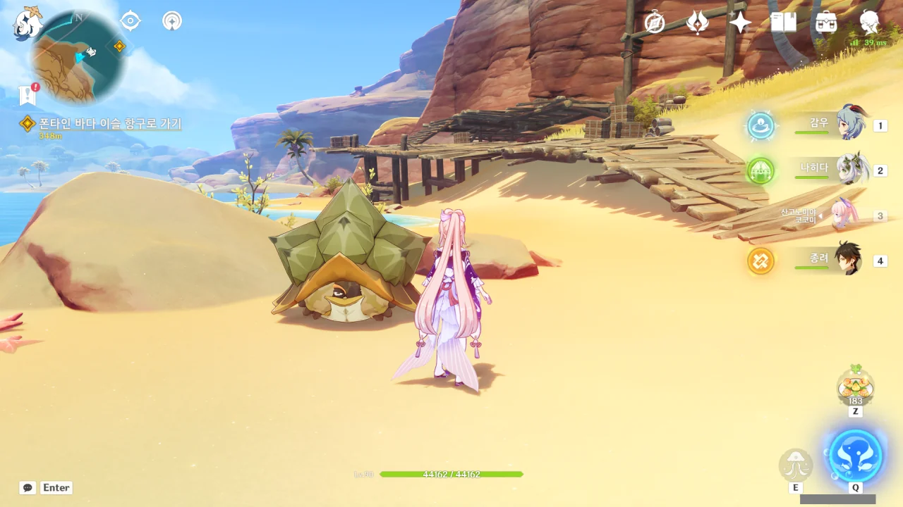

이 텐트 거북은 언제 잡을 수 있을까?

위키를 읽어보니 텐트 거북은 모든 속성에 대한 내성이 엄청나게 높게 설정되어 있어서 그 어떠한 공격에도 대미지를 입지 않는다고 하더라. 종려 궁을 통한 바위 원소 강부착도 불가능했다.



보자마자 뭔가 선진적이라는 느낌이 확 와닿는 건축 양식이다. 게다가 시계태엽이라니!

시계태엽을 중심으로 발전한 문명을 다루는 장르를 '클락 펑크' 혹은 '다빈치 펑크'라고 부른다고 하더라. 그러면 폰타인도 '클락 펑크', '다빈치 펑크'인 걸까?





어허, 단순히 관광이라니. 여행자의 「여행」은 여동생 찾기가 목적이라고.

물론, 아무리 찾아봐도 여동생의 행방에 대한 단서를 코빼기도 찾아볼 수 없어, 그냥 유유자적 여행을 다니는 모양새가 되긴 했지만, 그래도 여동생을 찾는다는 목적은 여전히 그대로이다.

물의 신은 일단 한 나라의 지도자이니, 아는 것이 많을 것이다. 그러니 여동생에 대한 건 물의 신에게 물어보는 게 제일 좋겠지.

사실, 그 생각으로 지금껏 만난 바람의 신, 바위의 신, 번개의 신에게 여동생의 행방을 물었다. 하지만 다들 하나같이 '모른다', '말할 수 없다'라는 말만 하더라고. 그래서 '신에게 물어도 소용이 없는 건가'라고 생각할 때, 풀의 신이 '그래도 아는 정보가 조금 있다'라는 말을 하는 게 아닌가. 그래서 '신이라면 뭔가 알고 있지 않을까'라는 생각이 다시 고개를 들었다.

따지고 보면 네 명의 신 중 셋이 전부 모른다고 답했는데, 이런 생각이 들다니. 이게 희망 고문이라는 걸까? 풀의 신에게 그나마 대답을 들었으니, 앞으로도 대답을 들을 수 있을 거라는 희망을 절대 버리지 못할 테니까...



일반적으로 「개성 있다」라는 말은 '괴짜' 혹은 '미친 녀석'을 곱게 돌려 말하는 말이다.

나, 갑자기 불안해졌어...

일단 분위기 파악을 위해, 주변 사람들의 대화를 엿들어보기로 했다.

이건 도청이 아니라 상황 파악을 위한 정보 습득입니다.



그냥 연극 이야기를 하고 있는 것 같지만, 대화 곳곳에 「」가 붙은 단어가 있는 걸 보아, 저 단어들에 다른 뜻이 있는 것 같다.



아, 엿듣는 걸 들켜버렸다.





뭔가 좀 이상한데.

'심판'이라는 말이 나온 걸 보면, 최근 어떤 재판이 있었던 것으로 보인다. 그런데 그걸 도대체 왜 연극처럼 말하는 거지?

게다가 그걸 지적하자, '현실도 어쩌면 누군가가 연기하고 있는 걸지도 모른다'라는 생뚱맞은 말을 한다. 게다가 재판에서 중요한 게 진술의 진위나 공명정대함 같은 게 아니라, 이야기의 재미라고?

&nbsp;

너무 많이 이상하다. 재판에 있어 가장 중요한 건 아까 말했다시피, 진술의 진위와 공명정대함, 정의실현 같은 것이다. 분명 캐릭터 돌파 소재 중 물 원소 돌파 소재인 '순수한 청금석'의 플레이버 텍스트에 이렇게 적혀있었던 것 같은데.

> 나의 이상에는 한 치의 혼탁함도 존재하지 않는다.
> 난 너를 바로잡을 것이다. 이곳에서 인간은 심판받지 않는다. 판결을 내릴 수 있는 건 오직 법률과 재판정뿐이다.
> 심지어 판결의 대상은 나일 수도 있다. 나의 숭고함과 순결함을 찬양하라.
{.bq}

폰타인은 물의 나라이니, 공명정대한 재판이 이뤄지고 있을 거라 생각했는데... 실망이 크다.

&nbsp;

사람들이 평소 이렇게 생각하고 다니는 걸 보아, 폰타인에서도 여행자는 불공정한 법이나 지배자의 탄압으로 인해 현상수배를 당하고 쫓길 운명인가 보다.

여행자 인생이 뭐 그렇지. 어딜 가나 지명수배, 현상수배를 당하지 않던가.

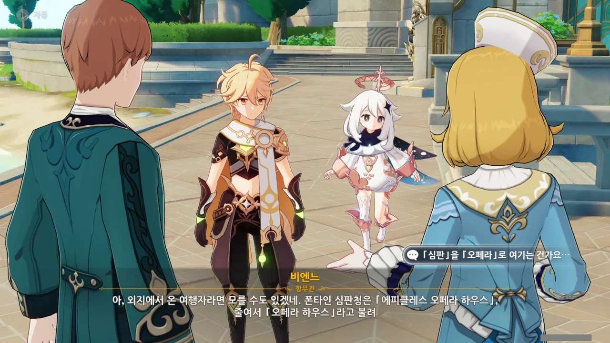

그래, 심판의 장소가 오페라 하우스인 건 충분히 그럴 수 있다고 생각한다. 장소의 재활용, 뭐 그런 거라고 생각하면 되니까. 하지만 심판을 오페라 공연처럼 여기는 건 정말 이상하다.

설마 폰타인 사람 모두가 이렇게 생각하는 건 아니겠지?



사건 뒤에 숨겨진 감동적인 이야기? 그런 게 있을 리 없잖아.

판결을 내림에 있어 고려해야 할 건 딱 두 가지밖에 없다. 법 그 자체와, 법이 만들어진 의도. 딱 이 둘만이 중요한 것이다. 감동? 재미? 그런 건 재판에 있어 전혀 쓸모없는 거라고.



심판의 공명정대함은 최고 심판관 느비예트와 물의 신이 창조한 「계시의 판결 추기 장치」 덕분에 걱정할 필요가 없다고 하는데... 왠지 못 미덥다. 고작 그런 거로 충분하다고?

이건 아마 내가 사람의 하는 판결도, AI가 하는 판결도 전부 미덥지 못한 시대에 살고 있어서 그런 걸지도 모른다.



그래, 중요한 건 물의 신을 만나 여동생의 행방을 묻는 것이다.

여동생의 행방만 알 수 있다면, 폰타인에서 재판이 어떻게 이뤄지던 내 알 바가 아니지.





물의 신의 이름은 '푸리나'라고 한다.

푸리나는 항상 오페라 하우스에 있는데, 거기서 일어나는 재판을 보는 게 그녀의 '제일 큰 취미'인 것으로 보인다.

다만 푸리나가 폰타인의 '인기인'인지라, 푸리나를 만나려면 한참 전에 예약을 해야 하고, 그날의 「스케줄」에 따라 만날 수 있기도, 없기도 하다고 한다. 분명 「스케줄」은 재판의 스케줄을 말하는 거겠지.

왜 난 여기서 '아, 몰라! 난 이 재판 먼저 볼 거야!'라며 약속을 제멋대로 파투 내는 철부지가 생각나는 걸까?





"말과 행동에 과장스러움이 있다"? 저번에 나히다가 「개성 있는 녀석」이라고도 했잖아. 그럼 피슬 아냐?

그리하여 내 머릿속 푸리나에 대한 이미지는 '물 피슬'이 되어버렸다. 느비예트의 이미지가 '푸리나 옆에서 침을 초당 1회 뱉는 물 오즈'가 된 것은 덤이다.



게다가 「마스코트」라고? 분명 저번 이벤트에서 이디이야가 마스코트에 대해 이렇게 이야기했는데.

> 아무 일도 안 하고 일은 다른 사람에게 다 맡기는 안일한 캐릭터

음, 마스코트 맞네!



물의 신에 대해 험담을 하면 끌려가 재판을 받는 건가? 이 나라는 언론의 자유도 없구나!

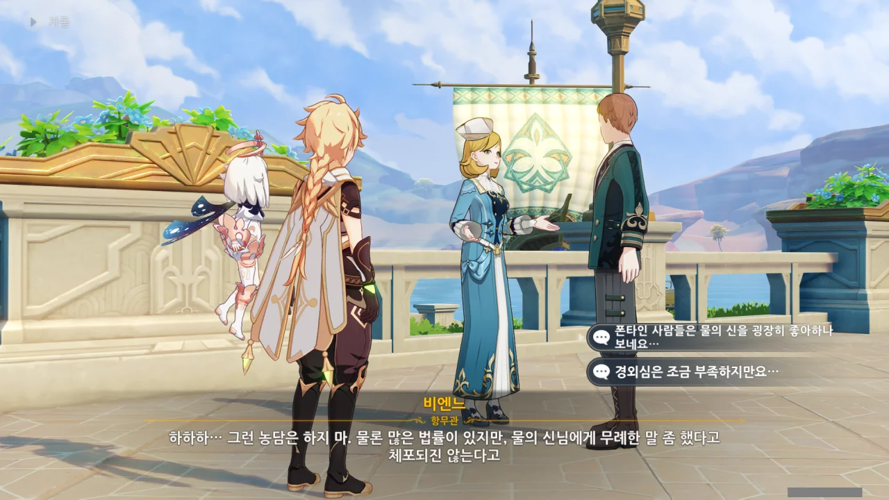

아, 그냥 농담이었어? 그건 다행이네...

그래도 사람들이 물의 신에 대해 농담도 할 정도로 물의 신에 대해 친근하게 느낀다는 것은 잘 알겠다.



물의 신을 만날 수 있는 것은 좋은데, 예약을 해야 하는 데다가 언제 만날 수 있을지조차 확신할 수 없다는 사실을 알게 되었다.

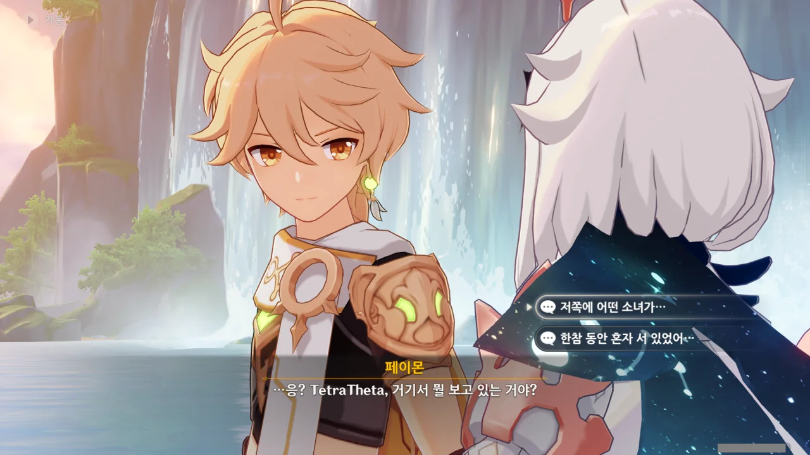

아까부터 여행자가 자꾸 다른 곳을 보고 있는 것 같다고 생각했는데, 정말이었다.



카메라 구도가 아무리 봐도 물에 뛰어들려고 하는 모습처럼 보이는데... 고작 저 정도 깊이에 빠져 죽을 생각은 분명 아닐 것이다. 대체 무슨 의도지?

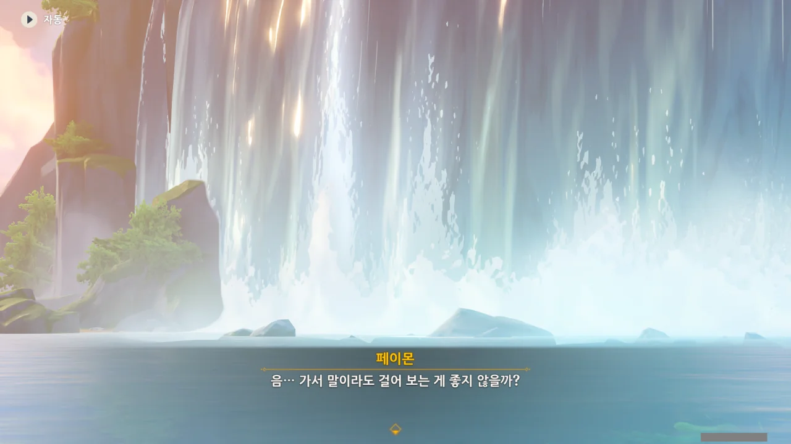

그래. 일단 가서 말이라도 걸어보면 뭐라도 알 수 있지 않을까?

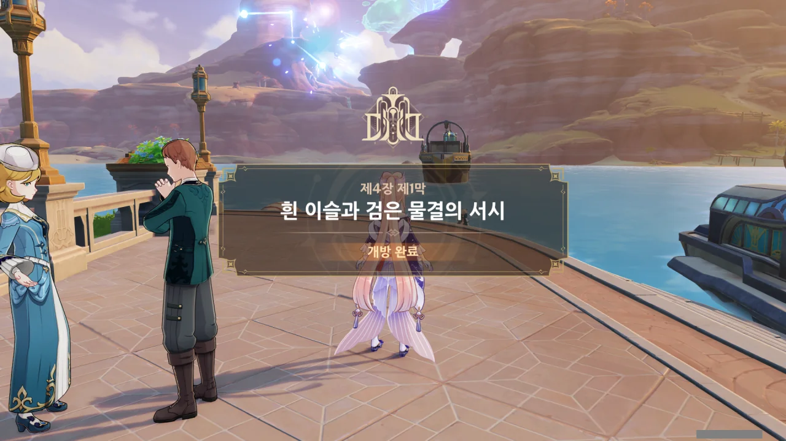

이리하여 마신 임무 제4장 제1막, 흰 이슬과 검은 물결의 서시가 본격적으로 시작되었다.



난 진짜 이 문화를 이해하기 힘들 것 같아...

아무튼, 넌 여기서 뭐 하니.



물가에 멍하니 서있는 소녀에게 말을 걸어본다.

'물가의 소녀'라고 해봤자, 이미 저 캐릭터의 이름이 리넷인 것 정도는 이미 알고 있다. 왜냐고? 4.0 버전이 시작되자마자 모든 사람들에게 리넷을 공짜로 뿌렸거든... '이게 뭐지?' 하고 버튼을 눌렀는데 짜잔, 리넷이 나왔네요!



그 괜찮다는 말, 정말 괜찮은 사람도 그런 말을 하고 안 괜찮은 사람도 그런 말을 하더라.

그와는 별개로, 이렇게 이 각도에서 리넷을 보니, 리넷의 볼만 볼록 튀어나온 것처럼 보인다. 마치 누가 보면 삐져서 볼을 뾰로통하게 부풀리고 있는 줄 알겠어.

이상하다... 분명 일러스트에서는 얼굴이 이렇게 통통하진 않았던 것 같은데...

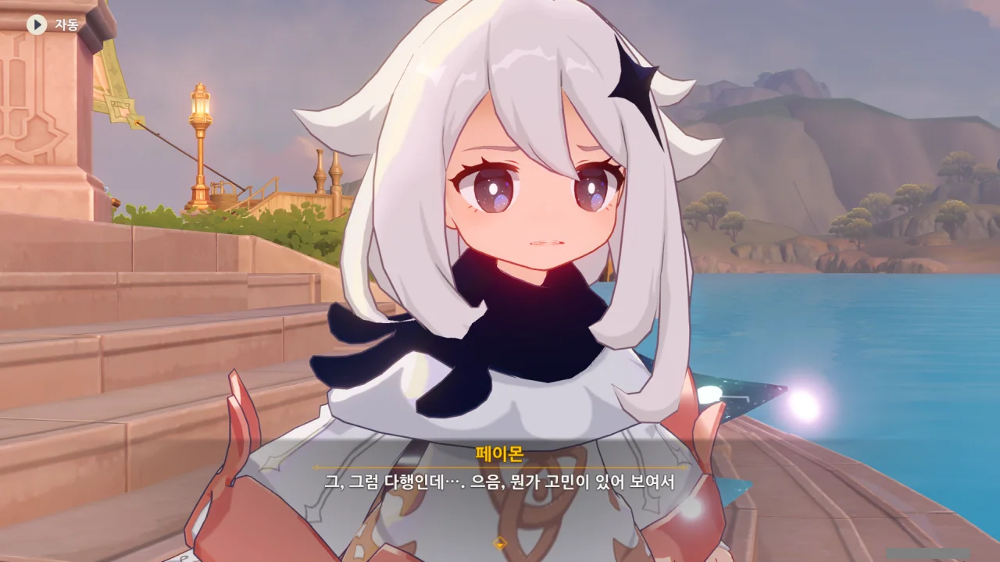

누군가가 아무 말 없이 멍하니 먼 곳을 바라만 보고 있는 걸 본 사람이라면 다들 누구나 '아, 저 사람은 무슨 고민이 있구나'라고 생각할걸?



저 언덕? 설마 저 멀리 보이는 언덕을 말하는 것일까? 하지만 거긴 수메르 땅인데? 아무리 봐도 수평선 너머에 있는 저 '언덕'들은 수메르에서 자주 볼 수 있는 유형의 지형이지 않은가.

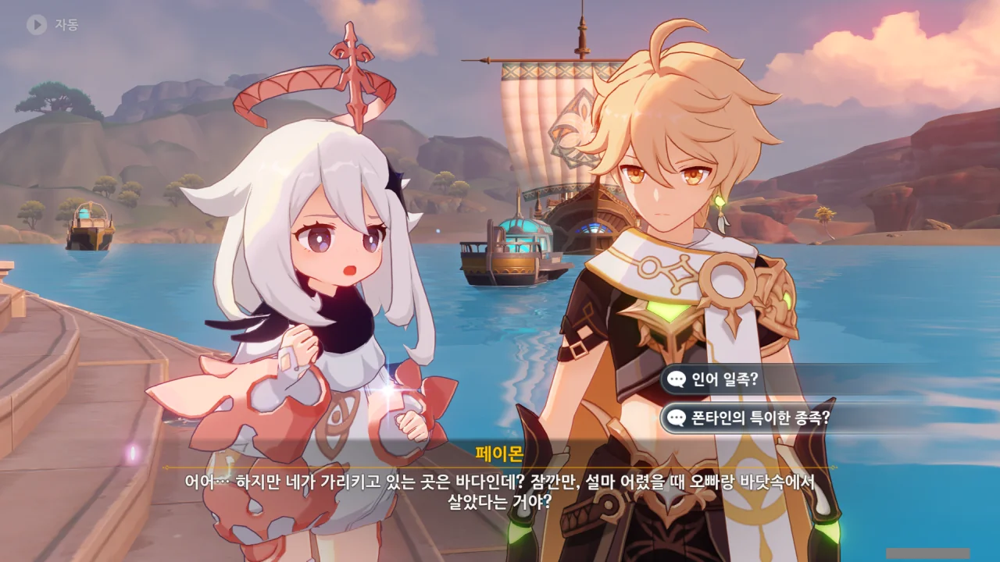

아, 그렇게까지 멀리 보고 있던 것이 아니었구나. 리넷이 바라보고 있는 건 바다에 잠긴 땅이었다.

고양이 귀와 고양이 꼬리가 있는 것으로 보아 리넷은 고양이 수인으로 보이는데... 폰타인의 고양이 수인은 물속에서 살 수 있는 것인가? 어, 그러면 친수성 고양이인가.

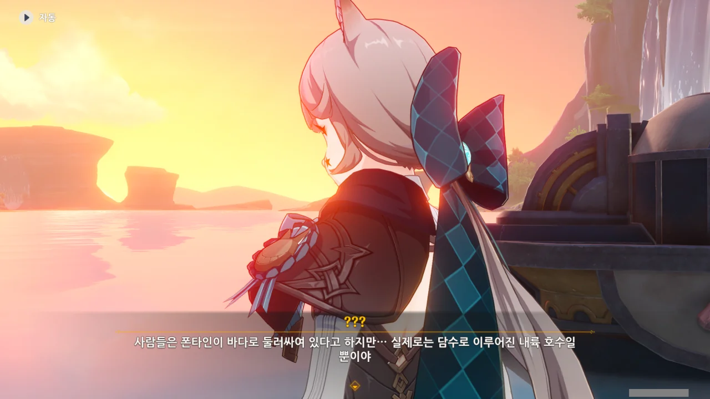

폰타인의 '바다'는 사실 민물이라고 말하는 리넷. 폰타인의 육지만 말한다면 리넷의 말이 맞겠지만, 바다 위로 솟아오른 폰타인 지형 전체를 놓고 본다면 폰타인은 분명 바다로 둘러싸여 있는 것이 맞다.

폰타인에서 바다로 흘러들어 가는 민물의 양이 워낙 많기 때문에 이대로 가다간 바닷물도 민물처럼 염도가 극도로 낮아지는 것이 아닐까 순간 걱정되었지만, 바다가 워낙 넓어야지. 아마 그 넓은 표면적에서 증발하는 물의 양도 만만치 않을 것이다. 아마 내 걱정처럼 바닷물의 염도가 낮아질 염려는 아마 없을 것이다.



그러니까 리넷과 리넷의 오빠가 놀던 언덕이 지금은 수몰되었다는 이야기네.

폰타인에서 댐을 만들었다는 이야기는 듣지 못했는데, 이게 어찌 된 일일까? 설마 폰타인이 점점 가라앉고 있는 것일까?



리넷이 갑자기 뜬금없는 말을 한다.

> 바다는 조금씩 우리의 기억을 삼키고 있어...
> ... 그리고 머지않아 우리 차례가 오겠지

첫 문장은 그런가 보다 하겠는데... 두 번째 문장은 금방이라도 물에 뛰어들 것처럼 느껴진다.

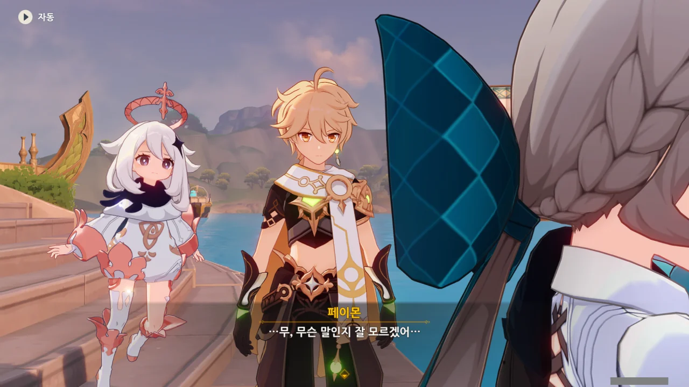

그... 혼자만 아는 이야기는 하지 말고 내게도 설명을 좀 해줘...



리넷의 오빠로 보이는 사람이 나타났다.

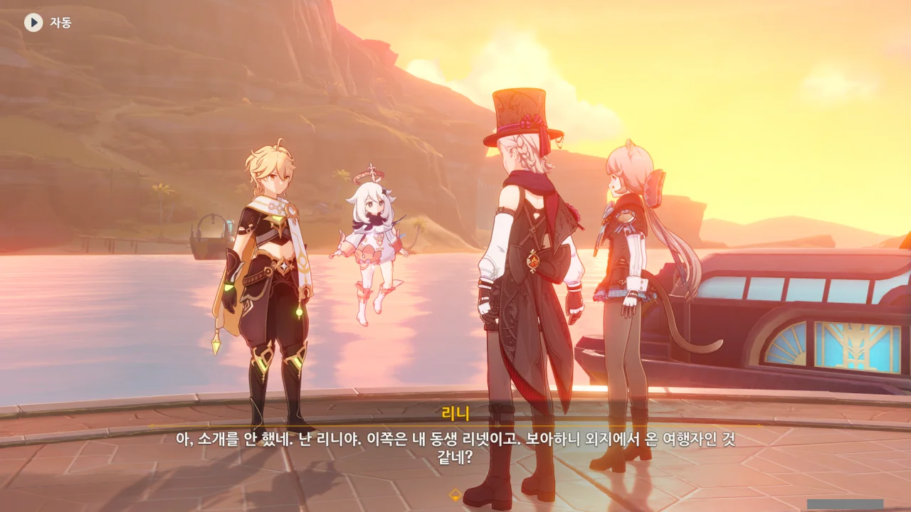

리넷의 오빠 이름은 리니라고 한다.

둘의 이름이 굉장히 헛갈린다. 누가 리넷을 리니라고, 리니를 리넷이라고 불러도 그냥 자연스럽게 넘어갈 수 있을 정도야. 아야카와 아야토는 이름만 들어도 확실히 성별을 구분할 수 있었는데, 이 둘은 둘 다 여성형 이름처럼 보인다.

그런데 이 둘은 혹시 의남매인 걸까? 리넷은 확연히 고양이 귀와 고양이 꼬리가 있지만, 리니에게선 그런 모습이 전혀 보이지 않는다. 친남매라면 분명 리니에게도 고양이 귀와 고양이 꼬리가 있을법한데...



아무튼, 서로 통성명을 한다.

그래, 리니가 리넷의 오빠라면 리넷이 대체 무슨 말을 한 건지 설명을 해줄 수 있을지도 모른다.

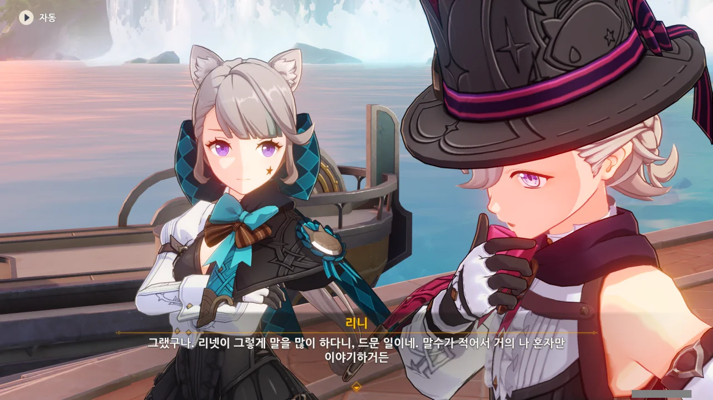

엥? 리넷이 평소에 말수가 적다고? 방금 전까지만 해도 대화 비슷한 걸 했는데?

리넷이 팔짱을 끼고 리니를 못마땅하다는 듯이 쳐다본다. 설마 리넷은 자신에 대해 떠벌이는 걸 별로 좋아하지 않는 걸까?



솔직히 말해, 두 번째 선택지인 '네가 항상 내 대사를 가져가서 그런 거잖아'를 매우 고르고 싶었지만, 그러면 노골적으로 페이몬에게 핀잔주는 것처럼 보일까 봐 첫 번째 대사를 골랐다.

&nbsp;

게임 외적으로 보았을 때 여행자는 '과묵한 주인공' 유형에 속한다. 주인공이 말을 하지 않으면 그만큼 플레이어가 주인공에 몰입하기 쉽기 때문에 널리 쓰이는 기법이다.

하지만 정말로 주인공이 아무런 말도 하지 않으면 이야기의 진행에 큰 지장이 생기기 때문에, 게임에서는 다른 방식으로 주인공이 '대화'를 했음을 표현한다.

주인공이 아무런 말도 하지 않았음에도 NPC가 찰떡같이 이해해서 알아서 설명하고 납득하게 하거나, NPC가 주인공의 '표정'을 읽고 혼자서 설명한 후 대화를 진행하게 하기도 한다.

아예 주인공과 항상 함께 붙어 다니는 동료 NPC를 만든 후, 그 동료가 주인공이 할 말까지 전부 다 하도록 만드는 경우도 있다. 데스티니 시리즈가 그러했고, 원신도 그렇다.

옆에서 대화를 보조해 줄 동료조차 없는, 진정한 '과묵한 주인공' 유형은 게임 내적으로 보았을 때, 적 입장에서 제일 두려운 주인공 유형이기도 하다.

생각해 보라. 세이브 & 로드와 플레이어의 컨트롤 덕분에 죽지도 않는 적이 수많은 아군을 혼자서 모조리 도륙 낸 후, 자신에게 아무런 말없이 묵묵히 다가오는 모습을. 나라면 그 자리에서 빠르게 기절할 자신이 있다.

그 대표적인 예가 바로 하프라이프 시리즈의 고든 프리맨 되시겠다. 둠 시리즈의 둠가이 역시 고든 프리맨처럼 '정말로 단 한마디조차 하지 않는 주인공' 유형에 속했으나, 둠 이터널의 과거 회상 컷신에서 "찢고... 죽인다!"라는 대사를 해서 '말을 거의 하지 않는 주인공' 유형으로 변경되었다.



> 나도 가끔은 오빠가 너무 말이 많다고 생각해.

뾰로통한 표정으로 저런 말을 하니까 리넷이 너무 귀엽게 보인다. 와!

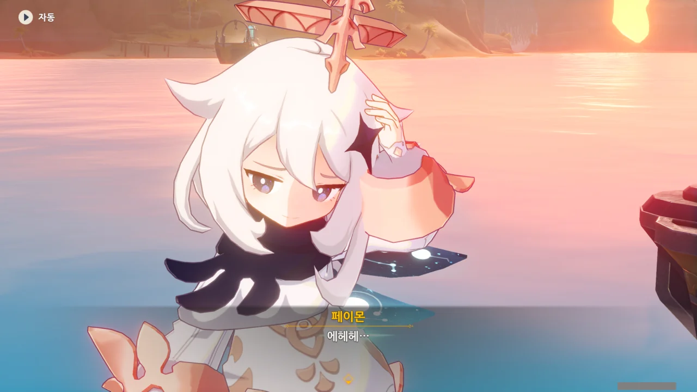



에헷떼난다요!



아까 리넷이 말한 것이 대체 뭐였는지 물어보자, 폰타인에서 오래전부터 떠돌던 예언이라고 한다. 예언?

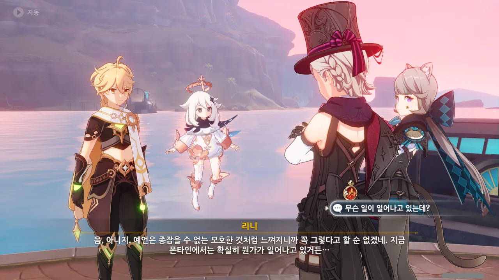

다만 그게 진짜 예언처럼 종잡을 수 없는 모호한 것이 아니라, 실제로 폰타인에서 무언가가 일어나고 있는 중이라고 한다.

내 직감이 속삭이고 있다. 여행자 역시 그 일에 휘말릴 것이다.



응? 방금 우리 통성명하지 않았나? 그건 인사가 아닌 거야?



그래도 인사를 두 번 해서 나쁠 것은 없지. 리니는 여행자와는 악수를 하고, 페이몬에게는 그저 등을 툭툭 두드리기만 했다.



「에티켓」...? 「쓸모」...?

원신에서 단어 주변에 「」가 붙어 있으면 그건 보이는 그대로의 뜻이 아닐 확률이 높다는 의미이다. 은어라고 해도 좋을 정도이다.

나 굉장히 불안해졌는데.



푸리나를 만나기 위해 오페라 하우스로 가는 길을 안내해 달라고 부탁했다. 마침 리니도 그곳에 볼 일이 있어 흔쾌히 응해주었고.

그런데 '마무리할 일'이란 대체 무엇일까?
