한 열몇 걸음 걸었을까. 정말로 '잠깐' 따라간 셈이다.

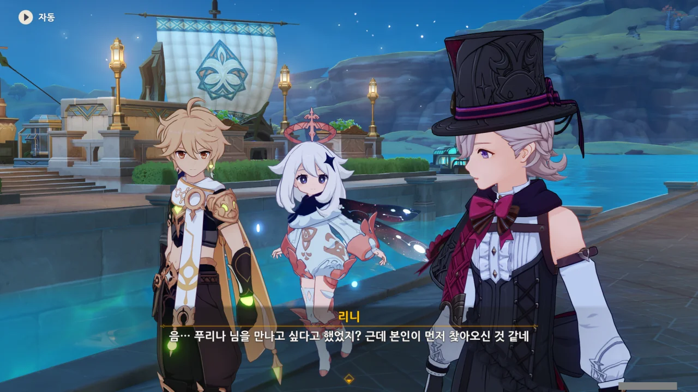

리니가 갑자기 말하길, 푸리나가 이곳에 찾아왔다고 한다.

아까 분명 푸리나는 항상 오페라 하우스에 있다고 하지 않았어? 대체 무슨 바람이 불어 여기까지 온 거지?



경호대원으로 보이는 사람들이 어디선가 나타나 달려오더니, 사열하듯이 늘어선다.



느긋하게 내려와 다른 자세를 취하는 이 사람은 남들과 다르게 혼자 튀는 옷을 입은 것으로 보아, 경호대의 지휘관으로 추측된다.



푸리나로 추측되는 사람이 높은 곳에 서서 아래를 내려다본다.

기대했던 것보다 키가 좀 많이 작다. 아마 벤티 옆에 세워두면 둘의 키가 비슷하지 않을까?

저번에 생각했던 것처럼, 푸리나가 정말 '물 피슬'이라면 오히려 저 정도의 체형인 것이 어울릴 것이다. ~~ガキ(가키)~~

과연 피ㅅ- 아니 푸리나는 어떤 성격일까?

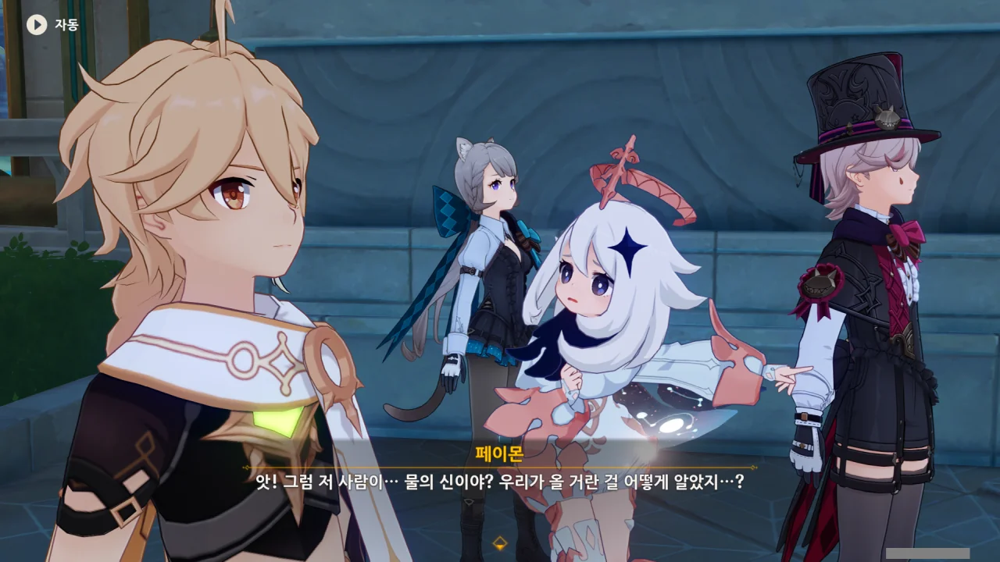

여행자가 폰타인에 온 지 한 시간도 채 안되었을 텐데, 푸리나가 벌써 항구에 도착했다. 저번에 폰타인 지도를 밝힐 때 본 바에 따르면, 여행자가 항구에 발을 디딘 그 순간에 오페라 하우스에서 출발했어야 지금 이 시점에 항구에 도착할 수 있을 것인데 말이다.

대체 무슨 수를 썼길래 이렇게 정보 전파가 빠른 거야?





> 부유한 자와 빈궁한 자, 잔을 든 자와 빈손인 자, 모두 축배를 들렴! 잔이 없다면 손만 들어 올려도 좋아.

푸리나의 목소리를 듣자마자 난 곧바로 깨달았다. 푸리나는 정말로 '물 피슬'이 맞았다! 나타나자마자 처음 하는 소리가 저거라니. 이 정도 오글거리는 대사를 하려면 어지간한 중2병으로는 택도 없을 것이다.

게다가 저 목소리! 듣는 내내 손발이 오글거림을 참을 수 없는 저 목소리! 자연스럽게 피슬을 떠올리게 하는 저 목소리의 주인공이 중2병이 아니라면, 그것이야말로 의무위반이다.



아니, 이걸 듣고 다들 좋아라 하며 손뼉을 친다고? 다들 제정신이야?

푸리나가 폰타인 사람들에게 정말로 「마스코트」와 같은 존재라는 말이 이제야 실감이 된다.

숭배와 경외의 대상인 신이 백주대낮에 저런 낯부끄러운 중2병 대사를 하고 앉아있으면 자연스럽게 얼굴이 찌푸려지고 속이 오그라들겠지만, 신이 아닌 '귀여운 「마스코트」'가 저런 말을 하면, 뭐, 그럴 수도 있는 것 아니겠는가.



뭐? 진짜로 여행자를 보기 위해 푸리나가 여기 온 거라고?

대체 의도가 뭐지? 단순히 환영인사를 할 거라면 이렇게 화려하게 등장할 필요가 없다. 분명 뭔가 꿍꿍이가 있다는 말이다.

그게 아니라면, 정말 중2병이라, 사람들의 관심을 받기 위해서 이렇게 화려하게 등장한 것일 수도 있지만...



이 사람들은 거기에 대고 또 박수를 치고 앉아있네. 그만해! 낯부끄러워! 왜 부끄러움은 내 몫이 되어야 하는 거야?!



이 근방에 다른 여행자는 없으니, 푸리나가 말하는 '여행자'란 우리를 말하는 게 틀림없다.

푸리나가 잔을 들라고 했지만, 항구에서 과연 누가 잔을 들고 있겠는가. 분명 수사적인 표현일 뿐이겠지.



뭬야? 너 방금 뭐라고 씨불였냐? '다른 나라에 남긴 혼란'?

이건 진짜 말도 안 되는 소리다. 거기서 일어난 모든 일이 여행자가 자행한 일이었던가? 여행자는 그저 잃어버린 여동생을 찾기 위해 그 나라를 방문한 것일 뿐이고, 그 나라에서 쌓이고 쌓였던 문제가 우연찮게 터져 거기에 원치 않게 휘말린 것뿐이다. 그러니 '다른 나라에 남긴 혼란'이라는 말은 천부당만부당한 말이며, 굉장히 부적절한 표현이다!

&nbsp;

말하는 것이 묘하게 사람 화를 돋우고 머리를 쥐어박고 싶게 만드는 걸 보니, 어쩌면 푸리나는 '중2병'일 뿐만 아니라 '메스가키'일지도 모르겠다.

'중2병 메스가키'? 이건 진짜 새로운 조합인데.



쓸데없이 장황한 푸리나의 말이 한쪽 귀에 흘러들어왔다가 자연스럽게 다른 쪽 귀로 빠져나간다. 뭔가 열심히 말은 하는데, 전혀 귀에 박히질 않아.

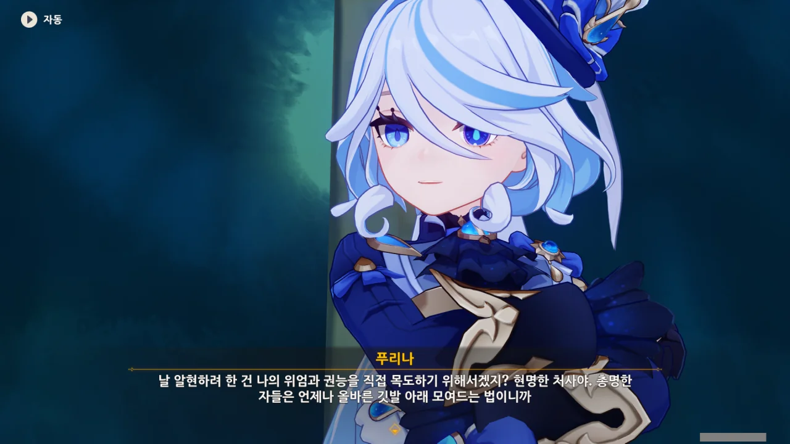

어디서 주워들은 건 있는 모양인지, 여행자가 다른 나라에서 어떤 큰 일을 했다는 것 정도는 아는 모양이다. 하지만 거기까지였다.

뭐? 위엄? 권능?

애석하지만 푸리나의 위엄은 푸리나가 '축배를 들렴'이라는 첫 문장을 꺼낸 그 순간 산산이 조각나 바닥에 흩뿌려졌다.

권능에 대해선 잘 모르겠다. 하지만 여동생에 대한 정보를 알지 못한다면, 여행자의 관심사 밖이겠지.

&nbsp;

> 총명한 자들은 언제나 올바른 깃발 아래 모여드는 법이니까.



나르시시즘이 너무 지나치다.

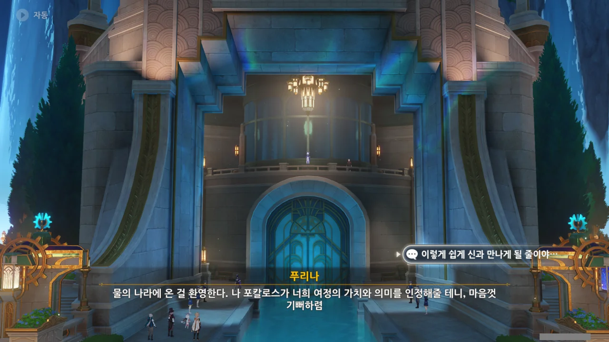

아, 폰타인 PV에서 나왔던 대사가 바로 여기서 나오는 거였구나. '푸리나'는 이름이고 '포칼로스'는 마신명이겠지? '라이덴 에이'의 마신명이 '바알세불'이었던 것처럼 말이다.

솔직히 말해, 저 대사만큼 웃긴 대사가 없을 것이다. 여행자가 어디서 무얼 했는지 정확히 알지도 못하는 푸리나가 여행자의 여정에 대한 가치와 의미를 인정한다고? 웃음조차 나오지 않는다.



그냥 '과하다'도 아니고, '「과하다」' ㅋㅋㅋㅋㅋㅋ 그래, 소름 돋을 정도로 낯부끄럽긴 하다.

이쯤 되니, 폰타인 사람들이 불쌍하게 보일 지경이다.

푸리나에 대해선 뭐라 할 말이 없다. 중2병에는 약도 없다지 않은가.

하지만 폰타인 사람들은 저 속이 오그라드는 푸리나의 행동거지를 매일같이 봐야 한다. 푸리나의 추태를 보았음에도 고개를 돌리기는커녕, 오히려 박수를 치는 모습을 볼 때, 저들은 푸리나의 중2병에 너무 지나치게 노출된 나머지, 그게 낯부끄러운 일임을 인지조차 하지 못하게 된 걸지도 모른다.



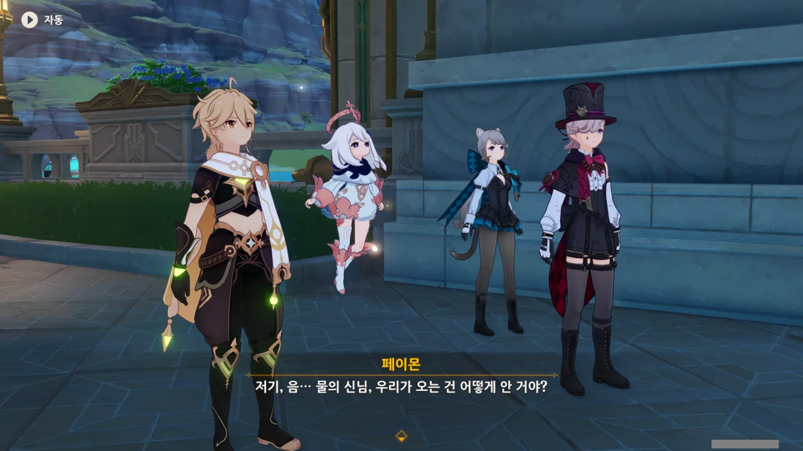

그래, 맞아. 푸리나는 여행자가 폰타인에 왔음을 어떻게 안 걸까?

만약 푸리나가 신통한 방법을 통해 여행자의 행적을 관찰한 거라면, 약 2초 정도는 감탄할 수 있다. 물론 그 후에는 똑바로 안 보고 대체 뭘 본 거냐며 대차게 깔 거지만. '다른 나라에 남긴 혼란'? 이런 매도는 용서치 않아요.

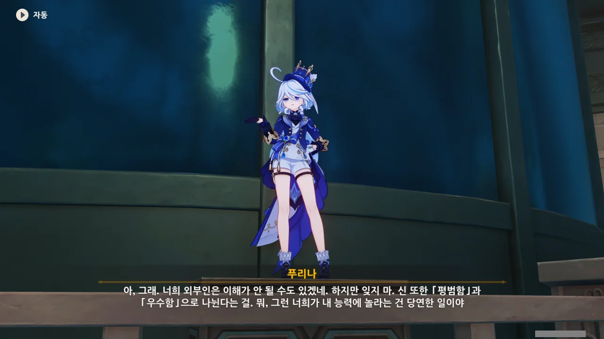

> 하지만 잊지 마. 신 또한 「평범함」과 「우수함」으로 나뉜다는 걸.

저 말의 뒤에는 푸리나 자신이 우수한 신이라는 말이 숨어있다. 저 말을 그대로 다른 신들에게 전해주면 과연 어떤 반응을 보일지 궁금한걸.



여행자의 정보를 얻는 것은 손가락 하나만 까딱하면 될 일이라고 하는 푸리나 옆에 한 남자가 서있다. 분명 수메르에서 여행자가 폰타인으로 갈 예정이라고 말하는 걸 엿들었던 녀석이다. 어째 좀 수상하다 했더니, 폰타인의 스파이였네.

물론, 다른 나라 역시 스파이 정도는 운용하고 있을지도 모른다. 대놓고 '스파이'라고 하진 않고, '정보원' 등으로 점잖게 돌려 부르고 있겠지만. 여행자의 적, 우인단 역시 '벽난로의 집'을 통해 스파이를 양성중이다.

하지만 그 누구도 저렇게 '나 스파이 쓰고 있어요'라고 대놓고 말하진 않는다. 우인단의 '벽난로의 집' 역시 대외적으로는 고아원이고 말이다.

그러고 보니, 리월 경책 산장에 있는 물의 정령, 로데이아의 별칭은 '폰타인의 수석 순수(純水) 스파이'이다. 다른 설명에선 로데이아가 전임 물의 신에 대한 그리움을 못 버리고 폰타인을 배신해 도망쳤다고 적혀 있고 말이다.

그럼 폰타인은 전임 신도, 현임 신도 모두 타국에 대놓고 스파이를 파견하는 나라인 거야?

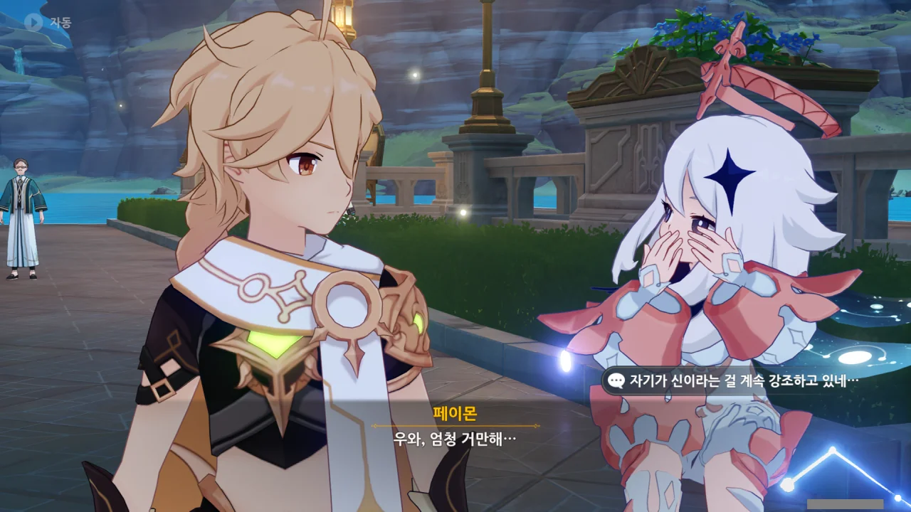

자신이 신이라는 걸 굉장히 노골적으로 강조하는 푸리나.

일반적인 관점에서 보았을 때, 저렇게 자신의 신분이나 지위를 강조하는 행위는 역으로 자신이 그 신분이나 지위에 대해 불안감 혹은 콤플렉스 등을 갖고 있음을 시사한다.

'교양 있고 신사적인' 이미지를 갖는 부자(富者)라는 단어와, '무례하고 타인을 잘 무시하는' 이미지를 갖는 졸부(猝富, 拙富)라는 단어를 생각하면 쉽게 이해할 수 있다.

졸부는 자신에게 어딘가 특출 난 부분이 있어 부자가 되었다 생각하지만, 대부분의 경우, 그건 단순한 운에 따른 결과였을 뿐이다. 졸부는 자신의 생각과 현실의 어긋남 때문에 콤플렉스를 가지게 되고, 이를 해소하고자 타인을 멸시하거나 깎아내리게 된다.

결론적으로 말해, 자신이 신이란 걸 강조하는 신일수록 별 볼 일 없는 신이라는 말이다.

&nbsp;

전임 물의 신이 500년 전 켄리아 사태 때 죽었다고 했으니, 푸리나는 그 이후 우연찮게 물의 신 자리를 차지하게 된 걸지도 모른다. 지금껏 집정관의 세대교체에 대해 직접 본 것이 없으니, 이렇게 추측해도 큰 문제는 없겠지.



응? 거기서 왜 네가 당황해하는 거야?

> 왜 그런 눈으로 날 보는 거지...? 이 정도면 환영식으로는 충분하잖아? 뭔가 더 말해줘야 하는 거야?

푸리나는 정말 진심으로 여행자를 환영하려 한 걸까? 그렇다고 보기에는 '환영해, 여행자!' 성분보다 '나를 찬미해라!' 성분이 더 많았던 것 같은데...

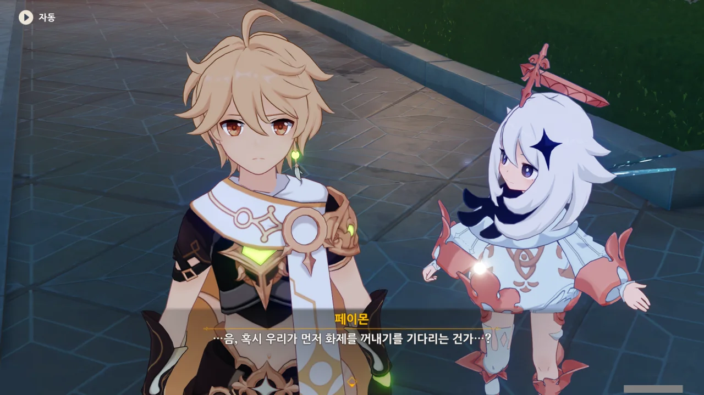

아, 설마 여행자가 여동생의 행방을 묻기 전, 푸리나를 흡족하게 만들기 위해 푸리나를 찬미하는 대사를 말하길 바랐던 거야?



꼴불견이 따로 없다.





여행자에게 「이국의 금발 여행자」라는 이명까지 붙을 정도로, 폰타인 전역에 여행자에 대한 소문이 퍼진 것 같다. 여행자는 그저 여행을 다녔을 텐데... 분명 푸리나가 뭔가 손을 쓴 게 틀림없다.

그런데 웬 대결? 설마 푸리나와 대판 싸워야 하는 거야?



... 살려줘. 보는 내가 낯부끄러워 속이 다 뒤집어질 것 같다.

글을 쓰기 전까지, 난 푸리나가 난간 위에 서있는 건 줄 알았다. 그런데 지금 보니, 푸리나는 난간 뒤에 놓인 상자 위에 서있는 거였다. 분명 여행자가 온다는 소식을 듣고 부랴부랴 설치한 거겠지?



뭐야? 여행자를 환영하러 온 거 아니었어? 그런데 느닷없이 왜 '장대한 대결'이 나와?

정말, 보면 볼수록 최초 타이틀을 너무 많이 가져가는 신이다.

* 최초로, 나라에 도착한 지 얼마 되지도 않았는데 제 발로 찾아온 신
* 최초로, 말과 행동이 전형적인 중2병 메스가키인 신
* 최초로, 만난 지 얼마 되지도 않았는데 대뜸 싸움부터 거는 신

하지만 '대결'이라는 말을 듣자마자 '신과의 대결 경험이 있기는 한데'라고 생각하며 대뜸 칼부터 꺼내는 여행자 역시 만만치는 않다.





그런데 뭔가 분위기가 조금 이상하다. 뭐지? 싸우는 분위기 아니었어?

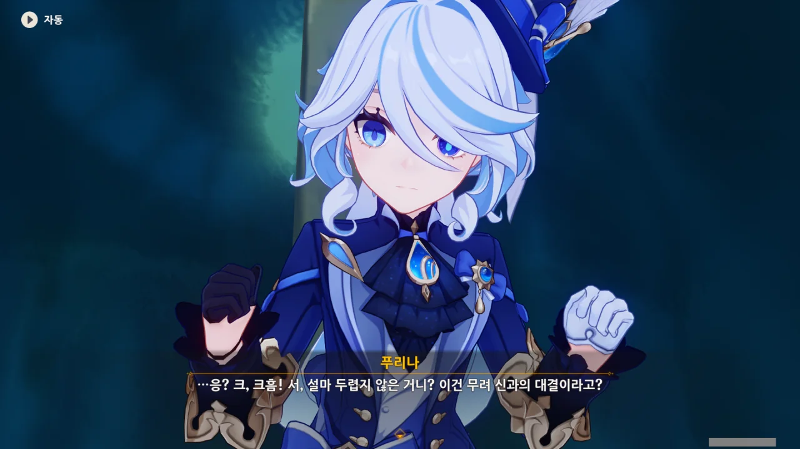

두렵지 않냐고? 이미 한 무력 하는 라이덴 쇼군과도 몇 번 합을 겨뤄본 사이이다. 처음 싸웠을 때, 안수령 때문에 스킬이 죄다 봉인당해 식겁했던 기억이 아직도 생생하다.

원래 이런 건 다 처음이 어려운 법이다. 한번 하고 나면, 그다음부터는 그리 어렵지 않거든.

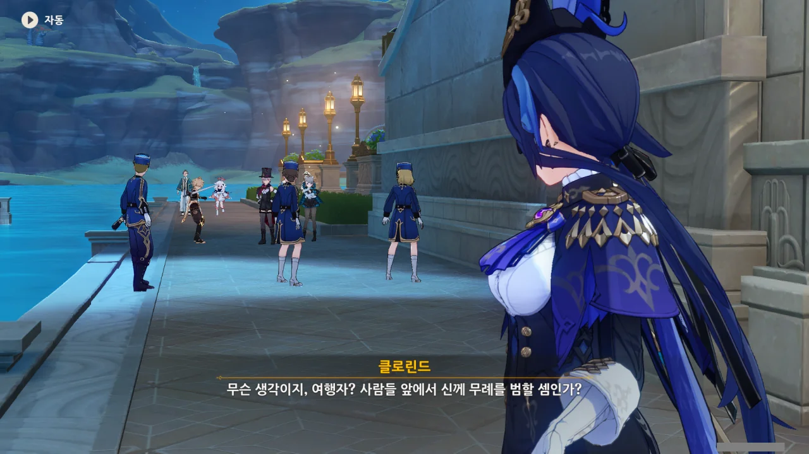

아, 저 사람 이름이 '클로린드'였구나.

아, 왜. 분명 '대결'이란 말을 먼저 꺼낸 건 푸리나였다고. '대결'은 곧 싸움 아냐?

하지만 경호원들조차 무기를 들고 있지 않다.



아, 무력 대결이 아니었던 거야?

역설적이게도, 신에게 칼을 겨눈 *무례*는 제 잘난 맛에 사는 푸리나가 그 중2병 덕분에 관대하게 넘어가, 무사히 해결되었다. 허, 자칫했다간 폰타인에 도착하자마자 체포되어 압송당할 뻔했네.

> 단순한 무력 대결로는 굶주린 영혼을 채워줄 수 없어!

대체 폰타인 사람들은 평소에 뭘 보고 놀기에 저런 말이 나오는 걸까? 전투보다 하드코어 한 무언가... 대체 뭘까, 그게.



아까 푸리나의 말 때문에 폰타인 사람들은 평소 전투보다 더 하드코어 한 것을 즐긴다고 생각했는데, 알고 보니 그냥 허구한 날 싸워대는 사람들 때문에 전투에 질려하는 것이었다. 뭔가 이해가 될 것 같으면서도 되지 않는단 말이지...

그런데 명예를 지키기 위해 결투를 한다고?

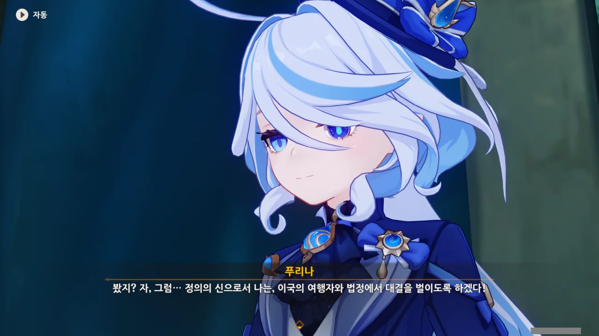

푸리나가 말한 '대결'은 '법정에서의 대결'을 말하는 것이었다.

법정? 대결? 뭔가 역전재판이 떠오르는 조합인데... 푸리나가 누군가를 기소하고, 여행자가 피의자를 변호하는 그림이 머릿속에 떠오른다.

그런데 그건 재판에 대한 모욕 아냐? 기소와 변호는 전문가가 해야지. 저 푸리나가 법률의 전문가일 리는 없고 말이다.



난 정말 폰타인 사람들의 감성을 이해하지 못하겠다.



'마, 너 오페라 하우스 중독이다!'를 시전 하는 페이몬.

페이몬의 말을 들어보면 재판의 피고인이 다름 아닌 여행자로 보이는데... 여행자 일행은 이제 막 폰타인에 도착했잖아? 범죄를 저질렀을 리 만무하다.





푸리나는 '매월 초삼일에 폰타인 시내에서 비행 물체를 날려서는 안 된다'라는 법 조항을 들먹이며, 여행자가 이미 해당 법을 위반했다고 주장한다.

설마 페이몬을 비행 물체로 간주하는 거야?



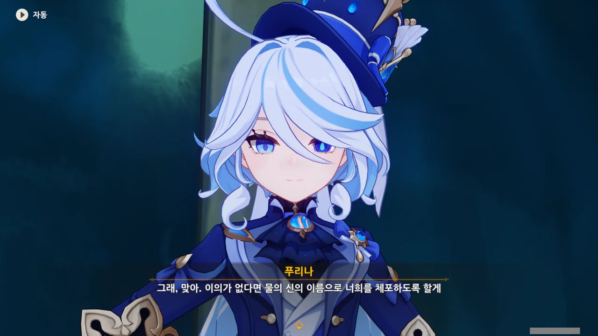

이의? 이의?!



일반적으로, 법조문은 지나치다고 해도 될 정도로 각 용어를 자세하게 정의하고 있다. 누군가가 법조문을 곡해해, 억울한 피해자를 만드는 걸 방지하기 위해서이다.

그러니 푸리나가 말한 법조문에 쓰인 용어의 정의를 묻는 것만으로도 이미 반은 먹고 들어갈 수 있다.

* '비행 물체'에서 '비행'과 '물체'는 각각 무엇을 뜻하는가?
* 페이몬 같은 '생물'은 '물체'에 포함되는가?

'비행 물체'를 상식적인 수준에서 해석하고, '생물' 역시 '물체'에 포함된다고 간주해도, 폰타인 시내를 날아다니는 새가 있는 한, 여행자와 페이몬은 죄가 없다. 꼬우면 폰타인 시내에 있는 모든 새들을 잡아 감옥에 넣어 보던가.



리니가 갑자기 대화에 끼어들더니, 페이몬을 비행 물체로 간주할 수 없다는 주장을 펼친다.

그래! 이게 바로 상식이지! 아직 폰타인에는 상식이 살아 있었구나?

도대체 푸리나는 뭔 정신으로 저 되지도 않는 주장을 펼치고 앉아있는 건지, 나 원 참.



모든 주장에는 반드시 근거가 따라야 한다. 자신의 주장에 대한 증명을 해 보이라는 푸리나의 말에, 리니는 느닷없이 마술을 하나 펼쳐 보이겠다고 한다.

뜬금없이 웬 마술? 리니야... 잘못하면 여행자가 감옥 간다... 대체 무슨 생각인 거니?





리니가 손가락을 튕기자, 여행자의 손목과 페이몬의 등을 연결하는 붉은색 실이 나타난다. 리니의 신의 눈이 잠깐 빛난 걸 보아, 리니가 무슨 수를 쓴 모양이다.

그 와중에 리넷이 무미건조하게 "짜잔---"이라고 하는 모습이 너무 귀엽다.





정황상, 리니가 여행자와 페이몬에게 실을 매단 건 조금 전 느닷없이 정식으로 인사를 나누자고 했던 때인 것으로 보인다.

여행자와 악수를 하며 여행자의 손에 실을 매달고, 악수 대신 페이몬의 등을 두드리며 페이몬의 등에 실을 연결한 것이다.

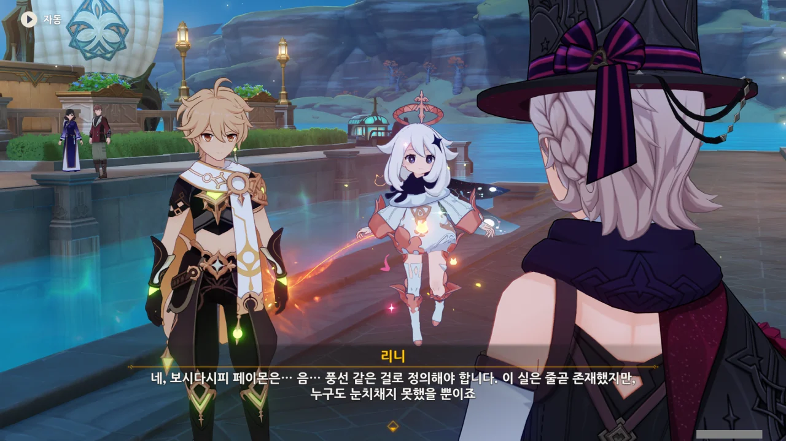

페이몬은 여행자와 연결된 실에 묶여있기 때문에, 비행 물체가 아니라 풍선 같은 것으로 간주해야 한다고 주장하는 리니.

페이몬은 결국 사물 신세를 벗어나지 못하는 건가... 다른 곳에선 줄곧 요정 비슷한 것으로 여겨지던 페이몬이 이젠 풍선이 되어버렸다.



말장난이라니. 말이 너무 심하네. 말장난은 푸리나가 먼저 쳤다고. 페이몬이 '비행 물체'라니, 뭔 되지도 않는 소리인 건지. 그러니 여행자 역시 억지에 억지로 대응하는 것뿐이다.

내가 처음 기대했던, 푸리나의 억지에 정면으로 달려들어 하나하나 해체하는 모습은 아니게 되었지만, 푸리나의 억지 주장을 틀어막은 것에 의의를 두기로 했다.



갑자기 느닷없이 웃는 푸리나. 뭐지? 드디어 정신이 나가버린 건가?



아무리 생각해도 자신의 억지 주장이 먹히지 않자, '이거 다 농담이었던 거 아시죠?'라며 슬쩍 넘어가려 하는 것으로밖에 보이지 않는다.

추하다, 푸리나!

보면 볼수록 숨이 턱턱 막히는 푸리나의 억지 활극은 드디어 여기서 끝을 내려나보다. 거, 듣던 중 참 다행이네.

그 와중에 끝끝내 "무고한 자에게 누명을 씌울 수는 없다"라며 자신을 포장하는 푸리나. 방금 네가 한 게 그 '무고한 자에게 누명을 씌우는 일'이었어.



ㅋㅋㅋㅋㅋㅋㅋㅋㅋㅋㅋㅋㅋㅋㅋㅋㅋㅋㅋㅋㅋㅋㅋㅋ

> 난 이국의 신조차도 심판할 수 있어.

ㅋㅋㅋㅋㅋㅋㅋㅋㅋㅋㅋㅋㅋㅋㅋㅋㅋㅋㅋㅋㅋㅋㅋㅋ



아, 정말 저 대사를 그대로 녹음해서 지금껏 만난 다른 신들에게 들려주고 싶다. 과연 어떤 반응을 할까 궁금해 미치겠네 ㅋㅋㅋㅋㅋㅋ

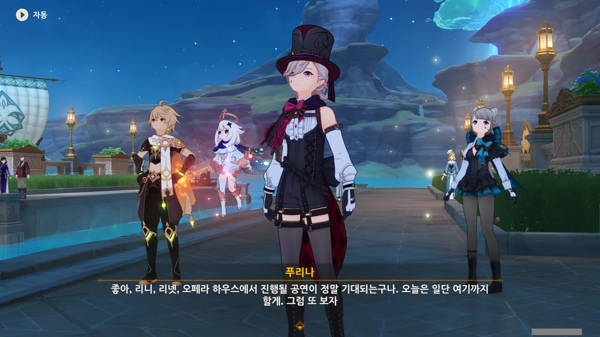

또 보기 정말 싫은데. 제발 우리 앞으로 사무적인 대화만 하면 안 될까? 난 벌써부터 네가 싫어졌는데.

그나저나 리니가 오페라 하우스에서 공연을 한다고? 거긴 재판장 아니었어?





끝까지 추하게 정신 승리를 하며, 푸리나가 퇴장한다. 하... 이딴 게 물의 신? 정말 역겹네.

하지만 나중에 푸리나가 플레이어블 캐릭터로 출시되면 난 그동안 악착같이 모아 온 인연을 모조리 탕진해서라도 푸리나를 뽑겠지... 씁쓸하기 그지없다.

하지만 집정관 캐릭터는 언제나 성능이 좋았는걸.



여동생의 행방을 묻기 위해 푸리나를 또 만나야 한다는 것이 정말 괴롭다. 심지어 난 여기서 '아, 그냥 마신 임무 하지 말까'라는 생각조차 했다니까?

리니는 마침 비행 물체에 대한 법이 있다는 것이 떠올라 페이몬과 여행자에게 미리 대비를 해뒀는데, 그게 그렇게 빨리 쓰일 줄은 몰랐다고 한다.



푸리나가 합리적이라는 말을 믿느니, 차라리 종려가 벤티와 함께 술주정 깽판을 부린다는 말을 믿겠다. 합리는 무슨 개뿔이.



리니와 리넷이 마치 마술사처럼 챙겨 입었기에, 속으로 '아, 마술사인가 보다'라고 생각만 하고 있었는데, 그게 정말이었다.

정확히 말하면, 리니 혼자만 마술사이고, 리넷은 리니의 조수라고 한다. 하지만 마술 조수를 하려면 마술에 대한 조예가 어느 정도는 있어야 할 테니, 리넷도 어찌 보면 마술사라고 할 수 있겠네.

그런데 오페라 하우스에서 공연을 한다고? 설마 리니와 리넷이 거기서 재판을 받는 거야? 대체 뭘 잘못했길래?



오페라 하우스에서는 주로 재판을 하지만, 공개 심판이 없을 때에는 공연도 한다고 한다.

그러니까 리니와 리넷은 재판을 받으러 오페라 하우스에 가는 게 아니라, 정말로 마술 공연을 하기 위해 오페라 하우스에 가는 거였다. 그건 듣던 중 다행이네.

> 폰타인에서는 이미 심판과 공연의 경계가 모호해진 상태라...

나만 저 문장이 굉장히 심각한 것으로 느껴지는 건 아닐 것이다.





자신은 관객 중 아는 사람이 많을수록 타오르는 타입이라며 여행자와 페이몬을 자신의 공연에 초대하는 리니. 어차피 좋든 싫든 여동생의 행방을 묻기 위해 오페라 하우스로 가야 하는 신세. 흔쾌히 수락했다.



그런데 왜 갑자기 이 「마술 주머니」를 사람들에게 나눠달라고 하는 걸까? 여기 안에 뭐가 들었길래?



그 물음에, 먼저 폰타인에 떠도는 「예언」에 대해 설명하는 리니.



> 폰타인 사람은 모두 「죄」를 안고 태어난다. 정의의 나라인 폰타인이 아무리 심판해도 없앨 수 없는 죄를...
> 언젠가 폰타인의 해수면이 상승해 죄를 짊어진 자들은 모두 서서히 수면 아래 잠길 것이다...
> ... 결국 모든 이는 바다에 용해될 것이며, 오직 물의 신만이 신좌에 남아 눈물을 흘리리라. 그때... 비로소 폰타인 사람의 죄도 씻겨나가게 될 것이다.
{.bq}

너무 기독교적 테이스트가 강한데. 뜬금없이 원죄라니.

내 경험상 저렇게 원죄 운운하는 것은 전부 믿을 것이 못된다. 원죄를 핑계로 들러붙어 십일조니 뭐니 뜯어갈 생각으로만 가득하거든.



이미 이 예언에 대해 이런저런 추측이 나온 모양이다.

* 폰타인 사람들의 조상이 바다의 힘을 훔쳐 바다가 분노했다.
* 폰타인 사람들이 최초의 물의 신의 충고를 따르지 않아 셀레스티아의 신을 화나게 했다.

두 번째 추측이 더 그럴듯해 보이지만, 셀레스티아는 귀찮게 해수면을 상승시킬 게 아니라, 그냥 한천의 못을 하늘에서 떨어트릴 것이다. 그러니 두 번째 추측도 탈락.



하지만 그 모두가 전부 근거 없는 단순한 추측에 불과했다고 한다.

그래. 페이몬 말처럼, 그냥 무시해 버리면 되는 일 아닐까? '아무튼 넌 죄를 지었으니 심판받아 죽을 것이다, 에비~'라고 하는 말을 누가 믿어? 그런 말을 할 거면 최소한 무슨 죄를 지은 건지는 알려줘야 할 거 아냐. 그래야 항변할 기회라도 있지.



그런데 그것이 실제로 일어났습니다.

최근 몇 년 동안 폰타인의 해수면이 정말로 상승하기 시작했다고 한다. 리니와 리넷이 어릴 적 같이 놀던 언덕을 포함한 많은 곳이 이미 물에 잠겨 「해저 지대」가 되었다고.

단순한 자연 현상일 수도 있지만, 리니와 리넷은 정말 예언이 들어맞을 가능성을 무시한 채 가만히 있을 수 없다고 생각한 모양이다.

진짜 해수면이 상승했다고 하니까 나도 좀 불안한데.

&nbsp;

그런데 폰타인의 해수면이 상승한다는 건 어떤 느낌일까?

폰타인은 분명 바다 한가운데에 불쑥 솟아오른 민물 호수에 둘러싸여 있다. 그리고 그 솟아오른 부분 중 수면 윗부분에 사람들이 살고 있는 것이고.

이 상태에서 폰타인의 해수면이 상승하려면 두 가지 방법밖에 없다. 폰타인의 육지 부분을 받치고 있는 지반이 약해져 가라앉거나, 폰타인에서 생성되는 물의 양이 급증해야만 폰타인의 해수면이 상승할 수 있다. 목욕탕에서 바가지에 물을 담는 것과 비슷하다고 보면 될 것이다.

하지만 폰타인은 바다 한가운데에 솟아올라 있다. 물의 양이 급증한다고 해도, 폰타인의 해수면이 상승하기보다는 폰타인 밖 바다로 떨어지는 폭포의 세기가 강해질 가능성이 더 크다.

그러니 남은 방법은 폰타인의 지반이 약해져 가라앉는 수밖에 없다. 만약 그렇다면 인간이 어찌할 방도가 전혀 없다. 그나마 할 수 있는 거라곤 베네치아처럼 지반에 말뚝을 수천 개 박고, 그 위에 도시를 건설하는 것이겠지만, 지반이 계속 가라앉는다면 이 역시 미봉책에 불과하게 된다.

애당초, 난 폰타인의 지형을 처음 봤을 때, '초장기적으로 보면 폰타인은 결국 침식에 침식을 거듭하다 사라질 것이다'라고 생각했다고.



리니가 「마술 주머니」를 해변에 사는 사람들에게 나눠주는 까닭은 이들이 하루라도 빨리 안전한 내륙 쪽으로 이사 가길 바라는 마음 때문이라고 한다. 「마술 주머니」는 수납 용량이 커서, 이사할 때 유용하게 쓸 수 있으니 말이다.



뭐, 그렇지. 인간이 대자연과 맞서 싸워 이긴 경우는 극히 드물지 않은가.

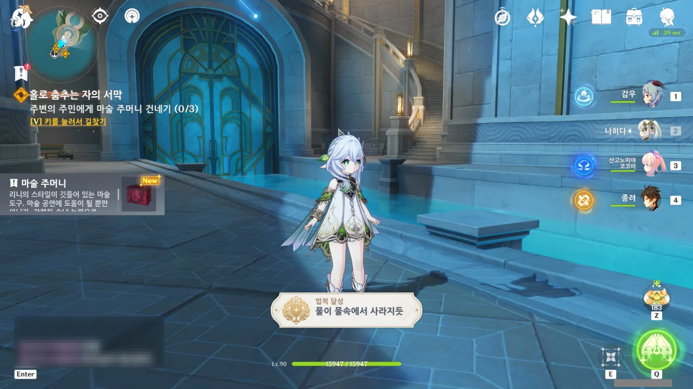

'물이 물속에서 사라지듯'이라는 업적이 달성되었다.
