리니에게 부탁받은 대로, 사람들에게 「마술 주머니」를 나눠주러 간다.

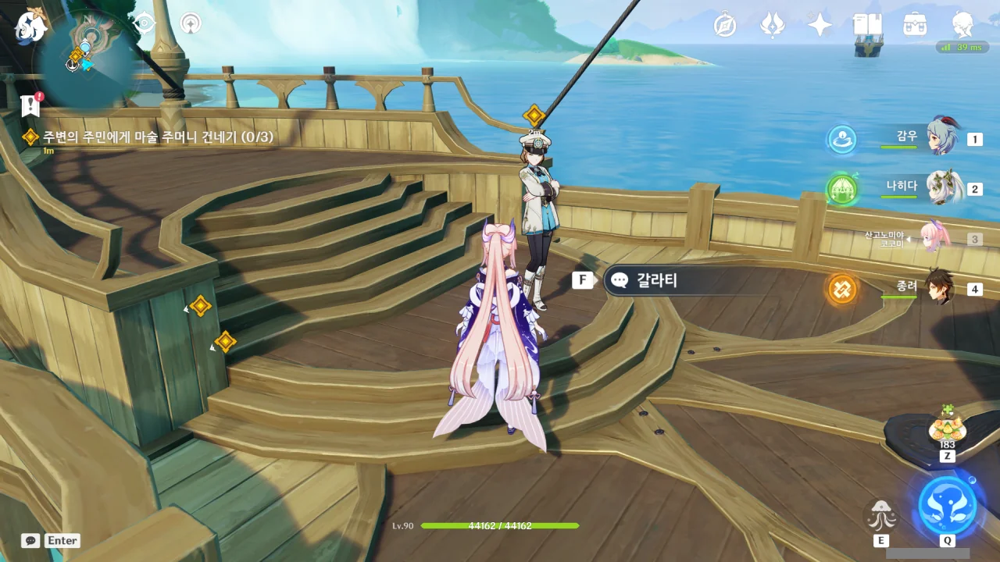

첫 번째 타깃은 배 위에 있는 갈라티.





사람들이 모두 물에 잠기려면 아직 한참 멀었을 것이며, 그때 일은 그때 가서 생각할 거라는 선장 갈라티. 그래서 혹시 모르니, 여행자가 건네는 「마술 주머니」를 받아 든다.

뭐, 갈라티 말처럼, 이사를 간다는 건 현재의 생활에서 뭔가가 반드시 변한다는 걸 의미한다. 금전적 문제나 절차적 문제를 빼고 단순히 생각하더라도 말이다. 그저 뜬소문에 불과한 이야기만 가지고 이사 같은 중대한 문제를 결정하긴 힘들겠지.

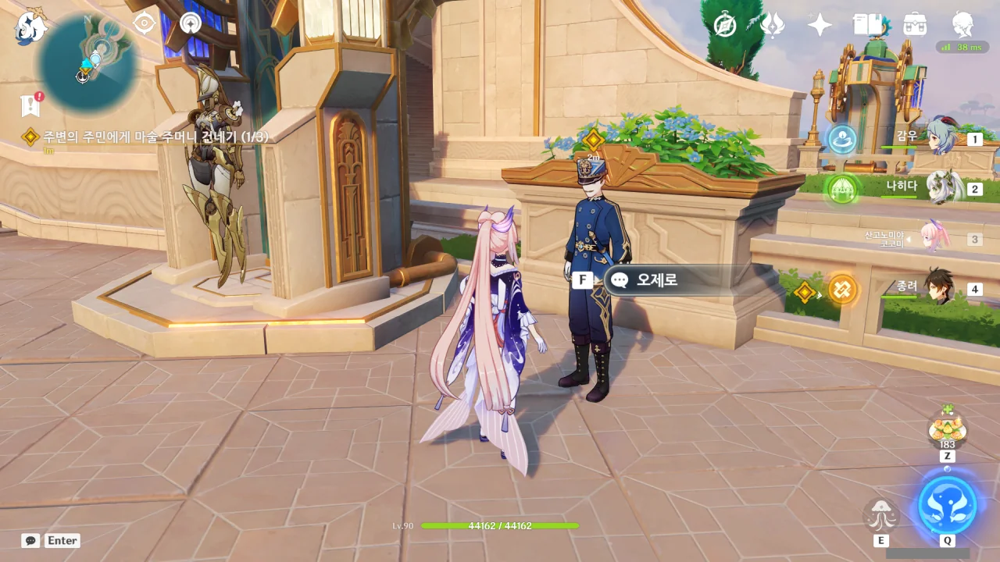

다음은 오제로 너로 정했다.







일단 선생님은 고등교육을 다시 받으셔야 하겠습니다...

> 사람들은 원래 바다에서 살았다고 해.

사람을 포함한 모든 생물의 공통조상이 바다에서 산 건 맞지만, 그걸 사람이라 부르진 않는다. 그런 것까지 사람의 범주에 넣는다면, 사람은 매 끼니마다 동족을 포식하는 생물이 되어버린다고.

> 후에 사람들은 육지에서 살기를 원했고, 바다를 체내에 담을 수 있는 혈관이 생겨난 덕에 땅 위를 걸을 수 있게 됐다더군.

혈관은 바닷물을 체내에 담기 위해 생긴 것이 절대 아니다!

혈액의 염도는 0.9% 이지만, 바닷물의 염도는 혈액 염도의 3배가 넘는 3.5%이다.

갈증이 난다고 바닷물을 마셔서는 안 되는 이유가 바로 여기에 있다. 체내의 수분이 부족할 때 갈증을 느끼게 되는데, 목이 마르다고 바닷물을 마시면, 삼투 현상 때문에 오히려 체내의 수분이 바닷물 쪽으로 이동하게 되어 수분이 이전보다 더 부족해지게 된다.

염분 농도를 차치하고서라도, 혈관에 바닷물을 넣는 건 위험천만한 일이다. 만약 바닷물에 살고 있는 병원균이 몸의 면역 체계와 싸워 이기게 되면, 말 그대로 피가 썩게 되는 패혈증에 걸리게 된다.

일반적으로, 패혈증에 걸렸을 때 죽을 확률은 20~35%나 되며, 여기서 상태가 더 악화되어 패혈성 쇼크까지 찾아올 경우, 죽을 확률이 40~60%로 급증하게 된다.

패혈증을 치료하는 방법은 대량의 수액을 지속적으로 공급해 혈압을 유지하면서 광범위 항생제를 때려 부은 다음, 지속적으로 균배양 검사를 통해 항생제의 비율을 조절하는 것 밖에 없다. 무식한 방법이지만, 이 방법밖에는 답이 없는 것이다.

> 바닷물이 차올라서 모두 물속에 잠기게 되더라도, 결국은 집으로 돌아가는 것뿐이잖아?

선생님은 혹시 '익사'라는 말을 들어보셨습니까?

&nbsp;

오제로가 말한, "「바다에 용해될 거」라는 게 무조건 죽는다는 말은 아닌 것 같아"에 대해선 별로 동의할 수 없다.

예언이 '폰타인의 해수면이 상승할 것'이라고 직접적으로 말한 이상, 나머지 문장 역시 직접적인 의미로 말한 거라고 보는 게 더 적합하지 않을까?

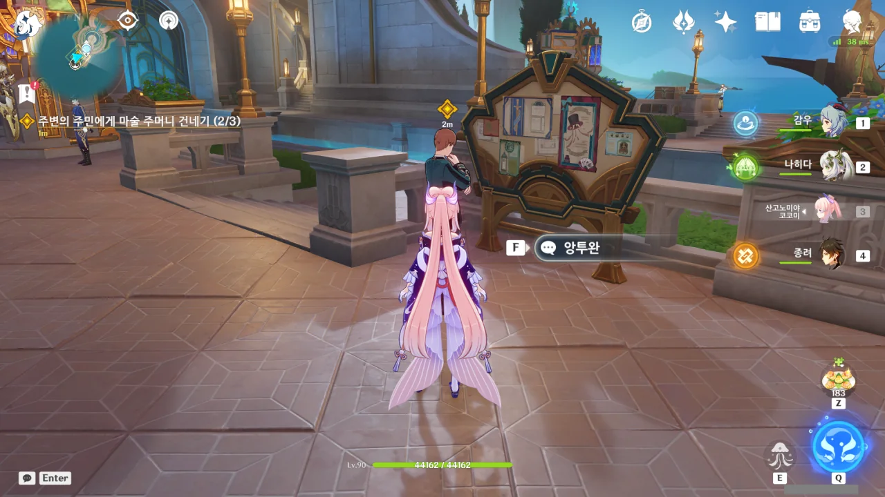

다음은 앙투완이다. 이 녀석이 마지막이겠네.





앙투완이 날 아는 척하길래, '누구지?'라고 생각했는데, 아까 여행자 일행이 대화를 엿들었던 두 사람 중 하나였다.

리니가 대마술사라니, 리니는 생각보다 훨씬 유명한 것 같다. 하기야, 유명하지도 않은데 어떻게 오페라 하우스에서 공연을 할 수 있겠는가?

방금 전 저기서 건너올 때만 해도 리니와 리넷이 저기에 없었는데.



상토주무(桑土綢繆)에 유비무환(有備無患)이라, 나쁜 일에 미리 대비해서 나쁠 것은 전혀 없다.





난 「마술 주머니」를 리니가 직접 만든 줄 알았는데, 폰타인성의 공방에서 주문제작한 것이라고 한다.

기왕 나온 김에 「마술 주머니」를 만들 재료를 더 챙겨가고 싶다는 리니. 필요한 재료는 '바다 이슬 꽃'이라고 한다.



바다 이슬 꽃을 물 원소로 공격하자 '섬유질 바다 이슬 꽃'이 된다.

꽃으로 어떻게 주머니를 만드는 것인가 궁금해했는데, 꽃에서 섬유질을 뽑아낼 수 있는 모양이다.

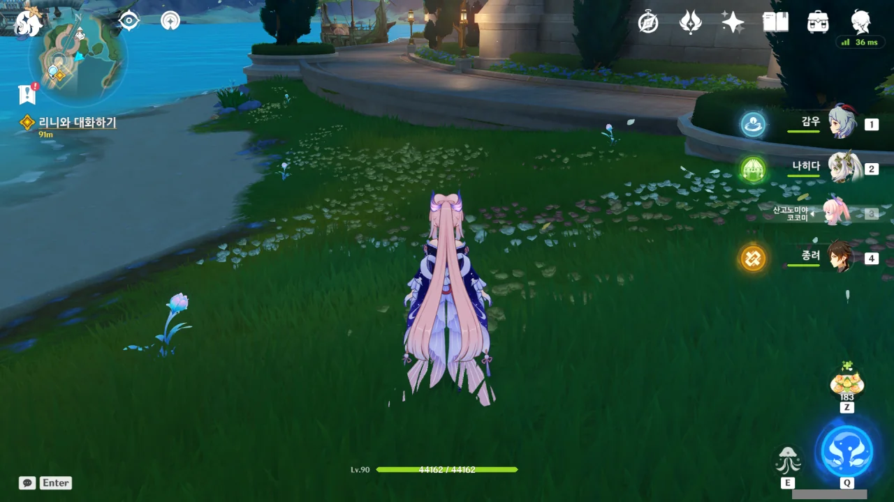

3개만 있어도 충분했지만, 더 캐두면 뭔가 좋은 일이 있을까 싶어, 주변에 보이는 모든 바다 이슬 꽃을 전부 채집했다.

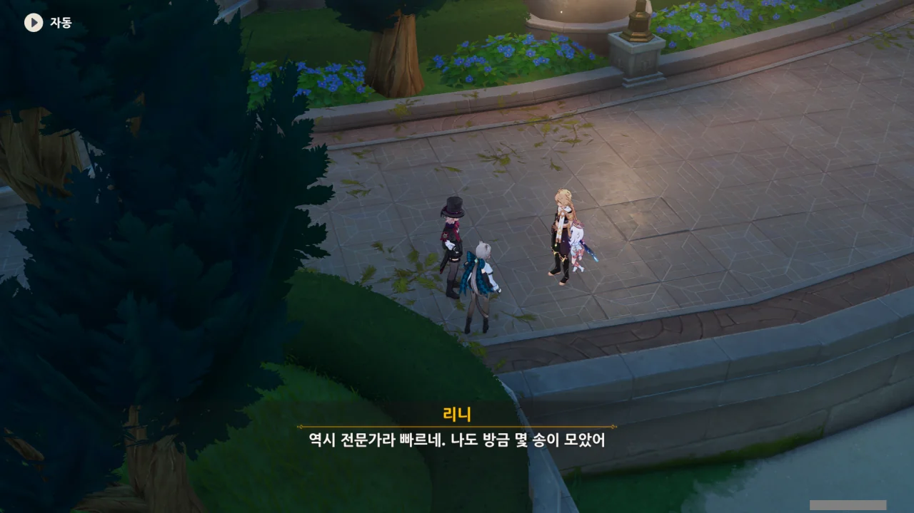

여행자가 꽃을 모을 동안 리니도 가만히 놀고만 있지는 않았던 모양이다.



리니가 열심히 꽃을 모으고 있을 동안, 리넷은 아무것도 하지 않은 듯하다. '오페라 하우스에서 공연할 때 기운을 못 차려서는 안 되니 에너지 절약을 하겠다'라는 그럴듯한 이유를 내세우는 리넷.

꼭 필요할 때 이런저런 핑계를 대며 게으름을 피우는 모습이 꼭 내 여동생을 닮았네. 생긴 것은... 내 여동생의 명예를 위해서 관두기로 하자.



그야 방금 캔 꽃을 그대로 오페라 하우스로 들고 갈 수는 없지 않은가. 일단 폰타인성의 공방에 이 꽃을 맡기는 것이 먼저다.



폰타인성을 향해 이동하던 중, 리니가 갑자기 일행을 멈춰 세운다.



저 사람이 소매치기라고? 대체 무슨 근거로 이렇게 자신 있게 말하는 걸까?



마술사와 소매치기 모두 아무도 눈치채지 못하게 손기술을 사용한다는 공통점이 있다고 말하는 리니. 그러니까 마술사인 리니는 '같은 부류'인 소매치기를 알아볼 수 있다는 말이다.

어... 정말 그런 건가?



아니, 진짜네.

주변을 잠시 둘러보던 여자는 선원의 뒷주머니에 손을 슬쩍 가져다 대더니, 다시 주변을 살피곤 어디론가 유유히 사라진다.





소매치기가 주변을 경계하는 것 같으니, 흩어져서 소매치기를 잡자고 리니가 제안한다. 리니가 소매치기를 쫓고, 여행자가 퇴로를 차단하는 식이다.

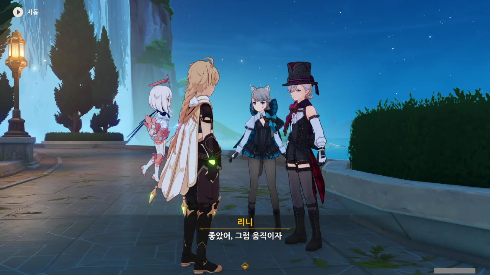

좋아, 신나는 도둑 잡기 놀이 시간!

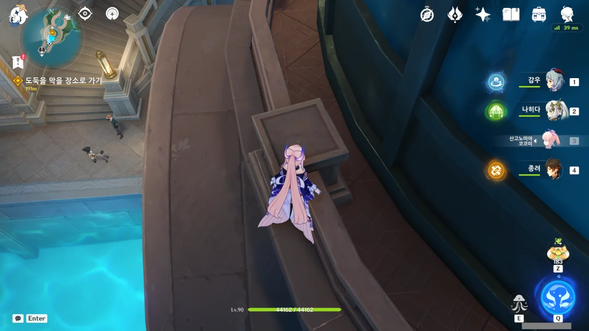

승강기로 올라가다, 아까 푸리나가 있던 자리에 가보았다.

아까 컷신에서 푸리나가 밟고 있던 상자가 지금은 없다. 경호대가 철수하면서 상자도 같이 가져간 모양이다.



승강기가 움직이는 시간이 제법 길다. 승강기 속도를 좀 더 빠르게 할 수는 없었던 걸까?

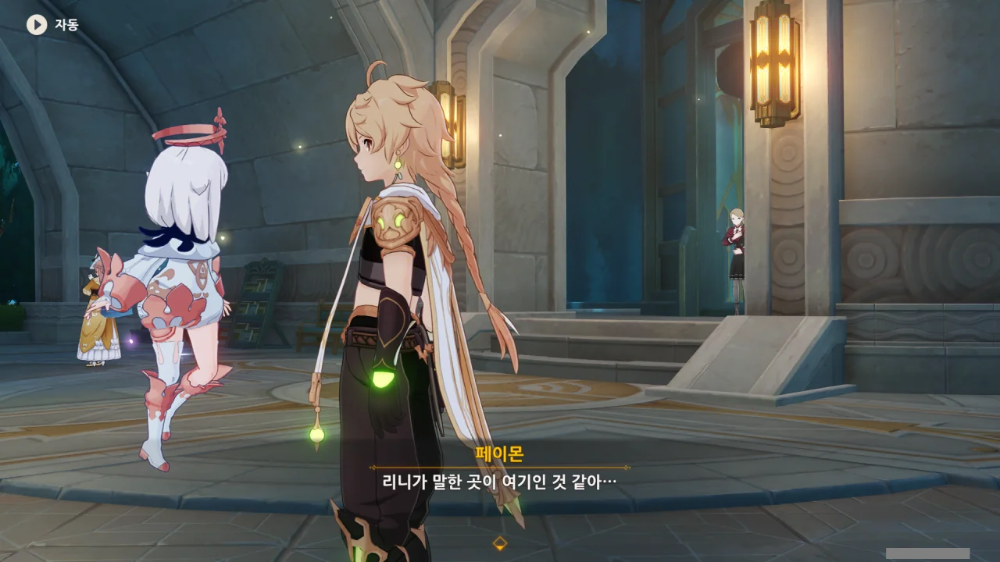

페이몬이 "리니가 말한 곳이 여기인 것 같아..."라고 하자마자, 승강기에서 아까 그 소매치기가 나타난다. 여행자가 승강기를 타고 올라간 바로 직후, 승강기에 탄 모양이다.



소매치기를 붙잡으려 하자, 곧바로 달아나버린다.



승강기 반대편으로 도망친 것 같은데, 여기서 소매치기를 쫓아가는 건 그리 좋은 생각이 아니다.

여행자가 소매치기를 계속 쫓아간다면, 소매치기는 그저 승강기 주변을 한 바퀴 돌아 여행자가 있던 곳으로 되돌아온 후, 유유히 원래 가려던 방향으로 도망치면 되기 때문이다.

뭐, 리니가 알아서 하겠지. 여행자는 여기에 진을 치고 기다리면 되는 것이다.

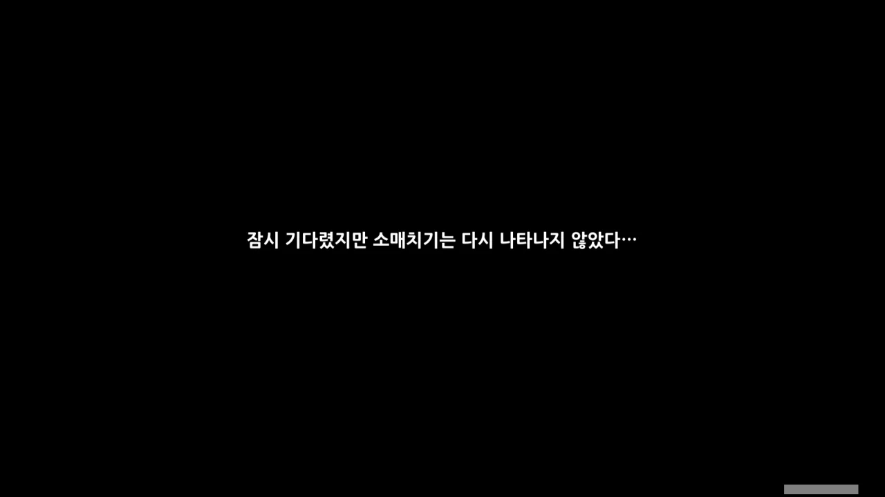

... 응? 소매치기가 다시 나타나지 않았다고?



리니가 소매치기를 잡아 제압 중인 걸까? 그렇다고 보기에는 시간이 너무 많이 흘렀는데...

에이, 설마 리니가 역으로 소매치기에게 당해서 소매치기를 놓친 건 아니겠지?

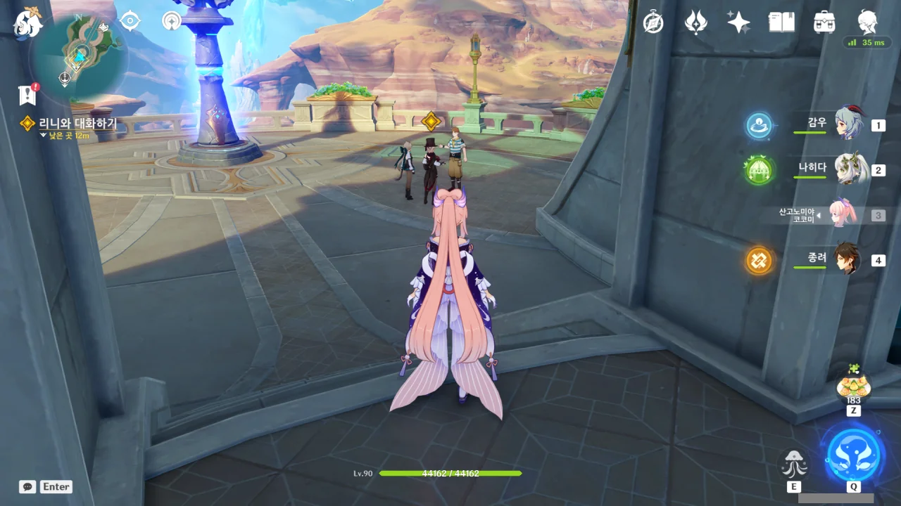

소매치기는 없고, 아까 물건을 도둑맞은 선원만 보인다. 리니가 소매치기를 놓친 것 같다.

소매치기는 이미 치안조직에 붙잡혀 연행되었다고 생각할 수도 있겠지만, 그랬다면 뒤처리를 위해 치안조직 소속인 사람이 한 명 정도는 여기 남아있어야 할 것이다.



리니가 선원에게 물건을 되돌려주고 있다.



소매치기가 머리가 좋았네.

리니의 시선을 끌기 위해 훔친 물건을 떨어트린 후, 당황한 리니가 발목을 접질린 사이, 잽싸게 도망쳤다고 한다.

머리가 제법 잘 굴러가는 도둑인걸? 도둑 입장에선 이번에 붙잡혀 철창신세를 지느니, 이번 소득을 포기하고 도망치는 게 더 이득 아니겠는가.



그래도 리니의 부상은 그리 크지 않은 모양이다. 곧 오페라 하우스에서 공연이 있는데, 발목을 크게 접질렸으면 공연에 큰 지장이 가겠지. 다행이다.



리넷이 리니에게 잔소리를 한다. 리넷은 볼 때마다 참 귀엽네...





소매치기는 놓쳤지만, 도둑맞은 물건을 무사히 원 주인에게 돌려주었고, 리니의 부상도 가벼운 수준이다. 만족스럽진 않지만, 그럭저럭 괜찮은 결말이다.

아, 이제 드디어 폰타인성으로 갈 수 있겠네.



폰타인의 배를 본 페이몬이 잔뜩 신이 나, 혼자 포르르 날아가 배를 이리저리 살펴본다.

이게 사진이라 잘 나타나지 않지만, 직접 볼 때에는 혼자 포르르 날아가 배 가운데에 있는 기둥 같은 걸 이리저리 살펴보고 아주 난리법석이었다.



이 배의 이름은 「레일 보트」라고 한다. 배가 철로 된 레일 위를 달리는 건 아니지만, 수로도 어찌 보면 레일, 즉 선로라고 볼 수 있지 않겠는가? 그래서 붙은 이름일 것이다.





말 한번 잘못했다가 리넷에게 제대로 꼬투리를 잡힌 리니.

> 그러니까 오빠의 말은, 대화 상대가 나 하나만으론 부족하다는 뜻이야?

이 말을 듣자마자 등에 소름이 쫘악 돋았다고.



그러고 보니, 여행자 남매는 평소 어떻게 지냈을지 궁금하다. 여동생을 애타게 찾는 걸 보면, 평소 사이가 그렇게 나쁘진 않았을 것이라 예상되긴 하는데...

설마 여행자의 여동생도 이런 상황에서 리넷처럼 '대화 상대가 나 하나만으론 부족하다는 뜻이야?'라며 꼬투리를 잡진 않았겠지?



보트가 출발하려는 찰나, 누군가가 급하게 보트로 달려온다.

&nbsp;

여기부터는 사용자가 별도의 입력을 하지 않아도 대화가 강제로 자동 진행되었다.

평소처럼 내가 별도로 입력을 해야 다음 대사로 넘어갈 줄 알고, Alt Tab으로 원신을 최소화해 둔 후 사진을 선별하고 있는데, 갑자기 다음 대사가 스피커에서 흘러나올 때 내가 얼마나 놀랐을지 상상해 보라.

아마 이 부분의 대화는 폰타인성으로 이동하는 과정에서만 재생돼야 하기 때문에, 강제로 대화를 넘기는 것으로 추측된다. 그렇지 않으면 사용자가 모든 대화를 넘기기 전까지, 여행자 일행은 영원토록 물 위에 떠있어야 할 테니 말이다.

잠깐, 이거 샤를로트잖아? 그 기레기!



페이몬은 한동안 샤를로트를 알아보지 못하다가, 이제야 샤를로트임을 알아채고 비명을 지른다. 둘이 "에엥!?", "에에에엥!?"이라며 한 마음으로 외치는 걸 보니, 기분이 참 묘하다.

&nbsp;

사실, 난 샤를로트라는 캐릭터에 대해 잘 알지 못한다. 왜냐면 샤를로트가 처음 등장한 「듀얼! 소환왕 결정전!」 이벤트를 처음 몬드 부분만 진행한 후, 나머지 부분을 더 하지 않고 그대로 이벤트를 유기했기 때문이다.

거기엔 두 가지 이유가 있었는데, 첫 번째는 게임에 질렸다는 것이고, 두 번째는 샤를로트라는 기레기 캐릭터가 너무 싫었기 때문이다.

가뜩이나 하기 싫은 카드 게임을 강제하는 이벤트여서 할 마음이 별로 들지 않았는데, 이 이벤트 자체가 샤를로트라는 새로운 캐릭터를 밀어주기 위해 만든 억지 이벤트라는 느낌마저 들었다. 미운털이 잔뜩 박힌 데다 쐐기를 덤으로 내다 꽂은 느낌이었지.

샤를로트라는 신규 캐릭터가 매력적이었다면 또 모를까, 그렇지도 않았다. 샤를로트가 《스팀버드》의 기자인 건 잘 알겠는데, 하는 행동이 기레기 그 자체였다. 자극적인 기사를 위해서라면 선동과 날조를 서슴지 않는 샤를로트의 모습에 아주 정나미가 떨어져 버렸다.

그래서 난 샤를로트에 대해 잘 모른다. 아마 앞으로도 모르는 게 낫겠지. 하지만 어쩌겠는가. '여행자'와는 이미 구면인 걸.





여행자와 만나는 게 왜 특종감이지? 또 날조 기사를 쓰려고?



그래. 폰타인에 오면서 '샤를로트와 만날 지도 모르겠네'라고 단 한 번도 생각한 적이 없어서, 정말 의외의 만남이긴 하다.

그런데 아까 푸리나와의 만남을 생각해 보면, 이미 폰타인 전역에 여행자가 온다는 소문이 쫘악 퍼진 것 같은데, 평소 발로 뛰어다니는 샤를로트는 왜 그 소문을 듣지 못했던 걸까?





샤를로트는 폰타인의 유명 인사인 리니와 리넷을 단번에 알아본다. 그래, 자기 말대로, 기자가 유명인을 알아보지 못한다면 그 일 당장 때려치워야지.



그러게. 샤를로트가 왜, 무슨 일로 여기까지 온 걸까?

샤를로트가 싫기는 해도, 기사 하나를 위해 이리 뛰고 저리 뛰는 자세 하나만큼은 인정한다. 그 기사가 진실과는 동떨어진, 선동과 날조로 뒤범벅된 기사가 될 확률이 높아서 그렇지...





샤를로트는 평소, 딱히 기삿거리가 없을 때에는 오페라 하우스에서 진행된 심판을 다른 관점으로 보도하는 기사를 쓴다고 한다. 하지만 그녀가 예시로 드는 사건을 보면, 역시 참된 진실을 전한다기보다, 사람들이 좋아할 만한 이야기만 기사로 쓰는 것 같다.

&nbsp;

실제로 유럽의 어느 나라에서는 범죄자에 대한 기사를 쓸 때 절대로 범죄자의 배경에 대해 다루지 못하게 되어 있다고 한다. 정확한 이유는 기억나지 않지만, 범죄와 범죄자의 배경을 연결시킬 이유가 하등 없다고 판단해서라고 알고 있다.

참으로 옳은 말이다. 도둑질을 했으면 도둑질을 한 것이고, 살인을 했으면 살인을 한 거다. 거기에 대고 '이 사람은 어릴 적 불우한 가정환경' 등의 시시콜콜한 이야기를 붙이는 건 판결에 있어 하등 도움 될 것이 없지 않겠는가.

샤를로트도 그런 점은 좀 보고 배웠으면 좋겠지만, 아마 어림도 없겠지.



「소녀 연쇄 실종 사건」? 제목만 들어도 심상치 않음을 느낄 수 있다. '폰타인에서 가장 미스터리하면서도 화제성 있는 사건'이라는 말을 보면, 아직 미제 사건인 것 같다.



물론 샤를로트는 이 사건에 대한 기사를 써서 《스팀버드》 1면을 차지할 생각으로 가득하다. 뭐, 사람들에게 진실을 알릴 수만 있다면야 아무래도 괜찮은 것이겠지.





이 「소녀 연쇄 실종 사건」은 무려 20년 전부터 시작된 것이라고 한다. 일정한 시간 간격을 두고 비슷한 연령대의 소녀들이 실종되었는데, 사라진 소녀들은 그 후로 전혀 찾아볼 수 없었다고 한다. 뭐, 실종이니까...

용의자로 체포된 사람은 여럿 있는데, 그들이 체포된 이후에도 비슷한 사건이 재발했다고 하는 것을 보면 범인에 대한 실마리조차 제대로 잡지 못한 것으로 보인다.



리니는 정말 리넷을 끔찍하게 아끼는 모양이네. 어우, 난 그렇게까진 못하겠던데.

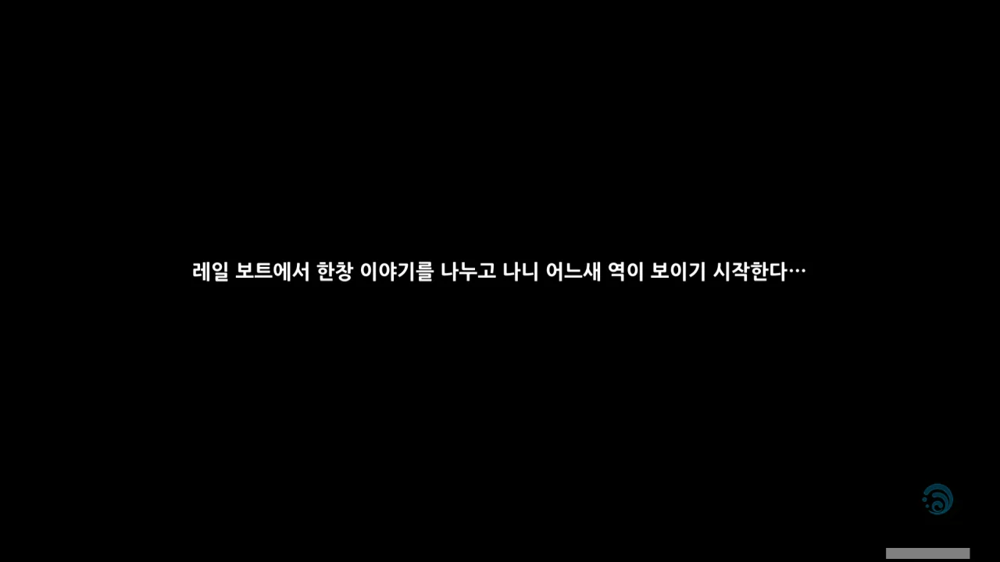

아, 이제야 이동 구간에 배정된 대화가 모두 끝난 모양이다. 더 이상 배 위에 올려둘 필요가 없으니 곧바로 플레이어를 이동시키네.



저 멀리 폰타인성의 모습이 보인다.









보면서 몇 번이고 느끼는 것인데, 폰타인성은 참 이쁘게 생겼다.





샤를로트는 다음 인터뷰 때문에 바로 헤어지게 되었다.

스팀버드 사는... 아마 금방 다시 방문하게 될 것이다. 스팀버드사에서 폰타인 평판 임무를 관리하거든...



어디로 갈지 갈피를 잡지 못하는 여행자 일행을 리니가 자신의 집으로 초대한다.





이리하여 폰타인성에 첫 발걸음을 내디뎠다. 사실 폰타인 지도 밝힌다고 몇 번 오긴 했지만...
