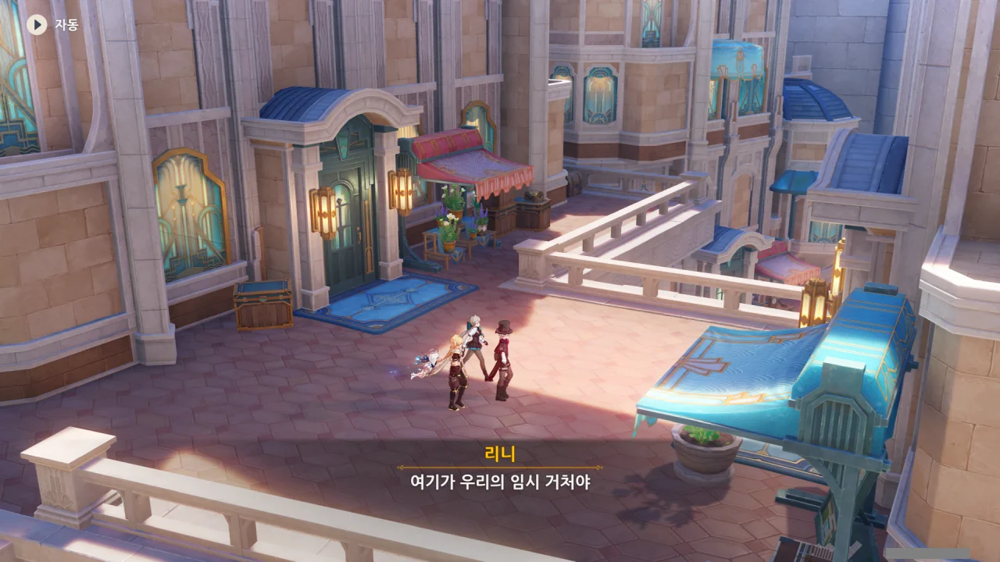
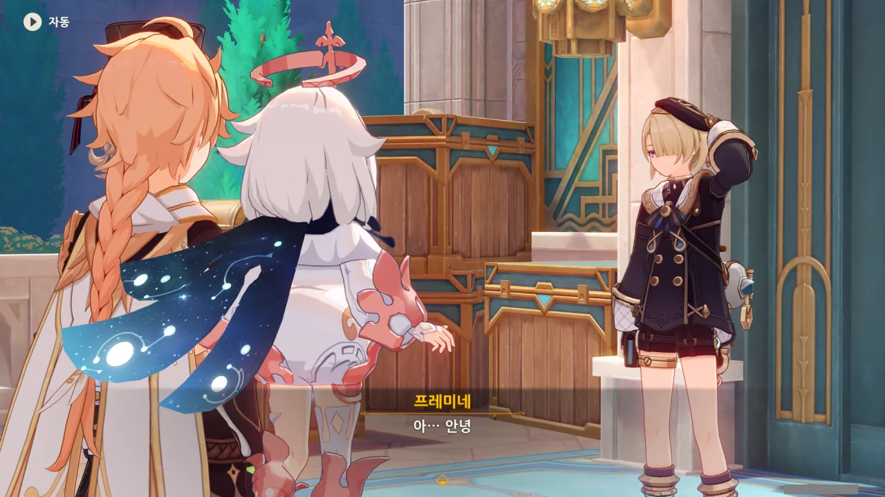
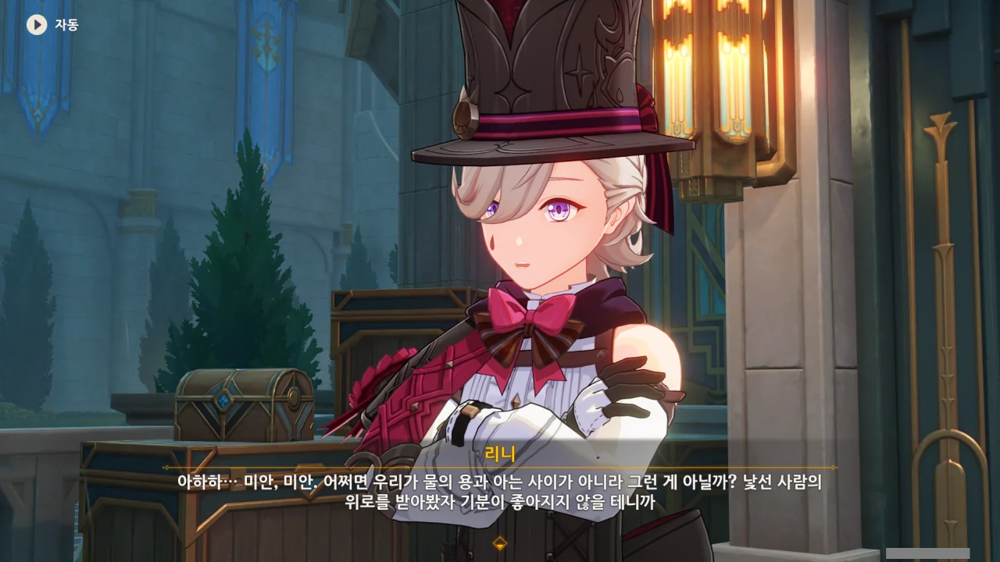
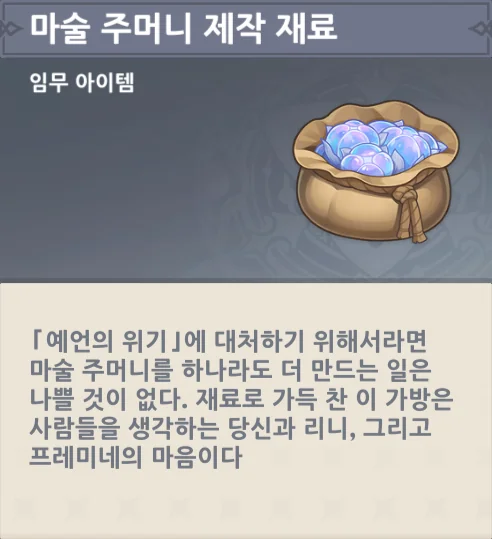
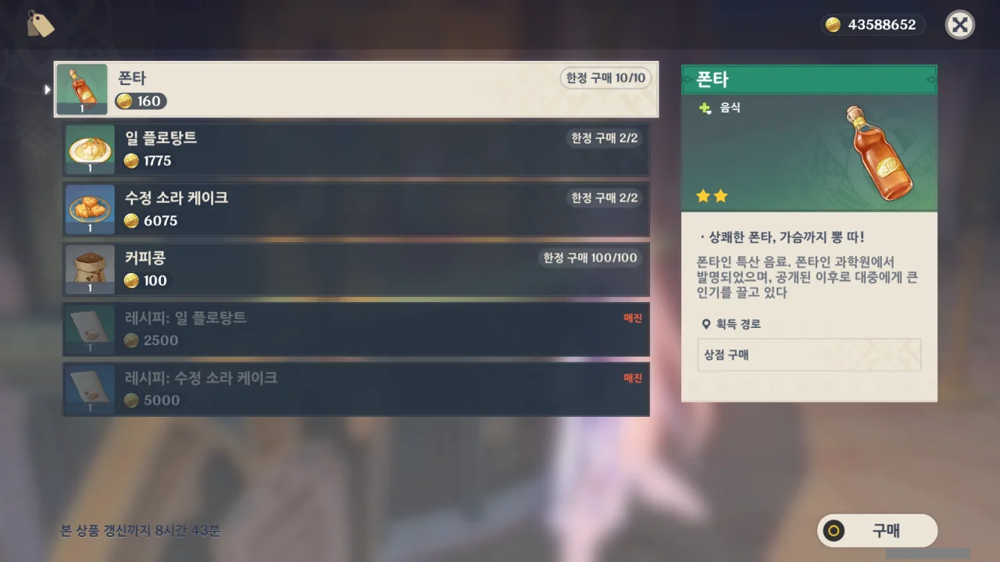
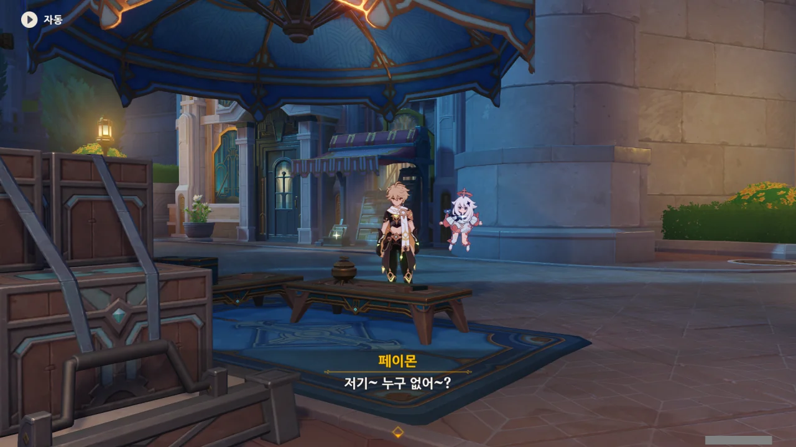
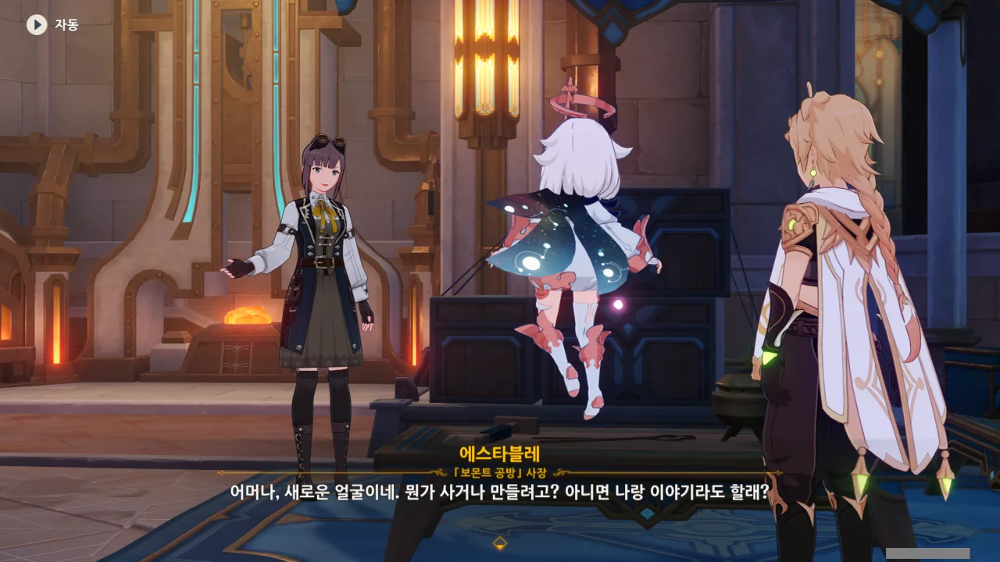
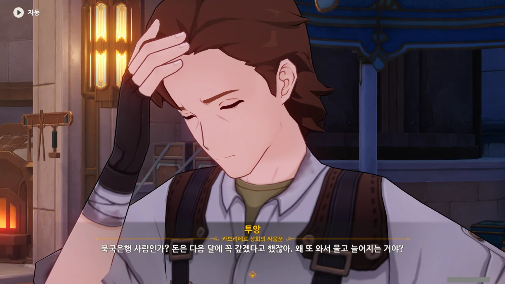
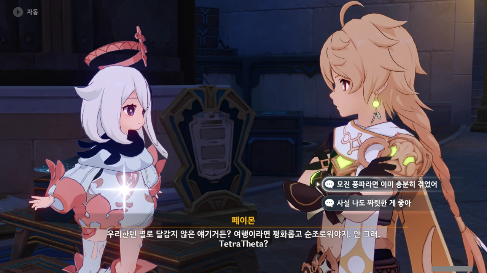

여기가 임시 거처라고? 리니의 집은 따로 있는 걸까?

그런데 '임시 거처' 치곤 너무 번드러진 집이다. 폰타인의 수도인 폰타인성 한가운데에 이렇게 으리으리한 집을 마련해 놓고, 그걸 고작 '임시 거처'라고 부르다니... 서울 강남 한복판의 빌딩 한 채를 '임시 거처'라고 부르는 꼴 아닌가.

대체 리니의 정체가 뭐지? 집이 부자 집안인 건가?



집 앞에 누군가가 서있는데, 이름이 '프레미네'라고 한다.

'다들'이라고 말하는 걸 보면, 리니의 '임시 거처'에는 리니와 리넷, 프레미네 말고도 다른 사람들이 살고 있는 모양이다.

그러면 이 집은 리니를 포함한 여럿이 돈을 모아 마련한 집인 걸까? 그렇다고 하기에는 집 위치가 너무 좋은데... 이런 집을 '임시 거처'라고 부르는 것도 조금 이상하고 말이다.



「아버지」라고?

리니가 프레미네를 자신의 동생이라고 소개하지만, 이 둘은 일반적인 형태의 가족 관계가 아닌 것 같다. 일반적으로, 친아버지가 되었건 양아버지가 되었건, 자신의 아버지를 그냥 '아버지'라고 부르지, 절대로 '「아버지」'라고 부르지 않는다.

지금으로써 추측할 수 있는 건, 이들이 혈연으로 묶인 진짜 가족이 아니라, 의형제 같은 유사 가족일지도 모른다는 것이다.

수줍은 건지, 부끄러움이 많은 건지 몰라도, 프레미네가 우물쭈물하며 인사를 한다.



한 번 떠보기 위해, "리니는 가족이 많네"라고 물어보았지만, 리니는 "하하" 웃는 것으로 어물쩍 넘겨버린다.



뭔가 비밀스럽게 할 말이 있는 듯, 프레미네가 리니를 부른다.





무슨 이야기를 그렇게 둘이서 속닥속닥 나누나 싶었는데, '그냥 집안일'이라고 한다.

... 뭐, 집안일 중에서도 남들에게 굳이 밝히고 싶지 않은 집안일이 있을 수는 있지...



리니가 프레미네에게 「마술 주머니」 재료 수집 현황을 물어본다.

리니가 아까 "기왕 나온 김에"라고 말하길래, 리니가 바다 이슬 항구에 온 건 뭔가 다른 목적이 있어서라고 생각하고 있었는데, 원래 목적 자체가 「마술 주머니」의 재료를 모으기 위해서였던 듯하다.

대체 왜 바다 이슬 항구를 방문한 본 목적을 숨긴 걸까?





재료를 모아 공방으로 출발하려던 찰나, 맑던 하늘이 갑자기 급격하게 흐려지더니, 비가 오기 시작한다.

뭐지? 푸리나의 여행자 폰타인성 방문 기념 흠뻑쇼인가? 그렇다고 하기에는 아까 푸리나를 본 소감에 따르면, 이런 짓을 벌일만한 성격은 아닌 것 같던데...



아무리 그래도 그렇지, 맑고 화창하던 날씨가 이렇게 갑자기 급격하게 흐려지는 건 명백하게 이상한 일이다.

리니가 오페라 하우스에서 심판이 있는 날에 이렇게 소나기가 내린다고 말하는데, 대체 비가 내리는 것과 심판이 있는 것에 무슨 상관이 있다고?



다른 전설? 폰타인에서 비가 내리는 것에 대한 전설을 내가 들은 적이 있었나? 해수면이 상승한다는 '예언' 말고는 들은 적이 없는 것 같은데...





프레미네가 믿는 전설에 따르면, 옛날 폰타인에는 물의 용왕이 있었으며, 물의 용왕이 울 때면 하늘에서 비가 내렸다고 한다. 프레미네의 어머니는 비를 그치게 하고 싶으면 하늘에 대고 "물의 용아, 물의 용아, 울지 마"를 소리치면 된다고 말했다고 한다.

원신의 배경 설정 중에 '원소 용'이 있었던 것 같긴 한데, 상세한 내용은 잘 기억나지 않아, 그냥 '그런가?'라고 생각만 하고 있다. 드발린이... 원소 용 중 하나였던가?

&nbsp;

그나저나 아버지는 '「아버지」'라고 부르면서, 어머니는 평범하게 '어머니'라고 부르네. 대체 「아버지」의 정체가 뭐길래 저러는 걸까?

설마 그 '「아버지」'가 진짜 가족의 아버지가 아니라, 일종의 코드네임인 건 아니겠지...?





자기도 해보겠다며 페이몬이 "물의 용아, 물의 용아, 울지 마"를 외치지만, 당연히 비가 그칠 리 없다.



"결국 전설일 뿐이니까"라고 말하기에는, 전해져 내려오는 전설이 과거 실제 있었던 일인 경우가 자주 있는 티바트인지라, 정말 자신 있게 그렇게 말하기 힘들다. 전설이 전설인 건 맞긴 하지만.

낭만 없는 소리를 한 리니가 리넷에게 "마술사라면 낭만을 잘 알아야 한다"라며 한소리를 듣는다.

뭐, 정말 리니 말처럼, 낯선 사람에게 위로를 받아봤자 기분이 좋아질 리 없어서, 여전히 비가 내리는 걸 수도 있긴 하겠네.

이런 이야기가 괜히 나왔을 리 없으니, 분명 나중에 정말 물의 용이 나오고, 정말로 물의 용을 위로해줘야 하는 상황이 나오지 않을까?





'잠시 후'라고 했지만, 벌써 해가 져 어둑어둑해졌다. 아까 비가 내리기 전까지만 해도 해가 하늘 위에 노랗게 떠있었는데...

폰타인의 레일 보트는 해가 지면 운행을 더 하지 않는 모양인지, 리니가 내일 있을 오페라 하우스 공연을 위해 레일 보트 막차를 타러 가야 한다고 말한다.

리니는 내일 에리니에스섬의 오페라 하우스로 오라며, 리넷을 마중 보내겠다고 한다.







여행자가 프레미네를 대신해 보몬트 공방으로 「마술 주머니」 제작 재료를 가져다주기로 했다.

대체 공방 사장이 얼마나 수다스럽길래, 프레미네가 무서워하는 걸까?

&nbsp;

카페에서 살 수 있는 음식, '폰타'의 번역이 참 재미있게 되어 있다.

> 폰타
> ***
> *상쾌한 폰타, 가슴까지 뽕 따!*
> 폰타인 특산 음료. 폰타인 과학원에서 발명되었으며, 공개된 이후로 대중에게 큰 인기를 끌고 있다.
{.bq}

생긴 건 마치 콜라처럼 생겼다. 음료의 이름까지 같이 고려한다면, 환타와 비슷한 음료라고 생각하면 되겠지? 폰타인이 Fontaine이고 환타가 Fanta이니, 둘의 스펠링도 매우 비슷하다.

보몬트 공방에 도착했다.

> 저기~ 누구 없어~?

이 대사를 들으니 이 영상이 생각나네.



> AnYoNe ThErE? hElLo
{.bq}

> 아니면 나랑 이야기라도 할래?

보통, 가게에서 손님을 맞이할 때, 빈 말이라도 "나랑 이야기라도 할래?"라고 하진 않는다.

프레미네가 왜 이 사람을 무서워했는지 조금은 알 것 같기도 하네. 이 사람, 수다 떠는 걸 엄청 좋아하는 모양이다.





「마술 주머니」의 '마'도 꺼내지 않았는데, '재료'라는 말만 듣고 「마술 주머니」를 만들러 온 거라고 곧바로 알아채는 보몬트 공방의 사장, 에스타블레. 리니가 「마술 주머니」 제작을 한두 번 맡긴 게 아닌 모양이다.

더욱 놀라운 건, 리니가 「마술 주머니」의 제작 비용을 모두 미리 지불했다는 것이다. 값을 깎아주겠다는 사장의 호의조차 거절한 채, 제값을 모두 치렀다고.

사장 말처럼, 리니는 마술사여서 돈을 잘 버는 걸까? 아니면 리니네 집안이 부자인 걸까? 성 안에 '임시 거처'를 마련한 것부터 시작해, 리니의 이미지가 점차 '수상할 정도로 돈이 많은 리니'가 되어가고 있다.



무슨 원리로 움직이는 건진 잘 모르겠지만, 현대 대장간에서나 볼 수 있는 장치가 보인다.

가운데 있는 금속 부분이 올라갔다가 떨어지며 아래에 놓여 있는 달아오른 금속을 내리친다. 이게 열간 단조(Hot Forging)이었던가?

에스타블레의 팔뚝이 공방 사장 치고는 가느다래 이상하다 생각하고 있었는데, 저렇게 망치질을 대신해주는 기계가 있어서 그런 거였다. 뭐, 그런 거라면 팔뚝이 가느다래도 아무 문제가 없지.



이 기계들은 대체 어떤 원리로 움직이는 걸까?



성 안에서 일상적으로 사용되는 에너지는 「심판」을 통해 생성되는 「판결 에너지」라고 한다.





오페라 하우스에서 「심판」이 이루어질 때, 「계시 판결 장치」가 정의를 향한 사람들의 신앙을 모아 「판결 에너지」로 변환한다고 한다.

그런데 이 에너지 변환 과정은 일곱 집정관이 힘을 모으는 방식과 동일하다. 일곱 신은 자신을 향한 사람들의 신앙을 신의 심장을 통해 자신의 힘으로 전환할 수 있다. 그게 폰타인에서는 「계시 판결 장치」가 사람들의 신앙을 에너지로 변환하고 있는 거고.

사람들의 신앙을 자신의 힘으로 삼는 대신, 「계시 판결 장치」를 통해 폰타인 사람들이 널리 쓸 수 있는 「판결 에너지」로 바꾸어 베푸는 푸리나는 어쩌면 내가 생각했던 것보다 더, 사람들을 끔찍이 아끼는 신일지도 모르겠다.

이거, 다음에 만났을 때에는 조금 부드럽게 대해야 하는 걸까.



「판결 에너지」 외에도 「프뉴무시아 에너지」라는 게 또 있다고? 아니, 폰타인은 무슨 에너지 자원 강국인 거야?

「프뉴무시아 에너지」는 신의 힘에 의해 생성되는 에너지는 아니지만, 굉장히 불안정하다고 한다.





「프뉴무시아 에너지」에 대해 사장이 막 설명하려던 찰나, 카브리에르 상회의 싸움꾼들이 찾아와 훼방을 놓는다.

사장이 카브리에르 상회에 돈을 좀 빌린 모양인데, "다음 달에 꼭 갚겠다", "왜 또 와서"라는 말을 하는 걸 보면, 빌린 돈을 제 때 갚지 못하고 연체한 적이 좀 있는 모양이다.

하지만 그렇다고 해도, 오늘 갑자기 와서 빌린 돈의 70%나 받아가겠다고 생고집을 부리는 상회의 태도 역시 잘못되었다. 내가 볼 때, 비교적 안전하게 대출 원금과 이자를 회수할 수 있는 방법이 있음에도 더 높은 이자를 받기 위해 상회가 그걸 쓰지 않은 것 같거든.

&nbsp;

잠깐 대출상환 방식에 대해 알아보자. 대출을 상환하는 방법에는 크게 세 가지가 있다.

* 만기 일시상환
* 원리금 균등상환
* 원금 균등상환

이 중 우리가 가장 흔하게 접하는 상환방식은 '원리금 균등상환'이다.



원리금 균등상환에서 채무자, 즉 돈을 빌린 사람이 매 상환기일마다 갚아야 할 돈은 늘 동일하다. 매번 일정한 금액의 돈을 갚는 것이다.

그래프에서 볼 수 있듯, 원리금 균등상환에서는 돈을 갚아나갈수록 갚은 돈 중 이자가 차지하는 비율이 줄어들게 된다.

이 원리금 균등상환을 가장 쉽게 찾아볼 수 있는 것이 바로 휴대전화 할부금이다.

원금 균등상환에서 채무자가 매 상환기일마다 갚아야 할 원금은 늘 동일하다. 하지만 이자의 금액은 원리금 균등상환과 비슷하게, 처음에는 많이 내다가 점차 줄어들게 된다.

따라서 채무자가 내는 금액은 처음엔 많다가, 갈수록 줄어들게 된다. 대신 원리금 균등상환과 비교할 때, 갚은 돈의 총액은 조금 더 적게 된다.

만기 일시상환은 모두가 알다시피, 만기일이 되면 원금과 이자를 한꺼번에 갚는 방식이다.

&nbsp;

자, 이제 상회 이야기로 다시 되돌아가자.

공방 사장의 말로 미루어보아, 사장은 상회로부터 '만기 일시상환'의 방식으로 돈을 빌린 것으로 추측된다.

만약 상회가 빌려준 돈의 원금 회수를 우선시했다면, 사장에게 '원금 균등상환' 혹은 '원리금 균등상환'의 방식으로 돈을 빌려주었을 것이다. 그 편이 돈을 떼 먹힐 가능성을 낮춰주기 때문이다. 하지만 상회는 굳이 '만기 일시상환'의 방식으로 사장에게 돈을 빌려주었다. 왜냐고? 더 높은 이자를 받고 싶어서!

그런 주제에 계약에도 없는 원금 중간회수를 하려고 들어?



그때 갑자기 타르탈리아가 나타나, 카브리에르 상회가 북국은행에 떠넘긴 부실 채권을 언급하며 상회의 싸움꾼들을 몰아세운다.

상회가 보몬트 공방처럼 빚을 잘 떼먹는 채무자와의 계약을 북국은행에 떠넘긴 모양이다.

> 북국은행 사람인가? 돈은 다음 달에 꼭 갚겠다고 했잖아. 왜 또 와서 물고 늘어지는 거야?

이봐요, 싸움꾼 씨. 네가 그 말을 쳐하면 안 되죠. 내가 하면 로맨스고 남이 하면 불륜인 거야? 거, 참. 지랄도 정도껏 해야지.

상회의 우두머리가 어떻게 생겼을지는 불을 보듯 뻔하다. 분명 배불뚝이에 탐욕이 그득그득한 돼지겠지.



여기서 타르탈리아와 만날 줄은 정말 꿈에도 몰랐다.

마지막으로 타르탈리아와 만났던 게 이나즈마 마신 임무에서 탈주한 스카라무슈를 잡으러 이나즈마에 왔다가 '미로의 전사' 이벤트에 등장하는 비경에 휘말렸던 것으로 기억하고 있다. 이후 계속 이나즈마에 머물며 스카라무슈를 찾다가, 세계수에 의한 전 세계적 기억 개변으로 인해 이나즈마에 온 목적을 잊고 다시 스네즈나야로 되돌아간 모양이다.



이 자식, 여행자를 만났다고 너무 좋아하는데.

페이몬에게서 "문제를 몰고 다닌다"라는 소릴 들었는데, 타르탈리아마저 여행자를 "가는 곳마다 싸움을 몰고 다닌다"라고 평가한다. 어흑, 마이깟.

본디 여행이라는 것은 느긋하게, 마음의 평화를 누리며 다녀야 하는 것이다. 가는 곳마다 싸움을 벌이는 것이 아니라. 아니, 그전에, 여행자가 티바트 전역을 돌아다니는 건 여행을 하기 위해서가 아니라, 여동생을 찾기 위해서잖아.

그런데... 그런데, 세상이 날 억까해...





시비를 걸어놓고 정작 여행자와만 이야기하는 타르탈리아 때문에 병풍 신세가 된 상회의 싸움꾼들이 잔뜩 약이 올랐다. 하지만 타르탈리아는 오랜만에 만난 여행자와 대화를 나눌 수 있다는 것에 잔뜩 신이 난 상태이다.



상회 사람은 아랑곳 않고 자기 가족과 얼음낚시를 간 이야기를 하는 타르탈리아.

결국 화가 머리끝까지 난 싸움꾼이 먼저 싸움을 건다.





어, 타르탈리아. 가서 날뛰고 와.



으응? 내가 타르탈리아를 조종하는 거였어?



타르탈리아가 우인단의 집행관인 걸 이제야 알아차린 걸까? 하지만 이미 너무 늦었어!

이제 곧 흠씬 두들겨 맞고 어디론가 실려갈 신세인 싸움꾼.



타르탈리아가 물의 창을 꺼내든 순간, 갑자기 물의 창이 흩어져 사라진다.



타르탈리아가 놀라는 것을 보면, 물의 창이 흩어져 사라진 것은 타르탈리아가 의도했던 바가 아니었던 모양이다.

너무 자연스럽게 물의 창이 사라져서, 난 그것조차도 타르탈리아의 연출이라고 생각했는데.





타르탈리아의 빈틈을 노리고 싸움꾼이 달려들었지만, 어림도 없지. 타르탈리아에게 한 대 얻어맞고 그대로 쓰러진다. 싸움꾼을 때려눕히고 '얘 뭐지?'라고 하는 듯, 어깨를 으쓱이는 타르탈리아.

싸움꾼을 후려 패는 타르탈리아의 동작이 어딘가 낯이 익다고 생각했는데, 나중에 알아보니 타르탈리아의 일반 공격 모션 중 일부를 그대로 재활용한 것이라고 한다. 왜, 평타 맨 마지막에 거의 화살을 집어던지다시피 해서 쏘는 그 모션 있지 않은가.



공격하려던 순간 물 원소의 힘이 자신의 통제를 벗어난 것 같다고 말하는 타르탈리아. 하지만 타르탈리아의 신의 눈은 아직 겉보기엔 멀쩡해 보인다.



신의 눈이 가진 힘에 너무 의존하면 예리함을 잃게 된다며, 신의 눈 대신 쓰려는 것이 하필이면 사안이다.

이나즈마에서 보았듯이, 마신의 잔재를 이용해 만드는 사안은 사용하면 사용할수록 몸이 쇠약해지고 급속한 노화를 겪게 된다. 그 탓에 사안을 남용한 와타츠미 저항군 병사들은 극도로 쇠약해지거나 죽었다. 그 대표적인 예가 텟페이였지.



대체 무슨 일로 폰타인에 온 거냐고 물으니, "사실 요즘 내가 기분이 안 좋아서 말이야"라는 생뚱맞은 대답이 돌아왔다.

뭐지? 우인단은 기분이 안 좋다는 이유로 병가를 낼 수 있는 직장이었던 건가? 직원 복지가 엄청 훌륭한 기업이네!



얼마 전부터 몸 안에서 어떤 힘이 요동치는 것 같다고 말하는 타르탈리아. 갑자기 기분이 가라앉는 건 단극성 우울증 아냐?



아니면 진짜 타르탈리아의 말처럼, 몸속에서 요동치는 힘 때문에 신의 눈도, 타르탈리아의 기분도 삐걱대는 것일 수도 있다.





타르탈리아는 14살 때 정체불명의 심연에 빠진 적이 있다고 한다. 거기서 「스커크」라는 이름의 스승을 만났고, 스승에게서 지금 그가 쓰고 있는 대부분의 기술을 배웠다고 한다.



「스커크」가 타르탈리아를 제자로 받아들인 건, 타르탈리아가 「그것」을 깨웠고, 타르탈리아의 몸에 「그것」의 흔적이 남았기 때문이라고 한다.

내가 모르는 단어가 너무 막 나오는 것 같은데... 「스커크」는 사람 이름이라고 쳐도, 「그것」은 대체 또 뭐야?





「스커크」는 「그것」이 무엇인지 설명해주진 않았지만, 타르탈리아는 「그것」이 자신이 처음 심연에 빠졌을 때, 꿈에서 본 커다란 「고래」와 연관이 있다고 생각하는 모양이다.

그렇다고 해도 그 고래를 보스전 스킬에 넣다니, 페이몬 말처럼 정말 악취미이다. 그런 주제에 플레이어블 캐릭터일 땐 그 고래를 쓸 수도 없고!





심연에서 나온 후, 타르탈리아는 계속해서 그 심연과 스승을 찾아다녔지만, 아무런 소득이 없었다고 한다.

어디서 들은 이야기인진 잘 기억나지 않지만, 「스커크」는 여성이라고 하던데... 뭐, 언젠간 만날 수 있겠지.



폰타인의 정식 「결투 대리인」과의 싸움 약속 때문에 떠나려는 타르탈리아. 여기 와서도 온통 전투 생각뿐이구나...





폰타인에서, 용의자는 「판결」을 받기 전, 명예를 지키기 위해 정식으로 인정받은 결투 대리인과 싸울 수 있다.

결투 대리인은 폰타인 전체에서 가장 무예가 강한 자들 중에서 선발되는 데다가, 결투 도중 죽을 수도 있기 때문에, 결투를 신청한다는 건 자신의 목숨을 걸고 명예를 지키겠다는 선언으로 받아들여진다고 한다.

이기면 「판결」을 면제받고, 지면 죽던가 법정으로 다시 끌려가는 것이다.



까딱하면 죽을 확률이 높기 때문에, 결투는 억울한 누명을 썼거나 명예가 목숨보다 중요한 사람이 아니라면 신청하지 않는다고 한다.

타르탈리아는 해당 제도가 존재하는 이유가 '국민 개인의 명예를 존중한다'라는 뜻을 내비치기 위해서라고 보고 있다.



타르탈리아는 결투 대리인 중 가장 강하다는 클로린드와 싸울 생각에 잔뜩 신이 난 듯하다.

여행자 역시 클로린드를 만난 적이 있다. 처음 푸리나를 만났을 때, 그녀를 경호하던 경호대장이 바로 클로린드였다. 왜, 여행자가 푸리나에게 칼을 뽑아들자, 무례하다고 여행자를 질책한 그 여자 말이다.



타르탈리아가 자신의 신의 눈을 여행자에게 던져준다.

뭐지? 신의 눈은 소중한 물건 아니었어? 외부 마력 기관이라고 들었던 것 같은데. 그런데 그걸 이렇게 쉽게 준다고?



타르탈리아가 자신의 신의 눈을 여행자에게 맡긴 건, 방금 전처럼 물의 원소가 자신의 통제를 벗어나 결투를 망치는 일이 생기지 않도록 하기 위해서라고 한다.

> 잠깐 맡겨두는 것뿐인데 뭐. 나중에 시간 날 때 찾으러 올게.

흠... 이거 100% 복선이다. 타르탈리아는 모종의 사건 때문에 신의 눈을 되찾으러 올 수 없는 신세가 되고, 여행자가 직접 타르탈리아를 찾아가 신의 눈을 다시 되돌려준다는 전개가 벌써 눈앞에 훤히 보인다.



"또 여행자와 만날 핑계를 만드는 것뿐 아냐?"라는 페이몬의 말에 무슨 말인지 모르겠다고 대답한 후, 그냥 휑하니 가버린 타르탈리아.

타르탈리아를 흘겨보는 페이몬이 오늘따라 유달리 귀엽다.



그러게. 아까 분명 타르탈리아가 기분이 안 좋다고 했는데, 정작 여행자와 대화할 때의 타르탈리아는 평소와 그리 다를 바 없었다. 뭐... 알아서 잘하겠지.

어차피 오페라 하우스에서 공연이 시작하기까지는 시간이 좀 남았다. 그 시간 동안 폰타인 시내를 둘러보는 것도 나쁘진 않겠지.
