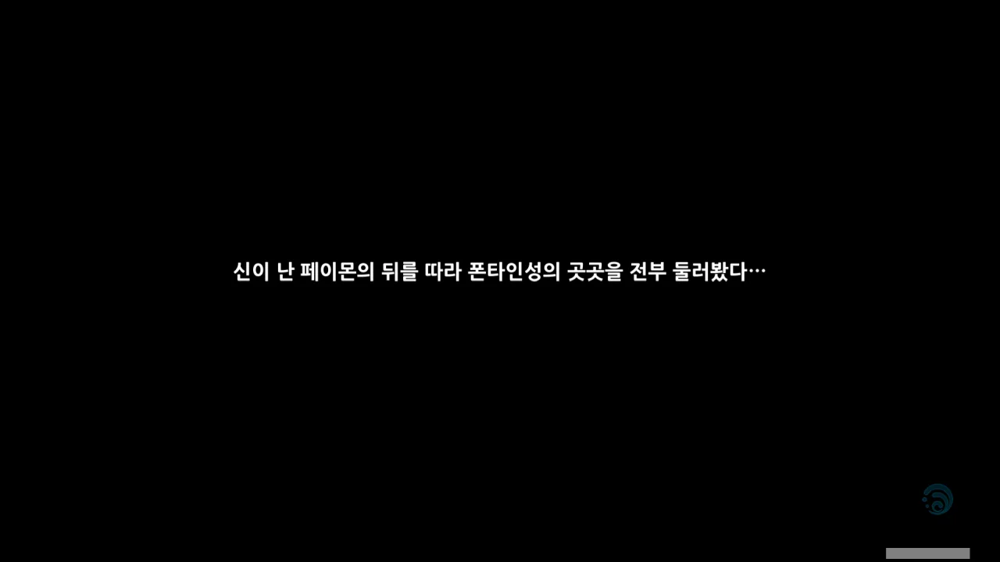

오페라 하우스에 가기 전, 폰타인성 곳곳을 돌아보기로 했다.



이야, 살다 살다 페이몬이 책을 좋아하게 되는 날이 오긴 하는구나...

바로 전 지역인 수메르에서 페이몬이 알하이탐에게 받은 취급을 생각하면, 정말 감지덕지라고 생각된다.

> * 넌 질문하기 전에 생각이라는 걸 안 하는 것 같아서, 생각할 시간을 준거야.
> * 네가 정답을 맞히리라 기대도 안 했지만, 그 말은 사실과 거리가 멀군.
> * 며칠 전에 눈을 맑게 해주는 안구 체조 자료를 본 적 있는데, 혹시 필요한가?
{.bq}

이렇게 대놓고 페이몬을 멍청하다고 놀려댄 알하이탐에게 페이몬은 제대로 된 반격조차 하지 못했다. 자기 마음에 안 드는 사람에게 으레 붙이던, 우스꽝스러운 별명조차 제대로 지어주지 못했거든.

&nbsp;

이나즈마에선 라이트 노벨이 유행하던데, 폰타인에선 추리 소설이 유행하는 것 같다. 오페라 하우스에서 재판을 하는 폰타인의 풍습과 완전히 무관하진 않겠지, 아마.



아무래도 결말을 스포일러 당하면, 내가 느낄 수 있는 놀라움과 감동은 스포일러를 당하지 않았을 때보다는 적을 것이다.

물론 본인의 의지로 스포일러를 당하는 건 상관없지만. 그건 어디까지나 개인의 선택 아니겠는가.





폰타인 레일 보트에는 세 노선이 있다.

* 칼라스선: 폰타인성 북부 폰타인 과학원행
* 나비아선: 폰타인성 동부 에리니에스섬행
* 클레멘타인선: 폰타인성 남부 바다 이슬 항구행

오페라 하우스가 에리니에스섬에 있다고 했으니, 나비아선을 타야겠네.

그런데 멜뤼진 가이드가 있다고? 아주 좋아.

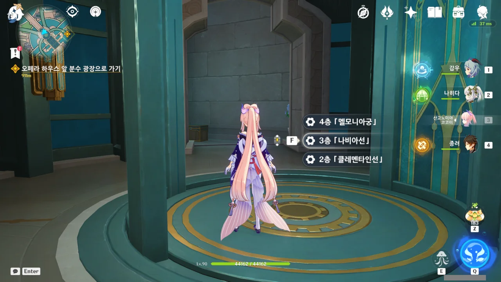

4층의 「멜모니아궁」은 대체 뭘 하는 곳일까? 이름만 들어선 마치 궁전처럼 들리는데... 설마 거기가 푸리나의 집인 걸까? 이야, 그러면 푸리나의 집은 방문만 열면 환승역인 초역세권에 있네.

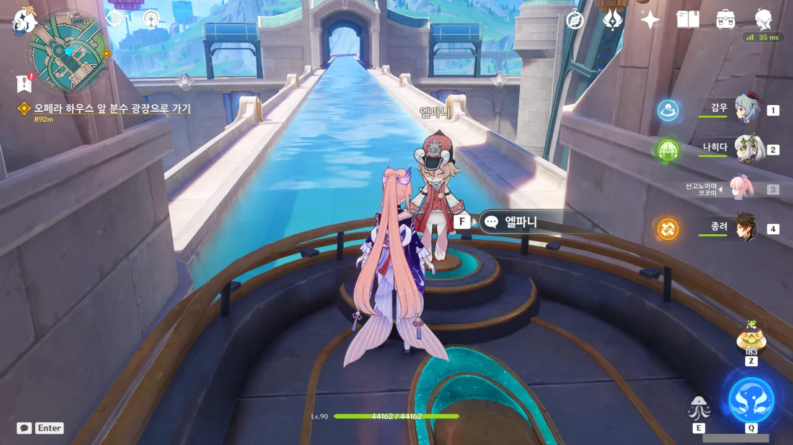

나비아선에는 귀여운 멜뤼진 가이드, 엘파니가 있다.



엘파니에게 이것저것 물어볼 수 있다.

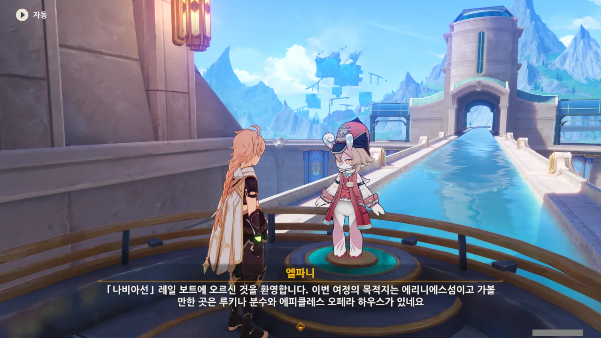

목적지에 대해 물어보니, 목적지와 인근 관광지를 소개해준다.





> 멜뤼진은 폰타인에서 탄생한 젊은 종족으로, 다양한 면에서 인간과 다릅니다.

젊은 종족? 종족이 젊다는 건 무슨 의미일까?

> 승객분께 공유해 드릴 수 있는 비밀이 하나 있습니다.
> 멜뤼진과 인간 사이엔 하나의 공통점이 있는데, 그건 바로 멜뤼진들도 저마다 성격이 다르다는 거예요.
> 어떤 멜뤼진은 수다를 좋아하고, 어떤 멜뤼진은 그렇지 않죠.

이 말을 들으니, 마치 엘파니가 '전 수다를 좋아하지 않으니, 제발 닥쳐주세요'라고 공손히 말하는 것 같아, 얌전히 배에 타기로 했다.



저 안내 대사를 듣자마자 자연스럽게 하프라이프 트램 안내 대사가 떠올랐다.



> Please keep your limbs inside the train at all times. Do not attempt to open the door until the train has come to a complete halt at the station platform.
> 열차 밖으로 손이나 발을 내밀지 마시고, 열차가 완전히 멈추기 전에는 문을 열지 마시기 바랍니다.
{.bq}

물론, 멜뤼진이 귀여운 목소리로 또박또박 읽어주는 저 안내문이 더 귀엽다.

하... 멜뤼진. 이렇게 귀여워도 되는 걸까?

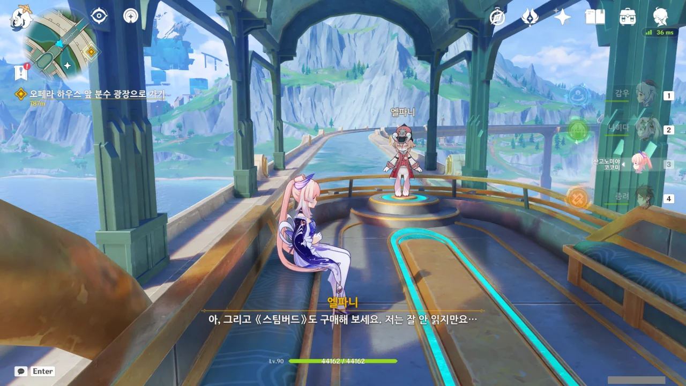

여기서 왜 굳이 《스팀버드》 구매를 권유하는 걸까? 설마 스팀버드 역시 레일 보트 운영에 관여하고 있는 걸까?

그러면 저 안내는 '코노 방구미와 고란노 스폰사노 데쿄데 오쿠리시마스'와 비슷한 거라고 보면 되겠네.

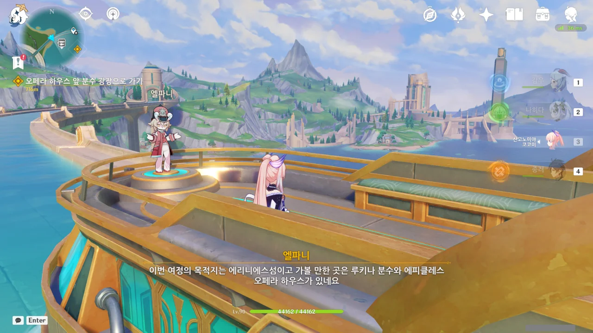

저기 있는 저 건물이 오페라 하우스인 걸까? 분명 워프 포인트를 뚫기 위해 한 번 온 곳인데 잘 기억이 나지 않는다.

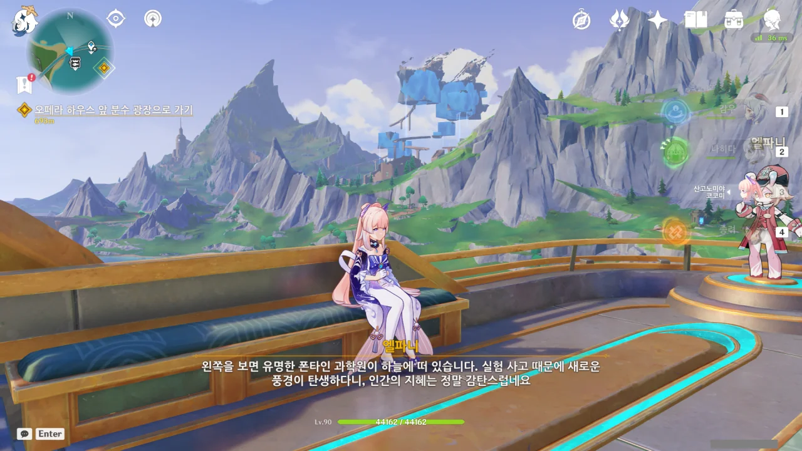

아, 저 공중에 떠있는 물 큐브가 폰타인 과학원이었어? 실험 사고 때문에 저렇게 되었다고 하는데... 대체 뭘 어떻게 해야 저렇게 되는 걸까?

&nbsp;

저렇게 공중에 물이 떠있는 걸 보니, Atomic Heart 트레일러의 한 장면이 떠오른다.



정확한 이유는 모르지만, Atomic Heart에는 물이 공중을 떠다니는 묘사가 자주 보인다. 폰타인 과학원을 볼 때마다 그 묘사가 떠오른다.

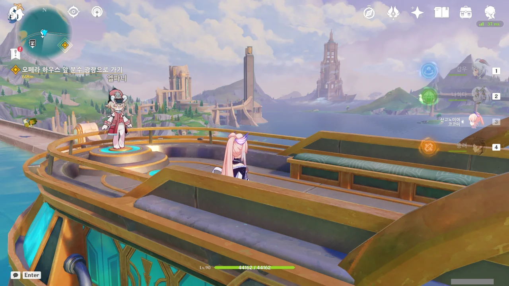

바다 한가운데에 서있는 저 거대한 탑은 뭘까? 대충 방향만 보면, 걸어서 갈 수 있을 것처럼 생겼는데...



엘파니가 멜뤼진의 손은 펜을 잡기 불편해 분실물 보관소 문서 기록을 남기기 힘드니, 두고 내리는 물건이 없는지 다시 한번 확인해 달라고 말한다. ㅋㅋㅋㅋㅋㅋ



레일 보트 유람이 끝나자, '폰타인에 오신 걸 환영합니다!' 업적이 달성되었다.

생각해 보니, 이 업적은 폰타인성에 처음 도착할 때 해금되었어야 하겠네.



아까 폰타인성 터미널에서 칼라스선에 대한 안내는 없었다. 칼라스선을 이용하려면 여기 마코트역에서 환승해야 하는 걸까?

칼라스선 운행이 무기한 중지된 이유가 '불가항력적 사유'란다. ㅋㅋㅋㅋㅋㅋ



오페라 하우스로 가던 중 이동 기믹을 발견해 이용해 보았는데, 단순히 언덕 꼭대기에 내려줄 뿐이었다.

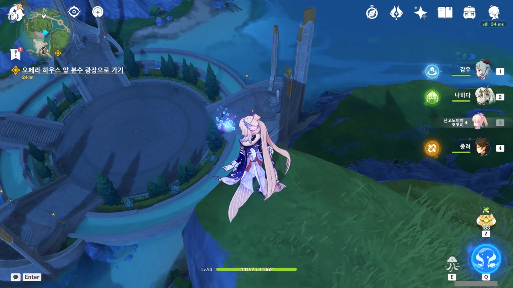

저 밑에 지금은 잘 보이지 않지만, 코펠뭐시기 토벌 보스가 춤추고 있다.

난 저 바닥이 아이스링크인 줄로만 알았는데, 그냥 돌바닥이었더라. 대체 그러면 바닥을 미끄러질 때 나오던 얼음 조각은 어디서 나온 거야?

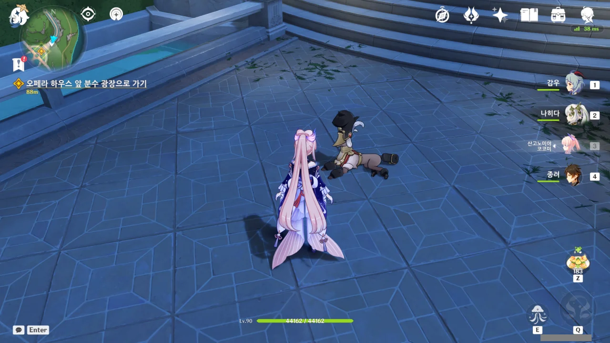

와, 이거 로봇 개가 아니라 살아있는 개였어?

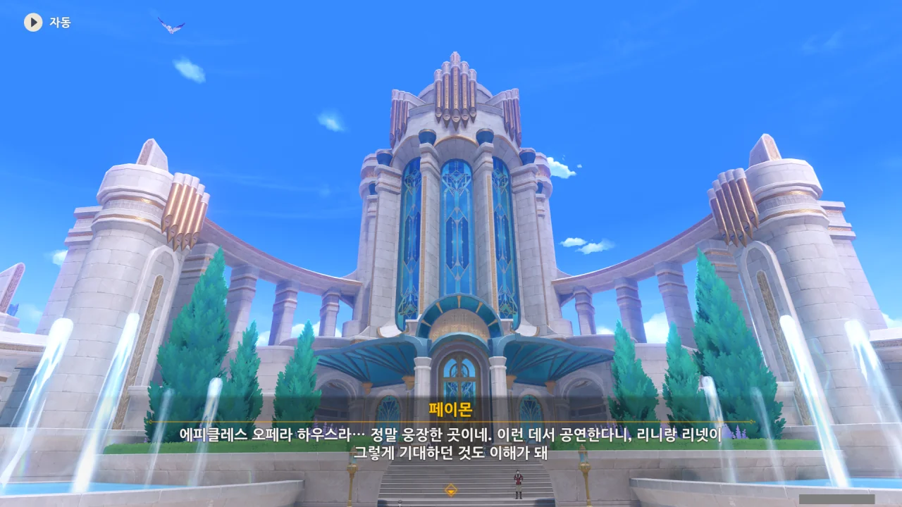

길을 따라 조금 걷다 보니, 벌써 오페라 하우스에 도착했다. 오페라 하우스의 정식 명칭은 '에피클레스 오페라 하우스'. 파이프 오르간을 연상시키는 금색 관이 곳곳에 붙어있는 게 인상적이다.





오페라 하우스 앞 분수대에는 사람들이 많이 모여있는데, 대다수가 부부인 것으로 보인다.

어우, 저런 닭살 돋는 말을 어쩜 저렇게 태연하게 할 수 있는 걸까?

듣고 보니 저게 폰타인의 풍습일 수도 있겠다. 실제로도 로마에도 트레비 분수가 있지 않은가.





여행자의 귀에 자꾸만 누군가가 「바셰」를 부르는 목소리가 들린다.

페이몬에게 네가 '바셰'라고 말한 거냐고 물어보았는데 아니라고 한다. 그럼 대체 누가 말한 거지? 설마 폰타인에도 유령이 있는 건가?

아무튼 전 바셰가 아닙니다. 바세린도 아니고요.



리넷이 갑자기 나타나 이 분수, 「루키나 분수」에 대해 설명한다. 아, 그래. 리니가 분명 리넷을 마중 보내겠다고 말하긴 했었지...

루키나 분수는 폰타인의 모든 물길이 모이는 곳이라고 한다. 그래서 그런 걸까, 폰타인의 신혼부부들은 여기서 아이를 점지해 달라고 빈다고.

그런데 고작 분수 하나에 폰타인의 모든 물이 모이는 것이 과연 가능한 일일까?

루키나 분수가 폰타인의 유일한 수원지라고 한다면 '루키나 분수에 폰타인의 모든 물이 모인다'라고 할 수는 있겠지만, 그렇다면 차라리 '모든 물이 시작하는 곳'이라고 말하지, '모든 물이 모이는 곳'이라고 말하진 않을 것 같은데.



리넷에게 누군가의 목소리가 들렸다고 말하자 '여긴 사람이 많잖아'라는 상식적인 대답이 돌아왔다. 그렇긴 한데, 여행자가 들은 목소리는 분수 주변이 아니라 분수 안쪽에서 들려온 목소리였거든.

대낮에 납량특집을 찍게 생기자 페이몬이 기겁한다.



여행자가 의문의 목소리를 들은 것은 여행자의 물 원소 감지력이 너무 뛰어나서 그런 걸 수도 있다고 리넷이 말해준다.

그러고 보면 여행자는 어딜 가던 그 나라의 원소를 잘만 쓰고 다녔지. 아, 이 멈출 줄 모르는 원소 친화력이란!

그런데 물 원소 감지력이 뛰어난 것과 의문의 목소리를 듣는 것이 대체 무슨 상관인 걸까?



갑자기 여행자에게 '넌 어떨 때 눈물을 흘려?'라고 묻는 리넷.





눈물에는 강렬한 감정이 담겨 있고, 루키나 분수는 폰타인의 모든 물이 모이는 곳이기 때문에 물 원소 감지력이 뛰어난 여행자가 분수의 물에 흘러들어 간 눈물에 담긴 강렬한 감정을 느낀 것일지도 모른다고 말한다.

설득력이... 있어! 정말 루키나 분수에 폰타인의 모든 물이 모인다면 말이지...

&nbsp;

그나저나 루키나 분수의 모티브 중 로마 트레비 분수가 있었던 건지, 분수에 동전이 떨어져 있다.



「바셰」가 누구인지는 몰라도, 나중에 만나게 된다면 주의 깊게 관찰해 보아야겠다.



> 그 사람보다는 우리 오빠를 걱정해야 할 것 같은데.

리니가 겉보기에는 천하태평인 것처럼 보이지만, 사실 공연 전에는 엄청 긴장한다고 한다.

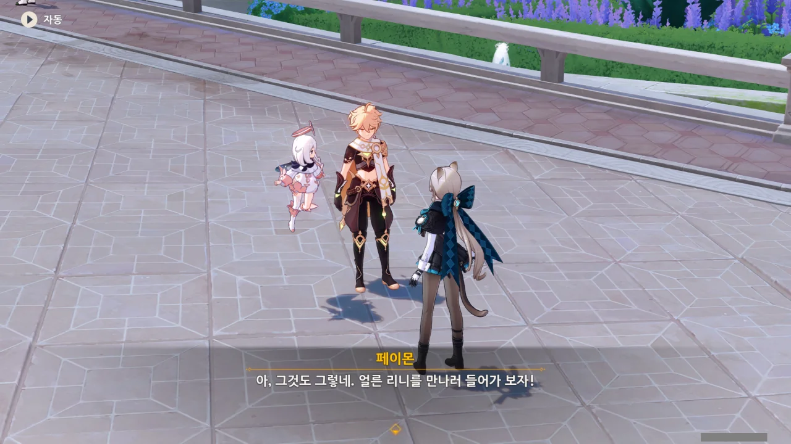

아무튼, 오페라 하우스에 온 목적 중 하나가 바로 리니의 공연을 보는 것이었으니, 리니를 만나러 가보자.

응? 폰타인에서는 분수에 공양을 하는 거야?

드래곤 스파인에서는 인동의 나무에 공양을 했었고, 이나즈마에서는 신성한 벚나무에 공양을 했었다. 수메르에서는 ~~양파~~꿈 나무에 공양을 했었는데, 폰타인에서는 루키나 분수에 공양을 하네.

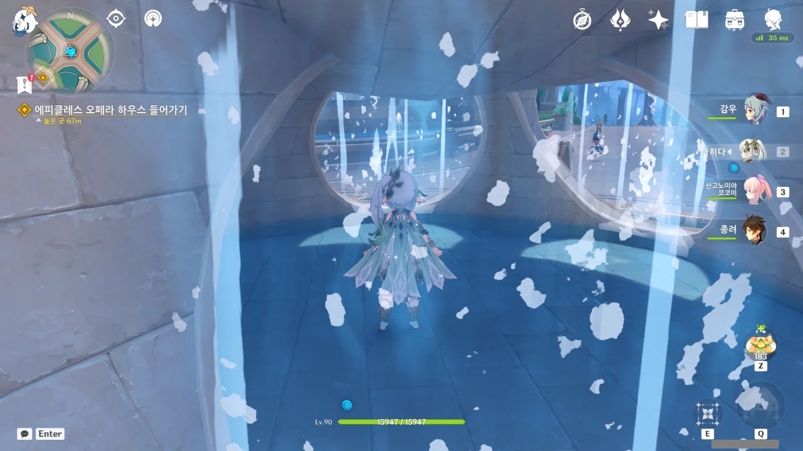

여기에 서있으면 무슨 흐느끼는 목소리가 들린다고 하던데, 왜 난 안 들리는 걸까?

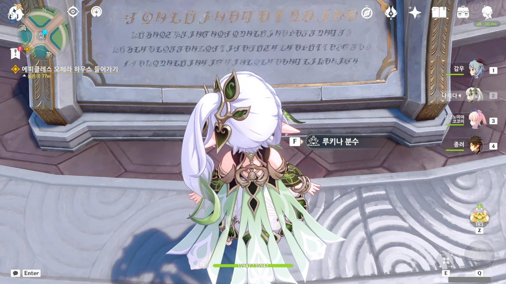

루키나 분수 앞에는 이렇게 글귀가 적혀있다. 나중에 시간이 남으면 한번 해석해 봐야지.
