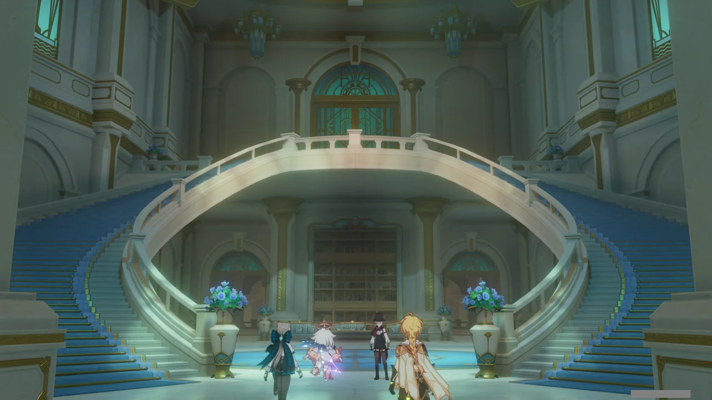
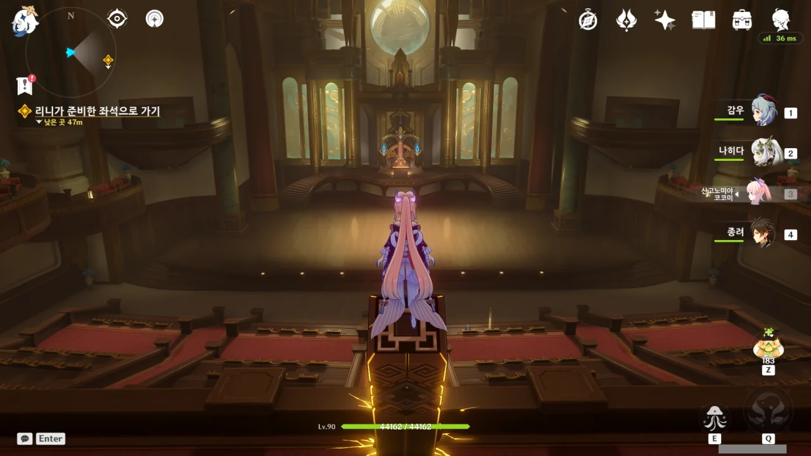
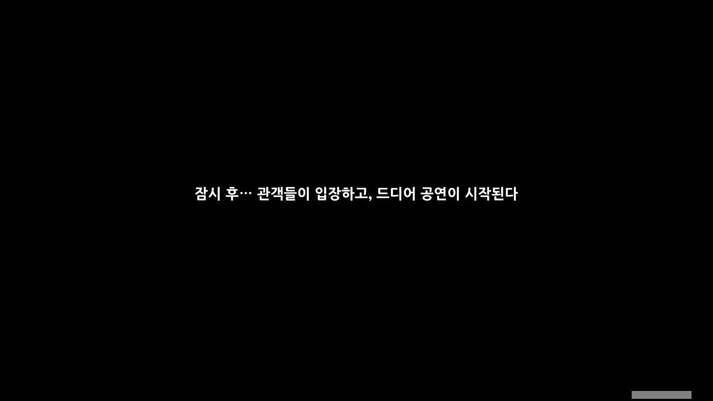
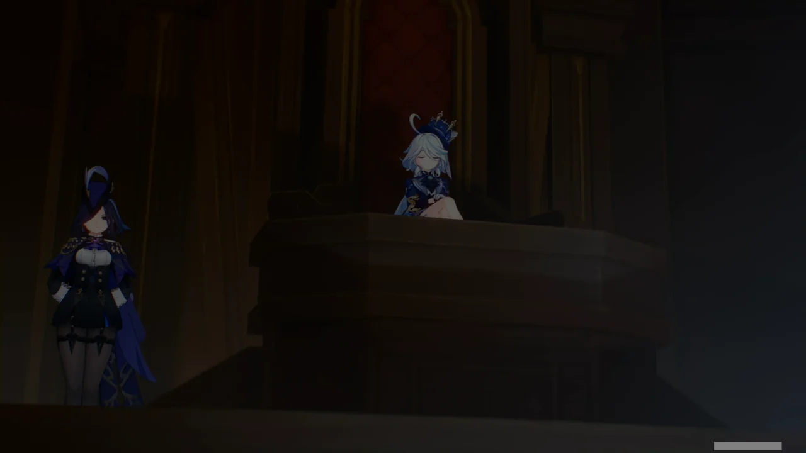
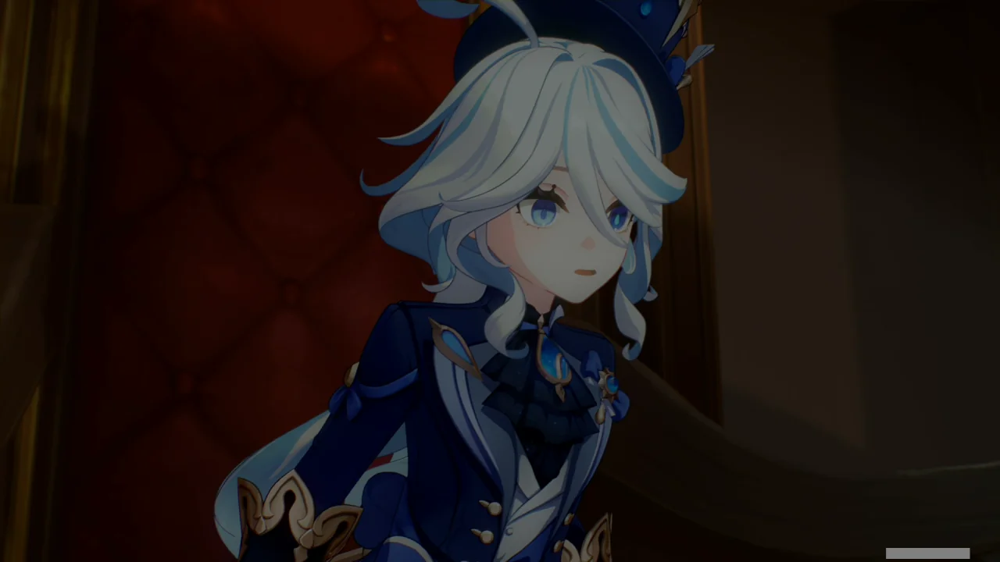
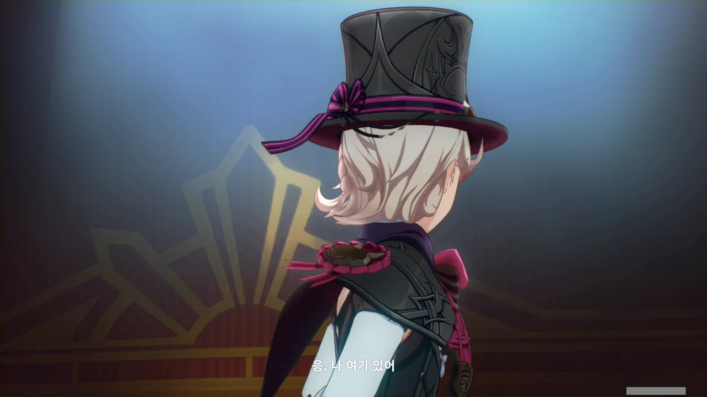
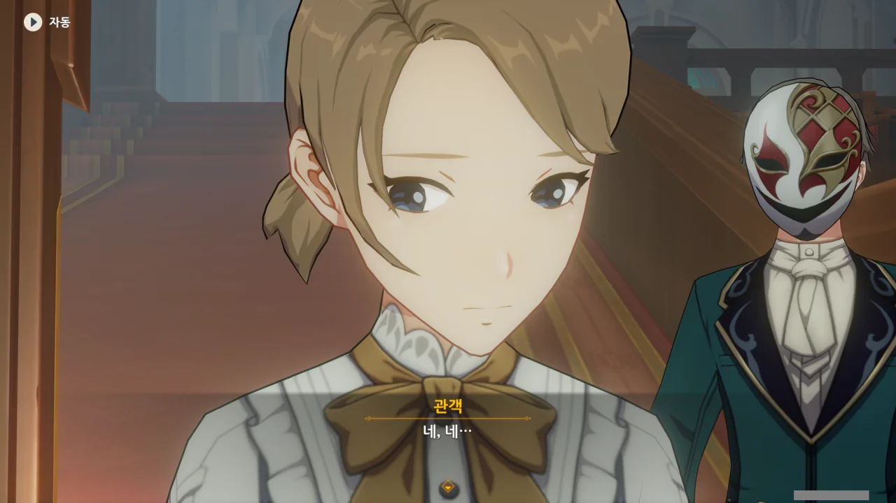
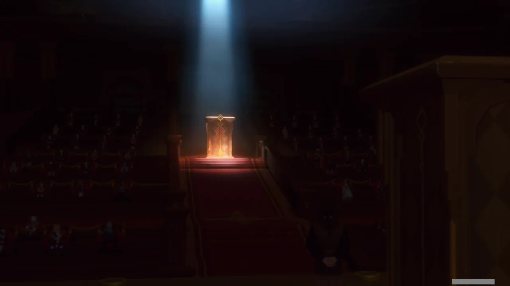

[예전](https://tetralog.onrender.com/b/game/genshin-impact/fontaine-expedition)에 폰타인을 돌아다닐 때, '다른 곳에선 석재 건물을 지을 때 이렇게 새하얀 돌을 쓰지는 않았던 것 같은데'라고 생각했었다.

이제야 깨달았다. 폰타인에서는 흰색 돌로 석재 건물을 짓는구나. 폰타인성도, 에피클레스 오페라 하우스도, 저번에 봤던 그 건물도 새하얀 돌로 만들었다.

그러니 저번에 봤던 그 건물은 무슨 고대 유적 같은 게 아니라, 단순히 무너진 폰타인 건물이었던 것이다. 그걸 이제야 깨달았다.



게임 밖 세상과는 달리, 티바트에는 '원소의 힘'이라는, 판타지적인 힘이 존재한다. 그런 세계에서의 마술은 과연 어떨까? 내가 알고 있는 마술 그대로일지, 원소의 힘을 적절히 사용해 새로운 경지를 보여줄지 궁금하다.





이야, 여기서 지인 찬스를 쓰게 될 줄은 전혀 몰랐는데. 리니가 가장 좋은 자리를 마련해 주겠다고 한다.

어찌 보면 당연한 말이지만, 오페라 하우스는 지정 좌석제로 운영된다. 여행자가 오페라 하우스에 오기 전에 입장권을 샀다는 언급이 없었으니, 만약 리니가 없었다면 여행자는 기껏 오페라 하우스에 왔는데 들어가 보지도 못하고 입구에서 발을 돌렸어야 했을 것이다.



와, 리니가 가져다준 표는 무려 맨 앞 줄 좌석표였다.

여기가 '오페라 하우스'라고 했으니, 제일 좋은 좌석은 정중앙 2층 발코니 좌석일 테지만, 그것까지 바라는 건 과욕일 것이다. 여행자는 이 공연에 있어 고작 리니의 지인이기 때문에, 높은 귀족이나 국가 원수 등에게 배정되는 자리에 무턱대고 앉는 건 여행자에게도, 리니에게도 곤란한 일이 될 것이다.

그러니 리니가 음향과 조망이 좋은 플로어 --- 맨 앞 줄이라 했으니, 플로어라고 보는 것이 합당하다 --- 맨 앞 좌석을 준 건, 리니가 할 수 있는 최선의 선택이었던 거겠지.



리니는 조수 코웰이 급하게 부르는 탓에, 먼저 자리를 뜬다.

시설이 꽤 고급지다. 재판과 공연을 모두 진행할 수 있는 구조로 되어있다.

* 무대 뒤 법관석  
  공연을 할 때에는 양 옆의 붉은 커튼을 쳐 법관석을 가릴 수 있다.
* 무대 양 옆 위 발코니  
  공연 시 높은 등급의 좌석으로 쓰거나, 재판에서 검사석, 피고 · 변호인석으로 쓸 수 있다.  
  만약 여기서 민사재판까지 진행한다면, 원고석과 피고석으로도 쓸 수 있겠고.

다만 일반적인 오페라 하우스와 달리, 정중앙에 발코니가 없고, 모든 발코니가 객석 양 옆에 배치되어 있다.

객석은 우리가 영화관 등에서 흔히 보던, 두 좌석이 하나의 팔걸이를 공유하는 방식이 아니라, 두 좌석이 서로 약간의 거리를 두고 따로 떨어져 있다.



우리가 제일 먼저 들어온 줄 알았는데, 우리보다 먼저 온 사람이 한 명 있었다. 그것도 바로 옆자리에.





굉장히 불편한 정적이 계속되고 있다.

옆 사람은 계속 입을 다물고 있고, 페이몬과 여행자는 이 정적이 못내 불편한지, 서로의 눈치만 살피고 있다.



아, 왜. 페이몬 평소에 말 잘하잖아. 이번엔 페이몬에게 다 맡길게 ㅎㅎ...



이런, 다 들린 모양이다.

굉장히 예의 바르게 말하는 옆 사람. 이러니까 우리 둘이 몰래 속닥속닥 댄 게 굉장히 죄스럽게 느껴진다.



억지로 같이 이야기를 하려는 페이몬 탓에, 분위기가 더 어색해졌다. 으아, 이 부끄러움, 대체 어떻게 할 거야...



페이몬... 이 사람은 딱 봐도 리니보다 나이가 훨씬 많아 보이지 않니? 리니는 기껏해야 10대 정도로만 보이지만, 저 사람은 적어도 20대로 보인다고.

물론 나이 차이를 넘어선 우정이란 것이 존재는 하지만, 처음 보는 사람에게 그런 걸 함부로 기대해선 안된다.



아, 통성명! 훌륭한 대화수단이지!

처음 보는 사람과 뭘 주제로 대화를 나눠야 할지 애매한 상황이라면, 통성명에서부터 시작하는 것이 제일 무난하다. 통성명을 통해 교환하는 정보 속에서 대화의 실마리를 끄집어낼 수도 있을 테니 말이다.





옆 사람이 자기소개를 하려던 찰나, 리니가 다가와 "느비예트 씨! 제 공연을 보러 와주시다니, 정말 영광입니다!"라고 말한다.

뭐야, 이 사람이 그 느비예트였어?



바다 이슬 항구에서 항무관 비엔느가 말했다시피, 느비예트는 폰타인의 공명정대한 최고 심판관이며, '심판의 엄숙함'을 맡고 있다.



그럼에도 자신은 그저 최고 심판관이라는 역할을 맡고 있는 것뿐이며, 특별한 사람이 아니라고 말하는 느비예트.

만난 지 얼마 되지도 않았는데, 벌써 느비예트에 대한 호감도가 높아져간다.



아, 그리고 푸리나를 "저 녀석"이라고 부르는 점에서 호감도 추가 상승!

푸리나 저 녀석은 대체 저기서 뭘 하고 있는 거야?



여행자의 눈에 처음 띄었을 때 가장 멋져 보이기 위해, 푸리나는 여태껏 계속 저 자세로 앉아있었다고 한다.



여행자가 푸리나가 있는 방향을 바라보자, 나지막이 웃는 푸리나.

저렇게 다리를 꼬고 앉아있으면 다리에 피가 안 통해서 다리가 저릴 텐데, 용케 그걸 참고 있다. 다리가 저린 것보다 콘셉트가 더 중요하다는 걸까...



> 네, 이제 됐습니다. 그럼 더는 신경 쓰지 말고 우린 공연이나 보죠.

ㅋㅋㅋㅋㅋㅋ 마치 마지못해 강제로 데리고 있는 말괄량이 꼬맹이를 대하듯, 푸리나를 대하는 느비예트.



오, 이제 곧 리니의 마술을 볼 수 있는 건가?

그래... 티바트에서의 마술이 과연 어떤 모습일지, 이제 두 눈으로 직접 확인할 때가 온 것이다.





페이몬이 무대 위의 조명이 일제히 꺼지는 걸 보고 잔뜩 흥분해 소리치자, 느비예트가 조용히 눈치를 준다.

이 녀석, 원래 눈치가 좀 없어요...



리니와 리넷이 자기소개를 하는 것으로 공연이 시작된다.



> | | |
> |:--|:--|
> | 리니 | 리넷은 지금 사실 굉장히 긴장한 상태랍니다. |
> | 리넷 | 글쎄요. |
> {_borderless=true,_thead=false}

ㅋㅋㅋㅋㅋㅋ 여기서까지 딴죽이야? ㅋㅋㅋㅋㅋㅋ 정말 환상적인 남매라니까.





마술을 시작하기에 앞서, 리니와 리넷이 자기 신의 눈을 떼어 조수에게 건네준다.

신의 눈은 사람이 원소를 다룰 수 있게 해주는 매개체이니, 신의 눈이 없는 이들은 이제 원소의 힘을 쓸 수 없게 되는 것이다.

음, 원소의 힘을 이용한 마술도 좀 보고 싶었는데, 조금 안타깝게 되었다.

마술과 마법의 차이라... 그렇게 말하면 뭐라 더 할 말이 없네.

신의 눈을 통해 원소를 다루는 건 마법과 같다 할 수 있을 테니, 순수한 손기술만으로 이루어진 이들의 마술은 정말 '마술' 그 자체라고 부를 수 있을 것이다.





> 눈 깜빡일 타이밍을 잘 선택하세요.

오... 꽤 도발적인 멘트인걸. 마술의 손기술은 그야말로 '눈 깜짝할 사이'에 벌어지는 일이니, 눈을 깜빡일 타이밍을 잘 선택하라고 하는 것이다.





> 마술사의 비장의 무기는 유에서 무를, 무에서 유를 만들며, 수만 가지 변화를 창조해 내는 겁니다.



리니가 모자를 벗어, 안에 아무것도 없음을 먼저 보여준 후, 모자를 공중에 고정시킨다.

와, 대체 저게 어떻게 가능한 거야?





리니가 공중에 둥둥 떠있는 모자 주위를 천천히 돌며 모자를 툭툭 건드리자, 모자 안에서 카드가 후드득 떨어져 내린다.



아무것도 없던 손에 갑자기 카드 여럿을 꺼내 보이기도 한다.



> 하지만 요새는 다들 이런 전통적인 마술에 질릴 대로 질린 상태죠.

아니, 난 솔직히 방금 마술도 굉장히 놀랍다고 생각하는데? 대체 무슨 수로 모자를 공중에 고정시킨 거야? 손으로 붙잡은 건 확실히 아닌데...





리니가 손을 조물조물거리더니, 비둘기를 손 안에서 '만들어낸다'.

여태껏 본, 아무것도 없던 손에서 갑자기 카드가 나타나거나, 안에 아무것도 없는 모자 속에서 카드가 떨어지는 마술은 '미리 소매에 카드를 숨겨놨겠지', '모자 속에 카드가 숨겨진 공간이 있었겠지'라는 식으로 그 트릭을 추측할 수 있었다.

하지만 이번 마술은 대체 어떤 수를 쓴 건지 감조차 잡히지 않는다. 팔토시 속에 비둘기를 숨겼을 것 같지는 않은데...



리니의 손 안에서 나타난 비둘기는 공중으로 날아오르고, 카메라는 공중에 매달린 거대한 수조 위에 앉아있는 리넷을 비춘다.

아까 어디 가나 싶었는데, 여기로 간 거였구나.



어? 설마 이거, 수조 탈출 마술이야? 수조 탈출 마술의 트릭은 이미 널리 퍼졌을 텐데?

주워들은 바에 따르면, 수조 탈출 마술의 비밀은 수조가 천으로 가려진 사이, 수조 뚜껑 경첩의 고정 나사를 재빨리 풀고 탈출하는 것이라고 한다.

여전히 다리를 꼰 채 마술을 관람하고 있는 푸리나. 그 옆에는 클로린드가 지키고 서있다.





리넷이 관객들에게 손을 흔든 뒤, 수조에 뛰어든다.

수조 안이 생각보다 꽤 넓다.



> 어려운 일은 아닙니다. 사람을 거품으로 만든 다음 수조 밖으로 내보내면 되니까요...

에이, 어떻게 사람을 거품으로 만들어서 빼낼 수 있다고 하는 거야.



그 순간, 수조의 뚜껑이 큰 소리를 내며 떨어져 닫힌 후, 잠겨버린다.

육중한 소리로 보아, 뚜껑의 무게가 상당한 것 같은데, 리넷이 경첩 나사를 몰래 푼다고 해도, 저 무거운 뚜껑을 들어 올리고 탈출할 수 있을 것 같지가 않다.



수조의 뚜껑이 한번 잠기면, 공기조차 빠져나올 수 없다고 말하는 리니. 에이, 그래도 경첩의 나사 정도는 뺄 수 있을 정도의 틈은 있겠지.



리니가 이상하리만큼 침착한 것에서 눈치챌 수 있었지만, 이렇게 수조의 뚜껑이 닫혀 잠기는 것조차 이번 마술쇼의 계획이었다.



> 다행히 저는 좀 달라서요. 오늘 여러분께 진정한 마술을 보여드리겠습니다.

수조를 천으로 가리지 않고 계속한다고? 대체 뭘 하려는 걸까?





그 순간, 수조에 거품이 차오르기 시작하더니, 리넷이 순식간에 옷만 남기고 사라져 버렸다.

뭐야? 이게 대체 어떻게 된 일이지?

&nbsp;

당장 머릿속에 떠오르는 트릭은 다음과 같다. 이걸 거품이 차오르는 그 짧은 시간 안에 실행할 수 있다는 전체 하에 말이다.

1. 내부에서 수조 뚜껑의 문을 열고 탈출했다.  
  모두의 이목이 수조에 집중된 상태에서 수조 뚜껑을 열고 탈출하는 건 불가능하다.
2. 수조에 구멍을 뚫고 탈출했다.  
  이건 더 말이 안 된다. 그랬으면 수조에 뚫린 구멍을 통해 물이 대량으로 빠져나왔을 테고, 그럼 모두가 수조에 구멍이 뚫린 걸 알아차렸겠지.

아니, 대체 이게 어떻게 된 일이야?

느긋하게 마술쇼를 보고 있던 푸리나 역시 화들짝 놀랐다.



> 너무 멀리 가진 마. 마력이 다 떨어지면 큰일이니까.

리니가 저렇게 태연스럽게 말하는 걸 보면, 분명 이건 사고가 아니라 마술이다. 하지만... 대체 어떻게 한 거지?

> 응, 나 여기 있어.

응? 리넷이 수조 밖에 있다고?



리넷이 멀쩡하게 수조 밖에 나와있다. 옷이 젖은 흔적도 없다.





이야, 이건 진짜 박수를 칠 수밖에 없다. 푸리나 역시 열심히 박수를 친다.



리니와 리넷의 마술이 한차례 끝났다.





페이몬은 리니와 리넷의 마술에 잔뜩 흥분해 떠들다가, 느비예트에게 "마술 그 자체에 집중해야 한다"라며 한소리를 들었다.

하지만 내 생각은 좀 다르다. 마술이란 관객을 속이려는 마술사와, 마술사에게 속지 않고 그 트릭을 간파하려는 관객 사이의 즐거운 한판 승부라고 생각하거든.

마술 공연에서 서로의 '역할'은 다음과 같을 것이다.

* **관객**  
  마술사의 손놀림을 단 한시라도 놓치지 않기 위해, 리니의 말처럼 '눈 깜빡일 타이밍을 잘 선택'하여, 마술사의 트릭을 간파하기.
* **마술사**  
  눈에 불을 켜고 자신의 트릭을 간파하려 하는 관객을 어떻게든 속여, 정말 찰나(刹那)의 순간 속에서 단 한 치의 실수도 없이 마술을 성공시키기.

물론, 느비예트 말처럼, 마술을 업으로 삼는 마술사의 트릭을 일반인이 알아차렸다면, 그 마술사는 자신의 기술을 좀 더 갈고닦아야 할 것이다. 관객은 자신의 눈앞에서 유유히 마술을 성공시킨 마술사에게, 마땅히 순수한 감탄과 경의를 담은 찬사를 보내야 하겠지.

결국, '승부'라고 말은 했지만, 마술 공연에 있어 '승자'와 '패자'는 없는 것이다.

&nbsp;

그와 별개로, 아직 공연이 다 끝나지 않았는데 잔뜩 흥분해 떠든 건 페이몬의 잘못이 맞다.



리니가 말을 하며 모자를 휙 벗는데, 모자 안에서 고양이가 튀어나온다. 고양이 진짜 귀엽다.



> 수조 마술에 허점이 없어 보이는 건, 결국 리넷이 제 조수여서 그런 거라고 생각하시는 분도 계시겠죠?
> 그럼 충분히 사전 준비를 해둘 수 있었을 테니까요.

오, 그렇게 생각할 수도 있겠네. 정작 내 머릿속은 수조 마술을 볼 때, '대체 저게 어떻게 가능한 거지?'라는 생각으로 가득 차 있었는데.



오, 이번엔 관객을 마술에 참여시킬 모양인가 보다.

하지만 이렇게 관객을 마술에 참여시키는 것도, 사전에 마술 조수를 관객석에 앉혀놓으면 되는 일 아냐? 실제로 TV 방송에서 방청객을 방송에 참여시킬 때, 미리 사전에 관객석에 심어둔 관계인을 지명한다고 들었거든.



무대와 관객석 중앙 통로에 상자가 각각 하나씩 설치되었다.



'행운의 참가자'는 리니와 함께 각자 상자 안에 들어간 후, 1분 뒤 서로 반대편 상자에서 나오게 된다고 한다.

지하에 미리 통로를 뚫어두었다면 가능한 일이겠지만, 아까 맨 앞 줄로 내려올 때는 그런 흔적을 발견하지 못했다.



> 리니는 정말 마법을 쓸 수 있는 거 아닐까?

두고 보면 알게 되겠지.



미리 관객석에 심어둔 마술 조수를 '행운의 참가자'로 뽑을 줄 알았는데, 무작위 추첨기로 '행운의 참가자'를 뽑겠다고 한다.

이러면 추첨기를 조작하지 않은 이상, 정말 무작위로 관객을 뽑겠네.



일곱 번째 줄 3번 관객이 '행운의 참가자'에 당첨되었다.



안은 생각보다 깨끗하네. 천장에 매단 풍선은 '행운의 참가자'의 긴장을 풀기 위해 가져다 둔 걸까?



바꿔치기 마술인 만큼, '행운의 참가자'가 상자 안에서 미리 나오지 않는 것이 이 마술의 핵심일 것이다.

그런데 진짜 어떻게 관객을 바꿔치기하려는 걸까? 아무리 생각해도 지하 통로밖에 답이 없을 것 같은데, 그런 흔적은 아직 못 봤으니...

이 관객, 잔뜩 겁을 먹은 모양이다. 메로피드 요새가 어디인지는 몰라도, 뭔가 무서운 곳임이 틀림없다.





리니가 "60초를 30초 만에 세지 말아 달라"라고 한 것도 어쩌면 설계의 일부분이 아닐까?

하지 말라고 하면 더 하고 싶은 것이 사람의 마음이니, 어쩌면 사람들이 숫자를 더 빨리 셀지도 모른다.





리니는 먼저 관객들과 숫자 세는 속도를 맞춘 후, 상자에 들어간다.





왜 느비예트가 숫자를 세지 않는가 궁금해했는데, 속으로 숫자를 세고 있었다고 한다.

뭐, 나도 이런 상황에선 입으로 숫자를 세기보다, 속으로 숫자를 세는 걸 선호하니, 충분히 이해할 수 있다. 시끄러운 건 남들만으로 이미 충분하니까.





리니가 저렇게 상자 안에서 뜸을 들이는 건, 말 그대로 순식간에 사람을 바꿔치기했다는 느낌을 주기 위해서일까?



그때 갑자기 어디선가 쿵 하는 소리가 들린다. 무대 위에서 난 소리인가?



> 실수로 장식을 떨어트려서 다시 붙이고 싶은데, 어두워서 아무것도 안 보이네요.

방금 들었던 쿵 소리는 리니가 어두운 상자 속에서 움직이다가 상자와 부딪쳐서 난 소리인 모양이다.



20초나 남았다고 잔뜩 여유를 부리는 리니와, 못 말리겠다는 듯이 어깨를 으쓱하는 무대 조수 게릭.





10초면 충분하다고...?



무대 위의 상자와 관객석 중앙 통로의 상자에 스포트라이트가 비친다.



말은 그렇게 하지만, 단번에 성공할 것임을 나는 믿고 있다.



그런데 리니의 목소리가 아직도 무대 위 상자에서 들린다. 어이, 1분 거의 다 되었다고.



> 어라? 또 실패한 건가?!

리니의 마술이 실패한 것처럼 보이자, 관객들이 배를 부여잡고 웃는다.



리니가 잠시만 기다려달라고 하는데, 어림도 없지. 카운트다운은 끊이지 않고 계속된다.



아니, 실패했잖아, 이 양반아!

다급하게 상자에 다시 들어가면서 "이번 건 무효"라고 외치는 리니.

스포트라이트가 관객석 중앙 통로의 상자에 집중된다.



짜잔, 리니 등장!

와, 정말 눈 깜짝할 사이에 순간이동을 해버렸네.





이제 무대 위의 상자에서 아까 그 관객이 나오기만 하면 된다.



상자의 문이 열리는 건가 싶더니, 갑자기 아까 그 수조가 상자를 깔아뭉개며 떨어진다.

상자가 완전히 박살 났다.



완전히 박살 난 상자의 잔해 속에는 한 사람의 시체가 있다. 시체가 입고 있는 옷과, 옆에 떨어진 마스크로 미루어볼 때, 저 시체는 아까 상자 안에 들어간 관객도 아니고, 상자 옆에 서있던 무대 조수 게릭도 아니다.

리니의 표정을 보면, 이건 절대 리니가 의도한 게 아닌 것 같은데...
