

이 관객은 상자가 깔아뭉개졌을 때, 안에 시체가 있는 걸 미처 보지 못한 건지, 잔뜩 흥분한 채 리니에게 이것도 마술의 일부냐고 묻는다.

시체가 나왔는데 이게 정상적인 마술일 리가 없지, 당연히.



리니는 잔뜩 충격을 받은 모양이다. 상자에서 나와야 할 관객은 간데없고, 산산이 조각난 상자에서 엉뚱한 사람의 시체가 나타났으니 당연한 말이겠지만.

대체 이게 어찌 된 일일까?



느비예트가 급하게 현장을 통제한다. 공연은 중지되고 출입구는 봉쇄되었으며 공연 관계자는 경비대에 의해 통제되었다.

이런 건 소년탐정 김전일에서나 나올 법한 이야기인데...

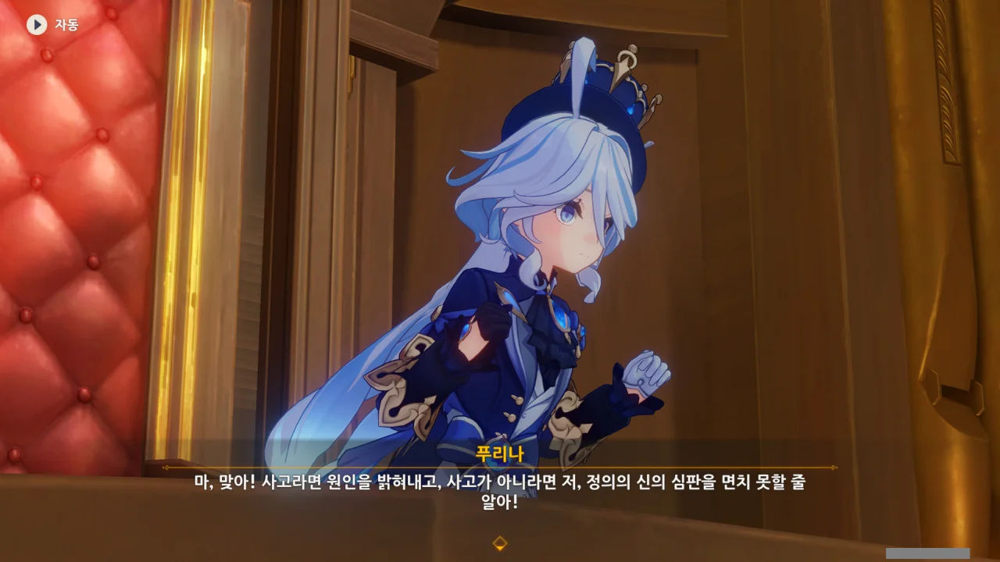

조금 전 사건 때문에 적잖이 당황한 건지, 푸리나는 느비예트가 먼저 나서 상황을 수습한 후에야 버벅거리며 뒤늦게 말을 꺼낸다.

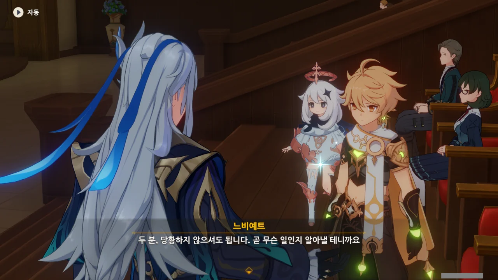

솔직히 말하자면, 처음엔 진짜 놀랐다. 아니, 상자에서 관객이 나올 상황에서 갑자기 수조가 상자를 짓뭉개며 떨어질 줄 누가 알았겠냐고.

그런데 그다음, '아, 드디어 시작인 건가!'라는 생각이 들더라. 그래, 어느 나라를 가던, 굵직굵직한 사건에 휘말리는 게 여행자 아니던가. 슬프지만 페이몬의 말을 인정해야 할지도 모르겠는걸.





경비대의 간략한 현장 조사 결과는 다음과 같다.

* 사망자는 리니 마술단 소속 스태프, 코웰
* 수조 추락의 직접적 원인은 무대에서 터진 폭죽이 수조를 매달고 있던 밧줄에 불을 붙여 밧줄이 끊어진 것 때문
* 어째서 상자에 관객 대신 코웰이 있었는지는 불명
* 관객은 현재 실종 상태





흔적도 없이 사라진 관객이 소녀라는 이유 하나만으로 이 사건이 「소녀 연쇄 실종 사건」과 연관 있다고 단정 짓는 건 너무 성급한 거 아냐?

장안을 떠들썩하게 한 「소녀 연쇄 실종 사건」이 느비예트 입에 거론되자, 관객들이 놀라워한다.





푸리나가 대뜸 리니가 「소녀 연쇄 실종 사건」의 범인이 아니냐고 묻는다.

물론, 리니가 이번 공연의 총책임자이긴 하지만, 소녀가 실종되었다는 것 하나만으로 리니를 지금껏 있었던 모든 실종 사건의 범인으로 모는 건 지나친 논리의 비약으로 보이는데.

그러니까 다시 말하면, 이 망할 꼬맹이가 근거도 없이 개소리를 지껄이고 있다는 말이다. 그것도 확신에 가득 찬 채 말이다.



아니, 그것 하나만으론 리니를 여태 있었던 모든 실종 사건의 범인으로 몰기 힘들다니까? 꼴랑 정황 증거 --- 정황 증거라 부르기도 부끄러울 수준의 --- 하나만 갖고 그런 주장을 하다니, 허 참.

법원에 가서 '이 녀석이 살인을 한 것 같아요. 정확한 증거는 없지만, 아무튼 그래요'라고 말해보아라. 법관은커녕 법원 앞을 지키고 있는 경비원에게 '선생님, 대낮에 술 좀 그만 잡수시고 집에 들어가 주무시지요'라는 소릴 들을 것이다. 애당초 기소는 검사가 하는 것이긴 하지만.

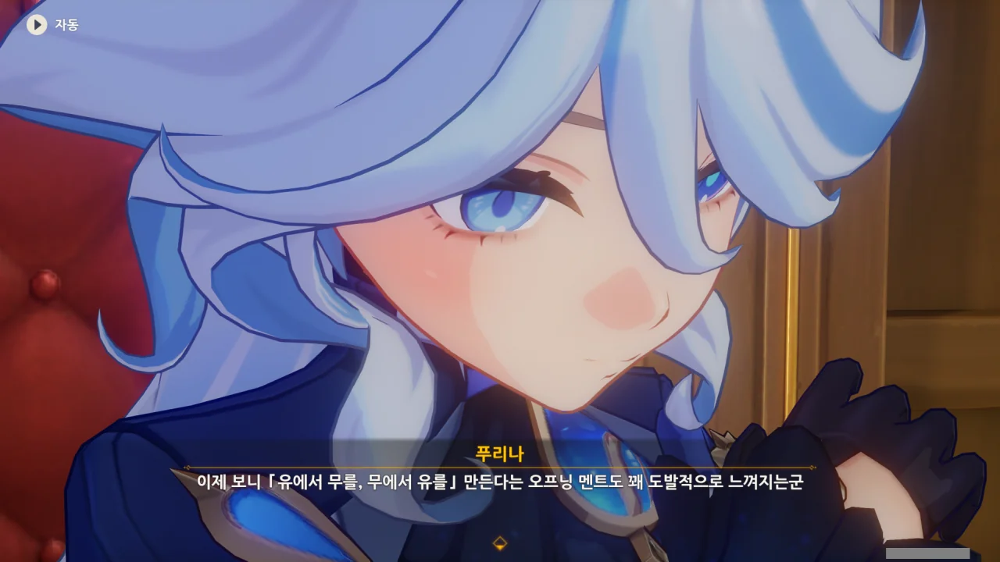

> 이제 보니 「유에서 무를, 무에서 유를」 만든다는 오프닝 멘트도 꽤 도발적으로 느껴지는군.

이건 진짜 말도 안 되는 생떼 억지인데.

혹시 느비예트 씨, 폰타인의 법정은 평소에도 이런 억지 생떼로 돌아갑니까? 지금 난 '정의의 신'인 푸리나가 순 억지를 부리는 저 모습을 보고 '과연 푸리나는 정의의 신이 맞긴 한 걸까?'라는 생각이 들고 있거든.



리니에게 정황상 혐의가 있는 것 자체는 인정하지만, 그 혐의만으론 리니가 범인이라는 증거가 될 수 없다.

일단 차분하게 기다려보자.

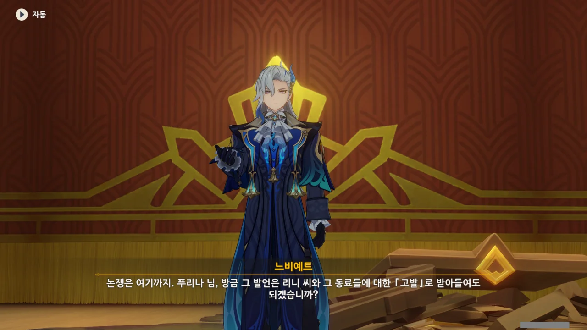

푸리나의 말을 들은 느비예트는 방금 그 발언을 리니와 그 동료에 대한 「고발」로 받아들여도 되겠냐고 묻는다. 「고발」이란 말을 쓴 걸 보면, 정식 재판의 절차를 밟겠냐는 말로 보인다.

그런데 '검사의 기소'와 '푸리나의 「고발」'을 동일한 것으로 본다면, 여기서 수사가 종료되고 법원의 재판절차가 시작된다는 말일 텐데... 충분한 수사도 없이 여기서 이렇게 빨리 재판절차를 시작해도 되는 걸까?



> 응? 난 그냥 녀석이... 지금 「고발」을 입에 올리기에는 너무 이르지 않나...?

푸리나가 리니를 의심한 것도 무슨 확증을 갖고 의심한 게 아니라, 그냥 한번 던져본 말이었던 것으로 보인다.

한 나라의 신이라는 녀석이 그렇게 무거운 말을 가볍게 던져도 되는 거야?





하지만 이를 들은 관객들이 '사건을 보자마자 진상을 파악한 푸리나가 직접 정의를 실현하려나보다'라고 말하자, 금세 기고만장해져서 "그야 물론이지"라고 대답한다.

어휴, 이 중2병 메스가키 똘빡아...



그러더니 갑자기 여행자를 지목하며 혹시 리니를 도울 거냐고 묻는다.

일단은 리니가 이번 일에 있어 결백하다고 생각하니, 그럴 생각이지만, 그걸 왜 갑자기?





무승부라니, 그땐 푸리나가 확실하게 졌잖아. 어디서 과거를 함부로 날조하려고 들어?

푸하다, 추리나야!

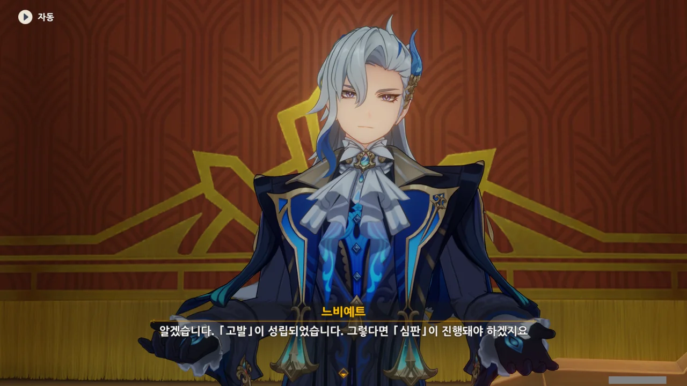

푸리나가 "그야 물론이지"라고 대답했기 때문에, 정식으로 「고발」이 성립되었다. 곧바로 「심판」 절차가 시작되나 보다.



> 푸리나 님은 당신을 「대결 상대」로 여기고 있습니다.
> 일단 저 장황한 연설은 무시하고

ㅋㅋㅋㅋㅋㅋ 느비예트가 사사건건 푸리나를 꼬맹이 취급하는 것이 매우 마음에 든다.

다만, 기왕 꼬맹이 취급을 할 거면, 아예 푸리나의 말도 처음부터 가려 들어야 하지 않을까...?

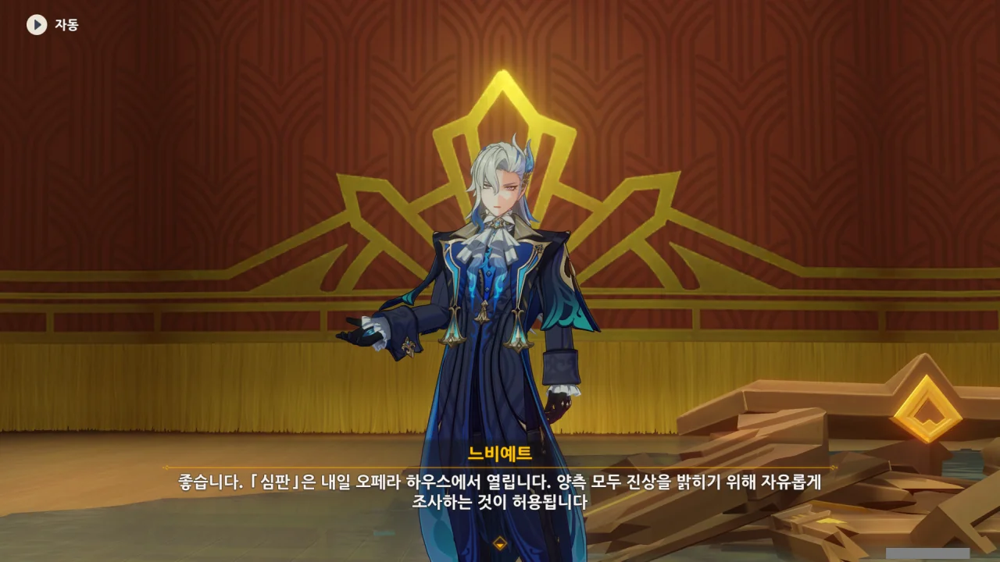

그리하여 사건에 대한 수사도 아직 제대로 진행되지 않았는데 「심판」이 열리게 되었다. 그것도 내일 곧바로.

다만 폰타인에서는 기소가 수사의 종결을 의미하지는 않는지, 기소가 되었음에도 수사를 여전히 진행할 수 있는 모양이다.



졸지에 오페라 하우스가 임시 구치소가 되어버렸다.





그래, 내일 저 푸리나를 바닥까지 탈탈 털어버릴 것이다. 망신살을 제대로 뻗치게 해 주지.





리니와 리넷의 안부를 묻기 위해 둘을 찾아갔다. 당연한 말이겠지만, 리니는 자신의 공연에서 사람이 죽은 것 때문에 침울해하고 있다.



지금 당장은 리니를 범인으로 생각할 근거가 없다.

조사 도중 리니가 범인이라는 확고부동한 증거가 나온다면 모를까, 그전까지는 무죄추정의 원칙에 따라 리니에게 죄가 없다고 생각해야 한다.





리니 역시 이번 사건에 대해 궁금한 점이 한둘이 아니다.

* 무대에서 발생한 일은 과연 단순한 사고인가?
* 코웰은 왜 거기에 있었는가?
* 추첨된 관객은 어떻게 종적을 감추었는가?
* 만약 이 모든 것이 누군가가 꾸민 일이라면, 어떻게 1분 안에 그 모든 일을 끝낸 것인가?

하지만 사건은 실제로 일어났으니, 증거를 통해서 밝혀내는 수밖에 없다.



갑자기 페이몬이 우스꽝스러운 안경을 꺼내 쓴다.



아까 시내에서 책을 읽으며 돌아다닐 때, 페이몬이 따로 모은 비상금으로 산 안경이라고 한다.

안경은 그럴듯한데, 콧수염은 정말 아닌 것 같다.



엑, 저게 귀엽다고? 리넷의 미적 감각을 조금 의심해봐야 할 때인가...





리니와 리넷은 현재 「피고인」 신분이기 때문에, 경비대에게 일거수일투족을 감시당해 누명을 벗을 증거를 모으기 힘든 상태이다.

경비대 입장에서는 피고인이 증거를 수집한답시고 자신에게 불리한 증거를 훼손시킬 가능성이 있기 때문에 적용한 조치이니, 여기에 대해선 어쩔 수 없다고 생각하고 그냥 받아들일 수밖에 없다.

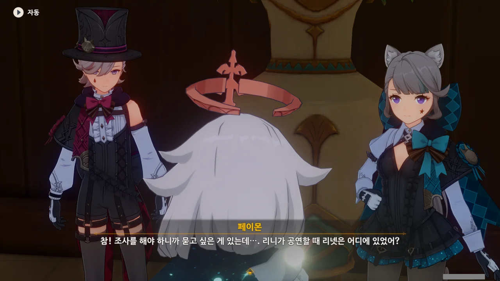

일단 조사를 위해, 아까 바꿔치기 마술이 진행될 때 리넷이 어디에 있었는지를 물어본다.





마술의 핵심 비밀을 밝히길 꺼려한 리니였지만, 마술 도중 사건이 일어난 이상 마술 트릭 역시 심판에서 증거로 사용될 것이 뻔한 상황. 자신이 심혈을 기울여 만든 창작물이 재판에서 만천하에 공개될 것이란 걸 깨닫자 풀이 죽었다. 



다만 그 마술 트릭을 설명하려면 지금 이 위치에서 벗어나야 가능하다며, 자신이 경비대를 설득할 동안 먼저 무대와 관객석을 조사해 달라고 한다.





사건 현장을 조사 중인 경비대원 에스몬드는 대뜸 여행자에게 이 난장판에 끼어들지 않는 것이 좋을 거라는 말을 한다.

대체 왜?



조사에 따르면 이번에 죽은 사람은 리니의 조수 중 하나인 코웰이라고 한다. 그의 역할은 소품의 설치와 점검, 그리고 무대에서의 공연 보조와 분위기를 띄우는 일이었다. 입단한 지 얼마 되지 않은 사람이지만 열심히 일해서 모두에게 좋은 인상을 남겼다고 한다.

코웰은 상자 안에 있다가 위에서 떨어진 수조 때문에 죽은 것이라고 한다.

다른 누군가가 코웰을 먼저 죽인 후, 상자 안에 넣고 수조를 떨어트려 코웰의 사인을 위장하려 한 것은 아닐까?

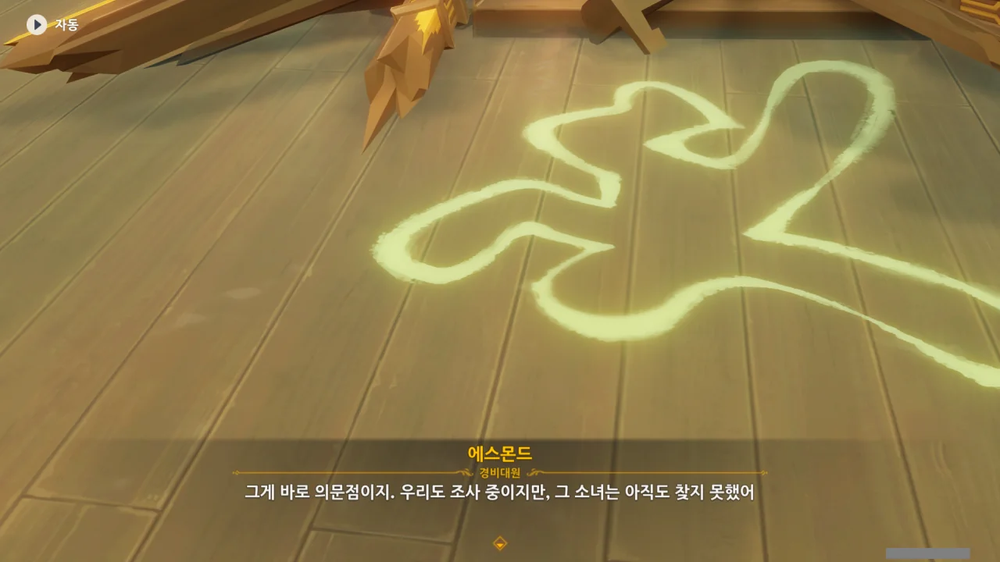

다만 상자 안에 왜 관객 대신 코웰이 들어있었는지에 대한 답은 찾지 못했다고 한다. 관객 역시 여전히 행방불명인 상황.



단순한 우연의 일치라고 하기에는 우연의 일치가 너무 많다. 하지만 만약 이 모든 것이 누군가의 계획대로였다면 충분히 설명되는 일이고, 거기에 있어 가장 유력한 용의자는 리니라고 말하는 에스몬드.

그래, 아직까지의 정황은 리니가 범인이라고 말하고 있긴 하다. 아직 남은 의문점이 많긴 하지만 말이다.

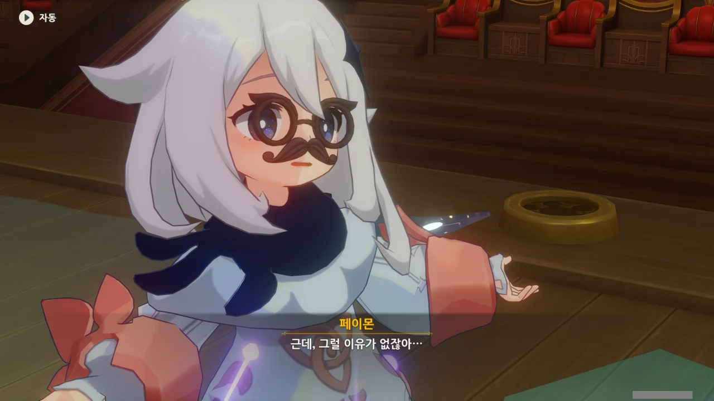

하지만 리니에게 범죄의 동기가 과연 있었을까? 살인이라는 중죄를 저지를 만한 동기가 리니에게 있을 것 같지는 않아 보이던데.

만약 리니와 코웰의 사이가 서로 나빴다면 코웰에 대해 조사할 때 그 이야기가 반드시 나왔을 것이다.





> 세상에 「마술」은 없지만, 마술사가 사람을 가지고 노는 데 뛰어난 재능이 있는 건 확실하군.

그거 좀 말이 너무 심하시네. 그렇게 말을 하면 마치 여행자가 리니 손바닥 위에서 놀아나고 있다고 말하는 것과 다름없잖아.



정확히 말하자면, 증언도 물증도 그 하나만으로 완벽한 증거가 되지 못한다. 증인을 매수하거나 사전에 말을 맞춰 증언을 조작할 수 있고, 목격자가 사건을 오해하도록 조작할 수도 있다. 증거 역시 사전 혹은 사후에 조작이 가능하고.

하지만 그것들이 법정에서 증거로 채택되는 이유는 단 하나이다. 이들이 서로를 뒷받침해 주기 때문이다.

절대로 다른 증거 없이 증언이나 물증 하나로 재판이 진행되지는 않는다. 그걸 단적으로 설명해 주는 단어가 바로 '증거불충분'이다.

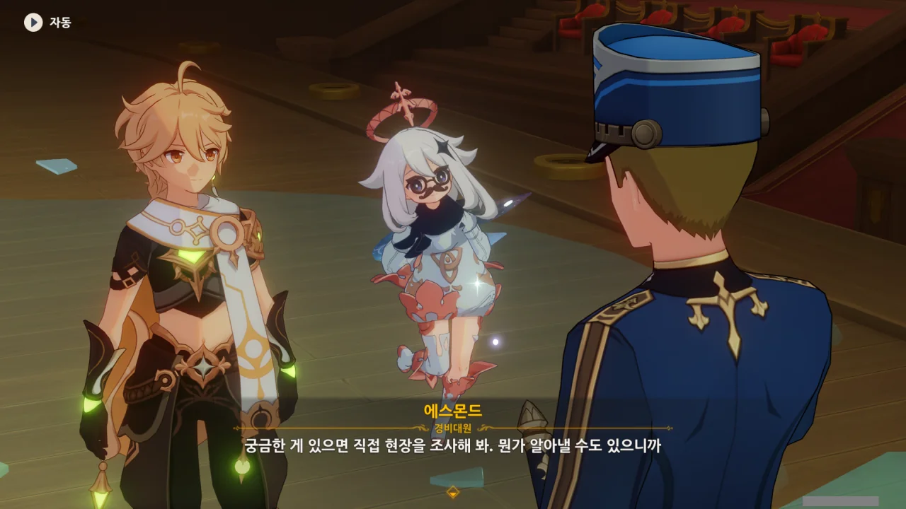

에스몬드에게 현장 조사를 허락받았다.



이걸 조사 노트라고 해야 할까? 「사건 기록」을 통해 지금까지 수집한 증거와 단서를 한눈에 볼 수 있다.



지금까지 모인 단서는 위와 같다.

> **경비대의 조사 보고서**
> 경비대의 조사에 따르면, 마술 공연이 끝날 무렵 터진 폭죽이 수조를 지탱하고 있던 밧줄을 태운 바람에 수조가 추락하며 상자 안에 있던 코웰이 사망하였다. 마술 도구를 이용할 수 있는 리니가 범행 가능성이 가장 높은 용의자이나, 코웰을 노린 이유와 추첨된 소녀의 행방은 아직 알 수 없다.
{.bq}

> **사망자의 신원 정보**
> 코웰이라는 이름의 사망자. 리니 마술단의 조수 중 한 명이었으며 생전에 단원들의 신뢰를 받았다. 마술단에서의 업무는 도구 배치 및 검사와 무대 공연 및 분위기 조성이었다.
{.bq}



시체를 사건 현장에 그냥 놔둘 수는 없으니, 시체가 누워있던 자리만 표시하고 시체를 옮겼다.

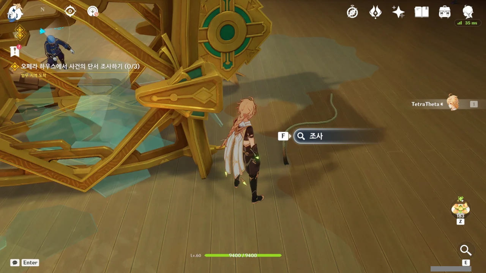

폭죽에 불타 끊어진 밧줄을 살펴본다.







밧줄이 끊어진 부분은 놀랍게도 가연성 재질로 되어 있었다. 즉, 이 부분은 의도적으로 불에 타기 쉽도록 되어 있었다는 것이다.

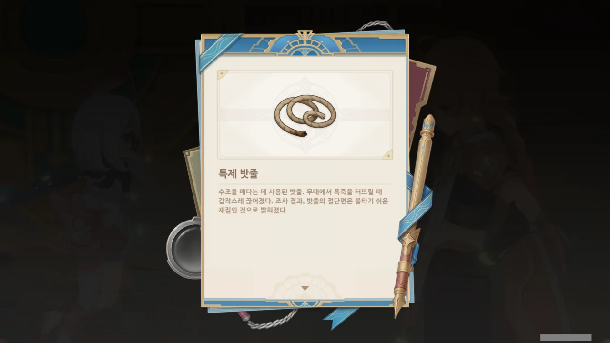

> **특제 밧줄**
> 수조를 매다는 데 사용된 밧줄. 무대에서 폭죽을 터트릴 때 갑작스레 끊어졌다. 조사 결과, 밧줄의 절단면은 불타기 쉬운 재질인 것으로 밝혀졌다.
{.bq}

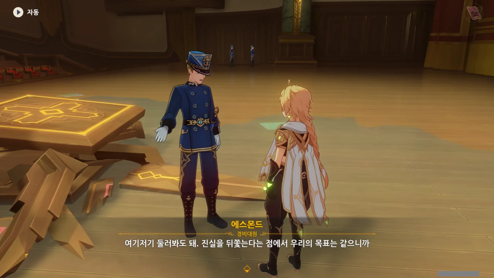

혹시나 다른 정보를 줄까 봐 에스몬드에게 한번 더 말을 걸어보았는데, 별 소득이 없다.



손상된 마술 상자를 회수했다고? 난 이 잔해가 처음 수조가 떨어진 모양 그대로인 줄로 알고 있었는데.

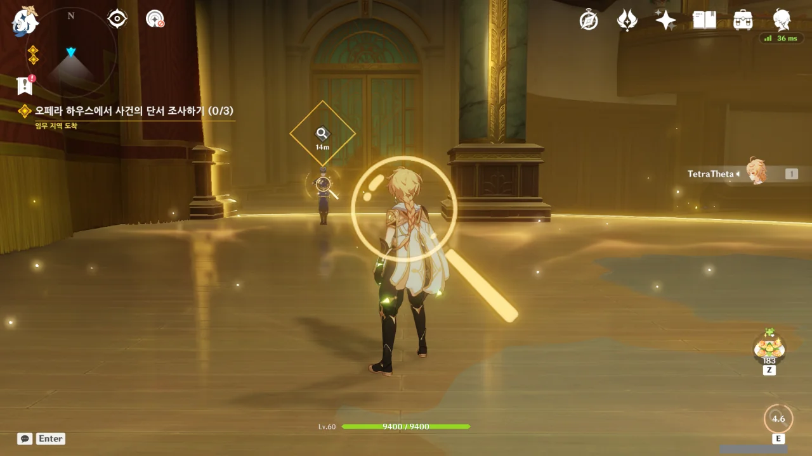

아무리 찾아봐도 추가로 조사할만한 물체가 없어서 스킬을 써보니, 다른 경비대원과 대화를 할 수 있다고 한다.





마비스에게선 실종된 관객의 정보를 알 수 있을 것으로 보인다.

오페라 하우스의 좌석 배치가 예약제로 이루어지는 덕분에 누가 어디에 앉았는지를 알 수 있기 때문이다.



실종된 사람의 이름은 '할시'. 폰타인 출신의 화가이며 나름 유명세가 있다고 한다. 평소 오페라 하우스를 자주 찾는 편은 아니지만, 창작 스트레스가 심해져 이를 달래기 위해 공연을 보러 온 것이라고 한다.

저런, 기껏 스트레스를 달래려 왔는데...





할시가 마술단 사람들과 일면식이 없다는 점에서, 이번 사건은 이전에 발생했던 「소녀 연쇄 실종 사건」과 유사성을 보이고 있다고 한다.

과거 「소녀 연쇄 실종 사건」의 희생자 역시 젊은 나이의 여성이라는 점을 빼면 그 어떠한 공통점도 찾을 수 없었다고 한다.



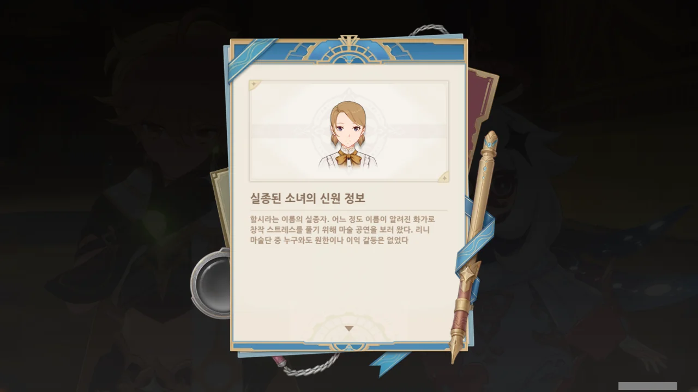

> **실종된 소녀의 신원 정보**
> 할시라는 이름의 실종자. 어느 정도 이름이 알려진 화가로 창작 스트레스를 풀기 위해 마술 공연을 보러 왔다. 리니 마술단 중 누구와도 원한이나 이익 갈등은 없었다.
{.bq}



이쪽은 추첨기를 조사하고 있었던 모양이다.

그런데 추첨기에 문제가 있다고?



응? 리니와 리넷을 변호하는 것이 어렵다고? 왜?



이들의 조사에 따르면 추첨기는 무작위로 결과를 내는 것이 아니라, 고정된 결과를 내놓도록 조작되어 있었다고 한다.





오페라 하우스는 사전에 신청을 해야 좌석을 배정받을 수 있기 때문에, 공연을 총괄한 리니는 누가 어디에 앉게 될 것인지 전부 알 수 있다.

... 어째 나오는 증거가 죄다 리니가 범인이라고 외치고 있는 것 같은데.

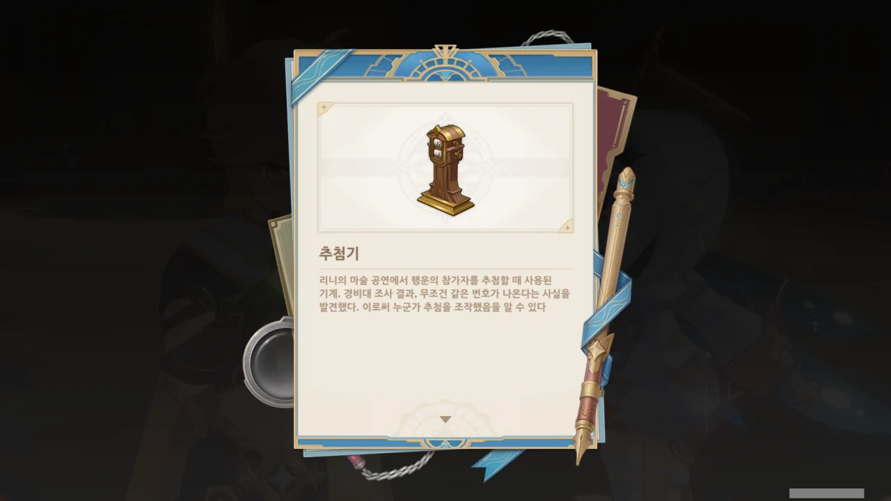

> **추첨기**
> 리니의 마술 공연에서 행운의 참가자를 추첨할 때 사용된 기계. 경비대 조사 결과, 무조건 같은 번호가 나온다는 사실을 발견했다. 이로써 누군가 추첨을 조작했음을 알 수 있다.
{.bq}



관객석 쪽 마술 상자는 겉보기엔 별 달리 이상한 점이 보이지 않는다.

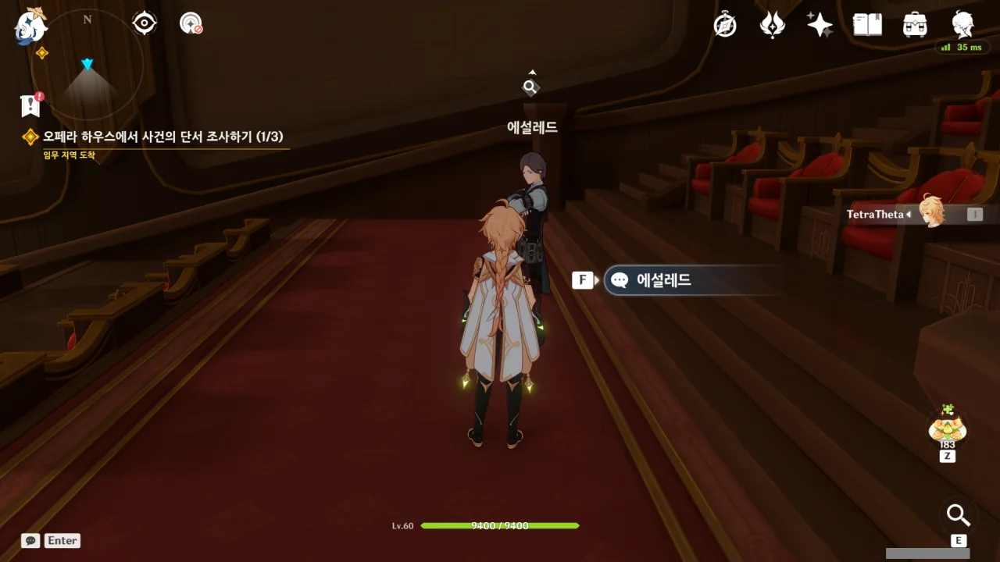

응? 이 사람은 그냥 관객 아냐?



어... 그렇긴 한데... 이쪽도 아직 잘 아는 게 없단 말이지.





이번 사건에 있어 핵심은 카운트다운 때 들린 쿵 소리라고 말하는 에설레드.





에설레드는 그 쿵 소리의 정체는 리니의 동료가 수조 위로 뛰어오를 때 난 소리였으며, 수조 위에 올라간 리니의 동료가 폭죽이 터질 때 수조를 고정하는 밧줄을 잘랐을 것이라고 한다.

하지만 그렇다고 하기에는 쿵 소리가 관객 모두가 들을 수 있을 정도의 큰 소리였고, 그 정도의 소리를 낼 정도로 수조에 충격을 주었다면 수조가 대번에 흔들렸을 것이다.

역시 직접 현장을 관찰하지 못한 자의 뇌피셜일 뿐이었던 것인가...

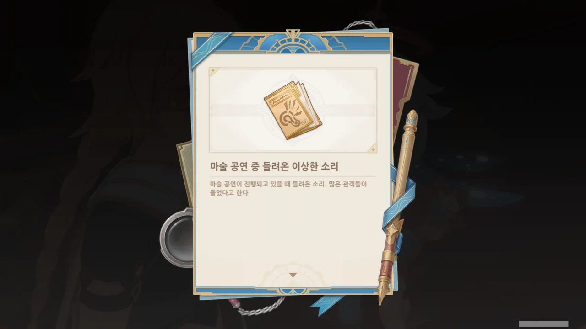

> **마술 공연 중 들려온 이상한 소리**
> 마술 공연이 진행되고 있을 때 들려온 소리. 많은 관객들이 들었다고 한다.
{.bq}

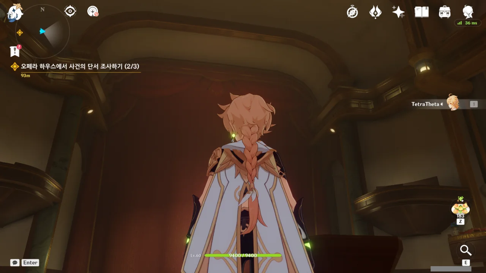

혹시나 해서 천장을 바라보았지만, 공연을 위해 온갖 설비를 설치한 흔적은 간데없고 평범한 무대가 날 바라보고 있었다.





현재까지 모은 단서와 증거는 총 6개.

> **경비대의 조사 보고서**
> 경비대의 조사에 따르면, 마술 공연이 끝날 무렵 터진 폭죽이 수조를 지탱하고 있던 밧줄을 태운 바람에 수조가 추락하며 상자 안에 있던 코웰이 사망하였다. 마술 도구를 이용할 수 있는 리니가 범행 가능성이 가장 높은 용의자이나, 코웰을 노린 이유와 추첨된 소녀의 행방은 아직 알 수 없다.
> _페이몬: 범인이 누구든 계획범죄인 건 확실해..._
{.bq}

> **특제 밧줄**
> 수조를 매다는 데 사용된 밧줄. 무대에서 폭죽을 터트릴 때 갑작스레 끊어졌다. 조사 결과, 밧줄의 절단면은 불타기 쉬운 재질인 것으로 밝혀졌다.
> _페이몬: 딱 봐도 밧줄에 누가 손을 쓴 게 틀림없어!_
{.bq}

> **추첨기**
> 리니의 마술 공연에서 행운의 참가자를 추첨할 때 사용된 기계. 경비대 조사 결과, 무조건 같은 번호가 나온다는 사실을 발견했다. 이로써 누군가 추첨을 조작했음을 알 수 있다.
> _페이몬: 공연은 미리 등록해야 좌석이 배정되니까 추첨기를 사용하면 「아저씨」가 아닌 「소녀」를 정확히 골라낼 수 있어!_
{.bq}

> **사망자의 신원 정보**
> 코웰이라는 이름의 사망자. 리니 마술단의 조수 중 한 명이었으며 생전에 단원들의 신뢰를 받았다. 마술단에서의 업무는 도구 배치 및 검사와 무대 공연 및 분위기 조성이었다.
> _페이몬: 근데 왜 그 사람인 거지? 이상하네..._
{.bq}

> **실종된 소녀의 신원 정보**
> 할시라는 이름의 실종자. 어느 정도 이름이 알려진 화가로 창작 스트레스를 풀기 위해 마술 공연을 보러 왔다. 리니 마술단 중 누구와도 원한이나 이익 갈등은 없었다.
> _페이몬: 소녀 실종 사건은 다 이렇게 복잡한 건가...?_
{.bq}

> **마술 공연 중 들려온 이상한 소리**
> 마술 공연이 진행되고 있을 때 들려온 소리. 많은 관객들이 들었다고 한다.
> _페이몬: 그 소리는 우리도 다 들었잖아, 맞지?_
{.bq}



리니와 경비대의 대화는 아직 큰 진전이 없는듯하다. 
