임무 안내에 따르면, 분명 조사해야 할 것이 하나 더 있다는데, 극장 안에서 아무리 「수색 감지」 스킬을 사용해도 조사할 수 있는 대상이 더 나타나지 않았다.

그래서 일단 바깥으로 나가보기로 했다. 극장 밖에 무언가 단서가 있을 수도 있지.

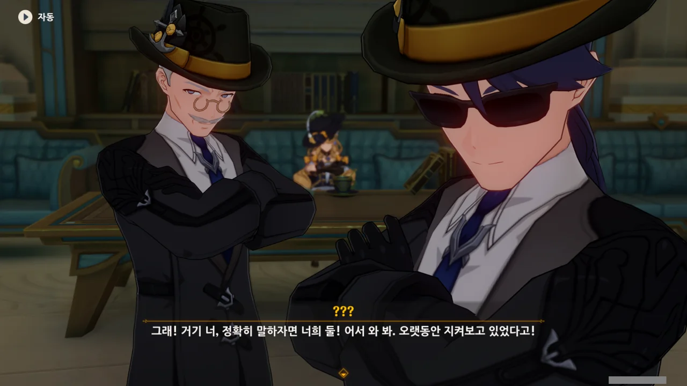

갑자기 무서운 마피아가 나타났다.

마피아가 아니라고? 검은 양복, 중절모, 선글라스를 입고 무섭게 팔짱까지 끼고 있는데 아직도 마피아가 아니라고 말할 참인가?



"너희들도"라는 표현을 쓴 것을 보면, 이 여자도 어떤 진실을 밝히고 싶어 하는 것 같은데... 그게 대체 여행자와 무슨 상관인 걸까?



「가시 장미회」? 처음 들어보는데? 게다가 "무엇이든 처리해 주는 민간 조직"이라는 건 그냥 흥신소라는 거잖아. 더 직설적으로 말하면 심부름센터이고.

아무리 봐도 이들은 마피아인 것 같은데... 대체 마피아가 여행자에게 무슨 볼일이 있는 걸까?



여행자에게 말을 건 것은 「가시 장미회」의 「보스」, 나비아였다.

「대부」 때문인지 몰라도 보통 마피아 하면 중년 남성이 보스라는 이미지가 강한데, 젊은 여성이라니. 조금 의외다.





실버는 나비아의 시종이며, 마르시악은 나비아의 집사라고 한다.

나비아가 2대 회장이 된 건 비교적 최근의 일인지, 이들은 나비아를 '보스'라고 부르지 않고 '아가씨'라고 부른다. 정황상, 나비아는 조직의 보스였던 아버지의 뒤를 이어 보스 자리에 오른 것으로 보인다.



호칭에 연연하지 않는 것으로 보아, 나비아는 그리 권위적인 성격이 아닌 것 같다.

뭐, 페이몬 말처럼, 여행자는 「가시 장미회」 소속이 아니기 때문에, 여행자가 나비아를 어떻게 부르는가는 온전히 여행자 마음에 달렸다.



이번 공연의 관객인 나비아는 아버지의 과거 때문에 「소녀 연쇄 실종 사건」에 지대한 관심을 갖고 있었다. 그런 와중에 이번 사건이 「소녀 연쇄 실종 사건」과 연관된 것일 수도 있다는 말을 듣고, 이번 사건에도 관심을 갖게 된 것이다.

드디어 리니의 편을 들어주는 사람이 하나 나타났네.



... 근데 리니가 흑막이 아닐 거라고 생각하는 근거가 그냥 직감이라고? 갑자기 분위기가 팍 식어버렸다.

물론 직감을 '우리가 의식 표면으로 끄집어내 말로 표현할 수 없는 정보까지 무의식에서 총체적으로 분석해 내리는 판단'이라 보기도 하지만, 단순한 직감만으론 리니가 무죄라는 사실을 밝히기에는 턱없이 부족하다. 당장 저 푸리나도 자신의 직감만으로 리니를 범인으로 고발하지 않았던가.

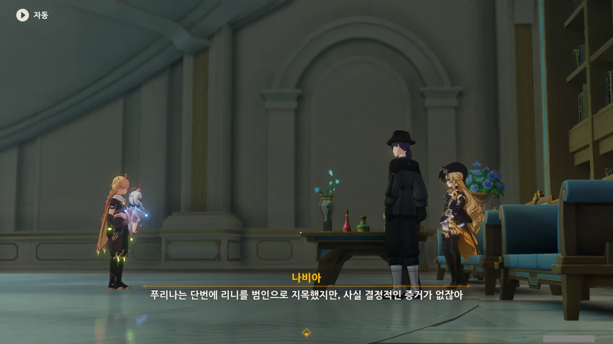

그래. 푸리나가 리니를 범인으로 지목하긴 했어도, 리니가 범인이라는 결정적인 증거를 같이 제시하지 못했다.

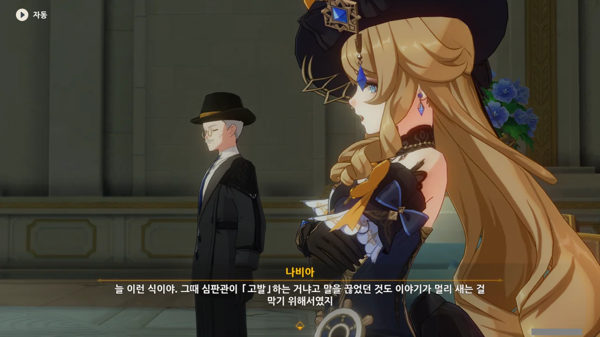

느비예트가 푸리나의 말을 듣자마자 곧바로 푸리나에게 리니를 「고발」하겠냐고 물은 건, 푸리나의 단순한 추측이 사람들 사이에서 퍼져나가며 어느새 뇌피셜로 둔갑하는 것을 막기 위해라고 한다.

정말 그렇다면, 느비예트가 정말 훌륭한 대처를 한 것이다.

조금 전처럼, 공연 도중 사람이 죽는 것과 같은 상황이 일어나면 사람들은 당황하고 혼란스러워한다. 그런 상황에선, 말을 먼저 꺼낸 사람이 이후 사람들의 생각의 방향을 유도하고 결정할 수 있다.

아마 느비예트는 푸리나가 아닌 다른 사람이 리니를 범인으로 의심하는 발언을 했어도, 그 사람에게 리니를 고발할 것이냐고 물었을 것이다.

확실한 게 아니라면 함부로 입 밖에 꺼내지 말고, 확실한 거라면 그 책임을 지라는 의미이다.

> 늘 이런 식이야.

푸리나는 평소에도 이렇게, 별 근거 없이 아무 말이나 툭툭 던져댄 모양이다.

오늘도 푸리나에 대한 평가가 깎여나간다. 이제 더 깎일 점수가 있는가부터가 의문이지만.

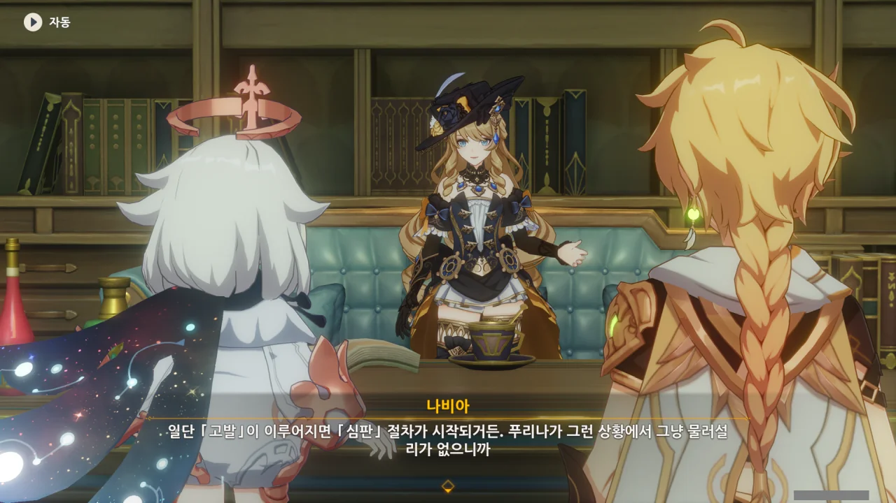

> 푸리나가 그런 상황에서 그냥 물러설 리가 없으니까.

아... 무슨 말인지 조금은 알 것 같아. 꼬맹이가 자존심은 쓸데없이 높아가지고, 분명 패배한 논쟁도 무승부라고 우기지 않았던가.



> 물의 신이 재밌는 양반이라는 건 인정하지만

ㅋㅋㅋㅋㅋㅋ 어째 푸리나는 상식인으로부터의 취급이 박한 것 같다. 뭐, 그게 오히려 상식적인 일이긴 하지.





나비아는 이제 여행자가 답할 차례라며, 「심판」을 「오페라」 보듯 하는 게 옳다고 생각하냐 묻는다.

물론 당연하게도, 폰타인에 처음 왔을 때 생각하던 것 그대로이다. 재판이란 시시비비를 가리는 중요하고 엄숙한 문제인데, 이를 유흥거리나 오락거리처럼 소비하는 건 재판에 대한 모욕이라 생각한다.

다만 그것이 폰타인의 풍습인 것 같아, 긴 말 않고 넘어갈 뿐이다. 폰타인에 있어, 여행자는 그저 이방인일 뿐이니 말이다.



폰타인의 모든 사람들이 「심판」을 유흥거리로 본다 생각했는데, 나비아나 마르시악처럼 그래선 안되다고 생각하는 사람도 적잖게 있는 모양이다.

아, 폰타인의 미래는 아직 밝구나.



응? 대체 무슨 말을 하려 했던 걸까?

> 만약 그게 가능하다면

대체 뭐가 가능하다면? 혹시 이들이 여행자에게 바라는 게 또 따로 있는 걸까?





이번엔 갑자기 뜬금없이, 나비아가 여행자와 페이몬을 자신의 조수로 삼으려고 한다. 페이몬이 그걸 지적하자, 이번엔 반대로 자신이 여행자와 페이몬의 조수가 되겠다고 한다. 파트너든 조수던 아무래도 상관이 없다고.

게다가 거기에 페이몬이 홀랑 넘어가서, "진작 그렇게 나왔어야지"라고 말한다.

어이, 그러면 나비아가 우리와 함께 행동한다는 게 전제가 되잖아...



마르시악이 말을 매우 조리 있게 잘한다.

그래. 여행자는 리니의 누명을 벗기길 원하고, 나비아는 「소녀 연쇄 실종 사건」의 진실을 원한다. 이 사건의 진실을 밝힌다면 여행자와 나비아는 서로 원하는 것을 얻게 될 것이다.

이렇게 말을 논리적으로 잘하는 마르시악이 '나비아의 직감은 진실로 통하는 중요한 힘이 될 것이다'라고 말하는 걸 보면, 나비아의 직감은 유별나게 잘 들어맞는 모양이다.



그에 반해, 시종인 실버는 "전 의견이 없습니다"라고 말한다.

정말로 '의견(意見)'이 없는 걸까, 아니면 '이견(異見)'이 없는 걸까? 뭐가 어찌 되었건 독특한 사람이다.

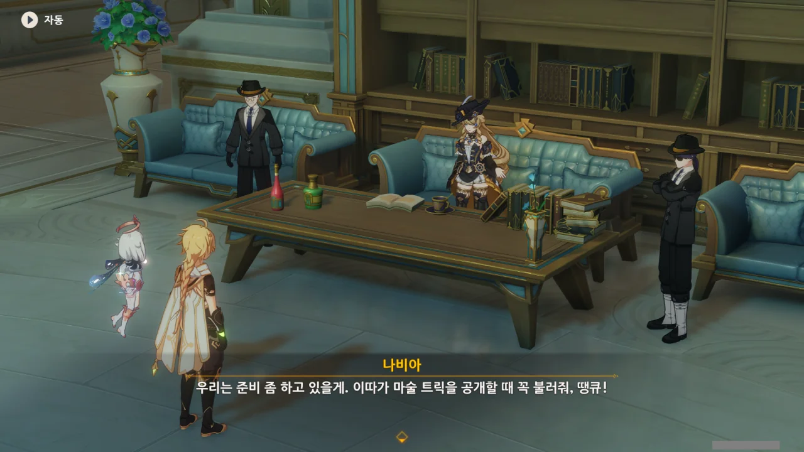

... 내가 아까 나비아에게 리니의 마술 트릭 이야기를 했던가? 왜 나비아가 리니의 마술 트릭 이야기를 알고 있는 거지?

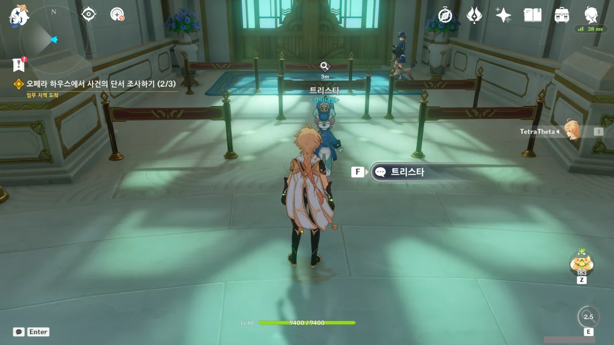

오페라 하우스 입구를 굳건히 지키고 있는 멜뤼진, 트리스타에게 말을 걸어보자.





느비예트의 명령이 떨어져 오페라 하우스가 봉쇄되었기 때문에, 여길 드나드는 모든 인원은 엄격한 조사를 받아야 한다고 한다.





트리스타는 여기서 공연이 시작할 때부터 경비를 서고 있었다고 한다.

실종된 소녀가 여길 나가는 걸 보지 못했다고 하니, 비밀 통로 같은 걸 통해 오페라 하우스 밖으로 빠져나간 게 아니라면, 그녀는 아직도 이 오페라 하우스 안에 있다는 말이다.



트리스타는 극장에서 박수와 환호가 쏟아져 나와도 자신의 자리를 굳건히 지키고 있었다고 말한다.

"난 참 운도 없지"라고 말한 걸 보면, 트리스타 역시 공연을 몹시 보고 싶어 했지만, 자신이 맡은 임무를 우선시해 움직이지 않았던 모양이다.



> **오페라 하우스 출입 기록**
> 마술 공연 도중 누구도 오페라 하우스를 떠나지 않았으며 사건 발생 후에도 경비대에게 신원 조사를 받은 사람만이 오페라 하우스를 떠날 수 있었다.
{.bq}



일단 현재로서 살펴볼 수 있는 것은 전부 살펴봤다. 이제 리니의 마술 트릭을 살펴볼 차례다.

&nbsp;

그런데 오페라 하우스 바깥으로 나가려고 하니, 문에 상호작용 메시지가 나타나지 않는다. 왜지? 버그인가? 설마 방금 트리스타가 말한 '엄격한 조사'를 받아야 나갈 수 있는 건가?

마신 임무를 시작한 지 시간이 꽤 지났기 때문에, 오늘은 여기서 끊고 내일 마저 하고 싶은데...



리니가 지정된 자리에서 벗어나는 걸 드디어 허락받은 모양이다. 단, 경비대원 몰리가 리니 옆을 따라다니며 리니가 한 모든 걸 기록할 예정이라고 한다.

&nbsp;

그 와중에 "할 수만 있다면 장미 한 송이를 선물해드리고 싶네요"라는 스위트한 대사를 내뱉는 리니. 어우... 속이 뒤집힐 것만 같다.





> 난 「가시 장미회」의 엔젤, 권총의 탄환보다도 강력한 조력자---

나비아의 말을 듣고 나도 모르게 "응? 뭔 개소리야?"라고 중얼거렸다. 중2병은 푸리나 그 꼬맹이 하나로 충분하다고! 폰타인 사람들은 수치심이라는 감정이 없는 건가?



리니가 나비아를 거절하면 어쩌나 싶었는데, 흔쾌히 나비아의 참여를 허락한다.





마술 상자 '밑'이라고? 설마 이 상자 밑에 지하 통로라도 있는 거야?

아니, 분명 여길 지나다닐 때 바닥에 구멍이 있던 흔적은 전혀 발견하지 못했는데.





아까 공연 때와 비교해, 무엇이 달라졌는지 한번 알아맞혀 보라는 리니.

나비아가 풍선과 같은 장식이 없어졌다고 말하지만, 아직 진실에 도달하려면 멀었다고 한다.

아까 처음 마술 상자를 보았을 때에는 안에 격자무늬가 있었던 것 같은데, 지금은 단순한 삼각형 모양의 무늬밖에 없다.



아니, 저게 어딜 봐서 꽃무늬야? 이건 오역이 분명하다.



와, 상자 안에 다른 상자가 있었다고? 정말로?

이제 대충 마술이 어떻게 진행된 것인지 감이 잡힌다.



미리 뚫어둔 지하 통로의 한쪽 끝은 관객석 중앙 통로에, 다른 한쪽 끝은 무대 중앙으로 연결되어 있었다.

이 지하 통로는 건물을 지을 때 처음부터 있었던 것일까? 이런 석재 건물에서 새로 통로를 뚫는다는 건 건물의 구조적 안정성이 크게 떨어진다는 소리와 마찬가지인데...





아, 대충 어떤 느낌인지 알겠다.

1. 행운의 참가자가 관객석 중앙 통로의 마술 상자에 들어가면, 내부의 상자가 천천히 카트 위로 내려온다.
2. 카트는 지하 통로 반대편으로 이동하며, 천천히 내부 상자를 180도 회전시킨다.
3. 반대편에 도착한 카트는 내부 상자를 다시 천천히 위로 밀어 올린다.

이렇게 하면 행운의 참가자는 저도 모르는 사이에 무대 위의 상자로 이동하게 되는 것이다. 내부 상자가 느리게 움직이면, 상자 안에 있는 사람은 상자가 움직이는지 알아차리기 힘들 테니 말이다.



> 상자가 내려가고 나면 카트는 여기 있는 장치를 통해 나머지 단계를 수행하기 위한 에너지를 비축해요.

이거, 오역 맞지? 갑자기 웬 에너지 비축?









마술 중간에 리니의 목소리가 계속 무대 위 상자에서 들리던 건, 미리 녹음된 대사를 재생하는 축음기 때문이었다.

리니는 무대 위 상자가 닫히자마자 재빨리 지하 통로를 통해 관객석 중앙 통로 위의 상자로 이동한다. 리니의 옷으로 갈아입은 리넷이 무대 위 상자 안에서 리니의 목소리가 녹음된 축음기를 통해 리니를 연기한다. 이후, 리넷이 행운의 참가자가 든 내부 상자가 무대 위 상자 쪽으로 올라오기 전에 재빨리 지하 통로로 내려오면 마술 완성.

쌍둥이인 리니와 리넷이 옷만 갈아입으면 누가 누구인지 알아볼 수 없다는 점에서 착안한 마술이라는데... 정말 둘이 쌍둥이 맞아? 왜 리넷만 고양이 귀와 꼬리가 있고 리니는 없는데?

아냐, 지금 생각해 보니까, 차라리 리니에겐 고양이 귀와 꼬리가 없는 게 어울릴지도 몰라.



하지만 실제 무대 위 상자에서 나온 건 행운의 참가자가 아닌 코웰이었다. 게다가 행운의 참가자는 상자 안에 들어간 이후 실종된 상황.

리니와 리넷은 이 부분이 이해가 되지 않는 것이다. 대체 왜? 어떻게?





리니와 리넷은 증거 훼손의 우려가 있어 경비대원과 함께 다시 제자리로 돌아가게 되었다.



> **마술 트릭**
> 리니가 자세히 설명한 트릭은 다음과 같다: 이중 상자 구조를 이용해 관객이 들어간 상자는 지하 통로를 통해 맞은편으로 옮기고, 리니도 지하 통로를 통해 반대편으로 간다. 무대 위에서는 옷을 바꿔 입은 리넷과 스태프가 연기를 펼친다.
{.bq}

> **무대 마술 상자의 구조**
> 무대 위 마술 상자의 뒤편에는 작은 공간이 있어 리니 옷으로 갈아입은 리넷이 몸을 숨길 수 있다. 리넷은 마술이 끝나갈 무렵 등장해 리니가 반대쪽 상자로 순간 이동한 것처럼 보이게 유도한다.
{.bq}

> **관객석 마술 상자의 구조**
> 관객석 중앙의 마술 상자는 이중으로 이루어져 있고 아래에는 지하 통로로 향하는 입구가 있어서 행운의 참가자가 들어간 상자를 관객들 모르게 옮길 수 있다.
{.bq}

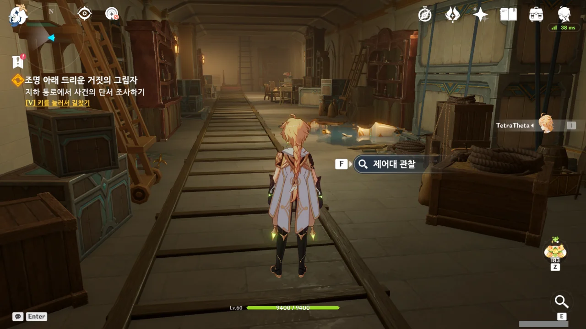

지하 통로의 조사를 시작한다.



먼저 제어대를 살펴본다. 카트는 자동으로 운행할 수 있다.

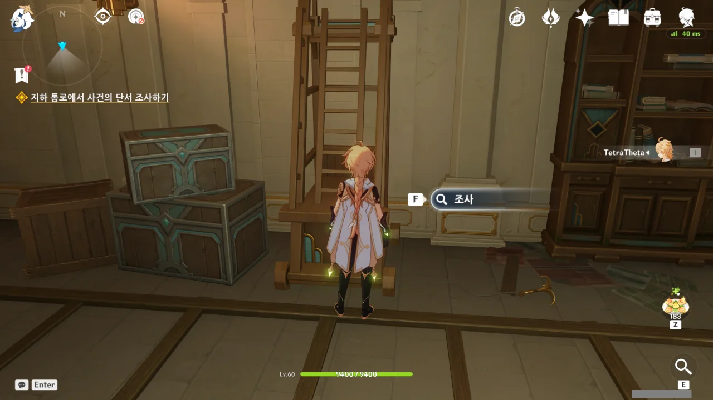

바닥에 갈고리 같은 것이 떨어져 있다.





아까 리니가 마술에 대해 설명할 때, 갈고리에 대해 언급하지 않았던 것 같은데, 이게 왜 여기에 있는 걸까?

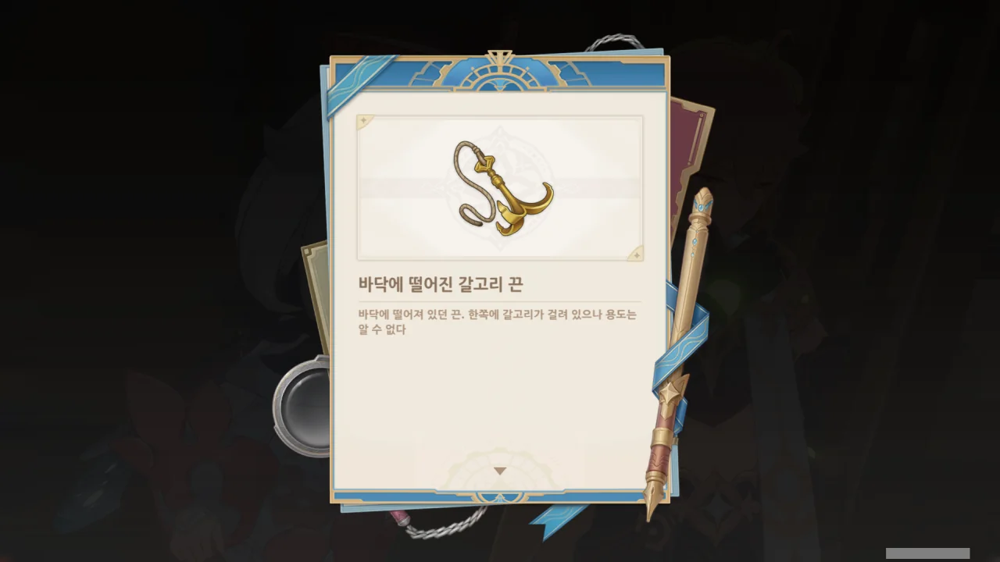

> **바닥에 떨어진 갈고리 끈**
> 바닥에 떨어져 있던 끈. 한쪽에 갈고리가 걸려 있으나 용도는 알 수 없다.
{.bq}

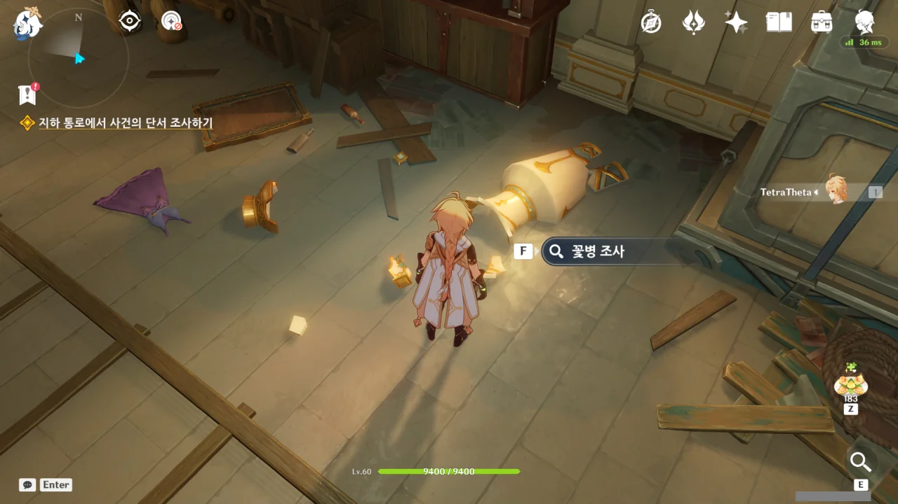

여긴 꽃병이 깨져있고, 그 안에 있던 물이 바닥에 잔뜩 고여있다.





이 꽃병은 다른 마술에 쓰기 위해 미리 가져다 둔 걸지도 모르겠다. 아무튼, 이 꽃병은 카트가 움직이는 레일과 멀리 떨어져 있기 때문에, 카트가 지나가다 이 꽃병을 깨트렸다고 보기는 힘들다.

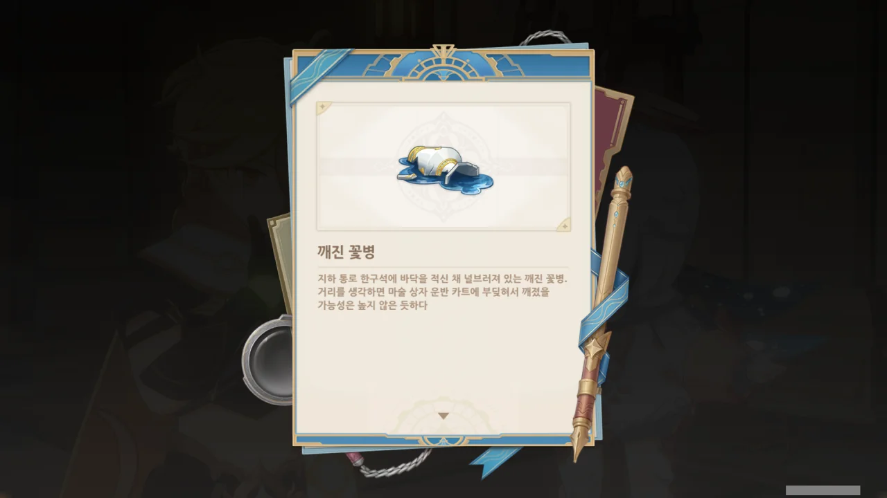

> **깨진 꽃병**
> 지하 통로 한구석에 바닥을 적신 채 널브러져 있는 깨진 꽃병. 거리를 생각하면 마술 상자 운반 카트에 부딪혀서 깨졌을 가능성은 높지 않은 듯하다.
{.bq}

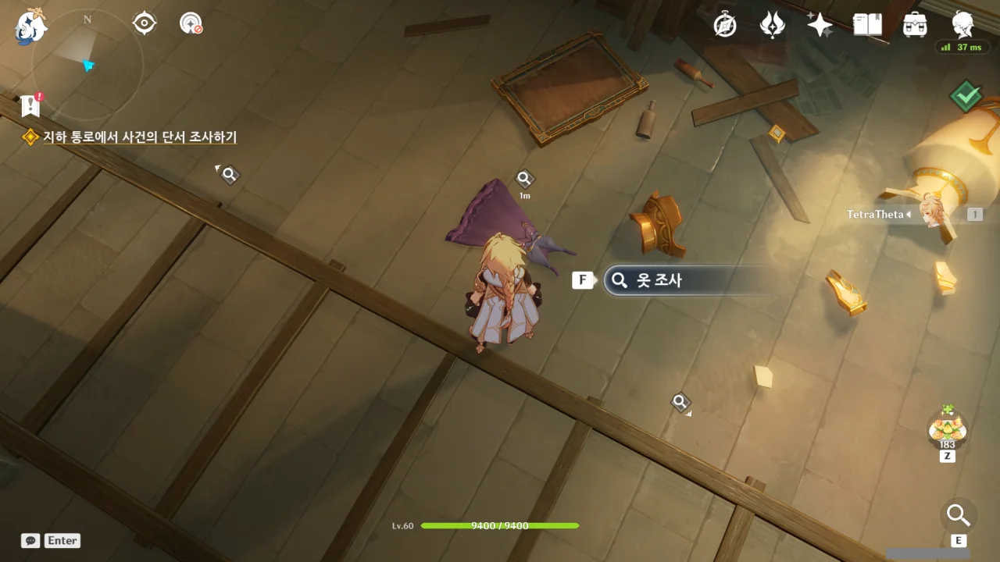

바닥에 웬 여자 옷이 떨어져 있다.





행운의 참가자가 이 지하 통로에서 옷을 갈아입어야 할 하등의 이유가 없다. 대체 참가자의 옷이 왜 여기에 떨어져 있는 걸까? 왜 겉옷만 벗긴 거지?

페이몬은 '영문을 모르겠어'를 반복한 끝에 "나 탐정 안 할래..."를 시전 한다.

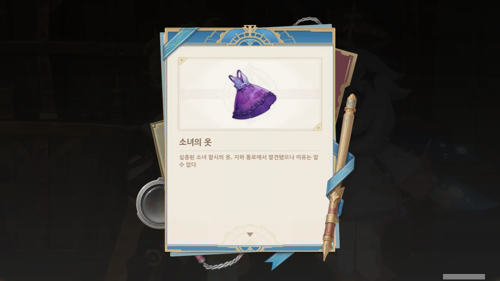

> **소녀의 옷**
> 실종된 소녀 할시의 옷. 지하 통로에서 발견됐으나 이유는 알 수 없다.
{.bq}



레일에는 별다른 이상이 없는 것 같다.



잡동사니가 들어있는 상자 안에는 각종 마술 도구와 공연용 의상이 가득 들어있다.

아무리 그래도 그렇지, 마술 도구와 의상을 같은 상자에 집어넣는다고? 정리정돈을 너무 안 하는 거 아냐?



카트 역시 별다른 이상은 없는 것 같다.

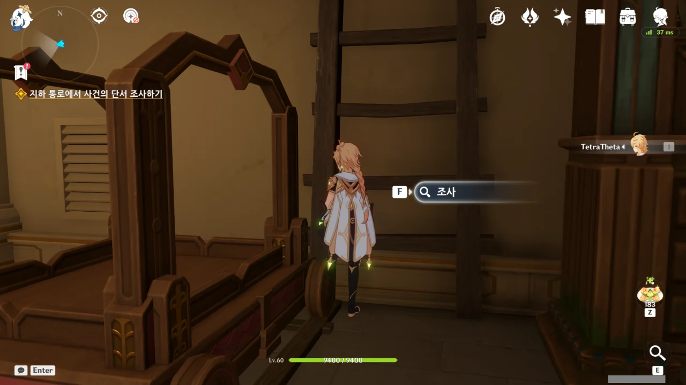

난 이게 사다리를 조사하는 건 줄 알았는데, 카트 옆의 환풍구를 조사하는 것이었다.





사람이 하나 드나들 수 있을 크기의 환풍구가 하나 있다.

마르시악은 "다른 사람을 데리고 있는 상태에서 환풍구를 통해 이곳을 빠져나가기에는 환풍구가 좁아 힘들 것이다"라고 말하지만, 그게 그렇게 꼭 불가능할 것처럼 보이진 않는다.

납치범이 관객을 납치한 거라면, 그냥 관객을 기절시킨 후, 겨드랑이를 잡고 질질 끌듯이 환풍구에서 옮기면 되지 않겠는가? 뭐, 대신 납치범의 무릎 관절이 작살나겠지만.

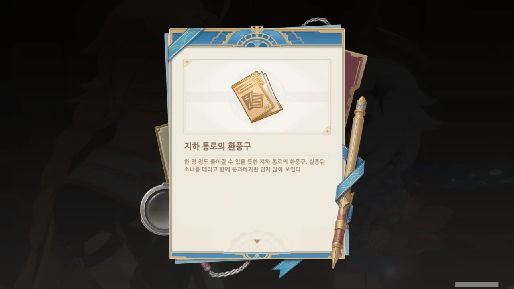

> **지하 통로의 환풍구**
> 한 명 정도 들어갈 수 있을 듯한 지하 통로의 환풍구. 실종된 소녀를 데리고 함께 통과하기란 쉽지 않아 보인다.
{.bq}



지하에서의 조사가 대충 끝난 듯싶다.



혹시나 해서 올라가는 사다리도 조사해 보았는데, 별다른 점을 찾아볼 수 없었다.



이로써 사건과 관련된 현장의 확인은 모두 끝났다. 무대 위, 관객석 중앙 통로, 지하 통로 모두 수색을 끝마쳤다.





마르시악은 그새 경비대에게 지하 통로 환풍구에 대해 물어보고 왔다.

지하 통로의 환풍구는 오페라 하우스 지하실로 이어지며, 공연 도중이나 사건 발생 이후 지하실에서 나온 사람도, 지하실에 숨어있던 사람도 없었다고 한다.



현재로서는 대부분의 증거가 리니가 범인임을 가리키고 있다. 하지만 그렇다고 리니를 범인으로 단정한다면 풀리지 않는 수수께끼가 남게 된다.

나비아는 '왜 푸리나가 그렇게 자신만만했는지 알 것 같다'라고 말하지만, 내가 본 푸리나는 대충 리니가 범인 같아 보여서 그런 말을 던진 거였고, 다른 관객들의 '부추김' 때문에 정식으로 「고발」을 한 것이었다.



그러게. 일반적으로 고발이 이루어진다고 해서 그게 반드시 유죄가 되는 것은 아니다. 피고인이 정말로 유죄인지 아닌지 가리는 재판이 필요하지.







단순히 「계시 판결 장치」는 최고 심판관을 보조하고 사람들의 신앙을 모아 에너지로 변환하는 역할인 줄로만 알았는데, 폰타인의 「심판」 절차는 예상외로 복잡했다.

* 최고 심판관과 「계시 판결 장치」가 양측의 진술을 함께 청취한다.
* 최고 심판관의 최종 결정은 「계시 판결 장치」의 참고 자료로 사용된다.
* 「계시 판결 장치」가 내린 결정이 「심판」의 결론이 된다.
* 「계시 판결 장치」는 「심판」을 통해 모은 사람들의 감정을 「판결 에너지」로 전환한다.

그러니까 폰타인의 재판에서 죄의 유무를 결정짓는 것은 최고 심판관이 아니라 「계시 판결 장치」라는 것이다.

&nbsp;

이거 맞아? 머릿속에 'AI 판사', '시빌라 시스템' 이런 단어가 막 스쳐 지나가는데, 굉장히 불안하거든?

사람과 구분할 수 없을 정도로 AI가 고도로 발달한 세상이라면 모를까, 현시점에서의 AI는 도통 신뢰할 수 없는 물건이다. 지금의 AI는 자신이 하는 말이 제대로 된 말인지, 아닌지조차 제대로 파악하지 못하고 막 던져대는 수준이거든.

시빌라 시스템 역시 겉보기에만 컴퓨터 시스템이지, 결국 그 실상은 200여 명의 뇌를 한데 모은 것에 불과하고 말이다.

둘 다 신뢰하기 어렵다는 점에서는 동일하다.

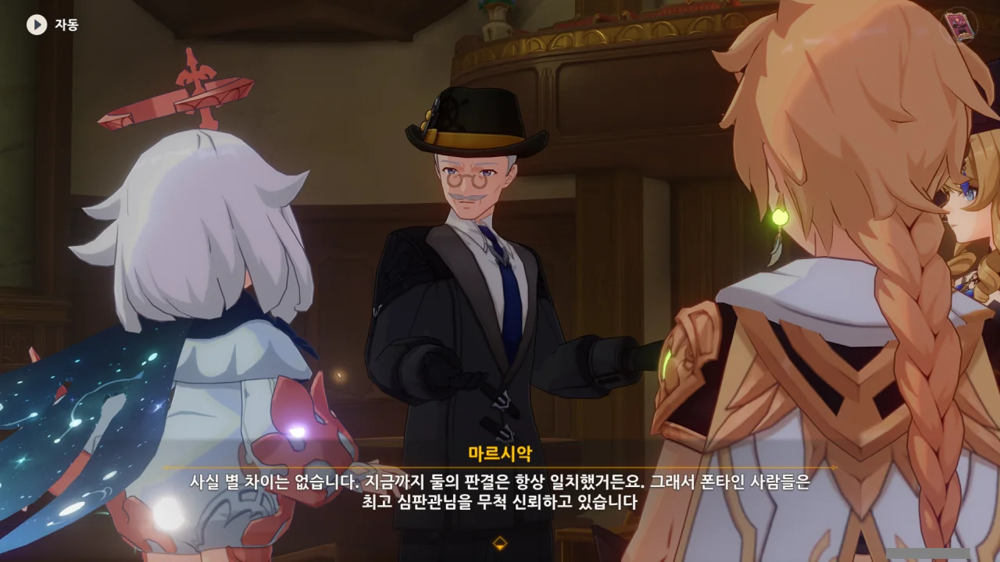

다만 여태까지 「계시 판결 장치」와 최고 심판관의 판결이 항상 일치했기 때문에, 사람들은 이에 대해 별다른 말을 하지 않았던 모양이다.

'여태까지 항상 그랬다'는 건 '이제 곧 아니게 된다'라는 말과 같다.

내 장담컨대, 폰타인 마신 임무에서 최고 심판관과 「계시 판결 장치」의 판결이 어긋나는 경우가 생길 것이다.





아까는 이런 이야기를 못 들었던 것 같은데. 여행자가 리니/리넷의 대리인으로 활동하고 있기 때문에, 사건 관계자로 분류되어 오페라 하우스 바깥으로 나갈 수 없다고 한다.

아, 그래서 아까 오페라 하우스 바깥으로 향하는 문에 상호작용 메시지가 나타나지 않았던 거였어?



오페라 하우스 안에 가둬놓았으면 최소한 밥은 제대로 주겠지?

하지만 마르시악의 말을 들어보면, 그냥 대충 배만 채울 수 있을 정도의 음식만 주는 것 같다. 영양 균형이니 입맛이니 그런 건 신경 쓰지 않는 음식 말이다.

어, 음... 그건 좀...



나비아의 원래 계획은 폰타인성에서 제일 유명한 디저트 가게에 여행자와 페이몬을 데려가는 것이었다.

> 향긋한 차랑 달콤한 게 있어야 느긋하고 우아하게 추리할 수 있잖아, 안 그래?

향긋한 차는 잘 모르겠지만, 머리를 많이 써야 할 때에는 단 것을 충분히 먹어주는 것이 좋다. 그래야 뇌에 포도당이 잘 공급되거든.

> ... 나 갑자기 억지로 탈출하는 것도 괜찮을 것 같아...

역시 먹을 것 이야기가 나오니까 곧바로 태도를 바꾸는 페이몬.

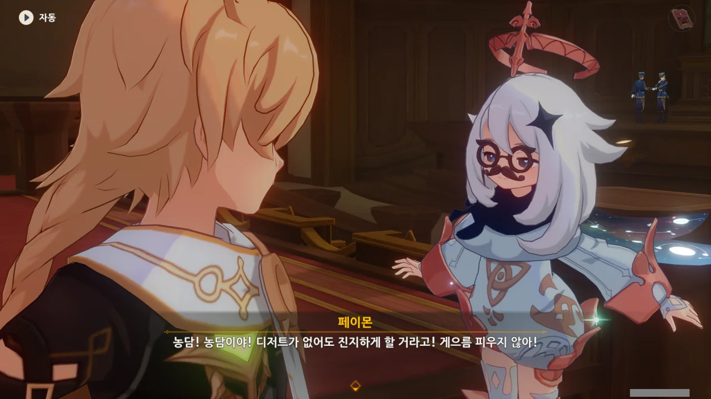

페이몬, 많이 성장했네.



응? 나비아, 대체 무슨 말을 하는 거야?

> 가게로 갈 수 없으면 여기서 만들면 되지.

순간 '빵이 없으면 케이크를 먹으면 되지'라고 말하는 것처럼 느껴졌다.

그나저나, 아무것도 없는데 어떻게 디저트를 만든다는 거지?



와우, 여윽시 폰타인이야! '상식은 깨라고 있는 거야'라고 말하며 조리 기구를 휴대하고 다니네!



... 뭐, 살다 보면 조리 기구를 들고 다닐 수도 있지! 다들 배낭에 조리 기구 하나씩은 다 있잖아?

&nbsp;

아, 그런데 계란, 설탕, 아몬드로 만들 수 있는 디저트가 뭐가 있지?



엥? 마카롱의 재료가 계란, 설탕, 아몬드였어?

진짜 그런가 해서 찾아보니 정말이더라. 아몬드는 그대로 넣는 것이 아니라 아몬드 분말을 넣는 것이라고 한다.

난 지금까지 마카롱에 당연히 밀가루가 들어갈 것이라고 생각하고 있었는데, 마카롱에 밀가루를 넣으면 만들기는 쉬워져도 식감이 떨어지게 된다고 한다. 그래서 제대로 마카롱을 만드는 집에서는 밀가루를 절대 넣지 않았다고 광고한다고.

살면서 마카롱을 단 한 번도 먹어본 적이 없어서 몰랐다.



난 위의 '나비아가 숙련된 움직임을 보이며'라는 문구를 별생각 없이 읽고 넘겼는데, 나비아가 만든 디저트가 마카롱이라면... 와오, 그 머랭을 직접 다 쳤다는 거 아냐.

정말 대단한데?



나비아가 마카롱을 만들 때, 이 둘은 옆에서 그냥 응원만 하고 있었다.

나비아는 평소 마카롱을 만들 때에도 이렇게 머랭을 치는 것부터 모든 걸 본인이 직접 다 한 모양이다. 정말 대단한 열정이라고 해야 할까, 이걸?



> 아가씨들이 꼭 차나 마시고 피아노나 치라는 법은 없잖아?

처음 만났을 때에는, 그냥 귀하게 자란 마피아 집안 아가씨인가 했는데 이런 당돌한 면이 었었다니.

> 머랭 치는 것도 보통 일이 아니야. 팔 힘이 엄청 필요하거든. 제대로 안 하면 마카롱이 깨져버릴 수도 있어.

와, 정말 마카롱에 진심이네...



식사 대용으로 디저트를 먹는 것이라 생각해, 마카롱을 많이 줄 줄로 생각했는데, 한 사람당 겨우 3개밖에 되지 않는다.

단 걸 너무 많이 먹으면 머리가 어지러워질 것이라고 말하는데, 마카롱이 그렇게 단 음식인가?

하기야, 마카롱의 재료는 오직 계란, 설탕, 아몬드 가루밖에 되지 않으니 설탕이 많이 들어갔을 수도 있다.



마르시악이 홍차를 내어준다.

마르시악과 실버도 옆에 앉아서 쉬면 좋을 텐데. 다리 안 아픈가?





현재까지 얻은 정보를 정리해 보자.

지하 통로에는 두 출입구 외에도 환풍구가 있지만, 그곳을 통해 빠져나간 사람은 없다. 일종의 밀실 상태인 거지. 거길 드나든 사람은 리니, 리넷, 관객, 코웰, 총 네 명이 전부이다. 그중 관객은 현재 행방불명인 상태이며, 코웰은 상자에서 시체로 발견되었다.

아무리 생각해도, 리니와 리넷은 이 사건의 범인이 될 수 없다.

일단 이 둘에게서 범행 동기를 전혀 찾아볼 수 없다.

만약 우리가 알지 못하는, 코웰을 죽이고 관객을 납치해야 할 이유가 그들에게 있었다고 해도, 그들이 이렇게 사람들이 두 눈을 부릅뜨고 지켜보고 있는 와중에 이런 범행을 태연히 저지를 거라고 도저히 생각되지 않는다. 사람을 죽이거나 납치할 거라면 당연히 아무도 보지 않는 곳에서 하는 것이 정석 아니겠는가? 마술 공연 중 사람이 사라지거나 죽으면 당연히 의심의 눈초리가 리니와 리넷에게 쏠릴 텐데 말이다.

그러니, 리니와 리넷은 이 사건의 범인이 아니다. 절대 그럴 리 없다.

&nbsp;

그나저나 마르시악과 실버는 조리 기구 앞에서 대체 뭘 하고 있는 것일까?





지하 통로에 있던 깨진 꽃병과 공연 중 들린 쿵 소리. 어쩌면 할시와 범인은 지하 통로에서 몸싸움을 벌였던 것일지도 모른다. 겉옷을 벗긴 건 모두가 '행운의 참가자'에 당첨된 할시의 옷을 보았기 때문에 옷을 벗겨 쉽게 알아보지 못하도록 한 조치일 수도 있고.

하지만 앞서 말했다시피, 지하 통로에는 리니, 리넷, 할시, 코웰 넷밖에 없었다. 다른 범인이 있을 수 없다는 것이다.



리니와 리넷이 범인이 아니라면 할시와 코웰 중 범인이 있다는 뜻인데, 정작 할시는 실종되었고 코웰은 죽었다.





할시가 코웰을 없애기 위해 마술 도구에 손을 쓰고 혼자 도망친 게 아닐까 페이몬이 추측한다.

하지만 마술 도구에 손을 쓰려면 사전에 마술 트릭에 대해 알고 있어야 하며, 이전에 마술단과 교류가 없던 할시가 코웰을 살해할 동기도 없다.

리니와 리넷이 범인이 아니라면 다른 누군가가 범인이란 이야기인데, 남은 것은 전부 피해자뿐인 기묘한 상황.



페이몬, 혹시 마카롱이 너무 맛있어서 세 개를 먹는다는 것이 저도 모르게 다섯 개를 먹은 거 아냐?



마르시악이 자신의 몫을 양보하지만, 페이몬 말처럼 실제로 몇 개 먹었는지 역시 중요한 문제이다.

> 내가 많이 먹으면 다른 사람이 먹을 게 줄어들잖아. 그 정도는 나도 알아.

평소 식탐이 많은 페이몬이라도 저런 생각을 하긴 했었구나.

그런데 아무리 봐도 이번에 페이몬이 그냥 마카롱 다섯 개를 먹은 것 같은데.



오, 페이몬 판 '돌을 먹는 형벌'인 것인가?

페이몬이 저렇게 말할 정도면 정말 억울하다는 것인데...





나비아는 그냥 대화 도중 누군가가 두 개 더 먹었겠지,라고 넘기며 마카롱을 더 만들려고 한다.



> 계란, 설탕, 아몬드. 전부 있습니다.

이상하다. 왜 아까 이 대사를 들은 것 같지? ㅋㅋㅋ...



결국 마카롱 두 개를 더 만든 나비아.

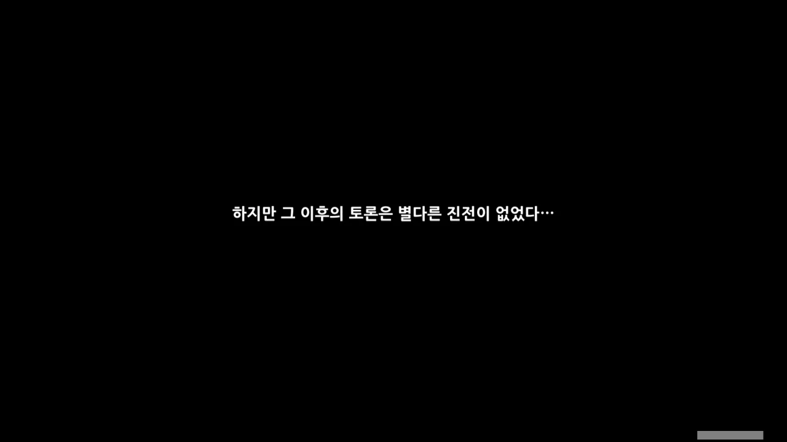





나비아는 새로운 걸 발견하면 돌아오겠다는 말을 남기고, 주변을 더 둘러보려 자리를 뜬다.

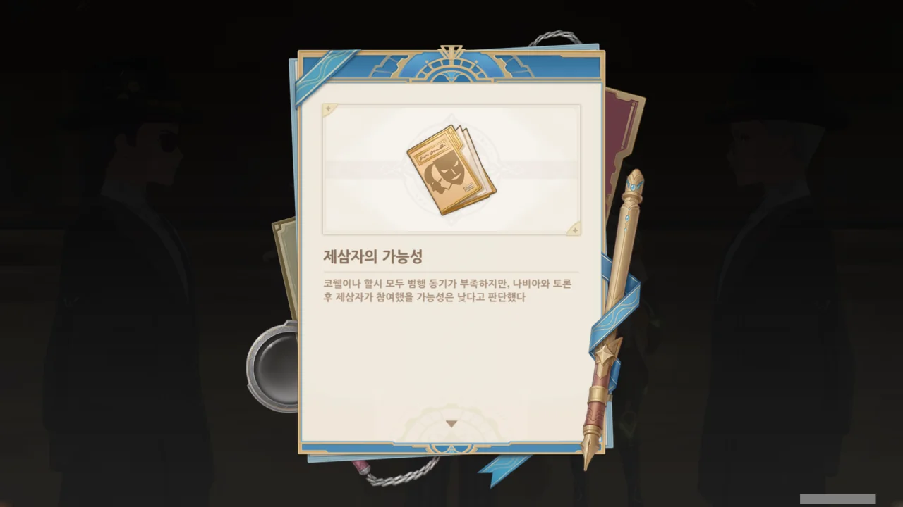

> **제삼자의 가능성**
> 코웰이나 할시 모두 범행 동기가 부족하지만, 나비아와 토론 후 제삼자가 참여했을 가능성은 낮다고 판단했다.
{.bq}



일단 지금까지 모은 정보를 정리해 보자.





> **바닥에 떨어진 갈고리 끈**
> 바닥에 떨어져 있던 끈. 한쪽에 갈고리가 걸려 있으나 용도는 알 수 없다.
> _페이몬: 이건 마술 도구겠지? 여행자의 낚싯바늘처럼 여기저기에 걸 수 있을 것 같아._
{.bq}

> **깨진 꽃병**
> 지하 통로 한구석에 바닥을 적신 채  널브러져 있는 깨진 꽃병. 거리를 생각하면 마술 상자 운반 카트에 부딪혀서 깨졌을 가능성은 높지 않은 듯하다.
> _페이몬: 꽃병은 마술 도구겠지? 음, 어쩌면 범죄 도구일지도 몰라..._
{.bq}

> **소녀의 옷**
> 실종된 소녀 할시의 옷. 지하 통로에서 발견됐으나 이유는 알 수 없다.
> _페이몬: 하나도 모르겠어. 역시 여행자한테 맡기자._
{.bq}



> **오페라 하우스 출입 기록**
> 마술 공연 도중 누구도 오페라 하우스를 떠나지 않았으며 사건 발생 후에도 경비대에게 신원 조사를 받은 사람만이 오페라 하우스를 떠날 수 있었다.
> _페이몬: 문을 지키는 자리에선 공연이 안 보이는구나... 나라면 못 참고 몰래 관객석으로 갔을 거야._
{.bq}

> **관객석 마술 상자의 구조**
> 관객석 중앙의 마술 상자는 이중으로 이루어져 있고 아래에는 지하 통로로 통하는 입구가 있어서 행운의 참가자가 들어간 상자를 관객들 모르게 옮길 수 있다.
> _페이몬: 난 상자가 두 겹으로 되어있는지 몰랐어..._
{.bq}

> **무대 마술 상자의 구조**
> 무대 위 마술 상자의 뒤편에는 작은 공간이 있어 리니 옷으로 갈아입은 리넷이 몸을 숨길 수 있다. 리넷은 마술이 끝나갈 무렵 등장해 리니가 반대쪽 상자로 순간 이동한 것처럼 보이게 유도한다.
> _페이몬: 그러니까 이건 저 둘만이 할 수 있는 마술인 거지!_
{.bq}



> **제삼자의 가능성**
> 코웰이나 할시 모두 범행 동기가 부족하지만, 나비아와 토론 후 제삼자가 참여했을 가능성은 낮다고 판단했다.
> _페이몬: 제삼자는 없어! 페이몬도 마카롱을 세 개밖에 안 먹었고!_
{.bq}

> **마술 트릭**
> 리니가 자세히 설명한 트릭은 다음과 같다: 이중 상자 구조를 이용해 관객이 들어간 상자는 지하 통로를 통해 맞은편으로 옮기고, 리니도 지하 통로를 통해 반대편으로 간다. 무대 위에서는 옷을 바꿔 입은 리넷과 스태프가 연기를 펼친다.
> _페이몬: 마술을 위해 지하 통로를 파다니, 정말 대공사구나!_
{.bq}

> **지하 통로의 환풍구**
> 한 명 정도 들어갈 수 있을 듯한 지하 통로의 환풍구. 실종된 소녀를 데리고 함께 통과하기란 쉽지 않아 보인다.
> _페이몬: 저 크기라면 난 가능할 것 같은데._
{.bq}



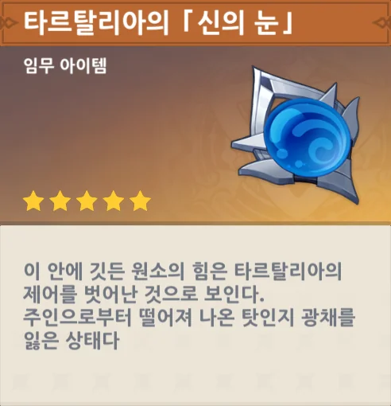

그러고 보니 폰타인성에서 타르탈리아가 준 신의 눈이 아직도 배낭 안에 있다.

> 타르탈리아의 「신의 눈」
> ***
> 이 안에 깃든 원소의 힘은 타르탈리아의 제어를 벗어난 것으로 보인다.
> 주인으로부터 떨어져 나온 탓인지 광채를 잃은 상태다.
{.bq}

진짜로 물 원소 무늬가 더 이상 흰색이 아니네.

난 지금까지 「신의 눈」이 개인에게 귀속되는 종속형 물체인 줄 알았는데, 설정을 찾아보니까 그냥 단순한 외부 마력 기관일 뿐이라서 자동으로 소유자에게 되돌아오는 기능 같은 건 없다고 한다. 그러니까 이 「신의 눈」은 여행자가 타르탈리아에게 돌려주기 전까지는 계속 여행자의 배낭 속에 들어있을 예정이라는 것이다.

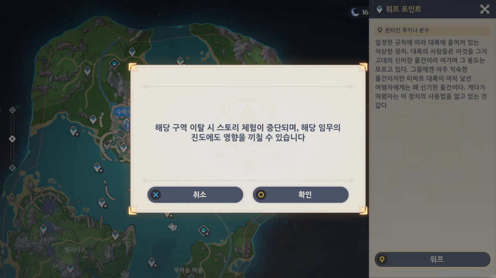

악! 나가게 해 줘! LET ME OUT!



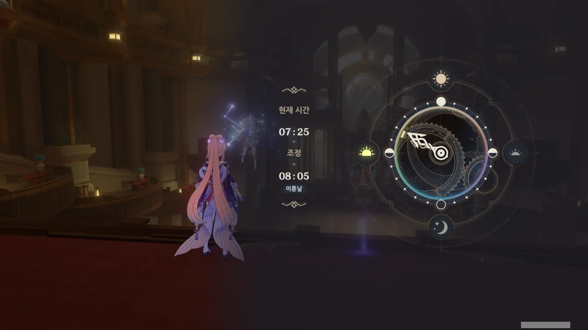

시간을 돌리자, 무대 뒤편에 쳐져있던 붉은 커튼이 걷어져 있다. 재판을 위한 거겠지.





아직 리니와 리넷의 결백을 증명할 마땅한 방법이 떠오르지 않은 상태.

우리가 이러할진대, 푸리나가 리니와 리넷이 범인이라는 명백한 증거를 들고 왔을 리 없으니, 푸리나의 주장을 반박하는 것이 더 나은 선택일지도 모르겠다.



여기 세 단서가 아직 채워지지 않은 상태인데, 이대로 그냥 가도 되는 것일까?

너무 걱정돼서 먼저 마신 임무를 한 사람에게 물어보았는데, 전혀 문제가 없다는 대답을 들었다. 만약 아직 미처 조사를 하지 않은 것이 있었으면 이 단계까지 넘어오지도 못했을 것이라고 하던데...

에라 모르겠다. 일단 가보면 알 수 있겠지.
