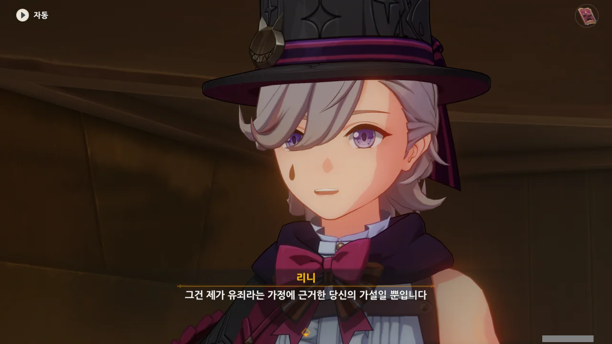
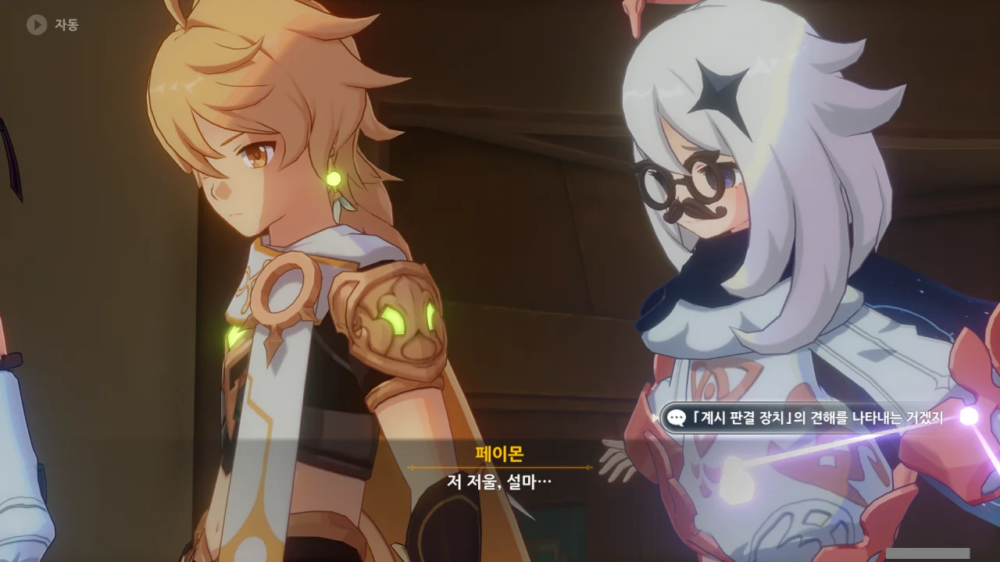
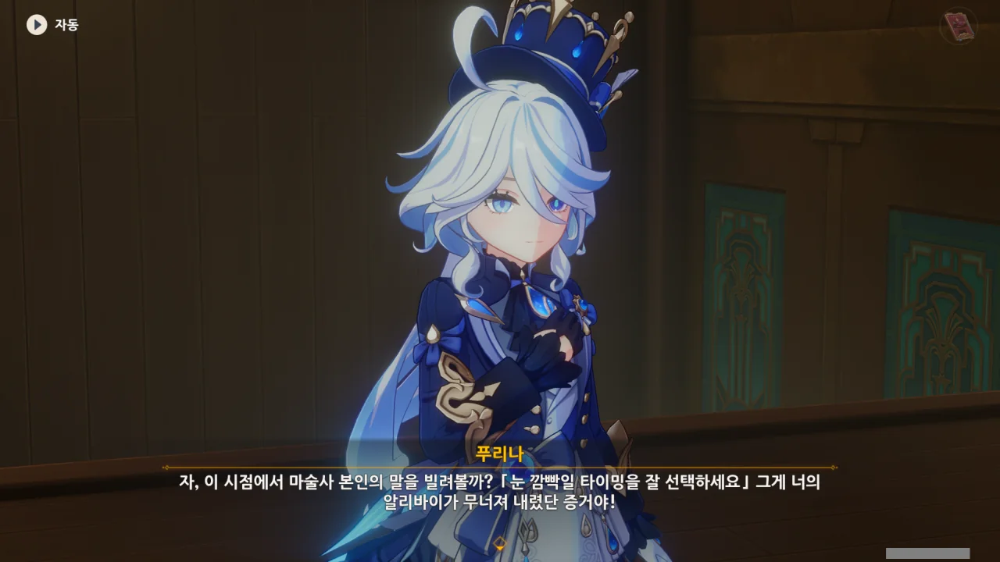
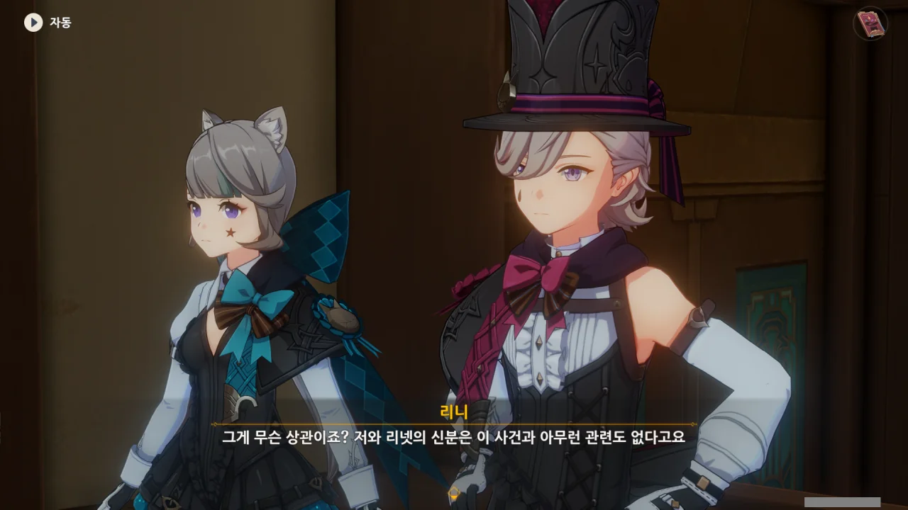
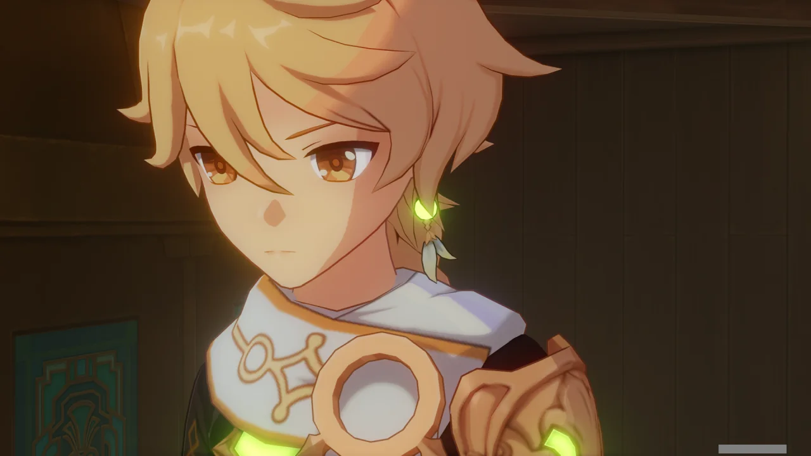
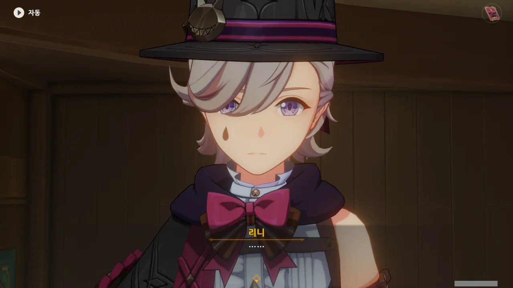
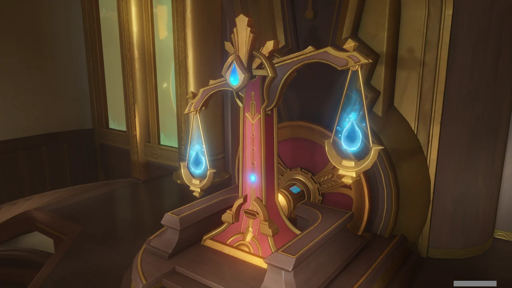



아직 리니와 리넷이 결백하다는 결정적 증거를 찾지 못했다. 따라서 푸리나가 제시한 증거를 반박하는 방식으로 가야 한다.

별로 내키진 않지만, 별다른 방법이 없다.



저 망할 메스가키가... 무죄추정의 원칙은 어디로 간 거냐?



「심판」이 시작된다.



여행자는 이미 한번 본 것이지만, 지금 「심판」을 보는 관객들은 무대 밑에 지하 통로가 있을 줄은 정말 꿈에도 몰랐을 것이다. 놀라는 게 당연하겠지.



리니의 주장은 다음과 같다.

> 리니는 마술이 시작되자마자 관객석 쪽 마술 상자로 달려가 숨어야 했기 때문에, 범행을 저지를 수 없었다.
{.bq}





푸리나가 리니의 진술에 반박한다.

> 리니는 할시를 납치하고 코웰을 없애기 위해 상자 안에도, 지하 통로에도 오랫동안 있을 수 없었다.
{.bq}

이게 대체 무슨 말이지? 리니가 상자 안에도, 지하 통로에도 오래 있을 수 없다면, 대체 어디 있었다는 말인가?

번역, 설마 또 네 짓이니?

맞아. 저건 리니가 유죄라는 결론을 먼저 정해두고 하는 소리지 않은가.







푸리나가 상자 안에서 무슨 소리를 들었냐 묻자, 리니는 카운트다운 소리 외에는 들은 게 없다고 말한다.

여행자를 포함한 관객 모두가 쿵 소리를 30초 즈음에 들었다. 그 정도 크기의 소리를 리니가 듣지 못했을 리가 없을 텐데?



지하 통로에 방음 처리가 되어 있다는 말을 들은 적이 없으니, 지하 통로에 있던 리니 또한 그 소리를 들었어야 정상이다.

그런데 리니는 왜 그 소리를 듣지 못했다고 한 거지?



관객들이 리니의 결백을 의심하기 시작하자, 「계시 판결 장치」의 접시가 푸리나 쪽으로 기운다.

나비아는 '「계시 판결 장치」는 자의식을 가진 또 하나의 심판관'이라고 했었다. 그러니 「계시 판결 장치」 역시 푸리나의 말이 더 옳다고 판단한 거겠지.

리니가 공연 중 했던 말을 또다시 가져오며 리니를 몰아세우는 푸리나.

아니, 그러니까 "눈 깜빡일 타이밍을 잘 선택하세요"와 리니의 알리바이가 무너진 게 대체 무슨 상관인데? 난 잘 이해가 되지 않는걸.



알리바이 이외에도 다른 무기가 있다고 주장하는 푸리나.

설마 내가 알지 못한 다른 증거가 있었던 걸까? 분명 조사할 수 있는 건 다 했을 텐데?



뭐요? 리니와 리넷이 「벽난로의 집」 소속이라고? 그거, 우인단 집행관 '아를레키노'가 운영하는 고아원이잖아. 그 실상은 고아들을 스네즈나야의 스파이로 키워, 각국에 파견하기 위해 만든 간첩 양성소이고.

&nbsp;

이미 「벽난로의 집」 출신 우인단 스파이를 티바트 여러 곳에서 만났다.

수메르 비마라 마을의 '알폰소'는 폰타인 출신 기술자로 알려져 있지만, 사실 그는 비마라 마을에 파견된 우인단의 고정간첩, '트로핀 스네즈비치'였다.

그의 임무는 비마라 마을 사람들을 납치해 우인단 집행관 '도토레'에게 인체 실험 재료로 제공하는 것이었으며, 납치된 사람 중에는 아란나라를 볼 수 있는 아이들도 포함되어 있었다. 다행히도 아이들은 아란나라 덕분에 끔찍한 기억은 잊고 무사히 마을로 돌아올 수 있었지만, 다른 마을 사람들은 꼼짝없이 도토레의 잔인한 인체 실험의 대상이 되어 죽어야만 했다.

결국 그는 여행자에 의해 정체가 들통나게 되었으며, 여행자 혹은 수계 늑대에 의해 죽음을 맞게 되었다.

이나즈마 나루카미 다이샤의 무녀, 「겐도우 링고」 역시 우인단의 고정간첩, '류다치카 스네즈브냐'였다.

그녀의 직속상관은 이나즈마에서 모두 철수하라는 우인단 상층부의 명령을 무시하고, 그녀에게 '와타츠미 섬의 우물에 대놓고 독을 푼 후, 나루카미 다이샤에서 왔다고 말하고 죽어라'라는 자살 임무 명령을 내렸다.

그녀는 지령 수행을 거부하고 우인단에서 나와, 야에 미코의 묵인 하에 '겐도우 링고'로 살게 되었다.

&nbsp;

그런데 지금 리니와 리넷이 그 「벽난로의 집」 소속, 그러니까 우인단이라고 말하는 거야?





리니와 리넷이 우인단이라는 푸리나의 말에 사람들이 웅성대기 시작한다.

'이번 사건과 「소녀 연쇄 실종 사건」은 모두 우인단의 소행일 것이다'라는 쪽으로 대중의 의견이 모인 상황. 「계시 판결 장치」조차 그렇게 생각한 건지, 저울의 받침대에 푸른 점이 하나 찍혔다.

아마 남은 세 개의 점이 모두 찍힐 때, 「계시 판결 장치」가 최종 판결을 내리겠지.

리니는 자신들의 신분이 이번 사건과 아무런 관계가 없다고 말한다. 하지만 「벽난로의 집」 소속임을 부정하지 않는다. 설마 진짜로 「벽난로의 집」 소속이었던 거야?





리니의 말에, '그렇다면 1분 동안 일어난 일에 대해 낱낱이 설명해 보라'고 말하는 푸리나.

리니는 왜 그 1분 동안 있었던 일에 대해 자세히 설명하지 않는 걸까? 왜 여행자에게 자신이 「벽난로의 집」 소속임을 여행자에게 말하지 않은 걸까?

설마, 처음부터 다른 속셈으로 여행자에게 접근한 걸까?





리니와 리넷이 우인단 소속임을 밝혔으니, 이제 여행자와 리니/리넷 사이에 내분이 일어날 거라 생각하며 속으로 좋아라 하는 푸리나.

겉으로는 도도하게 허리춤에 손을 가져다 대고 있지만, 속으로는 애처럼 싱글벙글 웃으며 요란법석 오두방정을 떨고 있다. 아아, 한 대 쥐어박고 싶어라.



푸리나는 심판 때문에 잔뜩 긴장해서 한숨도 자지 못했다.

대체 무엇 때문이었을까. 리니와 리넷이 우인단이라는 증거를 찾고 잔뜩 흥분해서였을까, 아니면 리니가 범인이라는 확증을 찾지 못해 전전긍긍 불안해서였을까.

리니, 왜 아무런 말도 하지 않는 거야? 뭐라도 말 좀 해봐...



이번 재판에서 리니를 애꿎은 범인으로 몰고 갔듯이, 푸리나의 이번 주장 역시 사실이 아닐지도 모른다.

리니와 리넷이 「벽난로의 집」 출신이 아니라거나, 「벽난로의 집」 출신이라고 하더라도 이미 「벽난로의 집」과 연을 끊은 관계라거나... 그럴 수도 있지 않겠는가.

하지만 리니가 푸리나의 주장에 정면으로 반박하지 않는 걸 보아, 리니와 리넷이 「벽난로의 집」 소속이 아닐 확률은 로또에 연속 10번 당첨될 확률보다 낮아 보인다.





느비예트가 관객을 조용히 시킨 후, 리니에게 푸리나의 주장에 대한 진위 여부를 답할 것을 요구한다.

> 리니는 오페라 하우스에서 쿵 소리가 울렸을 때, 상자나 지하 통로에 있지 않았다.
> 리니와 리넷은 우인단 「벽난로의 집」 소속이다.
{.bq}



사실 여행자가 이번 사건에 얽힌 건 처음부터 우인단의 음모가 아니었을까? 마침 폰타인에는 우인단 집행관이 둘이나 있다.

'타르탈리아'는 "요즘 내가 기분이 안 좋아서 말이야"라고 했지만, 여행자를 속이기 위해 둘러댄 핑계일 수 있다.

프레미네를 처음 만났을 때, 리니는 "곧 「아버지」가 돌아오신다"라고 했었다. 「아버지」는 「벽난로의 집」 원장인 '아를레키노'를 가리키는 호칭일 수도 있다.

여태껏 여행자와 사사건건 충돌했으니, 우인단은 분명 여행자를 함정에 빠트리길 원할 것이다. 그걸 위해 이 모든 걸 계획한 건가?



느비예트가 답변을 독촉하자, 리니는 여행자에게 "미안해"라고 사과한 후, 푸리나의 주장이 모두 사실이라고 말한다.

그러자 「계시 판결 장치」의 접시가 푸리나 쪽으로 한층 더 기운다. 「계시 판결 장치」 역시 리니가 이 사건의 범인임을, 그리고 우인단이 「소녀 연쇄 실종 사건」과 연관이 있음을 의심하고 있는 것이다.



관객 역시 "남은 건 「판결」 뿐이다"라며, 푸리나의 승리를 점치고 있다.



일단 한 발짝 물러나, '의뢰인이 중요한 정보를 은폐해 정상적인 변호를 할 수 없으니, 의뢰인과의 논의를 위해 휴정을 요청한다'라고 말하는 여행자.

마음 같아서는 당장 때려치우고 싶지만, 리니의 말도 일단 한 번은 들어보아야 할 것 같다. 판단은 그 이후에 해도 되겠지...





'변호인까지 속였는데 더 볼 것이 있냐'라고 관객들이 수군대지만, 느비예트는 여행자의 요청이 합리적이므로, 휴정 한 시간 후 심판을 재개하겠다고 말한다.



하... 저 망할 중2병 메스가키의 머리를 한 대만 내리칠 수 있다면 참 좋을 텐데...

제발, 한 대만 때리게 해 주면 안 될까?



휴정 후, 리니 리넷과 함께 무대 뒤편으로 왔다.

그래, 이 둘이 뭐라고 하는지, 일단 한번 들어나 보자. 판단은 그 후에 하고.

자신들이 「벽난로의 집」 소속임을 숨긴 것에 대해 화가 나지 않은 건 아니다. 그래도 마지막으로 변명할 기회 정도는 줘야 할 것 같다.



일단 사과부터 박고 보는 리니와 리넷.



페이몬 또한 여행자와 함께 여행을 다니며, 우인단이 그동안 나쁜 짓을 얼마나 많이 해왔는지 같이 봤다. 페이몬이 느끼는 분노는 여행자의 것과 비교해도 결코 적지 않겠지.

친구라고 생각했는데, 무슨 꿍꿍이를 가지고 접근했을지 모를 우인단이라는 사실에 허탈하기까지 하다.



우인단 소속이라 그런지, 여행자가 그동안 우인단과 수도 없이 부딪혀온 것 정도는 이미 잘 알고 있다.





뭐지? '일부만 보고 전체를 판단하지 말아 주세요'라고 하는 건가? 거 참, 재미있네.

&nbsp;

리니 말대로, '우인단'이라는 전체가 아니라 '「벽난로의 집」'이라는 일부만 보고 판단하더라도, 「벽난로의 집」에 대한 평가는 달라지지 않는다. 「벽난로의 집」은 전 세계의 고아들을 데려다가 스네즈나야, 아니, 우인단의 스파이로 키우는 간첩 양성소이기 때문이다. 그 과정에서 고아들을 세뇌해, 우인단을 쉬이 배신할 수 없도록 하기도 한다.

그 본체인 '우인단' 역시 전 세계적인 민폐 집단이다.

1. **시뇨라**
   * 몬드의 바람 신인 바르바토스를 폭행한 후, 신의 심장을 강탈함.
   * 이나즈마의 텐료 봉행과 간조 봉행을 포섭한 후, 안수령을 시행토록 유도함.
   * 이나즈마 야시오리 섬에서 채취한 오로바스의 잔해를 이용해 사안을 제작한 후, 와타츠미 저항군에게 보급함.
2. **타르탈리아**
   * 리월 칠성과 선인 사이를 이간질시켜 리월의 정치를 혼란스럽게 함.
   * 리월의 바위 신인 모락스의 신의 심장을 훔치려 함.
   * 신의 심장 탈취가 실패하자, 복제한 백무 금기비록을 이용해 봉인된 고대 마신, 오셀을 깨움.
3. **스카라무슈**
   * 이나즈마의 사안 공장을 관리 및 감독함.
4. **도토레**
   * 400년 전, 이나즈마의 타타라스나에 '에셔'라는 이름으로 잠입해, 타타라스나의 몰락을 유도함.
   * 리월 성법관문 인근에 몰래 세운 '장난감 연구소'를 방치해, '연구소'에서 흘러나온 유적 가디언이 주변 행인을 공격하게 만듦.
   * 스카라무슈의 의식에 접촉한 하이파시아를 납치 혹은 암살하려 함.
   * 허공 단말기를 통해 수메르성 사람들의 뇌를 조작함.
     * 사람들이 여행자를 '금의환향한 영웅'으로 생각하게 만들어, 여행자를 포위하게 만든 뒤, 여행자를 사로잡으려 함.
     * 스카라무슈를 새로운 신으로 만들기 위해, 사람들의 꿈을 훔침.
   * 생체 실험을 위해 비마라 마을 사람들을 납치함.
   * 아란나라와 교감이 가능한 어린아이들을 납치함.

이게 다 우인단 집행관들이 '우인단 집행관'으로써 한 일들이다. 아마 더 자세히 살펴보면 이것 말고도 더 나올 것이다.

그런데도 '일부만 보고 전체를 판단하지 말아 주세요'라고? 뚫린 입이라고 못하는 말이 없네.

&nbsp;

리니의 말이 무조건 틀렸다고 말하는 건 아니다. 리니 말처럼, 우인단 집행관은 각각 성격이나 이루고자 하는 목표가 다르니까. 하지만 그들은 모두 '우인단'이라는 깃발 아래에서, 스네즈나야 여왕의 명령을 받고 움직인다.

초록동색(草綠同色), 근묵자흑(近墨者黑)이라는 사자성어가 있다. '나는 나쁜 사람이 아니야'라고 말하려면, 일단 나쁜 사람들이 모인 집단에서 나온 후에 이야기하는 게 맞지 않을까?

&nbsp;

여기서 한 발짝 더 양보해서, 리니와 리넷이 정말로, 우인단의 입장과 관계없이, 폰타인 사람들을 구하기 위해 움직이고 있다고 하더라도, 하나 우려되는 것이 있다.

만약 우인단 상층부로부터 폰타인 사람들을 위험에 빠트리는 지령이 내려왔을 때, 리니와 리넷은 그 지령을 거부할 수 있을까? 고아들에게 세뇌까지 걸어, 우인단을 배신하지 못하게 하는 「벽난로의 집」 출신인데 말이다.

여태껏 보아온 「벽난로의 집」 출신 간첩들의 행동을 보면, 아마 속으로는 거부감을 강하게 느끼더라도, 그 지령을 수행할 것이 분명하다.

&nbsp;

마지막으로, 제일 중요한 것이 하나 더 있다. '리니와 리넷은 「벽난로의 집」 소속이다'라는 말은 리니와 리넷에게서 직접 들었어야 하는 말이지, 푸리나의 입을 통해 들어서는 안될 말이었다.

리니와 리넷이 처음부터 솔직하게 자신들이 「벽난로의 집」 소속임을 밝혔더라면, 아마 여행자는 어느 정도 경계는 할지언정, 이렇게까지 화를 내진 않았을 것이다. 기껏해야 '타르탈리아 Mk.2' 정도로 생각했겠지.

하지만 보라. 그 정보를 본인 입이 아니라 푸리나를 통해 알게 되자, 여행자가 "그 말도 거짓일지 어떻게 알아?"라며, 리니와 리넷의 말을 전부 의심하고 있지 않은가.

리니와 리넷은 거짓말을 하고 싶지 않아, 아예 말을 하지 않는 걸 선택한 모양이지만, 결과적으로는 거짓말을 한 것과 그리 다르지 않은 결과를 낳았다.





리니 역시, 자기가 하는 말이 얼마나 공허하게 들리는지 잘 알고 있는 모양이다.



리니와의 신뢰 관계는 일단 차치하고, 공연 중 대체 리니가 어디에 있었는지를 묻는다.

신뢰 관계가 깨진 건 깨진 거고, 일단 하던 일은 마무리해야 할 것 아니겠는가.







「계시 판결 장치」가 대체 어떤 원리로 범죄 사건을 정확하게 판결하는 것인지 궁금해하던 리니와 리넷은 조사를 통해 「계시 판결 장치」 아래에 코어가 존재한다는 사실을 알게 되었다.

그래서 리니와 리넷은 「계시 판결 장치」의 코어에 다가가기 위해 마술 공연을 기획했다. 오페라 하우스 바닥에 바꿔치기 마술을 위한 지하 통로를 만들 때, 「계시 판결 장치」의 지하로 향하는 환풍구를 같이 만들어, 마술 도중 「계시 판결 장치」의 지하로 이동할 수 있도록 했다.

여러 사람들이 모여 시간을 재면 실제 시간보다 더 느리게 시간을 재는 걸 이용해, 리니는 사람들이 60초를 세는 데 드는 75초 중, 반대편 상자까지 가는 데 필요한 15초를 제외한 60초 동안, 「계시 판결 장치」의 코어를 확인하기 위해 환풍구로 들어갔다.





분명 아무도 없어야 할 방에서, 리니가 누구인지 아는듯한 목소리가 리니와 대화를 하려 하자, 리니는 더 이상의 조사는 위험하다 판단하고 다시 지하 통로로 되돌아갔다.

하지만 지하 통로로 되돌아온 리니가 발견한 건 이미 사건이 벌어지고 난 후 현장에 남은, 깨진 꽃병과 바닥의 옷이었다.

여기에 대해 자세히 생각하기에는 남은 시간이 부족했기에, 리니는 이를 무시하고 관객석 중앙 통로 상자로 올라갔으며, 이후 천장에 매달려 있던 수조가 떨어지는 사건이 발생했다.





대체 왜 「계시 판결 장치」의 원리를 알려했냐는 물음에, 예언의 위기에 대응하기 위해선 폰타인의 모든 비밀을 알아야 하기 때문이라고 답하는 리니.

전혀 이해가 되지 않는다. 예언의 위기에 대응하는 것과 폰타인의 모든 비밀을 아는 것에 대체 무슨 상관이 있는 건지, 예언에 나오지도 않은 「계시 판결 장치」의 비밀을 왜 그렇게 궁금해하는 건지 도저히 모르겠다.

마치 '대체 왜 주유소에 불을 지른 거야?'라는 질문에 '거기에 산이 있으니까'라는 대답을 들은 느낌이다.

&nbsp;

어쩌면, 리니와 리넷이 저렇게 생각하는 건, 그렇게 생각하도록 「아버지」 '아를레키노'가 의도적으로 생각을 유도하거나 주입해서가 아닐까? 「계시 판결 장치」의 원리에 대해 파악하면, 「계시 판결 장치」의 판결을 우인단에 유리하게 유도하거나 조작할 수 있을 테니 말이다.



> 이런 식으로 신뢰를 잃는 상황은 절대 우리가 바라던 게 아니야.

그래. 나도 그래.



우인단인 데다, 여행자에게 거짓말 --- 실제로 거짓말을 한 건 아니지만, 그게 그거다 --- 을 한 리니와 리넷과 더 이상 엮이기 싫지만, 자신이 하지도 않은 일 때문에 억울하게 벌을 받는 사람을 보는 것도 싫다.

그래서 이들을 이번 재판이 끝날 때까지만 조금 더 돕기로 했다.

&nbsp;

이들이 정말 잘못을 저지른 거라면 그 죄에 대한 대가를 치르도록 할 거고, 누명을 쓴 거라면 그 누명을 벗을 수 있도록 도울 거다.

하지만 딱 거기까지. 이후에는 리니와 리넷과 더 만날 일이 없었으면 좋겠다.





현재 「계시 판결 장치」의 저울은 푸리나를 향해 상당히 기울어져 있다.

이대로 가다간 리니와 리넷이 이번 사건은 물론이요, 예전에 있었던 「소녀 연쇄 실종 사건」까지 전부 덤터기를 쓰고 잡혀가게 생겼다.



그래도 리니가 지하 통로에서 쿵 소리를 듣지 못한 이유를 알아낸 지금, 푸리나의 논리를 어느 정도 반박할 수는 있을 것이다.



> **리니의 진술**
> 리니는 지하 통로로 들어가자마자 환풍구를 통해 「계시 판결 장치」 코어가 있는 방으로 향했기 때문에, 지하 통로에서 발생한 사건을 목격하지 못했고 「그 소리」도 듣지 못했다고 진술했다.
{.bq}

> **「계시 판결 장치」 코어가 있는 방에서 들린 소리**
> 리니는 오페라 하우스 지하에 있는 「계시 판결 장치」 코어를 보관한 방에서 누군가가 말하는 목소리를 들었다고 한다.
{.bq}
