

다시 심판이 재개된다.



느비예트가 먼저 푸리나에게 사건의 진상을 설명할 것을 요구한다.



저 삿대질과 강조선을 보니, 갑자기 역전재판이 떠오른다. 설마 이번 마신 임무는 역전재판을 패러디한 것이었나?





그러니까 상대방이 제시한 '사건의 진상'을 알맞은 증거로 반박하라는 말이네.

UI가 꽤 이쁘장하다.







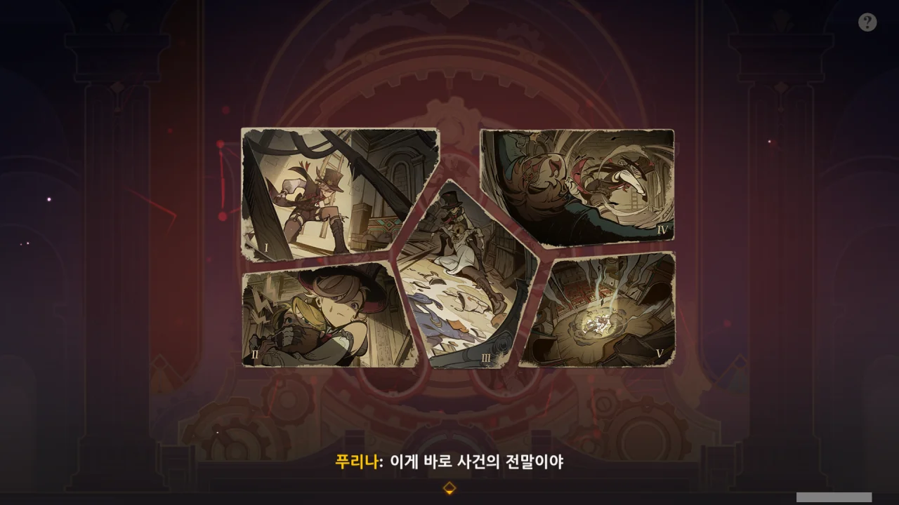

푸리나가 주장하는 사건의 전말은 다음과 같다.

> 먼저 카운트다운이 시작되자 리니는 지하 통로로 갔어.
> 카트가 지나갈 때 그는 상자를 열었고, 할시와 몸싸움을 벌이는 도중에 큰 소리가 났지.
> 그 소리가 오페라 하우스 전체로 울려 퍼질 거라곤 생각도 못 했기에, 그는 그 소리를 듣지 못했다고 주장했어.
> 마지막으로 리니는 꽃병으로 할시를 내리쳐서 기절시키고는, 사람들이 알아보지 못하도록 겉옷을 벗겼지.
> 이때 소리를 들은 코웰은 지하 통로로 왔고, 범행 중이던 리니를 목격한 거야.
> 그래서 리니는 코웰도 기절시키고 상자 안에 넣었지.
> 그 후 리니는 관객석 쪽 마술 상자를 통해 기절한 할시를 공범에게 넘겨줬고, 코웰의 죽음이 사고로 보이도록 장치를 조작했어.
{ class="bq" }



곧바로 반박을 시작한다.



'리니가 할시를 습격했다'라는 주장은 리니의 진술인 '리니는 「계시 판결 장치」 코어가 있는 방으로 곧바로 향했기에, 지하 통로에서 발생한 사건을 보지도 듣지도 못했다'로 반박한다.



'리니가 할시를 납치했다'라는 주장은 리니의 진술인 '리니는 「계시 판결 장치」 코어가 있는 방에서 누군가가 말하는 소리를 들었다'로 반박한다.

굳이 이걸로 반박할 필요가 있나 싶었다. 리니는 곧장 「계시 판결 장치」 코어가 있는 방에 갔는데, 할시를 납치할 수 있을 리 없지 않은가.



'리니가 코웰을 기절시켰다'라는 주장은 '리니 역시 사건 현장에 남은 흔적을 목격했을 뿐이다'로 반박한다.



여행자가 새로 수집한 증거에 입각한 사건의 진상은 다음과 같다.

여행자가 반박한 부분의 그림이 달라진 것이 뭔가 신기하다.





> 카운트다운이 시작됐을 때, 리니가 지하 통로로 들어간 건 사실이야.
> 하지만 그는 곧바로 환풍구를 통해 오페라 하우스의 지하실로 갔어. 「계시 판결 장치」의 코어가 보관된 곳이지.
> 그곳에 도착한 리니는 아무도 없는 방에서 누군가의 목소리를 들었어. 이상하다고 생각한 리니는 즉시 그곳을 벗어나 되돌아왔지.
> 통로에 돌아왔을 땐 이미 범죄 현장이 만들어져 있었지만, 마술을 완성시키기 위해 리니는 오래 머물 수 없었어.
> 그리고 지상으로 복귀했더니 사고가 일어난 거야. 이상 리니의 시점이야! 리니는 결백해!
{.bq}

반박 성공! 붉은색 쪽으로 기울어져 있던 천칭이 가운데로 되돌아갔다.

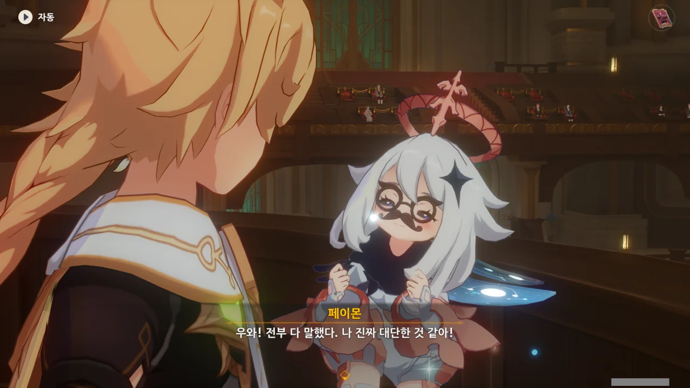

페이몬이 대단하긴 하지. 저 우스꽝스러운 안경을 쓰고 말하는 것이 어디 쉬운 일인가?



푸리나의 주장에는 한 가지 큰 결함이 있다.





페이몬이 "코웰이 지하 통로로 들어가지 않았을 경우, 리니는 누구를 죽이려고 했을까?"라고 말하는데, 이후 대사와의 연결이 어딘가 매끄럽지 않다. '코웰을 그런 방식으로 죽일 이유가 없다'라고 해석하는 게 더 나을 것 같다.

&nbsp;

아무튼, 푸리나의 말처럼 리니가 이번 사건의 범인이고, 그 목적은 할시의 납치라고 가정해 보자.

할시를 납치하는 데 성공한 리니는 더 이상 주목받는 일 없이, 서둘러 오페라 하우스 밖으로 빠져나가야 한다. 시간이 지연되면 지연될수록, 리니에게 시선이 끌리면 끌릴수록, 리니가 납치범으로 의심받을 가능성이 커지니까.

그러기 위해선, 코웰을 수조 낙하 사고와 같은 요란한 방법으로 죽여선 안 된다. 가장 이상적인 방법은 코웰을 꽁꽁 싸매 움직일 수 없도록 만든 후, 소품 상자와 같은 곳에 잠시 보관했다가 나중에 공연이 끝난 후, 조용하고 으슥한 곳에서 적당히 처리하는 것이다.

결론적으로, 푸리나의 주장은 리니가 범행 이후 지나치게 비합리적인 행동을 했다는 것이다.

리니가? 남을 속여서 돈을 버는 마술사라는 직업을 가진 리니가?



관객들 역시 여행자의 주장이 더 설득력 있다 생각하는 것인지, "확실히..."라며 납득하고 있다.







푸리나가 그 주장에 대한 근거를 묻자, 푸리나가 처음 지적한, '마술 상자 안에 있었다면 쿵 소리를 못 들었을 리 없다'를 제시한다.

리니가 마술 상자나 지하 통로에 있었다면, 푸리나의 말처럼, 분명 쿵 소리를 들었을 것이다. 하지만 그 당시 리니는 지하 통로가 아닌 「계시 판결 장치」의 밑에 있었기에, 쿵 소리를 듣지 못했다.

즉, 리니가 쿵 소리를 듣지 못했다는 진술은 여행자의 주장을 뒷받침하는 증거가 된다는 말이다.



공교롭게도, 리니의 알리바이를 반박하기 위해 쓴 단서가 역으로 리니의 알리바이를 증명하는 증거가 된 셈이다.



그러자 푸리나가 '그렇다면 대체 누가 범인인가?'라며 여행자를 몰아세운다.





~~안~~ 즐거운 추론 시간이다.

이렇게 알맞은 단서를 선택해 추론하는 시스템이 대체 언제부터 도입되었더라? 아마 수메르의 첫 마신 임무 때였던 것 같은데...



> 범인이 무대에서 사고를 일으킨 방법은?
> ***
> **경비대의 조사 보고서**
> 경비대의 조사에 따르면, 마술 공연이 끝날 무렵 터트린 폭죽이 수조를 지탱하고 있던 밧줄을 태웠고, 그로 인해 수조가 추락하며 상자 안에 있던 코웰이 사망하였다.
> 리니가 용의선상에서 제외되고 나면 마술 도구에 손을 댈 수 있는 것은 마술단의 나머지 단원들뿐이다.
{.bq}



> 공연의 원래 계획은?
> ***
> **마술 트릭**
> 리니가 자세히 설명한 트릭은 다음과 같다: 이중 상자 구조를 이용해 관객이 들어간 상자는 지하 통로를 통해 맞은편으로 옮기고, 리니도 지하 통로를 통해 반대편으로 간다. 무대 위에서는 옷을 바꿔 입은 리넷과 스태프가 연기를 펼친다.
{.bq}

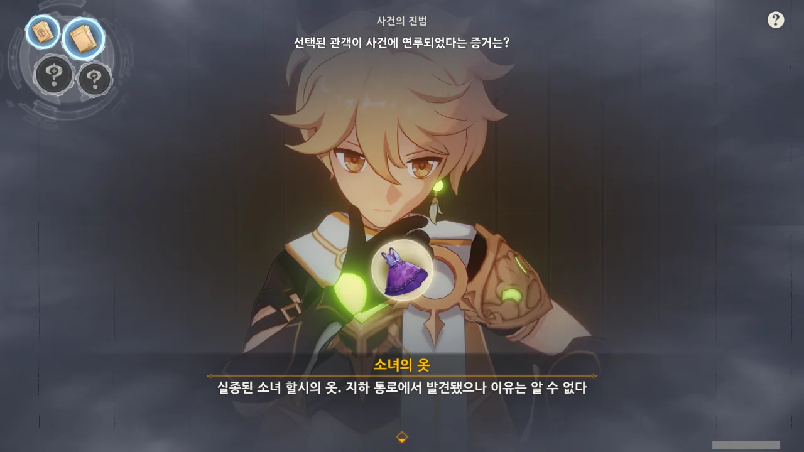

> 선택된 관객이 사건에 연루되었다는 증거는?
> ***
> **소녀의 옷**
> 실종된 소녀 할시의 옷. 지하 통로에서 발견됐으나 이유는 알 수 없다.
{.bq}



위 조건에 모두 부합하는 사람은 단 한 명뿐이다. 바로 이번 사건으로 인해 사망한 코웰이다. 코웰은 리니의 조수이니, 마술 소품에 손을 쓸 수 있다.

추리 성공!



그렇지? 내가 말해도 좀 웃기긴 해. 하지만 리니를 용의선상에서 제외하면, 남은 용의자는 코웰밖에 없다.



코웰이 범인이라고 지목했으니, 코웰이 지하 통로에서 뭘 했는지, 어쩌다가 졸지에 가해자에서 피해자가 된 것인지까지 밝혀내야 한다.



> 리니가 범행 계획을 방해하지 못할 것이라고 예측한 근거는?
> ***
> **리니의 진술**
> (당시 리니가 지하 통로에 없었던 덕에 범인에게는 충분한 시간이 주어졌을 거야.)
{.bq}

> 지하 통로에서 충돌이 발생했다는 것을 증명할 방법은?
> ***
> **마술 공연 중 들려온 이상한 소리**
> (그 소리는... 범인과 실종된 할시가 몸싸움할 때 난 건지도 몰라.)
{.bq}

> 현재 용의자로 추정되는 사람은?
> ***
> **사망자의 신원 정보**
> (사망자는 코웰, 리니의 조수야. 그러면 소품에 손을 쓸 수 있었겠지...)
{.bq}





나머지 세 선택지는 전부 오답이다. 하지만 다른 선택지가 없다.

> 실종된 할시는 어디로 갔는가
> ***
> **오페라 하우스 출입 기록**
> (오페라 하우스 입구로 드나든 사람은 없었어. 범인은 할시를 어디로 데려간 걸까?)
> &nbsp;
> **소녀의 옷**
> (지하 통로에 할시의 옷이 남아 있었어. 아마 사람들의 눈길을 피하기 위해서였겠지...)
> &nbsp;
> **지하 통로의 환풍구**
> (두 사람이 환풍구를 통해 이동하기는 어려웠을 거야. 그럴 경우 리니와 만났을 가능성도 커.)
{.bq}







아무리 생각해도 할시가 갈 곳이 없다. 하늘로 솟아오른 건지, 땅으로 꺼진 건지, 아주 감쪽같이 사라졌다.



> 후후... 결국 허장성세에 불과했던 건가? 자신만만하더니, 아직 진실에 다가가지는 못한 모양이로군.

시끄러워. 진실의 발톱 때조차 구경 못한 녀석에게 들을 말은 아니다.





리니가 최종 결과물은 분명 마술사의 초기 설계와는 전혀 다른 모습일 거라며, "막다른 길에 가로막혔다면 다른 길을 모색해 봐"라는 조언을 한다. 



지금까지 수집한 증거 중, 깨진 꽃병과 바닥의 물은 상황 재구성에 제대로 쓰이지 못했다. 어쩌면 이 둘이 이 상황의 돌파구가 될 수 있을까?

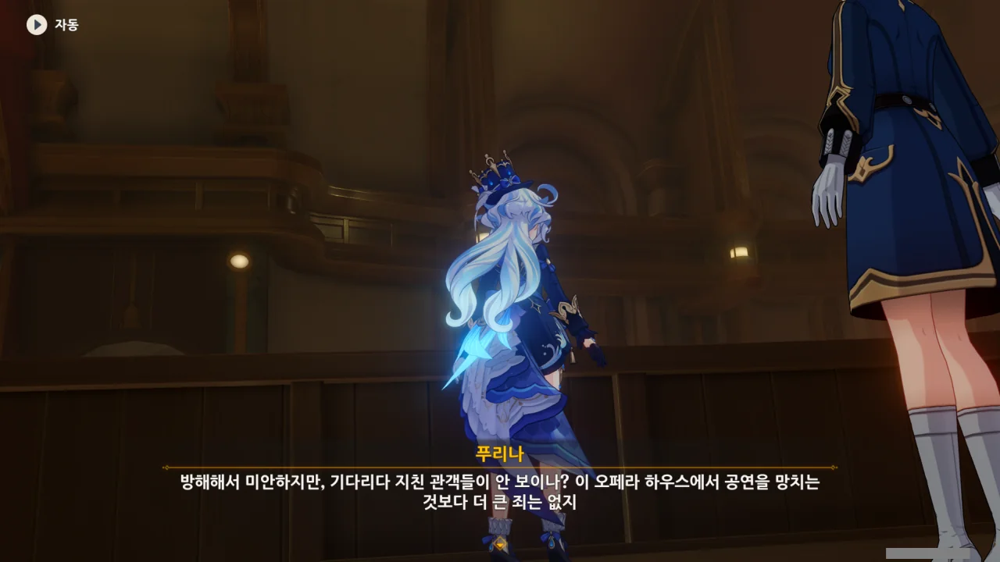

물증도 없이 단순 추측과 정황 증거만 갖고 온 녀석이 나불나불 쫑알쫑알 말이 많다.

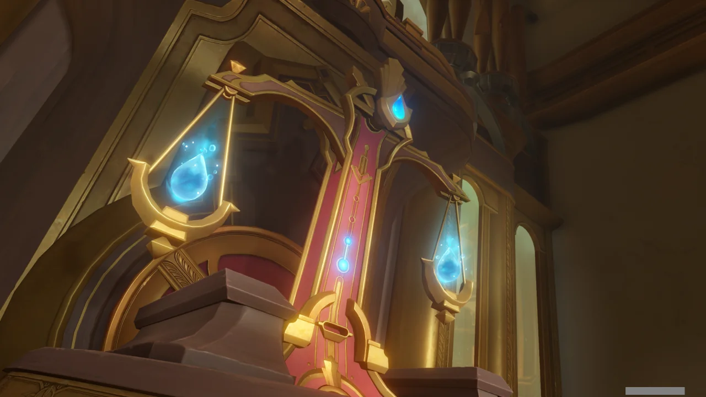

그런 것과는 별개로, 「계시 판결 장치」에 두 번째 불이 들어왔다.



'다음 단계'로 넘어가려는 느비예트를 일단 만류한다.

그 '다음 단계'라는 것은 분명 판결일 텐데, 아직 리니가 결백하다는 주장에 쐐기를 박지 못했으니, 지금 판결을 받는 건 위험한 일이다.





> 리니가 범행 계획을 방해하지 못할 것이라고 예측한 근거는?
> ***
> **리니의 진술**
> (당시 리니가 지하 통로에 없었던 덕에 범인에게는 충분한 시간이 주어졌을 거야)
{.bq}

> 지하 통로에서 충돌이 발생했다는 것을 증명할 방법은?
> ***
> **마술 공연 중 들려온 이상한 소리**
> (그 소리는... 범인과 실종된 할시가 몸싸움할 때 난 건지도 몰라)
{.bq}

> 현재 용의자로 추정되는 사람은?
> ***
> **사망자의 신원 정보**
> (사망자는 코웰, 리니의 조수야. 그러면 소품에 손을 쓸 수 있었겠지...)
{.bq}

> 실종된 할시는 어디로 갔는가
> ***
> **깨진 꽃병**
> (꽃병은 어쩌다 깨진 게 아냐. 중요한 범행 증거인 「물」을 숨기기 위한 거였어!)
{.bq}

응? 물이 범행 증거라고?



여행자의 사고방식을 도저히 따라갈 수가 없다.

할시가 달리 갈 곳이 없다는 건 잘 알겠지만, 왜 갑자기 할시가 물이 되었다고 가정하는데? 물론 할시를 통째로 녹여버렸다면 말이 되긴 하겠지만, 1분이라는 짧은 시간 안에 사람이 녹는는 건 불가능하다.

&nbsp;

이게 다 영화 같은 매체에서 강산성 용액의 효과를 너무 과장되게 표현해서 그렇다.

물론 사람이 강산성 용액에 노출될 경우, 죽을 수 있다. 하지만 죽는 것과 시체가 녹는 것은 별개의 문제다. 초강산을 쓴다고 해도 영화에서처럼 시체가 빠르게 녹아내리지는 않는다.

오히려 사람을 녹일 거라면 강산보다는 강염기를 쓰는 게 더 효과적이다. 염기가 세포를 구성하는 단백질을 계속 녹여나가며 뼈까지 도달할 것이기 때문이다. 다만 강염기가 뼈까지 녹여낼 수 있는지는 잘 모르겠다.

제일 중요한 문제는, 이러한 강산이나 강염기는 보관이 극도로 까다롭다는 것이다. 아무렇게나 마술 도구 사이에 숨겨둘 수 없다.



그 터무니없는 소리를 먼저 한 게 누군데, 이 망할 메스가키 중2병아.

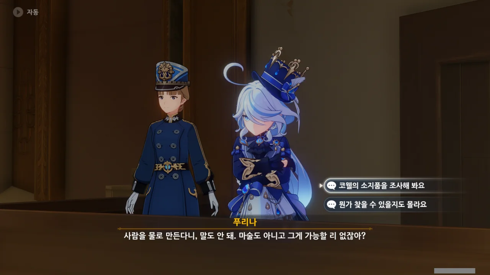

현재 코웰이 가장 유력한 용의자임에는 틀림이 없다. 코웰의 소지품을 검사해 보면 당시 지하 통로에서 무슨 일이 있었는지 알 수 있는 단서가 나올지도 모른다.



> 마술 트릭은 일종의 눈속임이지만

적어도 내 눈에는 맨 처음 리넷이 뚜껑이 잠긴 수조 안에서 물거품이 되어 옷만 남긴 채 탈출한 것이 기적과 같아 보였다만? 아무리 생각해도 수조에서 물 한 방울 쏟지 않은 채 잠긴 수조에서 그 짧은 시간 안에 탈출하는 건 물리적으로 불가능해 보이거든.

게다가 이번 사건의 용의자 --- 리니, 코웰 모두 --- 는 리니 마술단의 일원임을 잘 생각해보아야 한다. 이번 사건에서도 우리가 모르는 다른 마술 트릭을 쓴 것인지 아닌지 어찌 알겠는가?

&nbsp;

푸리나의 삿대질이 묘하게 눈에 거슬린다. 확 마 저걸.





사망자라는 이유만으로 자세한 조사가 이루어지지 않은 코웰을 다시 한번 조사해 본다면 무언가 길이 열릴지도 모른다.

어차피 지금은 양측 모두 주장하는 논리에 구멍이 뚫려있지 않은가?

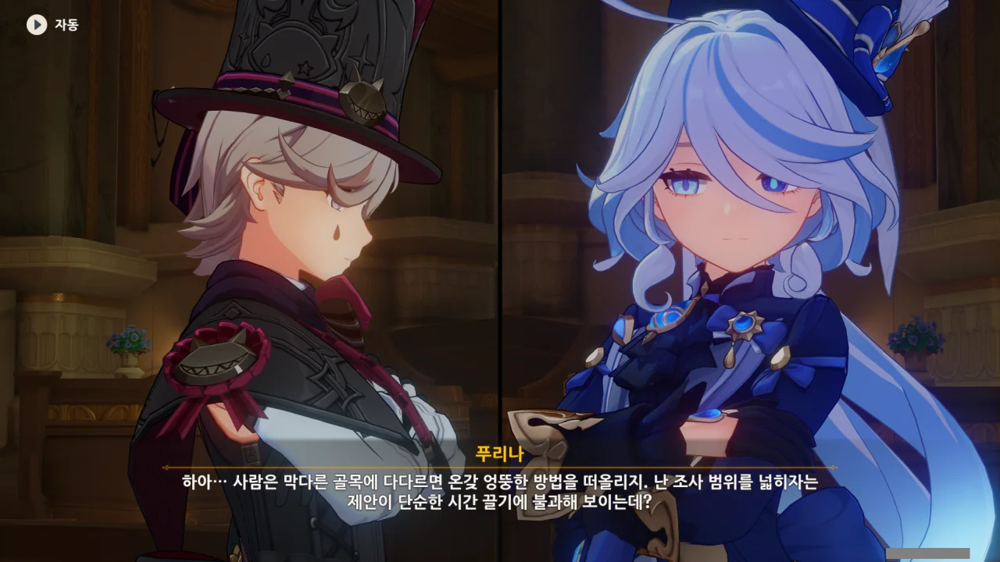

코웰을 조사하면 뭔가가 나올 거라는데 내 손모가지를 건다. 쫄리면 뒈지시던지.



다리를 꼬고 앉아있던 느비예트가 여행자의 요청을 수락한다.

재판장에서 다리를 꼬고 앉아있다니, 보면 볼수록 놀라움이 배가 되는 사람이다.





코웰의 소지품 중 「원시 모태 바다의 물」이라는 액체가 담겨있는 시험관이 여럿 발견되었다고 한다.



같이 발견된 노트에는 코웰이 금지된 약물을 판매하는 조직의 일원이며, 이번 일에 공범이 존재한다는 내용이 적혀있었다.

분명 코웰은 입단한 지 얼마 되지 않았다고 한 것 같은데... 설마 그 조직에서 지금까지 있었던 사건을 리니에게 모두 뒤집어씌우려고 일부러 코웰을 잠입시킨 걸까?





코웰의 노트에 따르면, 「원시 모태 바다의 물」은 폰타인 사람만을 녹일 수 있는 액체라고 한다. 또한 코웰의 소지품 중에서 '에피클레스 오페라 하우스'와 리니의 공연일이 함께 적힌 적힌 빈 시험관도 발견되었다.

그러니까, 할시가 정말로 코웰의 「원시 모태 바다의 물」에 의해 녹아내렸을 가능성이 있다는 것이다.

&nbsp;

이게 뭔... C급 영화에도 이런 설정은 안 나오겠다!



사람이 물에 녹아내릴 수 있다는 말에 자연스럽게 그 예언을 떠올리는 관객들.





나비아는 뭔가를 중얼거리더니, 황급히 어디론가 사라진다.





코웰의 노트 내용이 아직 검증되지 않았지만, 할시가 아직 발견되지 않았다는 점을 들어 코웰의 노트가 증거로 채택된다.



드디어 리니가 결백하다는 주장에 좀 제대로 된 증거가 달라붙었다.



「원시 모태 바다의 물」이라는 액체의 존재를 생각해 볼 때, 어쩌면 여태껏 제대로 활용되지 않았던 증거 역시 활용할 수 있을 것 같다.

> 「원시 모태 바다의 물」
> ***
> 경비대원이 코웰의 소지품에서 찾은 액체. 폰타인 사람을 용해시켜 물로 만들 수 있는 듯하다...
{.bq}





> 현재 용의자로 추정되는 사람은?
> ***
> **사망자의 신원 정보**
> (사망자는 코웰, 리니의 조수야. 그러면 소품에 손을 쓸 수 있었겠지...)
{.bq}

> 범인은 어떤 도구를 사용해서 용해가 발생할 시간을 조작했는가?
> ***
> **바닥에 떨어진 갈고리 끈**
> (지금 보니 그 갈고리는 다른 마술에 사용되는 소품이 아니라, 뭔가의 방아쇠였던 것 같아)
{.bq}

> 범인은 어떤 도구를 사용해서 할시를 용해시켰는가?
> ***
> **「원시 모태 바다의 물」**
> (원시 모태 바다의 물은 할시가 마술 상자 안에 들어가기 전에 이미 준비돼 있었을 거야)
{.bq}

> 범인은 어떤 도구를 사용해서 범행 수법을 은폐하였는가?
> ***
> **관객석 마술 상자의 구조**
> (마술 상자 내부에 다른 뭔가가 있었던 것 같은데...)
{.bq}

관객석 쪽 마술 상자 안에는 풍선이 있었는데... 혹시...?

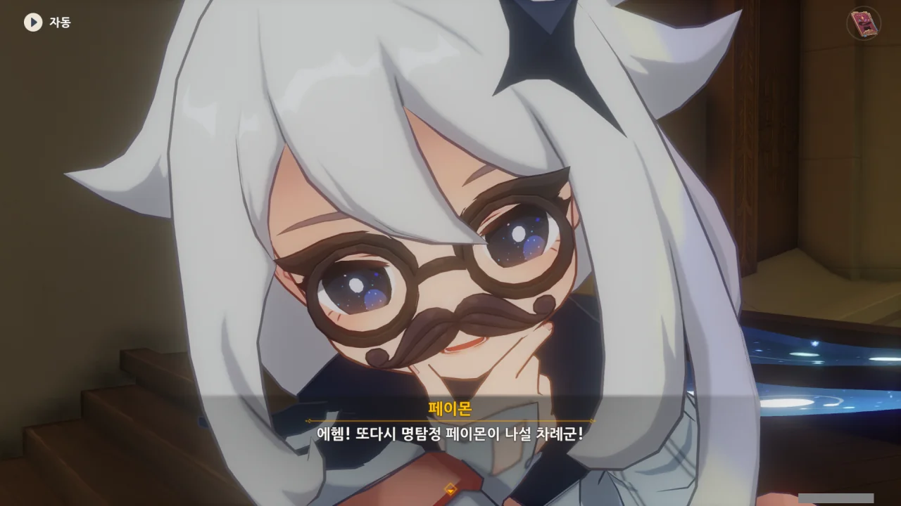

너 아까 탐정 그만둔다고 했지 않았었냐?





> 코웰은 수조의 밧줄과 추첨기에 손을 써서 이번 계획의 대상을 정했을 거야.
> 할시가 있던 마술 상자가 내려갈 때 갈고리가 천천히 돌아오면서 상자 위쪽에 있는 풍선을 터트렸을 테고, 그러면서 풍선 안에 들어있던 「원시 모태 바다의 물」이 아래로 쏟아져 할시를 용해시켰던 거지.
> 그런 다음 코웰은 지하 통로로 가서 꽃병을 깨트리고 물이 꽃병에서 흘러나온 것처럼 꾸몄어. 나머지 증거는 무대 위의 수조로 덮어버리려고 했고.
> 하지만 지하 통로에서 예상치 못한 일을 당한 코웰은 증거를 은폐하기 위해 사용하려던 수조에서 죽고 만 거지.
{.bq}



페이몬의 말을 들은 많은 관객들이 페이몬의 말에 설득되고 있다.

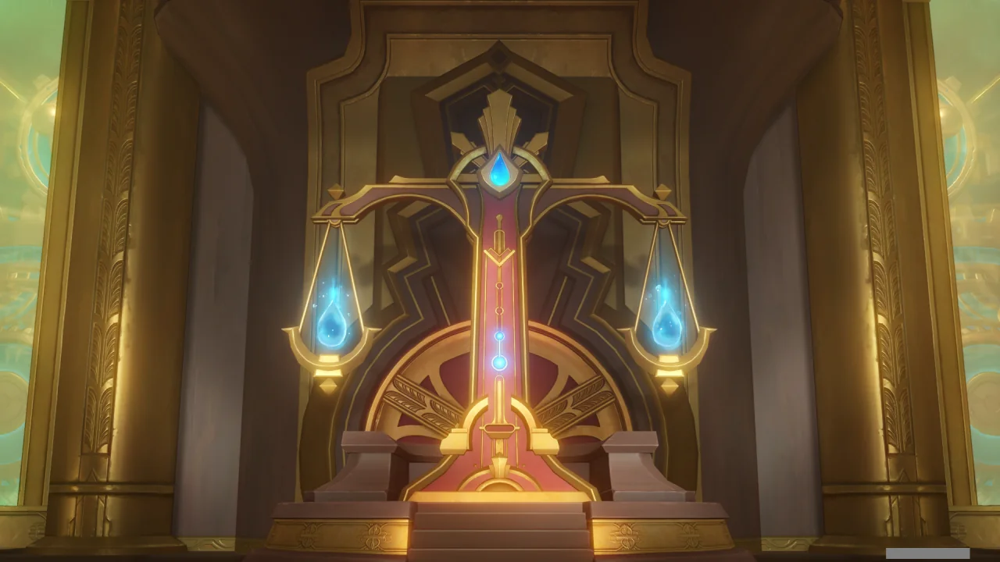

「계시 판결 장치」의 저울이 이제야 수평을 찾았다.



푸리나는 자신이 무고한 사람에게 누명을 씌운 게 아니냐며 몹시 창피해하고 있다.

아, 푸리나의 저 자신만만한 얼굴이 일그러지는 게 매우 보기 좋네.



다만 페이몬의 이야기에 허점이 없는 건 아니다.

대체 코웰은 어쩌다가 지하 통로에서 제대로 탈출하지 못하고 마술 상자 안에서 죽음을 맞이한 걸까?



새로운 증거가 나왔다는 연락이 도착했다.



경비대원이 리니의 소지품에서도 「원시 모태 바다의 물」이 나왔다고 말한다.



아니 이건 또 무슨 개 같은 상황이지? 기껏 일이 잘 풀려나가나 싶었는데!



금세 또 기고만장해져서 우쭐대는 푸리나.

제발. 한 대면 돼. 부탁한다, 제발 한 대만 때리게 해 줘!





아, 또 무슨 헛짓거리를 하려고... 그만해, 이것아!

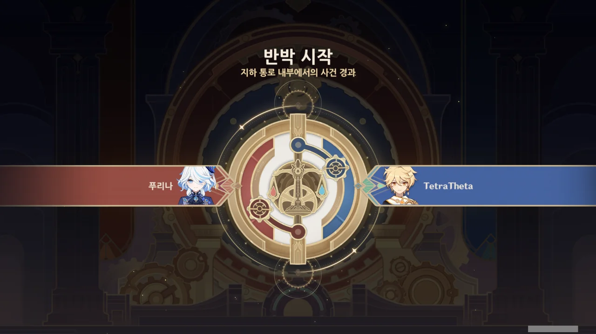

푸리나와의 2차전이 시작되었다. 정말 싫다...





> 애초부터 소녀를 용해시키는 일에 동참할 필요가 없었던 리니는 지하 통로로 들어간 다음 환풍구를 통해 빠져나갔어.
> 그때 공범인 코웰은 마술 소품에 손을 써서 「원시 모태 바다의 물」로 이미 할시를 녹여 없앤 상태였지.
> 하지만 되돌아온 리니는 공로를 독차지하고픈 탐심이 생겼고... 파트너를 제거하려고 했어.
> 결국 리니는 코웰을 기절시켰고, 흔적을 숨기기 위한 수단이었던 수조는 범행 도구로 변모한 거야.
> 이렇게 잔혹하고 노골적인 결론을 내리고 싶지는 않지만, 우인단은 참 잔인무도한 조직인 것 같네.
{.bq}

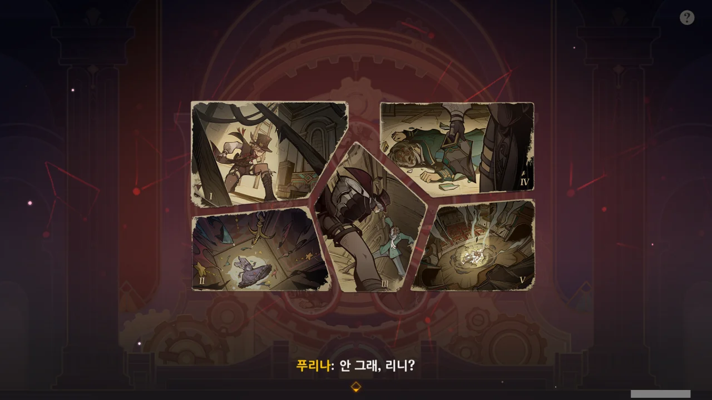

그래, 내가 다른 건 몰라도, 즉석에서 그럴듯한 이야기를 지어내는 푸리나의 능력 하나는 칭찬해야겠네.

그러니까 한 대만 때리면 안 될까?



리니의 소지품에서도 「원시 모태 바다의 물」이 발견된 이상, 「원시 모태 바다의 물」을 이용해 리니의 결백을 증명할 수 없다.



게다가 사건 관계자의 소지품을 검사해 달라고 한 게 여행자였으니, 더 할 말도 없고 말이다.



「계시 판결 장치」 역시 푸리나 쪽으로 크게 기울었으며, 점도 하나 더 찍혔다.



푸리나가 느비예트에게 판결을 재촉하는데, 아까 어디론가 사라졌던 나비아가 다시 되돌아와 잠깐 재판을 멈추어달라고 한다.



응? 사라져 버린 소녀를 다시 나타나게 할 마술이라고? 그게 가능한 거야?



하지만 녹아버린 사람을 어떻게 리니가 다시 원래대로 되돌린단 말인가?



> 마술사는 남을 현혹하는 게 특기 아니야? 모두가 허상을 진실이라 믿는다면, 마술이 진정한 진상을 밝혀낼 수 있지 않을까?

나비아의 말은 모두가 뭔갈 단단히 잘못 알고 있다는 뜻으로 보이는데... 대체 우리가 어디서 뭘 놓친 거지?

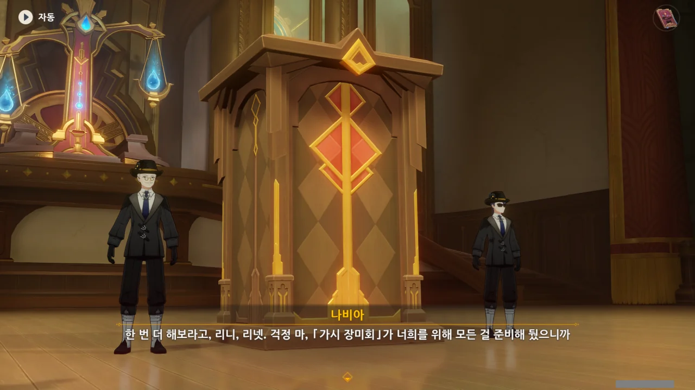

무대 위에 아까 관객석 중앙 통로에 설치되어 있던 마술 상자가 한번 더 설치되었다.

저 무거워 보이는 상자를 실버와 마르시악 단 둘이 옮겼다고? 둘 모두 힘이 대단하네...





나비아의 말에 리니와 리넷이 「마술」을 펼쳐 보인다.

내가 여태껏 본 마술 중에서 제일 힘없어 보이는 마술일 거야, 이게...



상자에서 나온 것은 여태껏 「원시 모태 바다의 물」에 의해 녹아내렸다고 여겨지던 할시였다.

아니 왜 네가 거기서 나와요? 이게 무슨 귀신이 곡할 노릇이지?

당연히 모두가 놀랐다.

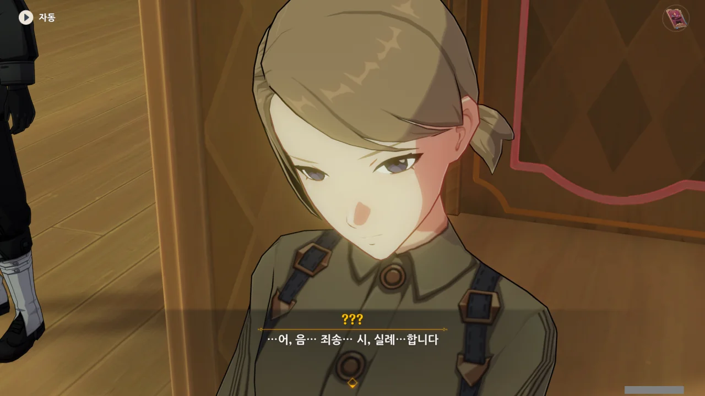

왜 할시의 이름이 '???'인 거지? 설마 이 사람은 진짜 할시가 아니라, 나비아가 데려온 대역인 건가? 하지만 오페라 하우스는 봉쇄되었을 텐데?

NPC의 얼굴이 죄다 거기서 거기인 지라, 이게 할시인지 아닌지 도통 알 수가 없다.

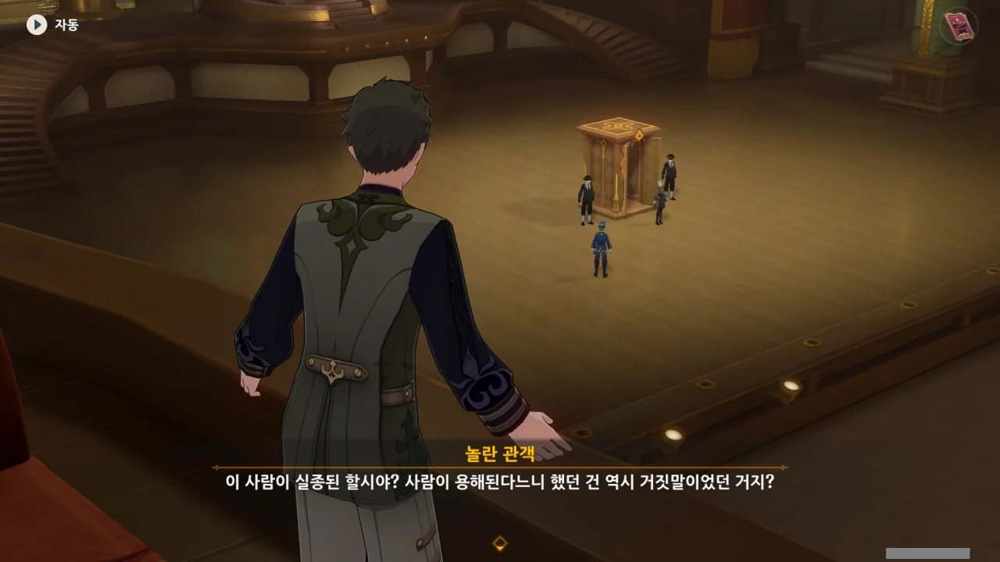

이 사람은 생각이 너무 멀리 갔다. 이게 다 짜고 치는 고스톱이었으면 코웰이 죽은 것 자체가 말이 안 되잖아.





나비아가 얌전히 법정에 출석하면 형량을 줄일 수 있다고 해서 이곳에 온 할시(?).

이 재판이 자신에 대한 재판인 줄로 알고 두려워하며 문 밖에 몰래 숨어 재판 내용을 엿듣고 있다가 나비아에게 붙잡혔다고 한다.

코웰을 죽인 건 바로 자신이라고 고백하는 할시(?).

응? 이건 또 무슨 소리야?



줄곧 리니가 코웰을 죽였다고 주장해 온 푸리나가 화들짝 놀란다. 

만약 저 말이 사실이라면, 푸리나가 여태껏 해온 주장 자체가 무너지게 되니 말이다.

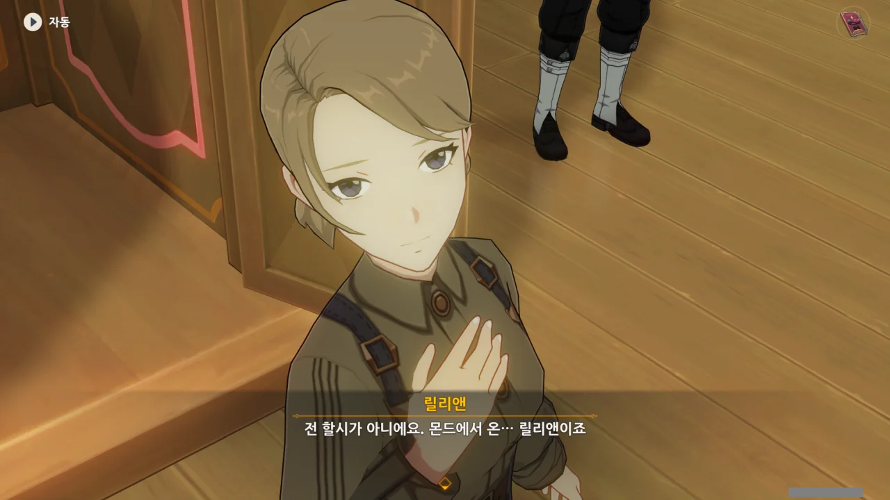

할시(?)가 자신은 폰타인의 할시가 아니라, 몬드의 릴리앤이라고 밝힌다.





여태껏 밥 먹듯 남의 물건을 훔쳐왔지만, 단 한 번도 잡힌 적이 없던 릴리앤은 리니의 마술 공연이 굉장하다는 이야길 듣고 공연 표를 사려했으나, 타이밍을 놓쳐 표를 사지 못했다. 그래서 릴리앤은 진짜 할시의 표를 몰래 훔쳐, 할시 행세를 하며 극장에 들어왔다.

폰타인에 처음 왔을 때, 여행자와 리니가 놓쳤던 소매치기의 정체 역시 릴리앤이었다고 한다. 아, 그게 너였어?





그렇게 잘 넘어가나 싶었는데, 이번엔 코웰이 조작한 추첨기가 할시로 가장한 릴리앤을 가리켰다.

리니가 마술 도중 '마술이 중단되면 「메로피드 요새」로 보내질지도 모른다'라고 하자, 릴리앤은 리니가 이전에 만난 자신을 알아보고 잡으려는 줄 알고 탈출을 계획했다.

마술 상자 안에서 뜬금없이 「원시 모태 바다의 물」을 뒤집어썼지만, 릴리앤은 폰타인 사람이 아니었기 때문에 녹아내리지 않았다.

아직 녹지 않은 릴리앤을 발견한 코웰은 릴리앤을 붙잡으려 했지만, 되려 릴리앤에게 기절당한 후, 마술 상자 안에 쑤셔 넣어졌다. 이후 코웰은 위에서 떨어진 수조에 의해 사망했다.



옷을 갈아입은 릴리앤은 공연 의상을 두는 상자 안에 계속 숨어있었다고 한다.

아까 지하 통로를 조사할 때, 상자를 조사하자 '상자 안에 마술 도구와 공연 의상이 마구잡이로 뒤섞여있다'라고 나왔었는데, 그게 복선이었던 셈이다. 아니 근데 그 상자, 아무리 봐도 끈으로 잘 묶여 있었는데?

이후, 릴리앤은 첫 번째 경비대원이 현장에 도착했을 때 몰래 빠져나와 오페라 하우스 안에 숨었다고 한다.

아니, 이게 무슨 메탈 기어 솔리드도 아니고...

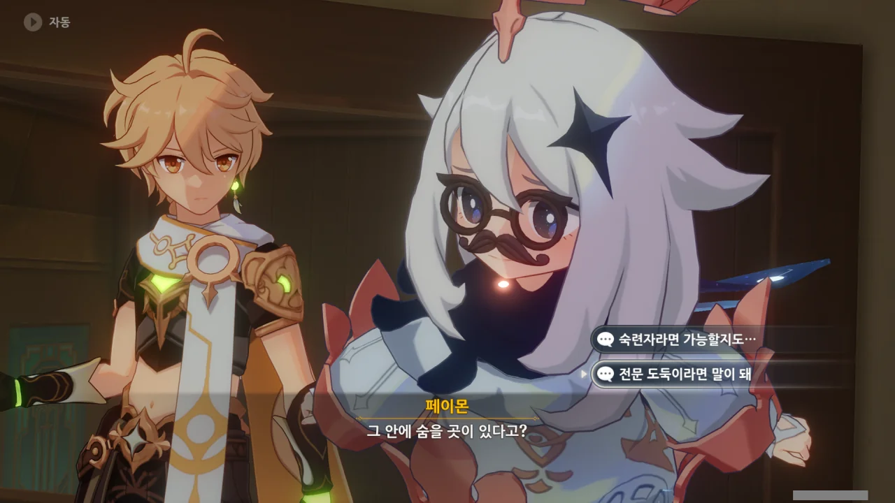

잘 숨으면 되긴 하더라.



맹세코 코웰을 죽일 의도는 전혀 없었다고 말하는 릴리앤. 단순 폭행과 살인은 그 죄가 큰 차이가 나니, 저렇게 말하는 것도 이해가 된다.

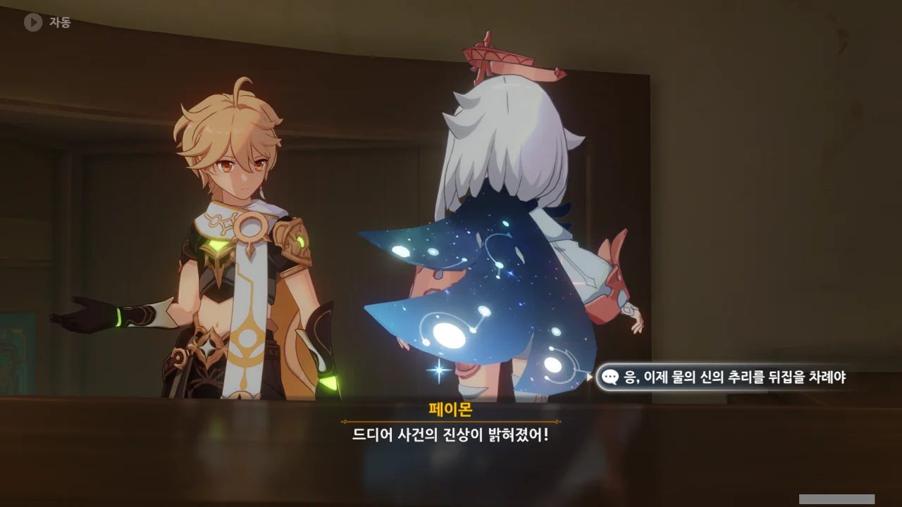

딱 대, 푸리나. 넌 이제 죽었다. 쪽팔려 죽을 준비는 다 했겠지?



재판이 시작된 후, 처음으로 제대로 된 역공을 해보네.

여태껏 실종되었다고 여겨진 소녀가 멀쩡하게 다시 나타났으니, 이제 푸리나는 옴짝달싹도 못한다.



'할시가 「원시 모태 바다의 물」에 의해 용해되었다'는 주장은 '마술 공연 중 들려온 쿵 소리는 릴리앤이 마술 상자에서 뛰쳐나오는 소리였다'는 사실로 반박한다.



'리니와 코웰이 내분을 일으켰다'는 주장은 '꽃병이 코웰과 릴리앤의 몸싸움 도중 사고로 깨져 안의 물이 쏟아졌다'는 사실로 반박한다.



이후의 주장 역시 '이 모습 그대로 나갔다간 들킬 것이라 생각한 릴리앤이 입고 있던 옷을 바닥에 버리고 공연 의상으로 갈아입었다'는 사실로 반박한다.







> 추첨기에 선택된 릴리앤은 무척 당황했어.
> 지하 통로로 들어갔다가 물을 맞은 릴리앤은 패닉에 빠졌고, 문을 차서 우리가 들은 그 큰 소리를 냈지.
> 이때 소리를 들은 코웰이 지하 통로로 들어왔고, 용해되지 않은 릴리앤을 발견한 거야.
> 하지만 코웰은 릴리앤이 폰타인 사람이 아니라 표를 훔쳐서 들어온 도둑이라는 걸 몰랐어.
> 그래서 코웰은 「원시 모태 바다의 물」이 효력을 발휘하기까지 시간이 걸리는 줄 알고 릴리앤을 억지로 상자에 넣으려고 한 거야.
> 그렇게 둘이 싸우는 과정에서 꽃병이 깨졌고, 코웰은 역으로 릴리앤에게 맞아 기절하고는 상자 안에 넣어진 거지.
> 도망갈 곳이 없었던 릴리앤은 옷을 갈아입고 상자 안에 숨어서 공연이 끝나기를 기다렸어.
{.bq}

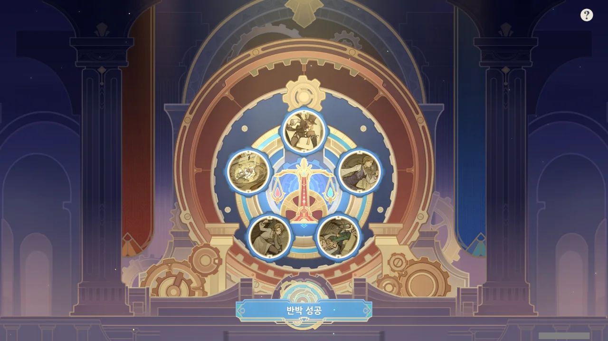

반박 성공!



오페라 하우스를 빠져나가기 위해선 반드시 경비대의 신원 조사를 받아야 했기 때문에, 릴리앤은 오페라 하우스를 벗어나지 못하고 갇혀 있었다. 배가 고파진 릴리앤은 여행자 일행이 마카롱을 먹으며 대화를 할 때 몰래 마카롱을 두 개 훔쳐 먹었다.

그 많은 사람이 앉아있는 와중에도 아무도 눈치채지 못하게 마카롱 두 개를 훔쳐갈 수 있다니, 릴리앤도 어쩌면 리니 못지않은 '마술사'일지도 모른다.





많은 관객들이 페이몬의 말에 동감한다. 「계시 판결 장치」의 저울도 단숨에 여행자 쪽으로 확 기울었다.



얼레리꼴레리~ 확실한 근거도 없이 리니를 범인으로 몰아세웠다가 개쪽만 당하게 생겼대요~

확실하지 않으면 승부를 걸지 말라, 이런 거 안 배웠어?





그 와중에 푸리나는 재판장을 몰래 빠져나가는 추태를 부리려다, 느비예트에 의해 "고발 측은 퇴정 할 수 없습니다"라는 말과 함께 제지당했다.

자신의 속마음을 전부 들킨 푸리나는 "이럴 땐 물어보지 말고 체면 좀 살려달란 말이야"라며 칭얼댄다.

'메스가키는 참 교육을 당한다'는 불문율에 가까운 클리셰라고 할 수 있다. 메스가키 푸리나가 재판장에서 잔뜩 창피를 당하는 참 교육을 당하게 되니, 매우 속이 시원하다. 십 년 묵은 체증이 싹 내려가는 느낌이야!

푸리나가 바람 빠진 풍선이 되었는지 아닌지보다, 그 건방지던 푸리나가 이 많은 사람들 앞에서 수모를 당하는 것이 너무 행복하다.

푸리나~ 난 네가 밥맛이야~

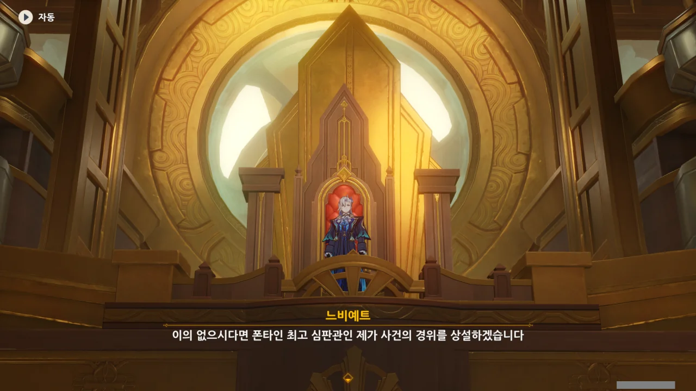

느비예트가 최고 심판관으로써 사건의 경위를 설명한다.









> 소녀 실종 사건의 범인인 코웰은 관객 목록에서 범행 대상을 물색했습니다.
> 추첨기에 미리 손을 써두기만 하면 정해둔 대상을 추첨할 수 있었죠.
범행 흔적을 덮기 위해, 코웰은 수조를 떨어트려 용해된 소녀가 남긴 물을 감출 계획을 세웠습니다.
> 그래서 수조를 고정한 밧줄에 미리 손을 쓰고, 공연이 끝날 때 터지는 폭죽을 활용해 수조를 떨어트려 물의 흔적을 감추려고 했죠.
> 소녀를 용해하는 「원시 모태 바다의 물」은 마술 상자를 준비할 때 풍선 안에 넣어 상자의 상판에 붙여뒀습니다.
> 마지막으로 코웰은 소녀를 마술 상자 안에 넣으며, 미리 준비해 둔 갈고리를 끈에 묶어 문틈 사이로 통과시켰습니다.
> 공연이 시작되고 소녀가 든 마술 상자가 지하로 빠지자, 갈고리 끈이 팽팽해지면서 「원시 모태 바다의 물」이 담긴 풍선을 터트렸습니다.
> 계획대로라면 소녀는 이때 물에 용해됐어야 하지만, 릴리앤은 폰타인 사람이 아니었기에 상자를 빠져나오면서 큰 소리를 냈죠.
> 이상한 낌새를 느낀 코웰은 지하 통로로 들어왔고 릴리앤과 조우했습니다. 「원시 모태 바다의 물」이 즉시 효력을 발휘하지 못한 것뿐이라 착각한 그는 계획을 이어나갔습니다.
> 하지만 상대는 호락호락하지 않았고, 몸싸움 끝에 마술 상자 안에 들어간 코웰은 결국 피해자가 되었습니다.
> 릴리앤은 본인의 진술처럼 지하 통로에서 옷을 갈아입고 공연이 끝날 때까지 숨어있다가 오페라 하우스의 다른 구역으로 이동했습니다.
> 한편 리니는 사건이 발생하는 동안 오페라 하우스 지하에 있었기 때문에 이 일을 모르고 있었죠.
{.bq}





느비예트가 이번 사건에서 리니는 무죄로 보인다고 판단했다. 물론, 리니와 리넷이 「계시 판결 장치」 지하로 들어간 죄에 대해선 따로 물을 예정이라 한다.

「계시 판결 장치」에 경비대원이 카드 비슷한 것을 넣는다.





느비예트 앞으로 카드가 튀어나온다. 아무래도 「계시 판결 장치」의 최종 판결이 담긴 카드인가 보다.



드디어 리니와 리넷이 무죄를 선고받았다. 야호! 드디어!
