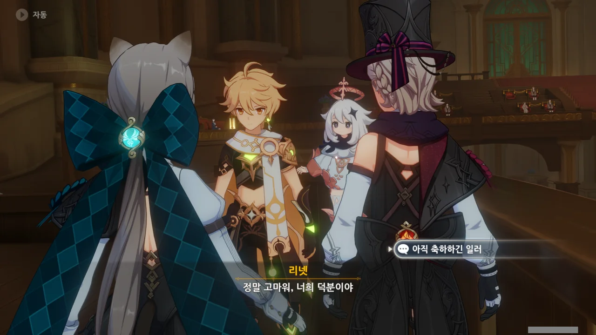
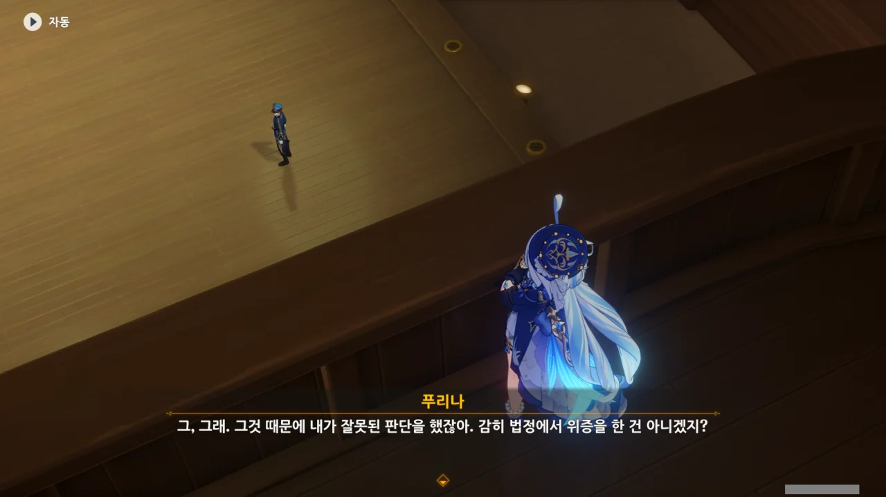
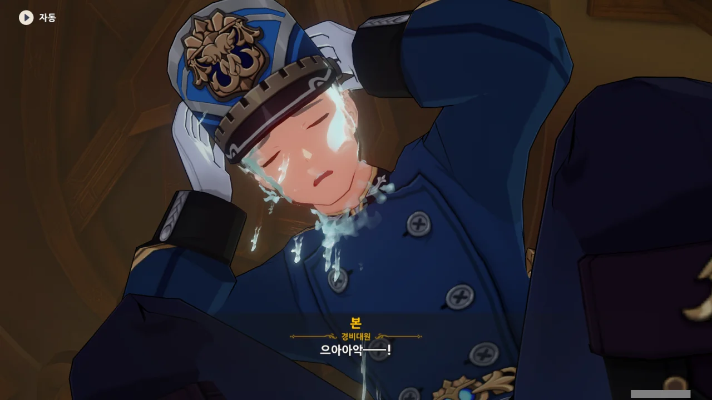
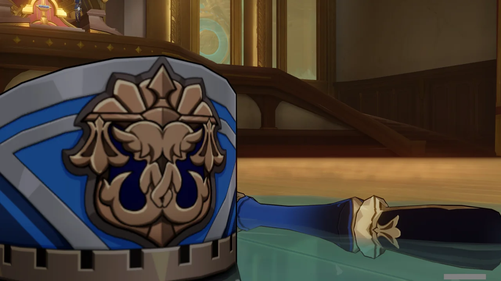
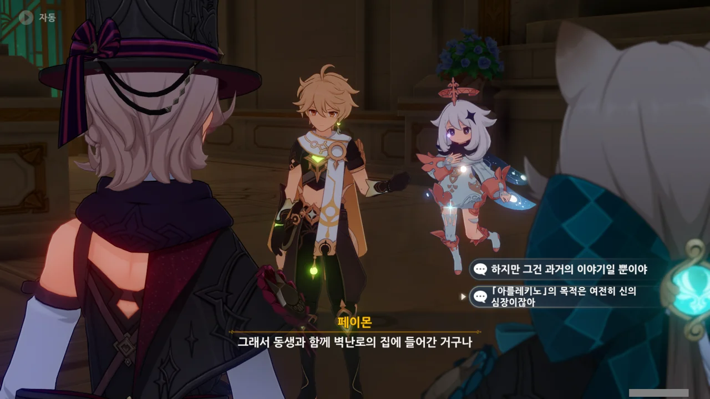
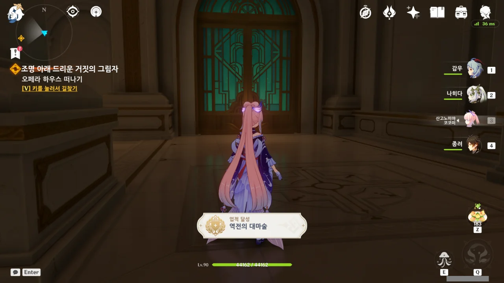

리니와 리넷이 무죄 판결을 받긴 했지만, 아직 풀리지 않은 의문점이 하나 남아있다.



바로 본 경관이 리니의 소지품에서 찾아낸 「원시 모태 바다의 물」이다.

다른 증거와 달리, 본 경관이 찾아낸 「원시 모태 바다의 물」은 직접적으로 리니가 범인이라고 말하고 있어, 일관성이 없다.

설마 본 경관이 증거를 위조한 걸까?

본 경관의 위증 때문에 푸리나가 잘못한 판단을 한 건 맞지만, 제일 먼저 리니를 범인으로 몰고 간 게 과연 누구였더라?

푸하다, 추리나야!



아무리 봐도, 코웰의 노트에 적힌 '공범'은 바로 본 경관인 것 같다.

코웰은 「원시 모태 바다의 물」을 판매하는 조직의 일원이었으니, 분명 이 일을 지시한 사람이 조직 상부에 있을 것이다. 만약 그렇다면, 그 사람은 굉장히 머리를 잘 썼다고 봐야겠지.

이들이 세운 계획은, 적당히 조작된 증거를 통해 리니와 우인단을 「소녀 연쇄 실종 사건」의 범인으로 몰아가되, 만약 리니가 혐의를 벗을 것 같다면, 본 경관이 증거를 조작해 리니를 범인으로 만드는 계획이었을 것이다.



> | | |
> |:--|:--|
> | 느비예트 | 형량을 줄이고 싶다면 바른대로 말하세요. |
> | 푸리나 | 평생 「특별 허가 쿠폰」과 함께 하고 싶지 않다면 당장 바른대로 말해! |
> {_borderless=true,_thead=false}

대체 그 「특별 허가 쿠폰」이 뭐길래? 푸리나는 대체 뭘 만든 거야? 보통 특혜나 이익의 의미를 내포하는 '쿠폰'이 처벌의 뜻으로 보이는 건 또 처음이다.



역시 내 짐작이 맞았다. 「소녀 연쇄 실종 사건」을 꾸민 조직의 끄나풀이었던 본 경관은 상부로부터, 리니가 속한 우인단에게 모든 의심을 돌리라는 명령을 받았다고 한다.



이 사건과 관련한 조직의 모든 계획은 이미 수포로 돌아갔고, 조직이 폰타인 사람을 녹일 수 있는 「원시 모태 바다의 물」을 몰래 유통하고 있다는 사실마저 수사망에 걸렸으니, 조직의 미래는 그리 밝지 않다.

이번에 일을 제대로 망친 본을 조직이 본보기로 제거하려 들 것은 자명한 사실. 그러니 본에게는 조용히 감옥 독방에서 썩는 것이 그나마 목숨을 부지할 방법일 것이다.





「원시 모태 바다의 물」은 폰타인 사람을 녹일 수 있지만, 매우 묽게 희석해서 마시면 굉장히 기분이 좋아진다고 한다. "평생 못 잊을 만큼"이라고 하는 걸 보면, 매우 강력한 마약 같은 효과를 주는 모양이다.

다만 내가 지금 이해할 수 없는 것이 하나 있다. 그 조직이 「원시 모태 바다의 물」 희석액으로 큰돈을 벌었다는 건 이해할 수 있다. 당장 마약도 그런 식으로 굴러가니까.

하지만 대체 왜 그 조직이 「소녀 연쇄 실종 사건」을 꾸민 건지 도저히 이해할 수 없다. 대체 소녀를 녹여서 어디다 써먹으려 한 거지? 설마 「원시 모태 바다의 물」을 만들려면 소녀를 녹여야 하는 거야?

그리고... 본 너는 왜 말을 하다가 말고 갑자기 말을 더듬냐?

본이 갑자기 제자리에 주저앉아 머리를 부여잡더니, 본의 얼굴이 물이 되어 뚝뚝 떨어진다.

저 뚝뚝 떨어지는 게 투명한 물이어서 망정이지, 새빨간 핏물이었으면... 어우...



눈앞에서 사람이 물이 되어 녹아내리자, 그 모습을 본 모두가 화들짝 놀란다.

「원시 모태 바다의 물」이 사람을 녹인다는 걸 안 믿을까 봐, 직접 이렇게 보여주네.

본이 모두 녹고 남은 건, 본이 입고 있던 옷과 모자밖에 없었다.



이야, 살인멸구라니. 우인단이나 할법한 발상 아니냐?



당연한 말이지만, 현장에 있던 모든 사람들이 추가로 조사를 받게 되었다. 별 소득은 없었지만.



아, 이제 빨리 여길 나가서 이 마신 임무를 끝내고 싶어!

이미 오전 12시를 훌쩍 넘긴 시각이지만, 마신 임무가 도통 끝날 생각을 하지 않아, '대체 이 임무는 언제 끝나는 거야?'라는 생각 하나만으로 사진을 찍고 있다.



리니가 여행자를 다급히 부르지만, 이미 리니와 리넷에게 정나미가 떨어질 대로 떨어진 여행자는 돌아보지 않는다.



지금까지 우인단과 여행자가 얼마나 많이 부딪쳐 왔던가. 아마 여행자에게 있어 우인단은 불구대천의 원수 정도일 것이다. 그야, 단순히 여행자에게 한 짓을 제외하더라도, 선을 넘는 짓을 너무 많이 했으니까.

그럼에도 여행자가 리니와 리넷을 구한 건, 자신이 하지도 않은 일로 억울하게 벌 받는 것 역시 옳지 않다고 생각해서이다.



리니와 리넷이 「벽난로의 집」 소속인 것에 대해선 별 생각이 없다. 그곳에 있고 싶다면 있을 수 있지. 그건 개인의 자유니까.

하지만 리니와 리넷이라면 이미 알고 있을 것이다. 어떤 조직에 속한다는 건, 그 조직의 이미지가 긍정적이던 부정적이던 모두 등에 짊어지고 가는 것과 다름이 없다는 걸 말이다. 때로는 그 이미지가 너무 커, 자신의 본모습을 가릴지도 모르지만 말이다.



리니가 '아를레키노'를 「아버지」라고 부르는 걸 보면, 정말 「벽난로의 집」 원장이 「아버지」라고 불리나 보다.







부모님이 돌아가신 후, 거리를 떠돌던 리니와 리넷은 다른 마술사의 마술 트릭을 알아낸 후, 다른 골목에서 마술 공연을 시작했다고 한다. 마술 공연 덕분에 배를 곯지는 않았지만, 동생을 계속 이렇게 거리에서 재우고 싶어 하지 않았던 리니는 자신들을 양자로 삼으려는 귀족의 제안을 수락하였다.





하지만 그 귀족이 리니와 리넷을 양자로 들인 데에는 다른 속셈이 있었다.

리니와 리넷의 '새아버지'는 둘을 이런저런 연회에 데려가 마치 광대처럼 사람들의 이목을 끄게 만든 후, 그걸 자신의 사교계에서의 입지를 다지는데 썼다.





그러던 어느 날, 리넷이 자신과 같은 마차에 타지 않았음을 알게 된 리니. 리니가 리넷의 행방을 묻자, '새아버지'는 리넷을 다른 거물 귀족에게 선물로 주었다며, 조수 하나 바뀌어도 마술을 계속할 수 있지 않느냐고 말했다.

리니가 저 말을 할 때, 리넷이 머리를 짚은 걸 볼 때, 그 귀족이 절대 리넷의 마술을 보기 위해 리넷을 데려간 게 아님을 짐작할 수 있다. 그럼 뭐겠나? 결론은 하나겠지, 뭐.



인신매매나 다름없는 짓이었지만, 귀족들은 폰타인의 법에 저촉되지 않도록 이 모든 걸 '입양'과 '대리 양육'으로 꾸몄다.

그 정도면 하루이틀 인신매매를 한 게 아니었겠지.





리니는 리넷을 구출하기 위해 리넷을 데려간 거물 귀족의 저택 위치를 알아낸 후, 밤에 몰래 찾아갔다. 거기서 리니는 먼저 도착한 '아를레키노'가 그 거물 귀족을 살해한 장면을 목격했다.

그 귀족은 인신매매를 한두 번 한 게 아니었는지, 저택 지하실에 다른 고아 여자애들도 있었다고 한다.



리니에게서 뭔갈 본 건지, '아를레키노'는 리니와 리넷을 「벽난로의 집」으로 데려갔다.

> 이곳은 절대 널 배신하지 않을 것이며, 그 어떤 배신도 용납되지 않을 것이다.

저 말을 한 걸 보아, 절대 좋은 의도로 한 건 아니었을 것이다. 아마 다른 고아들처럼, 우인단의 간첩으로 키울 생각이었겠지.



얼마 지나지 않아, 리니와 리넷을 '입양'한 '새아버지' 귀족 역시 아를레키노에 의해 제거되었다.

그래. 리니와 리넷의 이야기는 잘 들었다.

하지만 지금 중요한 건 '아를레키노', 아니 그녀가 속한 우인단과 그 주인인 스네즈나야의 여왕의 목적이지. 스네즈나야의 여왕은 다른 신들의 심장을 원하고 있으니, '아를레키노' 역시 푸리나의 신의 심장을 원한다고 봐야 할 것이다.







'아를레키노'는 폰타인 신의 심장을 빼앗은 후, 그걸 이용해 폰타인에 널리 퍼진 예언에 정면으로 대항하여 폰타인을 구하려 하고 있으며, 그걸 위해 스네즈나야 여왕의 허가까지 얻었다고 리니가 말한다.

솔직히 말해, 그걸 누가 믿겠나?

「원시 모태 바다의 물」의 존재를 알게 된 우인단이 이를 이용하기 위해 가짜 예언을 만들어 퍼트린 거라면? 「벽난로의 집」의 고아들이 적극적으로 행동하게 만들기 위해, '우리는 예언을 막기 위해 움직이는 거다'라고 믿게 만든 거라면?

우인단과 관련한 일은 곧이곧대로 믿어선 안된다.





여행자는 "이만 가볼게"라는 말만 남기고, 다시 뒤돌아 걸어 나간다.

페이몬은 여행자처럼 차갑게 굴 수는 없었던 건지, 안녕이라고 작별 인사를 한다.

아, 이제 이 오페라 하우스를 나가면 마신 임무도 끝이겠지?



오페라 하우스를 나서려는 여행자를 나비아가 급하게 찾는다.



나비아는 '우리'가 「소녀 연쇄 실종 사건」의 진상에 더 가까워졌다고 말한다. 아무래도 여행자가 계속 「소녀 연쇄 실종 사건」을 파고들 줄 알았나 보다.

하지만 처음 만났을 때 합의한 대로, 여행자는 리니와 리넷이 쓴 누명을 벗기고 싶어 협력한 것뿐이었다.

그리고 이젠 진짜 쉬고 싶어... 정말로...



게다가 이번 사건을 통해 수사 기관이 위험한 「원시 모태 바다의 물」을 유통하는 조직이 있음을 알게 되었으니, 수사 기관에 맡기는 것이 더 좋을지도 모른다. 여행자와 나비아 둘이 조사하는 것보다, 사람이 훨씬 많은 수사 기관이 조사하는 게 더 효율적이지 않겠는가.

게다가 여행자가 「소녀 연쇄 실종 사건」을 해결하면, 폰타인의 수사 기관은 무능 그 자체라는 말밖에 더 되지 않겠는가.

뭐, 말은 이렇게 했지만, 분명 여행자가 「소녀 연쇄 실종 사건」까지 해결할 것이다.







재판 하나 하는데 너무 시간이 오래 걸려서일까, 난 얼른 이 마신 임무를 끝내고 싶다.

여행자 역시 여동생의 행방을 찾아 폰타인에 온 것일 뿐이니, 「소녀 연쇄 실종 사건」 같은, 여행자와 별 상관없는 일에는 신경을 끄고 싶어 할 게 분명하다.





모든 아름다운 기억에 후회 없이 제대로 마침표를 찍고 싶다며, 해산 기념 식사를 제안하는 나비아.



마카롱을 직접, 그것도 맛있게 만드는 나비아이니, 분명 나비아가 엄선한 식당 역시 그 음식의 맛이 훌륭할 게 분명하다.



「흰 이슬과 검은 물결의 서시」 드디어 끝!

다음 이야기인 2막이 있다는 것 정도는 알고 있지만, 2막은 다음에 할 생각이다. 정말 지쳤거든.
