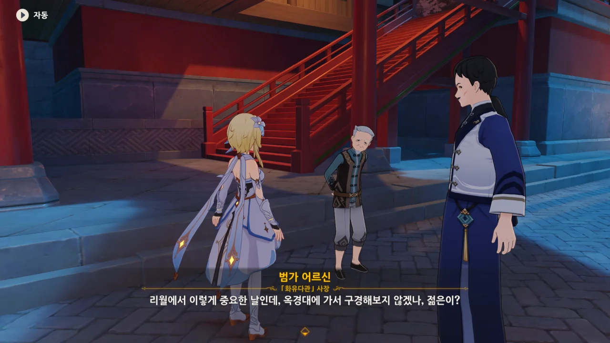

사실 이미 한 번 봤던 이야기지만, 기왕 다시 하는 것, 이번에는 기록을 남기기로 했다.



정말 공교롭게도, 몬드에서의 일이 어느 정도 마무리되자, 「칠성 청신의례」의 때가 다가왔다.

이날에는 바위의 신이 리월에 내려오기 때문에, 그를 만나 여행자 오빠의 행방을 물어볼 수 있을 것이다.



> 음... 오늘 아니면 내일 아닐까...

분명, 페이몬이 처음 자기 역할을 소개할 때 '티바트 가이드'라고 하지 않았나?

「칠성 청신의례」가 언제 시작하는지 잘 모르겠으니까, 현지인에게 물어보자고 한다.





리월에서 바위의 신을 마신명인 '모락스'로 부르면 무례하게 보일 테니, 여기 사람들이 부르는 것처럼 '암왕제군'이라고 부르라는 페이몬.



와, 하루만 늦었어도 꼬박 일 년을 기다려야 했단 거야? 이 정도의 우연은 필연이라고 해야 할 것 같은데...

지금까지 「청신의례」는 단순히 '바위의 신에게서 일 년 동안 리월을 운영할 방향을 지시받는 것' 뿐이라 생각했는데, 매년 다른 리월칠성이 바위의 신에게 말씀을 청하는 것으로 보인다.

작년엔 「옥형성」 각청이 청신의례를 맡았다고 한다.



「리월칠성」은 리월의 일곱 개 상업 세력을 대표하는 7명의 상인이라고 한다.

난 리월칠성을 단순히 행정 위원회라고 생각하고 있었는데... 그야, 상인의 모습을 보여준 건 응광밖에 없었고 나머진 전부 행정가의 면모만 보여주었지 않은가.



리월칠성이 리월의 실질적 권력자라고 소개한 페이몬의 말이 마음에 몹시 들지 않았는지, 임랑이 약간 화난 듯한 목소리로 페이몬의 설명에 반박한다.

임랑이 말하길, 리월 사람들에게 있어, 리월의 권력자는 암왕제군 뿐이라고 한다.

&nbsp;

페이몬... 설명도 하나 제대로 못 하는 거야?



이야, 이 사람 뒤끝 쩌네.

> 「신이 존재하지 않는 도시국가」에서 왔으니, 이제 리월에서 「신과 함께 하는 역사」를 체험해 보라구.

이게 마치 '안타깝게도 너희 몬드에는 신이 없지만, 우린 있지'라고 말하는 것처럼 들리더라.



정말 대단한 애국자 납셨네. 바위의 신을 아버지처럼 생각한다.

그냥 처음 만난 사람이 운 없게도 지독한 광신도였다고 생각하자.



청신의례라는 것이 전리월인에게 인기가 매우 높은 행사인 줄 알았는데, 덕안공처럼 별 관심 없어 하는 사람도 있는 것 같다.





> 「현지인은 관광지에 안 간다」고 하잖아...

아, 현지인에게 있어 청신의례는 단순한 행사로만 비치나 보다.



그 '큰일', 이번 청신의례에서 생길 예정이다.



장사하는 사람에겐 청신의례가 리월의 상업 동향에 대해 알 수 있는 좋은 창구로 여겨지나 보다.



작년에는 암왕제군의 17가지 말씀 때문에 시장이 요동치기까지 했다고 한다.

게다가 이번에 「천권성」 응광이 신의 눈 사용자가 생성한 바위를 과세 대상에서 제외하려고 한다고 한다.

리월칠성이 청신의례를 맡는 건, 단순히 신의 방문을 청하는 것이 아니라, 신에게 건의하기 위함도 있나 보네.



모락스가 일곱 집정관 중 제일 오래된 집정관이라고 한다.

내가 알기로, 모락스와 바르바토스는 서로 친구 관계였던 거로 아는데... 그러면 2,600년 전 데카라비안이 몬드를 다스릴 때도 여전히 리월을 다스리고 있었단 건가?

이야, 그럼, 모락스가 최소 2,600년 동안 매년 리월에 내려와 그해 동안의 리월 운영 방향을 제시했다는 거 아냐. 엄청 성실한데?





박래가 '큰돈을 벌 기회를 선점할 수 있을지도 모른다'라고 하자, 페이몬이 금방 눈이 홱 돌아간다.

페이몬... 이때부터 탐욕에 쩔어 있었구나...

청신의례는 리월항에서 제일 높은 곳, 「옥경대」에서 진행된다고 한다.



잡화점을 운영하는 박래는 아무래도 자신의 직종에 불만이 많은 듯하다.



마누라에게 가게 운영을 맡기고 청신의례를 보러 간 사람도 있나 보네 ㅋㅋㅋㅋㅋㅋ

이 할아버지는 목소리가 좀 이상한데요.
