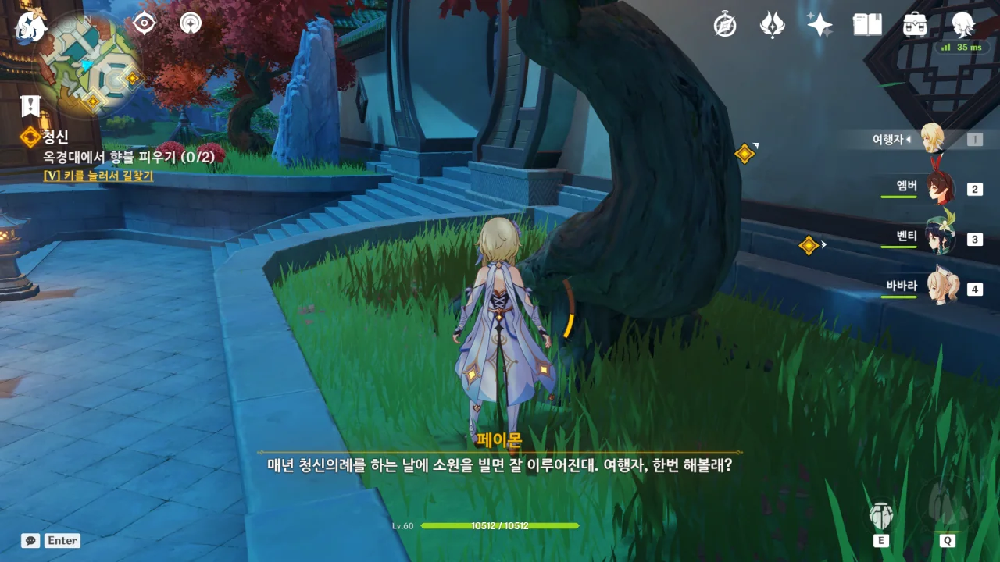

특산물 캐고 있는데 갑자기 말 걸지 마, 요 녀석아!

예상꽃은 호두와 행추가 필요로 하고, 유리백합은 응광과 운근이 필요로 한다. 여기엔 없지만, 청심은 감우와 소, 신학이 필요로 하고.

전부 보일 때마다 캐두어야 나중에 부족함이 없을 것이다.

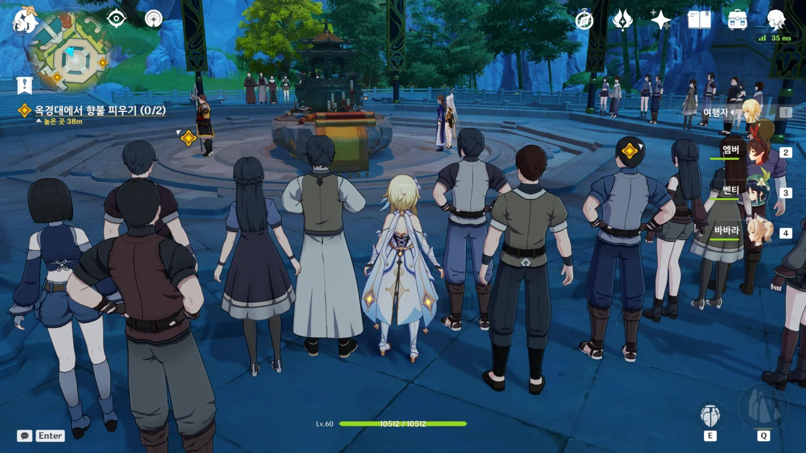

저기 응광이 서 있다.

갑자기 든, 실없는 생각이지만, 만약 여기서 내가 게임 시간 기준으로 몇 날 며칠을 가만히 서있는다면, 여기 있는, 응광을 포함한 모두 역시 몇 날 며칠을 나와 함께 서 있는 거겠지?



청신의례 때 소원을 빌면 암왕제군과 선인이 그 소원을 들어줄 것이라는 믿음이 있는 모양이다.



여행자 역시 오빠의 행방을 찾을 수 있길 빌어본다.

향로가 빛나는 것이, 마치 '접수 완료'라고 말하는 것 같다.



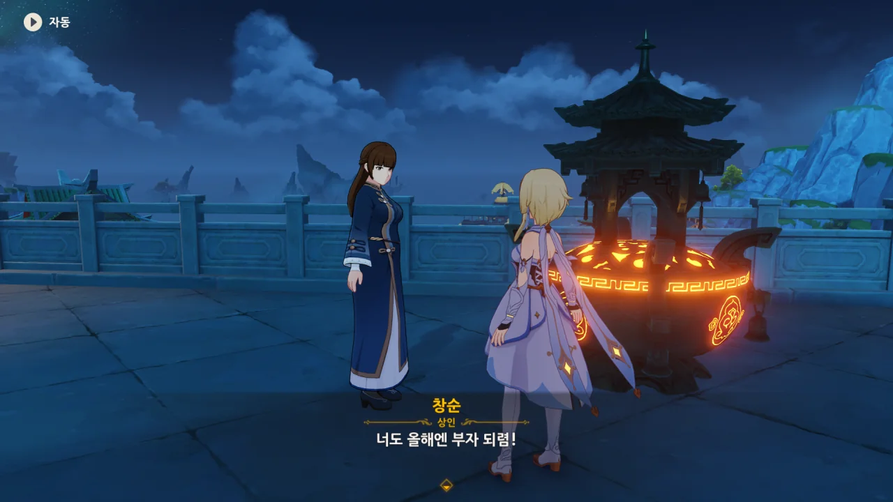

덕담 고마워요.



스네즈나야인만 보면 '이 녀석도 우인단 끄나풀이 아닐까?'하는 의심부터 들게 된다.

그래도 이 녀석은 순수하게 관광하러 온 것 같지만...



대부분이 아니라 전부 아냐?

소 역시 동물 모습을 보여주지 않아서 그렇지, 새일 것이라는 추측이 대다수거든.



여기선 바위 신에게서 오빠의 행방에 대한 단서를 찾을 수 있기를 빈다.



그 응광, 아까부터 가운데에 서 있던데?

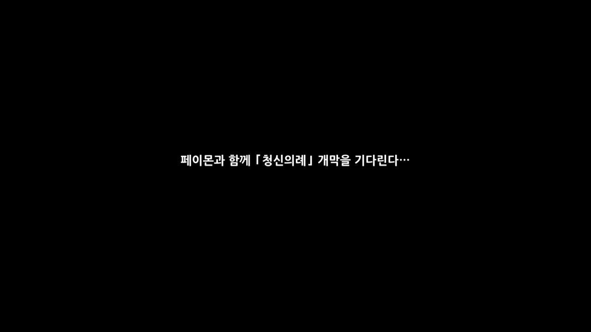



뒤에선 아무것도 보이지 않아, 앞으로 좀 더 다가서는 여행자와 페이몬.



해가 정수리 위에 뜬 걸 확인한 응광이 "길시가 되었다"라고 한다.

난 그래서 '길시'가 정오를 뜻하는 건가 순간 궁금해했는데, 그냥 좋은 시각이라는 뜻이었다.





응광이 가운데 있는 큰 향로에 불 같은 걸 붙인다.

바위 원소의 힘을 불어넣은 거라, 불을 붙였다고 할 수가 있을는지는 모르겠지만.



오오... 하늘로 빛이 쭉 솟아오르네...

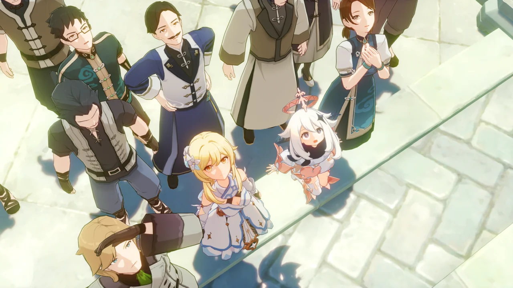

페이몬 녀석, 눈이 동그래진 모습이 귀엽다.



그리고 하늘에서 암왕제군이 볼품없이 떨어진다.



당연히 당황한 응광과 관중들.



암왕제군이 살해당했다며, 응광이 현장을 봉쇄할 것을 명한다.

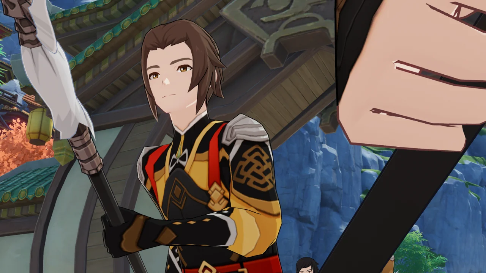

그 말을 듣자마자 기다렸다는 듯이 천암군이 들이닥친다.

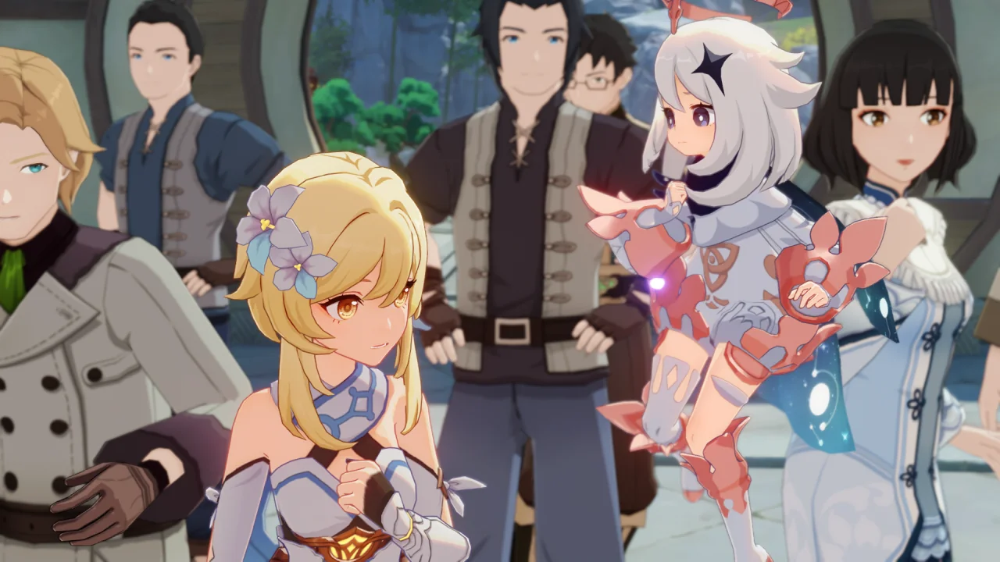

여긴 시작부터 아주 스케일 크게 시작하네.



지금 이걸 보고 있는 우리는 이게 다 짜고 치는 연극이란 걸 알지만, 이 장면을 처음 봤을 때는 머릿속에 온통 물음표만 가득했었다.

아니, 바위의 신에게 여행자 오빠의 행방에 관해 물을 생각으로 싱글벙글하고 있었는데, 바위의 신이 죽었다니까?



아니, 우리가 왜 수상해? 우린 그냥 관광객이라고.

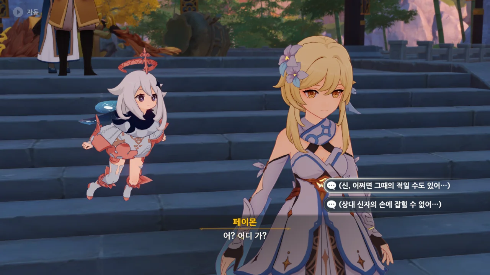

아, 이때 여행자가 현장을 빠져나가려고 한 이유가 이거였구나.

> (신, 어쩌면 그때의 적일 수도 있어...)
> (상대 신자의 손에 잡힐 수 없어...)

고작 두 문장밖에 되지 않아, 정확히는 알지 못하지만, '상대 신'이 누군지에 따라 해석이 갈릴 것 같다.

여기서 말하는 '상대 신'은 「천리의 주관자」가 될 수도 있고, 우인단이 섬기는 얼음의 신이 될 수도 있으니 말이다.



하기야, 여행자의 신분을 증명할 수 있는 건 몬드의 페보니우스 기사단밖에 없으니 말이다.

자칫하다간 국가 간 분쟁이 시작될 수도 있고.

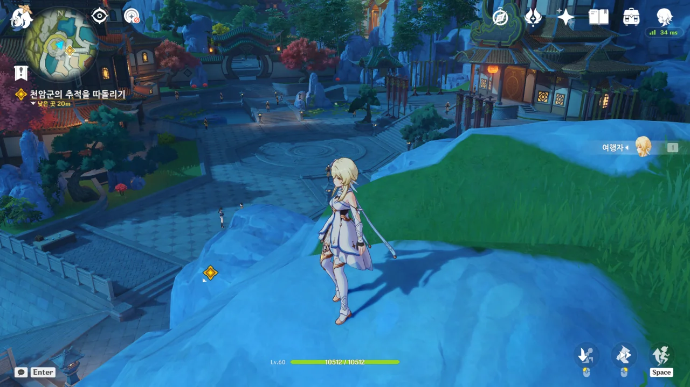

이 루트는 여전히 유용하구나.

원형 문을 나서자마자 왼쪽 벽으로 최대한 붙어 다니다, 등을 보이는 천암군을 피해 오른쪽으로 등반하면 이렇게 여유롭게 빠져나갈 수 있다.



몰래 빠져나가려고 했는데요. 발치의 사기 조각을 밟아서 들켰습니다.



페이몬의 놀란 표정이 정말 절묘하게 찍혔네. 정말 마음에 쏙 든다.





앞에도 천암군, 뒤에도 천암군인 절체절명의 순간.



갑자기 타르탈리아가 나타나 여행자를 포위한 천암군의 손을 쏴 무기를 떨어트린다.

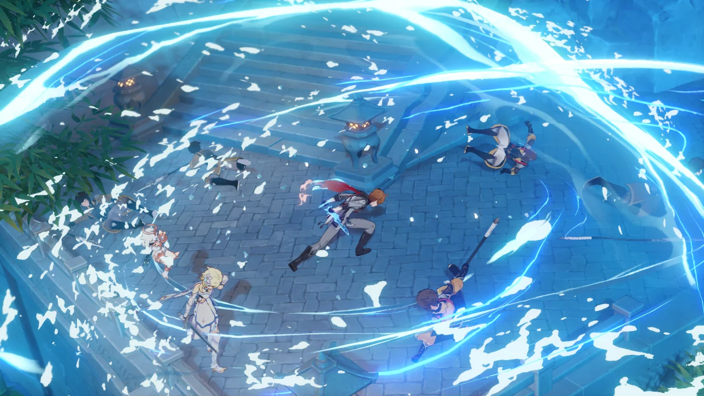

이야, 타르탈리아 단류 잘 터졌네.

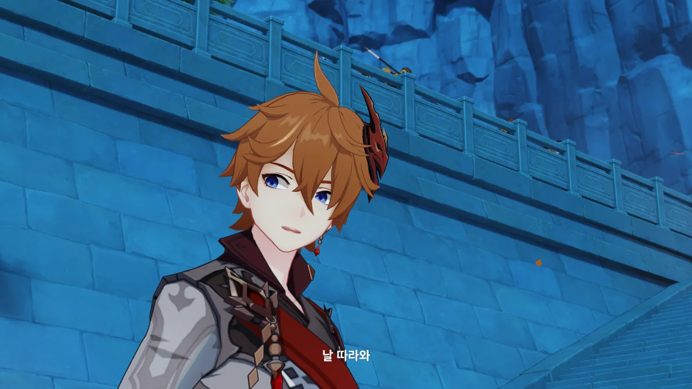

쿨하고 시크하게 "날 따라와"라고 말하는 타르탈리아.



별수 없이 타르탈리아를 따라간다.



🤔 상상 속의 다리로 달린다고? 🤔

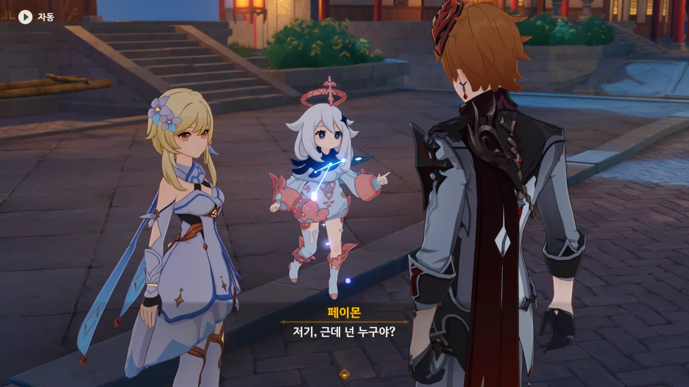

이걸 이제야 물어보네...



'귀공자'가 영어로 Childe인데, 발음이 '어린이'를 뜻하는 Child와 동일해 타르탈리아가 사실 몸만 큰 어린애 아니냐는 말을 들은 적 있다.

전투 이야기만 나오면 곧바로 흥분하는 걸 보면 어린애가 맞는 거 같기도 하고...





타르탈리아가 시뇨라처럼 우인단이라는 걸 알게 되자, 곧바로 경계 태세를 취하는 여행자.



싸우러 온 것이 아니라며, 오히려 우릴 도우러 왔다고 하는 타르탈리아.

아니, 어떻게 선택지 세 개 중 두 개가 전부 차갑게 거절하는 선택지지? ㅋㅋㅋ...



> 난 나쁜 사람이 아니야... 으음, 나쁘긴 한데 나쁜 짓을 하려고 너희들을 찾아온 게 아니야.

우인단이 나쁜 일을 하는 집단이라는 건 이미 잘 알고 있는 타르탈리아다. 그러니까 자신이 우인단에서 일한다는 걸 가족에게 필사적으로 숨기려고 하는 거겠지.



와, 대체 어디서 여행자를 훔쳐보고 있었던 거지? 옥경대 주변을 돌아다니다 보면 타르탈리아를 발견할 수 있었던 걸까?



리월칠성이 우인단을 의심하는 건 우인단의 잘못 맞지. 그러니까 누가 온갖 곳에서 깡패짓하고 다니래?



거 봐. "이걸 부인해야 하나?"라고 하는 것부터가 우인단의 깡패짓 때문에 우인단이 경계 받고 의심받는다는 걸 잘 알고 있다는 거잖아.



암왕제군을 암살했다는 혐의에서 벗어나려면 북국은행으로 가야 한다고 말하는 타르탈리아.
