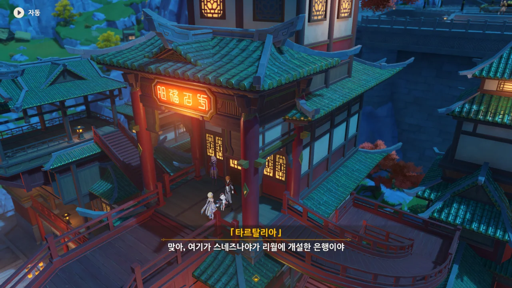
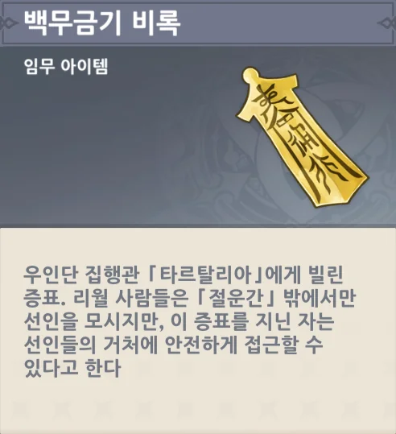
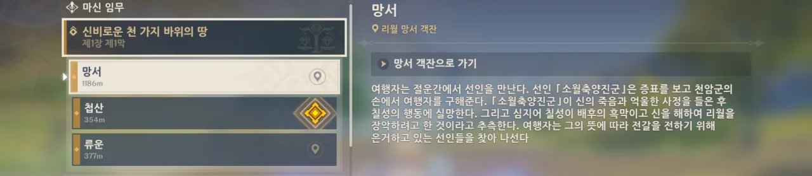
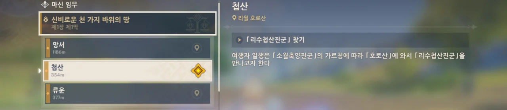
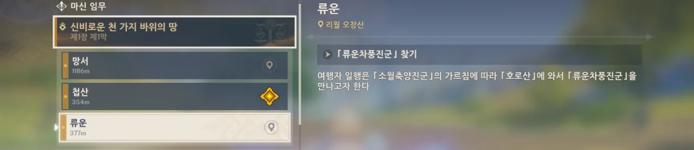

북국은행은 스네즈나야가 리월에 개설한 은행이었다.

뭐, 그럼 그렇지. 어딜 가도 전부 리월칠성에게 훤히 보일 테니, 스네즈나야의 영역 취급을 받는 북국은행이 지금으로선 가장 안전한 곳이다.



페이몬, 비아냥대는 것도 참 잘해...

리월이 티바트에서 제일 번영한 국가라고는 하지만, 우인단을 전 세계적으로 굴리는 것을 보면 알 수 있듯, 스네즈나야 역시 상당한 국력을 자랑하는 나라이긴 하다.



타르탈리아가 「삼안오현 선인」이 여행자를 해치지 못하게 하는 증표라며 뭔가를 준다.





그리고 리월항 북쪽, 귀리 평원 서쪽의 「절운간」이라는 석림에 선인이 살고 있다고 말한다.

절운간에 선인이 실재한다는 걸 아는 건 우인단의 정보겠지.



왜 선인을 만나게 하는 것이냐고 묻자, '정의를 구현하려는 것'이라고 답한다.

우인단이 '정의'를 운운하니, 이상한데.





그래, 그 부분이 확실히 이상하긴 해.

아주 오래전에 리월을 무력으로 건설한 후, 지금껏 신 자리에서 단 한 번도 내려온 적 없는 신이 평범한 인간에게 맥없이 죽을 리 없다는 걸 잘 알고 있으면서도 청신의례를 구경하던 관객 중에서 자객을 찾는 모습은 명백히 이상하다.

타르탈리아가 리월칠성이 뭔가 꿍꿍이가 있다고 말하는 것은 지극히 타당한 의심이지.





그러니까 칠성의 전령이 선인에게 이상한 말을 하기 전에 먼저 선수를 쳐 선인을 아군으로 만들면, 아무리 리월칠성이 여행자를 자객으로 의심해도 여행자를 함부로 대할 수 없게 되는 것이다.

치사하다고? 원래 불합리에는 불합리로 대응하는 법이다.

타르탈리아가 아까 준 것은 「백무금기 비록」이었다.

> 백무금기 비록
> ***
> 우인단 집행관 「타르탈리아」에게 빌린 증표. 리월 사람들은 「절운간」 밖에서만 선인을 모시지만, 이 증표를 지닌 자는 선인들의 거처에 안전하게 접근할 수 있다고 한다.
{.bq}

일종의 통행증 같은 건가 보다.



절운간에 가자, 선록(仙鹿) 하나가 여행자의 방문 목적을 추궁한다.



백무금기 비록을 보여주자, 자신을 '소월축양진군'이라 소개하는 선록.



여행자, 아니 페이몬이 상황을 설명하려던 찰나, 천암군이 들이닥친다.

야, 타르탈리아. 아까 분명 리월 사람들은 절운간에 함부로 들어가지 않는다면서?



소월축양진군에게 밉보인 천암군. 곧바로 소월축양진군의 무력 사용 허가를 받았다.

처음 할 때는 몰랐는데, 여기선 원소 충전 효율이 급상승하더라. 벤티 궁을 끝없이 갈길 수 있어!

> 선인의 힘을 이용해 스킬을 마음껏 사용하세요.

죽이지 말라고 했지, 스킬을 쓰지 말라고는 안 했다.



아무튼, 아까 했던 "사실..."부터 다시 설명을 시작한다.



물론, 소월축양진군이 매우 분노했다.



우리 의도가 아주 잘 먹혀들었다. 사실, 사실밖에 말하지 않았지만.

리월칠성이 청신의례에서 암왕제군을 살해당하도록 둔 것도 모자라, 죄 없는 여행자에게 그 죄를 뒤집어씌운 것에 분노하는 소월축양진군.



이제 다른 선인들 역시 만나보라고 한다.



리수첩산진군, 류운차풍진군, 항마대성을 만나보라고 하는 소월축양진군.

리수첩산진군과 류운차풍진군은 어디에 있는지 말 안 해도, 항마대성은 망서 객잔에 있을 것이라고 말한다.

임무 이름이 '망서', '첩산', '류운'이라고 되어 있는데...

솔직히 선인 이름은 다 부르기 좀 귀찮단 말이지... 류운차풍진군은 다른 선인에 의해 류운이라고 불리는 걸 확인했으니, 리수첩산진군 역시 첩산이라고 부르면 되는 걸까?
