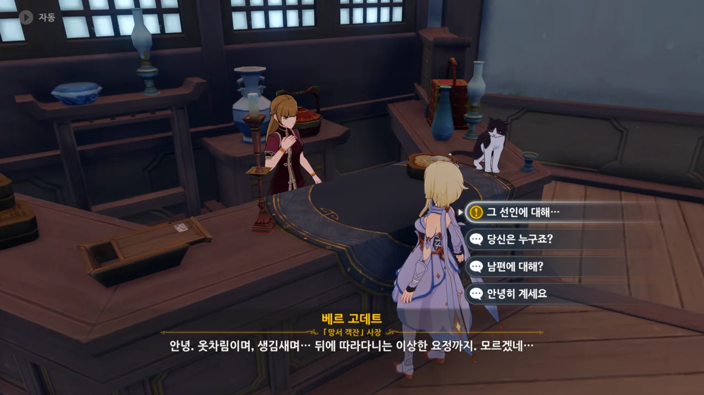
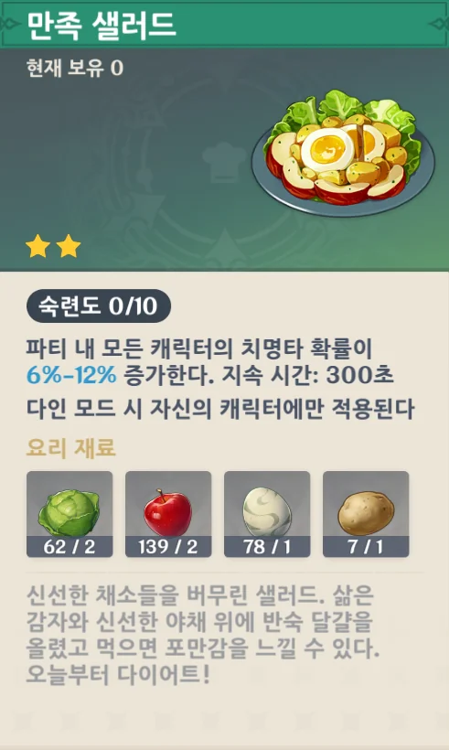
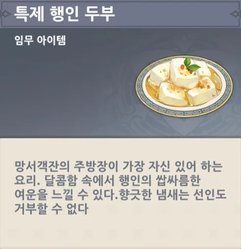
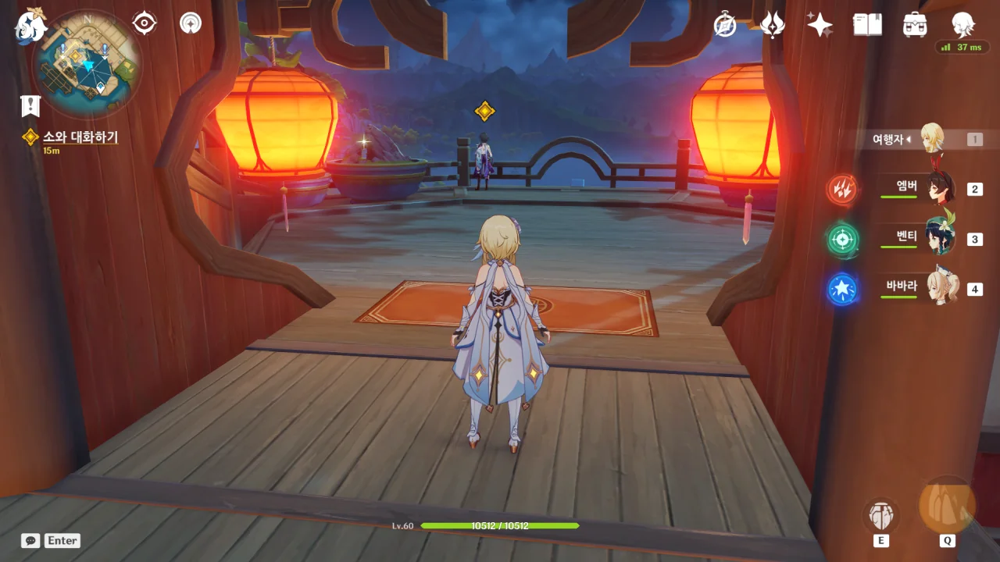
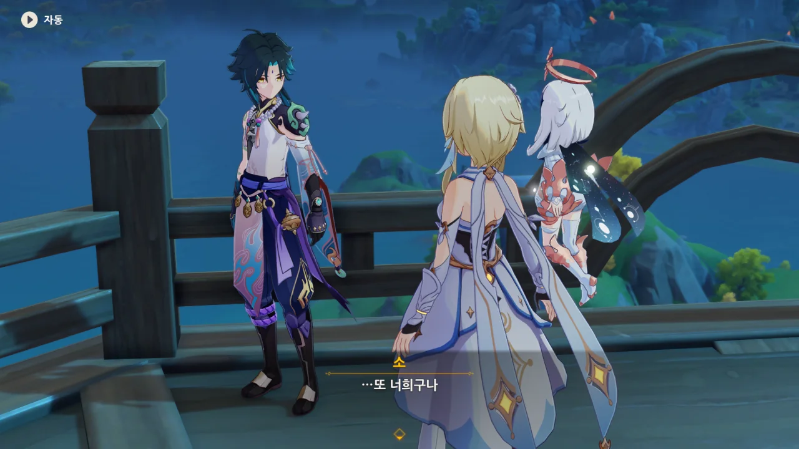
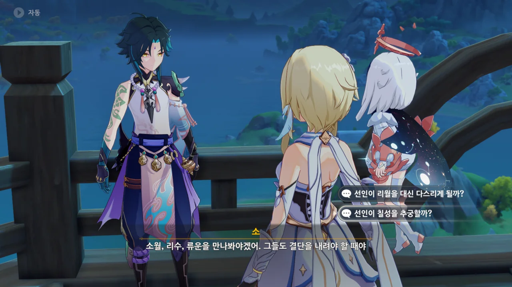
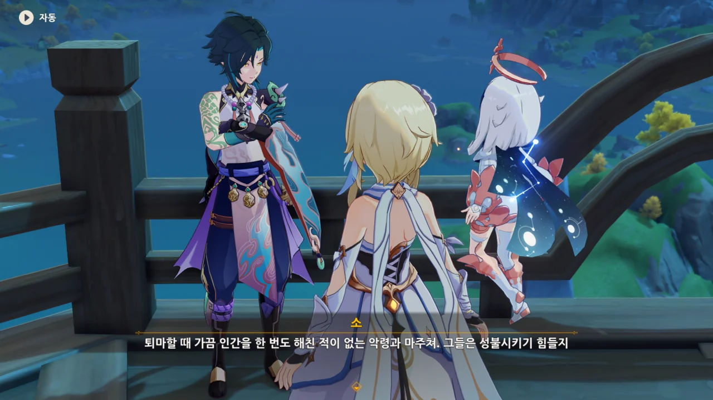



망서 객잔에 왔지만, 항마대성은 코빼기도 보이지 않는다.

그야 당연한 이야기겠지만. 아직 여행자와 소는 초면조차 아니지 않은가.



페이몬의 제안대로 노대에 가보았지만, 여전히 항마대성이 보이지 않는다.



노대 너머로 보이는 멋진 풍경에 감탄하고 있는데, 난데없이 소가 나타나 "눈에 보이는 게 다 진짜는 아니야"라고 한다.

아이, 깜짝이야.



백무금기 비록은 선인이 소지자를 해칠 수 없도록 하는 증표일 뿐이지, 소지자가 다치지 않는 건 아니라고 한다.

그게 무슨 소리야? 설마 절벽에서 밀어놓고 '아무튼 중력 때문에 죽었으니 자연사'라고 우기는 그런 종류의 논리인가?



아, 설마 선인이 내뿜는 짙은 선기를 평범한 인간의 영혼이 받아들이지 못해 다친다는 건가?

괜찮아. 여행자는 원래 범상치 않거든.



어서 여길 떠나라는 말만 남기고 제멋대로 휙 사라져 버린다.

소가 사라질 때에는 항상 나자의 춤 효과와 함께 사라진다고 생각했는데, 초기 마신 임무 때에는 그냥 카메라 연출이 바뀌고 보니 사라진 상태였다는 식으로 처리했구나.



케이아때처럼 소에게 온갖 우스꽝스러운 별명을 지어주고 싶었지만, 그랬다간 나중에 보물상자를 발견했을 때 허탕 치는 일이 생길까 봐 단념하는 페이몬.

괜찮아. 나중에 바로 그런 일이 무지 많이 생길 거거든...

아무튼 여기 주인아줌마에게 선인과 제대로 대화하는 법에 관해 물어보기로 했다.

망서 객잔은 볼 때마다 참 기묘하다. 분명 리월에 있는 리월식 객잔인데, 그 사장은 몬드 사람이거든.

게다가 이 아줌마, 응광의 정보원이라고 했던 것 같다.





우리가 방금 소를 만날 수 있었던 건 아마 소가 기분이 좋아서 그런 거라고 한다.

항상 업장에 고통받는 소가 기분이 좋을 때도 있다는 게 조금 신기한데.



그녀의 말에 따르면, 전투를 통해서만 리월을 지키려고 한 선인들 대신 리월항을 움직인 건 인간이었다고 한다.

야차라면 모를까, 자주 보던 선인들이 오직 전투만 머릿속에 든 근육 뇌는 아닌 거 같던데... 너무 인간 편향적 관점이 아닐까?



'주인아줌마'라고 부르니, 곧바로 '사장님'이라고 교정하는 주인아줌마.

여자들이 '아줌마'라고 불리는 걸 그렇게 싫어한다고 하던데, 아마 그 때문이겠지?

하지만 아가씨라고 부를 수도 없잖아. 그냥 아줌마 합시다.



소와 정상적으로 대화하고 싶다면, 소를 기쁘게 하면 된다고 한다.



아니, 이 아줌마도 소가 웃는 걸 본 적이 없었잖아? 그냥 지레짐작으로 꿰맞추는 거야?



주방장에게 행인두부를 만들어 달라 부탁하고, 그걸 여행자가 자신 있는 요리와 함께 대접하라고 한다.



「홍련 마라 슬라임」이라니... 향릉이 잘 만들 것 같은 요리네.

그냥 먹었다간 다음날 하루 종일 변기에 앉아있어야 할 것처럼 보이는 이름이다.

아니, 이 레시피는 언제 등록된 거래?



보자마자 귀찮게 하지 말라고 굉장히 재수 없게 말하는 언소.

언소가 원래 이런 캐릭터였나? 분명 옛날에 향릉과 요리 대결할 때는 무뚝뚝해도 이렇게 싸가지가 없는 캐릭터는 아니었던 것 같은데?



언소에게 사장 아줌마가 행인두부를 주문했다고 하자, 그제야 별수 없다며 대화한다.



언소의 손이 지금 불안정해 행인두부 같은 섬세한 요리를 만들 수 없다고 한다.

아니 왜? 뭐 잘못 먹었나? 설마 「홍련 마라 슬라임」?





알고 보니 이 아저씨, 주방에 귀신이 나오는 게 무서워 손을 벌벌 떨고 있던 것이었다.

아니, 귀신이 뭐가 무섭다고? 죽은 귀신보다 더 무서운 건, 바로 산 사람이라고.

생각해보라. 침대 밑에 귀신이 있는 게 더 무섭겠나, 사람이 있는 게 더 무섭겠나. 침대 밑에 사람이 있는 게 백번 더 무서운 거다.



주방에 가보았지만, 아무것도 없다.

그런데 왜 페이몬은 말을 하다 마는 거야?



어, 진짜 귀신이네.

페이몬은 놀라서 말조차 제대로 하지 못한다. 저런, 나약하군.





언소에게 이 사실을 알려줬더니, 아주 무서워 죽으려고 한다.

사장 아줌마라면 분명 해결 방법을 알고 있을 거야.



아니, 심지어 언소는 옛날에 이름 꽤 날리던 대도적이었는데, 귀신을 무서워한다고? 정말 알 수 없는 사람이야...

하지만 그것보다 더 궁금한 건, "그런 건 많이 봤어"라고 말하는 고데트 사장님의 과거다. 대체 뭔 일을 해야 귀신을 수도 없이 볼 수 있는 거야?



흠... 망서 객잔에 선인이 나온다는 걸 비밀로 하는 거였나? 하기야, 그랬다간 선인을 보려고 온 리월에서 사람들이 몰려올 테니, 여기에 소가 출몰하는 걸 비밀로 하는 게 충분히 이해된다.



선인과 접촉할 때 다치지 않으려면 그런 조무래기 귀신부터 상대할 줄 알아야 한다며, 우리에게 귀신 처리를 맡기는 아줌마.

귀신이 내뿜는 음기와 선인이 내뿜는 선기는 좀 많이 다른 개념 아냐? 저건 백번 핑계다, 핑계.



「항마인」을 그린 그림을 본 후, 객잔 근처에서 「완전한 항마인이 보이는 곳」을 찾으라고 한다.



쉽네.

그런데 이런 시야 퍼즐은 캐릭터에 따라서 각도가 달라지기 때문에, 여행자를 파티에 넣어 다니는 초반에나 쓸모가 있다.

난 아직도 두 번째 금사과 제도에서 겪은, 전혀 말이 되지 않는 시야 퍼즐 해답을 기억하고 있다고?

망할 고대비 설정. 페이몬의 대사를 뛰어가며 찍으려고 하니, 고대비 활성화 단축키와 겹쳐, 페이몬의 대사를 전부 놓쳐버리고 말았다.

곧바로 레지스트리를 편집해, 고대비 활성화 단축키를 완전히 비활성화 시켜버렸다. 분명 내가 고정키, 토글키 등 온갖 키보드 단축키는 전부 비활성화시켜 두었을 텐데...

&nbsp;

아무튼, 항마인을 활성화하자, 귀신이 나타나 어디론가 달려가는 모습이 보인다.

종종 마신 임무나 이벤트 임무에서 언급되는 '명이'가 누군가 했는데, 바로 이 귀신이었다.



아니 이 빌어먹을 귀신 새끼가.

유적 헌터 잔해에 대고 뭘 하나 싶었는데, 유적 헌터에 빙의해서 날 공격해 댄다.

유적 헌터는 뉴비 제초기라고, 이 개자식아!







그래 놓고서 폴짝폴짝 뛰며 노래를 부른다.

이건 악령이 분명하다. 뭐? 애니까 그럴 수 있다고? 애라면 유적 헌터를 되살려서 사람을 공격하지 않아요!





오기만 해봐. 그대로 호두에게 들어 갖다 바칠 거다. 이게 바로 제령이란 거다.



언소에게 귀신 문제가 해결되었다고 전하자, 여행자를 엄청난 고수로 여긴다.

어... 음... 뭐, 틀린 말은 아닌데...



이 사람, 귀신이 사라졌다고 엄청 좋아하네.

목소리에서부터 여행자를 향한 존경심이 뚝뚝 묻어나온다. 아깐 평대였는데 지금은 존대로 변했다니까?

행인 두부가 말이 '두부'지, 사실 푸딩과 비슷한 음식이라고 하던데... 과연 어떤 음식일까?

소 이 녀석, 행인 두부 냄새를 맡고 여기서 기다리고 있었구나!

그래 놓고서 여행자가 또 나타날 줄 몰랐다는 듯 "또 너희구나"라고 하는 게 다 보인다.



소가 행인 두부를 먹을 동안, 소에게 하고 싶었던 말을 한다.

이러니까 마치 소를 행인 두부로 유인한 것 같은데...

고양이 발톱 손질할 때, 이마에 투명 테이프를 붙이고 거기에 츄르를 발라놓으면, 고양이가 이마에 붙은 츄르를 핥느라 움직이지 않고 얌전히 있다고 하던데, 마치 그런 느낌이란 말이지...



대놓고 분노한 소월축양진군과 달리, 흥분하지 않고 차분히 "리월칠성이 이번 사건에서 무슨 역할을 했을까?"라며 자문하는 소.

다른 선인들은 아마 내 기억에 의하면 '진노'라는 표현이 어울릴 정도로 화를 냈던 것 같은데...

소 역시 다른 선인들을 만나야겠다고 말한다.



선인은 책임을 회피하지 않는다며, 해야 할 일을 할 것이라고 말한다.

소가 말한 '결단'이란 과연 무엇일까?



그래. 아까 만났던 그 빌어먹을 악령, '명이'는 대체 뭐였을까?

> 인간을 한 번도 해친 적이 없는 악령

그럼 방금 명이가 유적 헌터에 빙의해서 한 건 대체 뭐였는데?

소, 너 지금 속고 있는 거야... 명이가 그 순진무구한 얼굴로 유적 헌터에 빙의한 후 해쳤을 사람이 얼마나 많을지 누가 알겠어?



주인아줌마의 고생이 참 많다...
