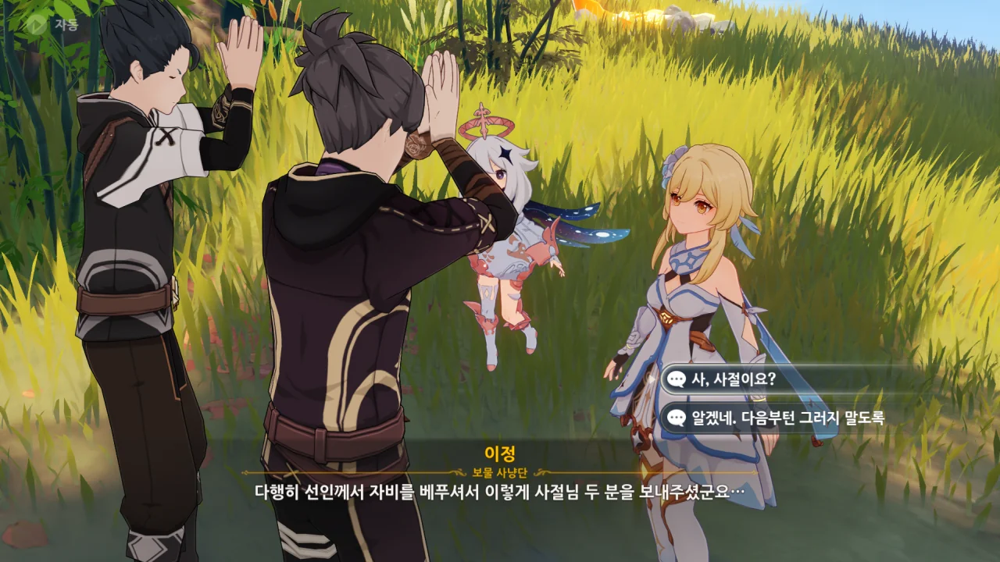
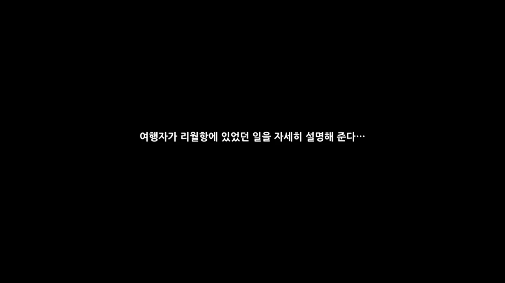
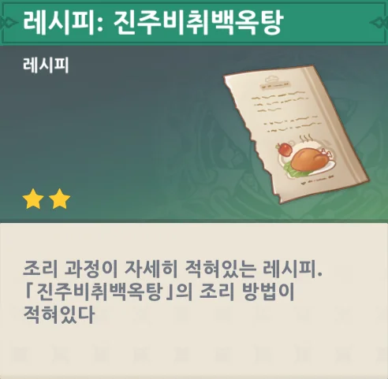
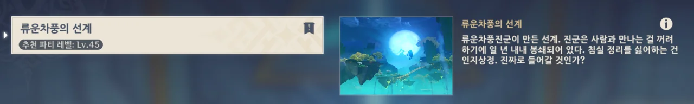
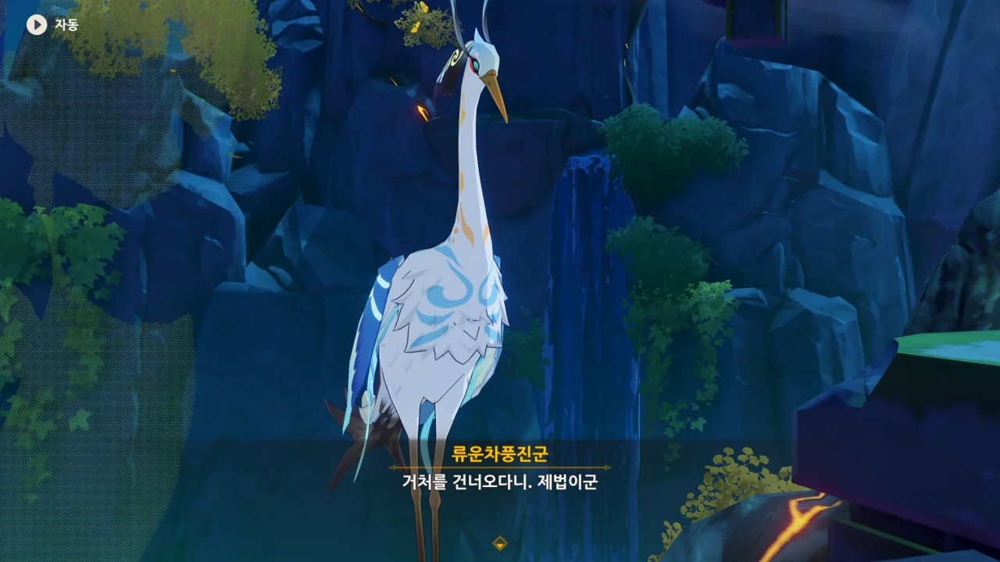
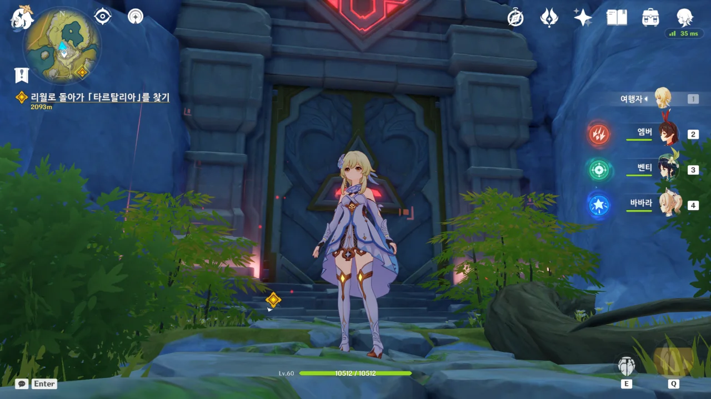

아니 너가 왜 갑자기 여기서 나오세요?

리수첩산진군의 거처에서 마신 임무를 진행하기 전, 주변에 있는 호박과 콜 라피스를 채집하다가 얼떨결에 누군가를 구출해 버렸다.





그 '이정'이라는 사람, 아까 보니 위에서 열심히 기도하고 있더라. 뭐, 보지 않아도 왜 기도하고 있었는지 알 것 같지만...

처음 이 임무를 할 때도 이정에게 말을 먼저 걸지 않았기에, 정말로 이정이 뭘 기도하고 있었는지는 잘 모른다.



감사 인사를 하고 떠나는 이당.

두 형제 보물 사냥단이 드디어 만났다.





가족을 먹여 살릴 돈이 없던 차에, 호로산의 호박에 보물이 있다는 소문을 듣고 호박을 몰래 캐러 왔다가 되려 호박 속에 갇히게 된 이당.

이상하다. 분명 타르탈리아가 말하길, 리월 사람들은 선인의 거처에 발을 함부로 들이지 않는다고 하던데, 왜 가는 곳마다 사람들이 보이는 거지?

응? 사절? 난 선인의 사절이 아닌데?

두 번째 선택지를 고르기에는 내 도덕성이 그걸 허락하지 않는다.





무슨 급박한 사정이 있던 것도 아니고, 부두에서 일자리를 구할 수 있었음에도 불구하고 일확천금을 얻을 생각에 호로산에 몰래 왔던 모양이다. 아, 그런 거면 괜히 풀어줬나?

아무튼, 이번 일로 제대로 혼쭐이 난 둘은 앞으로 제대로 된 일을 찾아 먹고 살겠다고 하며, 서둘러 산에서 내려간다.

&nbsp;

음... 뭔가 의도한 사항은 아니지만, 저 둘이 개과천선하겠다고 하니, 아무튼 좋은 일 아닐까?

그러게. 우리가 정말 선인의 사절이었으면 이런 곤란한 일 따위, 처음부터 겪지 않았을 텐데.



어어, 페이몬, 그거 플래그다, 플래그.



리수첩산진군이 우리가 한 걸 처음부터 다 지켜보고 있었던 모양이다.

에이, 보고 있었으면 말이라도 좀 해주지...



어... 호로산에 들어온 건 볼일이 있어서고, 산채로 호박 안에 갇힌 사람을 풀어준 것도 그게 벌 받는 중이란 걸 모르고 한 일이니까, 그냥 넘어가면 안 될까?



백무금기 비록을 보여주자, 금세 태도가 누그러지는 리수첩산진군.

대체 이게 뭐길래?



재촉하지 않아도 다 말할 계획이었어...



이 선조(仙鳥)도 암왕제군이 청신의례에서 암살당했다는 소식에 마찬가지로 분노한다.

나도 과연 바위의 신을 살해할 사람이 있긴 한지 궁금하긴 해... 아마 천리 정도나 되어야 가능할 것 같은데.



고데트 아줌마가 했던 말과는 조금 다르네.

고데트 아줌마는 '선인은 싸울 줄밖에 몰라, 리월항을 인간이 운영하게 되었다'라고 했지만, 리수첩산진군은 '선인은 인간 세상이 흥성하는 걸 보고 스스로 산속으로 물러났다'라고 한다.

음, 이렇게 다른 관점에서 같은 일을 서술하는 걸 보는 건 참 재미있다.



리수첩산진군은 남은 일을 처리한 뒤, 다른 선인들을 만나러 가겠다고 한다.



사람을 가두는 호박에 대해, 페이몬은 그게 리수첩산진군의 능력 때문으로 추측한다.

그런데 왜 하필 비유를 들어도 침에 비유하는 거야... 더러워...



그 말을 들은 리수첩산진군은 어이없어하며, 그 호박은 「탁산규」라는 꽃이 만들어 낸 것이라고 말한다.

땅 밑에 자라는 꽃도 신기한데, 그걸 밟으면 호박이 순식간에 자라나 침입자를 가둔다는 것도 신기하다.

어쩌면 그 꽃은 선인의 능력으로 만든 걸지도 모르겠다.





지금 그냥 이렇게 떠나면 무고한 생명이 탁산규를 밟고 호박 속에 갇힐까 봐 탁산규를 처리하고 출발하겠다는 리수첩산진군.

***

이다음은 류운차풍진군의 거처다.



류운차풍진군의 거처 앞에는 돌로 된 탁자와 의자, 그리고 식기와 주전자가 있다.

의자에는 각각 「이곳에 류운이 거했다」, 「이곳에 귀종이 앉았다」, 그리고 「이곳은 제군이 빌렸다」라는 문구가 적혀 있다.

아, 여기가 [선율이 흐르는 밤 이벤트 컷신]()에서 나온 그 탁자였구나...



뭐, 이 셋 중 암왕제군은 '죽은 상태'이고, 귀종은 오래전에 죽었으니, 여길 쓰는 선인은 류운차풍진군밖에 안 남았다.



선인들이 좋아하는 음식을 만들어 류운차풍진군의 이목을 끌겠다는, 지극히 페이몬다운 제안이다.

좋아하겠냐!





먼저 왔던 사람이 남긴 버섯고기말이 레시피를 얻었다.

여기에 이 레시피가 떨어져 있다는 건, 선인에게 이 음식을 바쳤다는 거겠지?





그다음 장소에선 진주비취백옥탕 레시피를 얻었다.





여기 역시 누군가 요리한 흔적이 있지만, 레시피는 얻지 못했다.

하지만 우리는 마지막 요리가 무엇인지 이미 알고 있다.



버섯고기말이와 진주비취백옥탕은 레시피를 줬으니 확실하다.

페이몬이 말한, '고기와 밀가루로 만든 요리'라는 조건을 만족하는 건 오직 모라육뿐이다.



세 요리를 탁자 위에 올려놓자, 정말로 길이 열린다.

뭐야, 류운차풍진군도 우릴 여태 보고 있었던 거야?

> 류운차풍의 선계
> ***
> 류운차풍진군이 만든 선계. 진군은 사람과 만나는 걸 꺼려하기에 일 년 내내 봉쇄되어 있다. 침실 정리를 싫어하는 건 인지상정. 진짜로 들어갈 것인가?
{.bq}

아니, 비경 설명이 왜 이래 ㅋㅋㅋㅋㅋㅋ



자신과 대면하고 싶다면 퍼즐을 풀고 오라는 류운차풍진군.

자신이 기껏 만든 기관 장치를 자랑할 기회가 와 내심 기쁜 모양이다.



물론, 단 한 치의 실수도 없이 완벽하게 풀어냈다.

왜 선인들은 다들 이렇게 머리 위에서 내려다보는 걸 좋아하는 걸까?

내가 또 한 퍼즐 하지, 암암.



이 기관 장치를 직접 만들었냐고 묻자, 내심 뿌듯한 듯 자신의 기관술이 암왕제군과 귀종이 감탄할 정도였다고 자랑하는 류운차풍진군.



그리고 거기에 페이몬이 대놓고 '너 히키코모리지?'라고 직구를 꽂는다.



몸 안쪽으로 깊게 들어온 직구에 심기가 불편해진 류운차풍진군이 얼른 용건이나 말하라며 재촉한다.





류운차풍진군도 암왕제군이 암살당했다는 말에 분노를 금치 못한다.

그런데 뭐요? 리월항을 진압한다고?



아니, 분명 선인은 리월항을 지키기로 한 거 아니었어? 그런데 리월항을 진압하겠다고? 그거 계약 위반 아냐?



아니, 제대로 된 상황 파악도 하지 않은 채, 무작정 뛰어나가 리월항을 습격하겠단 거야?



음식을 공물로 바쳤으니, 거기에 따른 계약을 지키라고 설득해 본다.



류운차풍진군이 계약 이야기를 듣더니 조금 진정한 것 같다.



백무금기 비록과 공물 때문에 잘 넘어간 것 같다.

백무금기 비록이 왜 만들어졌나 계속 궁금해했는데, 암왕제군이 여기에 선력을 불어넣어 인간들의 전쟁을 도왔다고 한다.

이것만 들어선 잘 모르겠지만, 적어도 왜 만들었는지 정도는 어렴풋이 알 수 있었다.



다른 선인들처럼, 직접 확인해 보겠다며, 이만 나가보라고 축객령을 내린다.

그리고 류운차풍진군의 거처 비경은 영영 잠기게 되었다.

나오자마자 칼같이 잠가버리더라고.
