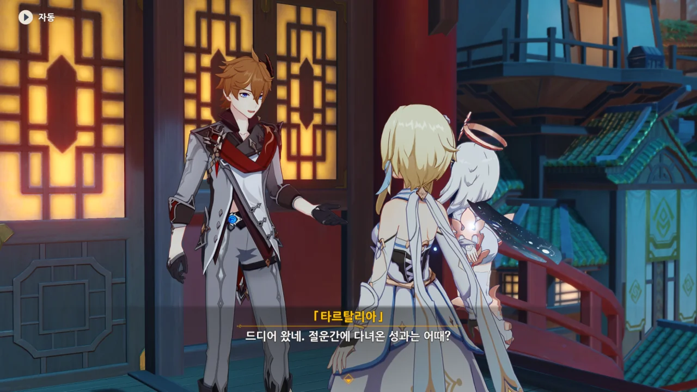
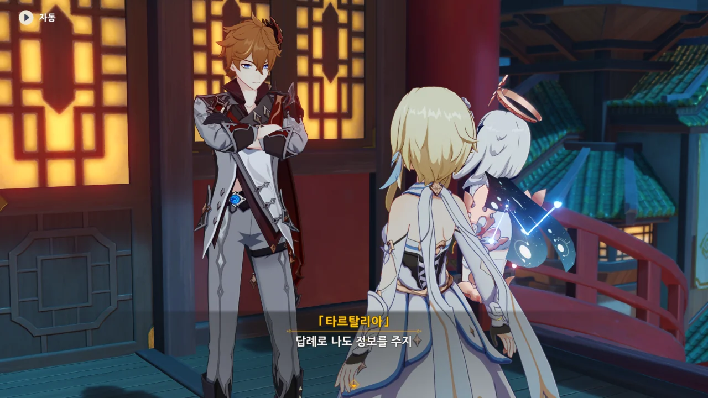
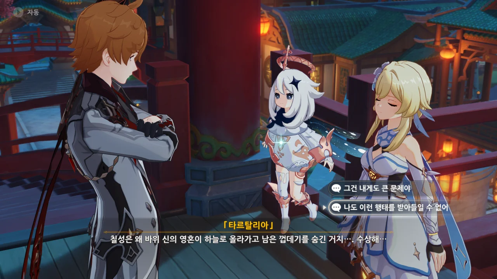

세 선인을 모두 만나고 다시 북국은행으로 돌아왔다.



우인단의 정보망도 완벽한 건 아니었는지, 여행자가 만난 선인 중에는 우인단이 알지 못했던 선인도 있다고 한다.

사실 그 정도까지 안 것만 해도 대단한 일이긴 하다. 먼 타국의 정보를 조사하는 게 어디 쉬운 일이던가.

새로운 선인에 관한 정보에 대한 답례로 타르탈리아 역시 여행자가 리월항을 떠나있던 동안 있었던 일에 대해 알려준다.



리월 칠성은 아직 암왕제군을 암살한 진범을 찾지 못했으므로 「선조의 허물」 참배를 금한다고 공표했다. 심지어 암왕제군이 죽었다는 사실이 퍼지는 걸 막으려고조차 시도했다고.



암왕제군 역시 선인이라고 한다.

그러니까 바위의 신은 계약의 신이자, 최초의 선인이라는 거네.





「삼안오현 선인」은 모두 리월을 지키겠다는 계약을 맺었기 때문에, 리월에 문제가 생기면 이에 대한 책임을 추궁할 자격이 있다. 여기에는 리월을 관리하는 칠성 또한 포함된다.

> 바위 신의 영혼이 하늘로 올라가고 남은 껍데기

음, 이렇게도 해석이 가능하겠구나. 난 그냥 바위 신의 시체 정도로만 생각하고 있었는데 말이다.

유물론적 사고방식 때문이겠지, 아마?



그래서 그런 걸까, 난 이 부분이 잘 이해가 되지 않더라.

일곱 신을 만나겠다는 여행자의 계획은 바위 신이 시체가 되어 떨어진 그 순간 이미 파투가 나버렸다.

그렇다면 여행자가 해야 할 것은 일단 자신에게 씌워진 누명을 벗고, 오빠의 행방을 바위의 신 다음으로 잘 알만한 사람을 찾는 것이다.

삼안오현 선인도 좋고, 야차 혹은 리월 칠성에게 묻는 방법도 있을 것이다.



일곱 신을 찾아다니는 이유를 타르탈리아가 물었지만 대답해 주지 않았다.

어차피 이번 일과 관계없는 일이기도 하고.





타르탈리아가 이 교착 상태를 깰 수 있는 사람을 찾게 시간을 좀 달라고 한다.

교착 상태? '바위 신을 만나야 하는데 바위 신이 죽어 있는 상태'를 말하는 걸까?



> 썩은 물이 터져 나오는 장관을 직접 보려면

나중에 타르탈리아가 할 짓과 연결해 생각하니, 저 대사가 굉장히 신경 쓰인다.
