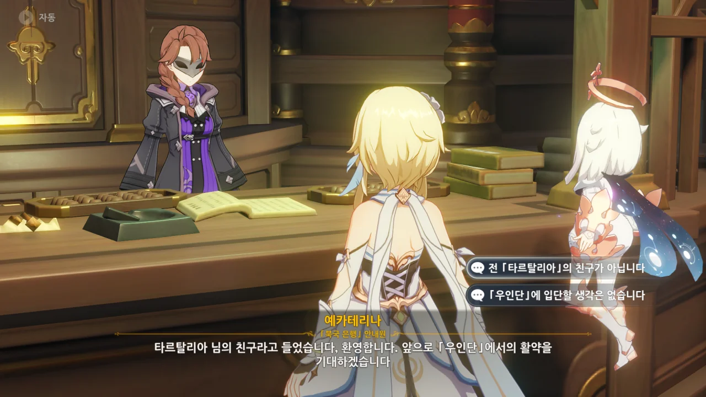
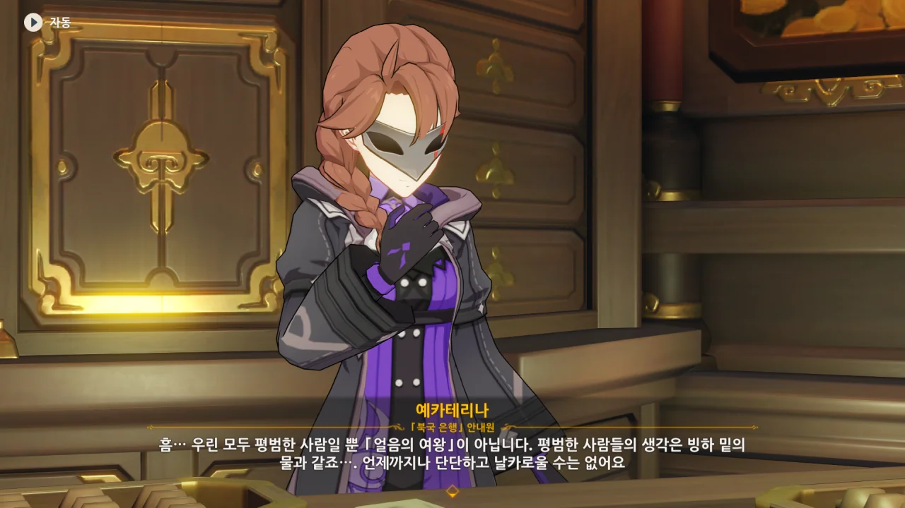
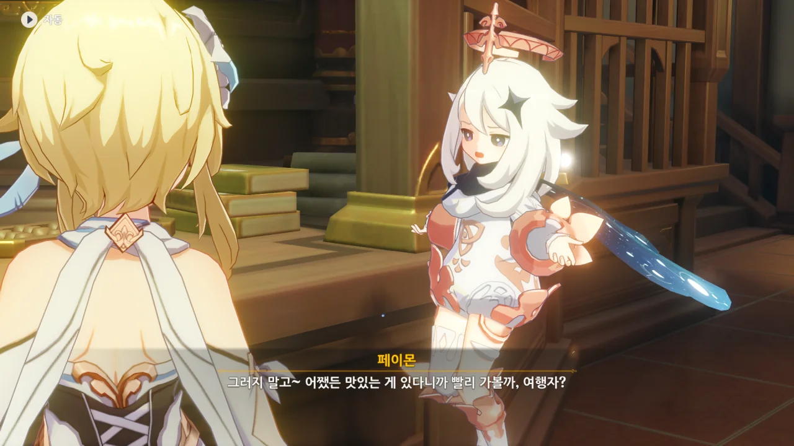
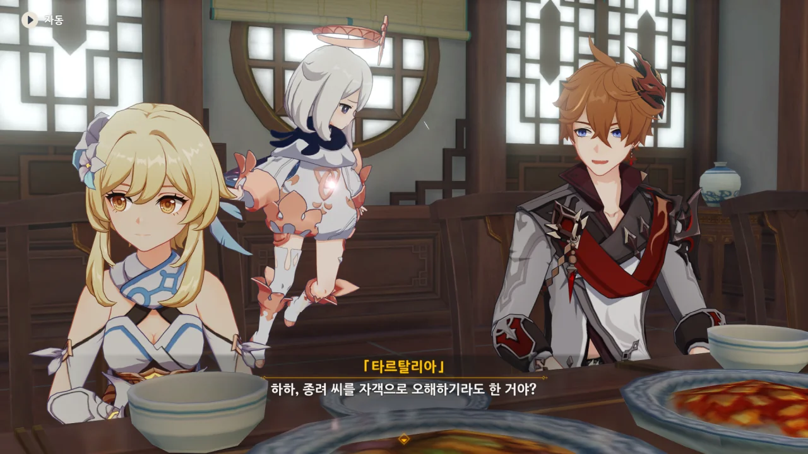
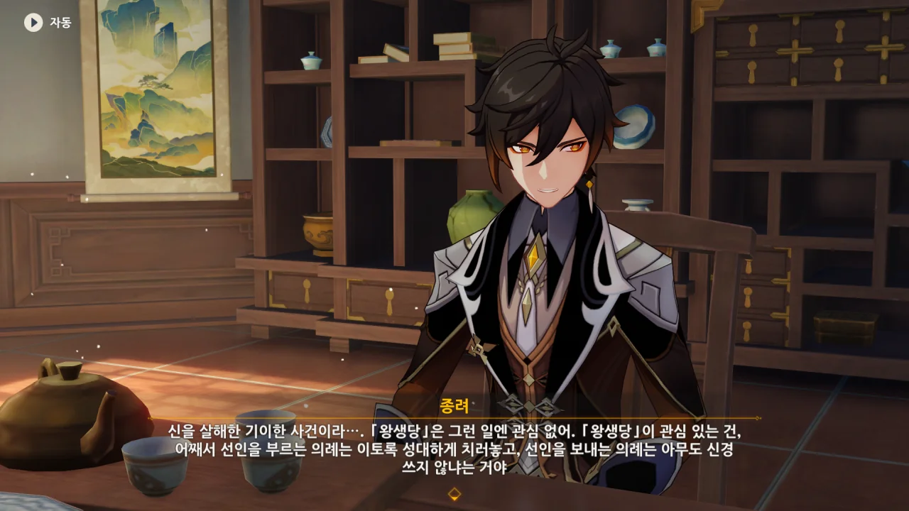
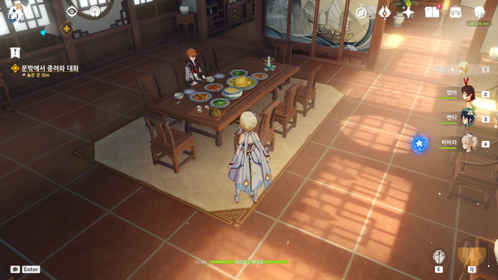
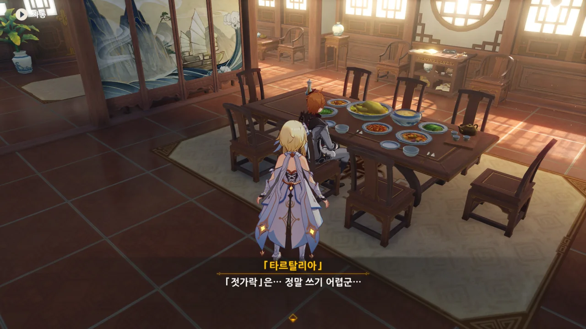



이해관계가 우연히 맞아떨어져 같이 움직이는 거지, 우인단에 가입할 생각은 추호도 없다.

워낙 도토레의 악행이 크게 다가와서 그렇지, 도토레를 제외한 우인단이 저지른 짓도 꽤 많거든.

그러니까 '나중에라도 생각이 바뀔 수 있다'라고 말하는 거지? 과연 그럴까?

이 시점 이후에 일어나는 일 중 대다수가 전부 우인단이 배후에 있거나 우인단이 저지른 일이거든.



타르탈리아가 교착 상태를 풀어 줄 사람을 이미 찾았으며, 유리정에서 우릴 기다리고 있다고 한다.

저번 임무가 끝나고 다음 임무가 활성화되기까지 기다린 시간이 게임 시간으로 하루도 채 되지 않았으니, 굉장히 빨리 일을 처리한 셈이다.



페이몬 이 녀석은 먹을 것 이야기만 나오면 갑자기 전문가가 된다니까...

티바트 가이드가 아니라 식도락 가이드였던 게 아닐까?

&nbsp;

저번에 몬드에서 희아에게 들은 정보에 따르면, 리 요리는 「산속의 식자재」를 주로 사용해 만든, 기름지고 빛깔이 짙으며, 다양한 맛을 특색으로 가진 요리라고 한다.

그래그래...



그 사람과의 「식사자리」라고 불리는 대면식을 마련해 두었다는 타르탈리아.



신월헌이나 유리정은 예약해도 일 년이나 기다려야 한다고 들은 것 같은데, 하룻밤 사이에 자리를 마련한 걸 보면, 엄청난 돈을 쓴 모양이다.

예카테리나의 말에 따르면, 타르탈리아의 계좌 금액에 0이 엄청나게 박혀있다고 했으니, 타르탈리아에게 이 정도는 아무것도 아닐 수도 있겠다.



안에선 종려가 우아하고 엘레강스하게 차를 마시고 있다.



눈이 똥그래진 채 주변을 두리번대며 들어가는 여행자가 너무 귀엽다.



종려를 "암흑가에 몸담고 있는 「왕생당」의 객경"이라고 소개하는 타르탈리아.

난 아직도 왜 타르탈리아가 왕생당을 암흑가 운운하며 소개한 건지 잘 모르겠다.

난 그저 왕생당을 그저 장례를 관리하는 조직이며, 자체적으로 무력 집단을 보유하고 있는 정도로만 알고 있는데, 내가 모르는 왕생당의 다른 면모가 있던 걸까?





왕생당을 마피아 같은 조직으로 오해한 페이몬이 꺄악하고 비명을 지르는 모습이 너무 귀엽다.



종려가 왕생당은 장례를 관리하는 조직이라고 말하자, "엥?"이라고 되묻는 페이몬이 너무 귀엽다.

아니, 그건 그렇게 오해하도록 소개한 네 잘못이잖아.



타르탈리아의 말에 따르면, 왕생당은 적어도 표면상으론 그런 일을 하지 않는다고 하는데... 정말 내가 모르는 뭔가가 더 있는 건가?



현재 응광에 의해 감춰진 바위 신의 선체를 볼 방법이 종려에게 있다고 한다.



시간이 지나며 선인의 시대는 가고 인간의 시대가 왔다는 종려.

분명 선인과 인간이 함께 세웠을 리월항에는 인간만 가득하고, 선인들은 전부 산속에 숨었다. 아마 이걸 말하는 거겠지.

그나저나 바위의 신에겐 참 많은 명칭이 있네. 바위의 신, 계약의 신, 상업의 신, 무신 등등...



선인이 이 세상을 떠날 때마다 성대한 기념식을 거행했지만, 이번엔 칠성조차도 그 전통 의식에 신경 쓰지 않는 모습을 보며 "정말 형편없군"이라고 말하는 종려.

하지만 이번엔 그냥 선인도 아니고 무려 암왕제군이 청신의례에서 시체가 되어 나타난 일 아닌가.

리월 칠성도 진범을 찾기 위해 정신이 없는 거겠지. 그 노력의 하나로 여행자를 잡으려 한다는 게 문제지만.

하지만 왕생당은 그런 걸 신경 쓰지 않는다고 한다. 와우...

이걸 자기 본분에 충실하다고 해야 하는 걸까...?



갑자기 '바위 신을 보내드릴 의식' 준비에 참여하지 않겠냐고 제안하는 종려.

아니, 근데 바람 신과 친분이 있다는 건 또 어떻게 안 거야? 분명 타르탈리아에게 그런 말을 한 적은 없는 거 같은데...

분명 우인단의 정보망으로 얻은 정보를 종려에게 나불댄 것이 틀림없다.



하지만 응광이 현재 신체에 참배하는 걸 막고 있는 지금, 참배 대신 「송신의례」을 진행하면 리월 칠성으로서도 여행자를 막을 수 없게 된다.

리월 칠성이 송신의례까지 막는다면 그때는 정말 걷잡을 수 없는 선인의 분노가 리월항에 쏟아지는 거지, 뭐...



우리 보고 먼저 가보라는 타르탈리아.

리 요리가 분명 다양한 빛깔을 지닌 기름진 요리라고 했던가? 정말 그래 보인다.

맛있겠다...

타르탈리아 이 녀석, 젓가락질을 의외로 못하는구나.
