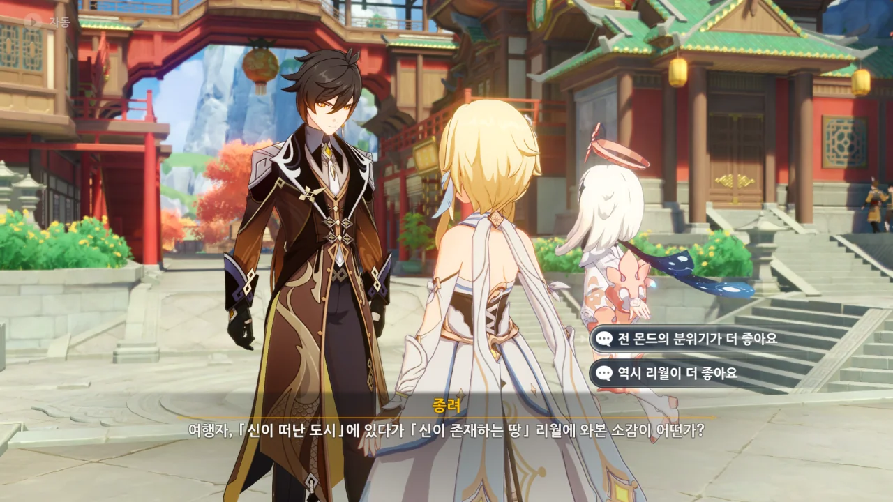
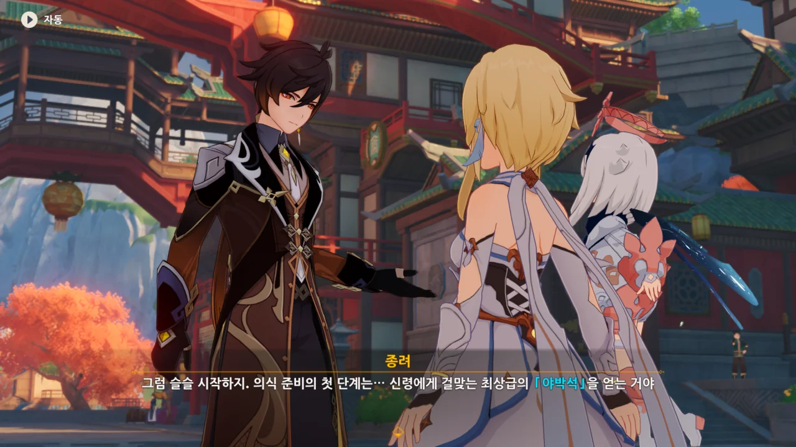
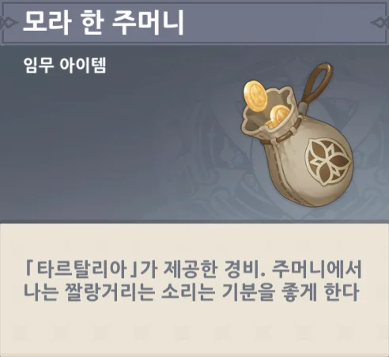
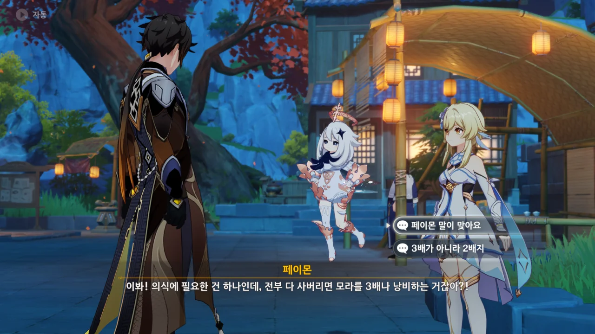
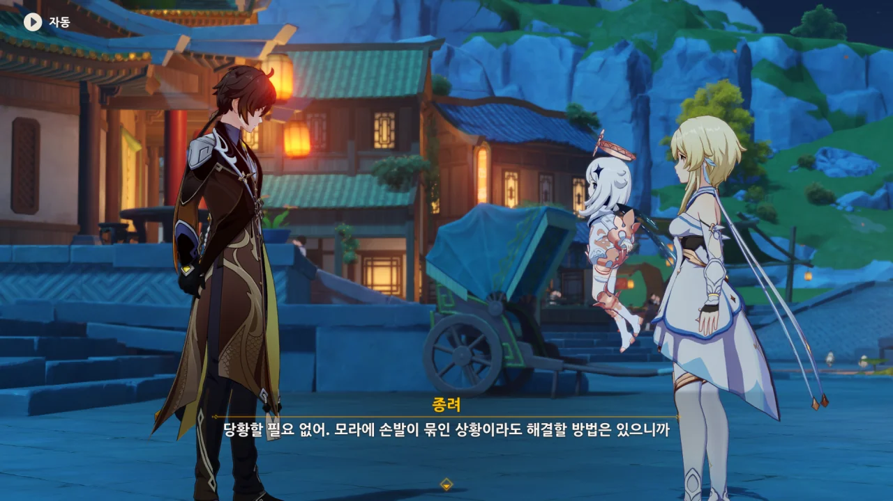
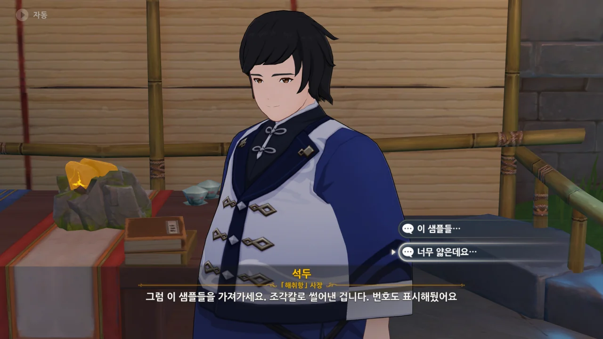
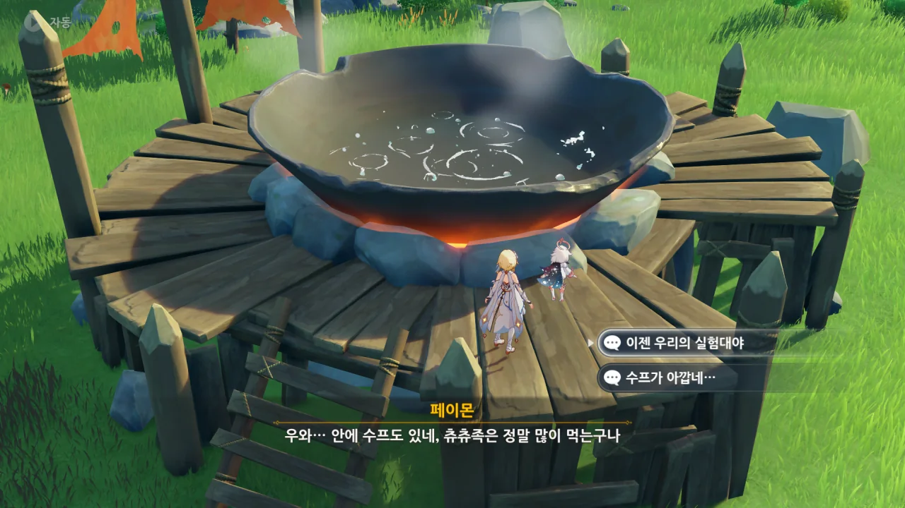
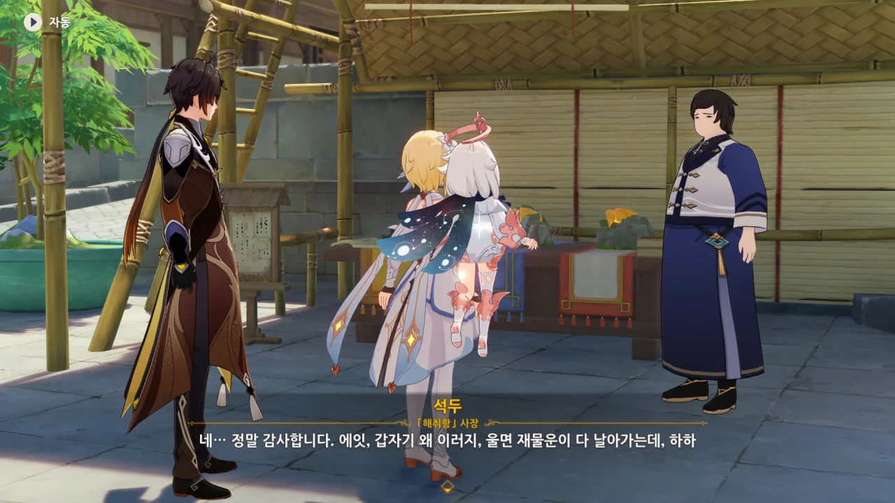

> 여행자. 「신이 떠난 도시」에 있다가 「신이 존재하는 땅」 리월에 와본 소감이 어떤가?

우리 모두 종려가 바위의 신임을 잘 알고 있다.

그래서 몬드가 더 좋다고 말해보았다.



> 그러나 아직 「신이 존재하는 땅」의 3,700년 역사를 완전히 느끼지 못한 것 같군.
> 「송신의례」를 준비하는 과정이 네 여정의 일부가 되어 견문을 넓혀줄 거야.

짬은 폼으로 먹은 것이 아니란 걸 증명하듯, 대놓고 리월보다 몬드가 더 마음에 든다는 말을 들어도 표정 하나 변하지 않은 채 아직 리월의 역사를 완전히 느끼지 못해 그렇다고 대답한다.

와우, 이게 바로 연륜이라는 건가...



리월은 7개국 중 가장 번영한 나라이고, 가진 무력도 결코 작다고 할 수 없기에, 다른 나라처럼 우인단의 강짜 외교가 리월에서는 통하지 않는다고 한다.

무력으로 깝죽거렸다간 마신과 능히 싸울 수 있을 정도의 무력을 가진 리월 선인들이 단체로 달려들 거고, 금전으로 압박하자니 리월보다 체급이 달려 불가능하거든.

그래서 우인단은 왕생당의 힘을 빌려 일을 처리하려 한다고 한다.

뭐, 타르탈리아가 아무런 대가 없이 여행자를 도울 리 없다는 건 잘 알고 있었지만.



종려 역시 타르탈리아가 뭘 꾸미고 있는지 전혀 관심이 없다고 한다.

지금 종려의 관심사는 송신의례를 제대로 끝마치는 것이니까.

자신의 장례식을 손수 준비하는 건 과연 어떤 느낌일까?



타르탈리아가 준 착수금을 여행자에게 주는 종려. 타르탈리아가 *대신* 지불했다고 하니, 이번 일은 종려가 여행자에게 송신의례 준비를 돕는 걸 의뢰하는 형식인가 보다.

게다가 다 쓰면 또 청구하면 된다고.

이래서 타르탈리아가 돈주머니, 지갑 소리를 들었구나.

송신의례 준비의 첫 단계는 최상급 야박석을 구하는 것이다.

> 모라 한 주머니
> ***
> 「타르탈리아」가 제공한 경비. 주머니에서 나는 짤랑거리는 소리는 기분을 좋게 한다.
{.bq}





「해취항」의 사장, 석두가 박석 두 개로 운세를 쳐보라며 호객한다.

&nbsp;

리월 일일 의뢰 중, 석두가 제시한 세 박석 중 안에 콜 라피스가 있는 박석을 고르는 의뢰가 있다.

여기서 최상품 박석을 곧바로 고르면 업적이 하나 깨지는데, 원소 시야로 살펴보아도 별 차이가 나타나지 않는다.

검색을 해보니, 카메라 시야를 잘 조절해 박석 내부를 보면 된다고 하더라. 근데 그게 쉬워야 말이지!



종려가 최소 촉조급 이상의 야박석을 달라고 하자, 이들이 관광객이 아님을 깨닫고 곧바로 야박석을 가지러 간다.



잘 모를 때에는 전문가의 의견을 듣는 게 최고지.

> 옥석 도박으로 장사하는 사람을 함부로 믿어선 안 돼

옥석 도박 ㅋㅋㅋㅋㅋㅋ 아주 틀린 말이 아니라서 뭐라 더 말할 수가 없다 ㅋㅋㅋㅋㅋㅋ



그리고 그 전문가의 대답은 '전부 다 산다'는 것이었다.

이런 미친. 석두조차 화들짝 놀랐다.



야박석을 전부 다 가져오려는 석두를 서둘러 막고, 잠깐 작전 타임을 가지기로 했다.

낭비되는 모라는 3배가 아니라 2배지만, 아무튼 낭비는 낭비니까 페이몬 말이 맞다.



모라 생각은 전혀 못 했다는 종려.

네네 그러시겠지요. 원하면 모라를 펑펑 만들어 낼 수 있으니 돈 걱정을 여태껏 했을 리가 없다.





그리고 갑자기 시작되는 경제학 시간.

아니, 고작 모라를 잊어버렸다고 경제학까지 꺼내 드는 거야? 여기서 화폐의 가치에 대해 논하자는 건가?



곧바로 페이몬에게 "거시 경제에 대한 건 잘 알면서, 미시적인 절약은 잘 모르나 보네"라고 핀잔을 들었다.

그래도 해결 방법이 있다는 종려.





가공 전의 야박석은 품질에 상관없이 재질, 색감, 내부 무늬 등이 거의 비슷해, 감별이 어렵다고 한다.

하지만 가공 전 야박석을 감별해 낼 방법이 아예 없는 건 아니라고.



아니, 여기서 갑자기 시를 들고 오네.

종려가 여러 분야에 해박하다는 걸 알려주는 장치인 걸까?



우수한 품질의 야박석은 불 원소 친화력이 강해, 고온 상태에서 광택이 밝고 푸를수록 품질이 높다고 한다.

그런데 이 지식을 앞으로 우리가 쓰게 될 날은 없을 거 같은데... 일일 의뢰에서도 열을 가해서 확인해 본다는 선택지는 없으니까.



야박석을 불에 지져보겠다고 하니, 아주 대경실색한다.

뭐... 그게 정상이긴 하지. 그을음이 묻어버리면 팔 수 없게 되니까.



하지만 겉보기로는 감별이 어려운 야박석을 무작정 파는 것도 설득력 없기는 매한가지.

석두가 돌의 샘플을 좀 떼어오겠다고 한다.

그런데 석두가 가져온 돌 샘플의 두께가 너무 얇다.



종잇장보다 얇게 썰어낸 돌 샘플을 보고 비꼬듯이 "사장님 솜씨가 대단하시네요"라고 했더니, 능청스럽게 넘어가 버린다.

그래. 종잇장처럼 얇은 돌이라면 불에 닿았을 때 바스러질 거 같은데.





하지만 고온의 불을 가하는 동시에 물 원소의 힘으로 야박석이 불타지 않도록 보호하면 된다고 한다.

음, 그러니까 중탕 비슷한 건가?



실험 장소는 몬드 타타우파 협곡의 엄청 큰 츄츄족 솥으로 결정되었다.



민들레주는 벤티가 좋아하는 술이기도 하다.

그런데 수메르의 저 「냉침 뱀술」은 대체 뭘까? 수메르를 돌아다니면서 단 한 번도 들어본 적 없는 술인데...



츄츄족 여럿이 솥 근처에 모여있지만, 곧 죽어 잿가루가 될 예정이다.

> 이젠 우리의 실험대야.







예전에 바람 신의 눈동자를 모으기 위해 이곳에 온 적이 있었는데, 그때 이 솥 밑에 화염꽃 너덧 개가 심겨 있는 걸 봤다.

그런데 그것으로도 부족해서 불 원소를 더 넣어줘야 한다고 하네.



내가 앰버를 키워둬서 다행이다. 사실 앰버를 키울 수밖에 없었지만. 푸리나는 대체 언제 오는 거야!

솥에 불을 더 넣어주자, 츄츄족이 나타나 방해한다.



한 번 더!



마지막 세 번째 야박석이 제일 밝게 빛나고 있다.





석두에게 가 세 번째 야박석을 한 박스 주문한다.



이 많은 야박석을 어디에 쓸 계획이냐 묻는 석두에게, 송신의례에 쓸 예정이라 답하는 종려.



암왕제군이 죽은 게 정말이냐며, 눈에 띄게 침울해하는 석두.

> 200년 전에 암왕제군께서 백성들을 살피기 위해 성의 남쪽에 내려오셨다가 길을 잃으셨을 때, 「해취항」의 옥 숟가락으로 평민들의 음식을 드셨다고 합니다.

이건 그냥 지어낸 이야기겠지?



암왕제군을 위한 일로 돈을 버는 건 도리에 어긋난다며, 야박석을 반값에 주겠다는 석두.



앗싸, 돈 굳었다!

울면 재수가 없는 것도 아니고, 재물운이 날아간다니. 역시 리월이라고 해야 하는 걸까?



그리고 자연스럽게 야박석 상자를 가져가려는 종려.

석두는 반값에 준다고 했지, 공짜로 준다고는 말 안 했다.



그리고 종려는 지갑을 가져오는 걸 깜빡했다.

> 이상한 금전 관념이네요...
> 돈을 신경 쓰지 않는 리월 사람이 있다니...

여행자도 어이없어하는 건 마찬가지다.



다행스럽게도 타르탈리아가 준 돈으로 야박석을 살 수 있었다. 그걸 다 써버렸다는 게 문제지만.

이상하다. 분명 착수금은 단순히 미리 지급하는 돈이지, 이런 데 쓰라고 주는 게 아닌데...



기껏 받은 착수금을 야박석 구매에 써버린 건 어쩔 수 없는 일이고, 그냥 타르탈리아에게 다시 청구하면 된다.

어차피 지갑 가져오는 걸 잊어버린 종려 탓이니까!
