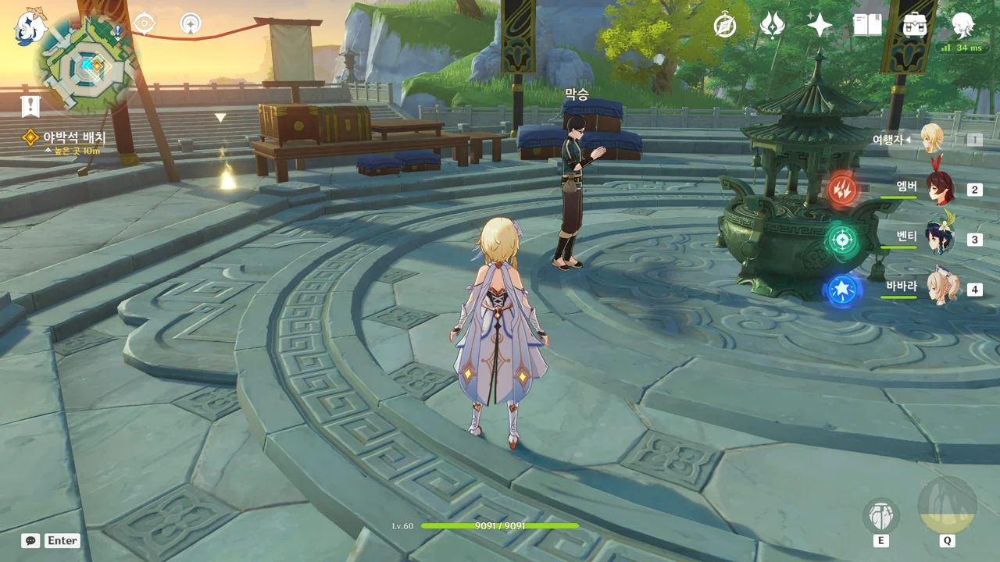
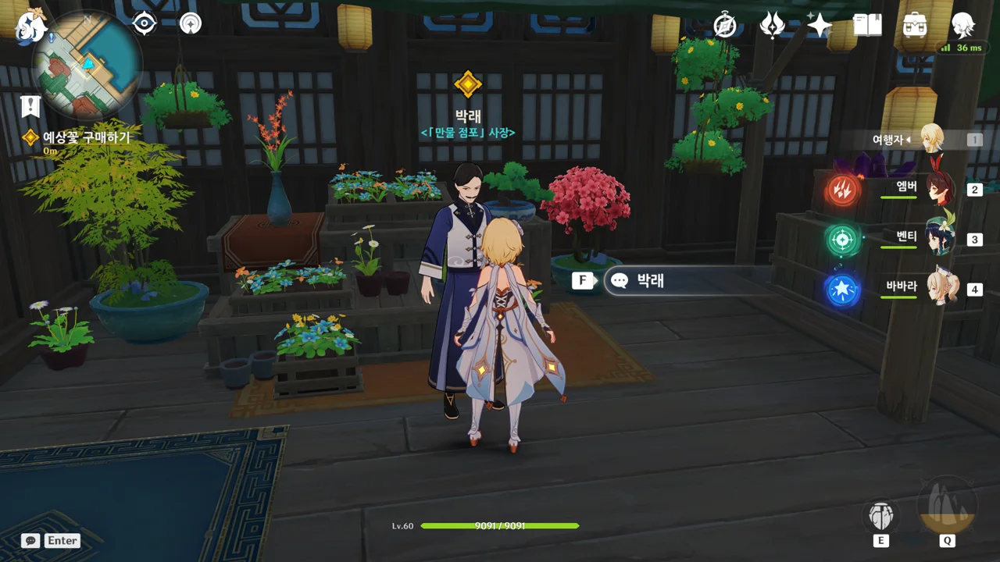
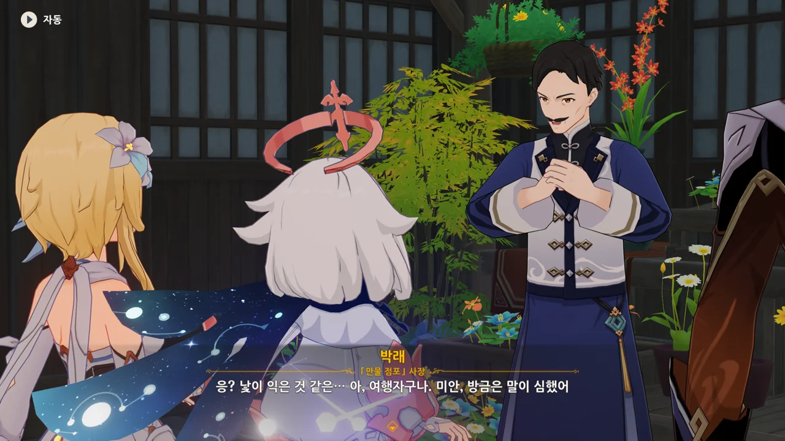
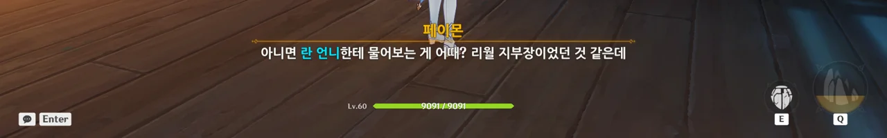
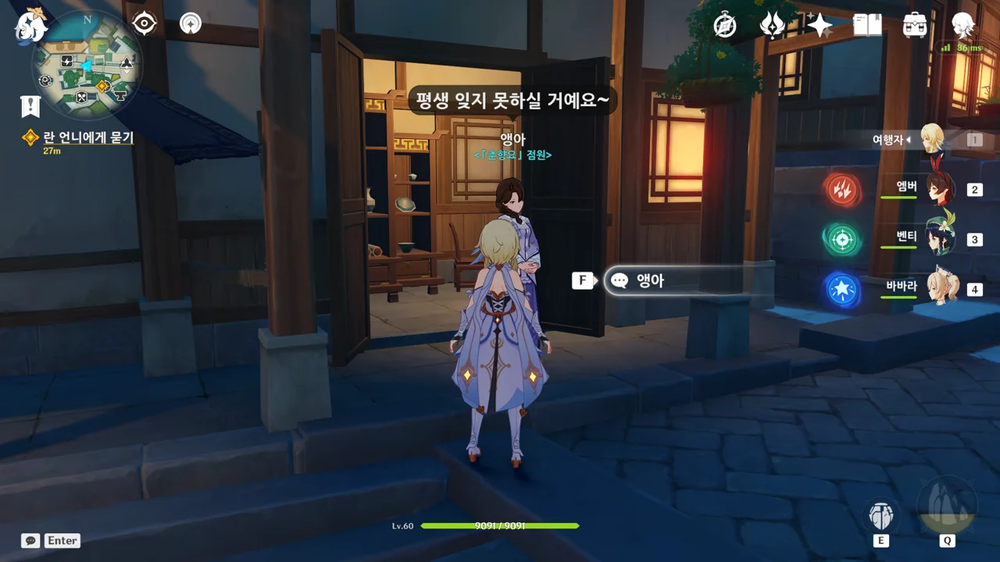
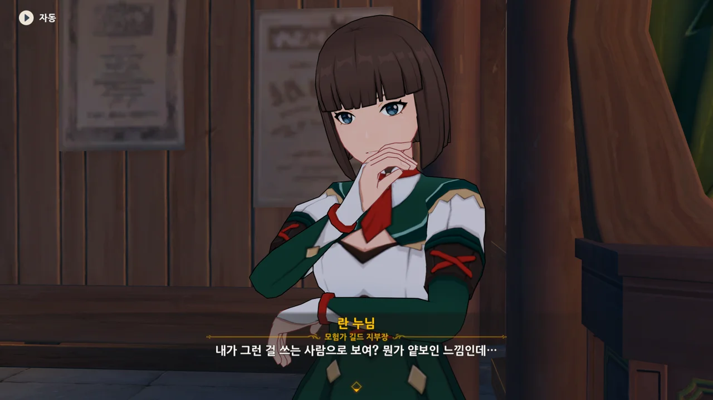

야박석을 옥경대에 가져다 두려는데, 옥경대에서 웬 NPC 하나가 기도하고 있다.

뭐지? 설마 이번 마신 임무와 관련한 NPC인가? 말을 한 번 걸어보자.













암왕제군이 죽은 것이 아니라, 셀레스티아로 간 것뿐이라고 믿는 막승.

고향에서 고작 몇십 년밖에 살지 않은 자신도 잠깐 분향하러 고향을 떠나니 고향이 그리워지는데, 리월에서 수천 년이나 산 암왕제군은 오죽하겠냐며, 암왕제군이 자신이 떠난 이후의 리월에 관한 걸 모두 준비해 두었을 것이라고 한다.

그런데 셀레스티아로 가는 거나, 죽는 거나, 거기서 거기 아닌가?













바위 신이 별로라면 지금의 리월이 이렇게 부유할 리 없다라... 글쎄...

내가 무신론자라 그런가, 리월 사람들의, 광신에 가까울 정도의 바위 신에 대한 믿음은 기이하게만 보인다.





엑, 그거 설마 비운상회의 행추 아냐?







행추를 위해서도 향을 피우려던 참이라고 말하는 막승.

산 사람을 위해 향을 피워도 되는 걸까?



음, 아무런 관련 없는 평범한 NPC일 뿐이었다.



야박석 상자를 땅에 놓았다.

카메라가 텅 빈 곳을 비추는 와중, 야박석 상자가 갑자기 난데없이 팟 나타나는 걸 보니 웃음을 참을 수 없더라.



그리고 종려는 또 지갑을 잊어먹었다. 나중에 타르탈리아를 바닥까지 탈탈 털어먹어야지.



이전부터 계속 궁금했던 것이지만, 여긴 분명 암왕제군이 암살당한 사건 현장 아닌가?

그 사건으로부터 얼마 지나지도 않았는데 마치 아무 일도 없었던 것처럼 현장이 말끔하게 청소되고 대여되기까지 하는 걸 보니, 뭔가 기분이 묘하다.

마치 보기 흉한 걸 서둘러 치워버렸다는 느낌이 든다고.

게다가 이게 리월 칠성의 묵인하에 진행되는 일이라니.



그러고 보니, 절운간에서 돌아온 이후, 천암군이 귀찮게 한 적도 없다. 심지어 천암군에게 말도 걸 수 있었다고.

대체 뭐지? 내가 모르는 곳에서 대체 무슨 일이 일어나고 있는 거지?





암왕제군의 시체, 「선조의 허물」은 현재 리월 칠성이 꼭꼭 숨겨두고 있다.

범인이 정확히 누구인지, 그 목적은 뭔지 등에 대한 조사도 제대로 되지 않은 상태에서 암왕제군의 시체를 서둘러 대중에게서 숨긴 리월 칠성.

종려 말처럼, 이미 이 사건에 대한 진실을 알고 있거나, 필요한 현장의 모든 단서를 수집하지 않았으면 하지 않았을 행위이다.

&nbsp;

뭔가 수상쩍지만, 그런 건 옥경대의 거물들이 알아서 할 거라며, 그들이 가만히 있는 게 오히려 도와주는 거라고 말하는 종려.

종려는 송신의례 말고는 관심이 없었지, 참...



암왕제군의 시체는 당분간 리월, 아니 티바트의 유일한 조폐창인 「황금옥」에 안치될 거라고 한다.

그 말을 들은 페이몬이 감탄사를 내뱉었는데... 요 녀석, 분명 거기 있을 모라를 생각한 거겠지? 변명해도 소용없어.



그런데 종려는 이런 고급 정보를 대체 어떻게 알고 있는 걸까?

거기에 대한 답으로, 이번 송신의례는 리월 칠성의 묵인하에 진행되는 일인 만큼, 내부 소식을 어느 정도 전해 들을 수 있었다고 한다.

송신의례에 필요한 장소를 리월 칠성이 대고, 자금은 타르탈리아, 혹은 우인단이 제공한다. 대체 이들이 노리는 건 대체 뭘까? 리월 칠성은 왜 송신의례를 직접 진행하지 않는 걸까?

&nbsp;

아무리 생각해도 리월 칠성이 암왕제군이 죽은 다음의 권력 공백을 틈타, 리월의 권력을 장악하려는 것으로밖에 보이지 않는다.

그렇지 않고서야 이렇게 의심스러운 행보를 보일 리 없지 않은가.



이게 리월 사람과 몬드 사람의 관점 차이인 걸까? 계약만 어기지 않으면 서로를 이용해도 괜찮다고?

어우, 난 그렇게 살기는 정말 싫다.

종려가 말한, 리월의 3,700년 역사에서 지금까지 느낀 건, 리월 사람들의 바위 신에 대한 기이할 정도의 믿음과 계약만 어기지 않으면 무슨 짓을 해도 된다는 해괴한 관념밖에 없는 것 같은데.



다음에는 의식에 쓰일 향고를 구해야 한다.

그냥 향고를 사는 건 안 되고, 특수한 품질의 예상꽃이 필요하다고.



그리고 종려의 예상꽃 강의 시간이 시작되었다.

아, 그래서 선계에서 직물을 만들 때, 예상꽃을 쓴 거야?

꽃에서 섬유질을 뽑아 원단을 만든다는 게 신기하게만 느껴진다.

상점은 제일 아래 플랫폼에 있었다.

그 위 플랫폼에서 계속 헤매며 왜 미니맵에 표시된 지점에 왔는데도 아무런 NPC가 보이지 않는지 궁금해했었는데, 알고 보니 그 밑이었더라.

박래 아저씨는 처음 리월에 왔을 때, 청신의례에 관해 물어본 사람 중 하나였다.





아니, 사람이 좀 모를 수도 있지, 그걸로 '세상 물정 모르는 외지인'이라고 하다니.

서비스업에 대한 태도가 불량하다.



그에 반해 종려가 구체적으로 「금옥장교」, 「산음금족」, 「표묘선연」 세 품종의 예상꽃을 보여달라고 하자, 여행자와 페이몬을 종려의 하인으로 착각하며 '하인이 주인보다 먼저 입을 열면 안 되지'라고 말한다.

야, 우리 어디서 전에 본 적 없냐?

그래도 사과는 빨라서 좋네.





그리고 시작되는 종려의 예상꽃 강의 두 번째 시간.

예상꽃의 품종과 거기에 얽힌 이야기와 서식지 등에 대한 이야기를 펼쳐놓는다.



박래가 종려에게 감탄하자, 종려는 여행자야말로 대륙 곳곳을 언젠가 누빌 사람이라며 여행자를 치켜세운다.

어... 티바트 전 대륙을 돌아다닐 예정이긴 하다만... 그게 대단한 일인가?



그래서 이 셋 중, 뭘 고르면 되냐고 물으니, 셋 다 모두 사겠다고 한다.

아니, 아까 야박석을 살 때도 그러더니, 이번에도 또?



> 연극을 볼 땐 가장 유명한 배우를 지명하고, 새장을 들고 산책할 땐 가장 비싼 화미조를 사는 것 --- 이게 바로 인생이지.

늘 지갑을 잊어버리고 다니는 사람이 할 소리는 아닌 것 같다.



하지만 이번에 세 예상꽃을 모두 사는 건, 옛 전통에 따라 세 예상꽃으로 각각 향고를 만들어 바쳐, 암왕제군이 스스로 향고를 선택하게 하는 전통에 따르는 것이라고 한다.

그런데 암왕제군이 향고? 향고는 보통 여자들이 쓰는 거 아냐?



이제 종려가 지갑을 들고 오지 않는 건 상식이지.





예상꽃을 암왕제군께 바칠 예정이란 말을 들은 박래가 예상꽃을 그냥 주겠다고 한다.

그 대신, 자기 마음도 같이 전해달라고 한다.



암왕제군이 시를 써줬다고? 그래서 예상꽃이 비싸다고? 대체 여기엔 무슨 이야기가 얽혀 있는 걸까?

그 진위가 의심스러운 이야기가 종종 보였지만 말이다.

그런 이야기가 많이 나왔다는 것 자체가 리월에서의 바위 신에 대한 인기를 알 수 있는 지표가 되는 것이다.



그래. 종려가 지갑만 들고 왔어도 이런 일은 안 생겼겠지.

그런데 어째 송신의례에 필요한 모든 자금을 북국은행에 다 떠넘기는 느낌이다.





예상꽃을 구했으니 이제 향고를 만들어야 하는데, 종려의 지인 중에는 향고를 만들 줄 아는 사람이 없다고 한다.

그래서 여행자가 시내에서 직접 평범한 아가씨 같은 사람들에게 물어봐야 한다.



몸에서 향기가 나는 사람에게 물어보면 향고를 직접 만들었는지, 혹은 어디서 구했는지 알 수 있겠지.

페이몬이 모험가 길드 앞에 늘 서있는 란 누님에게 물어보자고 한다.



아까 종려가 이야기했던 내용 그대로네.

일단 우리가 최종적으로 가야 할 곳은 이 「춘향요」이다. 그런데 가서 말을 걸어봐도 평상시 나오는 대사밖에 나오지 않더라.

무조건 란 누님에게 가란 건가...



란 누님에게 단도직입적으로 향고를 만들 줄 아냐고 물어본다.

응? 그게 왜 얕보이는 거야?



란 누님의 몸에서 좋은 향기가 나는 이유가 이전에 채집한 청심 때문이라고 한다.



높은 곳에서만 자라는 청심을 '길가의 꽃'이라고 표현하기엔 좀 무리가 있지만... 아무튼 의외이긴 하네.

청심의 약효가... 아마 목기침 완화였던가?



란 누님이 점술사 기명에게 물어볼 것을 제안한다.





기명 역시 향고는 만들어 본 적도, 쓰지도 않는다고 한다.

기명에게서 나는 향기는 연지 향이라고.

> 향고 냄새로 음흉한 선원들을 더 끌어모으긴 싫어요...

아하하... 무슨 말인지 알 것 같다.

오랜 항해 중에는 성욕을 풀 곳이 없으니, 부두로 돌아온 선원들은 분명 성욕이 충만한 상태일 것이다.





오, 이제야 기명에게서 「춘향요」 이야기가 나왔다.

거기서 만드는 향고는 시중의 것보다 훨씬 좋다고 한다.
