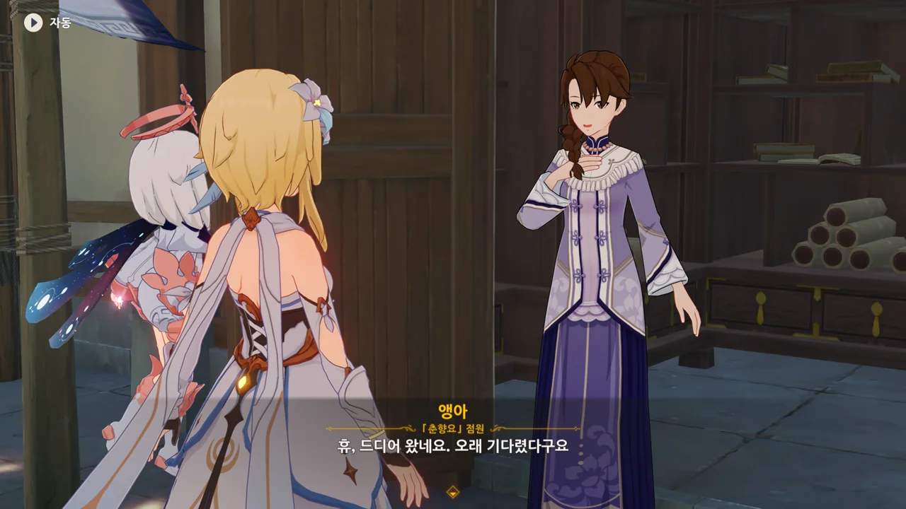
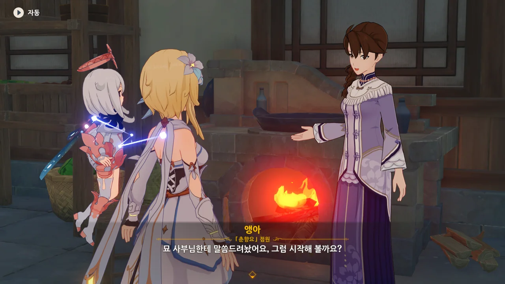
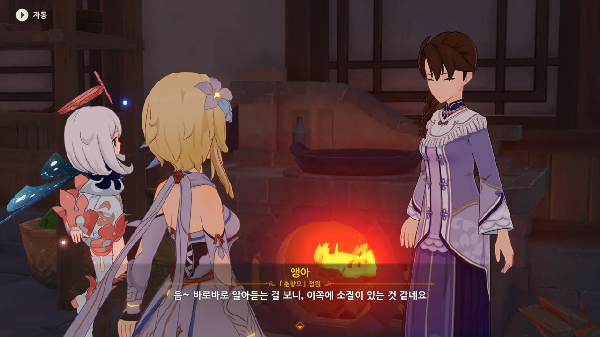
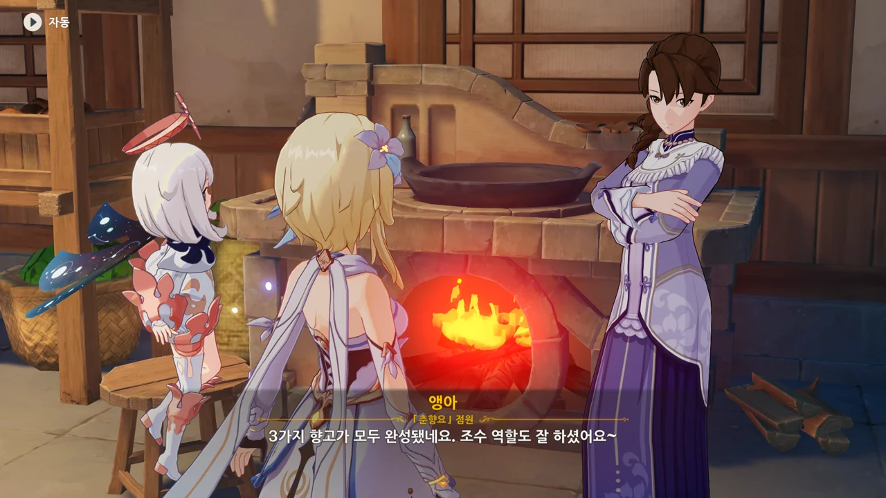
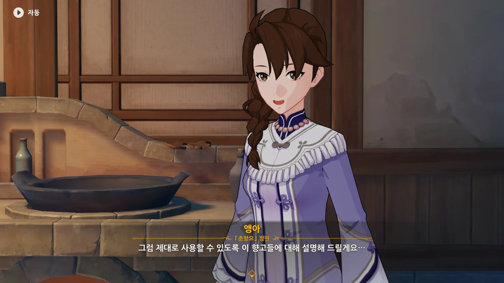
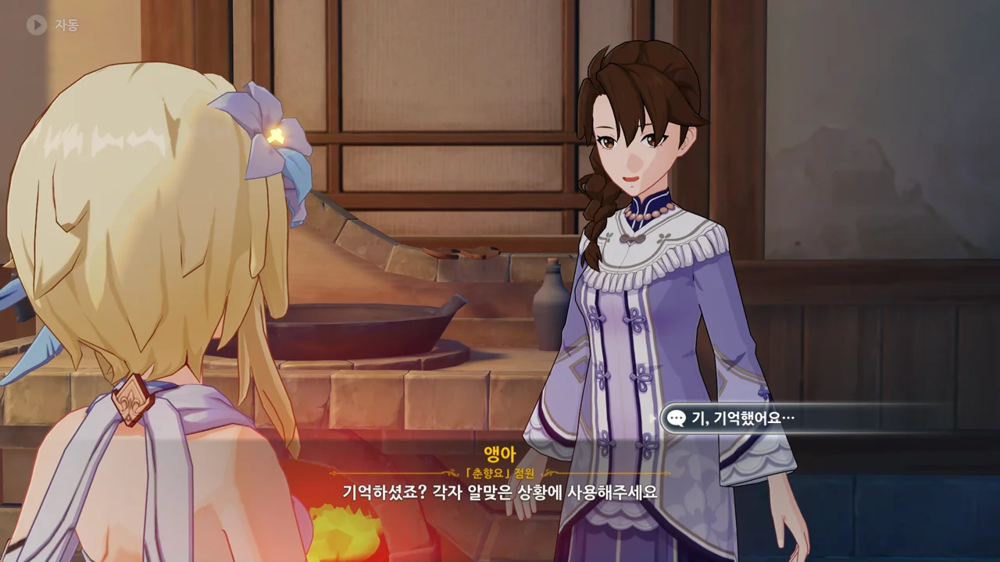
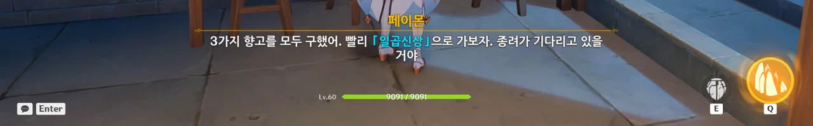
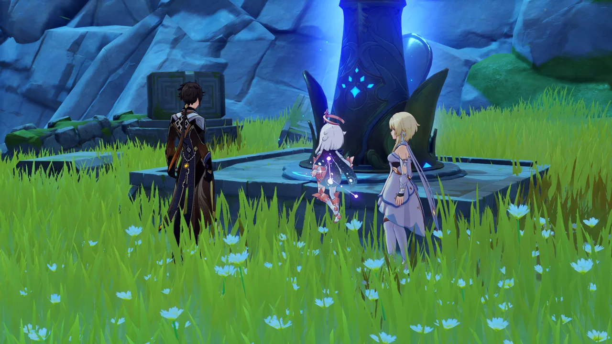
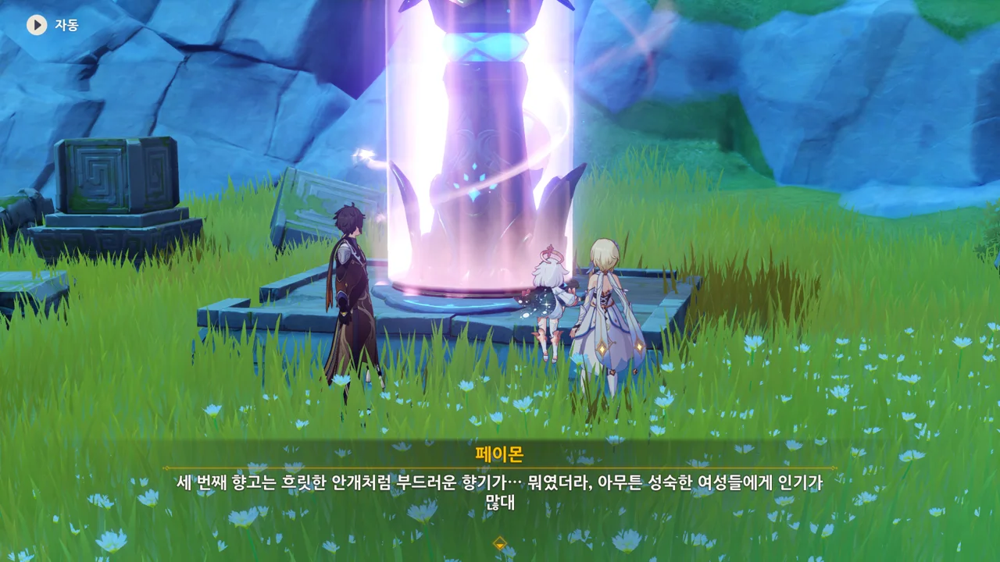

앵아에게 찾아가 보니, 이미 우릴 기다리고 있었다.

아니, 이럴 거면 그냥 처음 찾아갔을 때 마신 임무를 진행할 수 있도록 만들어 주면 되는 일 아니었을까?





뭐... 뭐요? 매력이요?

분명 여행자가 온 시내를 누비며 향기로운 사람을 찾은 건 맞지만, 그걸 그렇게 해석하면 좀 곤란한데...

더군다나 여행자와 페이몬이 위험인물인 것처럼 소문이 퍼진 듯하다.

이... 이건 음해야, 음해!



그래도 여행자가 향고 제작을 부탁하러 왔다는 것은 제대로 알고 있다.

엄한 오해를 하고 있었다면 정말 곤란했을 거야...

뭐, 향고를 3개나 만들어 달라는 건 좀 무리한 부탁이긴 하지.



아니, 대체 소문이 어떻게 퍼진 거야! 왜 여행자가 향고를 선물할 상대를 물색 중이라는 소문이 퍼지는 건데?

게다가 그 향고를 암왕제군에게 바칠 것이라고 이야기해도 도통 믿어주질 않는다.

아니, 진짜인데...



으음, 기회가 왔을 때 잡으라는 뜻의 격언인 것 같은데, 지금 여행자가 양다리, 아니 세 다리를 걸치려고 하는 것으로 오해하는 상황에서 그런 조언을 건네는 건... 좀 이상하지 않나?





에, 향고를 만들 장소도 필요해? 그냥 여기서 만들면 안 돼?

고심 끝에 이미 한번 잘 빌렸었던 타타우파 협곡을 골랐으나, 너무 멀다며 만민당의 주방을 빌리자고 한다.

그래도 되는 거야?

묘 사부. 진짜 우리 주방 빌려도 되는 거 맞아?

솥에서 음식을 만드는 것도 아니고 향고를 만드는 건데, 정말 괜찮은 거 맞아?

앵아가 묘 사부에게서 허락을 맡았다고 하니, 별말은 더 않겠지만...



> 절 책임질 준비, 되셨죠?
> 「조수」로서의 책임 말이에요, 하하하...

아, 그런 드립 치지 말아요... 간 떨어지잖아...



물을 떠 오라기에 만민당 건물 뒤로 가니 정말 물이 한 바가지 있었다.

왜 난 이런 장소가 있단 걸 이제서야 알게 된 거지?



이제 예상꽃의 정유를 추출해달라고 한다.



이거, 분명 섹드립이다.

내가 음란 마귀에 씐 것인진 몰라도, 앵아가 '절굿공이'를 마치 '남자의 기둥' 다루듯이 설명하고 있는 것으로 보인다.

앞서 한 드립과 함께 엮어 생각하면 크흠흠... 🙄😳



정유는 근처에 있는 합성대에서 하면 된다.

처음 이 부분을 진행할 때, 하나만 정유한 채로 앵아에게 갔다가 나머지 둘도 정유해야 한단 걸 깨닫고 다시 한번 왔다 갔다 한 적이 있다.



다 같은 예상꽃인데, 다른 향기가 난다는 게 좀 신기하네.





이제 남은 건 정유를 물에 넣고 수분이 거의 증발할 때까지 끓이는 것이다.

초등학생 때였나, 장미를 이용해 향수를 만드는 실험을 한 적이 있었다.

거기선 휘발성을 위해 알코올을 썼는데, 지금 우리가 만드는 건 향수가 아니라 향고니, 물만 써서 만드는 것 같다.

드디어 세 가지 향고가 모두 완성되었다.



아니라고 해도 자꾸 여행자를 무슨 바람둥이처럼 생각하는 게 못마땅해, 앵아를 곯려줄 생각으로 "당신만 생각하고 있었어요"라는 선택지를 골랐는데, 오히려 역효과를 낸 것 같다.



앵아에게서 각 향고에 관해 설명을 들었다.

* 첫 번째 향고(「금옥장교」): 달콤하고 몽환적인 느낌. 소녀들이 아주 좋아함.
* 두 번째 향고(「산음금족」): 고급스러운 향. 부잣집 아가씨들에게 인기가 많음.
* 세 번째 향고(「표묘선연」): 부드러운 향이 오래 감. 성숙한 여성들이 좋아함.





아니, 진짜 그거 아니라니까...

종려가 기다리고 있을 일곱신상으로 서둘러 가자.



꽃이 향고나 향수가 되는 건 볼 때마다 신기하다니까...

종려는 여행자와 페이몬이 온 것도 눈치채지 못한 채 일곱신상만 우두커니 서서 바라보고 있다.



별로 오래 기다리지 않았다고 하는데... 대체 그는 일곱신상을 보며 무슨 생각을 그렇게 깊게 하고 있었던 걸까?

종려가 모락스란 건 알고 있지만, 대체 그가 신상을 보며 무슨 생각을 한 건지는 도저히 모르겠다.



모락스는 일곱 집정관 체제가 정립되기 전부터 살아온 존재이며, 그 후로 지금까지 죽지 않고 살아온 존재이니, 모락스는 '암왕제군의 신상'보다 오래 존재했다.

이 정도면 진짜 조각상과 비교해도 될 정도인데?







갖고 온 향고를 「금옥장교」, 「산음금족」, 「표묘선연」 차례로 신상에 바친다.

「표묘선연」으로 만든 향고를 바치자, 신상이 분홍빛으로 잠시 빛난다.



「표묘선연」으로 만든 향고는... 분명 부드러운 향이 오래 가서 성숙한 여성들이 좋아한다고 했던 것 같은데...

지금은 암왕제군이 종려임을 알지만, 처음 할 때는 '바위 신이 정말 여성체인가?'라고 생각했었다.



> 「암왕제군」은 여러 모습으로 변하실 수 있으니, 그런 모습이 있을지도 모르겠군.

암왕제군인 종려의 이 발언 때문에, 일부 이상성욕을 가진 사람들이 환호했다는 이야기를 들었다.

원신 2차 창작에서 드물게 종려가 여성으로 등장하는 건 다 이 대사 때문이다.

그런 건 들어본 적 없다고? 날 믿어라. 분명 존재한다. 알고 싶지 않은 정보였지만...



하지만 난 리월 칠성과 타르탈리아가 정확히 무슨 이해관계가 맞아서 뒤에서 이렇게 협력하고 있는지 알고 싶다고.

타르탈리아가 나중에 무슨 일을 한 건진 이미 한 번 봤으니 알지만, 리월 칠성이 우인단과 협력하는 이유는 도저히 모르겠단 말이지...



그다음으로 「척진령」을 빌려와 달라고 한다.

현재 「척진령」은 '종려의 오랜 벗', 평 할머니가 갖고 있다고 한다.

'젊은 사람이 할머니와 오랜 벗'이라는 점에서 종려의 정체를 의심한 사람도 아마 있을걸?

벗을 사귀는 데 나이를 따지진 않지만, 그게 쉬운 일인 것도 아니지 않은가.



종려는 직접 가기엔 곤란한 사정이 있다며, 여행자에게 부탁한다.

난 종려가 왜 그러는지 충분히 알 것 같지만.
