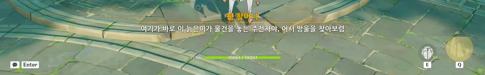
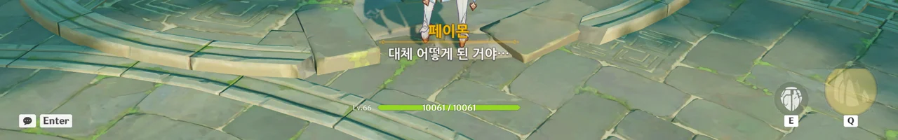
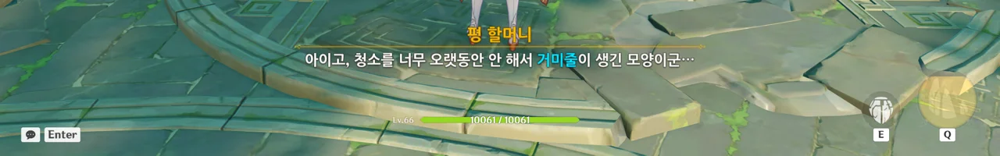
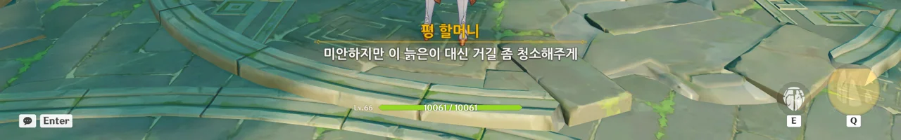
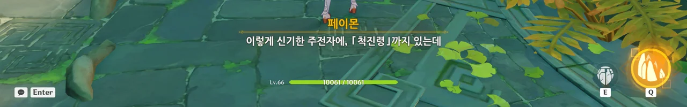
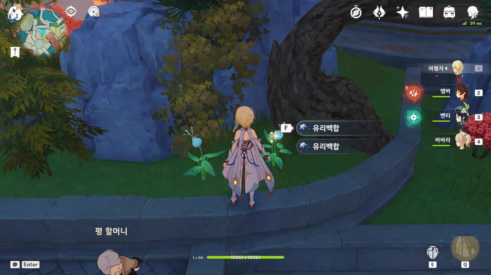
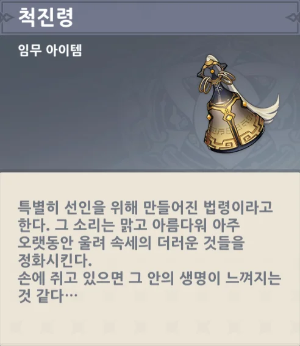

평 할머니가 유리백합을 보며 "세상만사 인생무상"을 혼자 중얼거리고 있다.



응? 유리백합이 곧 시들 거란 걸 대체 어떻게 아는 걸까? 오래 살았으니 그 경험에 근거해 말하는 건가?





옛날엔 다들 유리백합이 사람의 감정을 이해한다고 믿었다고 한다.

웃음소리나 노랫소리 같은 좋은 소리가 들리면 유리백합도 잘 자라고, 유언비어 같은 안 좋은 소리가 들리면 유리백합도 빨리 시들어 버린다고 생각했다고 한다.

식물에 다정한 말을 해주면 무럭무럭 쑥쑥 잘 자라고, 험한 말을 하면 시커멓게 시들어 버린다는 유사 과학이 퍼졌던 때가 생각나게 하는 말이다.



암왕제군이 죽었다는 소식이 온 리월항에 퍼진 후, 리월항에 온갖 별의별 유언비어가 퍼졌다고 한다.

이게 우인단의 음모라고 주장하는 말도 있고, 「바닷속의 그것」이 날뛰기 시작했다는 말도 있고, 리월 칠성이 꾸민 자작극이라는 말도 있다.

&nbsp;

그런데 전부 틀린 말은 아닌 거 같은데?

* 우인단의 음모인가?  
  절반 정도는 그렇다. 나중에 타르탈리아가 하는 걸 보면 우인단이 음모를 꾸민 것이 맞으니.
* 「바닷속의 그것」이 날뛰는 건가?  
  그렇다.
* 리월 칠성이 꾸민 자작극이다.  
  이건 나도 잘 모르겠다.

유언비어, 헛소문으로 치부하기에는 너무 잘 맞는 거 같다.

아무튼 우리가 여기 온 이유는 평 할머니에게서 「척진령」을 빌리기 위해서이다.





평 할머니가 갖고 있는 척진령은 평 할머니가 젊을 적, 친구가 몸에 지니고 다니던 것인데, 평 할머니가 그걸 계속 뚫어져라 쳐다보니 친구가 나중에 누가 척진령을 빌리러 오면, 주저 없이 내어주라는 말과 함께 선물로 준 것이라고 한다.

처음에는 여러 사람이 종종 척진령을 빌리러 왔지만, 언제부턴가는 아무도 척진령을 빌리러 오지 않았다고.

&nbsp;

'선율이 흐르는 밤' 이벤트에서 나온 이야기와 조합해 생각해 보면, 평 할머니가 말하는 '친구'란 암왕제군을 말하는 것이다.

그러고 보니, 이때 평 할머니가 거짓말은 안 했네. 친구가 몸에 지니고 다니던 것이라 했지, 친구가 만들었다고 한 적은 없지 않은가. 「척진령」을 만든 건 암왕제군이 아니라 귀종이었으니.



> 음... 그리고 찾는 김에 집 청소도 해줄 수 있어.

뭔갈 찾는다는 게 다 그런 거 아니겠는가.

어디 깊숙한 곳에 처박혀 있는 걸 꺼내기 위해 온 집안을 헤집은 후, 그걸 다시 원래대로 정리하면서 겸사겸사 정리 정돈과 청소를 하는 것이다.



평 할머니의 집은 저 주전자 안에 있다고 한다.

그래, 나중에 여행자도 평 할머니에게서 속세의 주전자를 받아 노숙 생활을 일단은 끝내게 되긴 하지... 그게 언제였더라?



> 못 들어가! 내가 저길 어떻게 들어가?! 그리고 왜 내가 들어가야 되는데? 그냥 뚜껑 열고 보면 되잖아!?

평 할머니의 집이 주전자 안에 있다길래, 페이몬이 들어가서 보면 되겠다고 하니 페이몬이 화를 낸다.

그런데 페이몬이 말하는 게 평소보다 더 빠르게 말하는 거 같은데... 혹시 뭐 찔리는 거라도 있니?



평 할머니의 말을 듣고 주전자를 건드려 보자, 주전자에서 초록색 연기 같은 것이 나와 여행자를 감싼 후, 여행자를 주전자 안으로 끌고 들어간다.

응, 정말 오랜만에 오는 곳이네. 저기 저 앞에 있는 거미도 그렇고.

누가 주전자 안에 이렇게 넓은 공간이 있으리라 생각했을까.

류운차풍진군의 선계 같은 경우, 입구가 컸으니 그 안이 커도 그런가 보다 할 수 있었지만, 주전자는 정말 의외였다.

&nbsp;

그런데 선계란 대체 어떤 공간인 걸까?

상식과 과학을 기반으로 생각했을 때, 그 작은 주전자 안에 이 넓은 공간을 넣는다는 건 절대로 불가능한 일이다.

사람의 크기를 줄이면 되지 않느냐고 할 수 있지만, 그러면 사람의 몸을 이루고 있던 물질은 대체 어디로 갔다 돌아오는 것이란 말인가?

그래서 생각한 것이, 사실 선계 입구란 다른 공간을 잇는 포탈 역할을 하는 것이 아닐지 하는 것이다. 아예 이 공간이 주전자 바깥의, 알 수 없는 공간이라면 이 모든 게 말이 되니까.

그런데 여기에 거미줄이 생길 정도면 대체 얼마나 오랫동안 청소를 안 한 걸까? 그냥 거미줄도 아니고, 불화살을 너덧 번 먹여야 할 정도로 튼튼한 거미줄이던데.

사람이 오가며 청소하지 않았을 리가 없으니, 평 할머니는 설마 이 선계에 오랫동안 발을 들이지 않았던 것 아닐까?

어째 거미줄이 튼튼하다 싶었는데, 원소로 만들어진 거미줄이라고 한다. 정작 그 거미줄을 짠 거미는 물리 공격을 하던데.

그건 '선율이 흐르는 밤' 이벤트를 하면 알 수 있다.

걱정 마. 나중에 우리도 하나 받으니까.

설마 이게 평 할머니의 전 재산인 건가? 굉장히 소박하네...



척진령을 회수했는데도 왜 나가는 길이 없나 궁금해했는데, 평 할머니가 출구를 열어줘야 나갈 수 있는 거였다.



제자리에서 눈을 감고 있다가 다시 뜨는 여행자.

설마 이번 선계는 그저 환상일 뿐이었고, 여행자와 페이몬은 여기 서서 꿈을 꾸고 있던 건 아니겠지?



평 할머니에게 선인이 맞냐 물어보아도, 이미 알고 있지 않느냐고 어물쩍 넘어간다.

뭐, '선율이 흐르는 밤' 이벤트를 했으니 평 할머니가 선인이 확실하단 건 잘 알고 있다.



어... 그게 그렇게도 해석이 되나...?



범인을 잡는 데에만 정신이 팔려 송신의례를 그르치는 건 이치에 어긋난 일이라고 말하는 평 할머니.





만약 종려가 척진령을 돌려주지 않으면 어떻게 할 거냐고 장난스럽게 물어보자, 그때에는 직접 찾아가 같이 차라도 마시며 이야기하겠다고 말하는 평 할머니.





종려가 척진령을 빌려와 달라고 한 건, 범인 잡는 데에만 정신이 팔려 송신의례를 하지 않는 상황을 지켜볼 수만은 없어 직접 나서는 것이라고 말한다.

종려에게 "시간 되면 와서 차나 한잔하게. 별 볼 일 없는 늙은이이지만 찻주전자 정도는 있다네."라는 말을 전해달라는 평 할머니.

&nbsp;

잠깐 상황 정리를 해보자.

'선율이 흐르는 밤'에서 나온 이야기에 근거해 추측하면, 평 할머니가 척진령을 갖고 있는 걸 알고 있는 사람은 귀종과 어느 정도 친분이 있던 암왕제군, 류운차풍진군 정도밖에 없을 것이다.

여행자가 척진령을 빌리러 온 걸 보고 평 할머니는 그들 중 하나가 여행자에게 그 정보를 알려줬음을 눈치챘을 것이다.

류운차풍진군 등의 선인이라면 여행자를 거칠 필요 없이 척진령을 빌리러 직접 왔을 것이다. 하지만 여행자를 대신 보냈다는 건, 그 사람이 뭔가 사정이 있어 평 할머니에게 모습을 드러내기 힘들다는 걸 의미한다.

그리고 최근 신변에 변동이 있는 선인 중, 해당 조건을 만족하는 건 암왕제군 하나밖에 없다.

&nbsp;

그러니까... 평 할머니는 암왕제군이 아직 살아있음을 벌써 눈치챈 것이 분명하다.

와, 아까 이 유리백합은 채집할 수 없게 되어 있었는데... 유리백합 2개를 꽁으로 먹었다.

이 유리백합도 내 배낭 속에서 영원토록 보존되는 걸 원할 거야, 분명.

> 척진령
> ***
> 특별히 선인을 위해 만들어진 법령이라고 한다. 그 소리는 맑고 아름다워 아주 오랫동안 울려 속세의 더러운 것들을 정화시킨다.
> 손에 쥐고 있으면 그 안의 생명이 느껴지는 것 같다...
{.bq}

척진령이 한자로 어떻게 되어 있나 찾아봤는데, 涤尘铃이라고 한다. 씻을 척, 티끌 진, 방울 령 이렇게 해서 '먼지를 씻어내는 방울'이라는 뜻이다.
