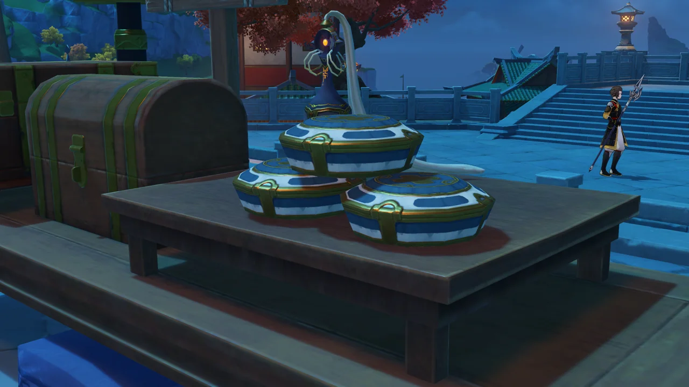
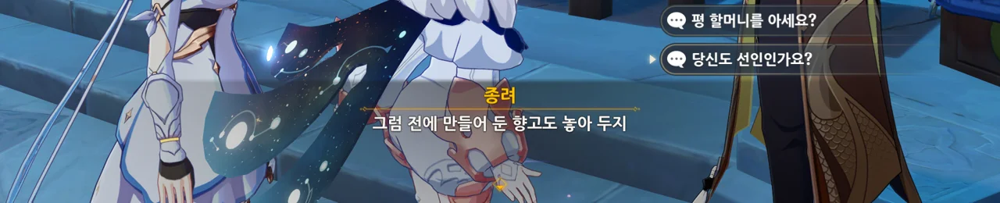
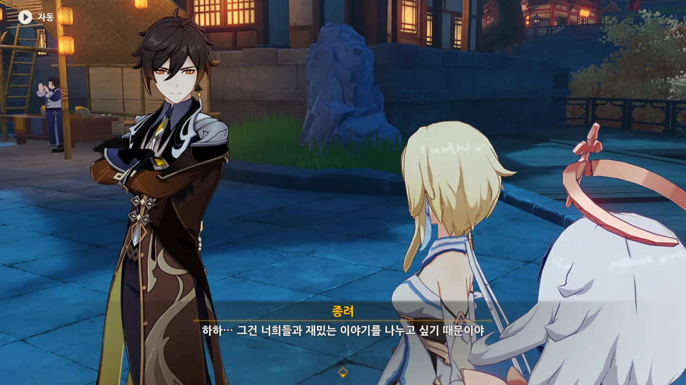
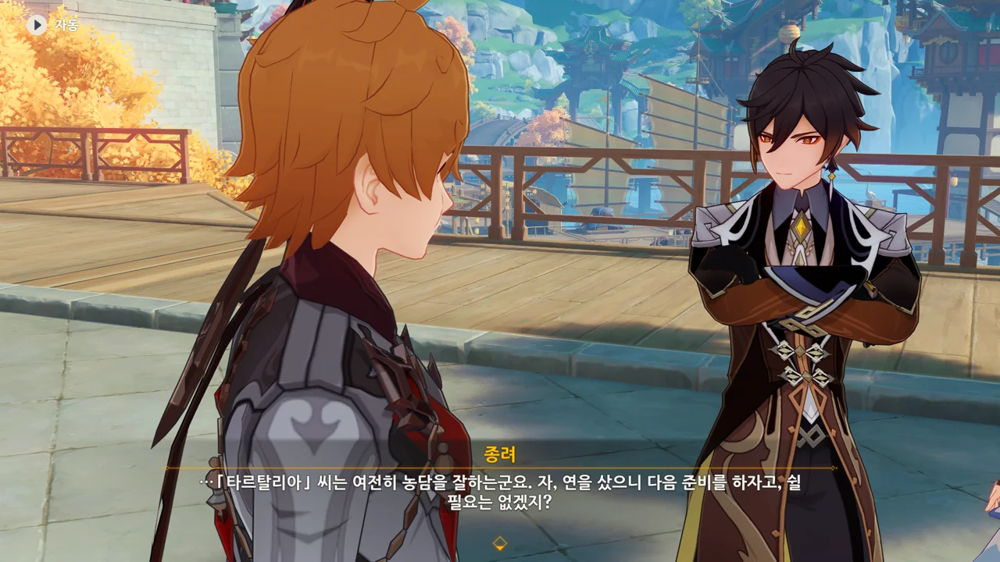
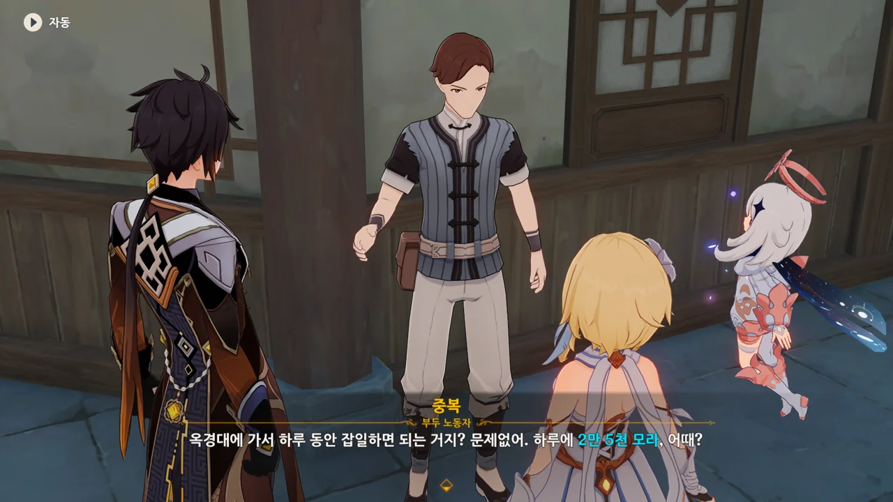
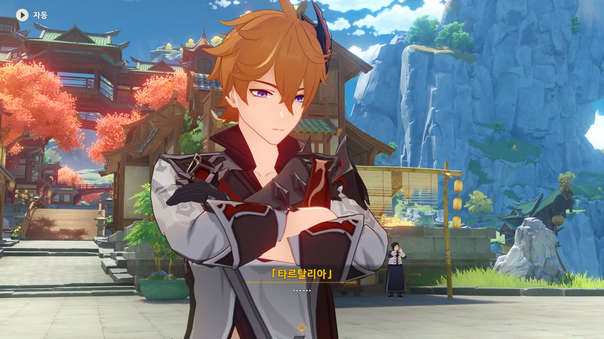
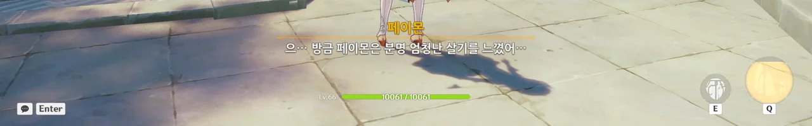



향고와 함께 척진령을 놓아두었다.

그런데 분명 향고 그릇의 색이 원래 다 각각 다르지 않았나? 왜 여기선 파란색 일색이지?



종려에게 선인이냐고 묻자, 말을 길게 늘이며 답하지 않는다.

종려도 선인이긴 하지...





페이몬이 평 할머니의 목소리를 흉내 내며 평 할머니의 전언을 전한다.

종려 말처럼, 페이몬이 할머니 목소리를 내니까 정말 이상하더라.



이다음에는 연을 사야 한다고 한다.

연? 웬 연?



> 우리랑 연 놀이 하려고? 잠깐 쉬어가는 시간인 거야?

그럴 리 없잖아, 욘석아! ㅋㅋㅋㅋㅋㅋ

연을 사야 한다는 이야길 듣고 곧바로 연 놀이를 할 거로 생각한 페이몬이 너무 귀엽다.

음... 종려라면 아마 연 놀이는 안 하지 않을까?



함께 송신의례를 준비하기 전에 이미 아산파에게 연 제작 주문을 한 것 같다. 그렇지 않고서야 가자마자 연이 다 완성되었다고 할 리 없지 않은가.

그런데 연을 일곱 개나 주문했다고?

&nbsp;

지금 이렇게 보니, 원신이 NPC 모델을 너무 많이 돌려 쓴다는 게 확 느껴진다. 아산파의 모습이 평 할머니와 너무 많이 닮았다.



이렇게 보니, '왕생당의 객경'이라는 자리가 정말 둘러대기 좋은 자리 같다.

의복, 양식, 주옥과 자기 이야기를 해도 자연스럽고, 찻잎과 향료, 화초와 동물 이야기를 해도 자연스럽다. 그는 왕생당의 객경이니까.

'종려'라는 평범한 인간의 삶을 사는 암왕제군이 지나치게 유식한 모습을 보여도, '객경'이라는 자리가 그걸 잘 설명해 준다.

&nbsp;

'객경(客卿)'이 무슨 뜻인가 찾아보았는데, '외국인에게 정치 · 외교 고문 또는 자문 역할을 맡기는 인재등용제도'라고 하더라. 여기선 적당히 '고문 혹은 자문 역할을 맡는 외부인 출신 고위직' 정도로 해석하면 되겠지.

나도 그렇다. 종려와 하는 이야기는 꽤 재미있거든.

종려가 하는 이야기는 왠지 모르게 귀에 착착 감긴다고 해야 할까...



애들 장난감이라고 하니 생각나는 건데, 요즘 애들 장난감은 정말 혀를 내두를 정도로 잘 만들어졌더라. '이래서 장난감 하나가 이렇게 비싸구나'라는 생각이 들기도 하고.



종려가 주문한 일곱 개의 연은 일곱 신을 상징하는 거라고 한다.



바람 신의 문양은 「자유」를 잘 나타내도록 색을 경계 밖으로 칠하기도 했다고 한다.

바위 신의 문양은 「계약」을 따라 그렸는데, 그 문양은 황금옥에서도 찾아볼 수 있다고 한다.

나중에 황금옥에 가게 되면 한 번 찾아봐야지.



아직 황금옥 이야기를 꺼내면 안 돼...



번개 신의 문양은 그녀가 추구하는 「영원함」을 잘 담아내었으며, 「지혜」를 상징하는 풀잎 무늬와 녹나무의 나이테가 연의 뼈대에 잘 녹아들었다고 평가하는 종려.

물의 신의 문양은 「정의」를, 불의 신의 문양은 「전쟁」을 잘 담아내었다고 평가하는데, 왜 얼음 신에 대해선 얼버무리는 걸까?



종려가 지갑을 가져왔을 리 없잖은가.

이번에도 여행자가 연 값을 치르게 생겼다고 생각한 순간, 타르탈리아가 나타나 연 값을 지불하겠다고 한다.



우릴 미행했냐고 추궁하자, 그냥 지나가던 길이라고 하는 타르탈리아.

남의 뒤꽁무니를 졸졸 쫓아다니는 사람들은 다 그렇게 말하더라. 그냥 지나가던 길이라고, 우연히 마주쳤을 뿐이라고.





돈의 가치와 인간 세상의 고통에 대해 잘 알면서, 가난이 자신에게도 닥칠 수 있다는 걸 잘 모르는 걸 보면, 돈이 없는 자기 모습을 상상조차 해본 적 없는 게 아니냐고 종려를 떠보는 타르탈리아.

저 말은 종려가 원래 누구였는진 몰라도, 현재 정체를 숨기고 있단 건 알아차렸다는 말이다.

거기에 "농담을 잘하시는군요"라고 넘긴 후, 곧바로 여행자에게 다음 준비를 하자고 말하는 종려.

자기 정체에 대해 논하는 걸 피하려는 모습이다.



이제 필요한 건 일꾼이다. 종려나 여행자가 모든 걸 만들고 준비할 수는 없지 않은가.

타르탈리아가 돈주머니를 준다.



거 봐. 타르탈리아가 우릴 미행한 게 틀림없다니까.



타르탈리아가 5만 모라라는 거액이 담긴 돈주머니를 줬다.





고작 깊은 산 속에서 수정 나비 몇 마리를 구하는 데에 15,000 모라를 부르는 소복.

하지만 흥정하지 않고 콜을 외친다.

어휴, 내가 평소 잡는 수정 나비가 얼마나 많은데...





목자재를 옥경대로 나르는 데에 20,000 모라를 부르는 대복.

역시 이번에도 흥정 없이 곧바로 부르는 대로 계약했다.

뭐, 무거운 나무를 옥경대까지 나르는 데에는 힘이 꽤 필요할 테니까... 이 정도면 그럭저럭 나쁘지 않다고 할 수 있지.

옥경대에서 하루 동안 잡일 하는 데에 25,000 모라를 부르는 중복.



페이몬이 몬드를 구한 영웅을 봐서라도 좀 깎아달라고 하지만, 그런 거 알게 뭔가.

방문하는 나라마다 그 나라를 위기에서 구해내는 여행자지만, 정작 사람들에게 널리 알려지지 않은 걸 보면 조금 씁쓸하더라.

뭐, 돌아다니기 편하다는 장점도 있으니, 나쁜 것만은 아니지만.



25,000 모라를 전액 지불하겠다는 종려. 하지만 남은 돈은 고작 15,000 모라 밖에 없다.

타르탈리아에게서 잔액을 받으라고 해보지만, 한 번 갔다 오면 될 걸 두 번 갔다 오기 싫다며 거절한다.



하지만 연꽃받침을 하나 주면, 타르탈리아에게 가 잔액을 받겠다고 하는 중복.

&nbsp;

바로 이것 때문에 내가 중복을 제일 마지막에 방문했다. 다른 사람들은 청심 같은 고급 재료를 요구하지만, 중복은 옥경대에서 흔히 볼 수 있는 연꽃받침을 요구하기 때문이다.

청심은 나중에 감우 뽑으면 감우 줘야 한다고. 안 돼.



평소 연꽃받침을 자주 캐두기 때문에, 곧바로 중복에게 연꽃받침을 줬다.



또다시 타르탈리아와 만났다. 우인단을 위해 일했다고 생각하니, 속이 메스꺼워지는데.

> 흥, 겨우 이 정도로 날 매수할 수 있을 거라고 생각해? --- 그래서 다음 자금은 언제 줄 거야?

페이몬... 말이 앞뒤가 다르잖아.



자신이 원하는 정보를 하나 알려준다면 북국은행의 금고를 30분 동안 열어두겠다는 타르탈리아와, 거기에 홀라당 넘어간 페이몬.



우인단이 원하는 게 다 뻔하지. 분명 바위 신의 심장의 위치를 물어볼 게 분명하다.



여행자와 페이몬을 잠시 매섭게 째려본 타르탈리아가 분위기를 다시 돌려놓으려고 하지만, 될 리가 없다.

페이몬이 완전 기가 죽었잖아.





종려가 돌아오자, 급하게 자리를 뜨는 타르탈리아.

오, 방금 째려본 게 살기를 담아 째려본 거였어?

내가 인부들을 고용할 때 협상하지 않은 이유가 바로 이것 때문이다.

협상 없이 인부들이 부르는 대로 모라를 지불하면 원석 5개를 주거든.

모라는 벌면 되지만, 원석은 구하기 힘드니까.
