

불복려 카운터에는 아무도 없다. 점원이 잠시 자리를 비운 걸까?

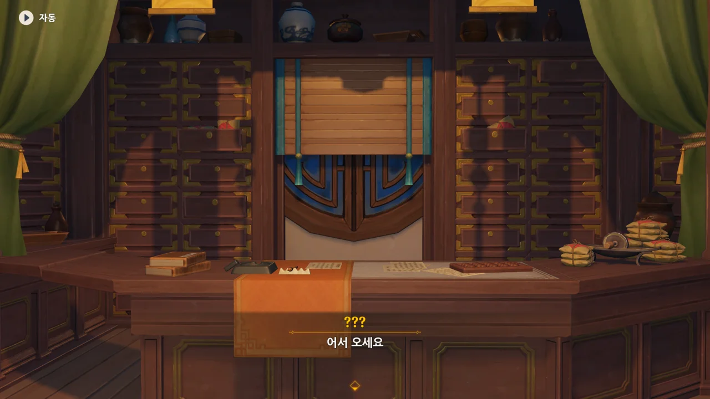

아무도 없는 카운터에서 들려오는 목소리.



종려와 여행자는 무덤덤하게 서 있는 데에 반해, 페이몬 혼자 화들짝 놀란 모습이 너무 귀엽다.

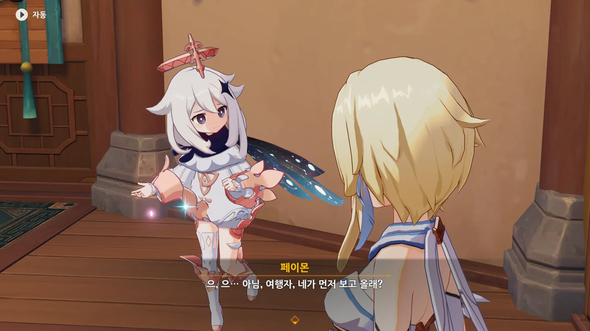

이 녀석, 가기 무서우니까 여행자를 대신 보내려 하네.





카운터에 가까이 다가가자, 모자, 아니 사람 머리가 툭 튀어 오른다.

이번엔 페이몬 뿐만 아니라 여행자도 화들짝 놀랐다.



치치의 키가 카운터보다 작다고 페이몬이 말하는데, 정작 페이몬의 키도 치치 못지않게 아주 작은 편이다.

둘 다 아동형 모델인 거로 아는데, 그러면 둘의 키 차이는 거의 없는 것과 마찬가지 아닌가?



치치의 이마에 부적이 붙어있는 걸 보고 강시냐고 묻는 페이몬.

&nbsp;

사실, 대중 매체에서 흔히 표현하는 '강시 이마에 붙은 부적'은 사실 전승에 따르면 강시의 움직임을 봉하는 목적의 부적이다.

부적이 파손되었을 때 강시의 움직임이 멈춘다는 묘사는 골렘을 만들 때 אמת(진리)라고 쓴 양피지를 머리에 붙이면 골렘이 완성되고, 골렘을 폐기할 때에는 אמת에서 א를 지워 מת(죽음)로 만들면 골렘이 작동을 멈춘다는 전승에서 가져온 것이다.



본인은 '선인의 도움으로 강시가 되었다'라고 말하지만, 치치의 이야기는 조금 더 복잡하고 얄궂다.

&nbsp;

리월 건국 전쟁인 선마대전에 휘말린 평범한 약초꾼 소녀, 치치는 죽기 직전이 돼서야 얼음 신의 눈을 얻었다.

죽음에 대한 공포, 생존에 대한 갈망, 가족에 대한 그리움과 함께 세월을 멈추고 잘 살아가던 때로 돌아가길 원하던 치치의 소망에 반응해 얼음 신의 눈이 나타난 것이니, 이 어찌 얄궂은 일이 아닐 수 있을까.

이를 안타깝게 여긴 선인들이 치치의 몸에 선력을 불어넣어 치치를 부활시켰으나, 되살아난 치치는 몸속의 선력을 제어하지 못해 미쳐버렸고, 하는 수 없이 호박 안에 봉인당하는 신세가 되었다.

수백 년의 세월이 흐르고, 호박 안에 갇힌 치치를 발견한 사람들이 치치를 안장하기 위해 왕생당에 보냈다. 하지만 치치를 가둔 봉인은 오랜 시간이 지남에 따라 약해져 이송 도중 깨졌고, 봉인에서 벗어난 치치는 생전 약초를 채집하던 습관에 따라 숲으로 향했다.

숲에서 치치는 불복려의 주인, 백출을 만났고, 백출은 치치를 거두게 되었다.

&nbsp;

뭐, 이외에도 치치가 선인으로 인정받고 선인명을 받은 이야기도 있지만, 그것까지 이야기하려면 이야기가 조금 더 복잡해지니 그건 다음으로 미루겠다.

몬드뿐만 아니라 다른 곳에서도 치치와 같은 강시나 좀비는 찾아볼 수 없을걸?





종려가 「영생향」이 있냐고 물어보지만, 치치는 「칙령」 때문에 처방전이 없으면 약을 꺼내 올 수 없다고 한다.

향도 약으로 치는 거야?

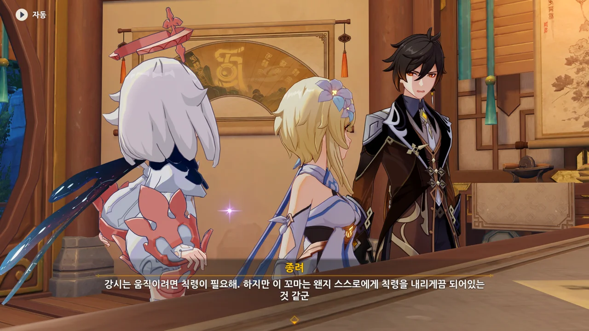

치치는 특이하게도 스스로 칙령을 내리는 강시이다. 지능형 로봇과 비슷한 거로 생각하면 되려나.

그렇다면 자신에게 내린 칙령을 지금 여기서 수정하면 우리에게 영생향을 내어줄 수 있는 거 아냐? 그건 또 다른 칙령이나 법칙에 의해 불가능한 건가?



처방전을 소지하지 않은 채 영생향을 구매하려면 치치를 도와줘야 한단다.



치치를 도와줘야 하는 게 치치의 칙령 때문인 걸까, 아니면 리월에서의 거래의 미덕 때문인 걸까?

페이몬 말처럼, 손님이 물건을 사러 왔는데 물건을 사려면 점원을 도와야 한다는 상황이 뭔가 이상하게만 느껴진다.

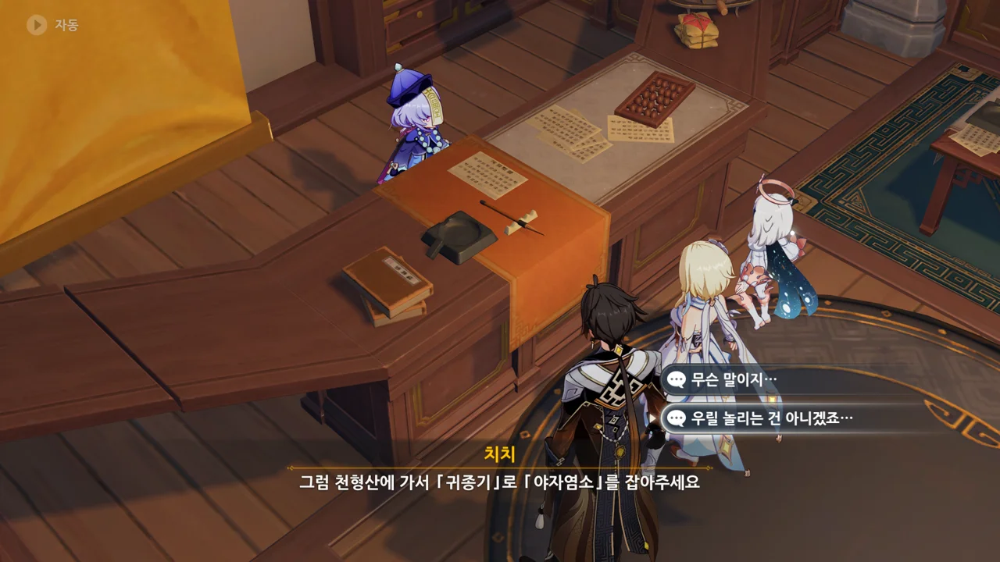

천형산에 가 「귀종기」로 「야자염소」를 잡아달라는 치치.



「귀종기」는 옛 선인들이 천형산에 설치한 대포의 일종으로, 거대한 마물을 스스로 맞받아쳐 외부로부터의 위협을 막을 수 있는 기관 장치라고 한다.



나만 여기서 이 두 대사가 떠오르는 걸까?

> 넌 뭐든지 아는구나
> 뭐든지는 몰라. 알고 있는 것만.
{.bq}

하지만 종려도 「야자염소」가 뭔지는 모른다고 한다.

암왕제군인 종려가 모르는 게 있다고 하니, 신기한 일이지.





치치 역시 「야자염소」에 대해 아는 거라곤 '전설 속의 반신수'가 전부였다.

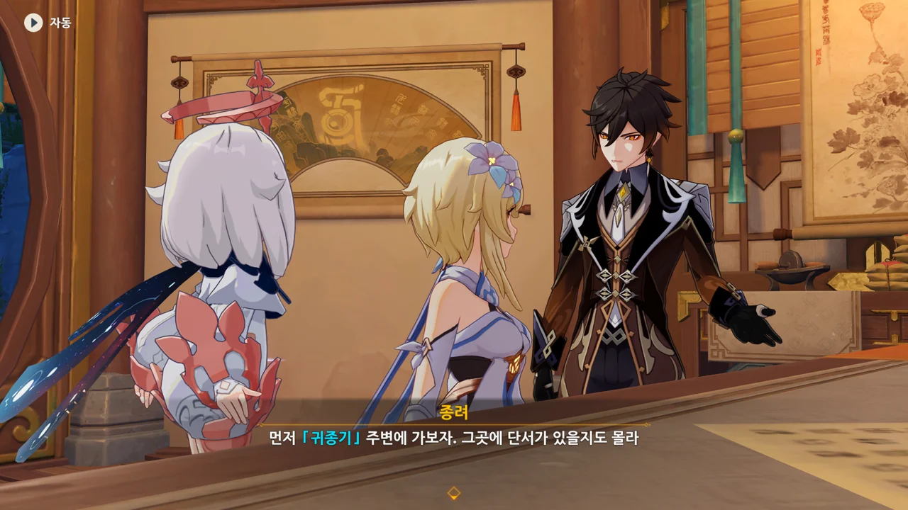

일단 귀종기로 가 주변을 살펴보면 야자염소가 있는지 아닌지 알 수 있겠지.



종려가 귀종기를 대포의 일종이라고 이야기할 때 귀종기의 크기가 클 것은 대강 예상하였지만, 쇠뇌 치곤 제법 많이 크다.

쇠뇌인 건 분명해 보이는데, 쇠뇌에 걸려 있어야 할 현이 보이지 않는다. 기관술로 만들어진 거라 했으니, 현은 따로 필요 없는 걸까?



엑, 지금, 이 귀종기는 고장 난 상태라고 한다. 지금 보니, 현이 없는 게 아니라 끊어져 있다.



> 빨리 그 무한한 「상류층 지식」으로 생각 좀 해봐!

이 정도면 거의 '종려에몽 도와줘!' 수준 아닐까?



그리고 우리의 기대를 저버리지 않는 종려에몽.

근처의 보급소에서 귀종기의 예비 자재를 구해오면 귀종기를 수리할 수 있다고 한다.



물론 우리의 종려에몽은 귀종기를 수리하기 위해 알고 있어야 할 작동 원리를 '대충'은 알고 있다.

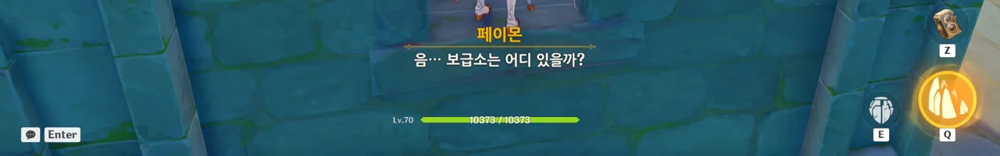

어디에 있긴. 바로 이 건물 안에 있지.



그냥 나무판과 밧줄 같은데... 여기에도 기관술의 묘리가 담겨있다거나 그런 건가?



여행자가 모아온 재료를 갖고 종려가 귀종기를 잠시 만지작거리니, 귀종기가 원래 모습을 되찾았다.

역시 종려에몽이야! 기대를 저버리지 않지! 지갑을 까먹을 거란 기대 역시 저버리지 않아서 문제지만!

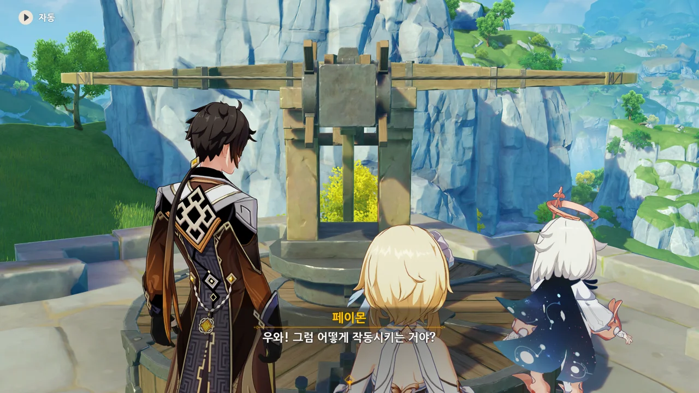



귀종기에는 무려 망원 기능까지 달려 있었다.

망원경처럼 보이는 부품은 전혀 없었는데, 망원 기능을 제공하다니... 이게 선인의 기관술?



망원 기능을 이용해 주변을 둘러보다 웬 사람들을 발견했다.

어떻게 사람 이름이 '황곰보'?

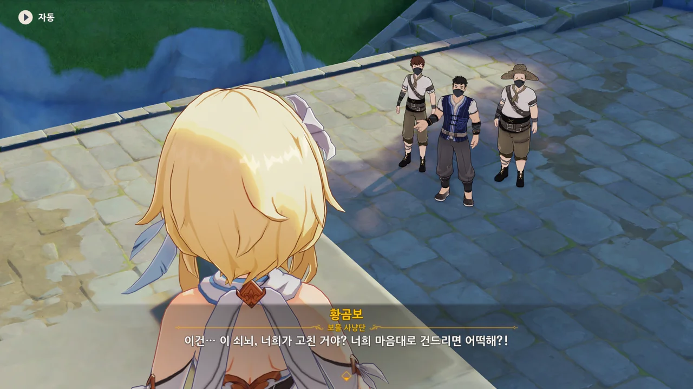

귀종기를 고쳤다고 화를 낸다. 보통은 정반대 아냐?



통성명을 요구하는 종려에게 보면 모르겠냐며, 보물 사냥단이라고 밝히는 곰보.



귀종기가 이 일대의 보물을 도굴하려는 보물 사냥단을 위협이라 판단했는지, 보물 사냥단을 공격한 모양이다.

귀종기가 크니 거기서 발사된 화살도 꽤 클 텐데, 거기에 꼬치고기가 될 뻔한 보물 사냥단원도 있었다고 한다.

그래서 이들이 *목숨을 걸고* 귀종기를 망가뜨렸다.

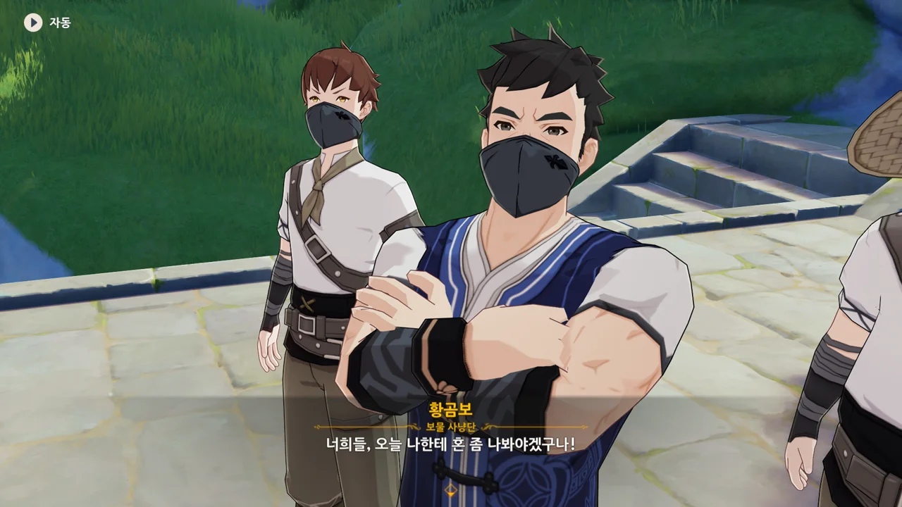



귀종기를 망가뜨려 놓고 되레 화를 내는 보물 사냥단에게 잔뜩 화가 난 목소리로 "혼나야 하는 건, 너희다."라고 말하는 종려.

이후 보물 사냥단을 잔뜩 혼내주었다.



심란한 게 아니라 귀찮았다.

플랫폼 밑으로 떨어졌으면 곱게 죽을 것이지, 멀쩡히 살아 아래에서 여행자를 공격해 대는 탓에, 아래까지 내려가 아직 죽지 않은 녀석을 처치한 후, 다시 위로 올라와 다음 웨이브를 상대해야 했기에 정말 귀찮았다.



반신수라면 선인의 장치로 찾아내기 쉬울 텐데, 이 주변엔 흔한 야생 동물밖에 보이지 않는다.



하지만 틀린 말은 아니잖아...



불복려로 돌아가, 치치에게 야자염소를 찾지 못했다고 솔직하게 말하기로 했다.

우린 최선을 다했다고.



치치에게 사실을 말하자, "할 수 없죠"라고 말하며 실망하는 치치.

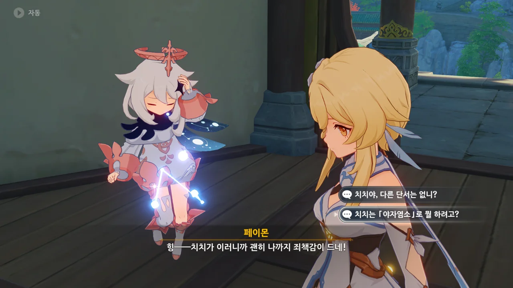

그런데 치치는 대체 야자염소로 뭘 하려던 거였을까?

야자염소에서 나오는 우유는 다른 산양유보다 훨씬 맛있다고 한다. 그러니 야자염소는 그냥 염소가 아니라 반신수일 것이라고 한다.

어... 그러니까, 우유가 훨씬 맛있다는 이유로 야자염소가 반신수라고 추측하는 거였어?



치치가 적어둔 우유의 이름은 「코코넛우유」였다.

아니, 그러면 애초부터 야자염소에서 나온 우유가 아니었던 거잖아!



당연히 코코넛우유가 뭔지 아는 셋은 할 말을 잃는다.



종려가 이렇게 사과하는 건 처음 보는 것 같은데.

뭐, 야자염소가 정확히 뭔지, 그거로 대체 뭘 하려는 건지 제대로 물어보지도 않고 덥석 치치와의 거래를 수락한 종려가 잘못한 건 맞지.



치치의 동심을 아무런 거리낌 없이 파괴했다.



갑자기 나타나 치치에게 보람찬 인생 수업을 해주어 고맙다고 하는 사람.

이 사람이 불복려의 주인, 백출이다. 치치를 거둔 사람이기도 하고.





페이몬은 여태 치치가 불복려의 주인인 줄 알았던 모양인지, 불복려의 주인이 치치가 아니라 백출이라는 말에 깜짝 놀랐다.

그리고 '목에 달린 약재'라는 말에 발끈한 장생이 페이몬을 "치치보다 더 순진한 사람"이라고 까댄다.

아니, 그래도 보통 사람은 목에 뱀을 두르고 다니진 않잖아. 이건 장생이 오해를 살 만했다.



오, 영생향을 이제 살 수 있는 건가?



에이, 그럼 그렇지. 무슨 향 하나가 300만 모라나 해? 아무리 최상급이라고 해도 그렇지...

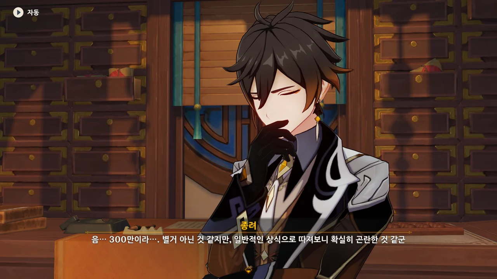

> 음... 300만이라... 별거 아닌 것 같지만, 일반적인 상식으로 따져보니 확실히 곤란한 것 같군.

드디어 종려에게도 금전 상식이라는 게 탑재되는 건가?

뭔가 당연한 말을 큰 깨달음을 얻은 것처럼 이야기하니, 웃기긴 하다만.



종려는 물론이요, 여행자 역시 300만 모라를 낼 재간은 없는지라, 별수 없이 타르탈리아에게 도움을 청할 수밖에 없다.



「야자염소」에 놀아난 여행자의 이야기를 듣고 대폭소를 터트리는 타르탈리아.

이야기 잘 들었다며, 보답으로 자금 문제를 해결해 주겠다고 한다.

어휴... 누굴 탓할 수도 없고...



타르탈리아가 우인단이 코코넛우유의 공급 루트를 연결해 주겠다고 제안한다.

이게 말이 공급 루트 연결이지, 이걸 받아들이면 우인단과 협력 관계가 되는 것과 다름없다. 그래서 장생도 경계하는 거고.



하지만 코코넛우유를 조르는 치치의 모습을 보고, 백출은 타르탈리아의 제안을 받아들인다.

아, 기념으로 1만 모라를 깎아주기도 했고.

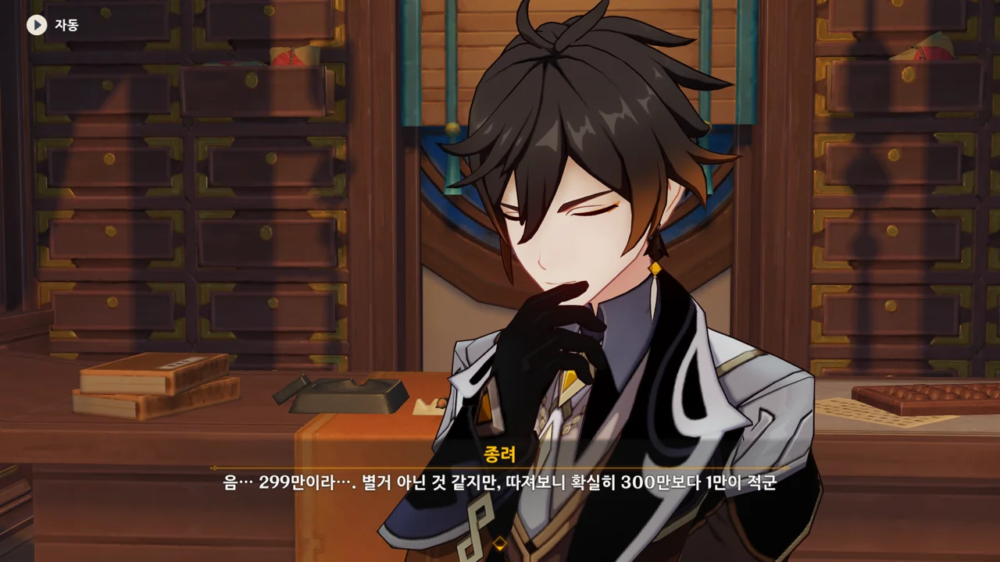

> 음... 299만이라... 별거 아닌 것 같지만, 따져보니 확실히 300만 보다 1만이 적군...

아까 했던 말 취소. 여전히 종려의 경제관념은 박살 나 있다.

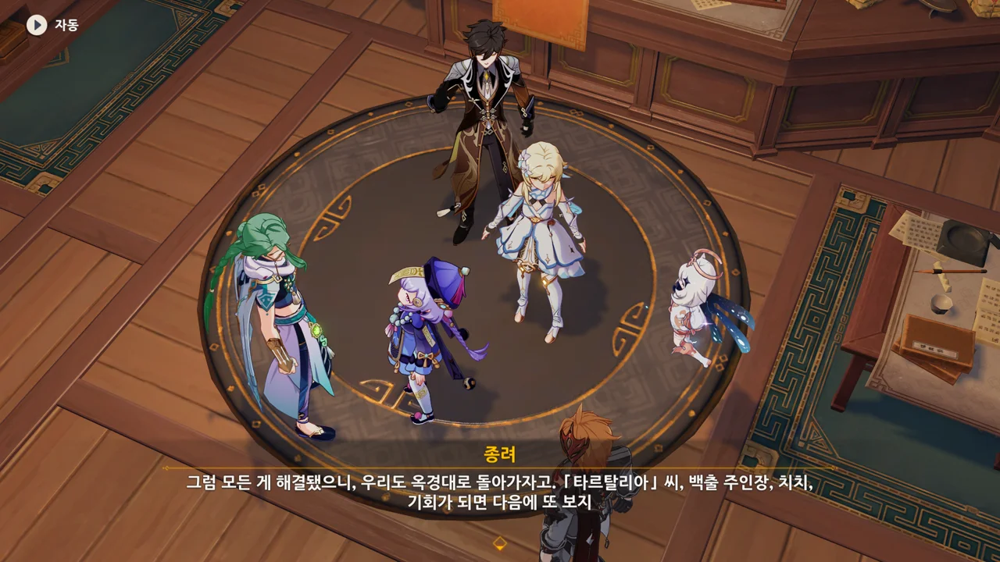

종려는 먼저 옥경대로 돌아간다.



아까 페이몬이 실수로 말한 '리월 칠성이 황금옥 출입을 막고 있다'라는 정보가 타르탈리아가 미리 심어둔 밀정에 의해 우인단에 흘러 들어갔다.

아, 그거 자체가 기밀이었던 거야? 이런 젠장맞을.



그리고 타르탈리아는 거기서 '선조의 허물이 황금옥에 보관되어 있다'라는 걸 유추한다.

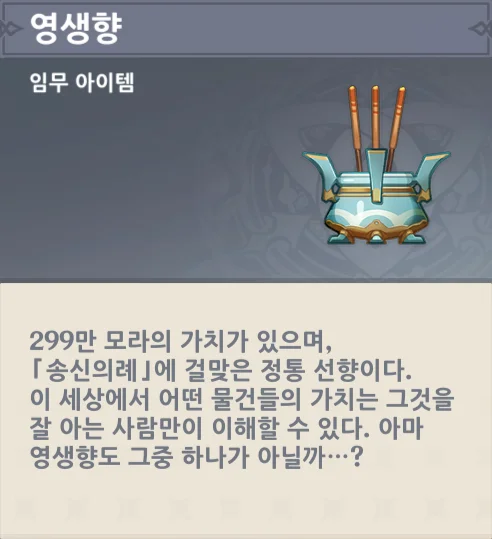

난 아직도 이 향 하나가 300만 모라나 된다는 게 이해가 잘 안돼.

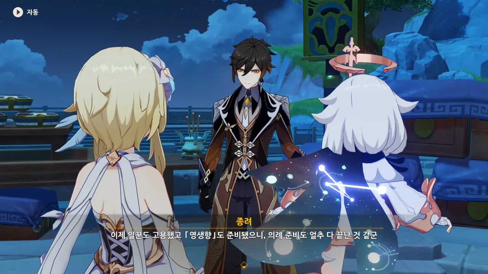

어휴, 드디어 송신의례 준비가 얼추 다 끝났다.



'바위의 신에게 작별 인사를 드리는 여정'에서 내가 얻은 건... 종려의 박살 난 경제관념이었지.



응? 종려가 한턱 쏜다고? 세상에, 세상이 멸망할 징조인가 봐!

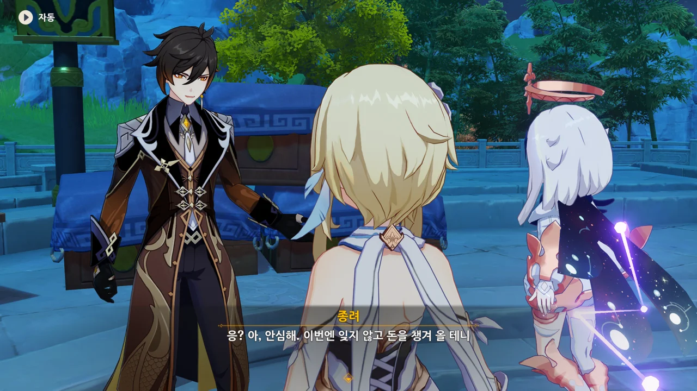

이번엔 잊지 않고 돈을 챙겨 오겠다는데... 왜 이렇게 불안하지. 거기 가서 '아쉽게도 까먹었어'를 시전할 것 같은데...



리월 사람들이 극찬하는 「세 대포 주점」에서 보자고 하는 종려.

&nbsp;

주점으로 떠나기 전에, 여태 모은 송신의례 준비물을 살펴볼 수 있다.



> 최소 「축조」급은 돼야 정식 「청신의례」에 걸맞은 야박석이라고 할 수 있어.
> 타타우파 협곡의 큰 솥이 야박석의 품질을 감별하는 용도로 쓰일 줄 누가 알았겠어.
{.bq}

응? 청신의례가 아니라 송신의례 아냐?



> 의례에 쓰이는 일곱 신을 상징하는 연이라고 한다.
> 오빠를 앗아간 신은 대체 언제쯤 찾을 수 있을까...?
{.bq}

어... 아마 리월 마신 임무가 얼추 끝난 후에?



> 「송신의례」에 꼭 필요한 기구. 속세를 정화시킬 방울 소리로 선인을 배웅하려는 것 같다...
> 이런 진귀한 도구가 거미줄이 잔뜩 쌓인 찻주전자 안에 있었다니.
{.bq}

앞으로 그런 거미는 잊을 만하면 다시 보게 될 것이다.



> 특수한 예상꽃으로 제작된 향고. 은은한 향기를 풍긴다.
> 「암왕제군」은 어째서 이런 성숙한 여성들이 좋아하는 향기를 마음에 들어 하시는 걸까...?
{.bq}

이번 송신의례가 암왕제군을 위한 것이 아니라, 죽은 종려의 연인, 귀종을 위한 것이라는 주장을 들은 적이 있다.

그 주장의 제일 큰 근거가 바로 이 성숙한 여성들이 좋아하는 향고였었지...



> 정말 어렵게 구한 「영생향」이다.
> 「송신의례」가 시작될 때 쓰이겠지...?
> 299만 모라의 값을 하는 연기가 피어오르는 걸 볼 수 있겠지...?
{.bq}

여행자도 영생향의 가격에 상당한 충격을 받은 것 같다.

무슨 향 하나에 300만 모라나 하는 건지 정말 모르겠다니까.
