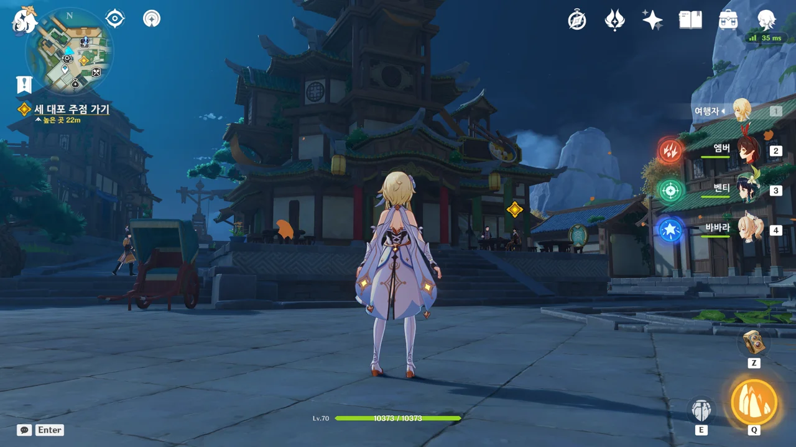
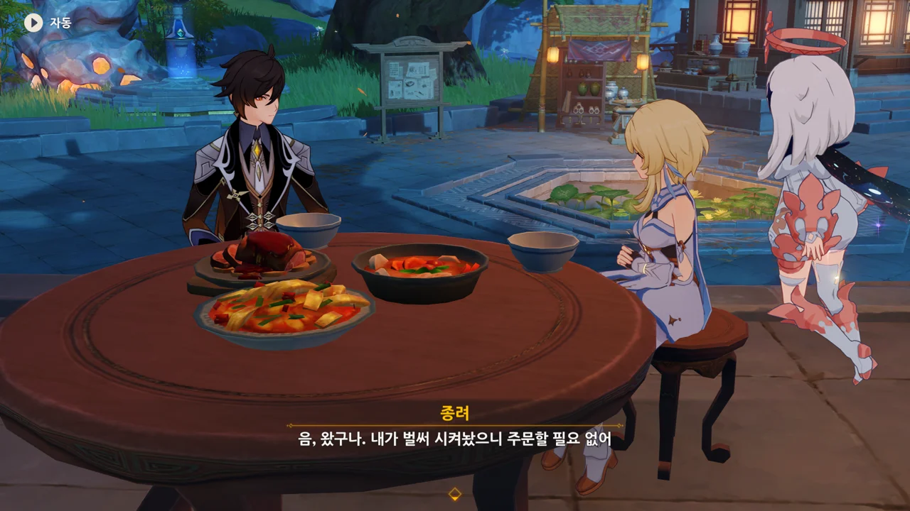
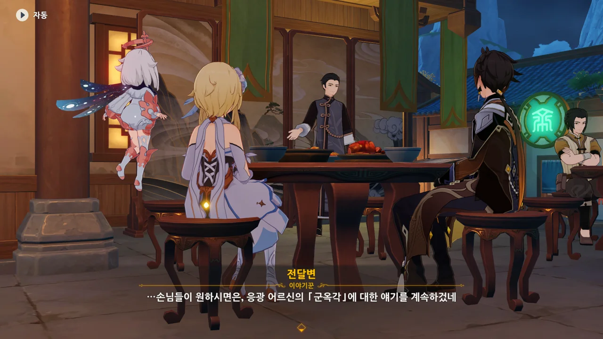
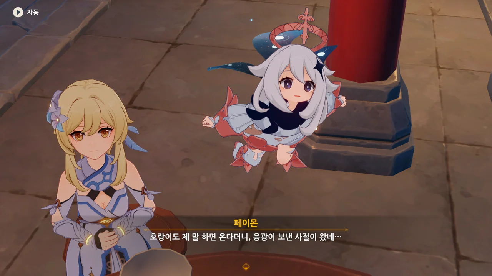
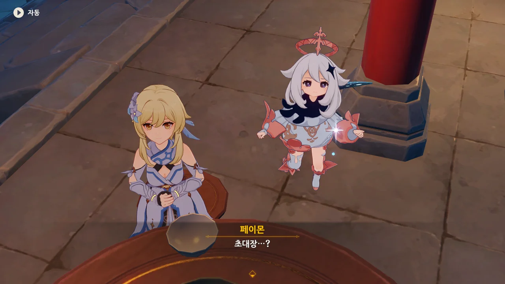
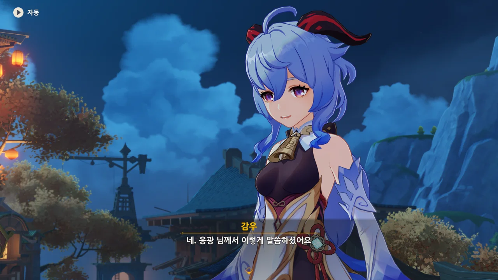
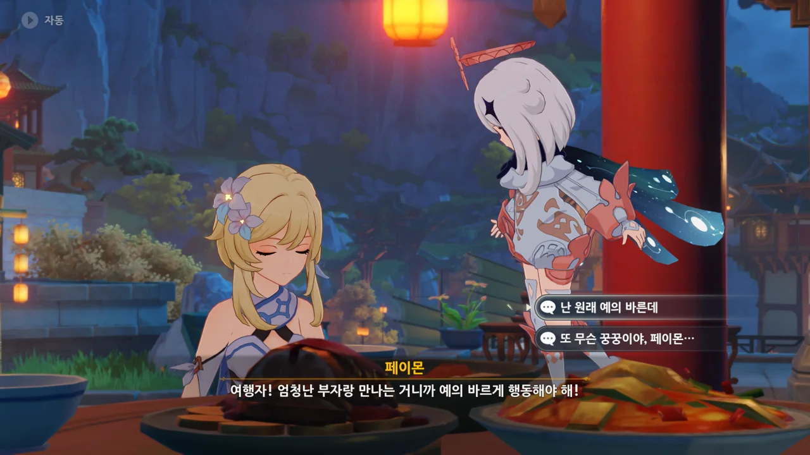
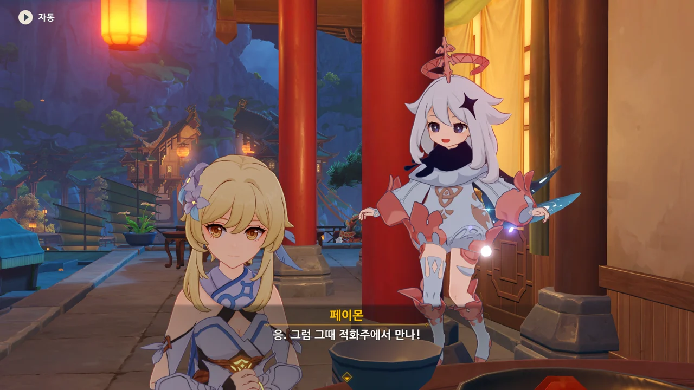

아, 여기가 「세 대포 주점」이었어? 난 항상 여길 '전달변 앞'이라고만 생각하고 있었는데...

종려가 이미 음식을 시켜놓았다고 한다.



종려가 "과일 주스 같은 「애송이」나 마시는 건 주문도 안 받아"라고 할 때, 여행자가 드디어 술을 마시게 되는 건 줄 알았다.

하지만 종려가 시킨 건, 주량원자였다.

&nbsp;

주량원자는 물에 둥글게 만든 찹쌀가루와 감주, 달걀, 설탕을 섞어 끓인 중국의 요리로, 주로 간식으로 먹는 요리다.

굉장히 달다고 하는데, 어떤 맛일지 궁금하긴 하다.

이야기꾼 전달변이 응광의 「군옥각」에 대한 이야기를 계속하겠다고 한다.



종려가 세 대포 주점을 고른 것도 아니나 다를까 종려의 기준 때문이었다.

리월 하면 제일 먼저 떠오를 유리정이나 신월헌 대신 세 대포 주점을 고른 건 종려가 말한 「환경」 때문인 걸까?





> 다들 알다시피, 이 리월항엔 구름 위의 선부와 안개에 둘러싸인 행궁이 있지.
> 수완이 뛰어나다는 게 무엇이더냐? 봐라, 바로 이거야. 이게 바로 응광 어르신이 이루신 업적이지.
> 화창한 날에 저 궁문 밖 갑판에서 아래를 내려다보면 --- 이야! 리월의 전경이 펼쳐지는구나...

응? 왜 감우가 저기에 서 있는 거지?



> 응광 님은 큰일을 치르실 때마다 반드시 이 군옥각에 오셨는데 항상 심복 셋만 데리고 오셨지.



> 이 심복 셋은 왜 데려오셨을꼬? 그야 옆에서 정보랑 자료를 정리하기 위해서였지.

그 많은 정보를 고작 셋이 정리하게 한다고? 저 셋의 노동량이 장난 아니겠는걸...



> 하나둘씩 붙이다 보니 그 수가 점점 늘어나지 않았겠는가.



> 허나 응광 님은 그 벽이 꽈악 차기도 전에 해답을 찾으셨다 하셨소.

그러니까 저 벽에 정리해 붙인 수많은 정보를 한눈에 보며 해답을 찾아낸 거다.

이런 걸 뭐라 해야 할까? 흡사 수사물에 나오는, 각 인물 간의 관계를 실로 표현한 것과 비슷한 느낌일 것이다.





> 결정을 내리고 나면 그분은 모든 자료를 잘게 찢어 창문 밖으로 흩뿌리셨는데,
> 오호라, 사르르르 흩날리는 것이 갑자기 내린 눈발 같다 하였소.





> 그 종잇조각의 글씨들이 리월의 장사꾼들한텐 눈밭에 뿌려진 먹물처럼 눈에 확 들어왔지.

자료를 찢어 버리는 건 자료를 다시 단편화해 자기 생각을 남들이 알기 어렵게 만드는 것으로 보인다.

하지만 응광이 모으고 정리한 정보이니만큼, 리월의 상인들에겐 그 단편화된 정보마저도 귀중한 것으로 여겨졌을 것이다.





> 그리하여 찬양하길,
> &nbsp;
> 구름에서 흩어지듯 내린 눈발
> 빼곡히 쓰인 글씨마다 진귀하네
> 마음만 먹으면 강산도 집어삼키니
> 모두 천권을 숭배하는구나!

문명화된 사회에서는 역시 정보가 힘을 대체하는구나.



아까 말했다시피, 응광이 뿌린 종잇조각에는 응광이 모으고 정리한 정보가 들어있다. 거기에 담긴 정보를 단순히 사용해도 좋고, 응광의 차후 행보에 대해 아주 조금이나마 예측해 볼 수도 있다.

아마 응광이 뿌린 종잇조각을 두고 체면치레 없는 격렬한 싸움이 밑에서 벌어지지 않을까?



리월 칠성이라고 하지만, 현재까지 여행자와 제일 관계가 깊은 것이 바로 천권성 응광이다.

이번 청신의례를 주관한 것도 응광이고, 선조의 허물을 황금옥에 숨긴 것도 응광이다. 우인단 역시 응광을 싫어하고.



누군가가 여행자를 부르자, 급하게 도망치려는 여행자.

여행자가 절운간에서 귀환했단 걸 아는 사람은 종려, 타르탈리아, 선인들, 그리고 천암군 관계자밖에 없으니까.



여행자에게 자신은 천암군도, 포졸도 아니라고 하는 감우.

리월 칠성의 총괄 비서인 감우는 응광의 특별 사절로서 왔다고 한다.

그러게.



개인적인 신분도 아니고, 「천권」의 신분으로 보낸, 정식 군옥각 초대장이다.

그런데 응광이 왜 초대장을 보낸 걸까? 설마 초대를 빙자한 함정은 아니겠지?



> 그녀를 데리고 오라. 그녀를 만나야겠다.
> 군옥각에서 내가 그녀와 함께 번잡한 암류의 끈을 한 올 한 올 끊어버리겠다.

감우가 전한 응광의 말. 음, 역시 리월 칠성에도 뭔가가 있었어...

그리고 감우는 편지만 전한 채 사라졌다.



글쎄... 이게 좋은 일인지 나쁜 일인지 잘 모르겠는데...

갑자기 예의 바르게 행동해야 한다는 페이몬.

대체 넌 무슨 꿍꿍이인 거냐? 여행자는 항상 예의 발랐다고.



종려가 어서 가보라며, 하지만 송신의례를 잊지는 말라고 하며 여행자를 배웅한다.

적화주... 군옥각에서의 일이 다 끝나면 적화주로 가란 거지?
