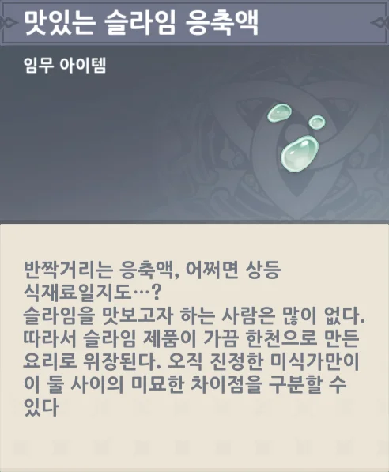
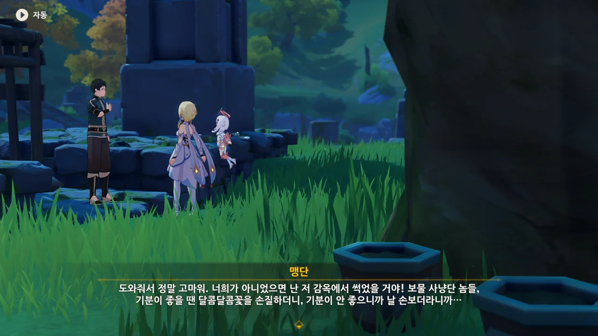
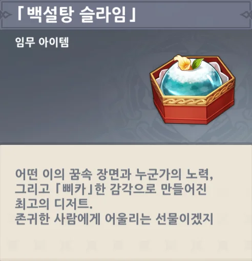

군옥각으로 가라고 하는데... 대체 저길 어떻게 가지?

대충 높은 곳으로 오면 군옥각으로 갈 수 있는 길이 보일 줄 알았는데, 전혀 아니었다.

그걸 이제야 알았니, 페이몬?



페이몬에게 핀잔을 주자, 잠시 시무룩해하다가 언제 그랬냐는 듯 해맑게 근처를 둘러보자고 한다.



바람개비가 있긴 한데... 이걸로 군옥각에 갈 수 있는 건가? 거리가 좀 멀어 보이는데...

군옥각은 커녕, 앞에 있던 공중 발판까지밖에 갈 수 없었다.

너무나 멀게 느껴지는 군옥각.



리월항에 돌아가서 천암군에게 군옥각에 가는 방법을 물어보기로 했다.

감우가 군옥각에 가는 방법을 알려주지 않은 건 군옥각으로 가는 방법이 이미 공개되어 있어 따로 알려 줄 필요가 없어서 그런 걸 수도 있으니까.



거리가 너무 멀어서 지형과 건물이 마치 찰흙처럼 보인다. 귀종기는 아예 보이지도 않고 말이다.

그런데도 용케 귀종기가 있는 곳이란 걸 알아보는구나.



> 혹시 내가 싫니?

ㅋㅋㅋㅋㅋㅋ 이젠 아예 대놓고 말하는구나 ㅋㅋㅋㅋㅋㅋ

귀종기로 쏘아 올릴 거라면, 여행자보다 페이몬이 더 적격 아닐까? 페이몬이 여행자보다 더 가볍고 작으니, 공기저항을 덜 받아 더 멀리 날아갈 수 있을 거 같은데.

귀종기에 망원 기능이 있으니, 그걸 이용해서 군옥각으로 올라가는 길을 찾아보기로 한다.



응? 왜 여기에 천암군이 있지? 여기가 중요 구역이라고 하는데, 굉장히 의심스럽다.

지난번에 종려와 함께 여길 왔을 땐 천암군이 단 하나도 없었잖아. 그런데 갑자기 중요 구역이 되었다고?



나도 처음엔 그렇게 생각했는데, 잘 생각해 보니까 전혀 아니었다.

응광이 우릴 군옥각에 초대한 척하고 천암군을 풀어 우리를 잡으려 했다면, 천암군이 매복할 장소는 귀종기가 아니라 군옥각이어야 한다. 우리가 어떤 경로를 통해 군옥각에 갈지 응광은 전혀 모르지 않은가.

그리고 우린 아직 천암군에게 응광에게 초대받았음을 제대로 이야기하지도 않았고.





> 허튼소리뿐이군. 수상하니 일단 잡고 보자고!

아니, 고작 그런 이유로 우릴 체포하려 한다고? 공권력의 횡포다!





우린 그저 군옥각으로 갈 길을 찾고 있었던 것뿐이다.

귀종기에 망원 기능이 있어서 그걸 쓰려고 했던 건데, 졸지에 이상한 녀석 취급을 받았다.



이렇게 공교로울 데가. 군옥각으로 올라가 리월 칠성을 만나려 했는데, 눈앞에 리월 칠성이 있네.



아, 그러고 보니, 분명 처음 페이몬이 리월 칠성에 대해 소개할 때, '리월의 일곱 개 상업 세력을 대표하는 7명의 상인'이라고 했었지...

응광은 물론이요, 각청도 부자였구나. 그냥 노력가 이미지밖에 없어서 각청이 부자인지 아닌지는 그다지 와닿지 않았는데...



망가진 귀종기가 하룻밤 사이에 고쳐진 것을 조사하기 위해 천암군이 여길 지키고 있었던 거라고 한다.

그래, 우릴 체포하려고 했던 거라면, 귀종기 근처를 중요 구역이라며 지킬 이유가 없지.



수천 년 동안 기술을 연마한 선인이 만든 장치를 인간이 고쳤다는 게 리월 칠성에게도 굉장히 신기한 일로 비치나 보다.

선인만큼은 아니겠지만, 그래도 리월항에도 역시 세대를 거듭해 전해져 내려온 기관술 같은 게 있을 줄 알았는데... 아니었나 보다.

입이 방정인 페이몬을 겨우 말렸다.





각청에게 왜 응광이 우릴 군옥각으로 초대했는지 물어보자, '「몬드를 구한 영웅」이 완전히 선인 편에 서지 않고 중립적인 태도를 취하길 바라서'이라는 대답을 얻었다.

그런데 리월 칠성이나 선인이나 모두 리월항을 지킨다는 목적엔 다름이 없을 텐데...?

각청이 하는 말을 들어보면 리월 칠성과 선인 사이에 서로 갈등이 있는 것 같다.



> 「지킨다」는 게, 높은 곳에서 내려다보기만 하는 그 오만한 태도를 말하는 거야?

와우, 이렇게 대놓고 선인에 대한 반감을 표하는 사람은 처음 보는데.

각청이 말하길, 선인들은 응광이 현장을 봉쇄하고, 시민들을 검문하고, 자객을 추적하는 게 소용없는 짓이라고 생각할 것이라고 한다.

뭐, 틀린 말은 아니지. 신을 죽일 수 있는 자객을 고작 천암군으로 막는다는 게 말이나 되는 소리일까.

게다가 리월 칠성이 뭔갈 숨기고 있다는 인상도 이미 충분히 주고 있고.



> 솔직히 말하면, 사람을 깔보는 거지.

선인들은 리월 칠성이 청신의례에서 암왕제군이 살해당하도록 방치한 것에 대해 분노하던데, 이건 선인들이 잘못 생각하는 것이다. 조금 전에도 말했지만, 신을 죽일 수 있는 자객이었다니까? 그걸 뭔 수로 막아?

하지만 오해를 살만한 행동을 해온 리월 칠성에게도 잘못은 있다. 지금까지 리월 칠성이 한 행동을 되짚어 보면 뭔가 더러운 꿍꿍이가 있는 게 아닐지 하는 생각이 절로 들거든.



리월 칠성중 선인을 공경하지 않는 건 각청 혼자인 것 같다. 각청 역시 선인을 공경하지 않는 건 "내 개인적인 태도일 뿐"이라며 선을 긋는다.



그래도 제군이 암살당한 걸 듣고 곧바로 리월항에 쳐들어오지 않고 일단 모여 회의했다는 점에서, 선인들이 충분히 참았다는 걸 인정하는 각청.

이럴 거면 그냥 처음부터 서로 대화로 해결하면 되는 일 아닐까?



선인의 시대가 끝나고 이제 인간의 시대가 왔다고 말하는 각청.

그렇게 말하는 건 좋지만, 누가 암왕제군을 살해했는지 아직 제대로 파악조차 하지 못한 상황에서, 선인들의 리월항 개입을 무작정 막으려고 하는 건 너무 무리수로 보이는데...



ㅋㅋㅋㅋㅋㅋ 원래 듣는 사람이 이야길 잘 들어주면 말하는 사람도 신이 나서 열심히 떠들기 마련이다.



이제 군옥각에 어서 가보라며, 다른 거상들은 응광에게서 이득을 얻기 위해 군옥각에 갈 때 호화로운 선물을 들고 간다는 이야기를 해준다.



그리고 그걸 들은 페이몬은 당연하게도 눈이 돌아갔다.

그게 중요한 게 아니라고 해도 '이득을 보려는 게 아니라 리월의 전통문화를 존중하는 것뿐이다'라는 핑계를 댄다.

이럴 땐 머리가 또 잘 돌아가지, 이 녀석.



각청이 군옥각으로 올라가는 법을 알려준다.

그러니까, 여기가 아니라 월해정의 「길잡이」를 찾아가면 된다는 거지?

괜히 여기서 고생했네. 그래도 여길 오지 않았더라면 각청과 만나지 못했을 거고, 군옥각에 가는 법을 모를 터인 천암군을 괜히 붙잡고 시간만 낭비할 뻔했다.

아마 곧 다시 보게 될 거야...

남들이 다 YES를 외칠 때, 혼자 NO를 외칠 수 있는 강단을 가진 각청이 난 정말로 마음에 든다.





자기 꿈에서 나온 「백설탕 슬라임」을 응광에게 선물로 주자고 하는 페이몬.

꿈에서 본 음식인데, 제대로 된 레시피는 알고 있어?



> 없어! 그냥 「삐카」한 느낌으로 만들면 되지!

어휴... 내가 정말 못살아...

슬라임을 죽이고 '맛있는 슬라임 응축액'을 얻었다.

슬라임은 한천과 비슷한 식감과 맛을 갖고 있다고 한다.





그다음으로 간 곳에선, 보물 사냥단이 누군가를 우리에 가둬놓고 있었다.



그리고 그들을 처치하고 얻은 '매우 달콤한 달콤달콤꽃'과 '우리 열쇠'.

> 그래서 가끔은 「오지라퍼」가 꼬이기도 한다.
{.bq}

이건 대체 무슨 뜻일까? 설마 그 '오지라퍼'가 보물 사냥단은 아니겠지?

> 어느 목제 우리를 **여는 데** 사용하는 열쇠.
> 우리의 설계 목적으로 보면 이걸 「어느 목제 우리를 **잠그는 데** 사용하는 열쇠」라고 해도 되지 않을까?
{.bq}

서... 설득력이 있어!

> 보물 사냥단 놈들, 기분이 좋을 땐 달콤달콤꽃을 손질하더니, 기분이 안 좋으니까 날 손보더라니까...

이 아저씨, 말 참 재미있게 하네 ㅋㅋㅋㅋㅋㅋ



필요 없다고 해도, 사례를 하겠다는 맹단.



그냥 평범한 사람인 줄 알았는데, 리월항의 「명성재」에 골동품을 공급하는 사람이었다.





맹단에게 응광에게 줄 선물을 담을 상자에 관해 묻자, 명성재의 선물 포장은 7개국 중 단연 최고라며, 사장에게 가면 상자를 받을 수 있을 거라고 말한다.

어쩌다 보니 선물 포장 문제가 해결되었다.



「명성재」의 주인, 성희에게 가자, 맹단을 구해줘서 고맙다고 감사 인사를 한다.

&nbsp;

갑자기 든 생각이지만, 맹단과 보물 사냥단의 차이는 과연 뭘까? 유적을 뒤져 보물 혹은 골동품을 찾아내 파는 건 둘 다 똑같지 않은가.



응? 이 사각형 상자에 간식을 넣는 건가? 왜 이걸 화면에 비춰주고 있는 거지?



내친김에 페이몬이 다른 것도 빌릴 수 있냐고 묻자, 성희가 흔쾌히 허락해 준다.



> 골동품에 넣어서 만든 간식이라면 분명 맛있을 거야!

으응? 대체 무슨 근거로? 페이몬 요 녀석, 물욕이 잔뜩 오른 게 분명하다.



완성된 「백설탕 슬라임」을 상자에 넣고 설탕을 뿌린 후, 방금 딴 꽃으로 장식한다.

그런데 아까 보여준 상자가 아닌데? 아니, 이 상자에 간식을 담을 거였으면 대체 그 목걸이 상자는 왜 보여준 거래?

슬라임이 한천과 비슷한 식감과 맛을 갖고 있다 했으니, 그냥 이건 설탕 맛밖에 나지 않는 간식이다. 그런 것 치고 너무 고급스럽게 포장되어 있으니, 뭔가 죄책감이 드네.

그래... *부귀영화*...

> 「백설탕 슬라임」
> ***
> 어떤 이의 꿈속 장면과 누군가의 노력, 그리고 「삐카」한 감각으로 만들어진 최고의 디저트.
> 존귀한 사람에게 어울리는 선물이겠지.
{.bq}

어... 음...
