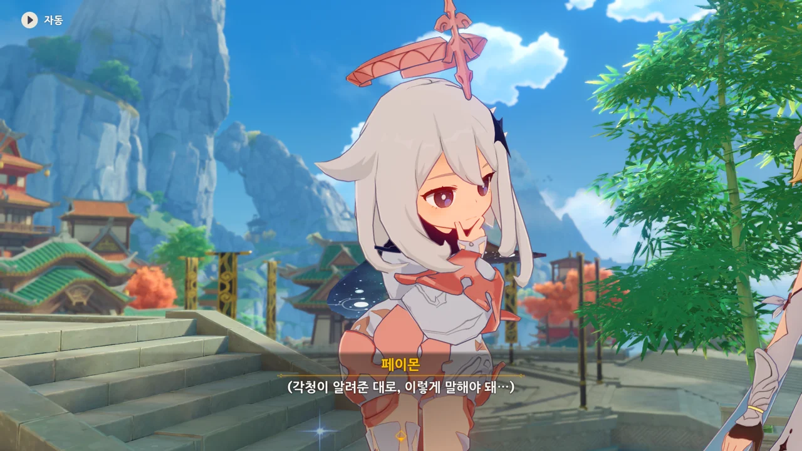

월해정 앞의 「길잡이」에게 말을 걸 때, 어떻게 하면 되는지 각청이 알려주었다.





> 여기 혹시 달도 팔아?
> 구체적인 수량은 말할 수 없어.

오, 각청이 말한 대로 하니, 정말로 길을 안내해 준다.

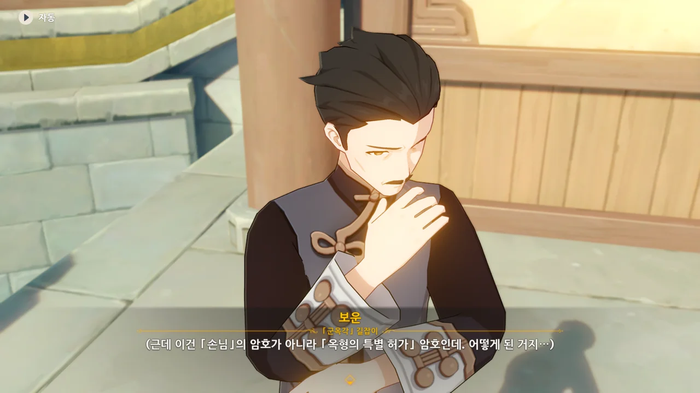

응? 그런데 각청이 알려준 건 손님용 암호가 아닌, 옥형성 특별 허가 암호였다고 한다.

역시 응광이라고 해야 할까? 손님용 암호와 리월 칠성용 암호를 따로 구분해 두었다. '옥형성 특별 허가'라고 한 걸로 보아, 각청에게만 특별히 별개의 암호를 배정한 걸 수도 있지만.



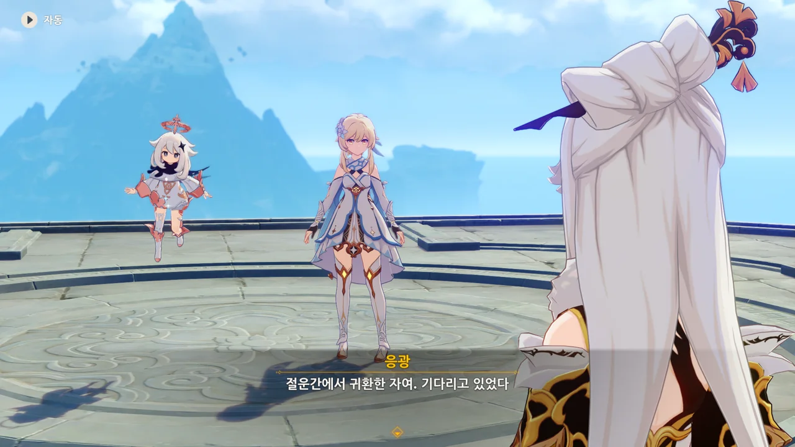

군옥각에 올라가자, 응광이 심복 둘을 데리고 마중 나온다.





페이몬이 「백설탕 슬라임」을 응광에게 건넨다.





응광은 처음 장사를 시작할 때부터 군옥각을 짓기 위한 자금을 모았다고 한다. 처음엔 작은 방 정도의 크기였지만, 지금은 달을 가릴 정도로 크다고.

그래서 아까 군옥각 길잡이 암호가 '여기 달도 팔아?'였던 건가?



아니, 우리가 리월에 도착하기 전에 이미 진이 보낸 편지가 리월 칠성에 닿았던 거야? 그리고 응광은 여행자가 리월에 도착하자마자 사람을 붙여 미행했고?

그럼 우린 왜 천암군에게 쫓긴 거야? 사람을 붙여 미행했으면 여행자가 결백하단 것 정도는 진작에 알아차렸어야지.

... 아, 그래서 처음 선인을 만나러 갈 때까지만 천암군이 여행자를 쫓은 건가?



와우. 난 고데트 아줌마만 리월 칠성 쪽 사람인 줄 알고 있었는데, 아예 그 객잔 사람 전체가 리월 칠성 쪽 사람이라고 한다.

그러니까 언소도 거기에 포함이란 건가...?



심지어 조금 전 각청과 귀종기 옆에서 만난 것까지 알고 있다.



여기서 여행자의 일거수일투족을 직접 보고 있던 건 아니고, 곳곳에 심어둔 「눈과 귀」를 통해 정보를 빠르게 받는 것이다.

응광이 여행자를 군옥각에 초대한 건, 리월 칠성이 암왕제군을 살해했다는 오해를 풀기 위해서라고 한다.

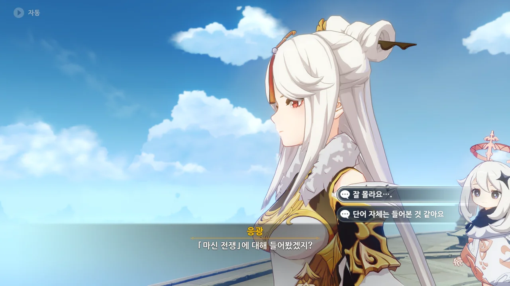

마신 전쟁에 대해 어렴풋이 알고는 있지만, 여기서 모른다고 하면 친절하게 다 설명해 주겠지?



「마신 전쟁」이란 수많은 마신이 서로 끝없는 싸움을 벌이다, 2천 년 전, 7명의 승자 --- 지금의 일곱 집정관 --- 만을 남기고 끝난 전쟁을 말한다. 그때, 수많은 생명이 전쟁에 휘말려 목숨을 잃었다. 불복려의 치치가 그 대표적인 예다.



「고운각」은 마신 전쟁 때 암왕제군이 바다에 던진 바위 창이라고 한다. 그 밑에는 과거 마신 전쟁 때 암왕제군에게 진 마신들이 봉인되어 있고.



마신 전쟁이 끝났다고 해서 집정관의 세대교체가 없던 건 아니었다. 바람 신과 바위 신을 제외한 다른 신은 전부 최소 한 번씩 세대교체를 겪었다.

아마 시간이 지나면 현재 공석이 된 바위 신의 자리를 채울 새로운 바위 신이 나타나겠지만, 리월 사람들이 암왕제군을 잊을 리 만무하다. 분명 수메르 때처럼 죽은 암왕제군만 바라볼 수도 있겠지.

그리고 그때가 오면 리월 사람들과 선인 사이의 관계는 분명 달라질 것이다.

게다가 리월 칠성 역시 리월 사람. 암왕제군을 살해한다는 건 감당키 어려운 일이다. 자칫하다간 리월 칠성 자체가 공중 분해될 수도 있을 정도다.



그래. 그때 응광도 적잖이 당황한 눈치였다.

하지만 응광은 적들의 움직임을 파악하기 위해 재빨리 선조의 허물을 숨겼다.





그리고 여기서 응광이 말하는 '적'이란, 분명 우인단을 말하는 것이다.

생각해 보라. 처음 여행자가 자객으로 몰려 쫓길 때, 타르탈리아가 갑자기 나타나 여행자를 구해주었다. 여기서 '지나가던'이란 말을 믿는 사람은 없을 테니, 우인단 역시 여행자에게 사람을 붙였다는 말이 된다.

참 재미있어. 우인단도 리월 칠성도 사람을 붙여 미행하는 여행자라니. 이때부터 요주의 인물이었다는 건가.



응광이 군옥각 안으로 여행자를 안내한다.

처음 할 때, 군옥각에서 책 몇 권을 먹지 못한 걸 기억하고 온 군옥각을 돌아다녔다. 그런데 책이 두어 권밖에 없더라.



> 내 집이라 생각하고 편하게 있어.
> 친구가 놀러 온 건데 당연히 편히 있어야지.

말은 저렇게 해도, 정말로 편하게 있으면 안 된다는 것 정도는 알고 있다.





페이몬이 소문으로만 듣던 응광의 '벽'을 발견했다.

단순히 응광이 모아온 정보가 저 벽에 총망라되어 붙여진다고 알고 있었는데, 리월의 비밀까지도 올라오는 거였구나.



하지만 리월의 상업 기밀은 여행자에게 아무런 쓸모가 없다며, 자신은 여행자의 신뢰를 얻고 싶다고 말하는 응광.

뭐... 맞는 말이긴 하지. 여행자가 리월에서 장사할 게 아니라면 저 비밀은 알아도 큰 쓸모가 없으니까.



초면부터 "너의 신뢰를 얻고 싶어"라고 말하는 응광과, 그런 건 아랑곳하지 않고 선인을 향해 불경한 말을 하던 각청을 비교하면 벌써 답이 나왔지.



각청이 선인의 시대가 끝났다고 말한 건 하루이틀이 아니었나 보다. 뭐, 당연한 거겠지만...

그런데 각청의 뒤처리를 응광이 봐줬다니, 그건 좀 의외인데. 각청의 일 처리는 똑 부러질 거로 생각하고 있었거든.



암왕제군의 죽음이 리월 칠성에게 유리하게 보인 건 맞지만, 그렇다고 해서 우인단이 뿌린 '리월 칠성이 권력을 찬탈했다'라는 헛소리에 얽매일 여유는 없었다고 한다.

그러니까 그 소문조차 우인단이 의도적으로 뿌린 소문이란 거지? 우인단, 정말 무서운걸... 물밑작업의 음흉함은 그 누구도 따라가지 못하겠어.



응광이 암왕제군의 시체를 숨긴 건 우인단이 몬드에서처럼 대놓고 리월에 개입하는 걸 막기 위해서라고 한다.

드발린이 한 번 난동 피운 걸 갖고 몬드의 방위권을 내놓으라고 설래발 친 걸 보면, 리월에서도 비슷한 일을 벌이지 않으리란 법은 없지.



듣고 보니 정말 그렇네.

리월 칠성은 지금 우인단과 힘겨루기하느라 바쁘니, 종려와 여행자에게 송신의례를 아웃소싱한 거였다.



어휴... 지금 이 상황에서 꼭 그 이야기를 해야 했니, 페이몬?



그래, 솔직한 사람이 좋긴 하지. 쓸데없이 속마음을 따져볼 필요가 없으니 말이다.

응광이 지금껏 끼친 민폐에 대한 사과의 의미로, 여기 있는 물건 중 하나를 골라보라고 한다.





그리고 페이몬이 고른 건 벽에 있는 종잇조각이었다.

맞는 말이긴 한데... 닳고 닳은 리월 상인에게 그걸 제값에 팔 수 있을 거로 생각해?

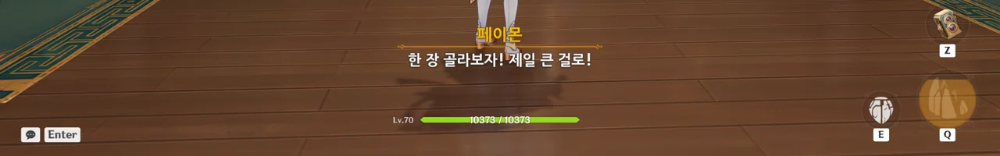





응광의 벽에 붙어 있는 가장 큰 종이에는 「백무금기 비록」, 「우인단」, 「연구」, 「복제」라는 단어가 적혀 있다.

> 힝... 보물이 아니네

아마 페이몬은 막대한 보물이 묻힌 장소가 응광의 벽에 붙어있을 거로 생각한 모양이지만, 응광의 벽에는 그런 정보가 붙지 않을 게 분명하다.

응광은 이런저런 정보를 모아 본인에게 이득이 될 만한 정보를 창출하는 타입의 사람이지, 단순하게 보물의 정보를 모으는 사람이 아니니까.

응광이 했던 말처럼, 응광의 벽에 있는 정보는 여행자에게 별 쓸모가 없는 것이다.



아무튼, 그 종이에는 우인단이 현재 비밀리에 「백무금기 비록」을 복제할 연구를 하고 있다는 정보와, 그 장소가 적혀 있다.



여행자 역시 「백무금기 비록」과 연관이 있으니, 가서 조사해 보자는 페이몬. 응광에게 제대로 낚였다.

응광이 저걸 괜히 저기에 붙여놨을 리 없잖은가. 여행자가 저걸 보고 그 연구 장소로 향하게끔 자연스럽게 유도하는 거겠지.



여행자는 이걸 응광의 의견을 직접 검증해 볼 기회로 생각한다.



종려를 만나러 적화주로 가기 전, 일단 우인단의 연구 장소로 가보기로 했다.

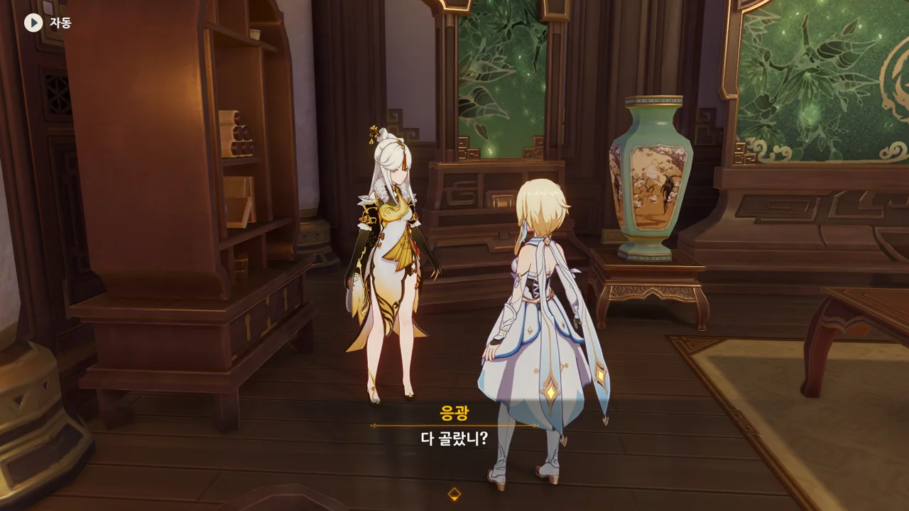

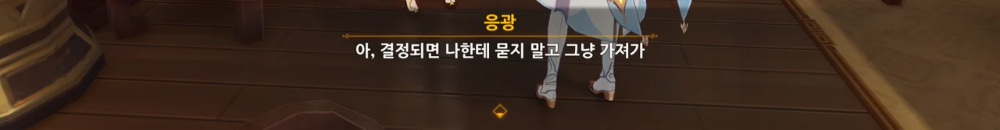

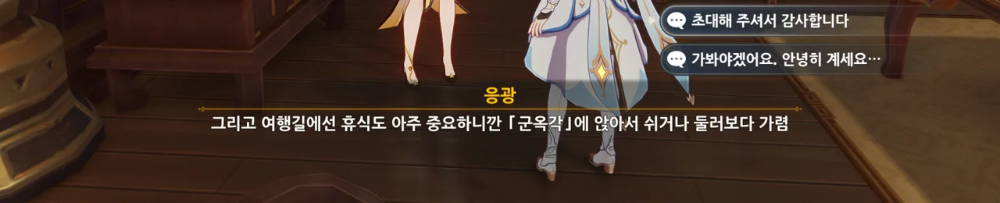

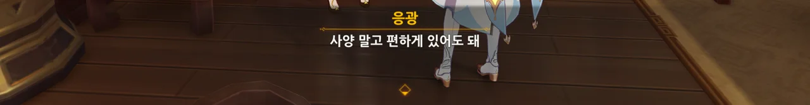

응광은 물건을 골랐으면 묻지 말고 그냥 가져가라고 한다. 이거, 여행자가 벽에 붙은 종이를 고를 걸 이미 예상하고 하는 말일 테다.

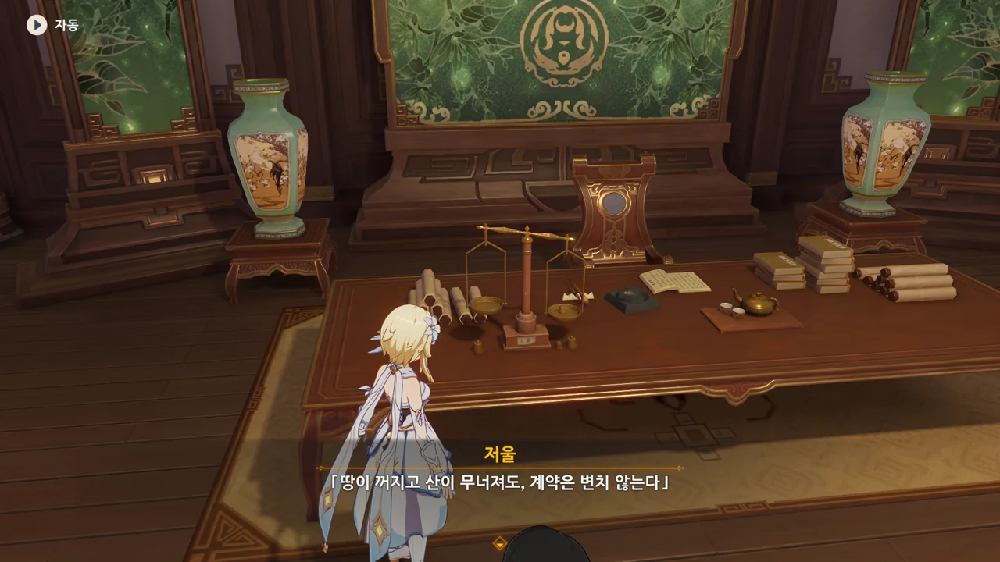

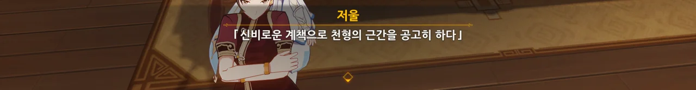

응광의 책상 위에는 글귀가 적힌 저울이 올려져 있다.

> 땅이 꺼지고 산이 무너져도, 계약은 변치 않는다.
> 신비로운 계책으로 천형의 근간을 공고히 하다.
{.bq}

실제로 쓰는 목적이 아니라, 저울을 보며 자기 마음을 다잡는 용도겠지, 아마?

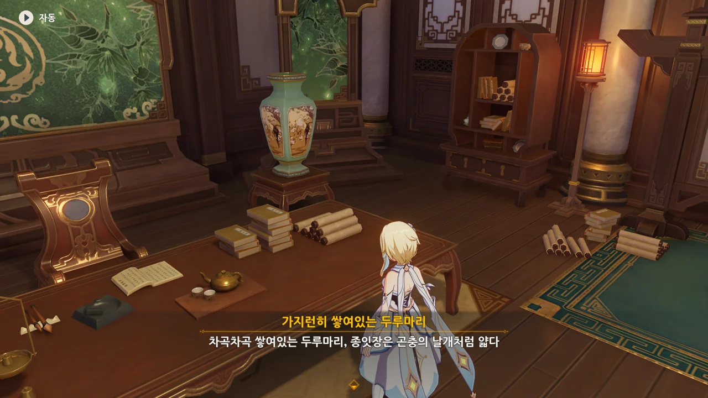

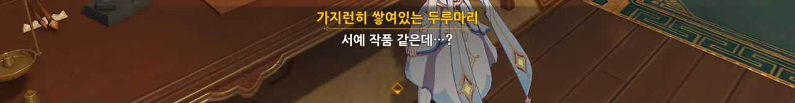

헤에, 응광은 서예에도 능했던 건가?

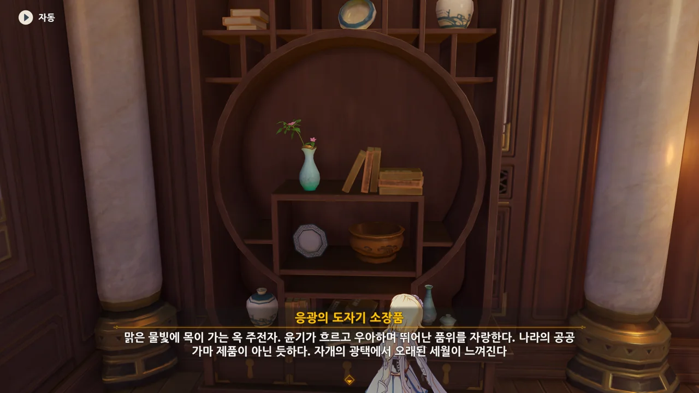

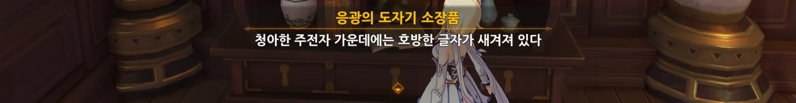

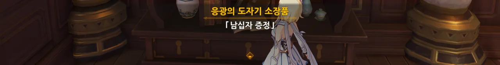

남십자 함대는 리월 칠성이 운용하는 사략 함대의 이름이다.

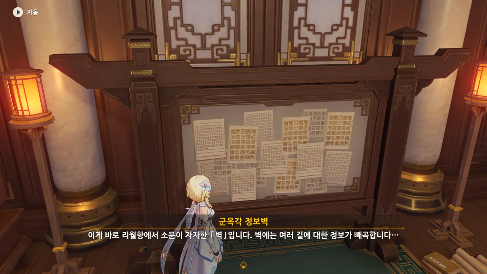

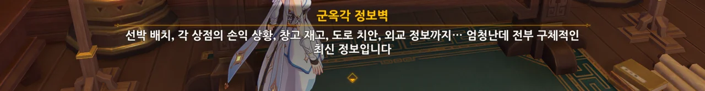

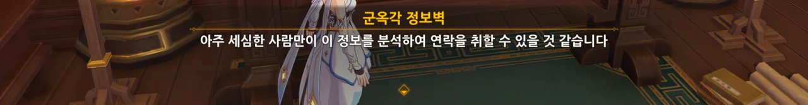

아니 여긴 왜 해라체에서 하십시오체로 바뀐 거야?

응광의 벽의 정식 이름이 '군옥각 정보벽'이었구나.

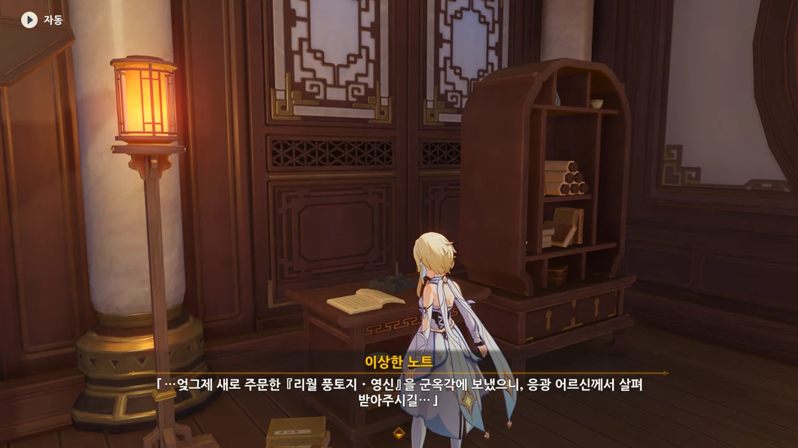

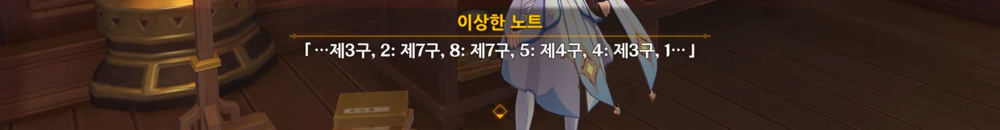

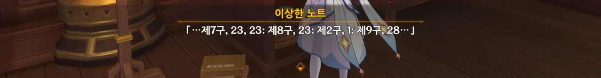

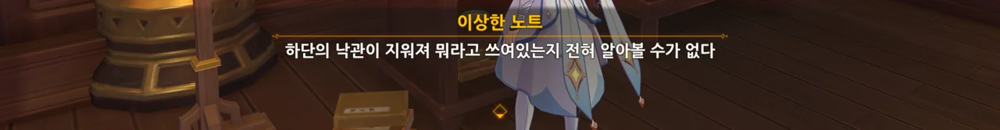

그 옆에는 응광의 정보원이 올린 것으로 추정되는 보고서가 놓여 있다.

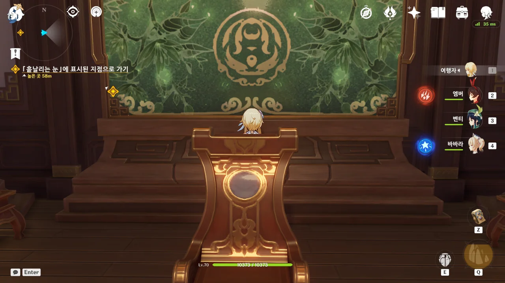

이 문양은 천권의 문양이겠지?

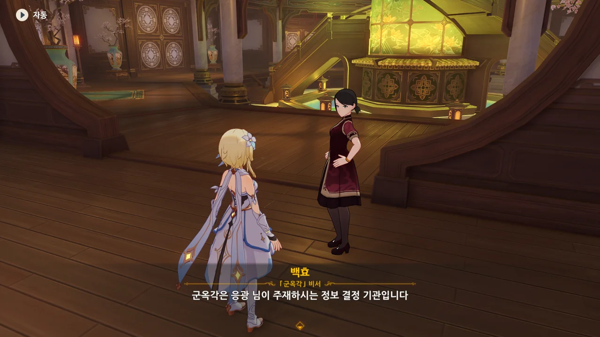

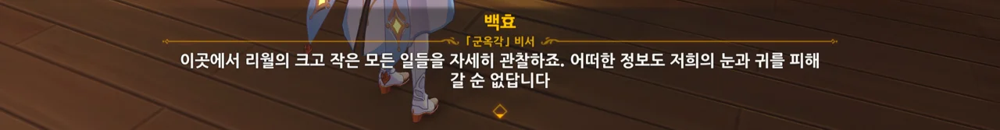

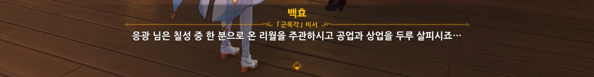

응광의 세 심복 중 하나인 백효에게 말을 걸어보았다.

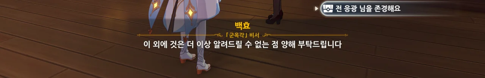

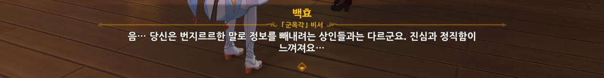

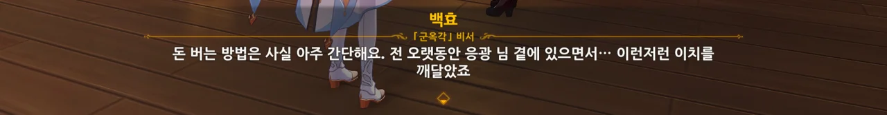

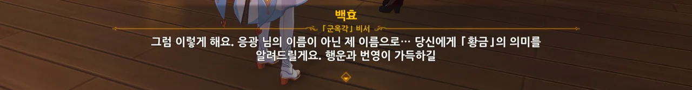

응광을 존경한다고 말하자, 「황금」 특성 책을 준다.

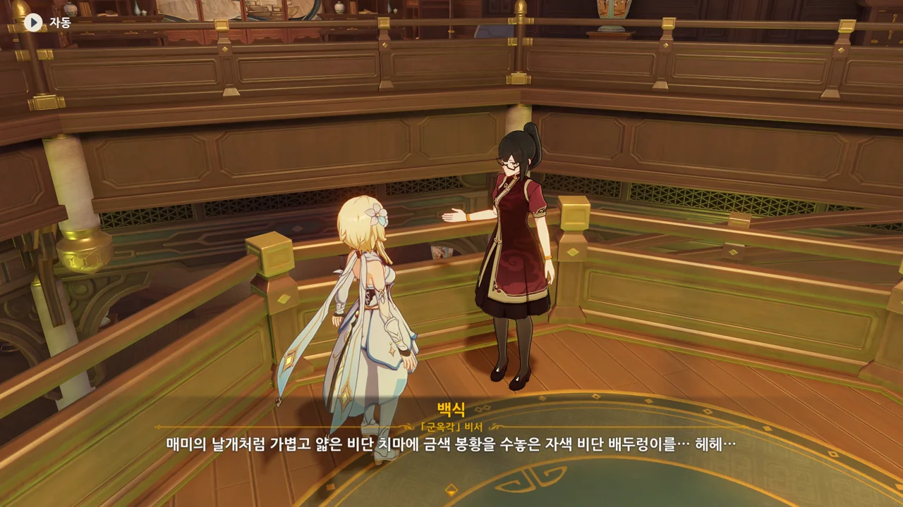

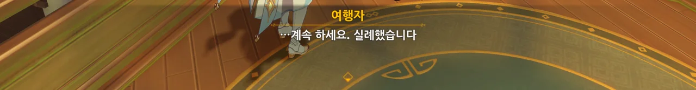

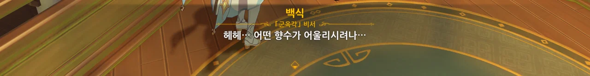

백식과는 그리 좋은 결과를 얻지 못했다. 응광에게 입힐 옷을 고르는 모양인데...

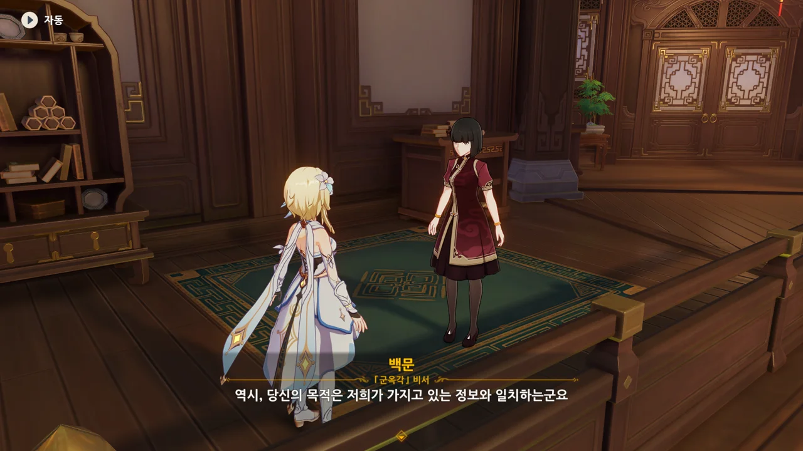

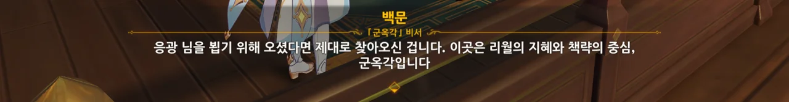

그다음은 백문이다.

백효는 죄다 '기밀입니다'라고 말하고, 백식은 응광에게 입힐 옷만 머릿속에 가득하지만, 백문은 그래도 실무진이라는 느낌을 준다.

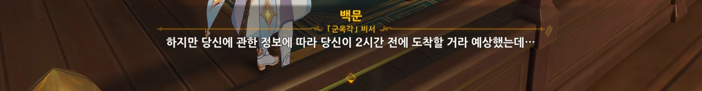

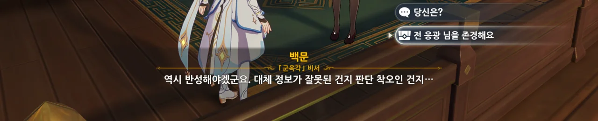

백문은 여행자가 2시간 전에 군옥각에 도착할 거라 예상했지만, 보기 좋게 틀려버렸다.

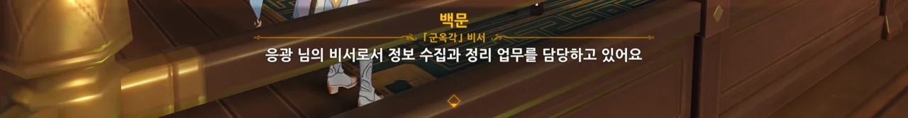

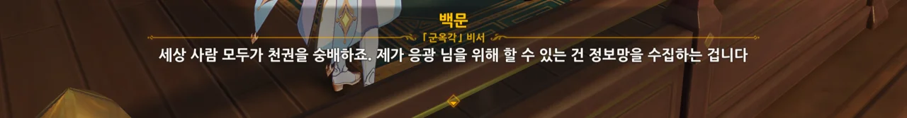

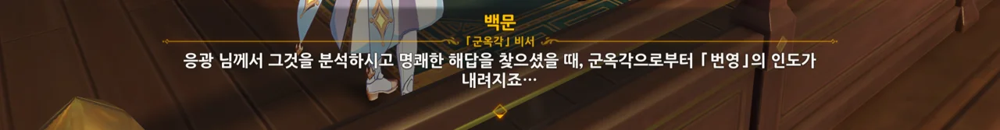

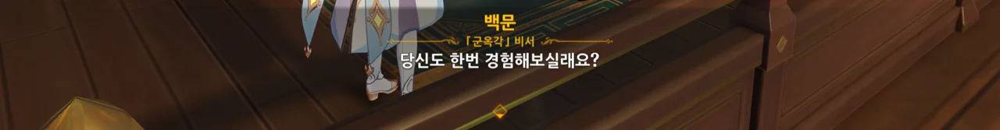

백문에게 응광을 존경한다고 말하자, 「번영」 특성 책을 준다.

> 당신도 한번 경험해 보실래요?

으악, 야근 싫어요!
