원신은 사진 찍기가 불편하다. 사진을 찍으면 UID가 노출되기 때문이다.

그런 걸 별로 좋아하지 않기 때문에, 원신을 하며 사진을 잘 찍지 않게 되었다.

&nbsp;

하지만 이번 이벤트는 내용을 어느 정도 사진으로 남기지 않으면 안 될 것 같아 사진을 찍기로 했다.

[Greenshot](https://getgreenshot.org/)이라는 프로그램을 이용해 사진을 자동으로 저장하도록 하니, `Alt` + `Prtsc` 키로 사진을 찍은 후 일일이 저장하던 이전보다는 확실히 사진을 찍기 편하다.

&nbsp;

그렇게 사진을 열심히 찍다 보니, 축월절 이벤트가 아직 덜 끝났음에도 불구하고 사진이 117개나 쌓이게 되어, 이벤트를 하다 말고 글을 쓰기로 했다.

물론 117개의 사진에서 UID를 일일이 지워야 했다. 거기에 막대한 시간이 들어갔음은 말할 것도 없다. 아, 내 아까운 시간...

***

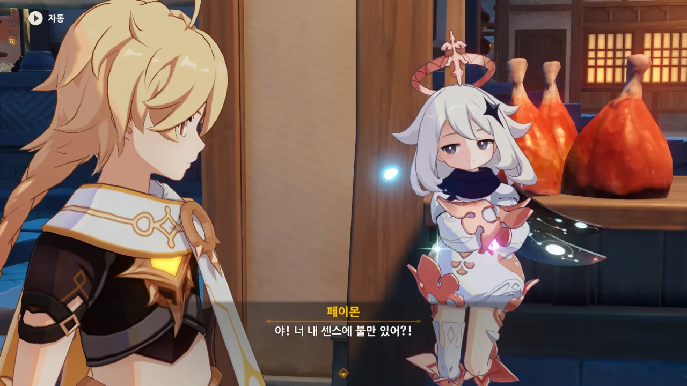

원신이 2.0 버전이 되면서 느낀 것 중 하나가 등장인물들의 표정이 꽤 보기 좋아졌다는 것이다.

남행자로 플레이해서 잘 몰랐는데, 이나즈마 이도에서 "편지를 전해주세요"라는 말을 듣고 대번에 표정이 썩어버린 여행자 사진을 보니 기술이 꽤 좋아졌단 걸 느낄 수 있더라.

&nbsp;

당장 지금 페이몬이 이렇게 남행자를 흘겨보는 모습에서도 원신의 표정 기술이 좋아졌다는 걸 느낄 수 있다.

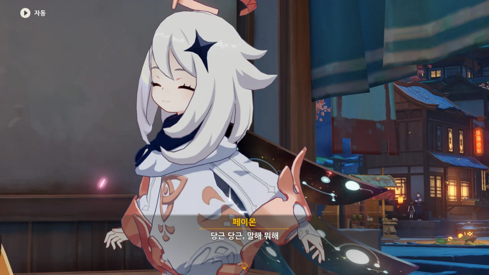

'당근' 이라고...? 혹시 페이몬 선생, 올해로 연세가 어떻게 되십니까? 너무 오래된 유행어인데...

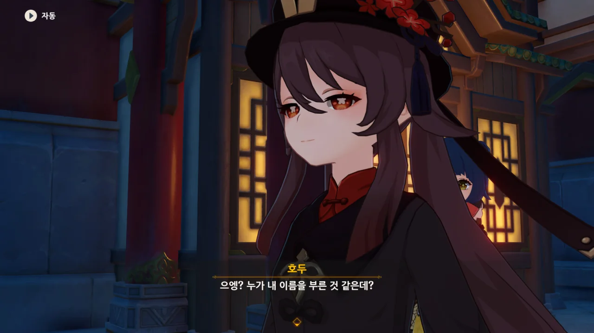

원신이 더빙 언어별로 캐릭터의 느낌이 다르다는 것은 익히 들어 알고 있었지만, 이번 이벤트에서의 호두는 뭔가 기존에 내가 알던 호두와는 무언가 약간 다른 캐릭터라는 느낌을 준다.

내가 알던 호두는 알건 다 알면서도 능청스럽게 구는, 다른 사람과 사고방식이 다른 사차원인 캐릭터인데, 그런 캐릭터가 "으엥?"이라는 말을 한다니, 뭔가 조금 깨는 느낌이다.

&nbsp;

그냥 단순히 내가 단순히 호두라는 캐릭터를 착각하고 있었던 것일 수도 있지만.

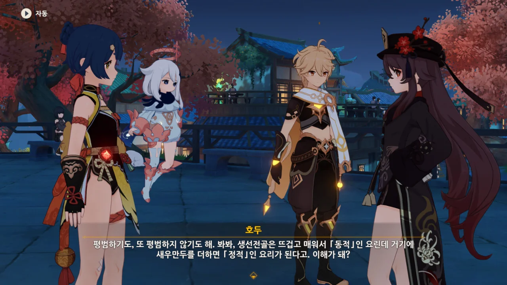

솔직히 무슨 말인지 전혀 이해가 되지 않는다. 요리가 동적인 요리와 정적인 요리로 나뉜다고? 그게 무슨 소리야?

이럴 때는 적당히 고개를 끄덕이는 것이 상책이다.

누룽지가 컷신 중간중간 자신의 존재감을 한껏 드러내고 있다.

뽈뽈뽈 돌아다니며 '나 여기에 있소'라는 걸 잔뜩 어필하는데, 이게 은근히 귀엽다.

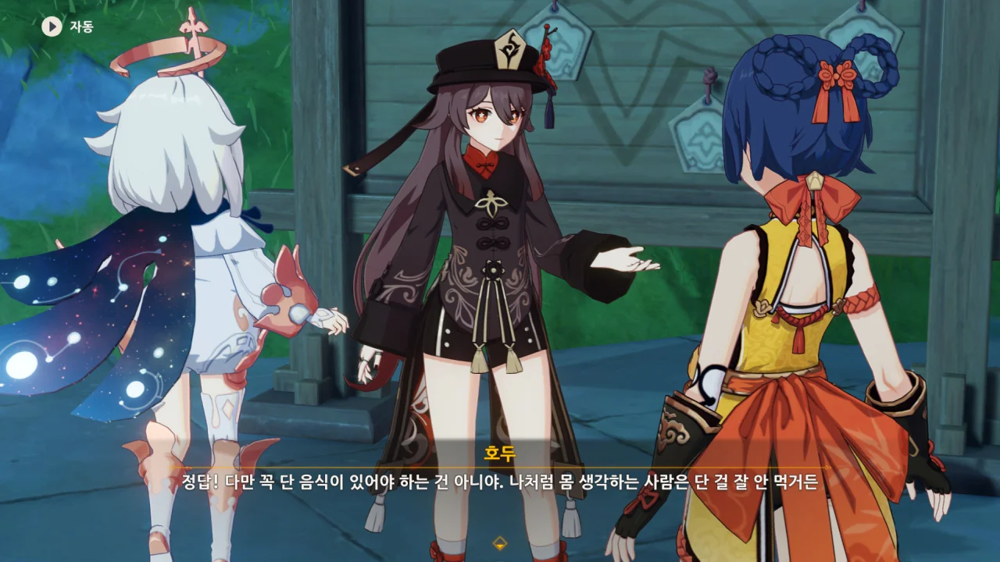

"몸 생각하는 사람은 단 걸 잘 안 먹거든"이라고...? 단 것과 건강에 대체 무슨 상관관계가 있는 것일까?

물론 과유불급이라, 단 걸 엄청 많이 먹는다면 확실히 건강이 나빠지긴 한다. 하지만 적당히 먹는 수준이라면 건강에 나쁠 리 없을 텐데...

> 아무 말 대잔치라면 이야기꾼 아저씨도 호두는 못 이기지

페이몬의 매력 요소 중 하나는 이렇게 가끔 태연하게 누군가를 먹이는 대사를 한다는 것이다.

이거, 호두가 평소 아무 말이나 하고 다닌다는 말이잖아.

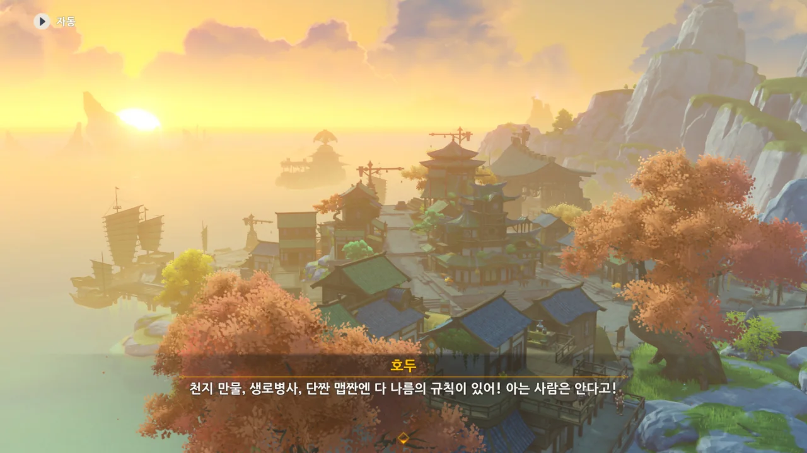

단짠단짠이 있다는 말은 들어봤어도, 맵짠맵짠이라는 말이 있다는 말은 처음 들어보는데? 원래 매운 음식은 짜지 않아?

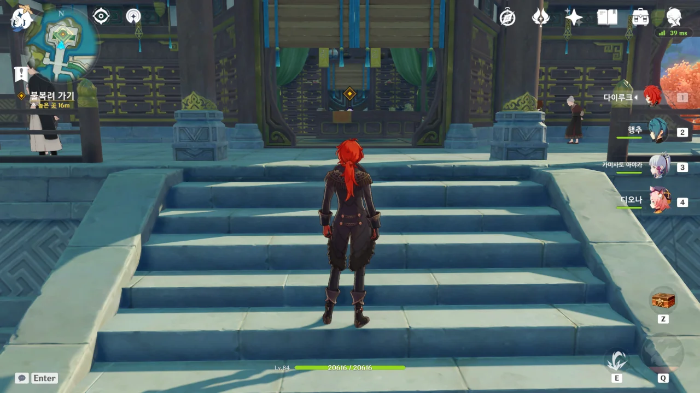

불복려에 가면 치치의 머리 끝만 계단대 위로 톡 튀어나온 것을 볼 수 있다. 짜리몽땅한 치치가 귀엽다.

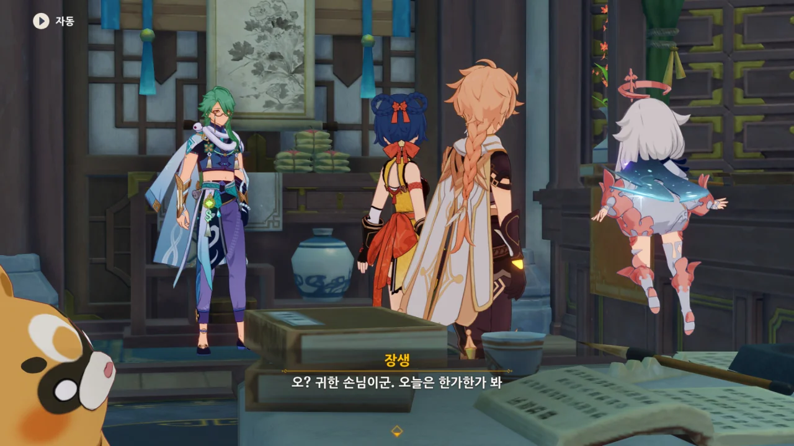

백출 목을 감싸고 있는 장생의 목소리를 들은 순간, '내가 저 목소리를 대체 언제 어디서 들었지?'라는 생각이 들었다.

분명 예전에 장생의 목소리를 들은 것 같은데... 대체 어디서였지?

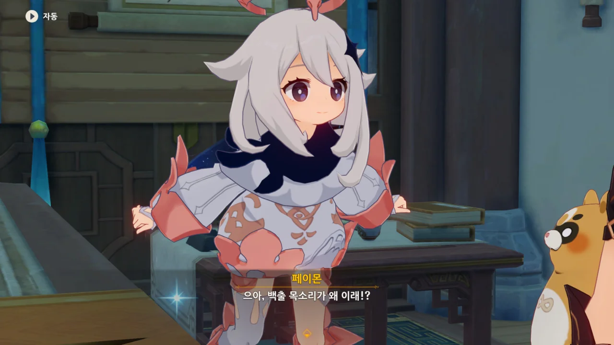

장생의 목소리를 백출의 것으로 착각한 페이몬. ㅋㅋㅋㅋㅋㅋ

누가 봐도 남성인 백출에 비해 장생은 여성형 목소리를 가졌으니, 페이몬이 기겁할 만도 하다.

마치 우락부락한 남성이 쪼그마한 아기 목소리를 내는 것과 비슷한 충격이겠지. ㅋㅋㅋㅋㅋㅋ

&nbsp;

여전히 누룽지는 화면 곳곳에서 자신의 존재감을 과시한다.

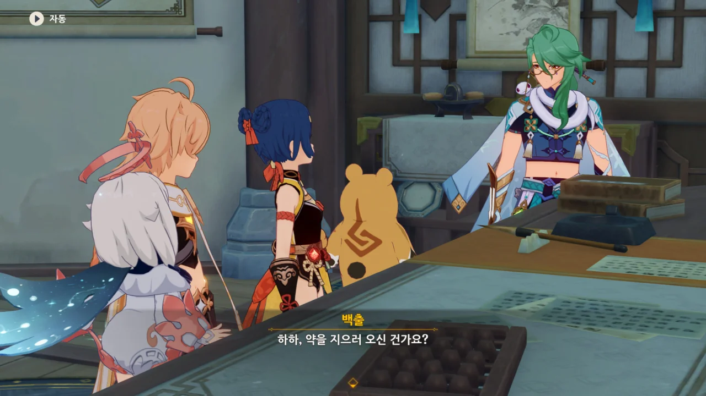

백출에게는 희한한 밈이 붙어 있다. 바로 백출이 나올 때마다 별별 이유를 들어 백출을 까는 것이다. 백출의 목소리를 들어보면 그리 까일 것까지는 없는 것 같은데...

나중에 백출이 플레이어블 캐릭터로 출시할 것이라는 말이 있다. 만약 그렇다면 백출의 성능이 과연 어떨지 궁금해진다. 그야, 백출은 지금까지 플레이어블 캐릭터로 출시한, 혹은 출시할 것으로 예상되는 캐릭터 중 유일한 풀 속성 캐릭터이니까 말이다.

&nbsp;

백출에 붙은 밈과는 별개로, 백출의 배경 이야기를 들어보면 백출이 치치를 데리고 있는 것이 불로장생을 연구하려는 목적이라는 말이 있다.

불로장생을 연구하는 사람 치고 제대로 된 사람이 없는지라, 나중에 어떤 사건의 흑막으로 등장할지도 모른다는 생각이 든다.

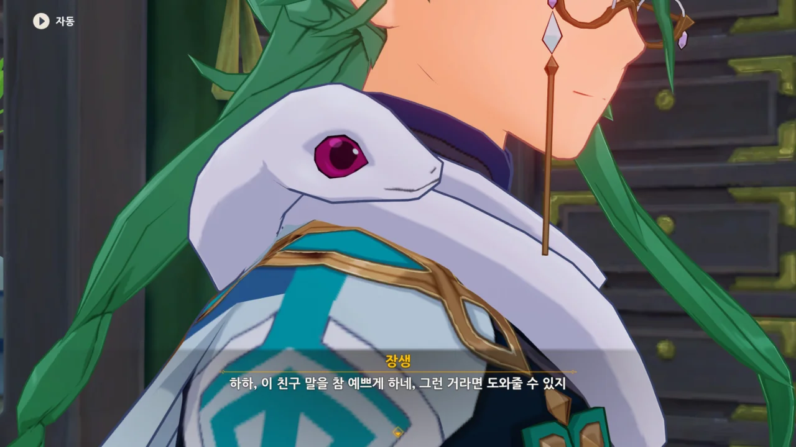

> 하하, 이 친구 말을 참 예쁘게 하네, 그런 거라면 도와줄 수 있지

이게 바로 '천 냥 빚도 말 한마디로 갚는다'라는 것일까.

&nbsp;

장생 역시 마신과 어떤 연관성이 있을 것이라고 하는 말이 있다.

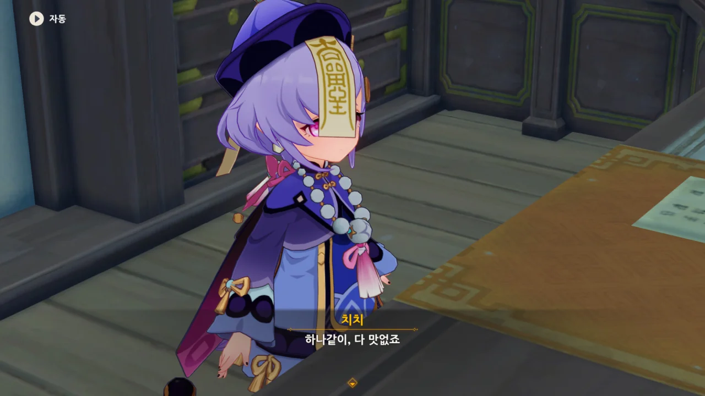

치치는 모든 음식이 하나같이 맛이 없다고 한다. 아니, 왜? 세상에 맛있는 음식이 얼마나 많은데?

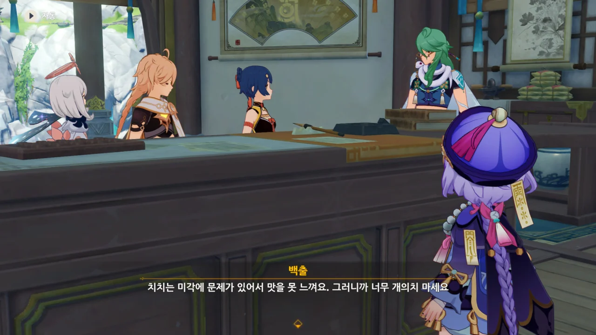

치치가 강시라서 맛을 느끼지 못하는 것일까?

맛을 느끼지 못한다니, 어쩜 이리도 안타까울 수가. 인생의 낙 중 하나가 바로 먹는 것인데 말이다.

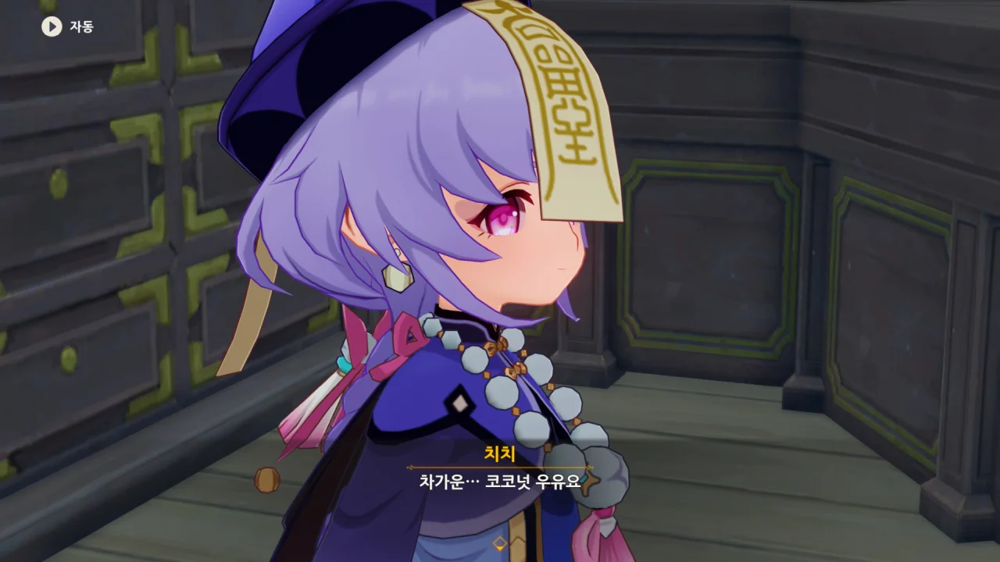

맛은 느끼지 못하지만, 식감은 느낄 수 있는 치치는 '차가운 코코넛우유'를 좋아하나 보다.

이 녀석, 전생에 코코넛을 먹지 못해 한이 들린 것일까? 분명 전설 임무에서 '야자 염소'를 찾았던 것 같은데, 이번엔 '야자 우유'를 찾고 있다.

&nbsp;

치치 때문에 감우에게는 '야자 염소'라는 밈이 붙었다. 구글에 'Coconut Goat'를 검색하면 연관 이미지에 감우가 나타날 정도.

외국인과 대화할 때 감우가 영어로 무엇인지 몰라도 아마 상관없을 것이다. 대충 'coconut goat'라고 하면 찰떡같이 알아들을 테니.

일단 감우는 영어로 Ganyu이긴 하다.

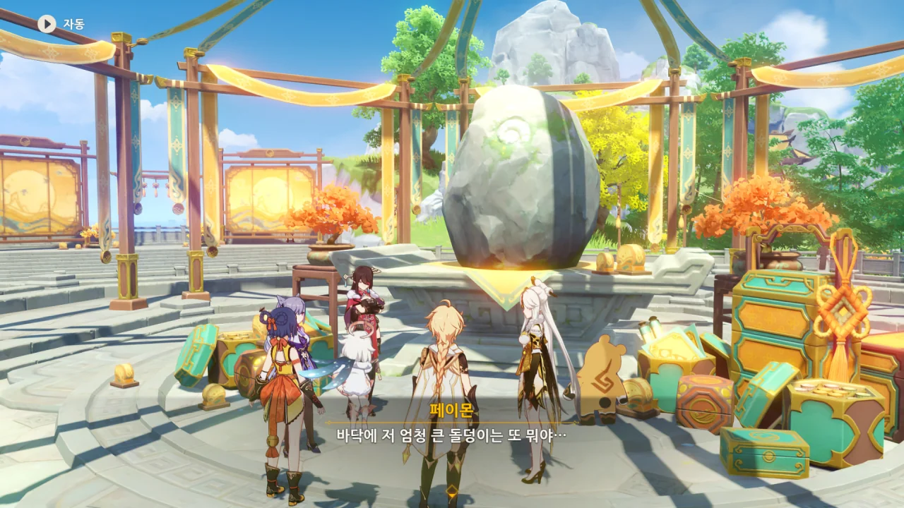

뭐지? 분명 이번 축월절 주제는 음식이었던 것 같은데 왜 여기에 난데없이 큰 돌덩이가 턱 하니 놓여있는 거지?

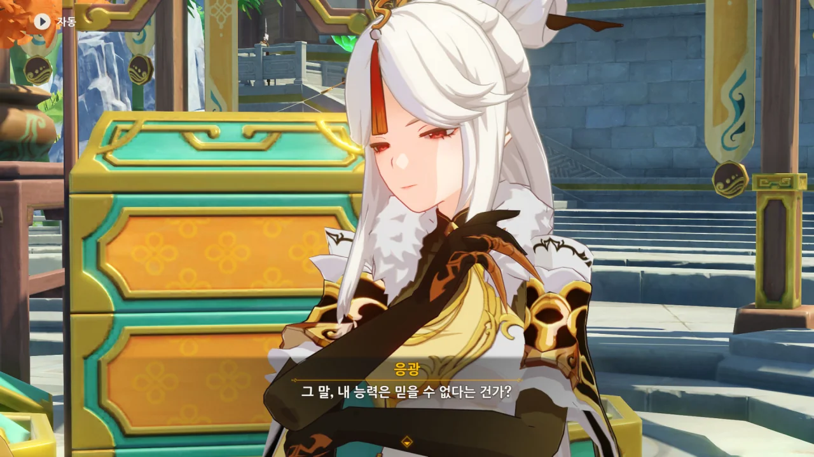

북두가 각청에게 저 돌덩이의 처리를 맡기자고 하자, 응광이 자기 능력을 믿을 수 없냐며 찬물을 끼얹는다.

아니, 왜 거기서 싸움을 거세요.

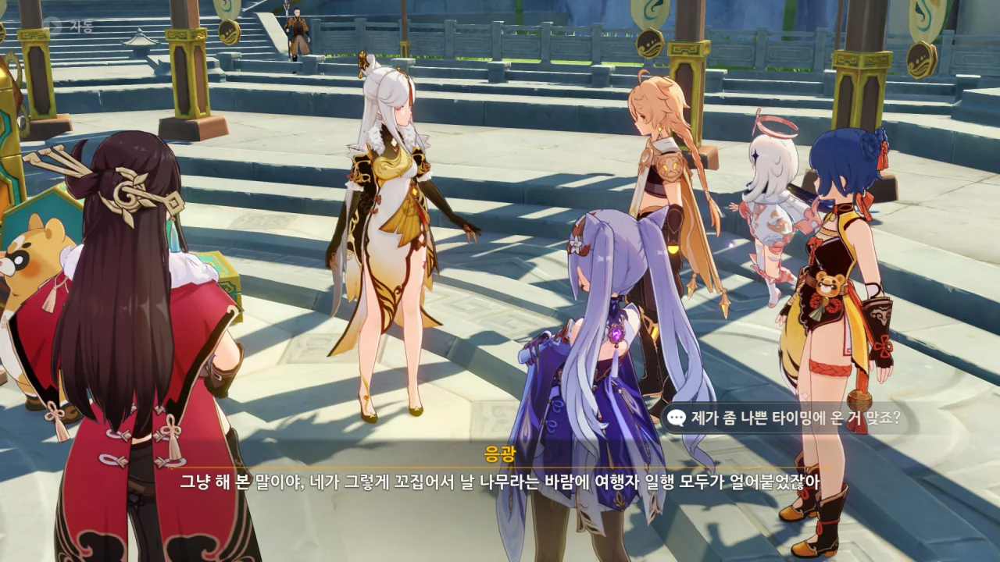

맨 처음 찬물을 끼얹은 건 응광 당신인데요.

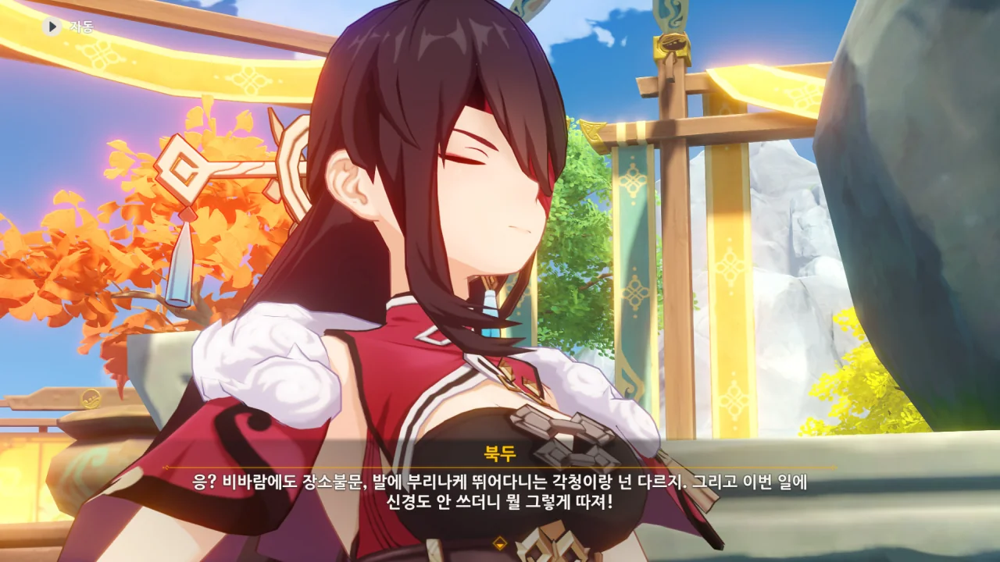

어휴, 이 둘은 왜 이렇게 사이가 안 좋아? 적당히 끝내면 될 것을 끝끝내 싸움을 계속하는 북두.

그리고 그 보복(?)으로 응광에게서 저 돌덩이에 대한 설명을 떠맡게 되었다.



저 돌덩이는 돌덩이 주제에 무기로 후려패도 금조차 가지 않았다고 한다. 평범한 돌덩이는 절대 아니라는 소리.

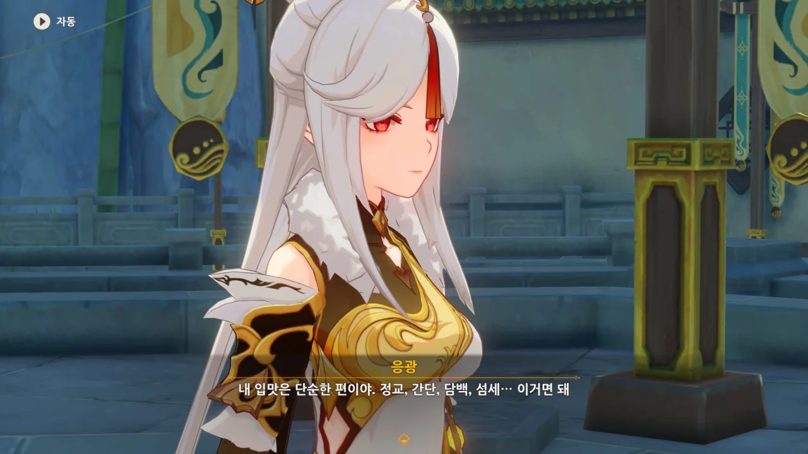

돌덩이에 대한 이야기는 잠시 미뤄둔 채, 각자 좋아하는 음식에 대해 향릉이 물어본다.

응광은 자신의 입맛은 단순하다며, '정교, 간단, 담백, 섬세'한 음식을 선호한다고 한다.

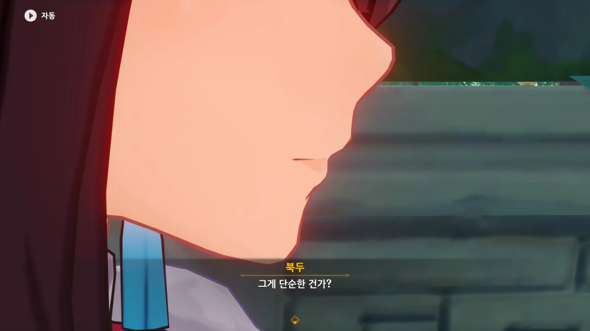

그리고 또다시 거기에 시비를 거는 북두. 그게 과연 단순한 입맛이냐며 시비를 건다.

아니, 넌 또 왜...

북두가 편을 든 각청은 아무런 말도 하지 않고 가만히 있는데, 북두와 응광 둘이 서로 날을 세우고 있다.

정말 이해할 수 없다. 대체 왜 싸우는 건데? 다른 사람 보는 앞에서 꼭 그렇게 싸워야 하나...?

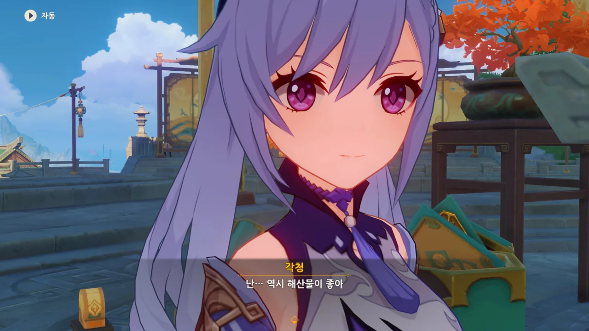

각청은 해산물을 선호한다고 말한다. 북두는 뜨거운 음식이면 다 좋다고 했고.

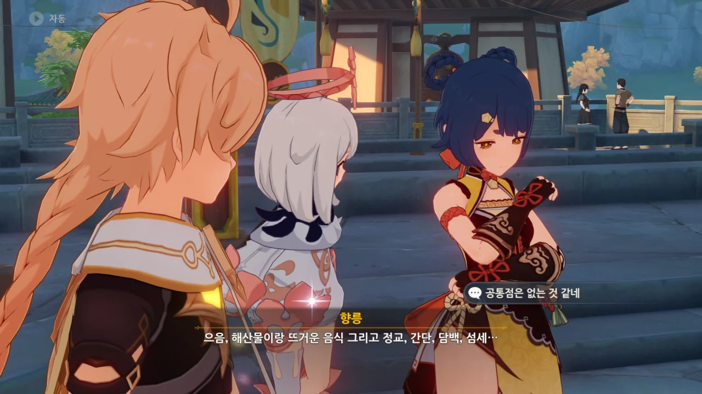

이렇게 보니 세 사람의 음식 취향은 정말 잘 맞지 않는다.

뜨거운 해산물 음식은 많이 있긴 한데... 아, 그래서 북두가 각청의 편을 든 건가?

응광이 선호하는 음식의 조건은 조금 이해하기 어렵다. 간단하면서 섬세한 음식이 과연 존재하는 것일까? 서로 상충하는 조건 같은데...

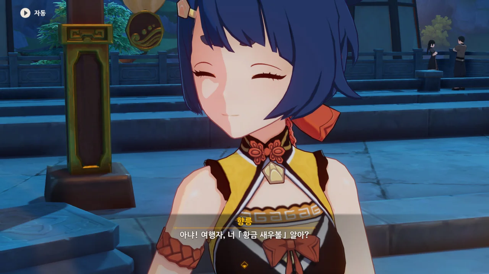

세 사람이 모두 만족할 만한 음식을 만들기 어렵겠다는 말에 향릉은 「황금 새우볼」 이야기를 꺼낸다. 설마 그 요리가 모두의 조건을 동시에 만족하는 요리라는 걸까?

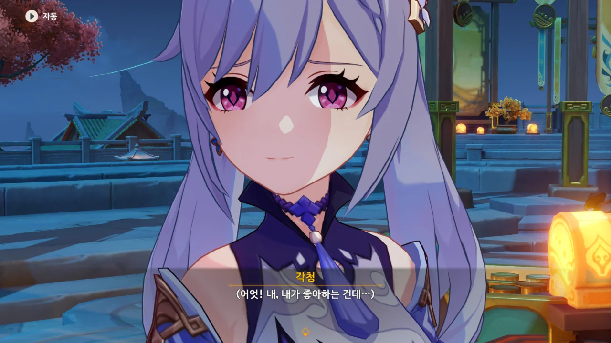

그리고 갑자기 뜬금없이 나타난 각청의 속마음. 각청은 황금 새우볼을 굉장히 좋아한다.

지금껏 다른 등장인물의 속마음은 알려주지 않았으면서 각청의 속마음은 더빙까지 넣으며 알려주는 걸 보면, 이번 축월절 이벤트의 주역은 각청이 아닐지 하는 생각이 든다.

향릉이 말하는 조리법을 보면 그리 복잡하지 않은 요리로 보인다. 저게 손이 많이 간다고?

감자채 만드는 것이 조금 어렵긴 하겠다만...

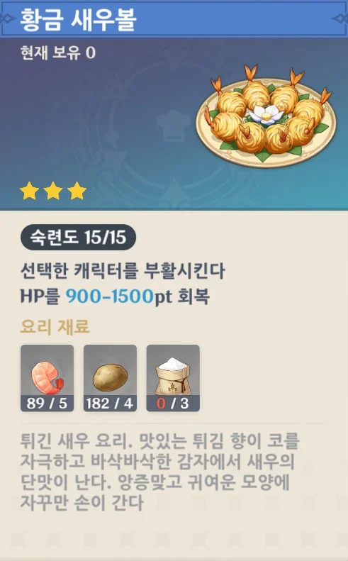

요리 그림을 보니 손이 많이 갈 것 같기는 하다.

&nbsp;

원신에 등장한 요리를 실제로 만들어 보는 영상을 본 적이 있는데, 그림만 보고 요리를 뚝딱 만들어 내는 사람들을 보면 참으로 대단하다는 생각이 든다. 어떻게 그게 가능한 거지?

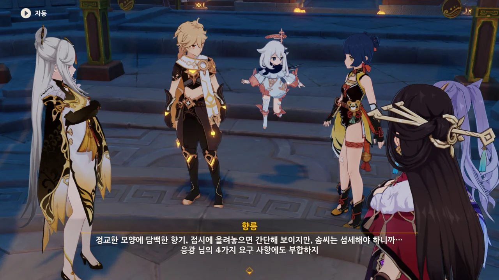

**정교**한 모양에 **담백**한 향기를 가졌고, 접시 위에 올려놓으면 **간단**해 보이는 요리이지만 그걸 만드는 솜씨는 **섬세**해야 한다. 각청이 좋아하는, 새우라는 **해산물**을 썼으며, 기름에 튀겼으니, 북두가 좋아하는 **뜨거운 요리**도 된다.

그야말로 세 사람이 모두 만족할 만한 음식인 셈이다.

&nbsp;

와, 이게 이렇게 다 들어맞는다고?



황금 새우볼을 찬양하다가 자신의 취향을 들킨 각청. ㅋㅋㅋㅋㅋㅋ

귀엽다.

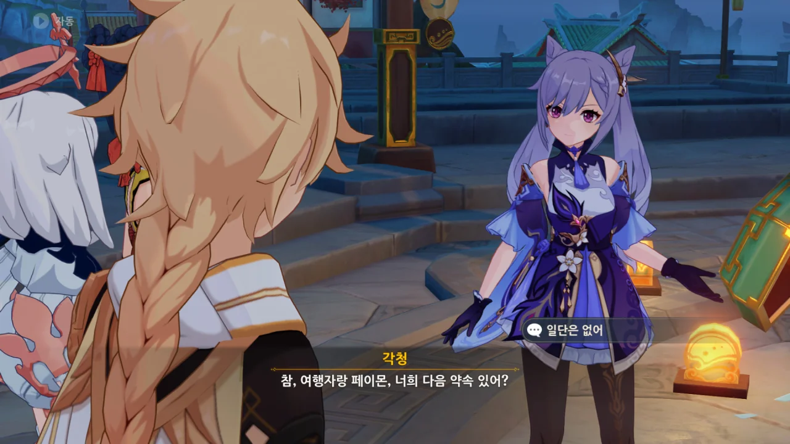

부끄러움을 숨기기 위해 재빨리 화제를 돌리는 각청.



각청은 조왕신에 대한 조사를 하고 싶어한다. 그러니까 여행자와 함께 그 조사를 하고 싶다는 말이겠지?

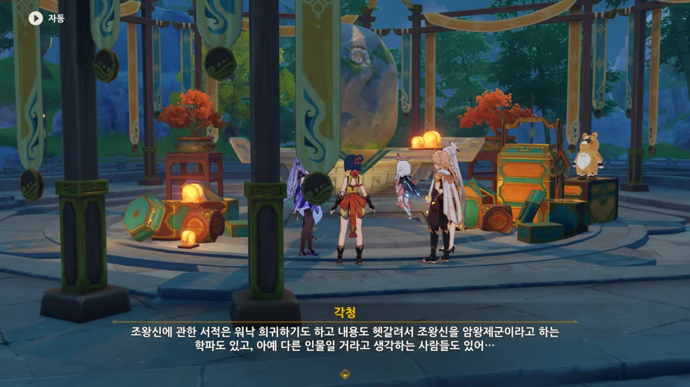

예전에 리월에서 일일 임무를 하다가 '조왕신은 암왕제군일 것이다'라고 말하는 글을 본 것 같다. 분명 그 이야기이겠지.

&nbsp;

신화는 문화와 함께 움직인다.

한 문명이 다른 문명을 점령하며 해당 문명을 흡수할 때, 그들의 신화 역시 점령 문화에 흡수된다.

메소포타미아 신화의 '이슈타르(Ishtar)'가 유대교/기독교에 의해 '아스타로트(Astaroth)'로 변한 것이 그 대표적 예이다. 물론 이슈타르는 고대 그리스로 건너가 '아프로디테(Aphrodite)'가 되기도 하고, 고대 이집트에서 '세크메트(Sekhmet)'로 변하기도 했다.

그래서 조왕신을 암왕제군으로 여기는 것 역시 기존 조왕신 문화가 암왕제군 문화에 흡수된 영향으로 생각하고 있었는데... 이런 부분까지 세심하게 만들 줄이야.

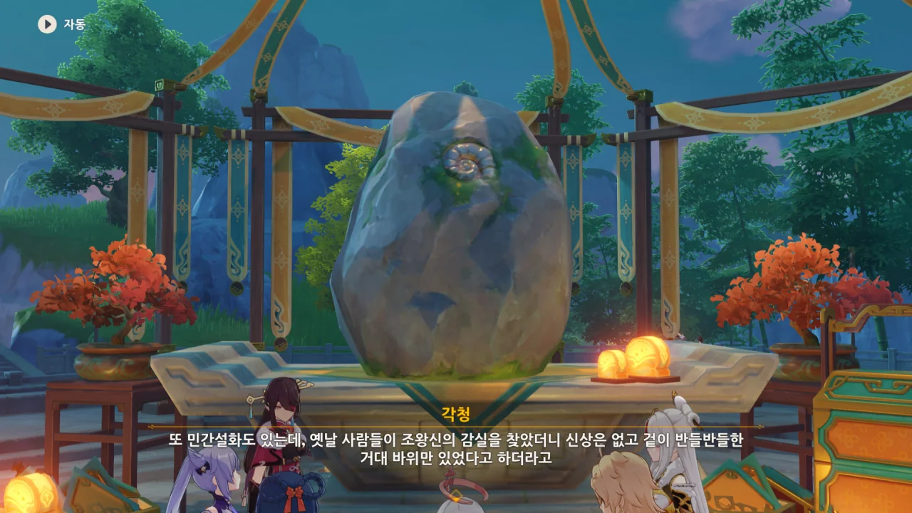

아니, 그 대사가 나올 때 대놓고 저 돌덩어리에 초점을 맞추면 '이 돌덩어리가 그 거대 바위요'라고 하는 것과 뭐가 달라 ㅋㅋㅋㅋㅋㅋ



각청의 할아버지는 조왕신을 기리던 「조신절」이 지금 「축월절」의 원형일 것이라는 가설을 세웠다.

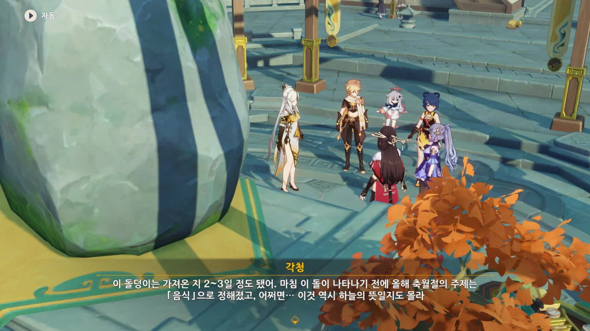

돌덩어리가 떠내려온 것과 축월절 주제가 음식이 된 것에 대체 무슨 상관관계가 있는 거지?

아, 설마 저 돌덩이가 진짜 그 민간설화에 나온 '겉이 반들반들한 거대 바위'라는 거야?

&nbsp;

조왕신의 실체를 알아내기 위해 각청을 따라가면 향릉을 위해 사람들이 선호하는 음식을 조사하지 못하게 된다.

그런데 향릉이 마침 좋은 생각이 있다고 한다.



향릉도 조왕신 조사에 동참하면 된다! ㅋㅋㅋㅋㅋㅋ

각청이 조왕신에 관해 조사하며 여러 사람을 만날 테니, 마침 여러 사람에게 선호 음식에 관해 물어보아야 하는 향릉에게도 좋은 기회라는 것이다.

오... 괜찮은 발상인걸?

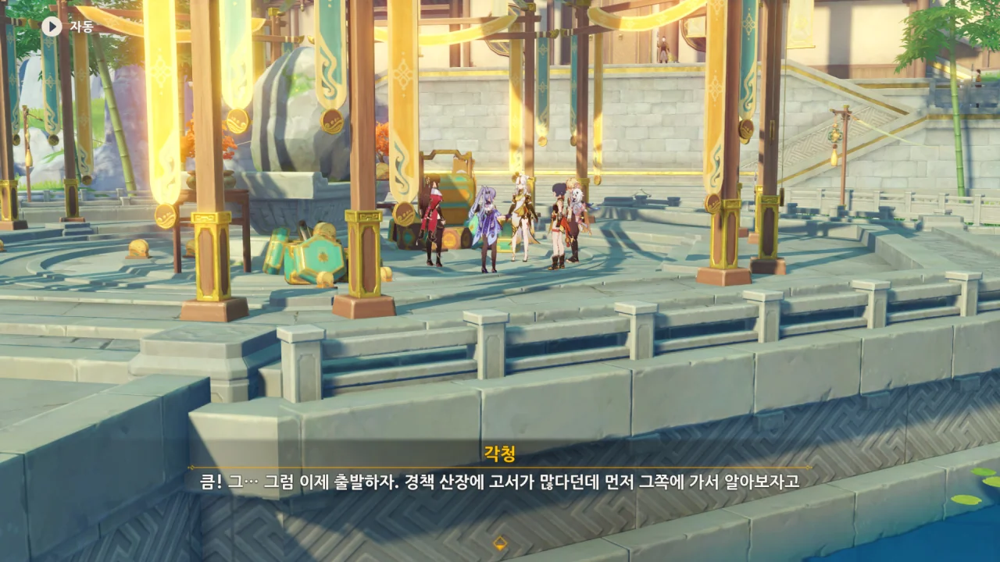

그리하여 다음 목적지는 각청을 따라 경책 산장이 되었다.

***



경책 산장에 도착한 일행. 고서가 있을 만한 곳을 물어보자, '비운 상회의 낡은 창고'를 알려 준다.

흠... '비운 상회의 도련님', '가끔 책을 보러 옴'... 이거 행추 아냐?

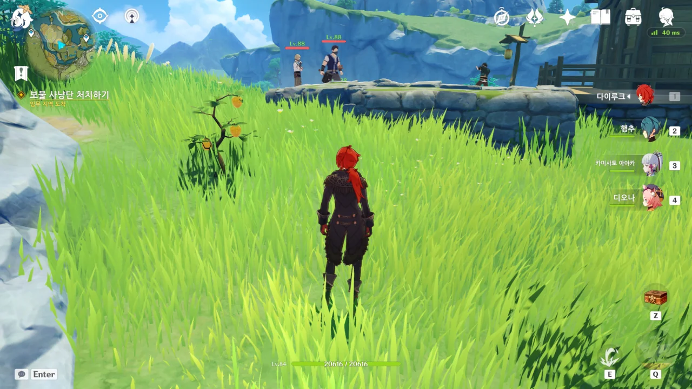

창고가 있는 곳으로 가보니, 보물 사냥단이 민간인을 삥뜯고 있다.

이게 어딜...

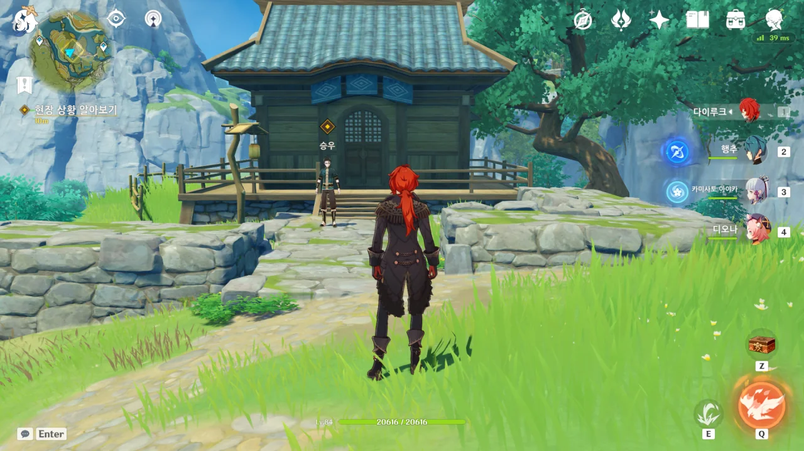

보물 사냥단을 적당히 손봐준 후, 창고 건물을 다시 한번 살펴본다. 뭔가 내가 생각했던 창고의 크기보다 훨씬 작은데...

건물 지하에 다른 공간이 있는 것이 아니라면, 이 창고에 있는 고서의 양은 그리 많지 않을 것 같다. 건물이 너무 작아.

하지만 지하에 책을 보관하면 책이 습기를 먹기 십상이니, 이 창고에 지하 공간은 없다고 봐야 하겠지...

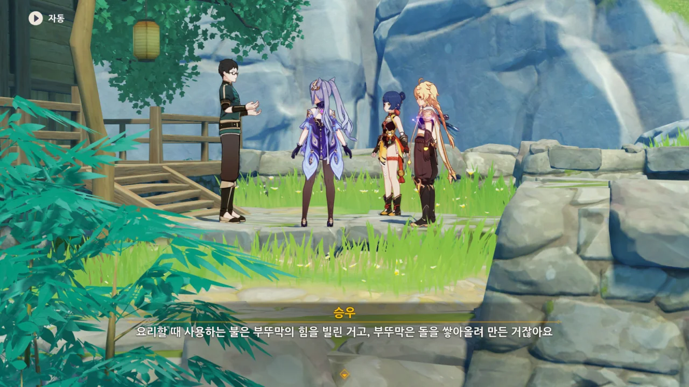

이 사람은 조왕신을 암왕제군으로 알고 있다.

부뚜막은 돌을 이용해 만든 것이니, 암왕제군이 조왕신일 것이라는데... 부뚜막의 핵심은 돌이 아니라 불 아냐? 부뚜막에 돌이 없어도 조리는 할 수 있지만, 불이 없으면 조리를 아예 못 하잖아.



아니나 다를까, 아까 약심 할머니가 말한 '도련님'은 행추였다.

그런데 중운 네가 왜 여기서 나와?

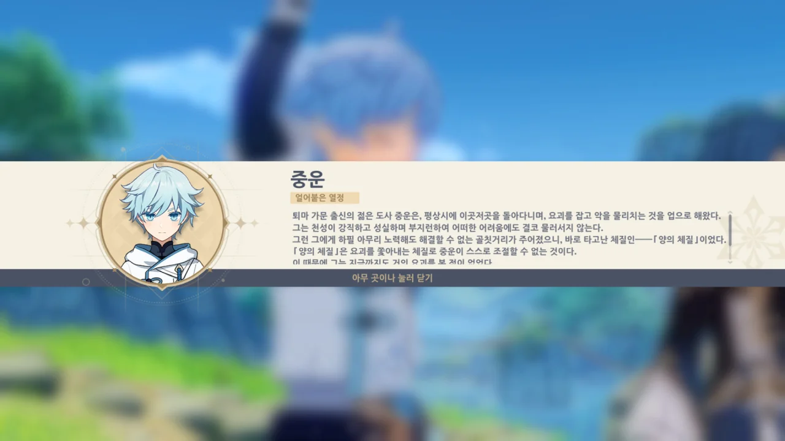

왜 중운만 이렇게 따로 소개 페이지가 나오나 했다.

다른 캐릭터들은 전부 마신 임무에서 한 번씩 얼굴을 비추었기 때문에 이미 소개가 되었지만, 중운은 마신 임무에 출연한 적이 없어 여기서 등장인물 설명을 하는 것이었다.

&nbsp;

중운도 생각해 보면 굉장히 딱한 캐릭터이다. 퇴마사라서 요괴를 퇴치해야 하나, 본인의 강력한 양기 때문에 요괴들이 중운만 보면 도망치기 바빠 요괴를 퇴치하지 못하고 있다.

아무튼 요괴를 퇴치한 것 아니냐고? 중운의 양기 때문에 요괴가 잠시 도망한 것이니만큼, 중운이 가버리면 다시 요괴가 돌아온다. 그러면 말짱 도루묵이 되지.

&nbsp;

행추는 중운과 친한 사이인데, 행추가 중운을 골탕 먹이는 경우가 대부분이다. 음, 그런 관계를 친하다고 하는 게 맞나?



행추는 책을 보려 여기에 왔고, 중운은 행추를 따라왔을 뿐이라고 한다.

아무리 봐도 중운이 끌려온 것 같은데...

&nbsp;

누룽지는 여전히 곳곳에서 자신의 존재감을 과시하고 있다.

&nbsp;

지금 생각해 보니, 행추는 이미 베스트셀러 작가이다. 그 책이 리월이 아닌 이나즈마에서 유행해서 그렇지...



이야, 설마 행추, 이 창고에 무슨 책이 있는지까지 다 외운 거야? 각청에게서 '조왕신'이라는 키워드만 듣고 책 제목까지 제대로 기억해 낸다.

대단한 걸...

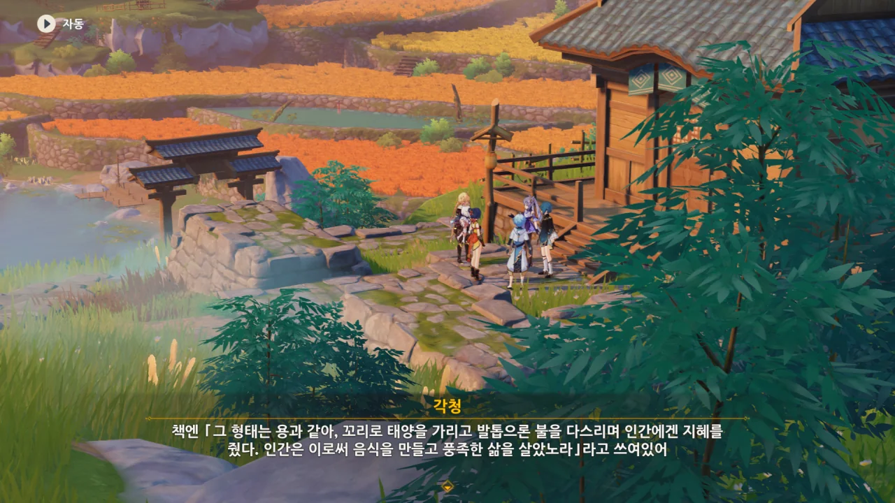

티바트에서 일반적인 용의 모습이 동양 용의 모습인지, 서양 용의 모습인지를 잘 모르겠다.

몬드에서 만난 용, 드발린은 서양 용의 모습을 하고 있었지만, 리월에서 만난 용, 암왕제군은 동양 용의 모습을 하고 있었거든. 그런가 하면 리월의 야타용왕은 또 서양 용의 모습을 하고 있다.

일단 빈도로만 따지면 서양 용의 모습이 더 일반적일 것으로 생각할 수는 있는데...

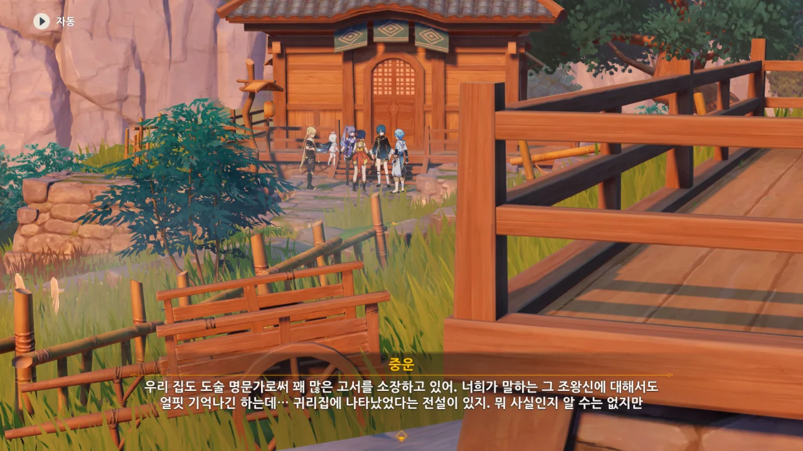

조왕신이 귀리집에 나타났었다는 전설을 읽어보았다는 중운.

귀리집은 현재의 귀리 평원인데, 그 넓은 평원을 뒤지는 것은 불가능에 가깝다.

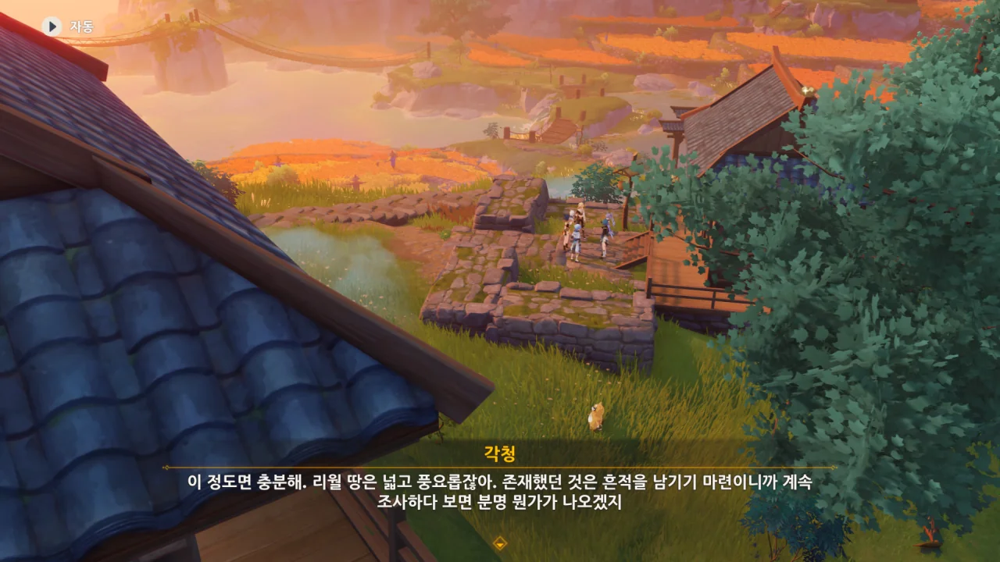

*빠른_포기.png*

귀리집이라는 단서 하나만으로 귀리 평원 전체를 뒤지는 건 너무 무모한 일이니 말이다.



향릉이 요리왕 대항전에 참가한다는 이야기를 듣고 기겁하는 중운. 아니, 향릉이 대체 무슨 요리를 만들었길래?

물론 향릉이 이상한 재료로 음식을 만들긴 하지만, 그래도 맛은 좋다고.

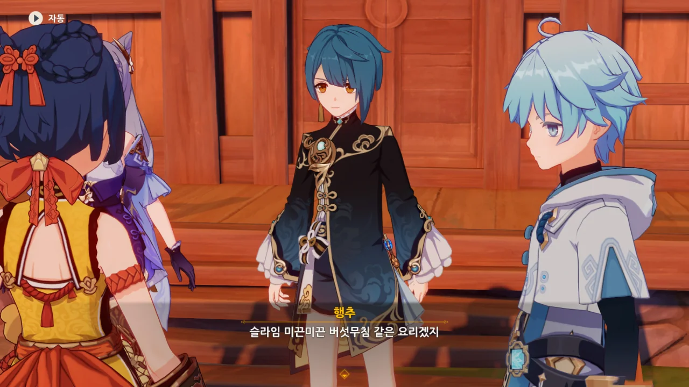

'슬라임 미끈미끈 버섯무침'... 슬라임이 무슨 맛이 날지는 둘째치고, 미끈미끈 이라는 말이 붙은 것으로 보아 분명 식감이 이상할 것이다.



향릉이 그런 해괴한 음식을 대항전에 내놓지 않을 것이라는 이야기를 들은 중운은 자신은 냉채를 좋아한다고 말한다.

중운이 찬 음식을 좋아하는 것은 아까 말한 중운의 체질 때문이다. 차가운 음식을 먹어 몸 안의 양기를 억눌러야 제대로 도사 활동을 할 수 있으니까.

하지만 기껏 차가운 음식 등으로 양기를 눌러놓았더니 행추가 뜨겁거나 매운 음식을 먹이거나 신염의 노래를 들려주는 탓에 다시 양기가 솟아올라 곤란하다고 한다.

신염의 노래를 듣고 양기가 끓어오른다는 건 좀 신기한데.

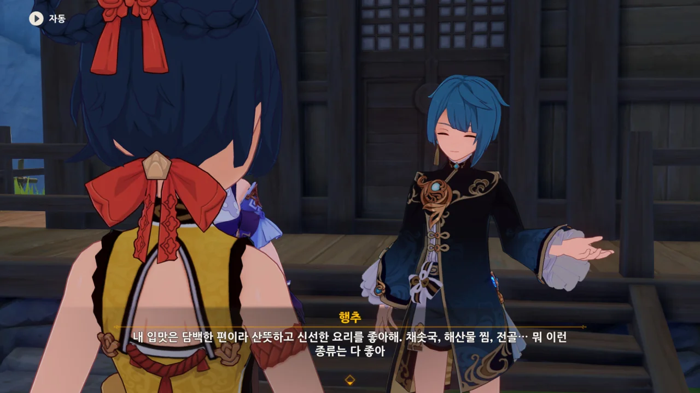

여기, 담백 파 한 명 더 추가요. 나 역시 기름진 음식보다는 담백한 음식을 더 선호한다.

기름진 음식은 가끔 기름진 음식이 땅길 때 한 번 먹고 마는 것이 최고야...

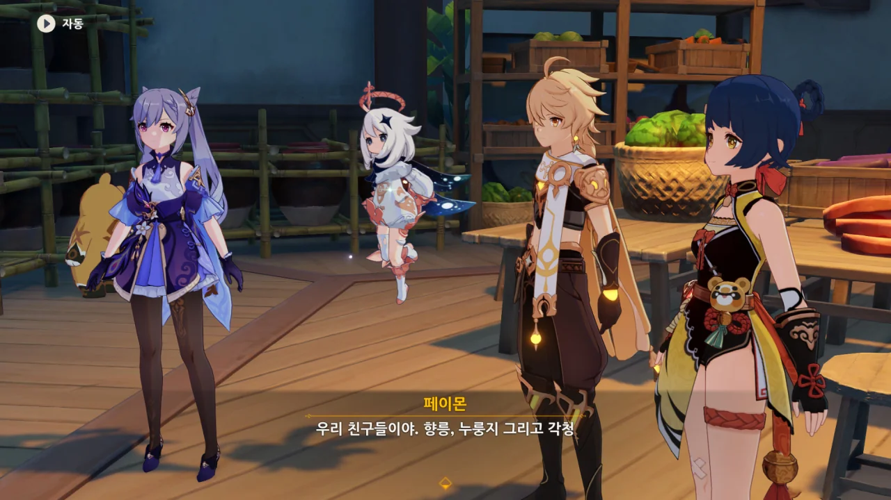

자연스럽게 일행으로 불리는 누룽지.

누룽지와 비슷하게 생긴, 앰버의 '토끼 백작'이 인형인 탓에, 향릉의 누룽지 역시 인형으로 알고 있었다는 사람이 은근히 많이 있었다.

누룽지는 인형이 아니다.

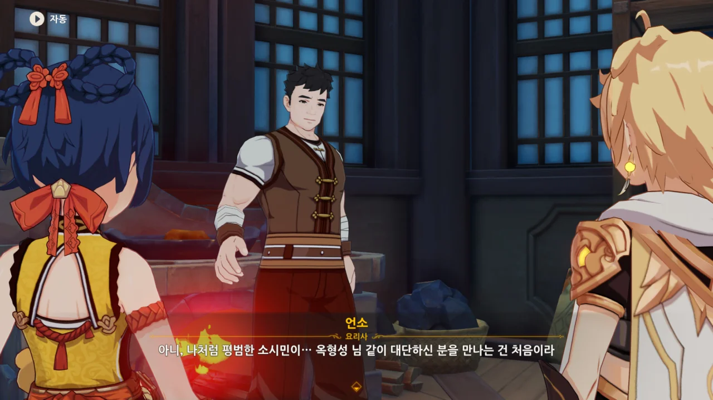

그러고 보니 리월칠성은 장관급 인사 아닌가. 언소가 놀랄 만도 하다.

정작 플레이어와 여행자에겐 그저 지인일 뿐이지.

어휴... 향릉 머릿속에는 온통 요리뿐이다. 그게 나쁘다는 건 절대로 아니지만.

하지만 보통 '건장한 신체, 힘 있는 손목, 순박한 눈빛'이라고 하면 '저 사람 잘생겼다'라는 결론이 나오지 않나? 왜 '좋은 요리사'라는 결론이 나오는데...?

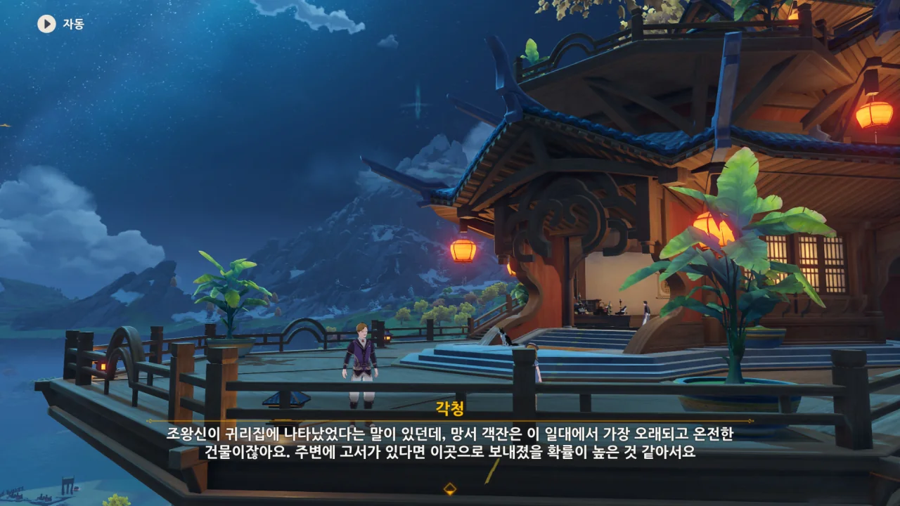

와, 이런 각도로 경책 산장에서 드래곤 스파인을 보게 될 줄은 몰랐는데.

드래곤 스파인 꼭대기에 뜬 한천의 못 역시 똑똑히 잘 보인다. 한천의 못이 드래곤 스파인이 설산이 된 이유라고 하던데.

저 한천의 못을 원래대로 복구한다고 열심히 추운 설산을 등산한 기억이 난다.

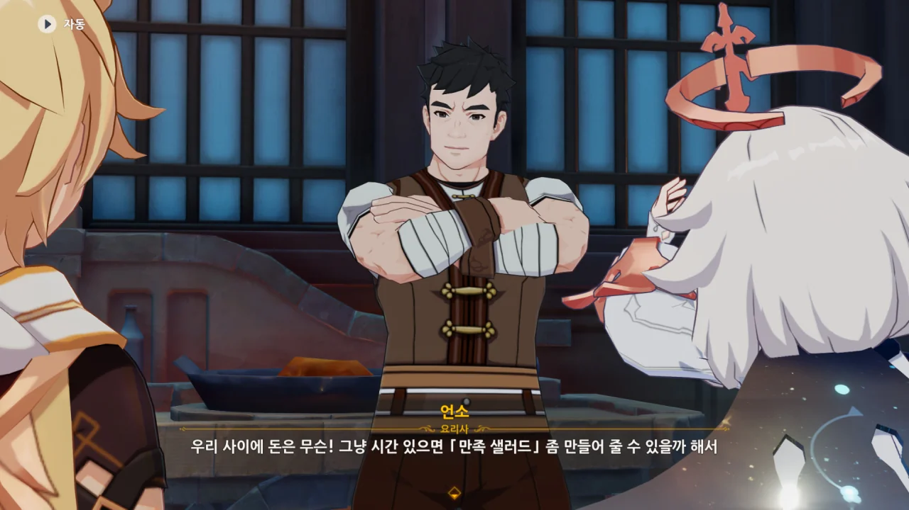

응? 웬 만족 샐러드?



알고 보니 늘 행인두부만 먹는 소에게 줄 요리라고 한다.

&nbsp;

사진을 잘못 찍어 페이몬이 '네깟 것이?'라고 손가락질하는 느낌의 사진이 되어버렸다.

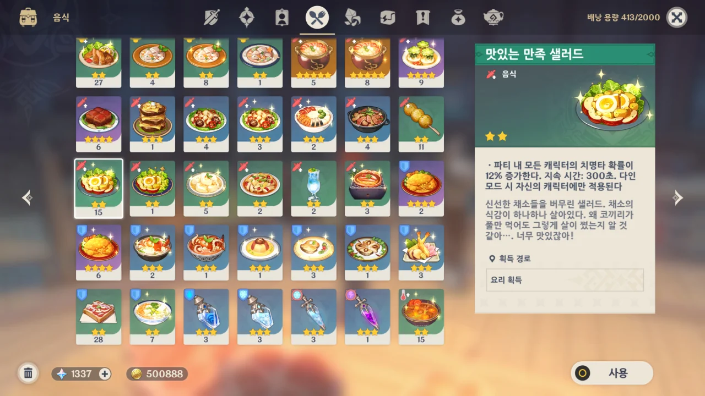

대화가 끝나자마자 "이 정도면 되겠지?"라는 페이몬의 대사가 나와 대체 무슨 상황인가 했는데, 인벤토리에 이미 만족 샐러드가 있어 만족 샐러드를 만드는 임무가 곧바로 끝났기 때문이었다.

&nbsp;

지금 글을 쓰면서 발견한 것인데, 원석 개수가 LEET이다. 오...



언소가 준 책에 나와 있는 조왕신에 대한 문구들. 아까 들었던 문구와는 비슷하면서 또 다르다.

언소가 도와줘서 고맙다는 의미로 쏜 음식을 먹으러 가는 일행.

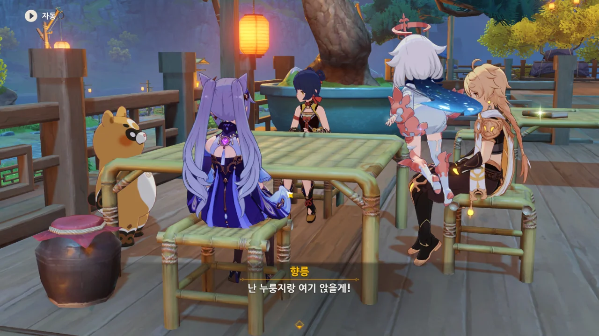

향릉이 "난 누룽지랑 여기 앉을게!"라고 했지만, 향릉 혼자만 의자에 앉고 누룽지는 그대로 서 있다.

누룽지가 의자에 못앉는 신체 구조를 지닌 것도 아닌 것이, 아까 불복려에 있을 때 멀쩡히 의자에 앉은 누룽지를 봤다.

향릉... 누룽지를 푸대접하는구나... (물론 농담이다)

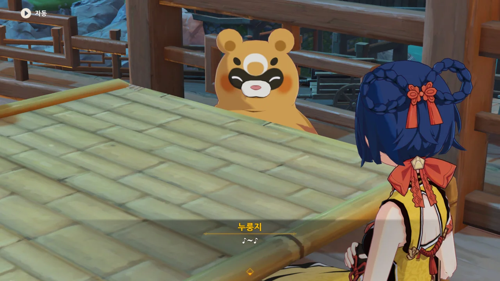

지금껏 누룽지를 말 없는 마스코트처럼 보고 있었는데, 갑자기 누룽지가 노래를 부른다.

누룽지가 노래 부르는 걸 처음 봐서 그런가, 좀 깬다.

뭐, 누룽지도 먹을 걸 보고 기분이 좋을 수도 있지.

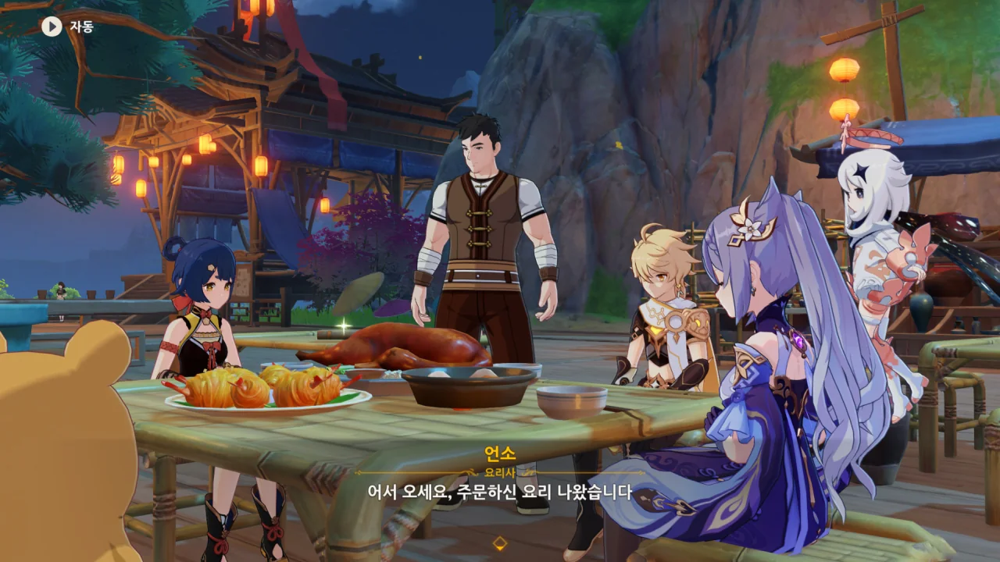

오, 황금 새우볼이다.

다른 요리도 같이 나왔지만, 눈에 들어오는 것은 황금 새우볼 뿐이다.



언소가 내놓은 요리를 보자마자 그가 자신과 선의의 경쟁자가 될 것임을 확신하는 향릉.

아까 말했다시피, 향릉 머릿속은 온통 요리 생각뿐이다.



부룩과의 대결이라면 향릉 전설 임무를 말하는 것일 텐데... 와, 이게 대체 언제 적 이야기야?



와, 나 누룽지가 눈이 뚱그레지는 얼굴, 처음 봤어.

각청이 좋아하는 황금 새우볼을 혼자서 다 먹어버린 누룽지.

각청은 누룽지에게 화도 못 내고 그저 눈물만 삼킬 뿐이었다.
