축월절 이벤트의 스토리는 얼추 다 끝낸 것 같다. 나중에 또 이야기하겠지만, 게이지를 1,000까지 채우면 뭔가 다른 스토리가 또 열릴 것 같다.

금사과 제도 이벤트 때에는 필드가 열리고 '몇 시간 후에 열림' 등의 시간차를 두고 또 다른 스토리가 열려 불편했었는데, 이번에는 이벤트 스토리가 막힘없이 쭉쭉 시원하게 나가니, 꽤 괜찮다.

&nbsp;

그나저나 축월절 이벤트를 지금 여는 이유가 중국이 10월 1일부터 7일까지 국경절 연휴라서 먼저 빨리 이벤트를 여는 것이라고 하던데... 설마 이 녀석들, 연휴라고 아무 일도 안 하는 건 아니겠지...?

***

리월에서 향릉과 헤어진 후, 각청이 어떻게 해야 향릉과 편하게 지낼 수 있는지 물어본다.

응? 처음 만났을 때부터 별 어려움 없이 이야기하길래 별문제가 없는 줄 알았는데?



아무래도 각청에게 향릉은 어려운 사람이었나 보다. 각청같은 사람이 향릉을 어려워하다니, 이건 진짜 의외인걸.

그래도 쑥스러움을 무릅쓰고 향릉과 원활히 대화한 걸 보면 리월칠성은 역시 리월칠성인가보다.

만민당에 방문하자 팔짝팔짝 뛰며 팔을 흔드는 누룽지가 반겨준다.

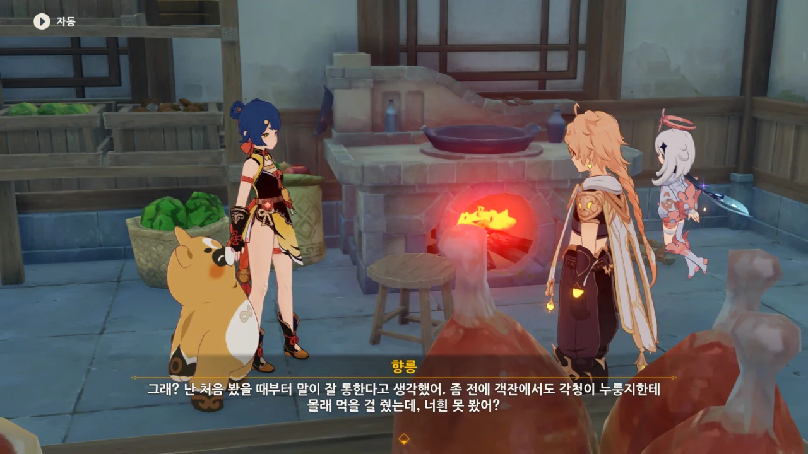

향릉이 어렵다고 생각한 각청과 달리, 향릉은 각청과 말이 잘 통한다고 생각했다.

그런데 아까 망서 객잔에서 각청이 누룽지에게 몰래 먹을 걸 줬다고? 각청이?

황금 새우볼을 누룽지가 전부 먹은 걸 보고도 누룽지에게 먹을 걸 챙겨준 것일까?

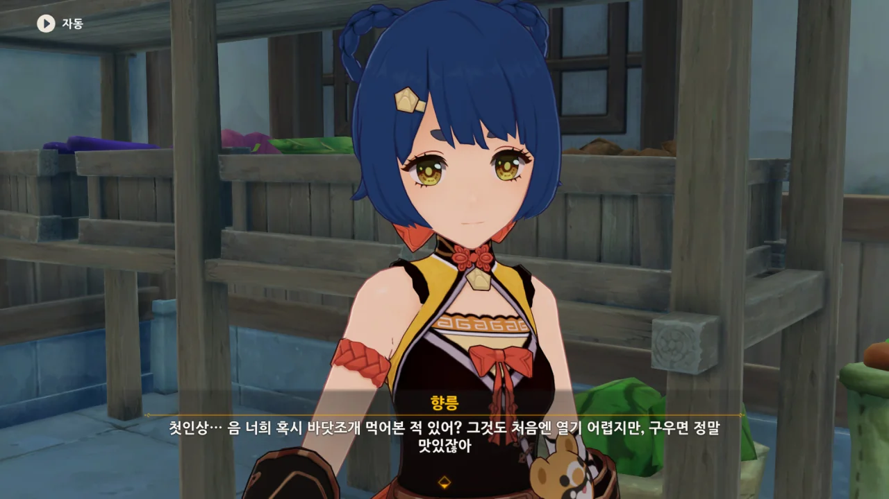

향릉은 각청이 바닷조개와 같은 사람이라고 말한다. 비유할 때조차 식재료로 사람을 비유하다니...

처음에 열기는 어렵지만 구우면 정말 맛있는 바닷조개와 같이, 각청도 겉보기에는 어려운 사람처럼 보이지만 그 속은 따뜻한 사람이라는 의미인 걸까?

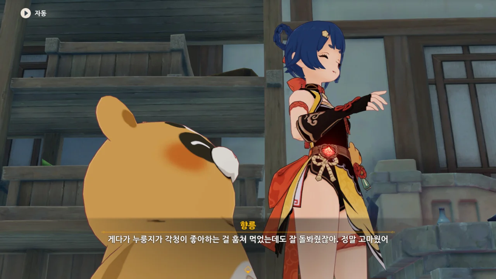

이야, 정말로 황금 새우볼을 누룽지가 다 먹은 후에도 먹을 걸 챙겨준 거였네...

각청의 마음은 정말 넓구나.



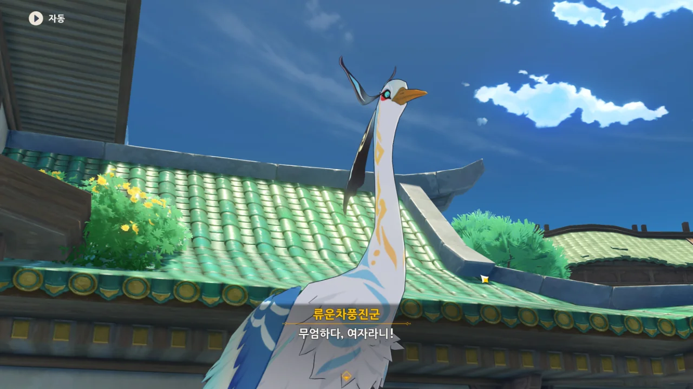

> | | |
> |:--|:--|
> | 향릉 | 엄청나게 큰 새다! |
> | 페이몬 | 그 여자다! |
> | 류운차풍진군 | 무엄하다, 여자라니! |
> {_borderless=true,_thead=false}

ㅋㅋㅋㅋㅋㅋ 류운차풍진군도 '엄청나게 큰 새'라고 자신을 부르는 것은 참고 넘어가도 '그 여자'라고 부르는 건 못 참았나 보다.

하지만 둘 다 맞는 말이잖아. '여성체'라고 부를 수도 없고 말이다.

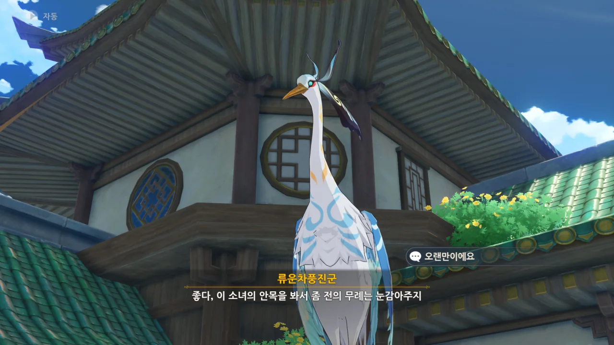

... 왜 난 이 장면이 류운차풍진군 혼자서 북 치고 장구 치는 모습으로만 보이는 것일까.

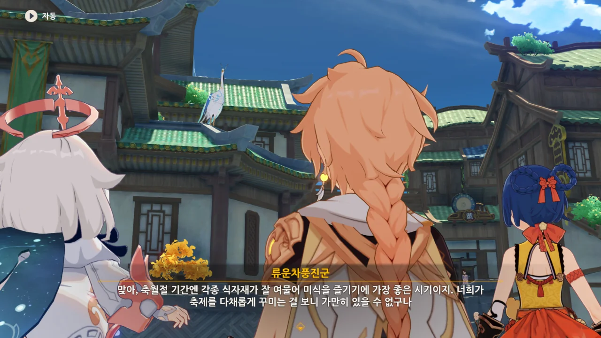

츤츤대며 말을 돌려 하는 류운차풍진군의 말을 해석하기 위해선 번역기가 필요하다.

> 너희들이 축제하는 걸 보니 나도 좀이 쑤셔 견딜 수 없었다.



> 나도 미식이나 요리에 일가견이 있다.
> 하지만 지금 그걸 증명할 수는 없으니, 나중에 하겠다.

저 말은 사실이다. 류운차풍진군은 정말 말 그대로 이것저것 다 잘하니까.

다만 그걸 꼭 인간과 비교해서 '내가 더 잘났다'라고 젠체하는 게 문제지만.

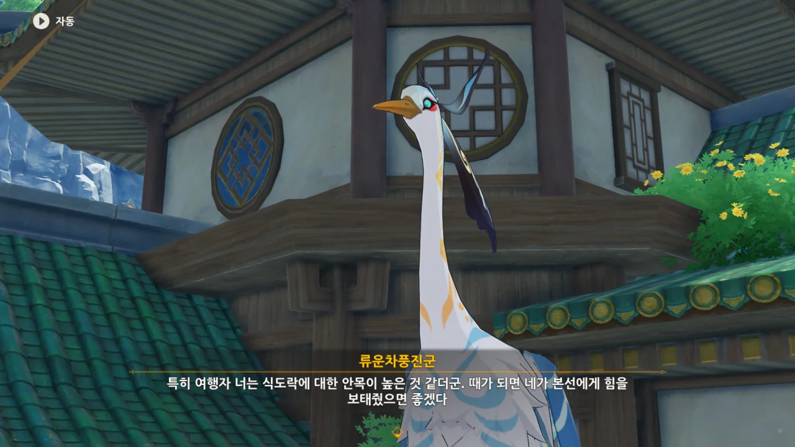

> 저번에 먹은 음식이 맛있었다. 이번에도 해줘라.

류운차풍진군을 처음 만나러 갔을 때 음식을 만들어 가져다 바쳤던 적이 있다. 그 이후로 여행자의 요리를 마음에 들어하는 것 같다.

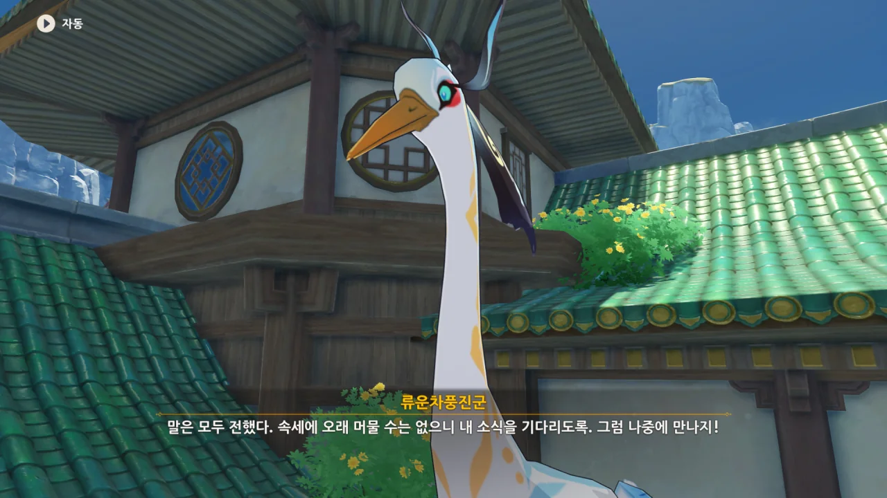

> 이제 감. ㅂㅂㅇ.

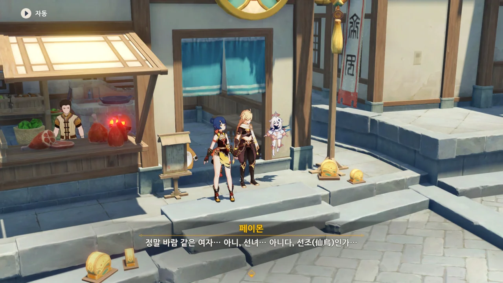

거 봐. 여자라고 하면 편할 것을 선녀(仙女)니, 선조(仙鳥)니 하니 말이 이상해지잖아.

앞으로 류운차풍진군을 보면 '그 여자'라고 부르도록 하자.

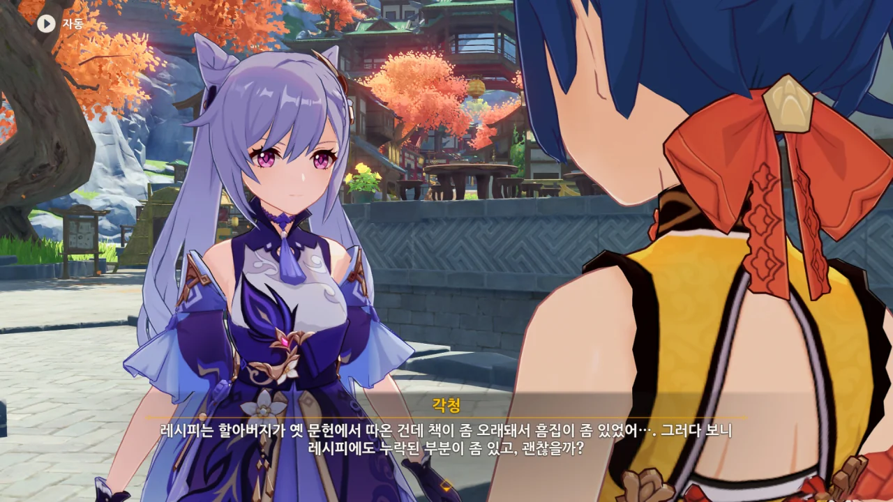

각청이 가져온 레시피에는 누락된 부분이 있었다. 향릉이 그 빈자리를 채우긴 할 테지만, 왜 갑자기 아까 그 '슬라임 미끈미끈 버섯무침'이 생각나는 것일까?

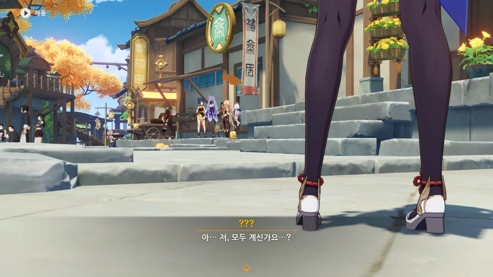

갑자기 감우가 등장했다.

감우의 목소리를 듣기도 전에 다리만 보고 감우인 것을 곧바로 알아차렸다.



업무 이야기가 아니라 사적인 질문을 하기 위해 찾아왔다는 감우. 그런 감우를 보고 각청은 '부당하게 일을 처리한 적이 없는데...'라고 생각한다.

각청이 부당하게 일을 처리하는 사람이 절대 아니지 않은가. 이 대사가 이상하다고 생각해서 다른 언어로는 어떻게 되어 있나 찾아보았다.

일본어 더빙은 '최근 일을 잘못한 것이 없는데'라고 하더라. 즉, 오역이다.

&nbsp;

1.6 버전쯤부터 게임 번역의 질이 조금 떨어졌지만, 게임의 경험을 해칠 정도는 아니었다.

하지만 이건 아니지. 아예 다른 뜻이 되어버렸잖아.

이래서야는 게임을 온전히 즐겁게 즐길 수 없다. 이상한 부분이 나오면 제일 먼저 오역을 의심해야 하니 말이다.



감우가 온 이유는 류운차풍진군이 혹시 자신의 어릴 적 이야기를 한 것일지 걱정해서 온 것이었다.

그게 무슨 이야기냐고?

이걸 말하는 거다.

&nbsp;

감우의 캐릭터 이야기를 보면 알 수 있는 이야기이다.

감우는 옛날에 꽤 뚱뚱했었는지, '마신 전쟁 때 공처럼 뚱뚱한 몸으로 괴수의 식도를 막아 상대를 진압한 적이 있다'라고 되어 있다. 그 외에도 류운차풍진군이 직접 '감우가 산을 굴러 내려간 적도 있다'라고 말하기도 했었고.

그때의 경험이 꽤 충격이었는지, 감우는 지금도 아주 적게 먹고 다닌다고 한다.

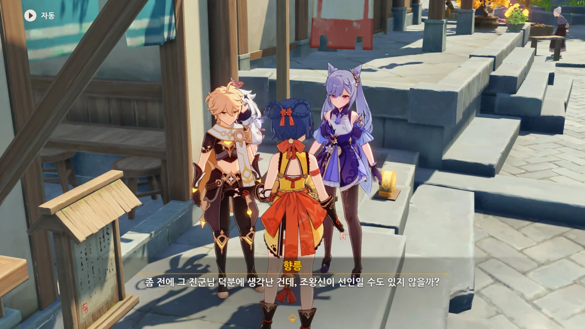

이번엔 새로운 가설이 나왔다. 바로 조왕신이 선인 중 한 명이었지 않았을까 하는 가설이다.

음, 그것도 나름 그럴듯한데.

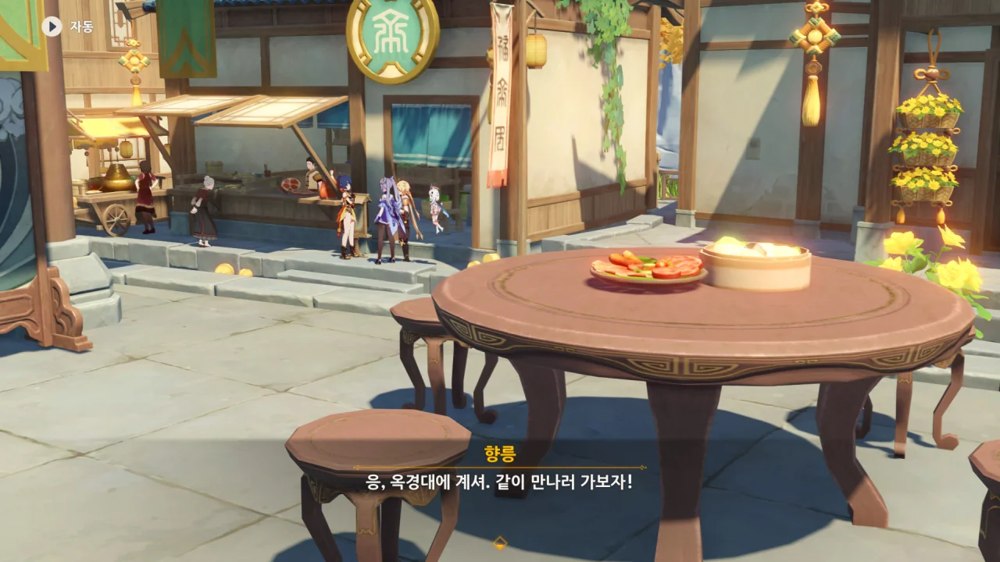

뭐, 그건 옥경대에 계신 평 할머니에게 물어보면 알 수 있을 것이다. 평 할머니도 선인 중 한 명이니 말이다.

***



그래, 나도 상당히 의외이다.

향릉의 사부가 평 할머니였을 줄이야! 향릉이 궁을 쓸 때마다 '사부의 창술을 감상하라구!'라고 하기에 향릉의 사부가 누구인지 굉장히 궁금해했었는데...

평 할머니가 선인임을 생각해 보면, 향릉은 선인의 제자인 셈이다. 와우.



역시나, 평 할머니는 조왕신과 아는 사이였다고 한다. 그럼, 조왕신이 누구인지도 알고 있으시겠네!



갑자기 축월절에 관해 이야기하는 평 할머니.

「축월」은 본디 선인의 의례였지만, 리월 사람들은 이 의례를 흉내 내 다양한 명절을 만들어 달빛이 아름다운 날, 모두 모여 먹고 마시며 함께하는 기쁨을 만끽했다고 한다.

나중에 암왕제군이 자기 친구를 기념하기 위해 그 명절들과 「축월」을 하나로 합해 「축월절」을 만들고, '하늘을 통해 땅을 보고 달에 맹세하며, 옛 시절을 회상해 현세에 비춰보고 함께하는 즐기는 명절'이라 했다.

그 친구가 아마 조왕신이겠지. 산 사람을 기념하지는 않을 것 아닌가.

그렇다면 조왕신은 지금은 죽고 없는 신이라는 것일까?



드디어 조왕신과 「조신절」에 대한 이야기가 나오려는 순간...



각청이 응광의 급한 호출을 받고 가버린다. 쯧, 산통 깨지게. 왜 하필 지금...



「조신절」은 이름에서 유추할 수 있듯이, 조왕신을 기리는 명절이었던 것 같다.

다만 조왕신은 모종의 이유로 이 세상에서 사라졌고, 사람들의 기억 속에서도 사라져 암왕제군과 동일시될 정도가 되어버렸다.

&nbsp;

하지만 마신은 불멸의 존재라, 조왕신은 땅이 다시 활기를 되찾으면 어떠한 형태로든 다시 돌아오기로 약속했다고 한다.

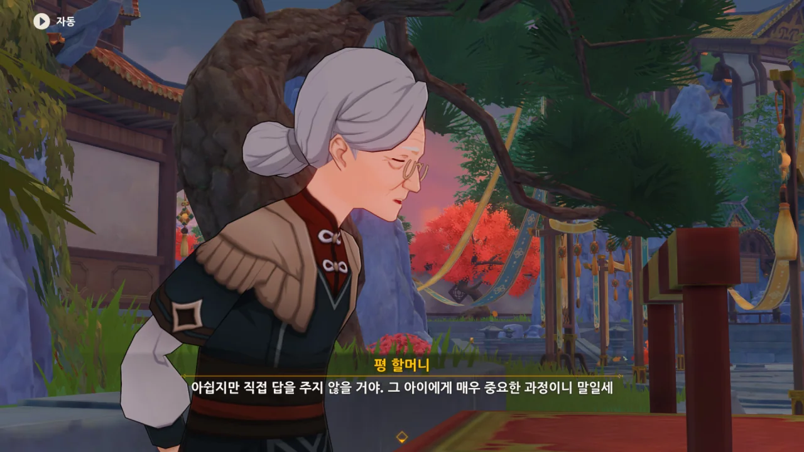

각청의 의문에 대해서는 직접 답을 주지 않겠다고 말한다. 아마 조왕신에 대해 찾는 그 과정조차 중요하다고 여겨서인 것 같다.



새삼 평 할머니가 오래 살았다는 것이 체감된다.

선인은 다 오래오래 사는 모양이다. 당장 감우는 수천 년 동안 리월칠성 밑에서 비서 일을 하고 있고 말이다.



아까 본 그 거대한 바위가 정말로 조왕신상이라고 한다. 신상이라고 하면 보통 멋들어지게 조각된 일곱 신상이 떠오르는지라, 좀 의외이긴 하다.

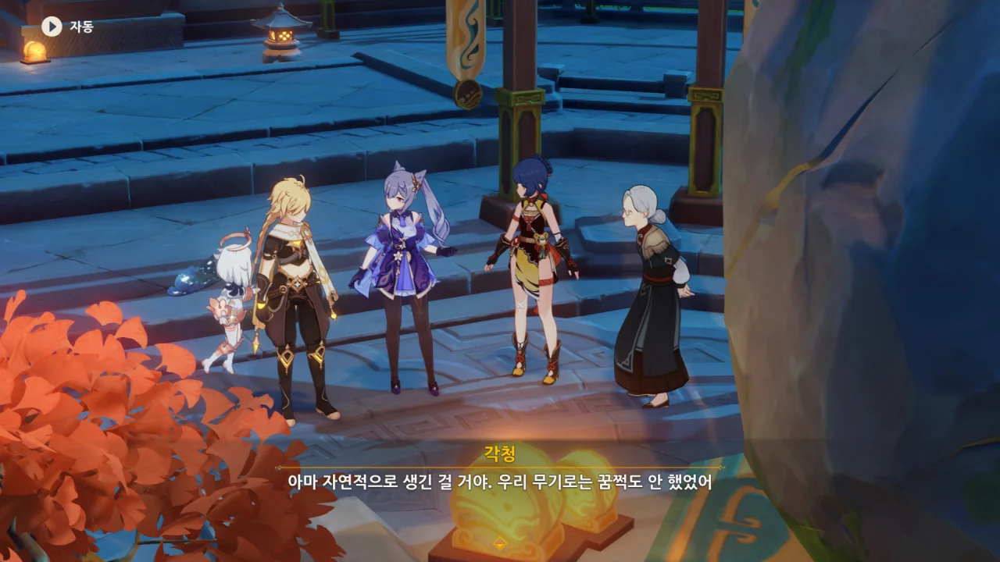

각청이 응광의 호출을 받고 간 이유는 바로 이 조왕신상에 금이 갔기 때문이다. 무기로 아무리 후려패도 실금조차 가지 않던 신상에 저절로 금이 난 것이다.



오, 그럴듯한 가설이다.

신상은 속세의 힘을 흡수할 수 있는데, 이번 축월절 축제 때문에 사람들이 열심히 요리하고, 그 노고가 조왕신상에 전달되어 신상에 변화가 생긴 것이 아닐지 추측하는 각청.

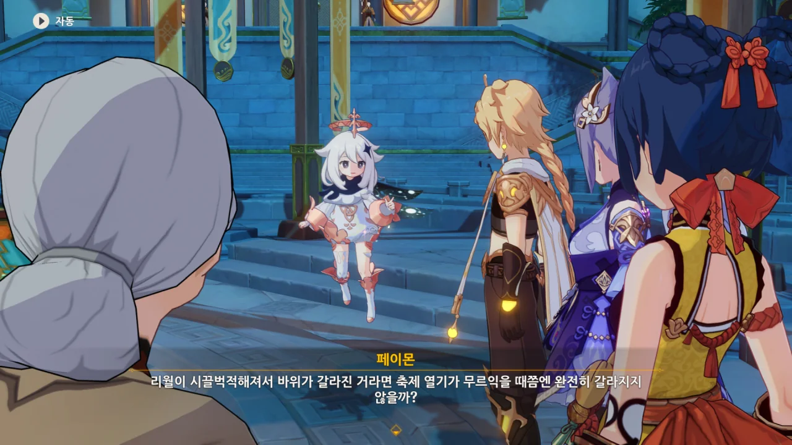

그러면 축월절 축제 끝에는 완전히 깨어나 온전해진 조왕신상을 볼 수 있는 것일까?

와우, 이 집 이벤트 죽여주네.

음식 이야기만 나오면 열을 올리는 페이몬의 뱃속은 대체 어떻게 되어 있는 걸까?

그러고 보면 페이몬 성우가 유튜브에 올린 영상에는 '식비 30만 모라'라는 언급이 있던데...

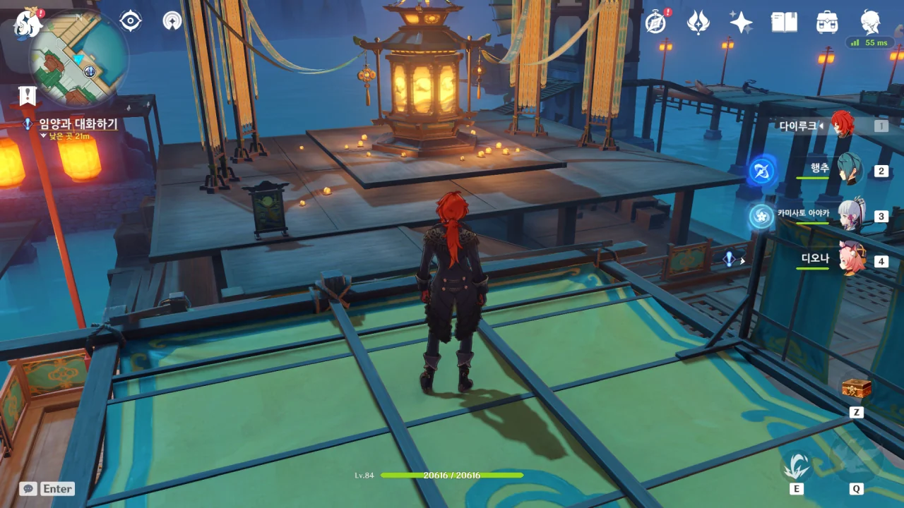

응? 여기 원래 이런 구조물이 있었던가? 내 기억으로는 여기에는 아무것도 없고 그냥 바다만 있었던 거로 아는데...

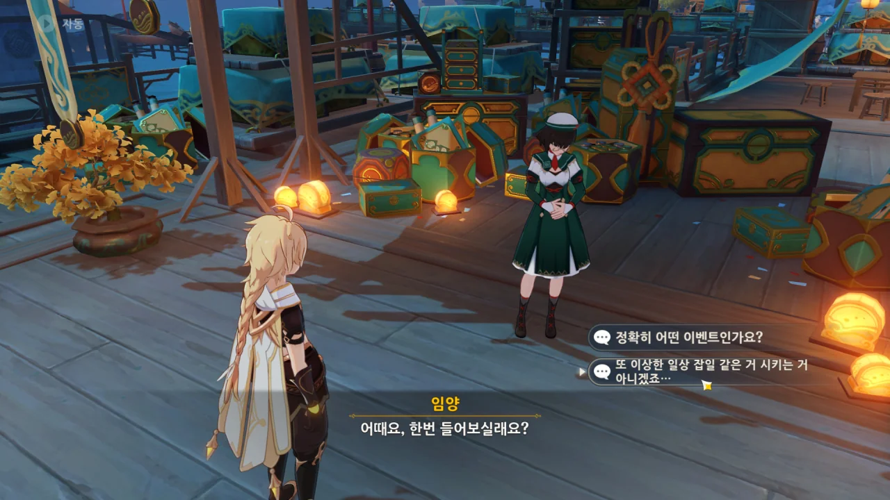

ㅋㅋㅋㅋㅋㅋ 아, 이거 분명 100% 해등절 드립이다. ㅋㅋㅋㅋㅋㅋ

정작 난 그때 당시 원신을 접은 상태였던지라, 해등절 이벤트를 아예 하지 못했지만.

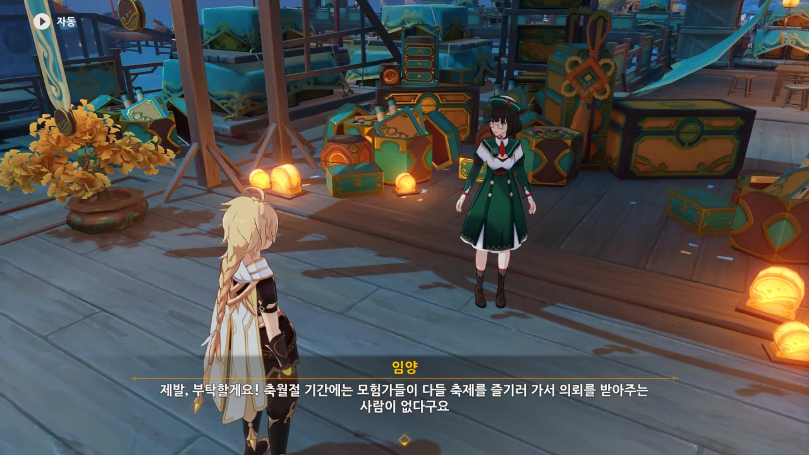

축월절 기간에는 모험가들이 다들 축제를 즐기러 가는 탓에 모험가를 보물상자로 꾀어야 일이 진행될 정도라고 한다.

아, 보물상자라면 어쩔 수 없지!

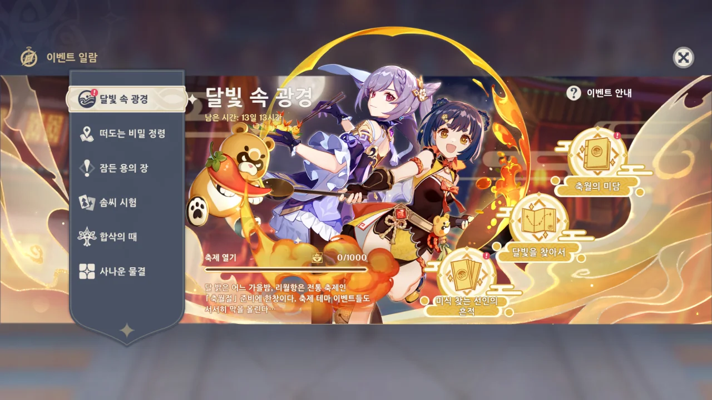

와, 이번 이벤트 삽화가 굉장히 이쁘다. 각청 손에는 예의 황금 새우볼이 들려 있고. ㅋㅋㅋㅋㅋㅋ

이제 각청 하면 황금 새우볼이 연상되는 것인가?

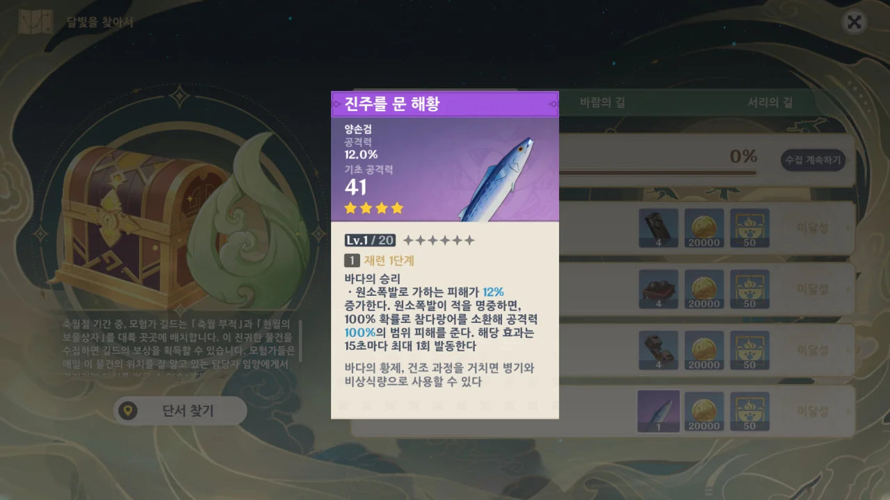

이번 이벤트에서 배포하는 4성 대검, 진주를 문 해황, 이른바 '참치 대검'이다.

난 이걸 보자마자 바로 이 만화를 떠올렸다.

아니, 정글고를 떠올리지 않을 수 없잖아. ㅋㅋㅋㅋㅋㅋ
