이번 축월절 이벤트의 다음 이야기를 보려면 게이지를 1,000포인트 모아야 한다고 하기에 이벤트를 열심히 진행했다.

&nbsp;

다른 건 모르겠는데, 제일 짜증 났던 것 중 하나가 바로 축월절판 신의 눈동자와 보물상자 찾기였다.

첫날에는 지도 사이트에도 정보가 없을 것으로 생각해 커뮤니티에 올라온 공략 사진만 보고 하나하나 찾아가며 먹었는데, 문제는 이런 사진에는 내가 무엇을 먹고 무엇을 아직 먹지 않았는지 체크할 수가 없다.

결국 나중에 가서는 '내가 이걸 먹었나?'라며 가본 곳을 또 가고 또 가는 일이 벌어지더라.

결국 88%에서 더 이상 손으로 찾는 걸 포기하고 NPC에게 가 남은 수집 요소의 위치를 표시해 주는 아이템을 구매해 나머지를 다 찾았다.

&nbsp;

더 화나는 건, 둘째 날부터는 지도 사이트에 수집 요소의 위치가 다 뜨길래 편하게 먹었다는 것이다. 첫날에는 모든 수집 요소를 찾는데 1시간이 넘게 걸린 것에 비해 둘째 날에는 30분도 채 걸리지 않았다.

아, 내 시간! 내 노력!

&nbsp;

그나저나 스크린샷을 찍을 때 UID 부분만 자동으로 가리게 할 수는 없을까? 매번 일일이 손으로 지우는 것이 정말 고통스럽거든.

***



나만 이 상황이 향릉의 괴음식을 먹기 싫어 방금 밥 먹고 왔다고 둘러대는 것으로 보이는 걸까?

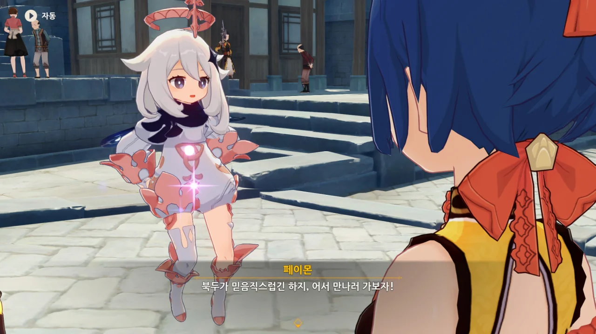

향릉의 정체 모를 요리는 북두에게 떠넘기기로 했다.

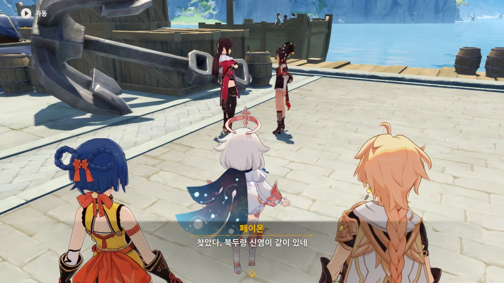

응? 북두와 신염이 함께 있다.



신염이 말하는 '형제'는 분명 북두네 뱃사람을 말하는 거겠지? 북두의 친가족이 아니라.

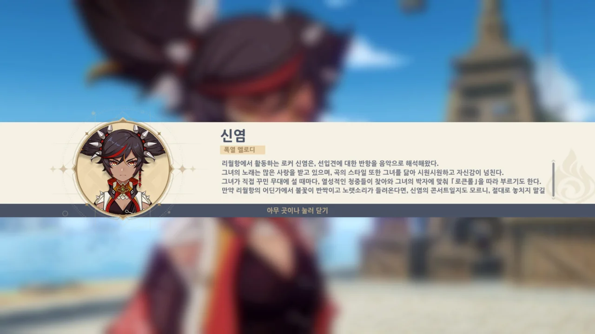

신염이 말하는 걸 보며 '신염은 마신 임무에서 나온 적이 없지 않았나?'라고 생각했었는데, 아니나 다를까, 곧바로 캐릭터 소개 창을 띄워준다.

이런 건 또 철저하다니까.

&nbsp;

그런데 신염이 여기에 꼭 등장할 필요가 있나? 뭔가 등장 캐릭터 머릿수를 채우기 위해 나왔다는 느낌이 드는데.

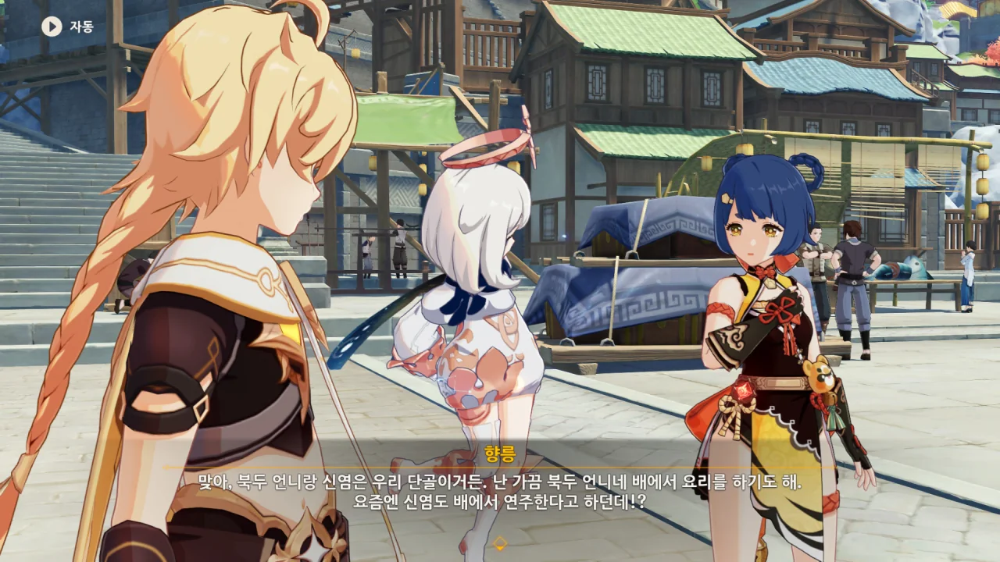

향릉은 출장 요리도 한다.

신염은 출장 공연도 한다.

&nbsp;

둘 다 당연한 일이건만, 내게는 처음 듣는 이야기이기만 하다.

그야, 난 지금까지 향릉은 만민당에서만 요리하고, 신염은 거리에서만 공연하는 줄 알았거든.



호기롭게 향릉의 요리를 먹겠다는 북두와 신염.

요리왕 대항전에 내놓은 요리인 만큼 분명 제대로 된 요리일 것이지만, 왜 내게는 그 요리가 괴음식으로 여겨지는 것일까? 왠지 슬라임을 재료로 썼을 것만 같다.

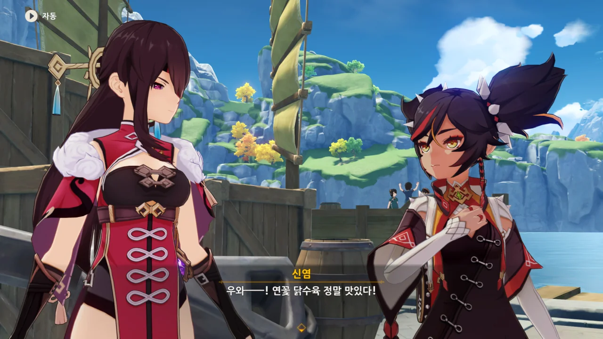

하지만 향릉이 내놓은 요리는 제대로 된 요리인 '연꽃 닭수육'이었다.

졸지에 향릉을 의심한 쓰레기가 되어 버렸다.

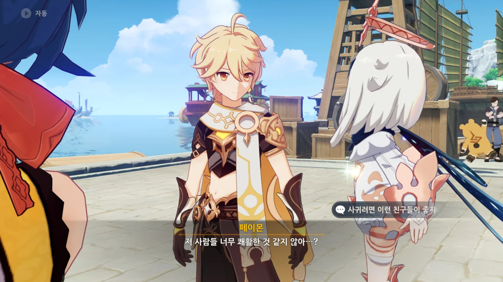

도대체 음식을 먹는 것과 쾌활한 것에 무슨 상관관계가 있는 걸까?

여기도 번역이 잘못된 것 같지만, 커뮤니티에서 이번 이벤트와 관련한 스포일러를 일절 보지 않았기 때문에 저 문장이 오역인지 아닌지 전혀 알 수 없다.

거 봐. 한번 오역이 나오면 이렇게 뭔가 이상한 느낌이 들 때마다 '이거, 혹시 오역인가?'라고 의심하게 된다니까. 이게 얼마나 몰입감을 깨트리는지 과연 미호요는 알고 있을까?

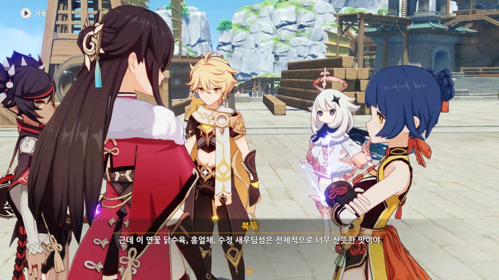

연꽃 닭수육, 흥얼채, 수정 새우딤섬... 하나같이 듣기만 해도 입에 침이 고이는 요리 이름이다.

그런데 대체 흥얼채가 뭐지? 다른 음식은 대충 무슨 음식인지 감이라도 잡히는데 저 흥얼채는 무슨 요리인지 정말 모르겠다.



배에서는 아무래도 맛있는 요리를 먹기 힘드니, 육지에서는 진하고 기름진 음식을 먹고 싶다는 북두.

하기야, 배를 타지 않는 사람도 어느 날 뜬금없이 '아, 오늘 배에 기름칠 좀 하고 싶은걸'이라는 생각이 드는데, 뱃사람은 오죽할까.

그래서 실제로 군인 중 제일 근무 조건이 열악한 잠수함 승조원의 식사는 풍족하게 제공된다고 한다. 바다 깊은 곳에 갇혀 지내는 스트레스를 먹을 것으로라도 풀라는 의미이다.



* 신염의 입맛은 북두와 비슷하다.
* 북두의 입맛은 응광과 정반대이다.
* 북두의 입맛은 향릉과 비슷하다.

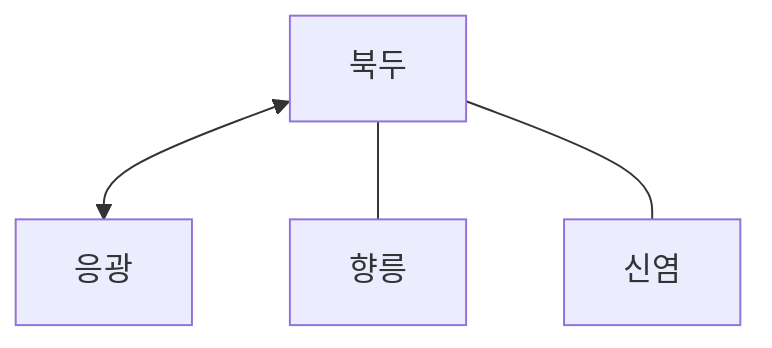

대충 이렇게 되나?



북두가 응광에 학을 떼는 와중에 신염도 같이 머리를 부여잡고 있다.

설마 신염도 응광과 같이 밥을 먹으려다 입맛이 맞지 않아 고생했다는 그런 의미인가? 넌 대체 왜 같이 머리를 부여잡는 거니?

대체 배추탕이 뭐길래...

응광의 음식 취향을 생각해 볼 때 뭔가 물에 배추와 소금만 넣고 끓였을 것만 같은 음식 이름이다.

뭐, 진짜 그런 음식이라면 응광이 말한 정교, 간단, 담백, 섬세 중 간단과 담백 둘은 충족시킬 수 있는 음식이긴 할 테지만...

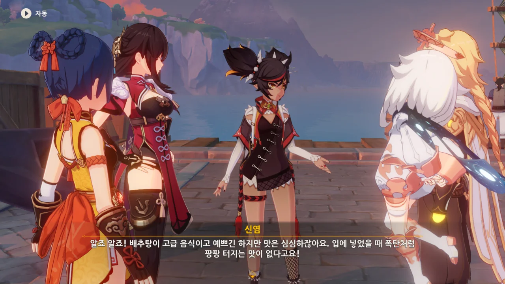

신염이 "입에 넣었을 때 폭탄처럼 팡팡 터지는 맛"이라고 할 때, 나도 모르게 '클레의 통통 폭탄을 입에 넣어도 그런 맛이 나지 않을까'라는 시답잖은 생각을 해버렸다.

그러면 죽지, 참.



> | | |
> |:--|:--|
> | 신염 | 요리에 리듬이 부족하다 |
> | 북두 | 요리에 기백이 부족하다 |
> {_borderless=true,_thead=false}

아니, 왜 요리에 그런 게 필요해...?

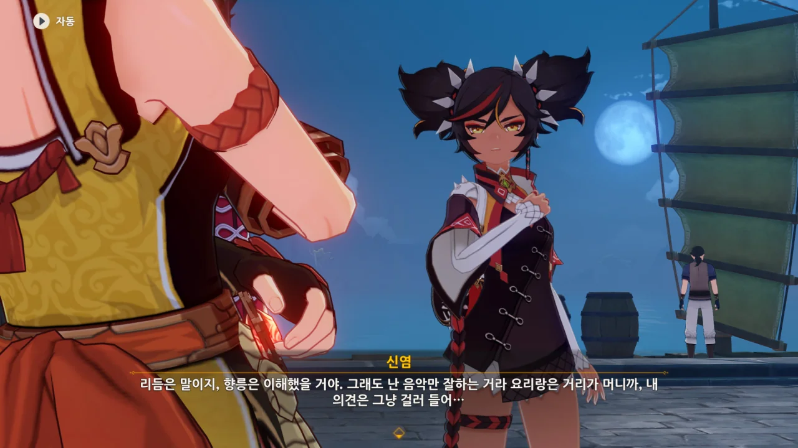

향릉은 자신이 무슨 말을 하는지 이해했을 것이라고 말하는 신염.



아, 그러니까 요리에 '결정적인 무언가', '회심의 한 방'이 없다는 말이었구나.

진작 그렇게 말할 것이지...



하지만 그 '결정적인 무언가'가 정확히 무엇인지는 여전히 잘 모르겠다.

여행자는 그걸 '나와 페이몬 사이의 공통점'이라고 표현하지만, 난 그것조차 잘 모르겠다.

여행자와 페이몬 사이의 공통점? 두 다리가 달렸다? 말을 한다? 그게 요리와 무슨 관계인데?

&nbsp;

아무튼 페이몬이 '우으' 하며 얼굴을 찌푸리는 것이 귀엽다.



뭐가 어찌 되었든, 향릉이 자기 요리의 개선점을 찾았다는 것은 좋은 일이다. 그게 정확히 어떤 건진 잘 모르겠지만.



신염과 북두는 기름진 볶음 요리와 매운 요리를 좋아하니, 이번에는 다른 요리를 좋아하는 사람에게 물어보는 것이 좋을 것 같다.



솔직히 말해, 담백하게 먹는 사람이 누구인지에 대해서 여행자가 직접적으로 '행인두부'를 언급하기 전까지는 그 사람이 누구인지 전혀 감을 잡지 못했었다.



소가 이름만 부르면 온다고 했었던가? 아니, 진짜 그렇게 말했다고 하더라도 보통 그런 말은 빈말 아냐?

어떻게 망서 객잔 인근에서 활동하는 소가 이 리월항에서 여행자가 자길 부르는 걸 듣고 올 수 있겠어?



조용한 곳을 찾아 부둣가 끝자락에 왔다.

그런데 여기, 정말 조용한 곳 맞아? 여기서 열 몇 걸음만 걸어도 바로 사람이 지나다니는 곳인데?

&nbsp;

가끔 원신에서 장소를 선정할 때를 보면 그 기준이 의뭉스러웠던 점이 한두 번이 아니다.

물론 플레이하는 입장에서 목적지가 가까우면 가까울수록 편하고 좋기는 하다만... 조용한 곳을 찾자면서 사람들이 지나다니는 곳에서 고작 열 몇 걸음 떨어진 곳으로 가는 건 핍진성이 좀 떨어지지 않니?



페이몬이 먼저 소를 불러보지만, 아무런 반응이 없다.

페이몬이 머쓱해하며 머리를 긁적이는 게 너무 귀엽다.



페이몬이 소를 두 번째로 불러보지만, 역시나 아무런 반응이 없다.

뻘쭘하게 "설마, 안 오려는 건가?"라며 우물거리는 페이몬... 하... 귀여워...

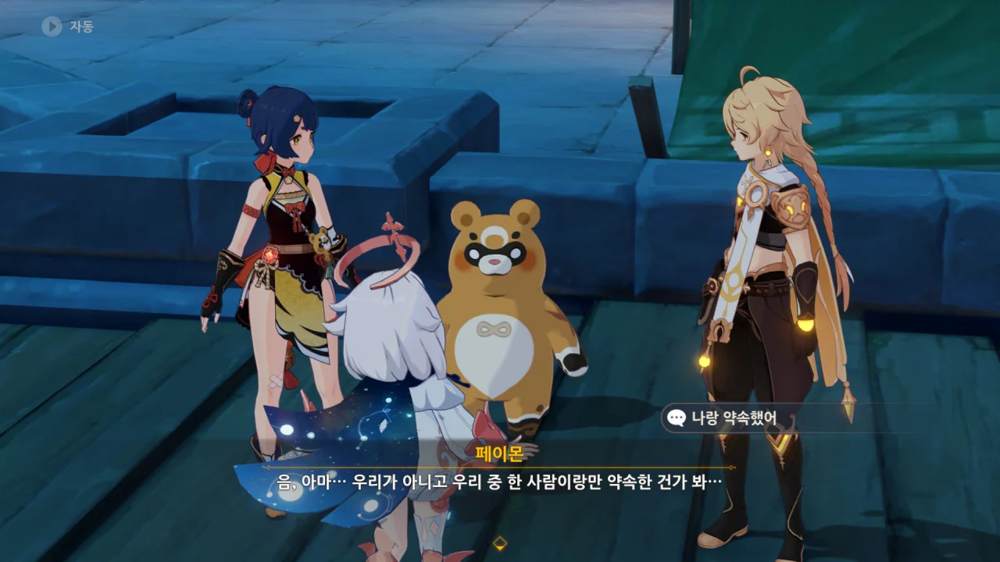

그런 것일 수도 있겠다. 소가 약속한 것은 페이몬과 여행자가 아니라 여행자 하나였을지도 모른다.

&nbsp;

사실, 소의 전설 임무 내용은 거의 기억나지 않는다.

무슨 선계 같은 비경에서 소를 조작해 '무능하군', '지루해'와 같은 대사를 내뱉으며 몹들을 싹쓸이한 기억밖에 없다.

그래서 소가 여행자와 정확히 무슨 약속을 했는지조차 잘 기억나지 않는다.



향릉에게 "페이몬도 참 나서는 거 좋아한다니까"라고 핀잔 아닌 핀잔을 듣자, "우으... 그래..."라며 시무룩해하는 페이몬.

요 요 귀여운 녀석.

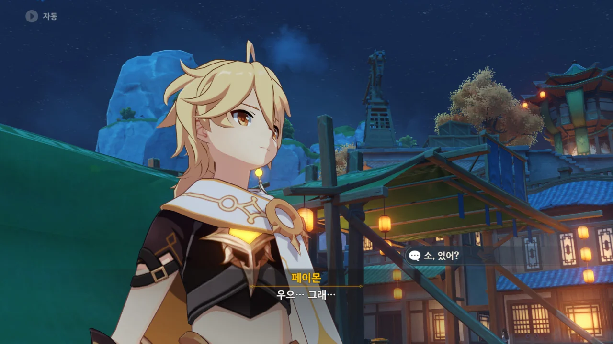

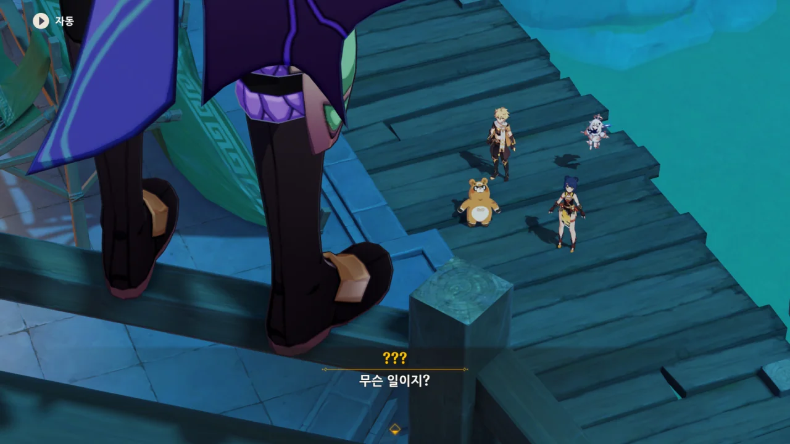

와오, 정말 여행자가 부르자마자 소가 나타났다.

&nbsp;

그러고 보니, 트위터에서 누가 짤막한 만화를 그린 것이 하나 있었는데, 그 내용이 참 재미있었다.

소가 여행자를 스토킹하면서 자길 언제 불러주나 두근대며 기대하다가 드디어 여행자가 자신을 부르자, 배 돛대 위에 올라서 엄근진한 자세로 '불렀는가'라고 하는 만화였다.

문제는 그 트윗을 어디서 본 것인지 기억나지 않아 트윗을 찾는 데 실패했다는 것이다.

아쉽다. 늘 엄근진한 소에게서 갭모에를 느낄 수 있는 몇 안 되는 만화였는데.



정말로 소가 올지 몰랐다. 아니, 보통 그런 말을 하면 누구나 빈말인 줄 알지 않나?

예를 들어, 누군가와 헤어지며 "언제 밥 한번 같이 먹자"라고 말하면 보통 그건 정말로 한번 만나서 밥을 먹자는 의미가 아니라, 의례적인 인사말이라고 생각하잖아.

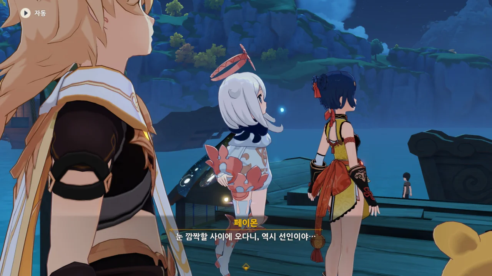

리월에서의 선인은 대체 어떤 이미지일까. '역시 선인'이라고 하는 걸 보면 만능까지는 아니더라도 매우 다재다능한 이미지일까?

&nbsp;

선인 하면 제일 먼저 생각나는 류운차풍진군을 생각하면 피식 웃음이 나지만.

이 아줌마, 은근히 푼수 끼가 있단 말이지. 분명 처음 만났을 때는 굉장히 무서워 보였는데, 지금은 손재주 하나는 확실히 좋은 개그맨처럼 보인다.

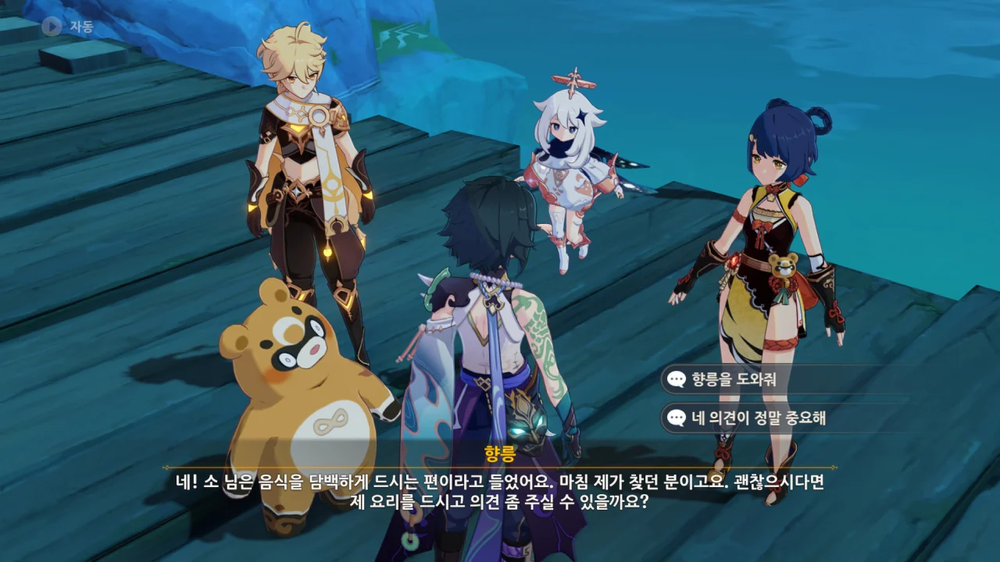

향릉이 소에게 자기 음식의 시식 평을 부탁한다.



아니, 대체 무슨 음식을 주길래 소가 무리하면서 음식을 먹는다는 소리가 나오는 거야?



향릉의 음식을 먹은 소는 "꽤 맛있네"라는 호평을 내렸다.

늘 담백한 행인두부만 먹는 소가 맛있다고 할 정도면 정말로 입맛에 맞았던 모양이다.

&nbsp;

향릉이 소에게 칭찬받았다고 굉장히 감격해하는데, 향릉의 입장에서 생각해보면 그럴 만도 하다.

선인은 그 긴 수명 때문에 오랫동안 살아왔을 테고, 그동안 여러 음식을 먹어보았을 것이다. 그런데 그 선인 입에서 "꽤 맛있다"라는 말이 나오는 건, 그 음식이 그동안 먹은 수많은 음식 중에서도 맛있다는 말 아니겠는가.



늘 말없이 행인두부만 먹고 가버려 그걸 누가 만들었는지에 대해 별로 신경을 쓰지 않는다고 생각했었는데, 자신에게 행인두부를 대접한 요리사가 누구인지 제대로 기억하고 있었다.

> 그 사람도 마음을 든든하게 해주는 좋은 요리를 만들었는데

왜 이 대사를 보면서 '웅이는 늘 밥을 해줬어'라는 대사가 생각날까?

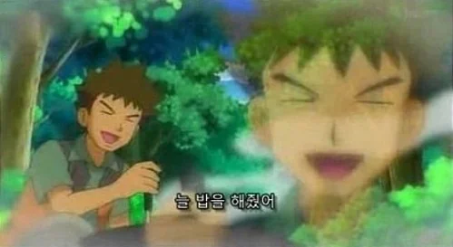



소가 워낙 담백하게 먹는지라, 담백하게 만든 향릉의 요리조차 그에겐 강하게 느껴졌나 보다.

그 정도면 담백의 수준을 넘어, 그냥 생식하는 수준이 아닐까?



소가 처음 등장할 때처럼 휙 하고 사라지자, 누룽지가 깜짝 놀라 어리둥절하며 이곳저곳을 둘러보는 모습이 귀엽다.



"지금 다시 부르면 소가 또 올까?"라고 궁금해하는 페이몬에게 "그럼 못써"라고 핀잔을 주자, 시무룩해져서 "농담이야..."라고 하는 페이몬.

그런데 누룽지는 왜 울먹이고 있는 거지? 설마 소가 사라져서 그런 건가?



요리대회의 결승전은 이튿날	아침 10시에 옥경대에서 진행된다고 한다.

그런데 정말로 이튿날 아침 10시까지 기다리라고 하더라. 시간을 잘못 계산해 시계를 두 번 돌렸다.
