축월절 글이 조금 길다.

사진을 찍을 때만 해도 '이 정도면 금방 글을 쓸 수 있겠네!'라고 생각했는데, 사진이 아직도 많이 남아 있다.

&nbsp;

이번 이벤트의 스토리는 전반부와 후반부가 얼추 비슷한 길이인 것 같다. 둘 다 합하면 스토리의 길이가 꽤 되는 것 같은데, 오히려 그게 좋다.

스토리가 짧은 것보다는 스토리가 긴 게 좋지...

***



엥, 왜 여기서 연비가 나와?

아무래도 연비가 법률 자문가이니, 가장 공정한 사람일 거로 생각해서 공증인 겸 사회자를 맡긴 것 같다.

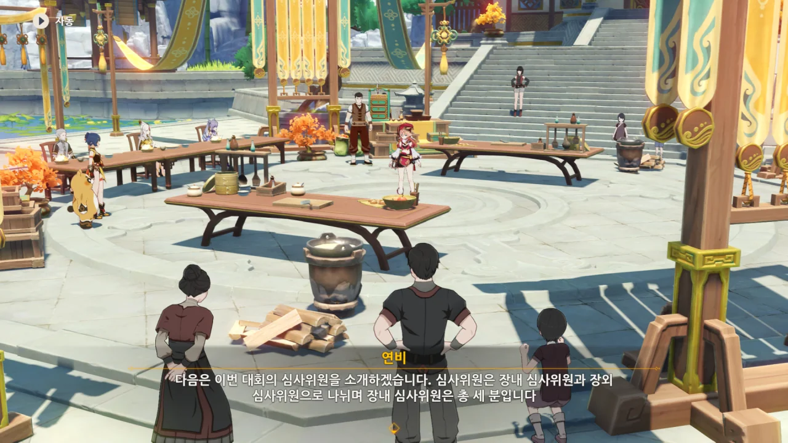

여기서 '장외 심사위원'이라는 말이 나올 때, 여행자도 거기에 포함되는 줄로만 알았다.

그런데 아니더라. 여기서 여행자는 그냥 관객 1일뿐이었다.



> * 천권 · 응광
> * 옥형 · 각청
> * 원로 미식가 · 천추
{.bq}

아니, 왜 천추 아저씨만 '원로 미식가'야 ㅋㅋㅋㅋㅋㅋ

천추 아저씨가 천추성인 건 맞지만, 평소 일반인 시늉을 하고 다니기에 여기서 그의 정체를 드러낼 수 없어 불가피하게 '원로 미식가'로 소개한 것 같다.

아마 천추 아저씨를 처음 만났을 때도 별다른 칭호가 붙어있지 않다가 천추성임이 밝혀지고 나서야 천추성 칭호가 붙었던 거로 기억한다.

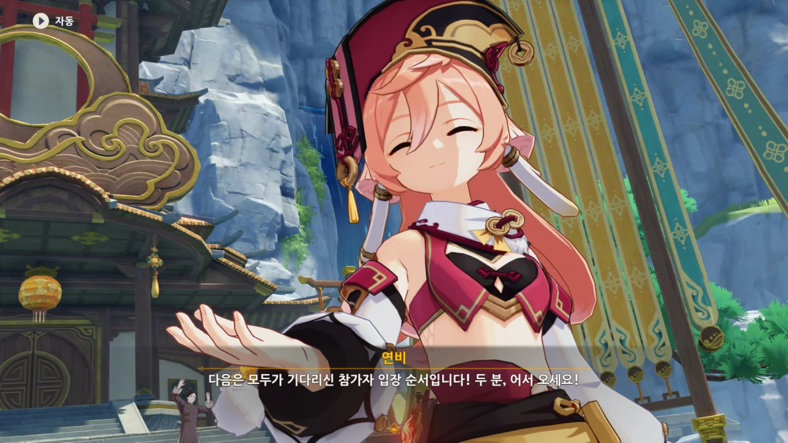



이번 결승전에서는 망서 객잔의 언소와 만민당의 향릉이 맞붙게 되었다.

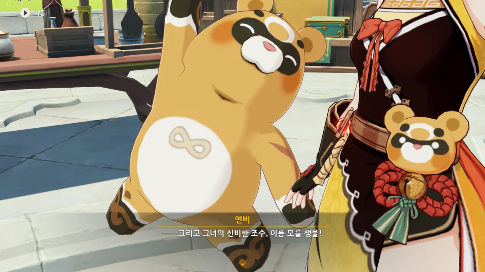

> 향릉의 신비한 조수, 이름 모를 생물

누룽지의 이름 정도는 제대로 불러 줘 ㅋㅋㅋㅋㅋㅋ



이번 축월절의 주제는 「음식과 강산」이고, 이번 요리대회 결승전의 주제는 「산해의 조화」이다.

둘 다 거기서 거기인 말로 보이는데...

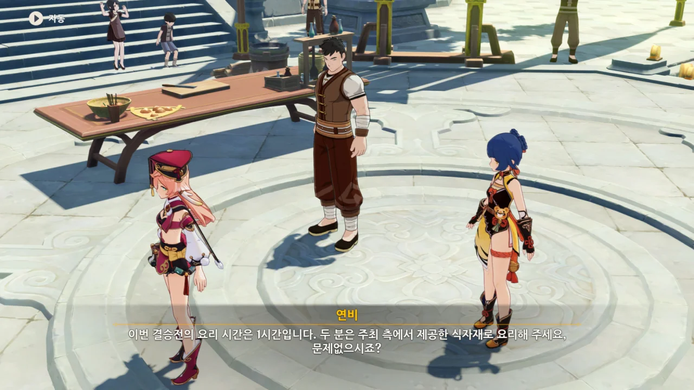

부정행위를 막기 위해서인지, 음식 재료는 일괄적으로 주최 측에서 제공한다.

아니, 내가 직접 향릉을 조작해야 해?

향릉으로 불을 피우려면 누룽지를 꺼내야 한다. 향릉이 불 속성 캐릭터이긴 하지만, 누룽지를 제외하면 불을 붙일 수 있는 스킬이 궁밖에 없거든...

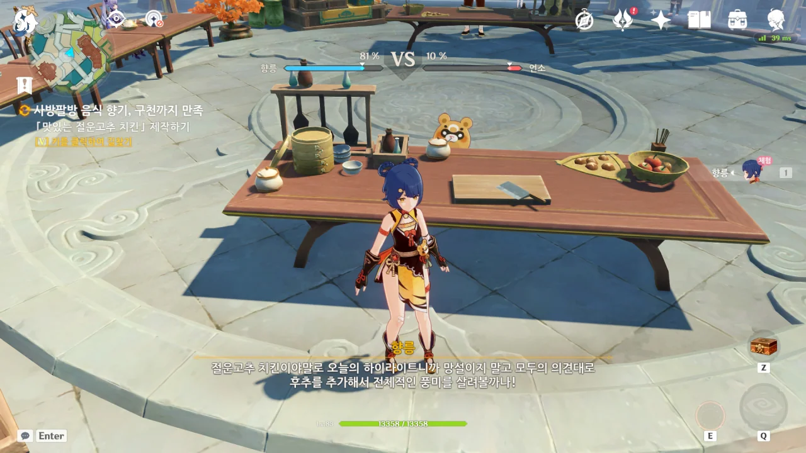

와 ㅋㅋㅋㅋㅋㅋ 누룽지를 꺼내니까 E 스킬 아이콘에서 누룽지가 사라졌다. ㅋㅋㅋㅋㅋㅋ

이런 디테일까지 챙겼어?

&nbsp;

심지어 누룽지의 행동조차 평소와는 다르다.

E 스킬로 나온 누룽지는 전방에 부채꼴로 불을 네 번 내뿜고 사라지는데, 이번에는 누룽지가 불을 붙인 후 사라지지 않고 이곳저곳을 빨빨거리며 돌아다닌다. 향릉이 집어야 할 조미료 앞에서 '나 여기요' 하며 방방 뛰기도 하고.

&nbsp;

마지막 식재료를 집자마자 화면이 검게 변하길래 깜짝 놀랐다.

여태껏 파란색 게이지가 언소 것인줄 알고 '언소를 따라잡으려면 한참 걸리겠네'라고 생각하고 있었는데, 언소를 따라잡지 못한 채 화면이 검게 변하자, 임무를 실패한 줄로 착각한 것이다.

그런데 지금 글을 쓰며 사진을 다시 확인하니, 파란색 게이지는 언소 것이 아니라 향릉 것이었다.



응? 누룽지야, 왜 언소를 돕고 있니? 설마 향릉을 배신한 거니?

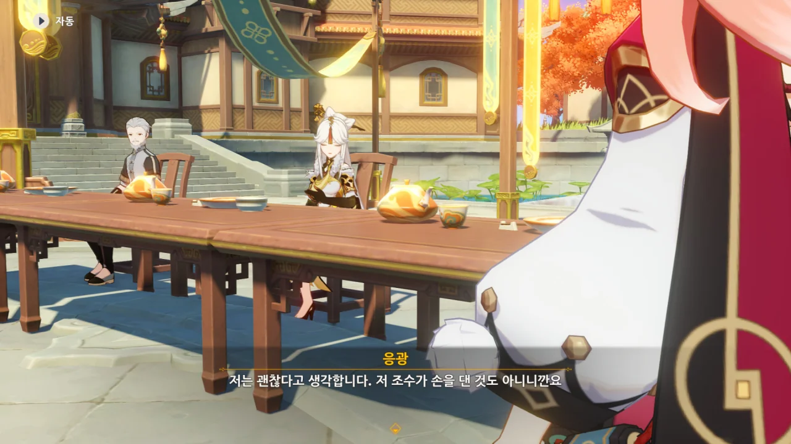

응광은 아직 누룽지가 언소의 음식에 손을 댄 것이 아니니 괜찮다고 말한다.

그런데 과연 괜찮은 것일까? 언소에게 누룽지가 방해되지는 않을까?

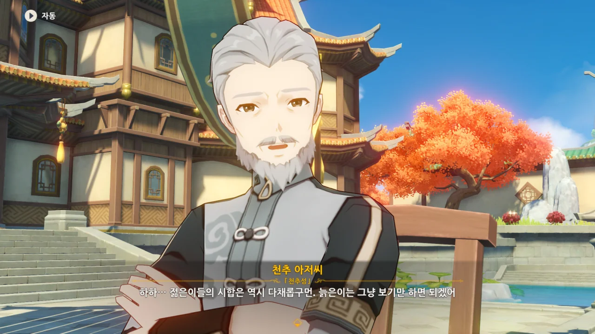

> 천추성 · 천추 아저씨
{.bq}

그래, 이렇게 나와야 정상이지.

천추 아저씨는 따로 본명이 있는 것일까? 천추성의 이름이 천추인 것은 뭔가 좀 이상하잖아.

&nbsp;

천추 아저씨가 한 말을 정확히 이해하지는 못했지만, 천추 아저씨 역시 괜찮다고 말하는 것으로 이해했다.



각청은 누룽지의 행위가 대회 규정에 어긋나지 않는다고 말한다.

누룽지가 하는 일이라고는 가끔 불을 붙이는 것밖에 없고, 요리는 모두 향릉 혼자서 만드는 것이니, 누룽지가 지펴주는 불이나 향릉 본인이 직접 붙이는 불이나 차이가 없기 때문이라고.



향릉 역시 누룽지는 자기 조수가 아니라 친구이자 가족이며, 언소에게 간 것도 그의 긴장을 풀어주러 간 것일 거라고 말한다.

오히려 언소가 긴장해 제 실력을 발휘하지 못하는 것을 걱정하는 향릉. 향릉은 언소와 정정당당하게 맞대결을 하고 싶은 것이다.

&nbsp;

누룽지처럼 귀여운 생물이 눈앞에서 자신을 응원하는 걸 본다면 언소의 긴장도 좀 풀어질지도 모르지.

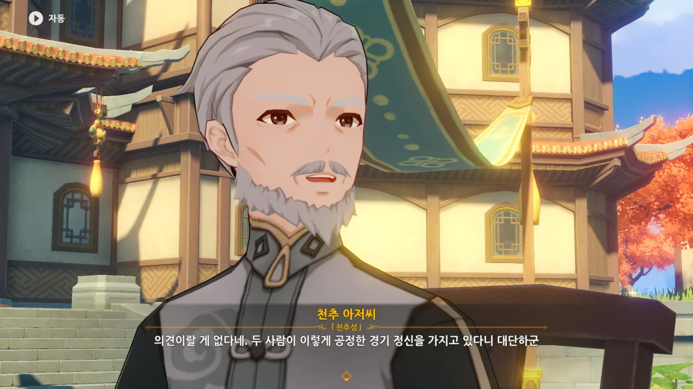

장내 심사위원 전원이 누룽지의 행동에 문제가 없다고 인정한 덕분에 대회가 중단되지 않고 그대로 진행될 수 있었다.



여전히 잔뜩 긴장한 언소에게 향릉은 아버지를 떠올려 보라며 조언을 건넨다.

그 말을 듣고 잠시 당황한 언소는 아버지 대신 어머니를 대신 떠올리겠다며, 향릉에게 얼른 자기 볼 일 먼저 보라고 말한다.

하지만 향릉이 자신은 이미 모든 준비를 마쳤다고 하자, 발끈하며 "그럼 절대 질 수 없지!"라고 투지를 불태운다. 아니, 거기서 투지를 불태운다고?

아, 물론 눈앞에 있는 라이벌이 모든 준비를 마치고 자신에게 조언을 건네는 모습이 자존심을 긁었을 수도 있긴 하겠다.

어찌 되었건, 잔뜩 긴장해 있던 언소가 긴장을 풀 수 있었다.

&nbsp;

지금 향릉과 언소가 서로 선의의 라이벌 관계여서 이렇게 넘어가는 거지, 만약 둘 사이가 별로 좋지 않았다면 언소의 자존심이 크게 상처 입었을 것이다.

나라도 '뭐지? 이건 날 엿먹이는 건가?'라고 생각했을 걸.

***

드디어 두 사람의 요리가 완성되었다.

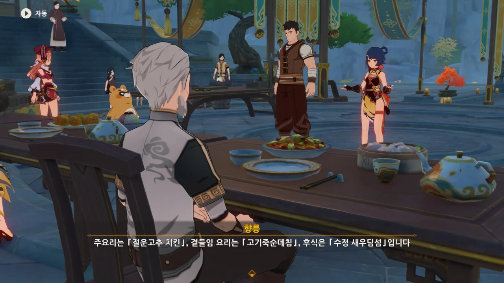

향릉은 「절운고추 치킨」, 「고기죽순데침」, 「수정 새우딤섬」을 만들었다.

수정 새우딤섬은 북두와 신염과 만났을 때 그들에게 준 요리이기도 하다. 과연 그때 지적당한, '요리에 결정적인 무언가가 없다'라는 문제를 극복했을까?



향릉의 음식 설명을 듣는 페이몬이 입을 '오...' 하며 벌리는데, 아마 저 입가에는 지금 침이 줄줄 흐르고 있을 것이다. 요 귀여운 녀석.

그런데 절운고추 치킨의 모습이 내가 아는 치킨의 모습과는 아주 다르다. 치킨이라기보다는 새고기 볶음처럼 보이는데... 번역이 잘못된 것일까?



향릉이 소개하는 음식을 확대해 보여주는데, 이 음식을 실제로 만들면 정말 이런 모양이 나올지 궁금해진다.

&nbsp;

내가 알기로, 딤섬은 만두와 비슷한 음식이다.

최근에 비비고였나, 어떤 만두 브랜드의 김치만두를 사서 먹은 적이 있었다.

그 만두의 만두피 너머로 울긋불긋한 만두소가 보이는 걸 보고 감탄한 적이 있었는데, 그래서인지 이 딤섬의 만두피 너머에도 울긋불긋한 만두소가 보이는 것만 같다.

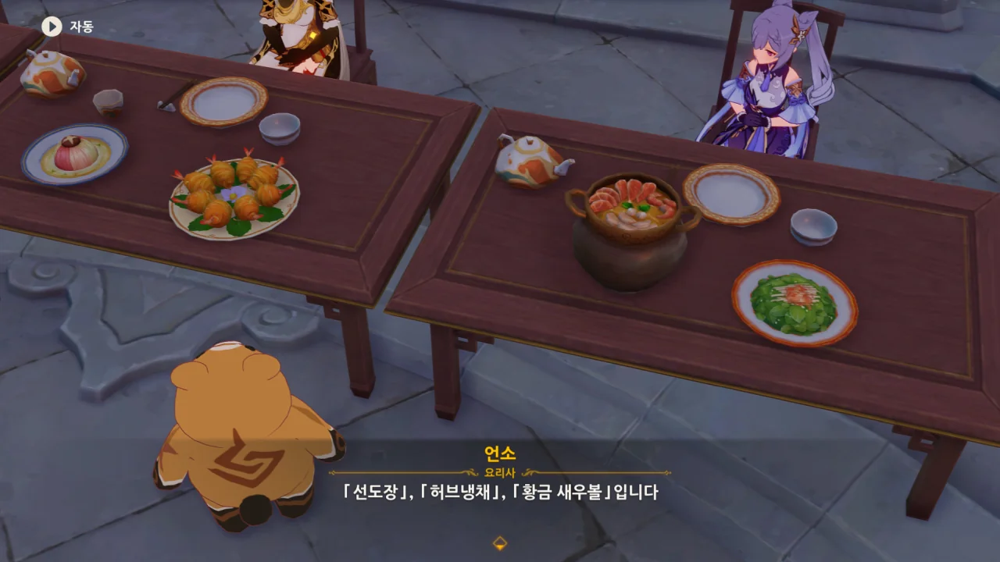

각청의 시선이 황금 새우볼에 꽂혔다. ㅋㅋㅋㅋㅋㅋ



게임을 하며 선도장을 만들 일이 종종 있었다. 선도장이 게임 내에서 유일한 5성 공격력 강화계 음식이기 때문이었다.

그때 선도장을 만들 때는 별생각이 들지 않았는데, 지금 이렇게 3D 모델로 된 선도장을 보니 굉장히 맛있어 보인다.

저 국물. 저 국물을 보라. 마치 일본 라멘의 국물이 생각나지 않은가? 분명 저 국물은 약간 얼큰하게 매운 국물일 것이다.

&nbsp;

하으... 맛있겠다.

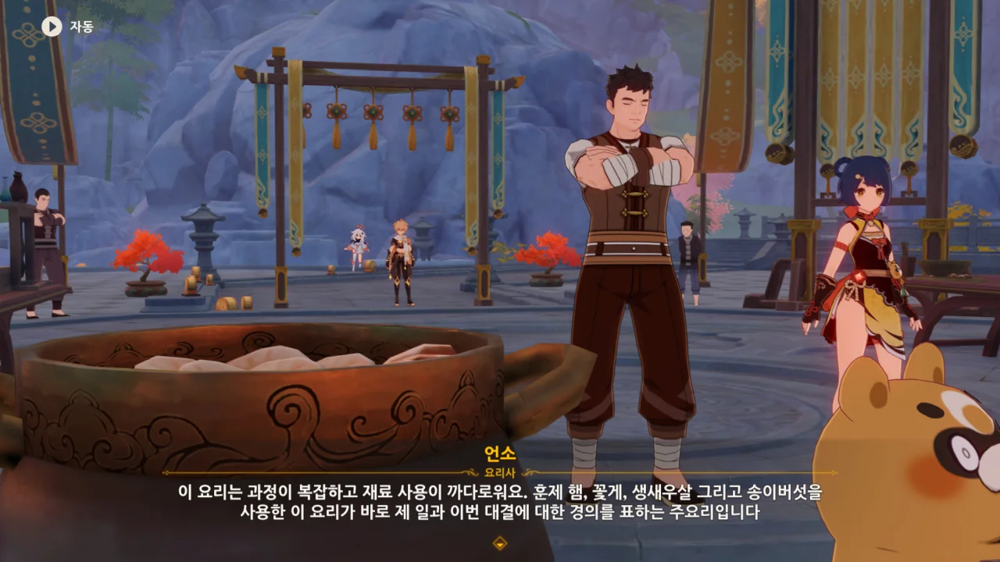

고기가 무려 세 종류! 훈제 햄, 꽃게, 생새우살... 전부 맛이 없을 수 없는 고기이다.

아아... 벌써 입에 침이 고인다.

&nbsp;

그런데 누룽지 너는 대체 뭘 보고 그리 놀란 거니?



알고 보니 누룽지는 놀란 것이 아니라 그냥 황금 새우볼을 눈이 휘둥그레진 것이었다.

요 녀석, 분명 저번에 망서 객잔에서 언소가 만들어 준 황금 새우볼을 너 혼자 다 먹지 않았냐?

누룽지는 황금 새우볼을 엄청나게 좋아하나 보다.

&nbsp;

일본에서 원신 1주년을 기념해 요리 대회가 열린 적이 있었는데, 거기서 황금 새우볼을 실제로 만든 사진을 본 적이 있었다.

진짜 맛있게 생겼더라...

&nbsp;

그런데 저 허브냉채는 과연 어떤 맛일까? 생김새만 보면 그냥 허브잎을 데친 후 그 위에 차갑고 새콤한 소스를 부은 샐러드로 보이는데 말이다.

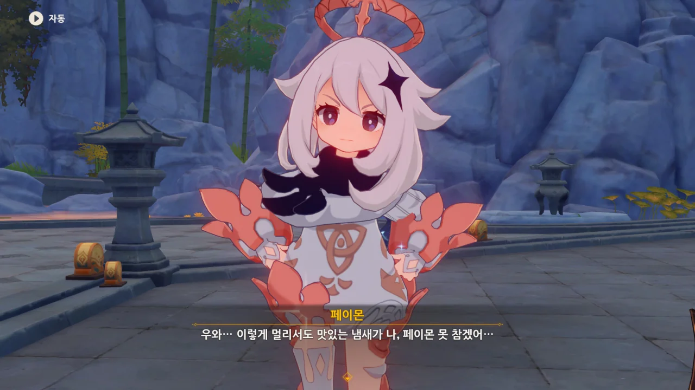

나도 그래...

단순히 사진만 봐도 이렇게 배가 고파오는데, 페이몬은 오죽할까.

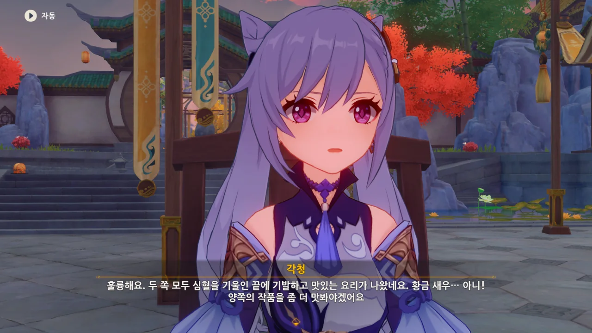

ㅋㅋㅋ 각청, 방금 본심이 새어 나왔어.



천추 아저씨의 평가를 들으니, 진짜 저 음식을 먹고 싶어진다.

&nbsp;

게임 음식 하니 갑자기 생각나는 이야기가 하나 있다.

'데스티니 가디언즈'를 개발한 번지에서 공식 요리책을 발간한 적이 있다.

하지만 데스티니 가디언즈는 우주를 배경으로 하는 SF 게임이고, 게임에서 나오는 요리는 대부분 실제로 존재하지 않는 재료를 쓰기 마련이었다.

그래서 번지가 내놓은 요리책에 쓰인 레시피에는 실제로 존재하지 않는 재료가 음식의 분위기에 맞는 실제 재료로 대체되어 있었다.

그 공식 요리책에 나온 레시피대로 실제 요리를 한 사람이 갤러리에 있었는데, 사진을 잘 찍어서일까, 그 요리가 굉장히 맛있어 보였다.

&nbsp;

원신도 이와 비슷하게 공식 요리책을 내면 어떨까? 아, 그러면 「음악회를 열다」에 이제 「요리책을 내다」가 추가되는 걸까?

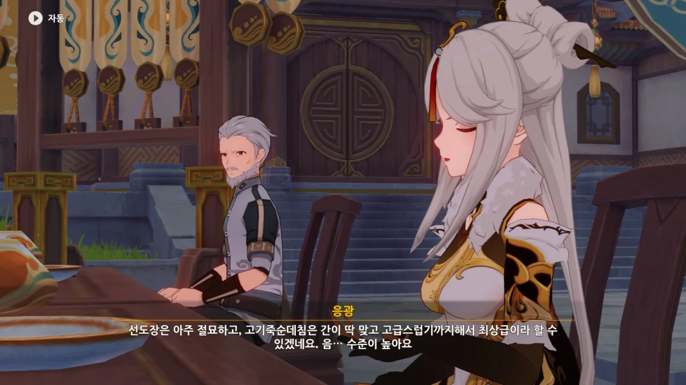

다른 심사위원 역시 두 선수의 요리에 고평가를 내리고 있다.



내심 여행자를 장외 심사위원에 끼워줄 것으로 기대했었는데, 어림도 없었다.

줄 사람은 생각도 하지 않는데 멋대로 김칫국을 들이켠 셈이 되어버렸다.

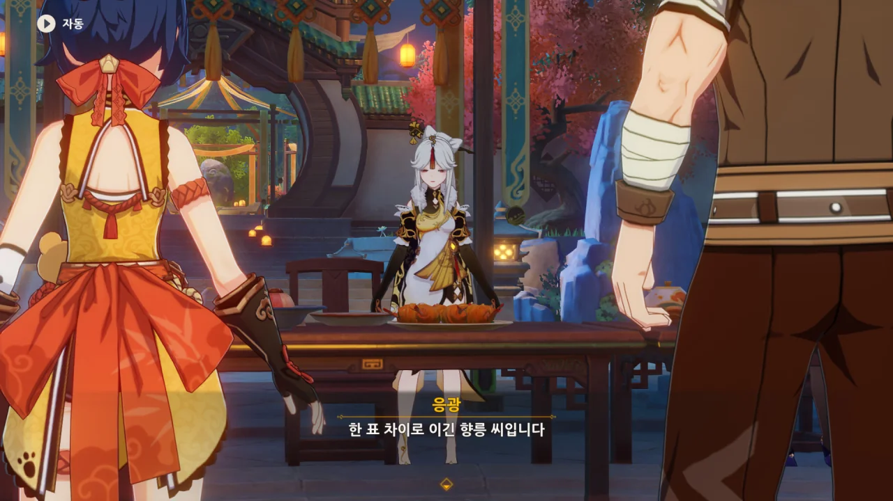

향릉이 단 한 표 차이로 승리했다. 정말 박빙이었네!



행사가 끝나고 칠성이 차례로 걸어서 퇴장하는 가운데, 누룽지가 잘 가라는 듯이 방방 뛰며 손을 흔든다.



정말 보기 드문 라이벌의 모습이다.

서로의 실력을 확인하고 순순히 패배를 시인하는 모습, 얼마나 보기 좋은가.



> '지나가던'이 붙은 사람의 전투력은 매우 높다.
{.bq}

'작은 음식점 출신 베테랑'이라는 말을 듣자마자 생각난 우스갯소리이다.

&nbsp;

아주 틀린 말은 아닌 것이, 옛날에는 호환이라는 말이 있을 정도로 호랑이가 산에서 활개를 쳤다고 한다. 그런데 그런 곳을 무사히 지나다닐 정도면 얼마나 전투력이 높겠는가?

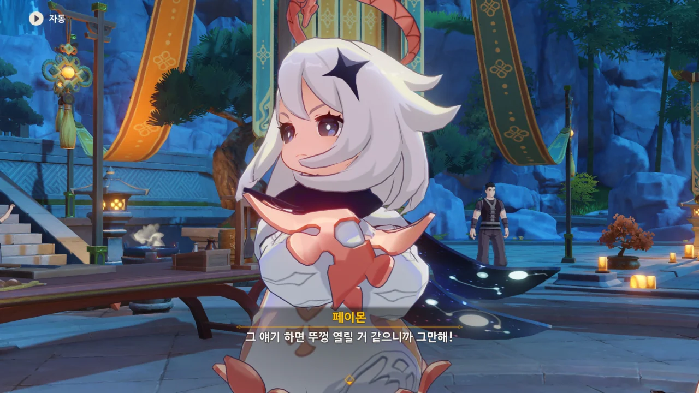

서로의 대화가 끝난 후, 향릉이 음식이 어땠냐고 물어보았다. 음식 향기만 실컷 맡고, 음식은 입에 대보지도 못했다!

> 뚜껑 열릴 것 같으니까 그만해!

진짜 페이몬, 너 올해로 연세가 어떻게 되니?



이번 대회의 상품은 최고급 식자재 세트와 상금이다. 아마 향릉에게는 상금보다는 최고급 식자재 세트가 더 기분 좋을 것이다.

아니, 그나저나 향릉은 금방이라도 요리를 해줄 것처럼 말하더니, 상품 수령을 위해 배송지를 등록하러 떠나버렸다.

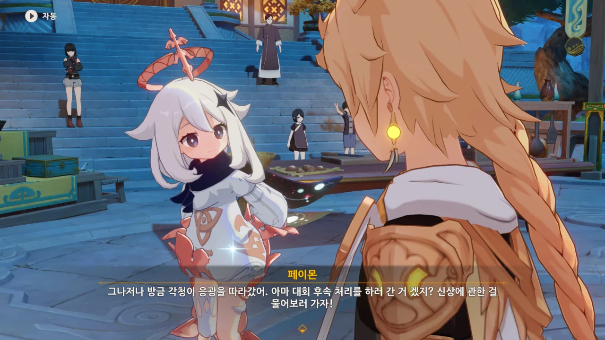

그러고 보니 아까 각청이 응광을 따라가며 뭔가 고민하는 눈치였다. 대체 무슨 일인 것일까?
