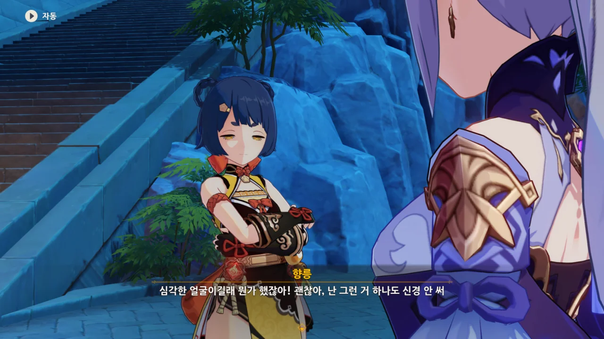
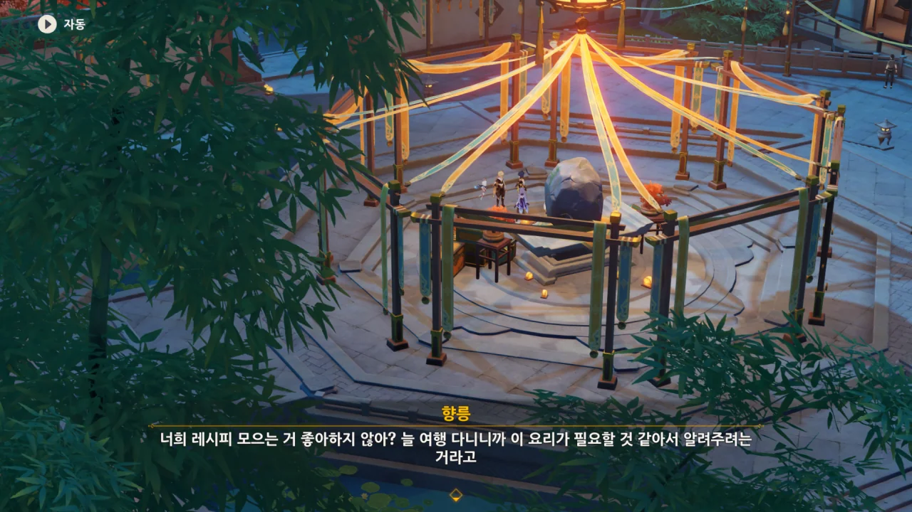
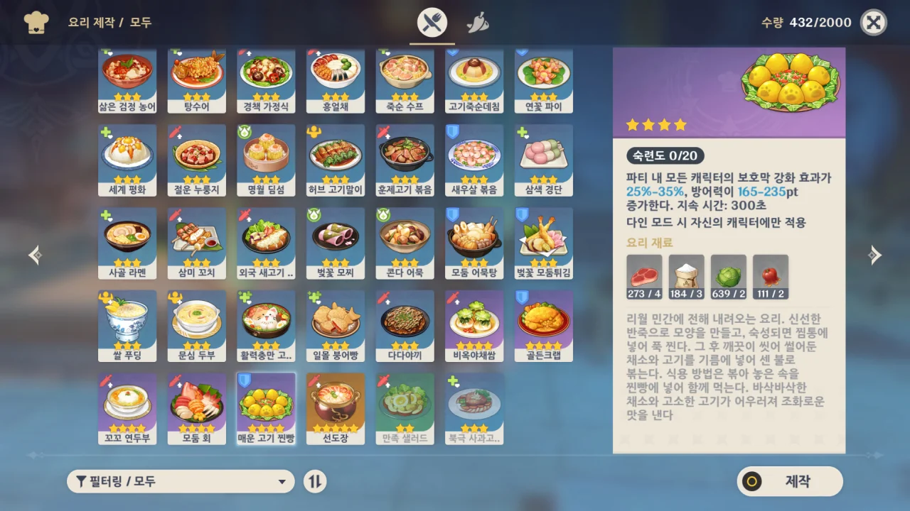
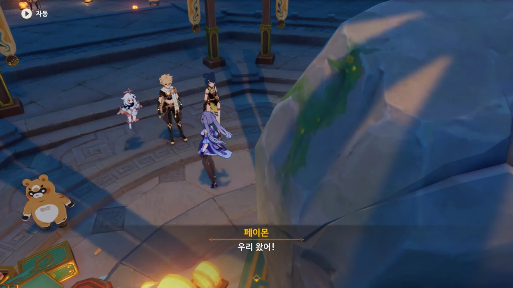
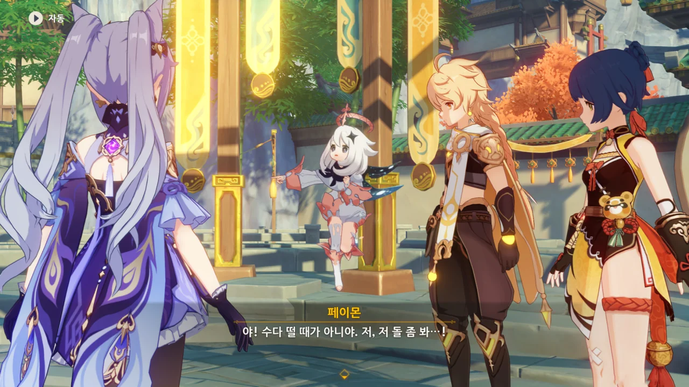

사진이... 줄어들지를... 않아... 살려줘!

***

각청이 외딴곳에서 혼자 머리를 짚고 있다. 뭔가를 고민하는 걸까?



뭘 그리 고민하고 있나 했더니, 친구인 향릉 대신에 언소에게 투표한 것을 갖고 고민하고 있었다.

... 왜? 그게 옳은 일 아냐?



물론 자신의 소신껏 투표하는 것이 옳은 일이지만, 각청은 이 일로 인해 향릉이 자신에게 실망할지도 모른다고 걱정하고 있다.

호랑이도 제 말 하면 온다더니, 정말로 향릉이 등장했다.





뭔가 말을 번드르르하게 했지만, 결국 언소의 황금 새우볼 때문에 언소에게 투표한 것이라고 말하는 각청.

그 말을 들은 향릉이 배를 부여잡고 웃자, "그래! 나 황금 새우볼 좋아한다, 왜!"라며 삐지는 각청.

각청의 걱정과는 달리, 향릉은 그런 것에 전혀 신경 쓰지 않는다고 말한다.

사진이 좀 이상하게 찍혀서 그렇지, 절대로 향릉이 각청을 흘겨보는 것이 아니다.



향릉은 각청의 이런 진지한 모습이 오히려 마음에 든다고 한다.

자신뿐만 아니라 타인에게도 엄격한 각청의 의견은 앞으로 수많은 도전을 만날 자신에게 도움이 된다고 생각하는 것이다.



오히려 친구와 있을 때는 칠성의 신분이 아닌, 각청이라는 평범한 신분으로 있어도 되니 편하게 있으라고 한다.

그런데 응광과 북두가 서로 친하다고? 분명 저번에 봤을 때는 음식 취향이 안 맞는다며 엄청나게 싸워댔던 것 같은데?

내게 있어 응광은 뭔가 높은 곳 정상에서 홀로 고고히 서 있는 이미지였는데, 그런 응광이 거친 뱃사람인 북두와 함께 밥을 먹고 바둑을 둔다니, 조금 의외이다.

부끄러움을 숨기려 각청이 조왕신상을 확인하러 가자고 한다.



축월절 요리 대회도 성공적으로 치렀고, 게이지 포인트도 1,000점을 다 모았다.

그런데 왜 아직도 조왕신상이 그대로인 거지?



풀이 죽은 각청에게 향릉이 희소식 하나를 전한다.

각청이 말한 레시피를 묘 사부의 도움으로 완성할 수 있었다고 한다.



아, 그런 거였어?

난 또 향릉이 언소를 이겼다고 기고만장해져서 여행자와 또다시 한바탕 요리 실력을 겨루려는 줄 알았는데.

오, 이 요리, 꽤 고급 요리잖아! 5성 요리가 선도장밖에 없음을 생각해 보면 4성 요리는 충분히 고급 요리이다.

그래서 그런지, 올라가는 방어력 수치가 꽤 높다.

드디어 골든크랩 말고도 방어력을 올릴 수 있는 음식이 생겼다.

향릉과 여행자가 각자 요리해 온 「매운 고기 찐빵」을 갖고 왔다. 찐빵... 정말 맛있겠다.



나만 이 장면을 보고 아래 영상을 생각한 것은 아닐 것이다.





매운 고기 찐빵을 먹고 어릴 적 할아버지와의 추억에 잠긴 각청.



응? 이 요리가 향릉이 어릴 적부터 할 줄 알았던 요리라고? 게다가 그 조리법은 묘 사부가 알려준 거였다고 한다.

이상하다. 분명 이 요리는 각청이 할아버지의 노트에서 본 것이라고 하지 않았나? 그런데 그걸 왜 묘 사부가 알고 있는 거지?



각청의 할아버지는 요리사가 아니라 리월의 유명한 토지업 대부이자 학자였다고 한다.

그의 취미는 고서를 수집하는 것이었고, 사라진 리월의 전통문화에 대해서도 많이 알고 있었다고.





각청은 어릴 적 할아버지와 함께 서재에서 수많은 책을 읽고 암왕제군이 정말 실존하는 인물일지에 대해 이야기를 나누었다고 한다. 그 기억 때문인지 각청은 가끔 암왕제군이라는 이름을 들으면 할아버지를 떠올린다.

각청이 할아버지의 노트에서 베낀 레시피는 할아버지가 오래된 책에서 발견한 요리인데, 레시피가 불완전해 재현에 실패했다고 한다.

할아버지가 레시피의 복원을 위해 매운 고기 찐빵을 만들 때마다 각청에게도 매운 고기 찐빵을 나누어주었는데, 각청은 이 요리를 맛보고 그때의 추억을 다시금 떠올린다.

그러니 이 레시피는 각청에게 있어 할아버지, 암왕제군을 잇는 일종의 추억 연결고리와 같은 셈이다.



음... 그러니까...

향릉의 집안에서 대대로 내려져 오던 매운 고기 찐빵의 레시피가 일부가 소실된 채 각청의 할아버지 손에 들어갔고, 각청의 할아버지는 그 레시피의 복원을 위해 계속 매운 고기 찐빵을 만들어 각청과 함께 먹었다.

이게 맞는 거지?





이건... 마치 '오다 주웠다'와 비슷한 느낌인걸. 아니면 길고양이에게 간택당한 집사와 비슷하거나.

조왕신상에 무슨 변화가 생긴 걸까?
