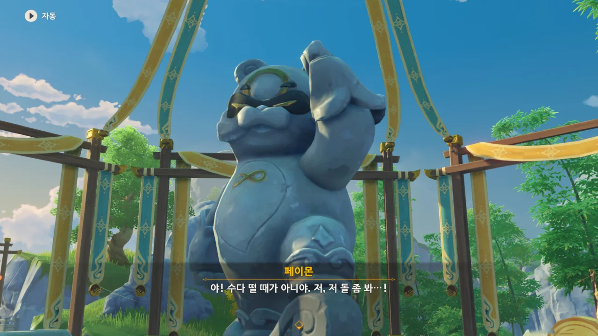
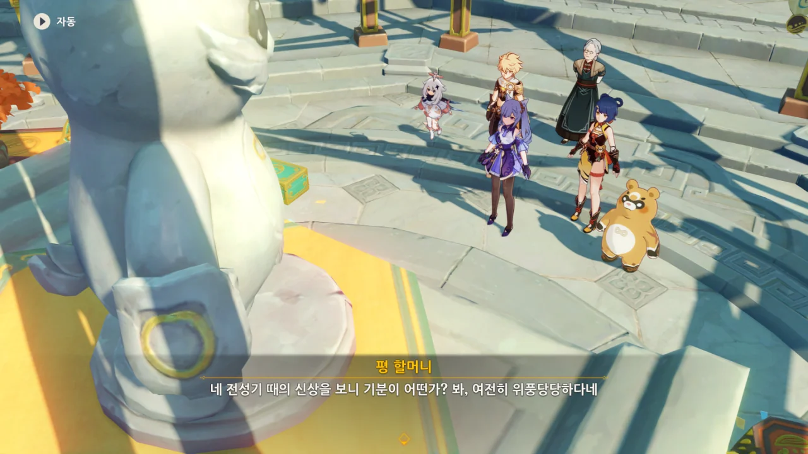
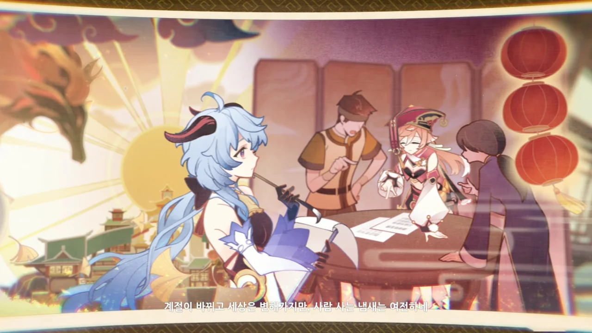
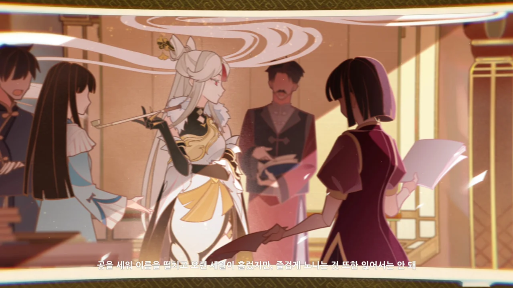
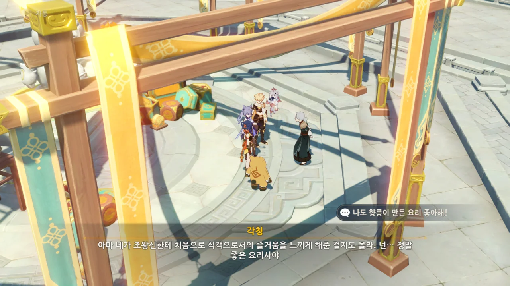
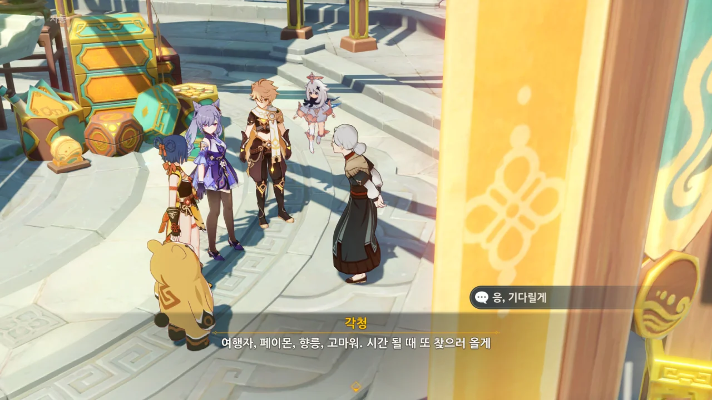

조왕신상의 모습이 변했다. 저거... 누룽지 아냐?

저 바위는 조왕신상이고, 그 신상의 모습이 누룽지로 변했다는 건... 누룽지가 조왕신이라는 건가?



아니, 저거 너잖아. 너가 왜 놀라는 거냐?



평 할머니는 누룽지가 바로 우리가 찾던 조왕신, 「부뚜막의 마신」이라고 한다.

아니, 얘가 어딜 봐서 마신이야. 하는 행동이 소동물과 다를 바가 없던데.

마신은 전부 지성체인 줄 알았는데... 아무리 못해도 벤티 정도는 될 줄 알았지.







조왕신은 사람들의 **소망**을 따라 행동하는 신이라고 한다. 그에게 있어 **소망**과 **노고**는 전혀 다른 것이라고.

그렇기에 조왕신상은 사람들의 노고가 담긴 요리 대회에서가 아니라, 각청의 소망이 담긴 매운 고기 찐빵에 의해 그 본모습을 드러낸 것이라고 한다.

각청은 매운 고기 찐빵을 먹고 마음속의 소망을 이루었고, 그 힘이 조왕신상을 깨운 것이다.

위풍당당? 옛날 모습의 조왕신조차 내게는 귀여워 보인다.

물론 지금의 누룽지도 귀엽고.





지금의 누룽지는 향릉의 동료이지만, 옛날의 누룽지는 리월의 토지신이었다고 한다.

조왕신이 지금의 모습이 된 이유는 그가 자신의 지혜와 힘을 모두 이 땅에 바쳤기 때문이라고 하는 평 할머니.



리월 역시 다른 곳과 비슷한 땅이다. 때로는 가뭄을 겪고, 때로는 홍수를 겪는다.

아마 과거 있었던 어떤 미증유의 재난을 막기 위해 누룽지가 자신을 희생한 것 같다.



그 이름답게, 황폐한 평원을 지나 항구로 와 집을 짓고 불을 지핀 것이 바로 부뚜막의 마신이었다고 한다.

황폐한 평원은 잘 모르겠지만, 항구는 분명 리월항을 말하는 것이겠지.



누룽지의 원래 이름이 '마르코시우스'였구나.

「부뚜막의 마신」 마르코시우스는 돌의 마찰로 생긴 불똥에서 탄생한 마신이다.

화롯불과 민생을 관장하던 그는 인간을 아주 좋아했다.





약 천 년 전, 사람들은 평원 위에 「귀리집」이라는 도시를 지었다.

마르코시우스는 그들을 위해 자신을 여럿으로 나누어 각 가정에서 불을 지펴 요리하고 가정을 단란하게 만들었다.

&nbsp;

어디서 본 영상인지는 잘 기억나지 않지만, 향릉이 E 스킬을 써 누룽지를 꺼내자, 누룽지 수십 마리가 튀어나와 동시에 전방을 향해 불을 푸화악 뿜어대는 영상을 본 적이 있다.

분명 게임 파일을 변조해 만든 것이겠지.

마르코시우스가 자기 자신을 여럿으로 나누었다는 걸 듣고 그 영상을 떠올리지 않을 수 없었다.



하지만 귀리집은 홍수로 인해 파괴되었고, 살아남은 사람들은 남쪽으로 내려가 리월항으로 돌아갈 수밖에 없었다.

리월항으로 *돌아가다*라고 한 것으로 보아, 처음 사람들이 정착한 곳은 리월항이었지만, 도시를 넓히는 과정에서 리월항 북쪽에 귀리집이라는 새 도시를 만들었던 것으로 보인다.

하지만 그 도시가 홍수로 인해 더 이상 살 수 없게 되자, 다시 리월항으로 돌아간 것이고.

&nbsp;

지금의 귀리 평원은 홍수로 인해 폐허가 된 귀리집의 잔재인 셈이네.



왼쪽의 신수의 뿔을 보면 감우의 뿔과 매우 비슷해 보인다. 그래서 저 신수가 감우인지, 감우의 엄마인지에 대해 채널에서 갑론을박이 오갔다.

저 신수가 감우라고 주장하는 사람은 '여태 언급만 되었던 감우의 엄마를 여기에서 이렇게 등장시킬 이유가 없다'라는 이유를 들었다.

그 반대 의견을 가진 사람은 '감우는 신수와 인간의 혼혈인데, 감우가 신수의 모습으로 변할 수 있다는 증거가 아직 없기에 저 신수는 감우의 엄마로 보아야 한다'라고 하더라.

&nbsp;

하지만 제일 인상적인 주장은 다음과 같았다.

> 감우가 옛날 뚱뚱했을 때 마신의 목구멍을 막았다고 하던데, 저 정도 크기라면 마신의 목구멍을 막기 충분하지 않은가?
> 분명 저 신수는 감우일 것이다.
{.bq}

네가 제일 나빠.

&nbsp;

새 두 마리가 집 한 채를 거뜬히 옮기는 걸 보면, 역시 신수는 신수인가 보다.



> 몸속의 습기와 한기를 없애주는, 다진 고기와 전병으로 만든 음식

이게 어떻게 「매운 고기 찐빵」이 되는 것일까? 내가 아는 찐빵은 절대로 휴대성이 좋지 않은 음식이거든.

설마 번역을 잘못한 것일까?





이후 수백 년 동안 리월에 닥친 재난과 역병을 잠재우기 위해 자신이 가진 모든 힘을 땅에 주입해 땅을 안정화했다.



모든 힘을 다 써버린 마르코시우스는 지성이 줄고 몸집도 아주 작아졌다.

마지막으로 작별할 때는 사람보다 작을 정도였다고.



힘을 다 쓴 마르코시우스는 홀로 숲에 가 오랜 잠에 들었다.





아주 오랜 시간이 흐른 후, 잠에서 깨어난 마르코시우스.

아무런 기억이 없던 그는 자신 앞에서 곤히 자는, 노란 옷을 입고 있던 소녀가 만든 매운 고기 찐빵을 먹고 영문도 모른 채 감동하여 그 소녀와 함께하기로 했다.

그리하여 누룽지가 탄생했다.

&nbsp;

곤히 자는 향릉, 정말 귀엽다.





조왕신이 자취를 감추었어도 리월 사람들은 언제나 그랬듯이 아침마다 노점을 열고 장을 보고 불을 지펴 밥을 지었다.

아마 마르코시우스가 사라졌어도 그의 유산은 여전히 리월 안에 살아 숨 쉬고 있다는 걸 말하는 것이겠지.

***



> | | |
> |:--|:--|
> | 평 할머니 | 천지의 은혜로 비바람이 축복받고 산과 바다가 함께 기뻐하리 |
> {_borderless=true,_thead=false}

중앙의 창 든 여자가 평 할머니의 젊을 적 모습이 아니냐는 말이 있더라.

허리춤에 척진령이 달린 것도 그렇고, 평 할머니의 제자인 향릉이 창을 쓰니 평 할머니 역시 창을 쓰지 않겠냐는 것이다.

&nbsp;

일본 트위터에서 공식적으로 밝힌 평 할머니의 선인명은 「가진낭시진군」이라고 한다. 아니, 이런 건 게임 안에서 알려 줘...

&nbsp;

나무에 기댄 채 서 있는 소 뒤에서 물고기를 모닥불에 구워 먹는 새가 류운차풍진군이라는 분석도 봤다. 어휴, 이 먹을 것 좋아하는 푼수야...

> | | |
> |:--|:--|
> | 감우 | 계절이 바뀌고 세상은 변해가지만, 사람 사는 냄새는 여전하네 |
> {_borderless=true,_thead=false}

오랜 시간을 사람 곁에서 지내온 감우가 저 말을 하니, 말의 무게가 다르게 느껴진다.



> | | |
> |:--|:--|
> | 응광 | 공을 세워 이름을 떨치고 오랜 세월이 흘렀지만, 즐겁게 노니는 것 또한 잊어서는 안 돼 |
> {_borderless=true,_thead=false}

이번 이벤트를 통해 평소 여가를 즐길 때는 평범한 사람처럼 여가를 즐긴다는 걸 보여준 응광.

> | | |
> |:--|:--|
> | 각청 | 현재와 과거는 격류 사이에 흐르고, 신예는 원대한 계획을 세우지 |
> {_borderless=true,_thead=false}

***

정말 멋진 시라고 생각해 마음에 담아두고 있었는데, 채널에서 누군가가 '이 시는 죽림칠현 혜강의 시를 변형한 것이다'라는 내용의 글을 썼다.

글을 천천히 읽으며 '오, 이런 깊은 뜻이'라고 생각했는데, 맨 밑에 세 줄 요약으로 이렇게 적혀 있었다.

> 1\. 미안하지만 다 거짓말이다.
> 2\. 짜잔
> 3\. 사실 속으신 거예요.
{.bq}

내 살다 살다 거짓말 한 번 치려고 이런 정성을 들인 사람은 처음 봤다!

그래도 그냥 넘기기에는 아까워 [그 글의 링크](https://arca.live/b/genshin/35241832)를 남긴다.



사람이 먹고 마시는 일에 이런 해석도 할 수 있구나.

&nbsp;

먹는다는 것은 사람에게 있어 굉장히 중요한 일이다.

단순히 생존을 위해 먹는 것이 아니라, 삶의 질을 높이기 위해 먹는 것이기도 하다.

괜히 '의식주'라는 말이 있겠는가? 사람이 사람답게 살기 위해서는 제대로 입고 제대로 먹고 제대로 살 곳이 있어야 하는 것이다.



지금의 누룽지는 행복한가 보다.





평 할머니는 향릉에게 속상해할 것 없다며, 누룽지는 지성을 잃은 대신 고민도 잃어, 근심 걱정 없이 살고 있다고 말한다.

우리가 지성을 가진 이상, 근심 걱정이 생기는 것은 당연하다.

마르코시우스가 모든 걸 내려놓고 누룽지가 되어 편안히 있다는 건 그가 잘 쉬고 있다는 말과 같다고.

&nbsp;

하지만 난 그래도 배고픈 소크라테스가 되는 것이 좋다.





누룽지가 향릉을 따라다니는 건 향릉의 매운 고기 찐빵을 먹고 익숙한 느낌이 들어서이다. 마치 고향 음식을 먹고 고향을 떠올리듯 말이다.

조왕신에게 처음으로 식객으로서의 즐거움을 느끼게 해준 걸지도 모른다라...

그건 늘 베풀다가 처음으로 베풂을 받는 느낌일지도 모르겠다.

각청은 먼저 자리를 뜬다.





평 할머니도 향릉에게 초대를 받아 만민당으로 향한다.

&nbsp;

여기서 이벤트 스토리가 끝났어도 나쁘지 않았을 것 같지만, 앞으로 한 편 더 남았다.
