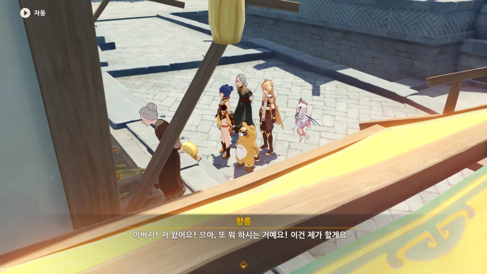
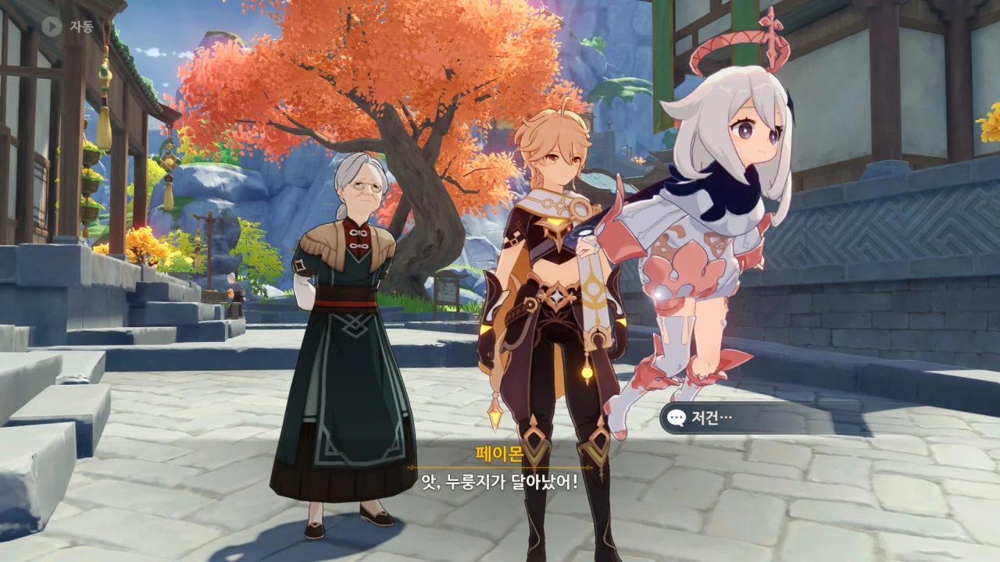
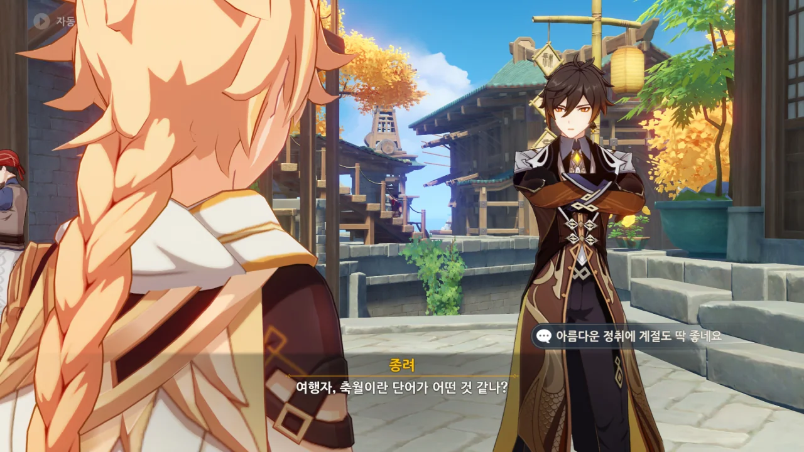
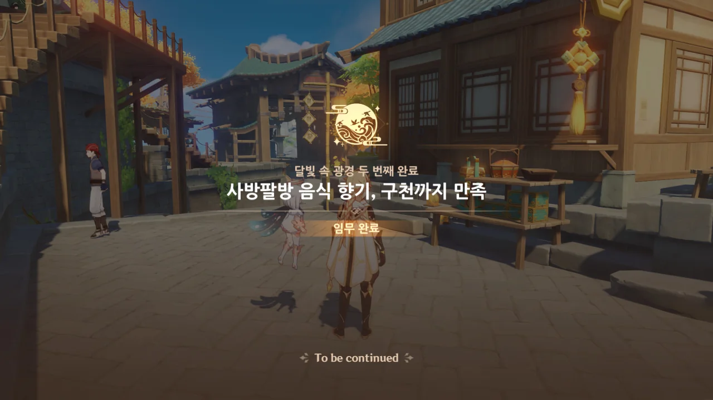
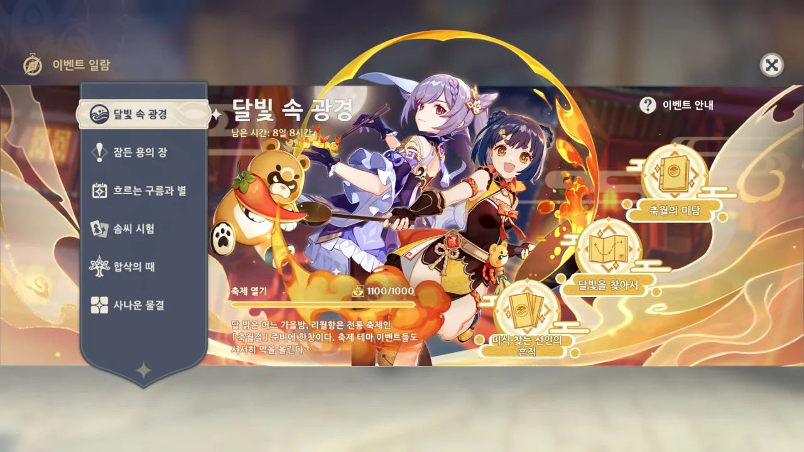

평 할머니와 함께 만민당에 도착했다.

갑자기 누룽지가 어디론가 달려간다.



종려를 보고 놀란 누룽지. 종려 역시 누룽지를 알아본 것인지, "너였구나"라고 말한다.



"오랜만이군, 친구"라고 한 걸 봐선 누룽지의 정체가 마르코시우스임을 확실히 알고 있다.



> 이런 좋은 계절엔 나와서 맛 좋은 음식을 먹어야 하잖나

리월 사람들은 정말 먹을 걸 좋아하나 보다. 리월을 돌아다니다 보면 자주 듣는 대사 중 하나가 "오늘은 뭘 먹을까"이기도 하고.

마치 우리가 '아이템을 얻는다'라고 하는 대신, '아이템을 먹었다'라고 하기도 하는 것처럼 말이다.



> 우정이란 건 원래 세월의 마모를 견디는 법이지

저 대사를 들은 사람들이 '그럼, 야타 용왕은 종려와의 우정이 없었던 거냐 ㅋㅋㅋ'라고 하더라.

아마 그건 야타 용왕이 그때 당시 '야타 / 용왕'인 상태였기 때문이 아닐까?

뜬금없이 종려가 여행자에게 축월이란 단어가 어떠냐고 물어본다.



축월에는 정말 많은 의미가 담겨 있었구나.



평 할머니의 말이 무슨 말인지 알 것 같으면서도 잘 모르겠다.

2000년에 태어난 사람이 이제 성인이라는 말을 들은 내가 느낀 감정과 비슷한 걸까?



축월절 이벤트 스토리, 모두 완료!

To be continued라고 적혀 있지만, 이다음의 이야기가 더 있을 것 같지는 않다.

이번 이벤트 일러스트에서 인상적이라 생각하는 것이 하나 있다.

향릉의 냄비에서 시작한, 붉은색 소스가 그리는 원이 누룽지의 불꽃으로 인해 하나의 원으로 완성되는 모습이다.

&nbsp;

그나저나, 이번 이벤트에서 축월 부적이란 걸 모으게 하던데, 이건 대체 어디에 쓰이는 걸까?
