야에 미코가 나왔지만, 원석을 모아둔 것이 없어 번번이 허탕만 치고 있다.

종려 1돌을 위해서 원석을 있는 것 없는 것 죄다 끌어모아서 천장을 친 직후 곧바로 추가적인 뽑기를 그만두었기 때문에 더더욱 천장이 멀다.

이다음 픽업도 라인업이 만만치 않은데, 라이덴 2돌은 포기해야 할 것 같다.

뭐, 지금도 크게 쓰는 데에 지장은 없으니 괜찮지 않을까?

&nbsp;

사진을 찍을 때 쓰는 프로그램을 Greenshot에서 ShareX로 교체했다. Greenshot에는 특정 영역을 가린 채 사진을 찍는 기능이 없는데, ShareX에는 있기 때문이다.

ShareX의 설정을 조금 많이 손봐, 사진을 찍을 때 자동으로 UID 부분을 가리도록 했다.

마음에 쏙 든다. 사진 찍을 때 나오는 소리도 괜찮고.

***

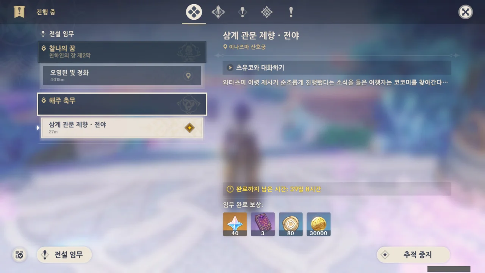

임무를 받을 때, 페이몬이 뭐라 한 것 같은데, 곧바로 지도를 열어 임무 지역으로 이동한 탓에 페이몬의 말을 듣지 못했다.

대화 중 다른 곳으로 워프한다면 도착한 곳에서 다시 대사를 하게 해주면 좋을 텐데.

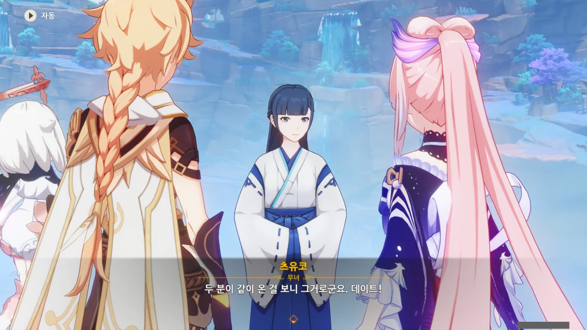

둘이 같이 왔다고 다짜고짜 데이트라니! 츠유코의 입은 여전히 살아있다.



'농담'을 그만두지 않으면 내년 '떠도는 정령 생태 관리'를 맡기겠다고 협박하는 코코미.

&nbsp;

나중에 페이몬이 "코코미가 말해줬어!"라고 말하자, 츠유코는 코코미를 보며 "「코코미」라, 호호"라고 웃는다.

남들은 '산고노미야 님'이라며 성으로 부르게 하면서, 여행자에겐 '코코미'라는 이름을 부르도록 허락했다는 점에서 둘 사이가 심상치 않음을 꼬집은 것이다.

그러자 츠유코를 도끼눈으로 쳐다보는 코코미. (ᓀ‸ᓂ)

&nbsp;

코코미가 참 귀엽긴 한데, 라이덴 쇼군을 뽑기 위해선 어쩔 수 없이 코코미 기원을 넘겨야만 했다.

현재 라이덴 쇼군을 잘 써먹고 있으니 그걸로 일단 만족하자...



기껏해야 심해 용 도마뱀이 활개 치는 것으로 생각했는데, 상황이 생각보다 심상치 않다.

혼자 움직이는 갑옷이 돌아다닌다고?



산호궁에 등록되지 않은 「츠미」라는 무녀가 부상자들을 치료해 주었다고 한다.

이름이 「츠미」라니... 혹시 섬 이름인 「와타츠미」와 연관이 있는 이름 아닐까?



또 내가 모르는 고유명사가 나온다. 그만해...

《연해 축유 모음》은 연하궁/와타츠미 섬의 전통 행사를 적어놓은 책으로 추측된다.

연하궁에서만 할 수 있는, 연하궁 중앙 다이니치 미코시의 광명을 유지하는 「천등제」를 어떻게 진행하는지 알고 있는 걸 보면, 산호궁과는 별개의 연하궁 사람으로 보이는데... 연하궁에 아직도 사람이 산다고?

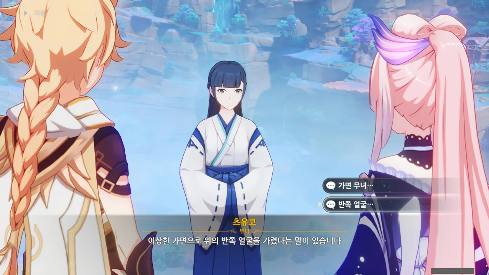

가면 무녀... 윽... 신성한 벚나무 대액막이... 하나치루사토...

진짜 그 월드 임무는 정말 감동적이었는데 말이다.

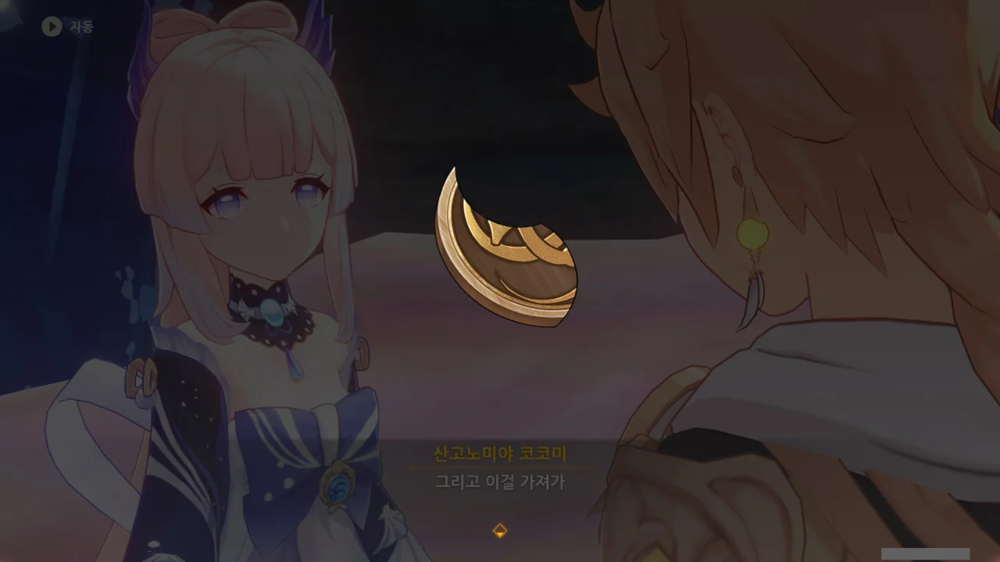

여행자에게 뭔가를 건네주는 코코미. 생김새가 아무리 봐도 다른 조각과 합쳐 하나의 문양을 이루는 것으로 보인다.



지금은 와타츠미 섬에 중요하지 않은 장신구라며, 연하궁에 나머지 둘이 있으니, 인연이 있다면 나머지 둘도 모을 수 있을 것이라고 한다.

역시나, 조각 셋을 모아 하나로 만들어야 하는 것 같다.

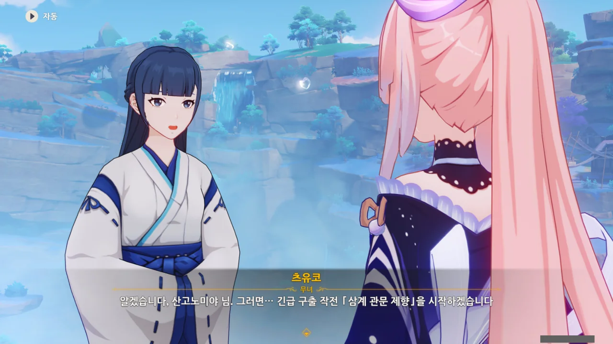

무슨 작전 이름이 「삼계 관문 제향」인 거지?

이거 완전, 비밀회의랍시고 회의 이름을 '엘론드 회의'[^1]라고 짓는 꼴이라고.

[^1]: 《반지의 제왕》에서 반지 원정대가 결성된 비밀회의

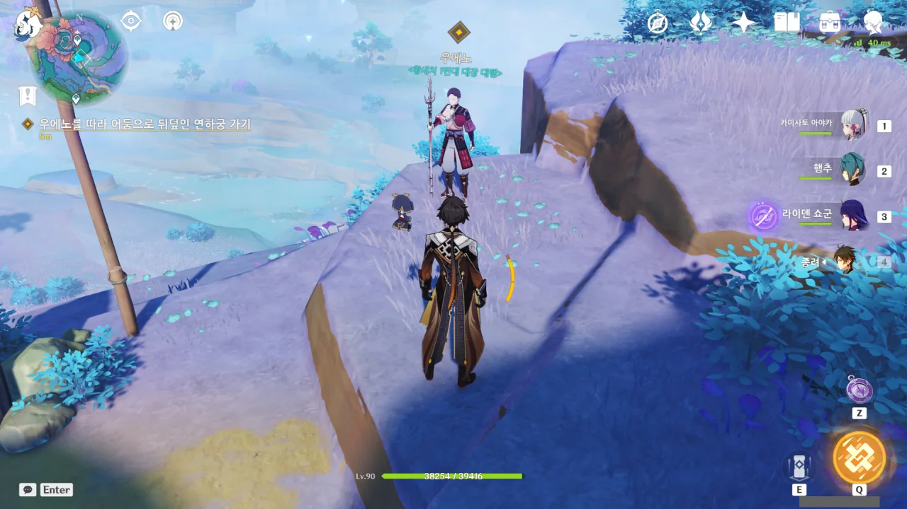

평안한가.

***

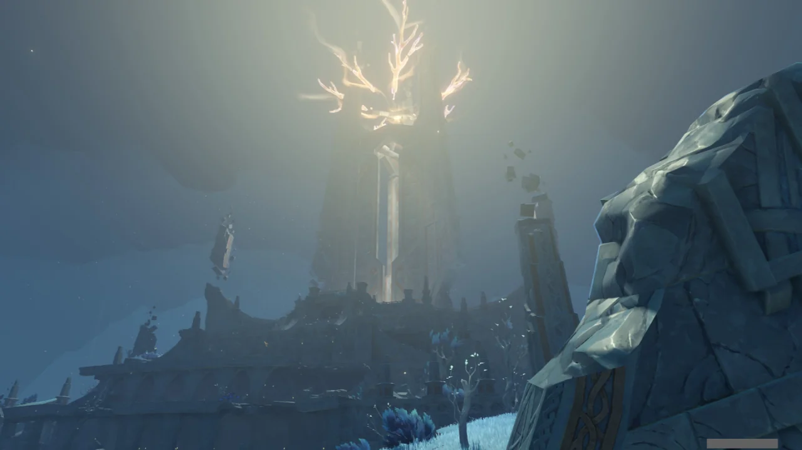

오랜만에 온 연하궁의 상황은 다이니치 미코시에 무슨 나무 같은 것이 자라있는 것을 빼면 평소와 다를 바가 없는 것 같다.

상야와 백야를 전환할 때 뱅글뱅글 돌아가던 삼각형은 안 그래도 조각난 것이 더 망가지기라도 한 듯 깨진 틈이 더 벌어져 있었다.

&nbsp;

음, 평소와 다를 바가 없는 건 아니네.

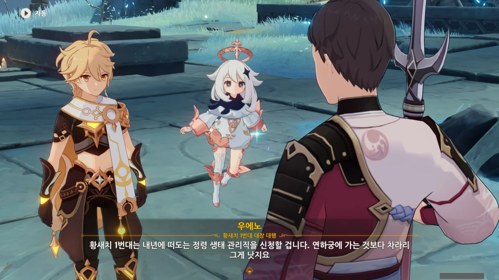

대체 '떠도는 정령 생태 관리직'이란 뭘까?

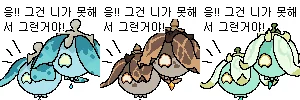

아니, 굳이 말 안 해도 될 것 같아.

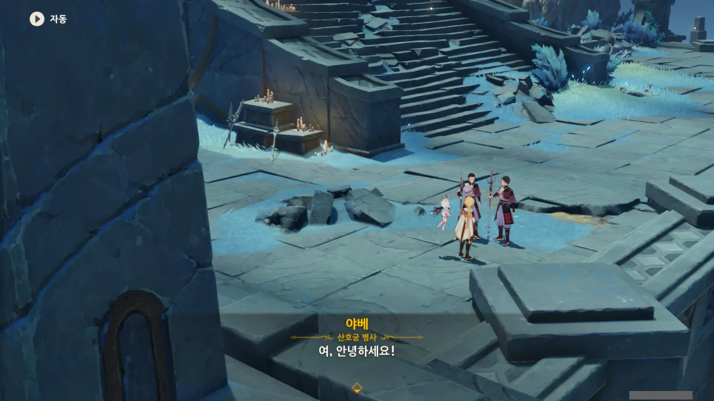

어떻게 ㅋㅋ 사람 이름이 ㅋㅋ '야베' ㅋㅋ



내가 버튜버는 안 보지만, 이 YABE 밈은 좀 안다.

이게 다 디스코드 서버에 누군가가 저걸 스티커로 올려놓은 탓이다. 아무튼 그 탓이다.

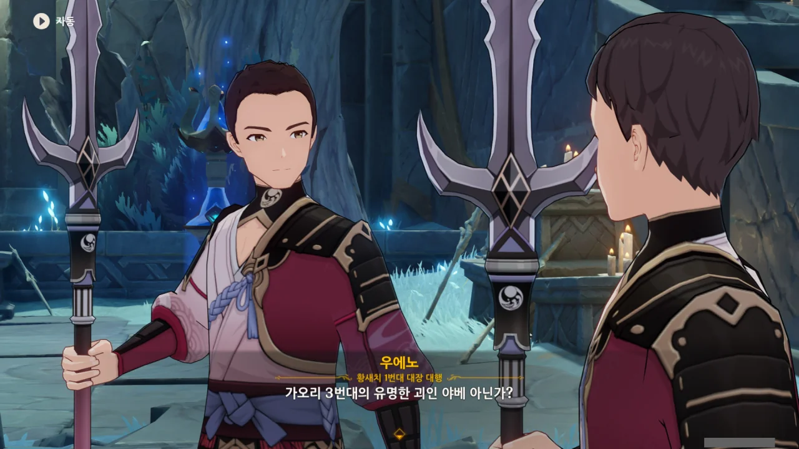

멀쩡한 사람보고 '괴인'이라니... 그렇게 부르면 마치 전대물에 나올 것 같잖아.

차라리 '괴인' 말고 '기인'이라고 불러라. 아니면 '별종'이라고 부르던지.



아니, 게다가 별 시답잖은 이유로 야베를 '괴인'이라고 부르는 거였어?

남들 다 움직이는 텅 빈 갑옷을 보고 무서워하는데, 야베 혼자 그걸 무서워하지 않아 '괴인'이라는 별명이 붙었다고 한다.

와, 인성 쓰레기네, 이 녀석들.

코코미, 산호궁 병사들의 인적성 검사를 한 번 해봐야 하지 않을까?



뭐지? 이 무녀?

사람을 보자마자 "인간이 맞나요?"라고 묻질 않나, "인간의 새끼인가요?"라고 묻질 않나...

사람의 첫인상이 모든 걸 결정한다던데, 츠미의 첫인상이 나락으로 가버렸다.

심해 용 도마뱀의 생태는 잘 알면서 사람의 생태는 전혀 모르는 눈치이다.

정체가 좀 수상한데... 설마 츠미는 심해 용 도마뱀이 변신한 게 아닐까?

이 게임에서 겉모습은 정체를 파악하는 데 아무런 도움이 안 된다. 아니, 멀쩡한 NPC가 갑자기 치친 술사로 변신했다니까?

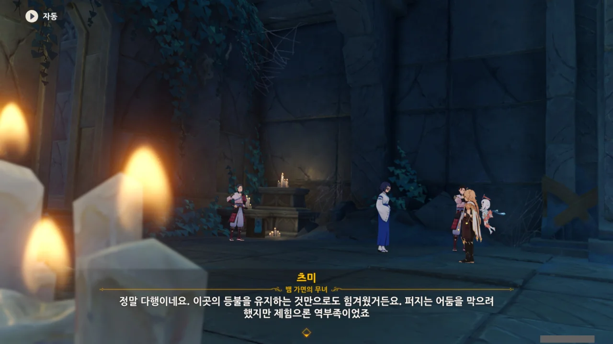

그래, 안 그래도 그 건 때문에 여기에 온 것이었다.





그리고 시작되는 배경 설정 이야기.

이번 작전 이름이 '삼계 관문 제향'이 된 이유를 설명해 준다. 그게 나름 이유가 다 있었구나.

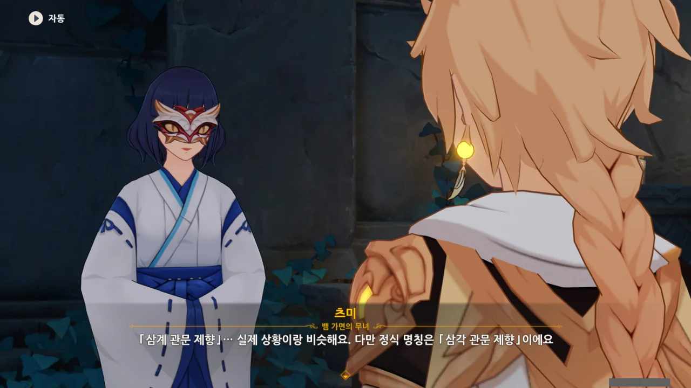

하지만 츠미의 말에 따르면, 정확한 명칭은 「삼각 관문 제향」이라고 한다.

둘 사이에 무슨 차이가 있는데?



아, 설마 예전에 연하궁을 탐사할 때 연하궁 외곽의 세 섬을 방문한 적이 있었는데, 거길 이야기하는 것 같다.

거기서 책을 모은다고 고생 좀 했지...



못생기긴 무슨...

이 게임의 모든 NPC가 프리셋을 돌려 쓰는 이상, 이 게임에서 못생긴 사람이 있을 수 없다.

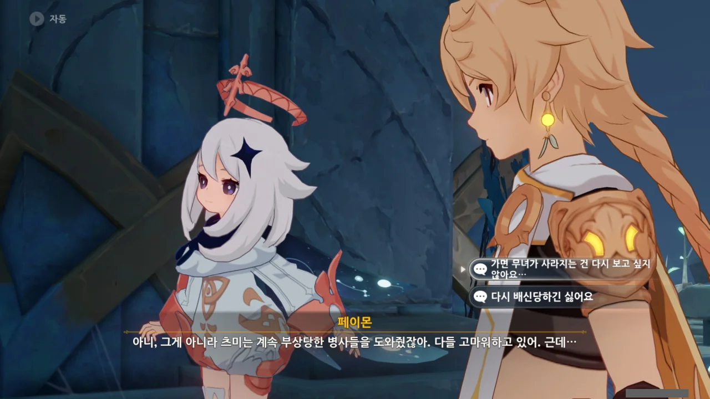

그래. 가면 무녀가 사라지는 건 하나치루사토로 이미 충분하다고.





츠미의 가면 너머의 얼굴을 본 사람에 말에 따르면, 츠미는 뱀 눈을 갖고 있다고 한다.

와타츠미 신의 첫 번째 권속, 와타츠미 어사 일족 역시 반은 사람이요, 반은 뱀이라는 이야기가 있어, 그 모습을 본 사람들이 츠미를 와타츠미 어사 일족으로 생각한 것 같다.



또 다른 제보에 따르면, 츠미의 소매에서 목걸이가 떨어졌는데, 하나의 목걸이에서 분리되어 나온 것처럼 보였다고 한다.

코코미에게서 받은 것 역시 하나의 무언가에서 분리되어 나온 것처럼 보이긴 한데... 내가 받은 건 토큰 조각처럼 보이는데.



지금껏 츠미가 한 행동은 와타츠미 사람들을 보호하는 행동이었다.

하지만 혹시 모르지. 엔죠처럼 심연 사도가 변장한 채 행동하는 것일 수도 있으니.

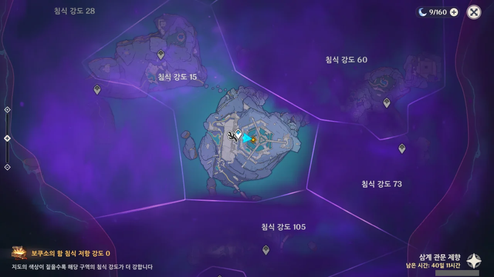

예상했던 대로, 연하궁 맵에서 동굴과 입구 부분은 막아두고, 나머지 세 섬을 포함해 두었다.





츠미는 다른 건 잘 아는 것 같은데, 정작 사람에 관한 건 잘 모르는 것 같다.

진짜로 츠미가 용 도마뱀이 변신한 건 아니겠지.

&nbsp;

나중에 본색을 드러내며 '내가 지금껏 널 도운 건 이러이러한 목적을 달성하기 위해서였다!'라고 하는 그런 전개는 아니겠지, 설마... 에이, 설마.



보쿠소의 함이라는 아이템을 주며 써보라고 한다.

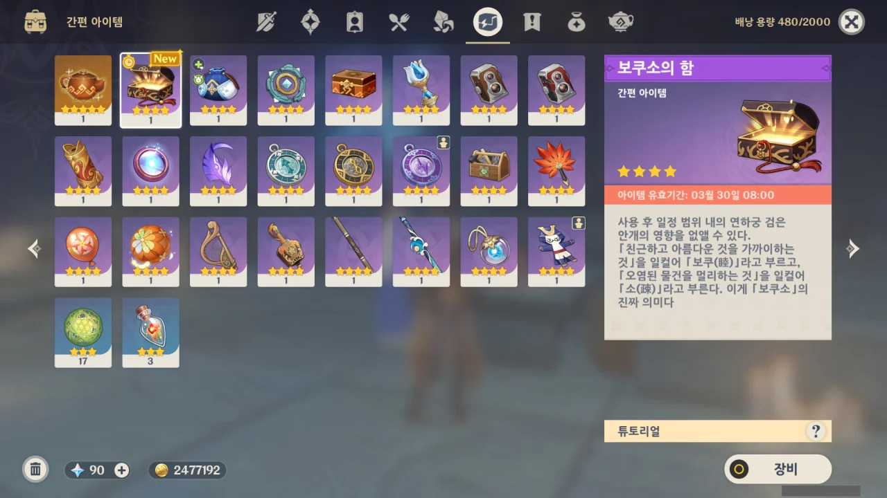

보쿠소의 함은 간편 아이템 취급이라, 기존에 쓰고 있던 삼공식 영양 키트와 동시에 쓸 수 없다. 번개 나침반 역시 마찬가지이다.

이러면 조금 힘들지도...

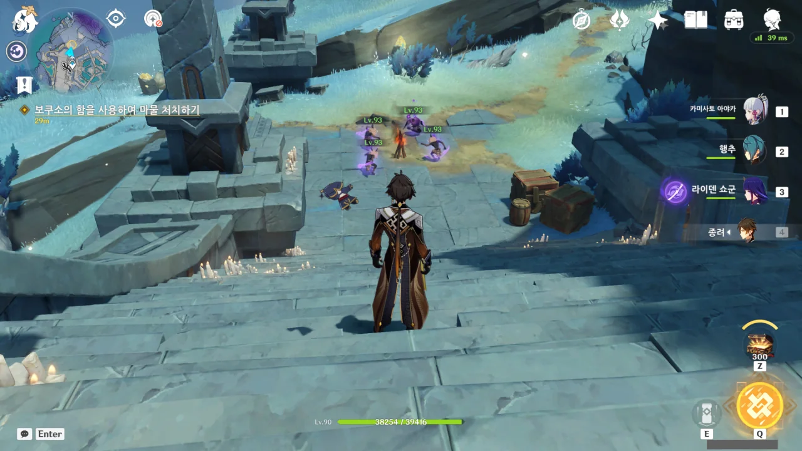

몹들의 몸 주변에 보라색 아우라가 둘려 있다.

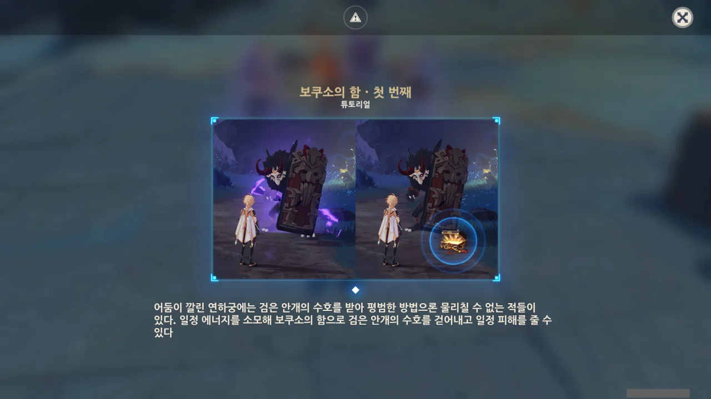

저 보라색 아우라는 '검은 안개의 수호'라는 것인데, 보쿠소의 함을 이용해 그걸 걷어내면 다시 평소의 몹으로 돌아온다는 것 같다.

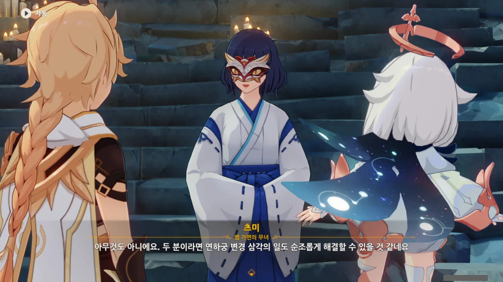

'붉은 산호'를 가져간 사람이 우리라고 하자, 뭔가 원한에 찬 목소리로 '당신들이...'라고 중얼거리는 츠미.

아무래도 츠미는 용 도마뱀이 변신한 게 틀림없는 것 같다. 자신의 동족을 죽인 원수 그런 것으로 여행자를 생각하는 것 같은데...





그러니까 보쿠소의 함을 써서 맵도 열고 몹도 잡고 도전도 하라는 건가?

어째 설정이 가면 갈수록 난해해지는 느낌인데...

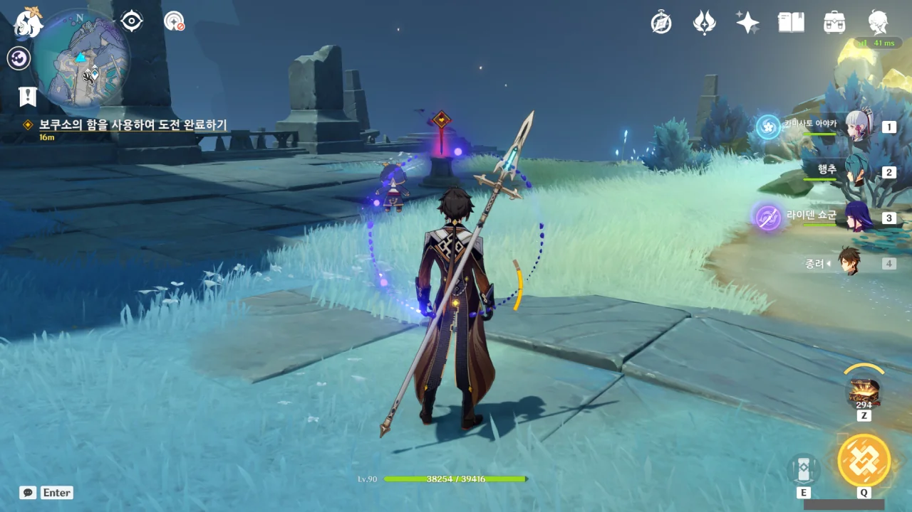

도전 역시 보라색 아우라로 둘려 있다.

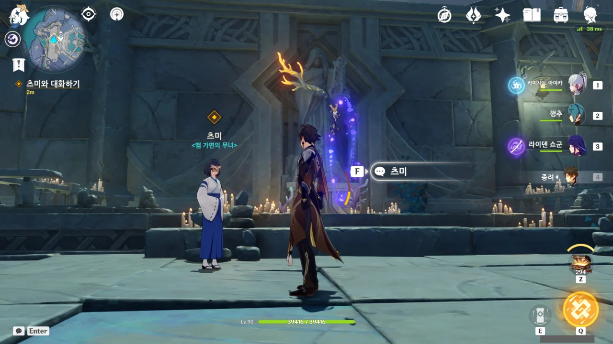

음... 저 석상이 원래 저렇게 노란색 가지를 들고 있었던가?







여기서 또 심연이 나온다고? 대체 이 녀석들은 안 끼는 데가 있긴 해?

이 세상에서 뭔가 수상한 일이 생길 때는 셋 중 하나를 의심하면 된다.

1. 츄츄족
2. 심연 교단
3. 우인단

&nbsp;

보쿠소의 함은 여기 이 석상에서 다시 충전할 수 있을 것이다. 이벤트를 진행하며 얻을 수 있을 '광계의 힘 결정'을 여기에 바치면 보쿠소의 함의 능력을 업그레이드할 수도 있을 거고.

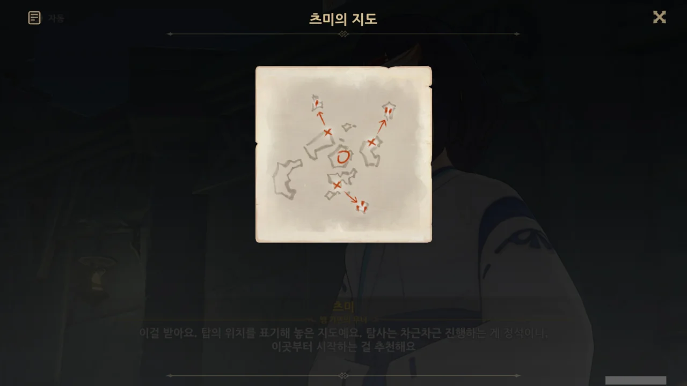

그려진 막대기의 개수로 보아하건대, 아마 가야 하는 순서가 따로 있는 모양이다.



뭔가 이래저래 알려주긴 하는데, 머릿속에 잘 들어오지는 않는다.

&nbsp;

이번 이벤트도 '다음 지역을 열기 위해서는 며칠 기다리셔야 해요!' 같은 소리는 하지 않겠지? 저번 금사과 제도 이벤트 때 제일 귀찮은 게 바로 그거였는데.
