최근 들어 느낀 것이지만, 원신의 이벤트는 초반과 후반에만 스토리가 집중되어 있고, 중반에는 스토리 대신 전투나 퍼즐 풀이가 주가 되는 것 같다.

그래서 같은 시간 플레이를 하며 사진을 찍어도 사진의 개수가 차이가 나는 것 같다.

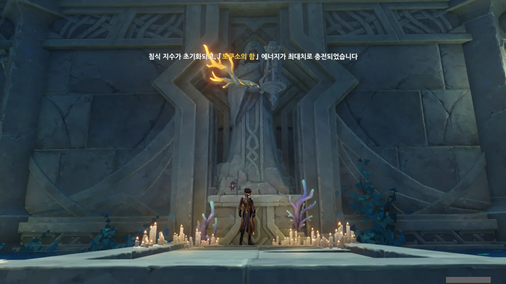

분명 설명을 다 읽은 것 같은데, 저 '침식 지수'가 뭔지 도통 모르겠다.

내가 아는 침식은 실드를 뚫고 모든 파티원의 체력을 깎는 침식 디버프밖에 없는데.

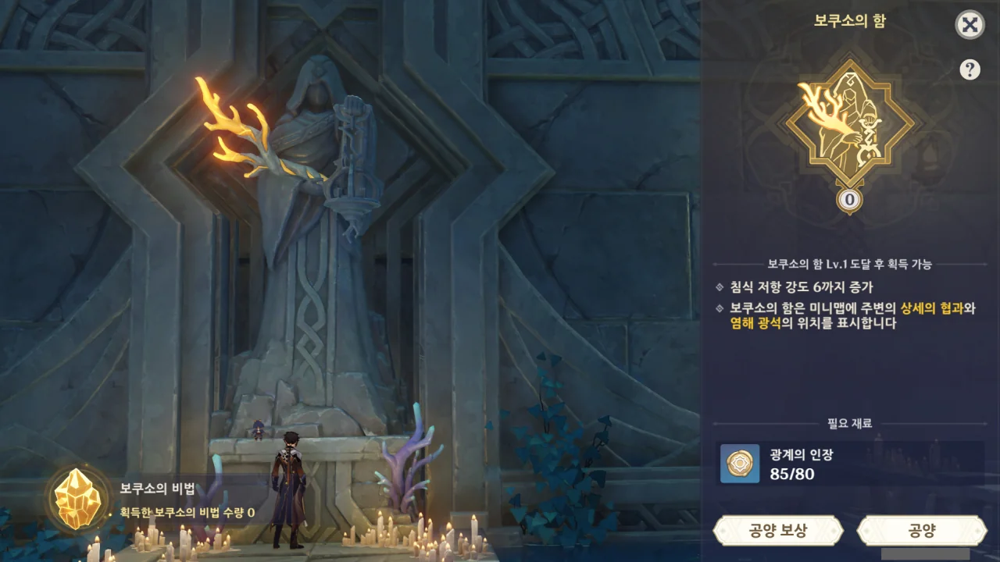

보쿠소의 함을 충전할 때는 신상처럼 최대 충전 가능 제한이 없는 것 같다. 그건 다행이네.

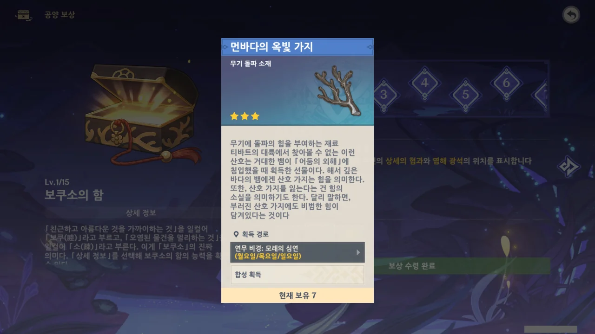

보쿠소의 함을 업그레이드하면 각종 돌파 재료를 준다.

요즘은 원신을 할 때 일일 임무만 하고 퓨어 레진을 경험치 책을 주는 지맥에 쏟아부은 다음 곧바로 원신을 끄기 때문에 돌파 소재 같은 아이템이 잘 모이지 않는다.

&nbsp;

매번 '아, 무기 돌파 소재도 모아야 하는데'라고 생각하지만, 다음 날 원신을 켤 때는 그걸 까맣게 잊어버린다.

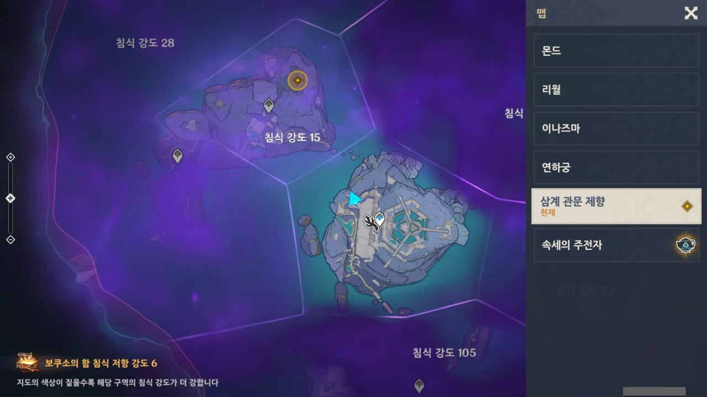

미호요 이 녀석들은 츠루미 섬 때에도 그러더니, 맵을 안개로 덮는 것에 재미를 들였나 보다.

&nbsp;

그나마 다행인 점은 이번 이벤트 맵이 기존 연하궁 맵과 별개의 맵이라는 것이다. 즉, 이벤트를 진행 중이라도 멀쩡한 상태의 연하궁으로 갈 수 있다.

만약 그러지 않았더라면 사람들은 이벤트 기간인 40일 동안 연하궁에 제대로 발도 들이지 못했을걸?



비슷한 구조의 퍼즐을 금사과 제도에서 본 것 같다.

거기에선 퍼즐을 풀기가 너무 힘들어 상자고 뭐고, 죄다 포기하고 무시했지만, 이번에는 퍼즐을 풀 수 있을 것만 같다.

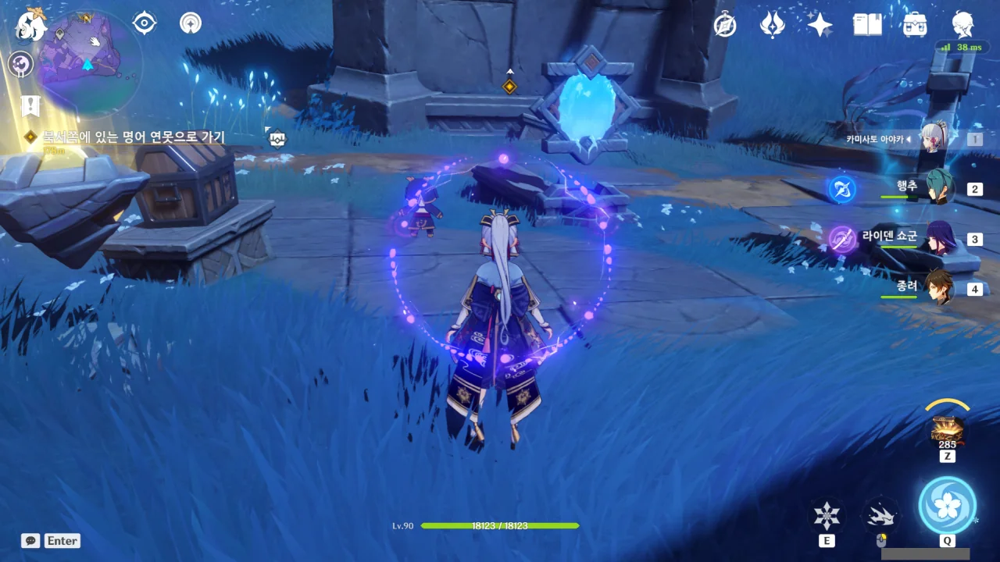

거 봐. 할 수 있다니까. 이지 피지 레몬 스퀴지.

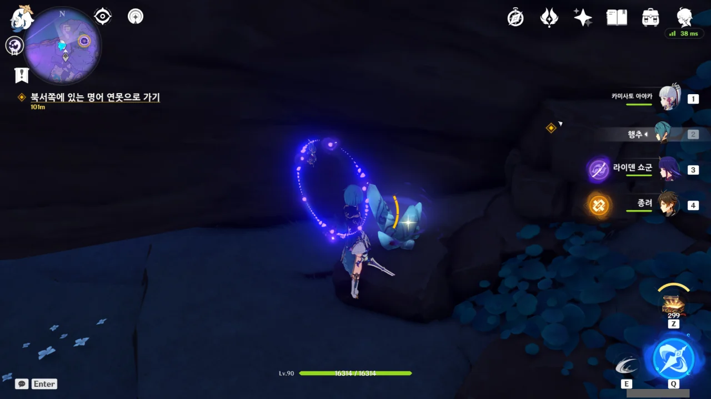

처음 보는 형태의 광물을 발견했다. 이 광물 역시 보쿠소의 함으로 안개를 걷어내고 먹어야 한다.

생긴 건 꼭 수정 골수처럼 생겼는데...

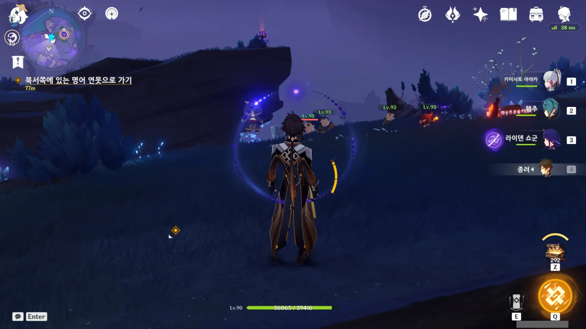

이곳저곳 돌아다니는 게임에서는 제일 먼저 워프 포인트를 개척해야 한다. 그 먼 거리를 또다시 걷거나 뛰는 건 절대 사절이다.



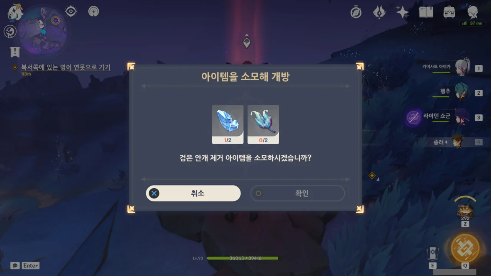

아잇, 젠장! 워프 포인트가 잠겨있다.

이렇게 안개 때문에 잠긴 워프 포인트는 보쿠소의 함이 아니라 다른 아이템을 바쳐 안개를 걷어내야 한다.

다행스럽게도 필요한 아이템이 근처에 적잖이 있어 조금 모아두었다.

&nbsp;

지금부터 보이는 아이템은 전부 모아두어야 나중에 다른 워프 포인트를 열 때 아이템이 부족한 일이 없을 것 같다.

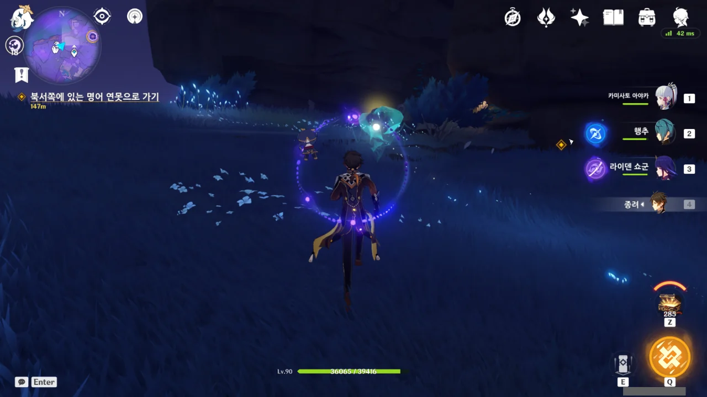

보쿠소의 함을 업그레이드하기 위해 이것저것 보이는 걸 죄다 하는 중이다. 선령도 따라가고, 도전도 완료하고...

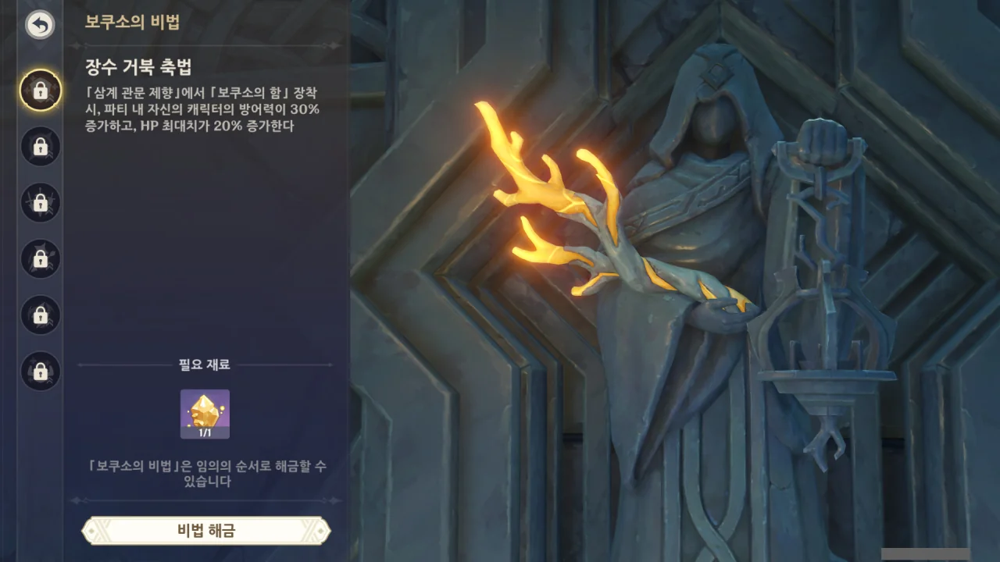

도전을 할 때, 뭔가 몹이 많이 나온다고 생각했었는데, 도전이 끝나고 보쿠소의 비법을 주는 상자가 나왔다.

일단은 무기 대미지를 올리는 옵션을 선택했다. 어차피 나중에 다 열게 될 테지만...

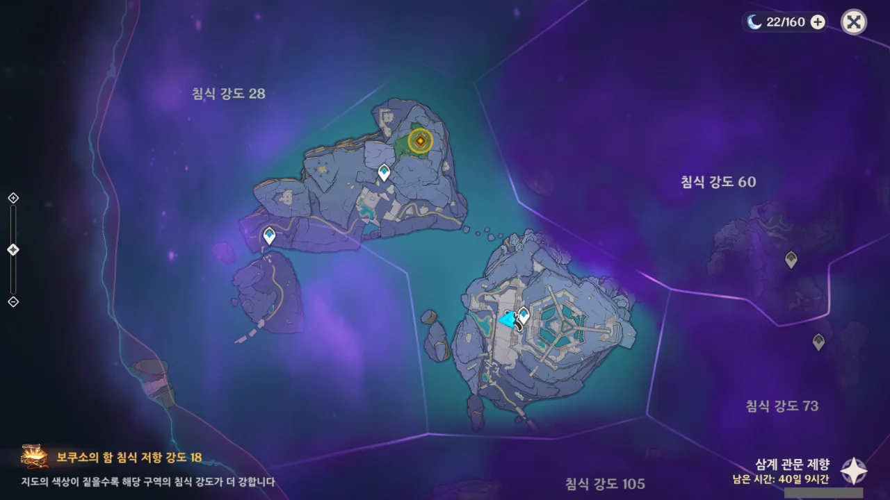

보쿠소의 함 레벨이 올라갈수록 침식 없이 접근할 수 있는 지역이 늘어난다.

지도에서는 안개가 걷히는 식으로 표현했다.

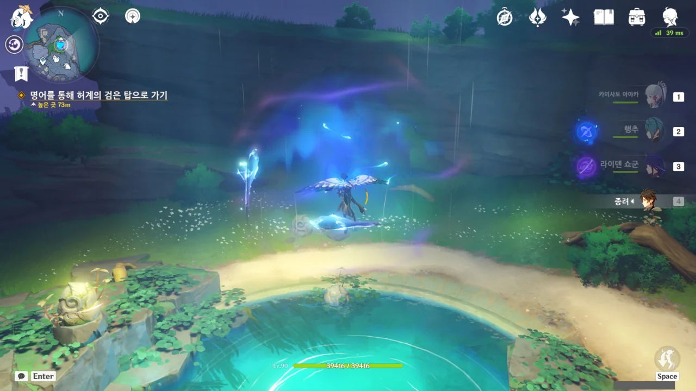

이 거품을 타니 오만 생각이 다 난다.

처음 이걸 탈 때는 수직으로 올라간다는 걸 잘 몰라 매번 번번이 떨어지기 일쑤였다.

다인 모드에서 두 번째로 탔을 때는 아래에 있던 심해 용 도마뱀이 쏘아 올린 물 공격에 다 같이 사이좋게 맞고 바닥에 떨어졌었다.

&nbsp;

이번엔 다행히도 거품을 놓치지도, 거품에서 떨어지지도 않았다.

여기 온 것이 아직 한 달도 채 되지 않았을 텐데, 굉장히 오랜만에 온 느낌이다.

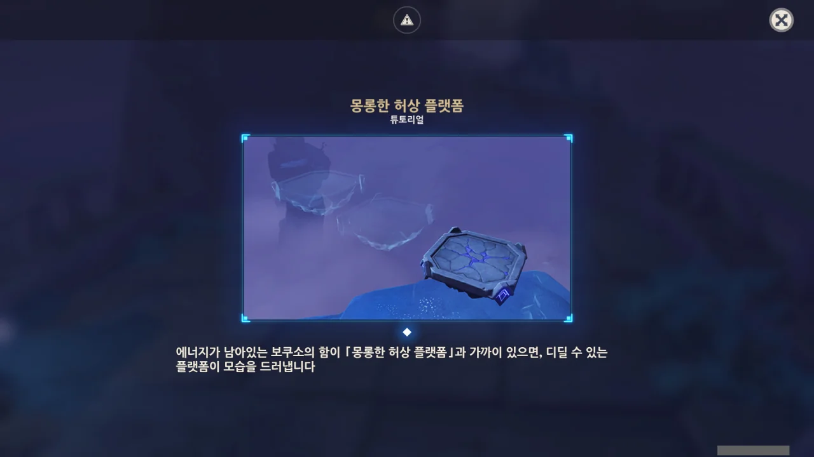

이 허상 플랫폼은 왜 있었던 걸까? 그냥 날개를 펴고 날아가니 충분히 반대편에 닿을 수 있었는데.

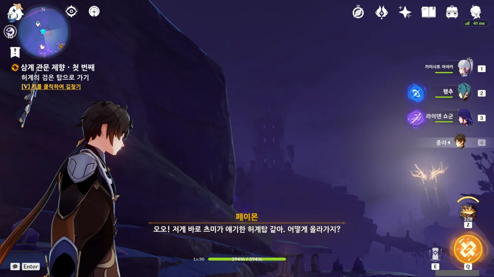

탑 겉면에 뭔가 문자가 쓰여있다. 무엇을 의미하는 거지?

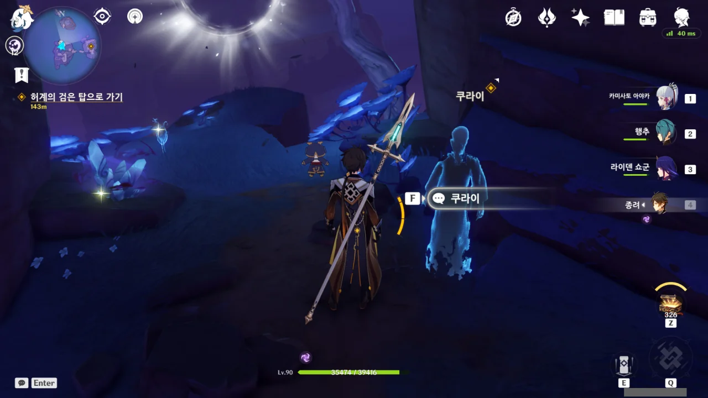

응? 이 '쿠라이'라는 이름의 NPC가 원래 여기에 있었던가? 내가 마지막으로 여기에 왔을 때 관련 임무를 안 한 것이 있었나?



번개 선령이 여기저기 날아다니며 주민들을 마비시켜 골치라고 한다.

마비라고? ㅋㅋㅋㅋ

플레이어는 번개 선령과 닿아도 그저 번개 원소만 부여받고 끝인데, 일반인은 번개 원소 때문에 마비되는 것 같다.

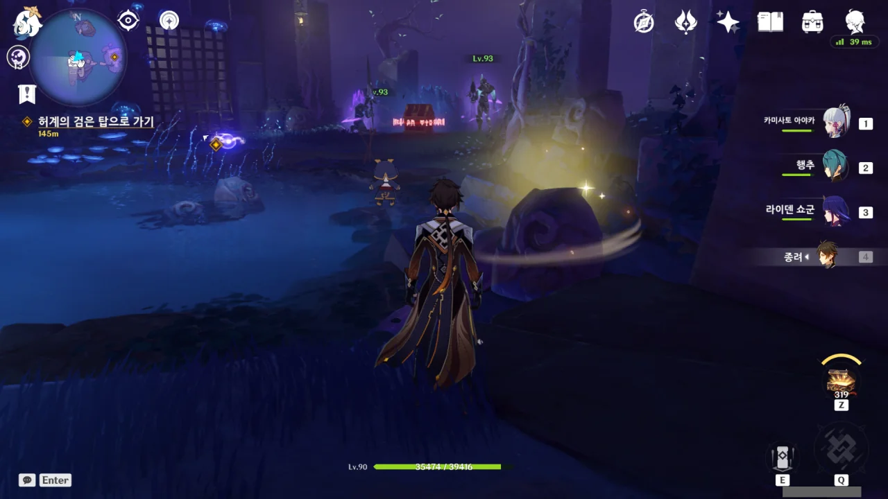

저게 그 '움직이는 텅 빈 갑옷'인가? 때려보니 굉장히 단단하더라. 안개를 걷어내고 두들겼음에도 꽤 오랜 시간이 걸렸다.

왜 원신은 체력 바의 길이와 실제 체력이 비례하지 않은 걸까?

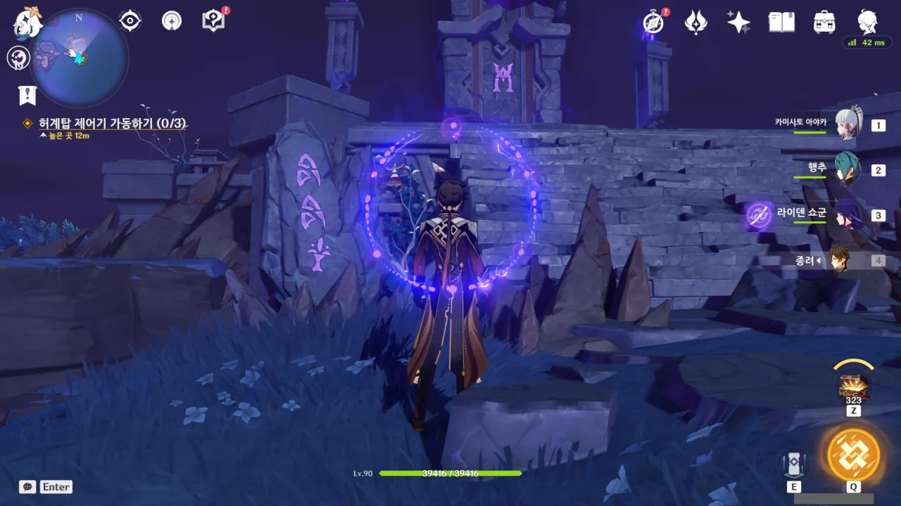

탑 밑의 돌에 문자가 3개 그려져 있다. 탑에도 같은 문자가 그려져 있다.

분명 퍼즐이겠지.

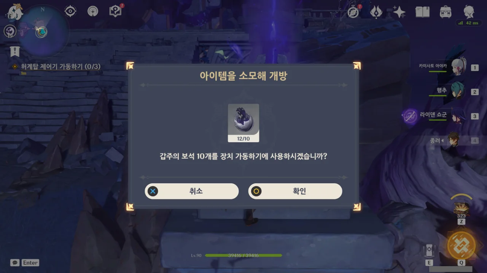

근처에 있는 장치 3개를 아이템을 써 개방했다.

워프 포인트를 해금하기 위해 모아둔 아이템까지 요구해서 조금 놀랐다. 보이는 걸 전부 모아둬서 망정이지, 기껏 여기까지 왔는데 또다시 아이템을 모으러 주변을 돌아다닐 뻔했다.

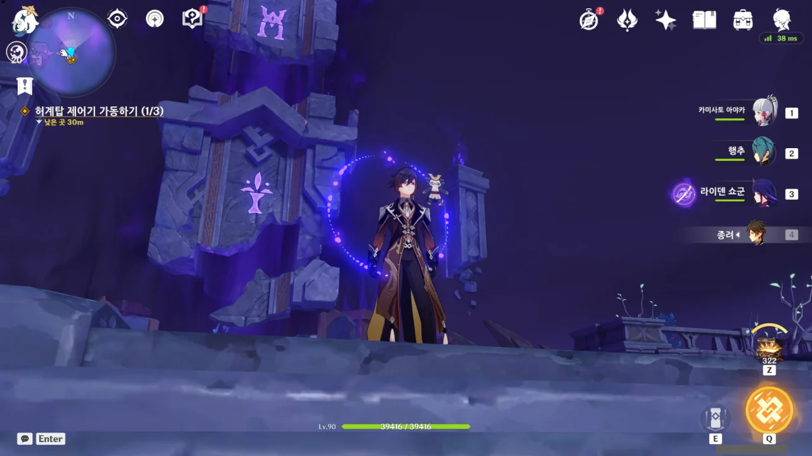

그런데 저 탑, 일반 연하궁에 갔을 때도 있었던 것 같긴 한데, 적어도 이렇게 삼등분된 채 공중에 둥둥 떠 있지는 않았던 것으로 기억한다.

심연이 탑에 대미지를 많이 준 걸까?

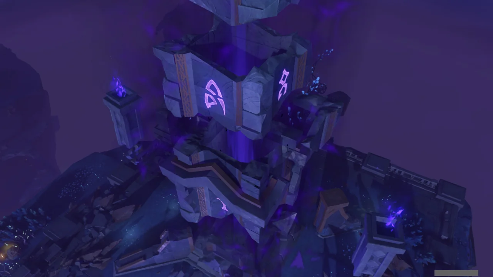

퍼즐을 모두 풀자, 공중에 붕 떠 돌아가던 탑이 다시 하나로 합쳐지고 있다.

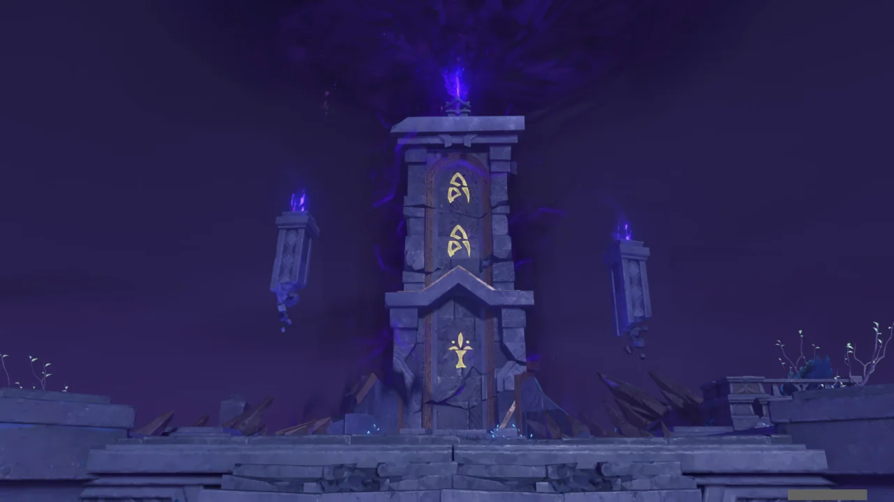

이제 그나마 내가 보던 탑의 모습으로 변했다.

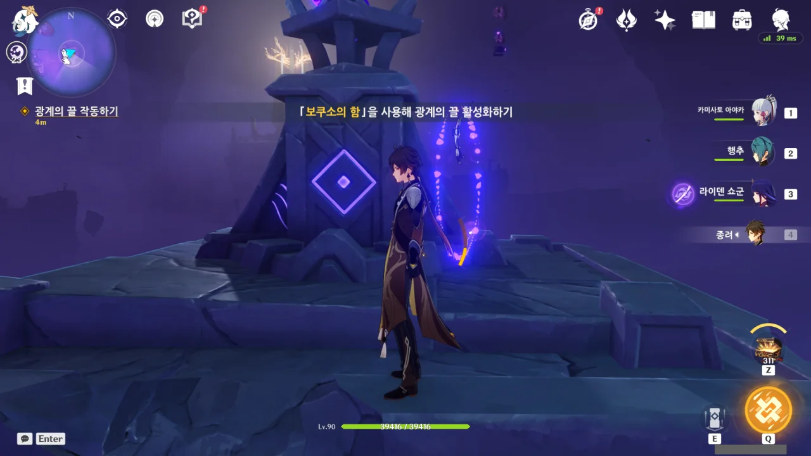

'광계의 끝'이 뭔지는 잘 모르겠지만, 일단 보쿠소의 함으로 정화해 준다.



페이몬의 말을 듣고 '그 힘들이 전부 츠미에게 간 것 아냐?'라는 생각이 들었다.

음, 비슷한 전개를 스타크래프트에서 본 것 같은데... 중추석이라고...

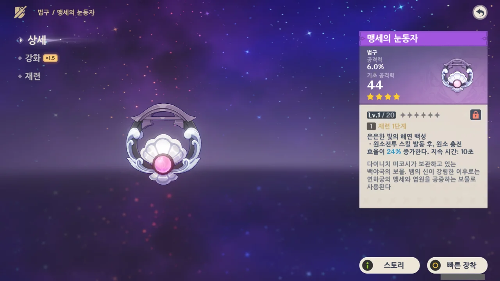

보쿠소의 함을 업그레이드하다 보니 이벤트 배포 무기인 '맹세의 눈동자'를 획득했다.

이건 누구에게 줘야 제대로 쓸 수 있을까?



천등 시련이라는 것을 해보기로 했다. 몹이 조금 많이 나오는 걸 빼면 평소 보던 도전과 동일하다.

시간만 충분하다면, 이걸 무한정 할 수 있다.

보상도 계속 들어오는 것 같은데, 보쿠소의 함을 업그레이드하는 데 필요한 인장을 여기서 먼저 다 모아갈 수 있을 것 같다.

&nbsp;

점점 보쿠소의 함 업그레이드에 필요한 인장의 개수가 늘어나고 있다.

분명 처음에는 60개가 필요했는데, 그게 80개가 되더니 이제는 100개가 되었다.

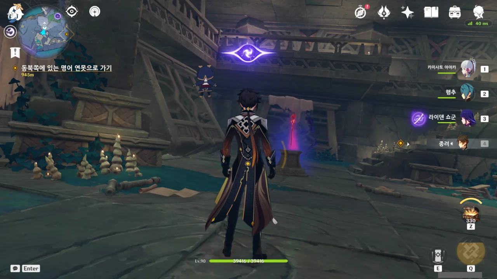

도서관 앞에 번개 기둥이 세 개 있길래 관련 도전을 모두 끝냈더니 도서관이 열렸다.

도서관 안에도 도전이 있다.

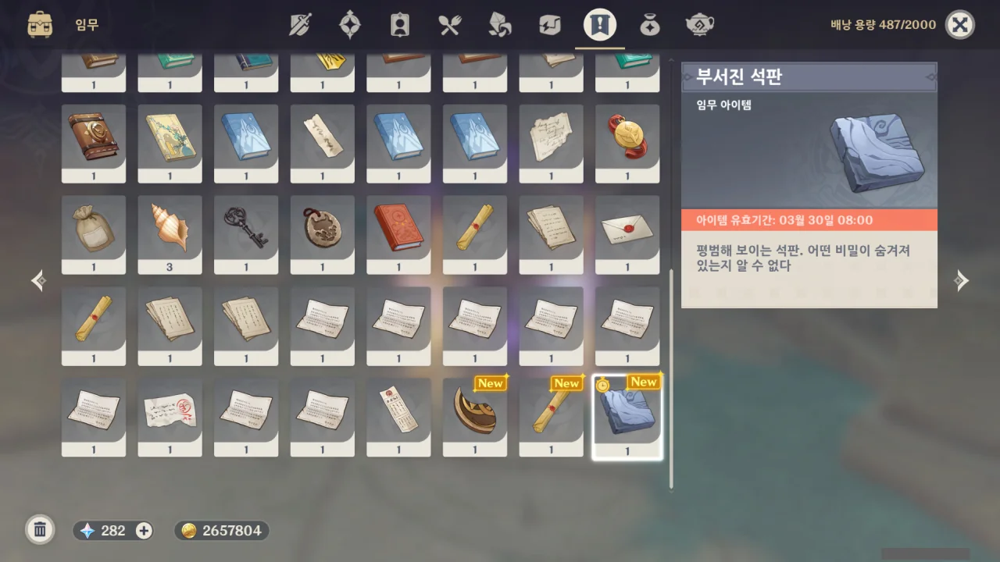

도전을 모두 끝마치고 바닥에 떨어진 아이템을 챙기다 '부서진 석판'이라는 이상한 아이템을 주웠다.

도서관에 총 세 개가 있던데, 이건 대체 어디에 쓰는 걸까?

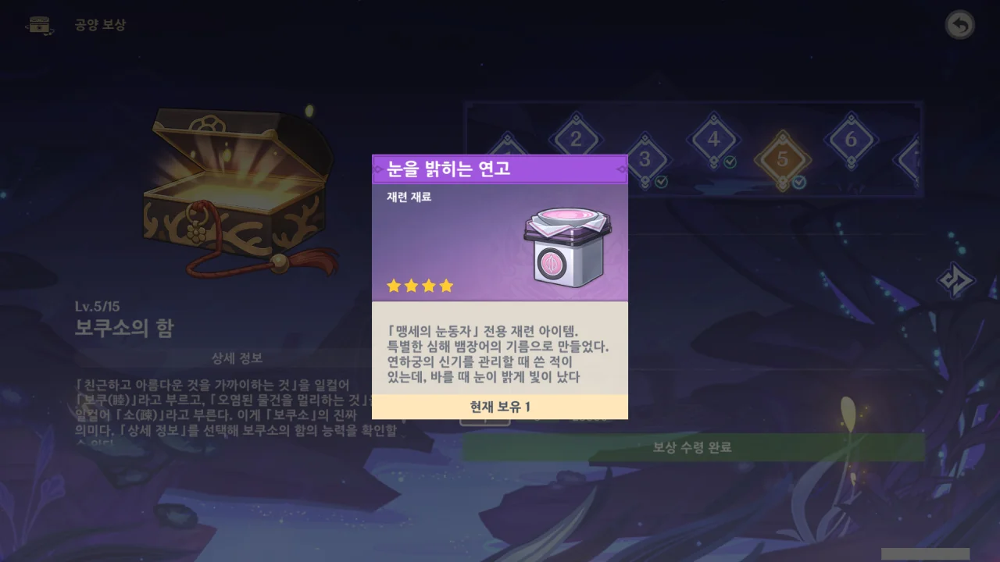

이벤트 배포 무기는 재련할 때 동일한 무기로 재련하지 않고, 이렇게 별개의 아이템으로 재련한다.

이벤트를 모두 완료할 시, 해당 무기를 최고 등급으로 재련할 수 있을 정도의 재련 아이템이 나온다.

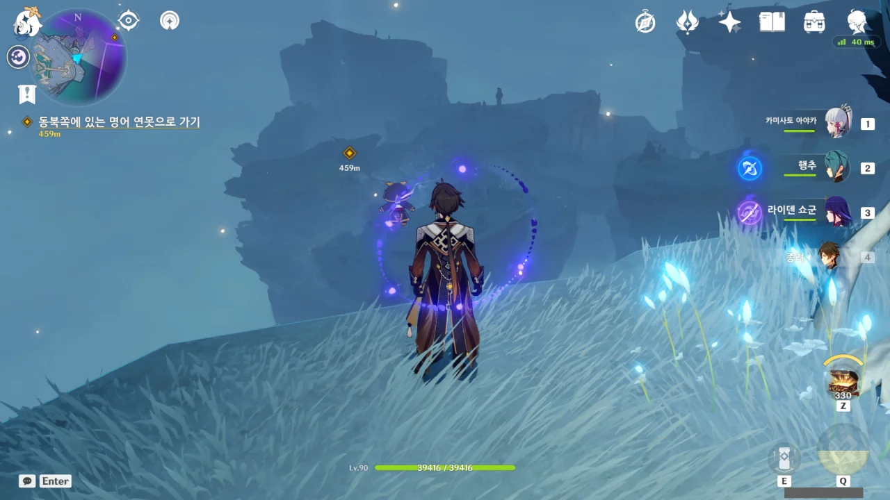

이다음은 저기 너머로 가야 하는데, 부채를 꺼내기 귀찮아 그냥 날아갔다.

스태미나가 다 닳기 전에 아슬아슬하게 도착했다.



아잇, 젠장맞을! 기껏 왔는데 보쿠소의 함 레벨이 부족해 워프 포인트도, 도전도 할 수 없다.

&nbsp;

결국 인장을 모아 함의 레벨을 올린 후 다시 와야 했다. 젠장, 귀찮게.

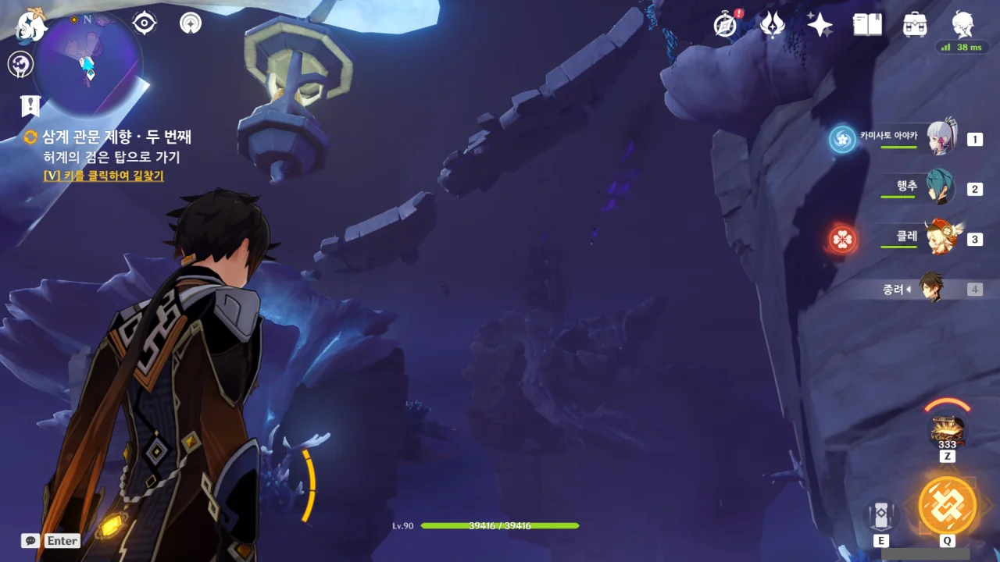

두 번째 탑의 상태도 영 좋지 않다.



여기에도 텅 빈 갑옷이 돌아다니고 있었지만, 문제없이 처리했다.

탑도 잘 정리했고.

&nbsp;

이런 외딴섬 같은 곳은 한 번 오면 다시 오지 않는 경향이 있기에, 한 번 올 때 가능한 한 모든 채집 요소를 다 먹고 간다.

그래도 몇 개 정도는 놓치기 마련이지만, 그 정도의 오차는 무시할 수 있다.



탑을 복구할 때마다 츠미와 할 수 있는 대화의 종류가 늘어난다.

첫 번째 탑을 복구하고 왔을 때 '츠미에 대해서'라는 대화 선택지가 있길래 눌러봤더니 아주 철벽을 치더라.

나중에 배신할 거라서 그러는 건가?







별생각없이 야베에게 말을 걸었다가 뜻밖의 수확을 거뒀다.

석판을 얻었지만 어디에 쓰는지 전혀 몰랐는데, 분코쿠 밀실을 여는 데 쓸 수 있는 것 같다.

밀실? 안에 보물이 있다는 이야기겠지?

&nbsp;

이런 정보를 야베에게서 듣게 될 줄이야. 난 필드를 돌아다니며 자연스럽게 힌트를 얻게 될 줄 알았다.

분코쿠 역시 연하궁 방식의 이름인 '테 뭐시기 스'라는 이름이 있다고 하지만, 그건 지금 중요하지 않다. 보물이라고, 보물!

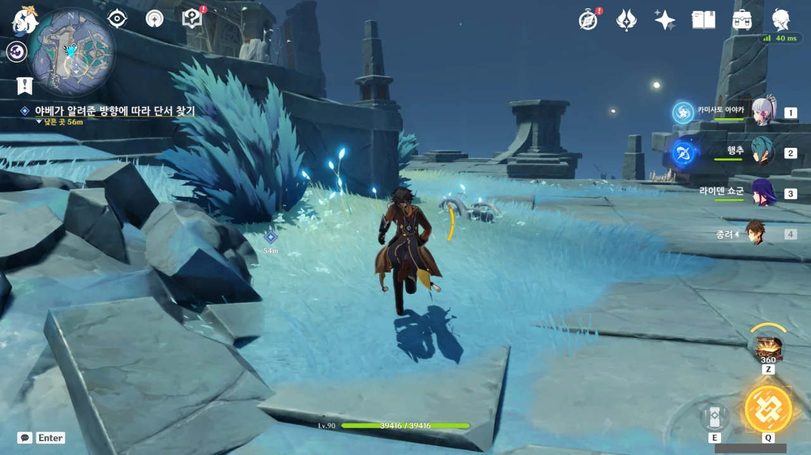

'보물은 못 참지 ㅋㅋㅋ'라고 생각하면서 열심히 달려가는 중이다.

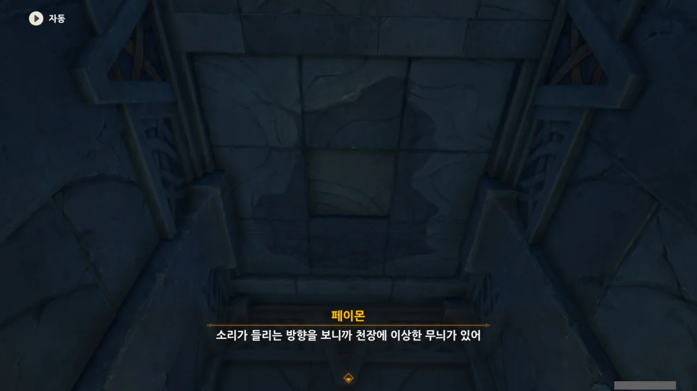

어... 천장에 이상한 문양이 있다.

&nbsp;

퍼즐 중에는 3x3의 아홉 칸에 여덟 칸만 그림이 그려져 있고, 남은 한 칸의 빈칸을 통해 그림 조각을 옮겨 제대로 된 그림을 완성하는 퍼즐이 있다.

그리고 그 퍼즐은 내가 제일 싫어하는 퍼즐이다. 도통 어떻게 해야 푸는 것인지 모르겠거든.

설마 이 퍼즐도 그런 건 아니겠지?

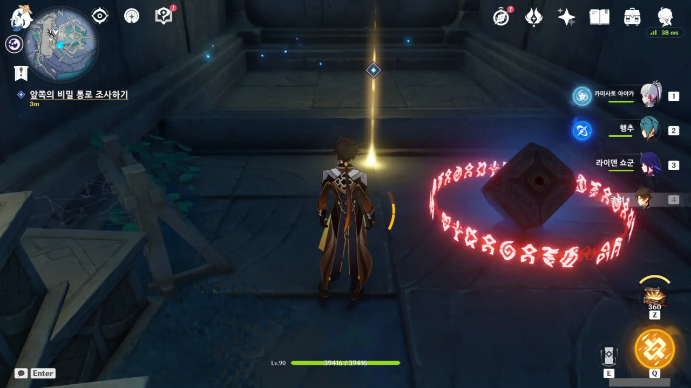

위층에는 지금껏 수집한 석판을 넣을 수 있는 것처럼 보이는 공간이 있다.

음... 아무리 생각해도 3x3 퍼즐이 맞는 것 같은데...

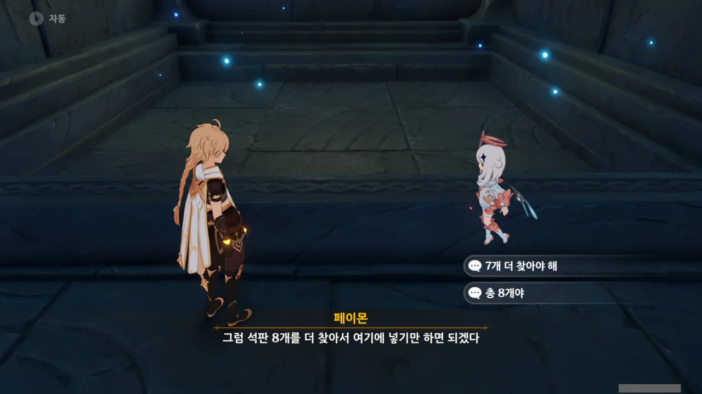

페이몬에게 석판을 8개가 아닌 7개를 더 찾아 넣어야 한다고 지적하자, "알아들었으면 됐지!"라는 말을 들었다.

귀여운 녀석.

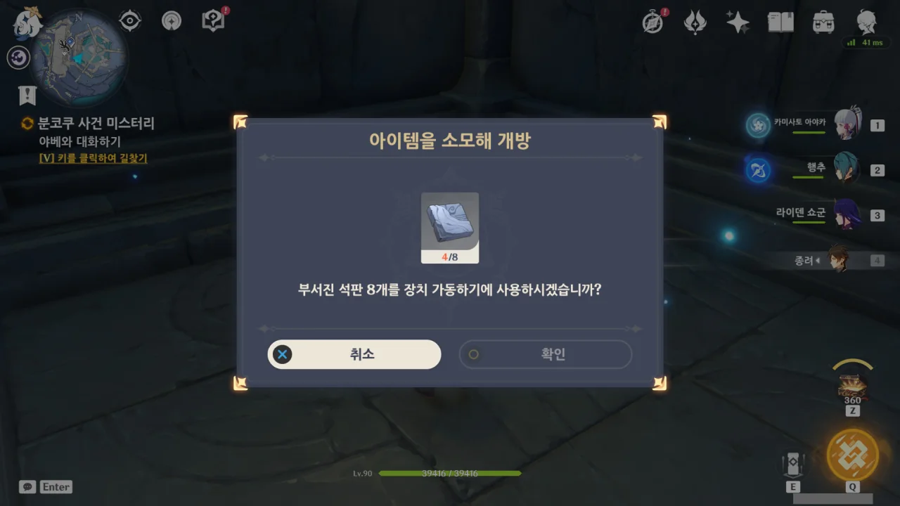

그런데 왜 나한테 석판이 4개가 있는 거지? 분명 3개만 먹었던 것 같은데...



야베에게 '왜 이런 정보를 진작 알려주지 않았느냐?'라고 묻자, 진짜인지 아닌지도 모르는, 불확실하고 위험한 정보를 함부로 알려줄 수 없었다'라고 말한다.

사려 깊은 녀석이었구나, 너.

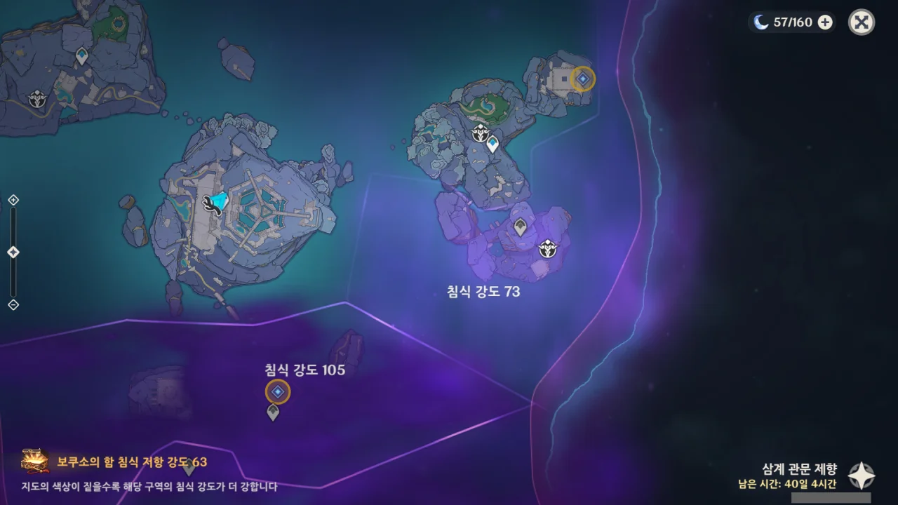

지도를 열자마자 나는 '응! 다음에 하자!'라고 생각했다.

아니, 지금 보쿠소의 함 침식 저항 강도가 63밖에 안 되는데 다음 지역의 침식 강도가 105인 건 좀 너무하지 않냐?

거길 지금 갔다간 함의 에너지가 순식간에 바닥날 것이다.

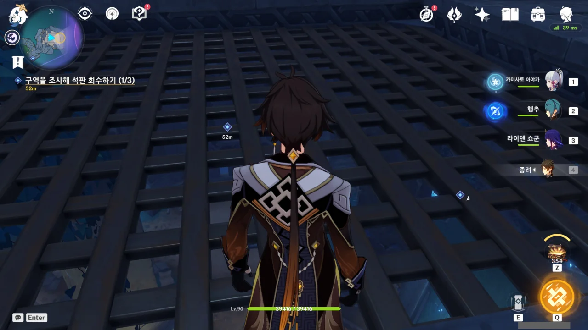

일단 갈 수 있는 곳 먼저 가기로 했다.

임무 마커의 위치로 미루어봤을 때, 석판은 이 밑에 있는 것 같다.

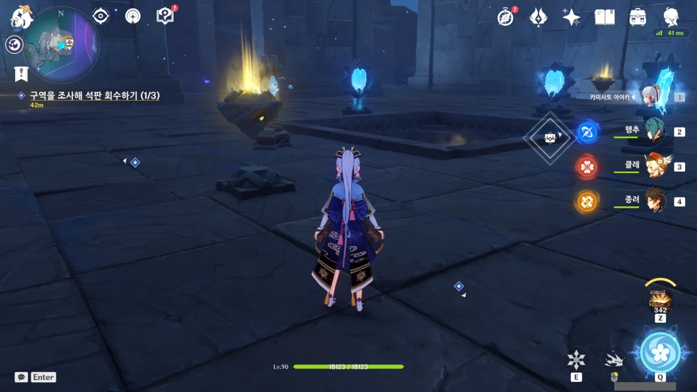

문이 왜 안 열리나 했는데, 철창을 여는 스위치를 누르지 않아서였다.

분명 저번에 왔을 땐 그런 스위치를 못 본 거 같은데 말이다.

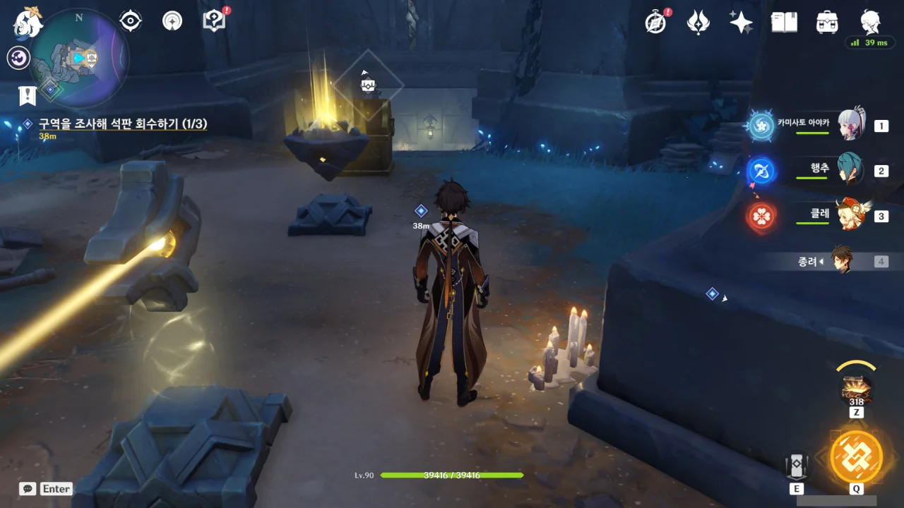

이후 밑에 있는 장치도 활성화해 석판 두 개를 모두 먹었다.

&nbsp;

현재까지 할 수 있는 석판 모으기는 여기까지이다. 나머지는 아래 구역으로 갈 수 있을 때 모으기로 했다.

그런데 다음 임무가 저 밑에 있네. 심지어 저곳의 침식 강도는 118이나 된다.

&nbsp;

이런 식으로 질질 끄는 건 별로 안 좋아하는데...
