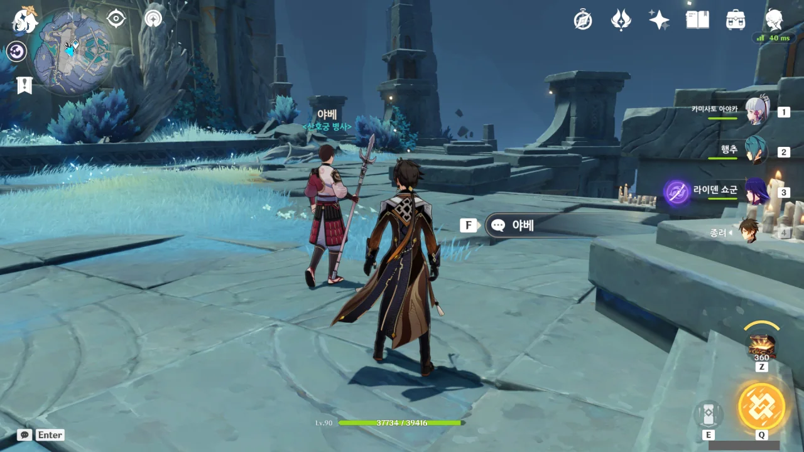

야베, 너 돌아다닐 줄 알고 있었구나!

난 지금까지 야베가 워프 포인트 옆에 가만히 서 있기만 한 NPC인 줄로만 알았다.

경비병이 다 그렇지 않은가.

현재 보쿠소의 함 레벨은 10이다. 이제 레벨을 하나 올릴 때 필요한 인장의 개수가 120개로 늘어 인장을 모으기가 힘들어졌다.

&nbsp;

그래서 일단 필드를 돌아다니며 보이는 도전이란 도전은 전부 도전하고, 몹이란 몹은 다 잡고, 상자란 상자는 다 열고 있다.

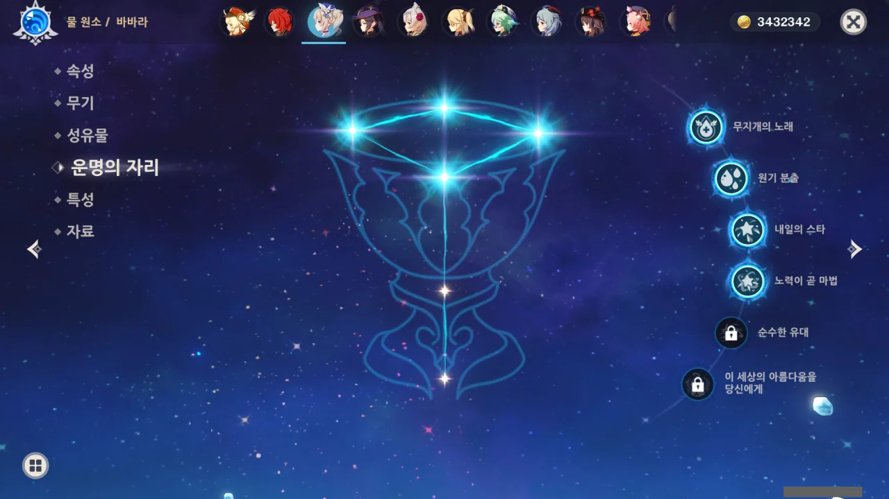

야예 미코를 뽑기 위해 단차를 계속 돌리는 중이다. 하지만 나오라는 야에 미코 대신 바바라가 나왔다.

바바라가 4돌이 되었다.

&nbsp;

현재 보유 중인 캐릭터 중 다른 파티원을 부활시킬 수 있는 건 바바라밖에 없다. 바바라를 6돌로 만들면 궁을 쓸 때마다 파티원이 부활한다.

이걸 다인 모드에 들고 가면 얼마나 멋지겠는가! 위기의 상황에서 궁을 한 번 써주니 파티원들이 전부 부활하는 거지...



안개가 걷힌 곳에서 할 수 있는 활동은 다 한 것 같다. 이제 상자도 안 보이고 도전도 안 보인다.

별수 있나. 아래로 가야지...

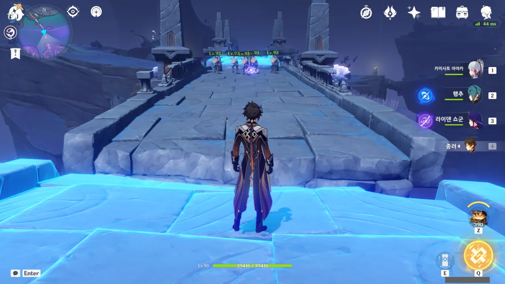

뭐야, '티바트 보이즈'가 아니라 '켄리아 보이즈'였어? 왜 츄츄족이 칼군무를 추고 있는 거야? ㅋㅋㅋ

츄츄족을 보자마자 뿜은 건 이번이 처음인 것 같다.



물론 저들은 종려의 E Q 콤보에 가루가 되어 사라졌다. 내 눈은 소중하거든.

이제야 깨달은 건데, 워프 포인트를 해금하는 데에는 저 재료들이 항상 5개만 필요한 게 아닐까?

난 지금껏 워프 포인트를 해금할수록 요구되는 재료의 양이 많아질 것으로 생각하고 있었는데, 지금 보니 필요한 재료의 양이 고정인 것 같다.

그러면 지금까지 저 재료들을 미친 듯이 모을 필요가 없었던 것 아냐?

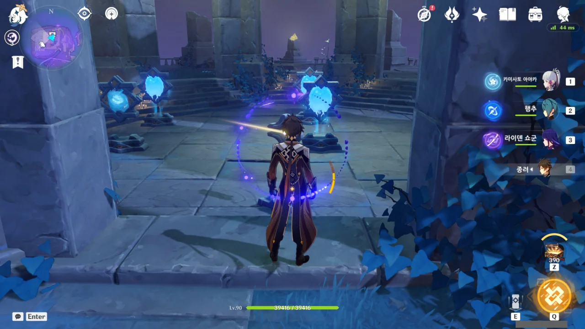

이벤트 지역이 아닌 연하궁에서 이곳은 마치 다이얼식 전화기를 생각나게 하는 곳이었다.

문양에 달려 들어가면 다시 가운데로 이동하고, 다시 거기서 다른 문양으로 달려 들어가면 또다시 가운데로 이동하는, 비밀번호를 입력하는 인상을 주는 퍼즐이었거든.



이젠 저 다이얼식 전화기를 어떻게 쓰는지 아는 사람도 없겠지... 내가 어릴 적에도 이미 다이얼식 전화기는 구세대 유물 취급을 받았으니, 지금에는 오죽할까.

지금 다이얼식 전화기가 남긴 유산이라고는 전화 아이콘밖에 없을 것이다. 버튼식 전화기는 수화기가 전화 아이콘에 나온 것처럼 크지 않거든.

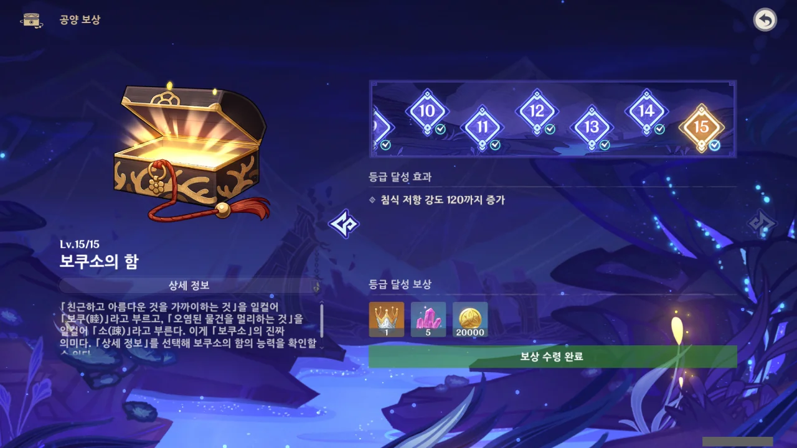

아래쪽에서 미친 듯이 도전과 학살을 반복하다 보니, 보쿠소의 함 레벨을 만렙으로 만들어버렸다.

별생각 없이 '아, 슬슬 함 레벨을 올려줘야 앞으로 다니기 편할 것 같은데'라고 생각하고 보쿠소의 함을 레벨업하려 석상에 갔더니 만렙을 찍어버렸다.

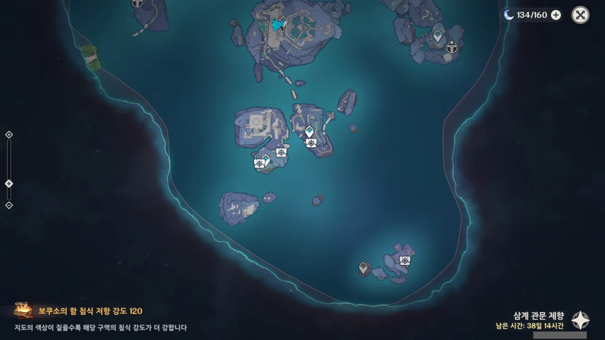

보쿠소의 함을 만렙으로 만드니, 필드에 있는 남은 상자와 도전의 위치가 맵에 나타난다.

이미 위쪽은 내가 진작에 상자와 도전을 전부 쓸어버린 탓에 아무것도 나타나지 않는다.

&nbsp;

금사과 제도에서 미처 다 하지 못한 도전과 다 먹지 못한 상자를 생각하고 열심히 돈 것뿐인데, 위쪽의 상자와 도전이 전멸해 버렸다고?

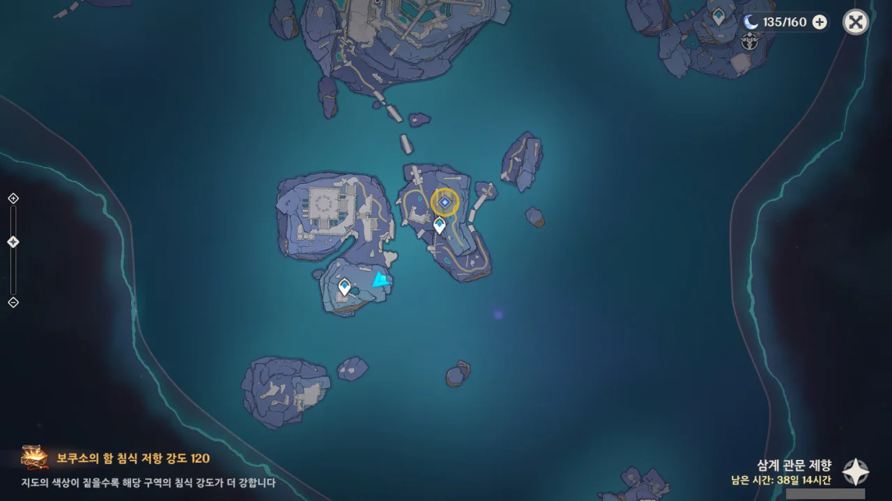

일단 모든 지역을 침식 걱정 없이 다닐 수 있게 되었으니, 못다 한 석판 임무를 마저 하기로 했다.

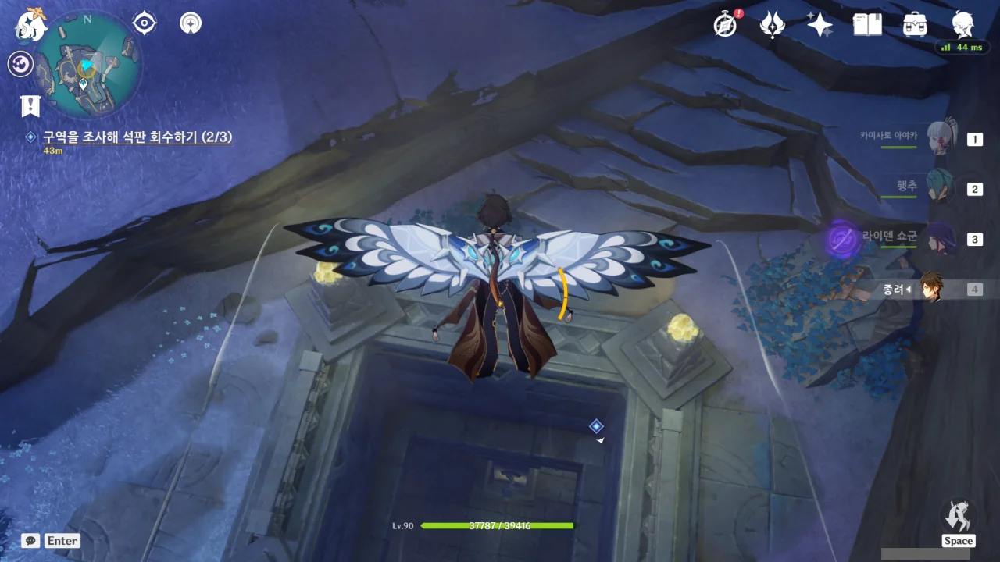

나머지 석판들은 전부 여기에 있다.

처음 위를 날아다닐 때는 석판이 어디에 있는 것인지 감조차 잡지 못했는데, 지도가 안내하는 대로 내려가 보니 거기가 어디인지 알겠더라.

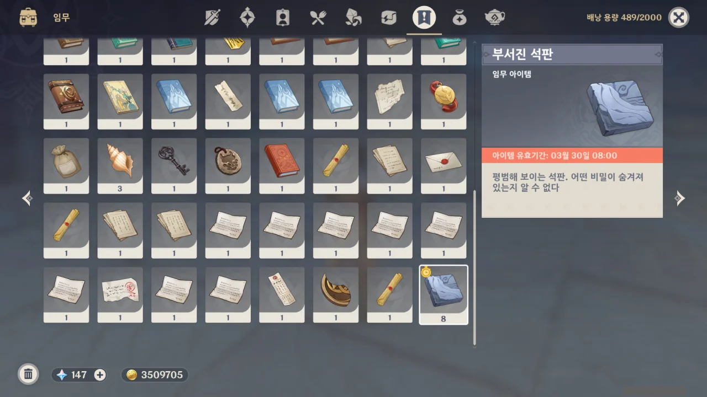

8개의 석판을 모두 모았다. 그런데 왜 페이몬이 왜 자꾸 석판을 7개라고 잘못 말하는 거지?

3x3 퍼즐이니까 8개 모아야 하는 거 아냐? 내가 뭘 놓치고 있는 건가?



그래, 3x3 퍼즐일 것 같더라. 내가 제일 싫어하는 퍼즐.

&nbsp;

라스트 오리진에서 게임 업데이트를 할 때 기다리는 동안 해보라며 3x3 퍼즐을 할 수 있게 해주는데, 난 그 퍼즐을 단 한 번도 완료해 본 적이 없다. 내게는 너무 어렵거든!

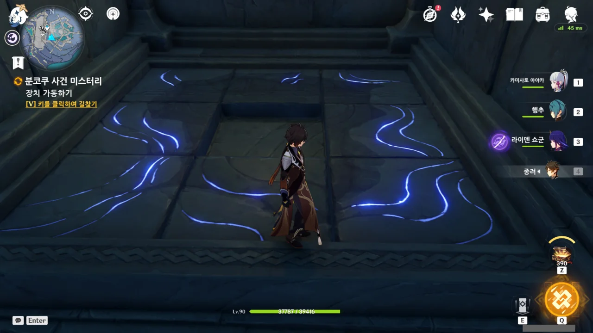

그런데 이리저리 생각 없이 판을 옮기다 보니 퍼즐을 풀었다.

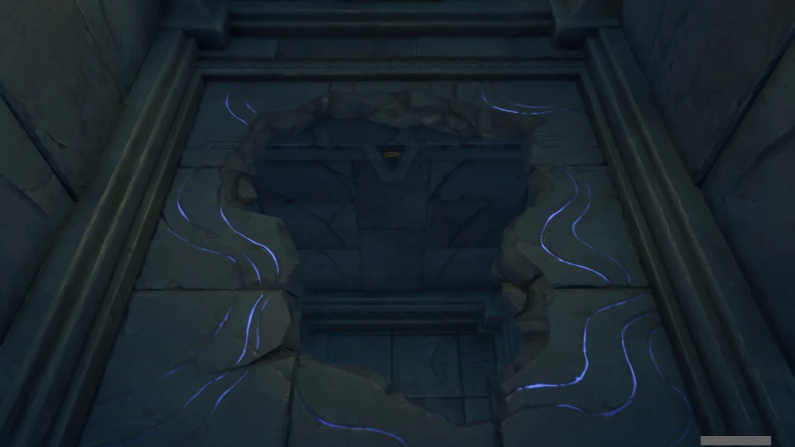

석판에 그려진 검은 무늬대로 구멍이 뚫렸다.

연하궁에도 원래 이런 구멍이 있었나?



지금 보니, 저 밑의 공간은 연하궁에서도 한 번 가본 곳이었다.



구석에 있는 석판을 먹으니 '고아나기'라는 유령이 나타났다.

이 밀실의 보물을 노리고 온 도굴꾼인 것 같은데, 나보고 다짜고짜 썩 꺼지라고 하더라.

친구와 함께 이곳에 온 것 같은데... 내가 먹을 보물은 남아있겠지?

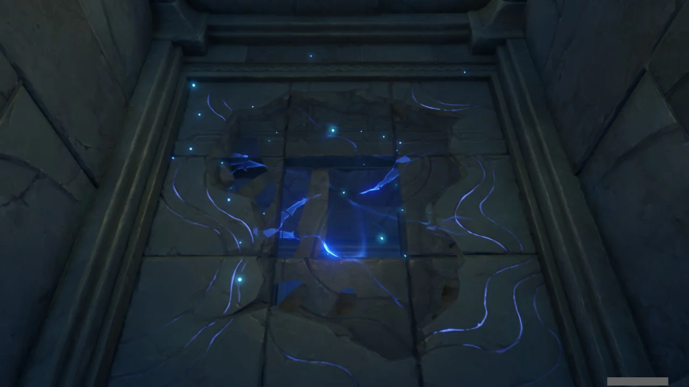

새로 얻은 석판을 나머지 빈칸에 꽂아 넣기 위해선 다시 뚫린 구멍을 메워야 한다.

그런데 그게 되네? 왜 되는 거지?



나머지 빈칸에 마지막 석판을 꽂아 넣는다.

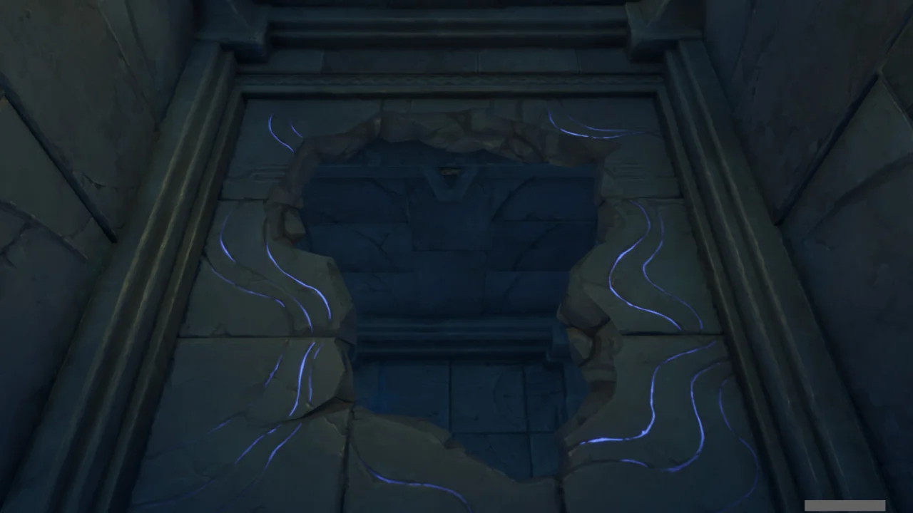

응? 아까랑 대체 뭐가 다른 거야?

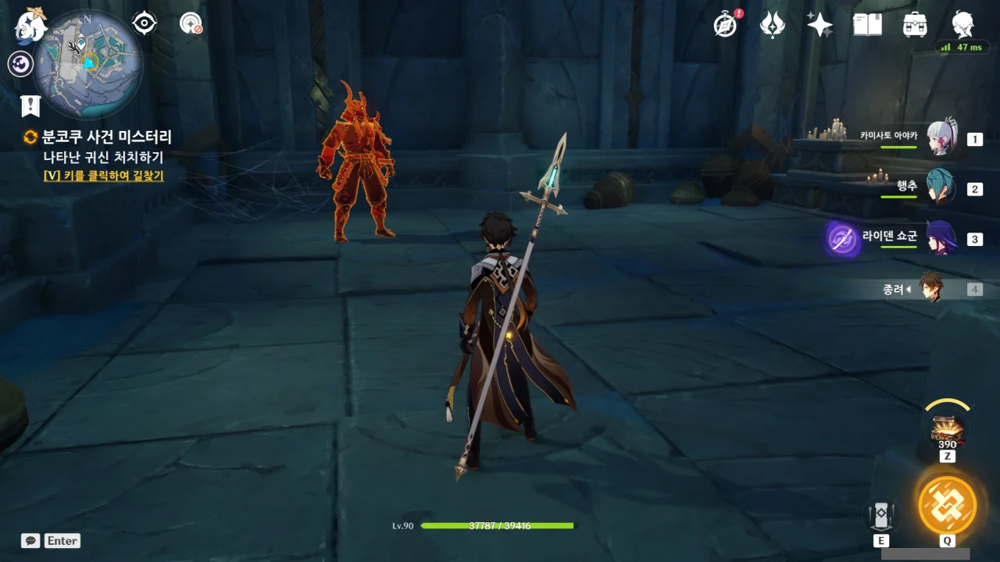

아, 밑에 귀신이 나타났다. 그래봤자 귀신을 자처하는 해란귀일 뿐이지만.

아, 해란귀는 원래 귀신이 맞나?

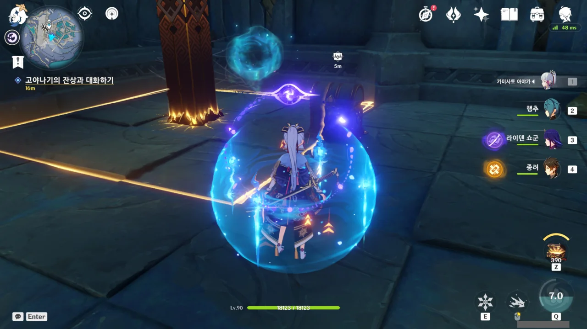

해란귀를 처치하자, 보쿠소의 함을 업그레이드할 수 있는 마지막 부품을 주는 상자가 나왔다.

그러니까 이 석판 임무는 보너스 임무가 아니라 이벤트의 주 임무였다는 거네.

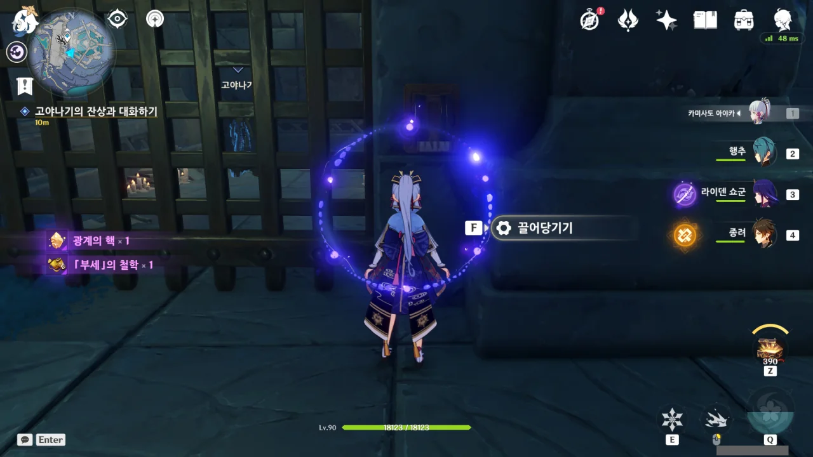

밑에는 감옥이 있고, 그 안에는 아까 만났던 고아나기가 있다.

너, 대체 거기서 뭐 하냐?





계속 뭔가를 중얼거리는 고아나기.

고아나기를 믿고 분코쿠 밀실에 초대한 친구를 고아나기가 보물에 혹해 친구를 살해하고 '내가 원래 그런 사람이 아닌데'라며 중얼거리는 중이다.

&nbsp;

하지만 내가 볼 때, 분코쿠의 원령 같은 건 애당초 없던 것이다. 그저 고아나기의 사람됨이 거기까지였고, 그래서 친구를 살해한 것이겠지.

이미 유령이지만, 영원토록 그 감옥에서 썩기를.





야베가 동행하지 않은 이유는 자신이 원혼에 씌어 여행자를 공격할까 봐 가 아니라, 원혼에 씐 여행자가 자신을 공격할까 바였다.

뭐, 여행자가 야베보다 강하니 그걸 걱정하는 게 맞긴 한 데... 너무 얌체 같잖아 ㅋㅋㅋ...

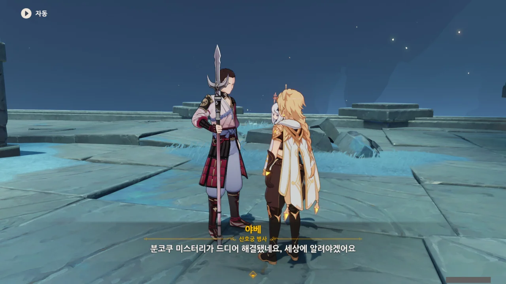

아무튼, 분코쿠의 미스터리는 여기서 끝이 난다. 나는 보물을 얻어서 좋고, 야베는 미스터리를 해결해서 좋다.

잘됐네, 잘됐어.

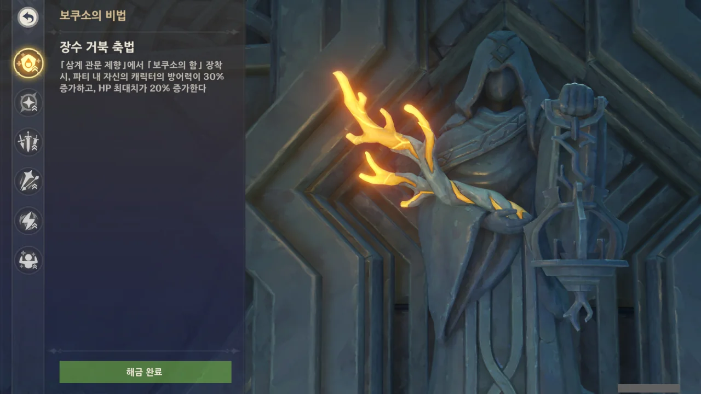

보쿠소의 비법 역시 모두 업그레이드했다.

이제 이 석상은 보쿠소의 함을 충전할 때 빼고는 볼 일이 없겠지.
