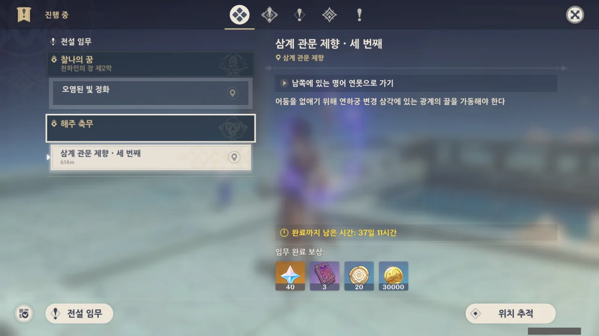
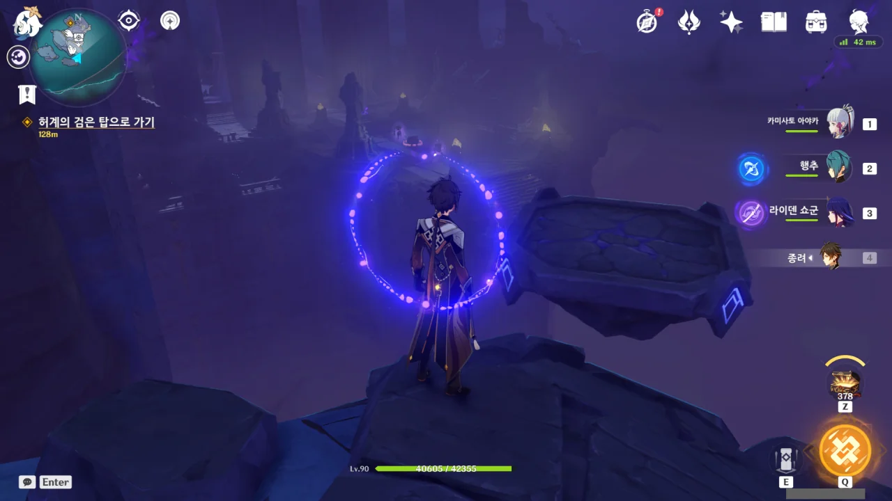
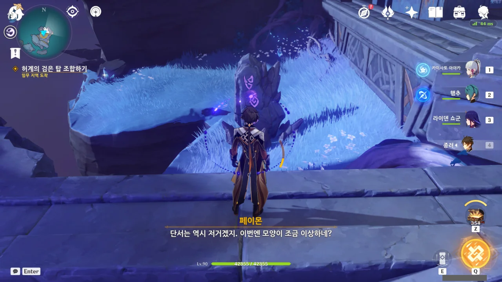
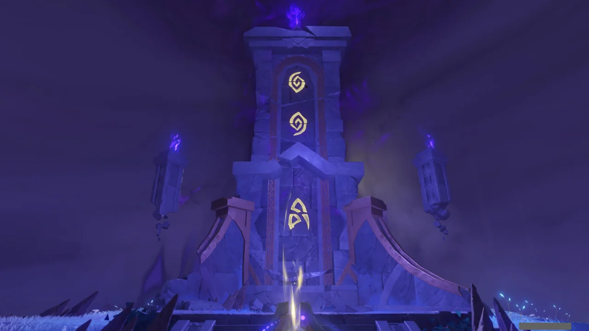
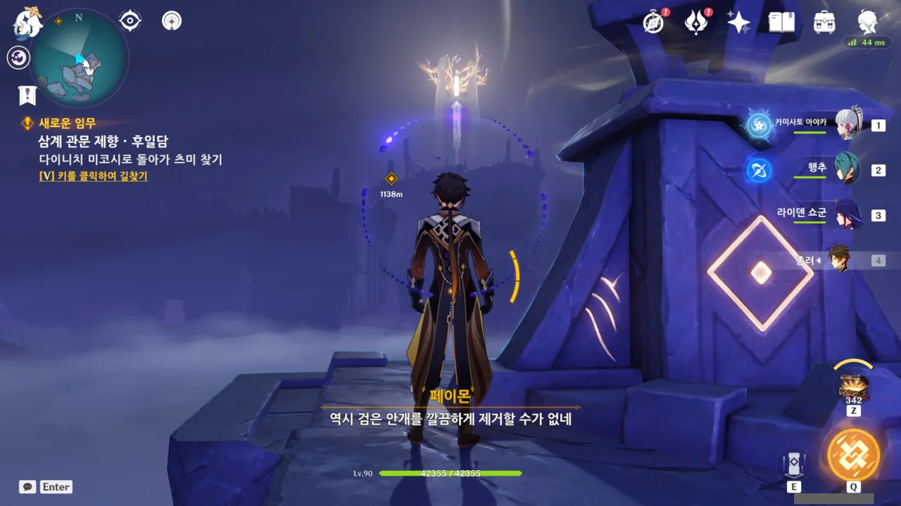
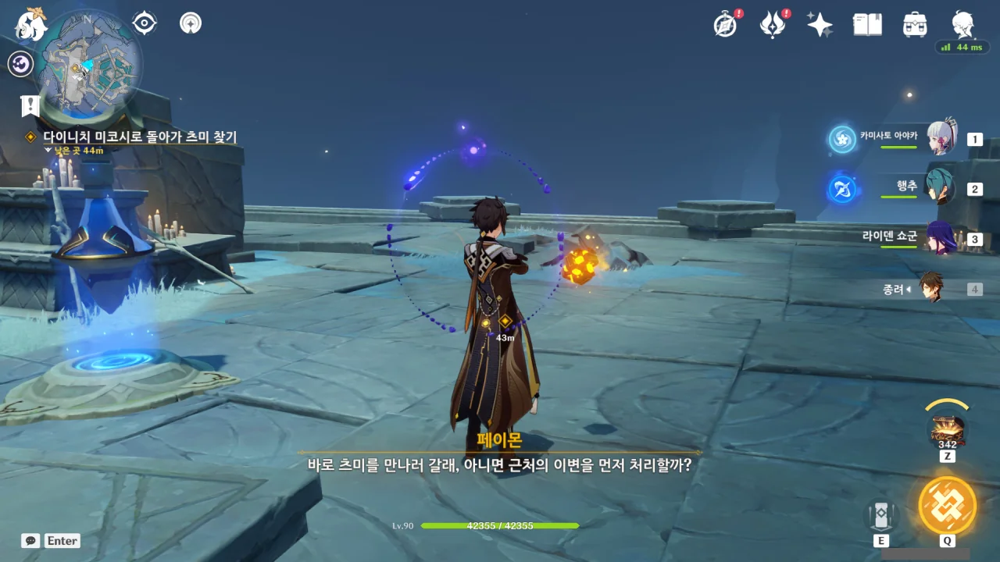
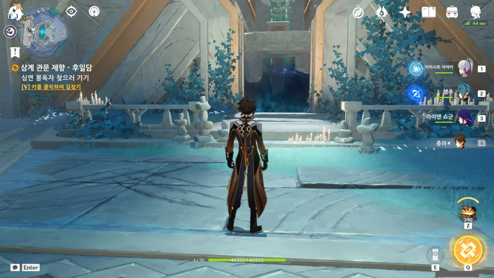
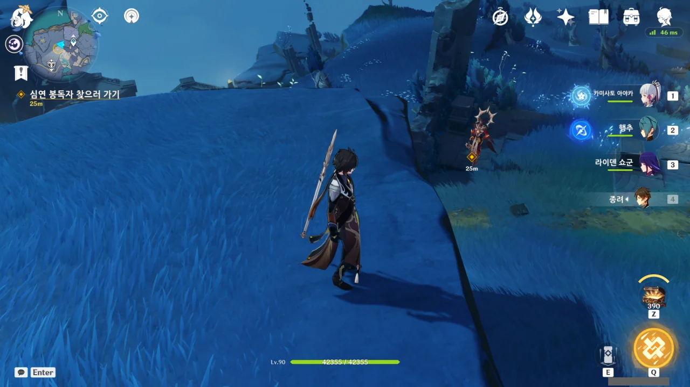
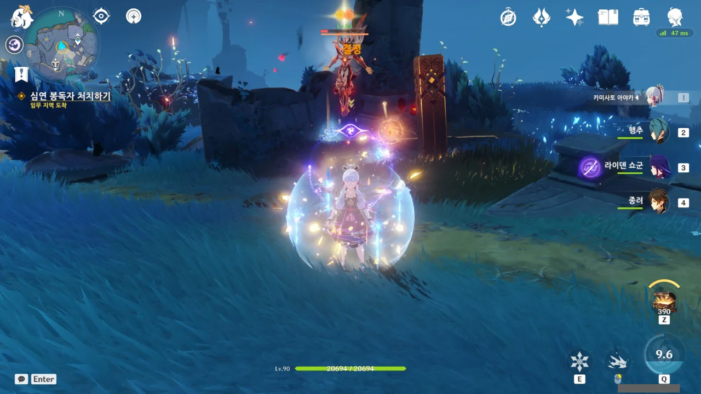
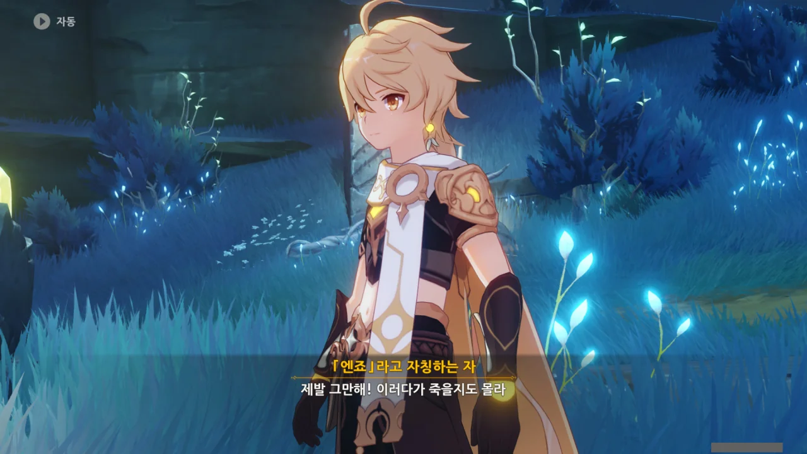

좋아, 분코쿠인지 뭔지도 해결했으니, 삼계 관문 제향을 끝마칠 시간이다.



저번에 했던 것처럼, 이번에도 거품을 타고 포탈을 통해 섬에 도착한다.

이번엔 탑이 곧바로 보이지 않는다.

난 이 리프트인지 발판인지 모를 이것이 정말 별로다. 하지만 별수없이 이걸 타야 한다.

동그란 문양이 흡사 69 모양으로 되어 있는데, 이게 가능한 조합인가?

왜 페이몬은 "날아서 확인해보자"라고 말하는 거지?

알고보니 비석의 문양이 거꾸로 그려진 것이었다. 비석을 거꾸로 보니 탑의 문양이 나온다.

세 곳의 탑을 가동했음에도 검은 안개가 말끔히 제거되지 않았다고 한다.

솔직히 내가 보기에는 거기서 다 거기인 것 같긴 한데...

마치 선택지가 있다는 것처럼 페이몬이 말하지만, 왼쪽의 임무 목표를 보라. 츠미를 만나러 가는 것 밖에는 다른 선택지가 없다.





연하궁이 어느정도 원래대로 회복되자, 연하궁에 고립되어 있던 부상자들과 산호궁 병사들은 와타츠미 섬으로 철수했다고 한다. 다행이네.

그런데 무슨 예상치 못한 일이 벌어졌길래?









저번에 연하궁에 왔을 때 우릴 속여먹은 엔죠가 이번에도 무슨 흉계를 꾸미고 있는 것 같다.

> 걱정하지 마세요. 원래 맞는 걸 좋아하는 녀석이에요.

ㅋㅋㅋㅋㅋㅋㅋㅋㅋㅋㅋㅋㅋㅋㅋㅋㅋㅋㅋㅋㅋㅋ

그러고보면 처음 만났을 때에도 '정 의심되면 날 때려보던가'라고 하던 녀석이니, 맞는 걸 좋아하는 녀석은 분명 맞을 것이다.

그러니까 이번에 좀 세게 때려도 불만은 없겠지, 엔죠?

> 심연 봉독자 찾으러 가기
{.bq}

그냥 대놓고 엔죠라고 이야기하고 있다.

평안한가.





> 몸 푸는 셈 치고 어울려주지 (흠씬 얻어맞으며)

오랜만에 만난 엔죠는 변성기라도 온 것인지, 목소리가 많이 굵어져 있었다.

엔죠, 사춘기였구나... 그래서 반항심에 여행자도 속여먹고... 많이 컸다, 그치?

사춘기의 비대해진 자아는 사뿐히 밟아주면 된다.

아니, 너 이미 두 번이나 죽었어. 저번에 만났을 때 한 번 죽었고, 이번에 한 번 더 죽었네.



엔죠는 츠미를 이미 알고 있는 것 같다. 둘 사이에 대체 무슨 일이 있었던 거지?





엔죠가 말하는 바에 따르면, 심해 용 도마뱀이 진화하면 인간처럼 변할 수 있다고 한다. 그걸 '용 도마뱀 인간'이라고 부른다고.



전설에 따르면, 인간에게 패배한 심해 용 도마뱀은 승자의 모습을 모방하는 방향으로 진화했고, 그것이 '용 도마뱀 인간'이라고 한다. 용 도마뱀 인간은 동공을 제외하면 인간과 다를 바가 없다고 한다.

그리고 용 도마뱀 인간은 연하궁에 스며들어 인간의 자리를 대체했다고 한다.



츠미의 동공이 세로였다는 목격담이 있긴 했지. 엔죠는 그게 츠미가 용 도마뱀 인간이라는 증거라고 주장한다.

그게 무슨 상관인데?

&nbsp;

물론 여행자가 심해 용 도마뱀을 죽이고 붉은 산호를 가져간 건 맞지만, 츠미는 아직 직접적으로 여행자를 배신하지는 않았는걸. 오히려 도움을 줬으면 줬지.







뭐지? 완전 적반하장인데?

심해 용 도마뱀이 다이니치 미코시에 수감된 동족을 구할 수 있도록 심연 교단이 심해 용 도마뱀의 영지에 통행할 수 있도록 허가했다.

하지만 심연 교단이 퍼트린 심연의 검은 안개는 심해 용 도마뱀에게 치명적인 독이었다. 심연 교단은 그걸 알면서도 교단의 체면을 위해 이를 심해 용 도마뱀에게 숨겼다.

먼저 상대를 속여놓고 적반하장의 태도라니, 역시 심연 교단은 상종해서는 안될 무리이다.



아무리 생각해도 일단 엔죠를 흠씬 두들겨 패는게 더 급한 일일 것 같은데.

핏빛 산호는 나중에 와타츠미 섬이 알아서 하겠지.



자신이 남긴 장치를 이용해 빛을 인도해 다이니치 미코시의 어둠을 몰아내라는 엔죠.



분하지만 사실이다.



엔죠는 심연 교단 내에서도 별종 취급인가 보다.

'전하'를 에워싸고 시키는 일만 하는 다른 녀석들과는 다르게 '아무 상관 없는 일'에 집착한다고.

&nbsp;

엔죠가 말하는 '전하'는 분명 여행자의 동생을 말하는 거겠지.

아아, 동생이 나쁜 녀석들과 어울리더니 나쁜 물이 들었어요...





여행자에게 다이니치 미코시에서 얻었다는 두 번째 조각을 던져준 후, 엔죠는 여행자가 거기에 정신이 팔린 틈을 타 또다시 도망쳤다.
