

다시 돌아와 보니 츠미가 사라졌다.

어차피 와타츠미 병사들은 이미 다 철수했고, 심해 용 도마뱀은 알아서 잘 살아갈 테니, 크게 걱정할 사안은 아닌 것 같다.

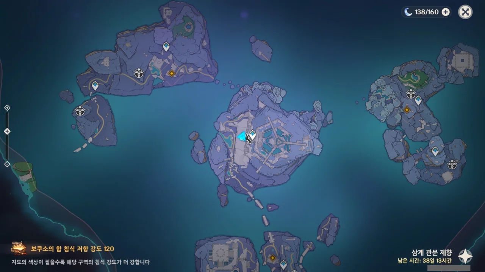

저 세 곳이 엔죠가 말한 빛 인도 장치인가 보네.

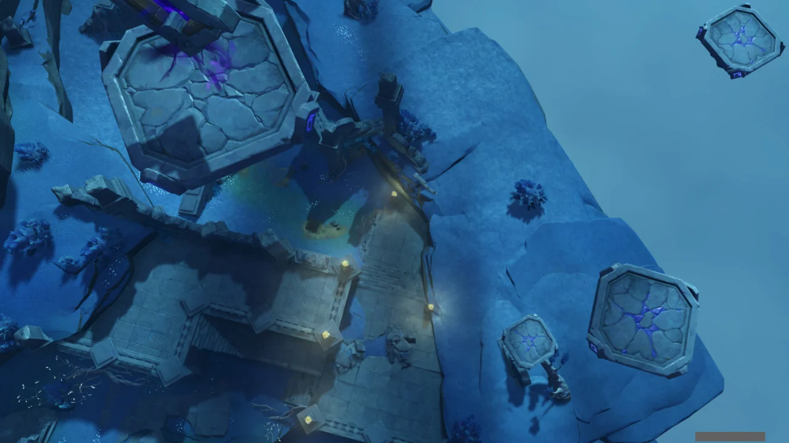

네? 저 발판들을 타고 가라고요?

심지어 저걸 밟고 가다가 거의 다 온 시점에서 발판 사이의 틈에 빠지는 바람에 발판 밟기를 한 번 더 해야 했다.

망할, 난 분명 점프 키를 눌렀다고!

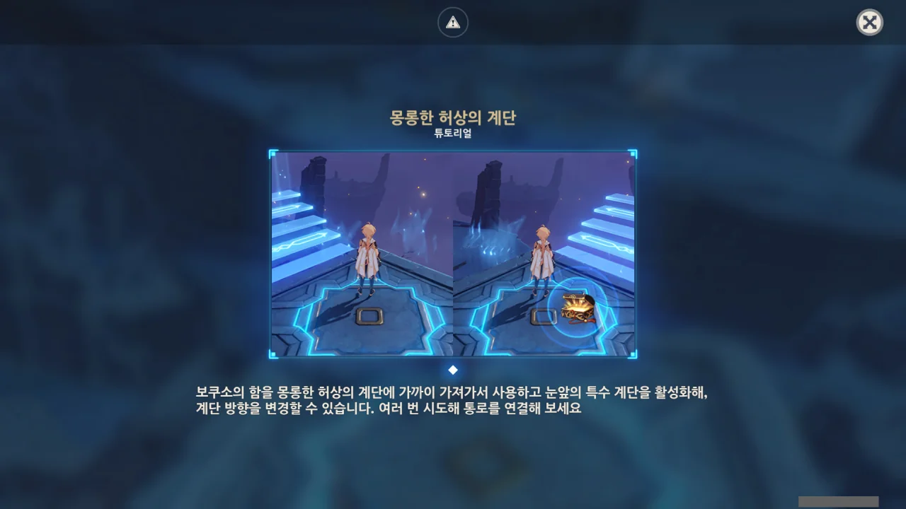

호그와트의 계단처럼 계단의 방향을 바꿀 수 있는 장치이다.



빛 인도 장치에 대고 보쿠소의 함을 사용하니, 뭔가 밝게 빛나면서 정렬이 된다.

이걸 두 번 더 하라는 거지?

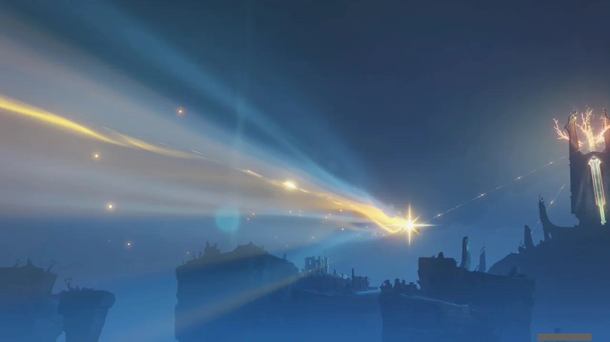

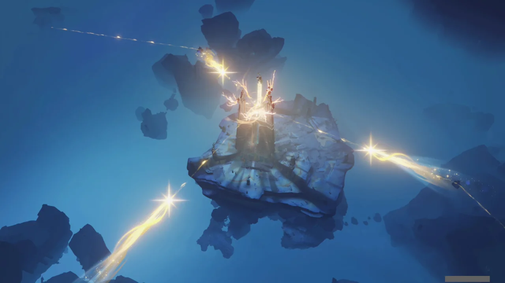

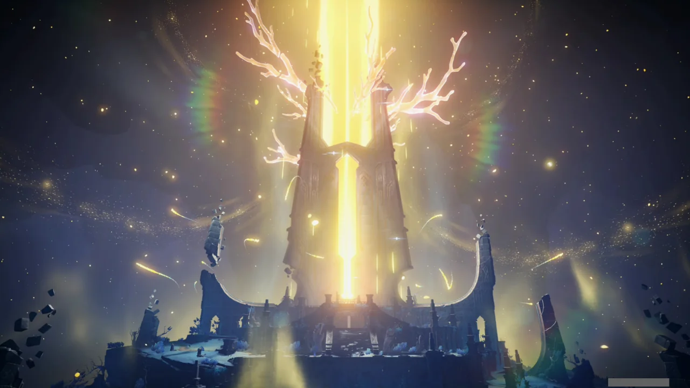

와, 개쩐다.

연하궁 외곽에 있는 세 섬에서 뿜어져 나온 빛이 빛 인도 장치를 통해 다이니치 미코시로 향하는 장면이다.

&nbsp;

볼 때는 입이 쩍 벌어지는데, 막상 끝나고 곰곰이 생각해 보니, 이런 기믹의 전개는 분명 이번 이벤트에서 퍼즐의 형태로 본 적이 있다.

어, 그러면 만약 빛 인도 장치를 얼리면 세 섬에서 나온 빛이 빛 인도 장치에 반사되는 걸까?





그래, 엔죠가 거짓말은 절대 안 했지.

그래서 죄질이 더 나쁘다.



아래로 내려가니 심해 용 도마뱀 보스 둘이 날 반가이 반겨준다.

한 놈을 죽이면 다른 놈이 죽은 놈을 자꾸만 살리는 통에, 두 놈의 체력을 엇비슷하게 깎아놓고 라이덴 궁으로 양쪽 모두 단번에 죽여버리는 전략을 써야만 했다.





엔죠 말대로, 심해 용 도마뱀의 별동대가 이곳에 와 어린 용 도마뱀을 이미 구출해 간 모양이다.

그 후 정예 둘이 남아 시간을 벌기 위해 여행자를 상대한 것이겠지.



위로 올라가자, 츠미가 보인다.

어린 용 도마뱀 구출 작전이 성공했냐부터 먼저 묻는 츠미.



정말로 용 도마뱀이냐 묻는 말에 대답하지 않고, 인간과 심해 용 도마뱀은 서로 대립할 수밖에 없다고만 답하는 츠미.



마지막으로 떠나기 전, 다이니치 미코시를 파괴하고 떠날 것이라고 하는 츠미.



여행자조차 특별한 장치를 통해서만 조작해야 하는 다이니치 미코시를 츠미는 그저 소망하는 것만으로도 조작할 수 있다고 한다.

그걸 이용해 츠미는 심해 용 도마뱀에게 고통을 안겨준 다이니치 미코시를 무너트릴 생각이다.





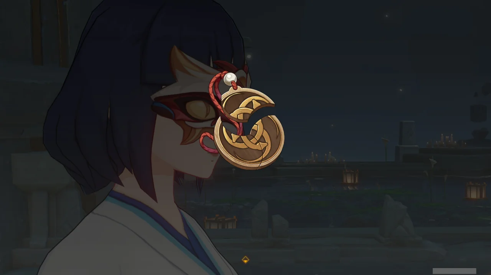

코코미와 엔죠에게서 받은 조각을 츠미에게 건네준다.

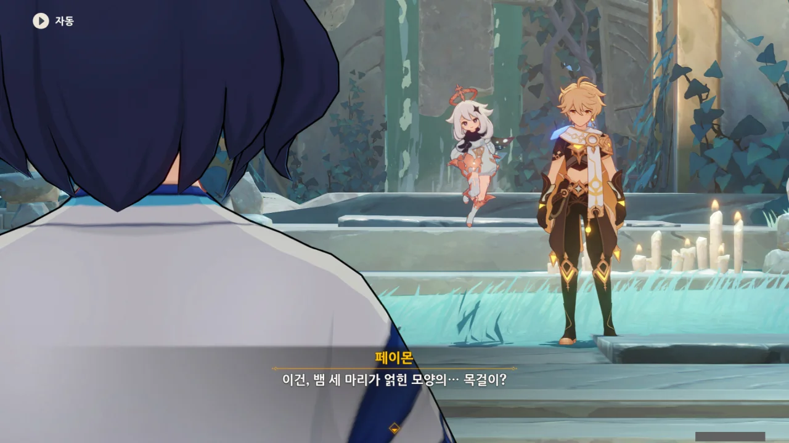

완성된 목걸이에는 뱀 세 마리가 서로 얽혀있는 문양이 그려져 있었다.

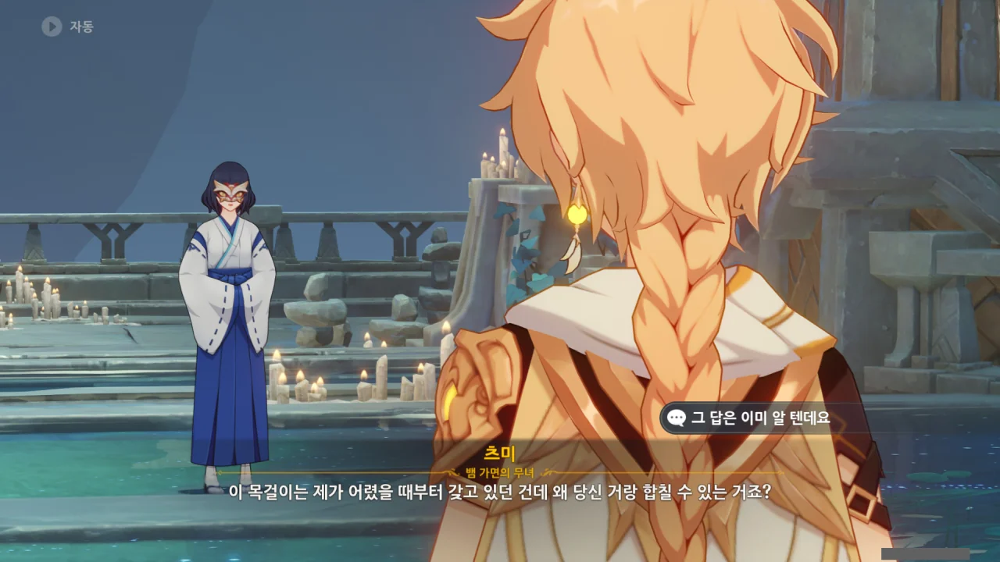

그 목걸이를 왜 츠미가 어렸을 때부터 갖고 있었겠는가?



그건 바로 츠미가 심해 용 도마뱀이 아니라, 인간이기 때문이다.

&nbsp;

목걸이 조각은 산호궁 사람인 코코미가 하나 갖고 있었고, 다이니치 미코시에 하나가 있었다. 나머지 하나는 츠미가 갖고 있었고.

만약 츠미의 태생 자체가 심해 용 도마뱀과 관련되었다면, 인간과 관련된 물품을 갖고 있을 이유가 없다.



츠미는 어렸을 때부터 심해 용 도마뱀과 함께 살았다고 한다. 인간의 글과 말을 알게 된 건 주변에 있던 서책 몇 상자로부터 안 것이 전부였다.

그래서 츠미가 우릴 처음 만났을 때 대뜸 "인간이 맞나요?"라거나 "인간의 새끼인가요?"라고 물었던 것이다. 정말 몰랐으니까.

&nbsp;

그리고 얼마 지나지 않아, 연하궁에 있던 사람들이 전부 와타츠미 섬으로 올라가 연하궁이 비게 되었다.

이후 사람의 발길이 끊긴 연하궁에 최근이 돼서야 다시 사람이 들어오기 시작했다.



다이니치 미코시를 파괴하려던 츠미는 돌연 마음을 접고 "인간은 태어난 곳에 속하고, 짐승은 먹이가 있는 곳에 속한다."라는 말을 남긴 채 떠나버린다.

&nbsp;

내가 볼 때, 츠미는 여전히 사람이 맞다. 짐승은 자신의 거처를 결정할 때 그런 거창한 이유를 두지 않거든.

츠미는 그저 용 도마뱀과 함께 있기를 선택한 사람일 뿐이다.



아직 모르는 것이 많지만, 코코미라면 뭔가 알고 있을지도 모른다.





소식 참 빠르기도 해라.

그래도 산호궁 병사들이 철수한 이후 생긴 일에 대해선 모르는 것 같다. 당연한 일이겠지만.



코코미가 준 물건을 츠미에게 줬다고 하자, 이제 와타츠미에 필요 없는 물건이라며 괜찮다고 한다.



그 목걸이는 와타츠미 신이 연하궁의 조정을 갈아엎을 당시 남긴 물건이라고 한다.

세 조각은 각각 '다이니치 미코시', '산호궁 후예', '와타츠미 어사'를 상징한다고 한다.

하지만 '산호궁 후예'를 제외한 두 계보가 쇠퇴한 이상, 더 이상의 의미가 없다고 한다.





츠미가 도마뱀 인간처럼 세로 동공을 갖고 있었다고 페이몬이 말하자, 원래 와타츠미 어사는 뱀신의 권속임을 상징하기 위해 반인 반사의 모습을 하고 있다가 후대에 가서 동공을 제외하면 보통 사람과 별반 다르지 않게 되었다고 말하는 코코미. 오히려 전설 속 '용 도마뱀 인간'이야말로 소설 속에나 등장하는 허무맹랑한 이야기라고 말한다.

그러니까 츠미는 '용 도마뱀 인간'이 아니라, 사람들이 생각한 대로 와타츠미 어사가 맞다.



마지막 와타츠미 어사는 갓난아기 때 보호자인 무녀와 함께 연하궁 변경에서 용 도마뱀에게 습격당한 후 행방이 묘연해졌다고 한다.

아마 그 이후 용 도마뱀에게 키워진 것이겠지.



이제 인간이 연하궁에서 살지 않으니, 심해 용 도마뱀과 인간 사이의 영토 분쟁도 없게 되었다.

다이니치 미코시가 무너지든 말든, 앞으로의 분쟁 요소는 핏빛 산호를 제외하면 없을 것이다.



그마저도 핏빛 산호의 원리에 대해 들은 코코미가 「성토화」를 막을 다른 방법을 강구하겠다고 했으니 해결된 셈이다.

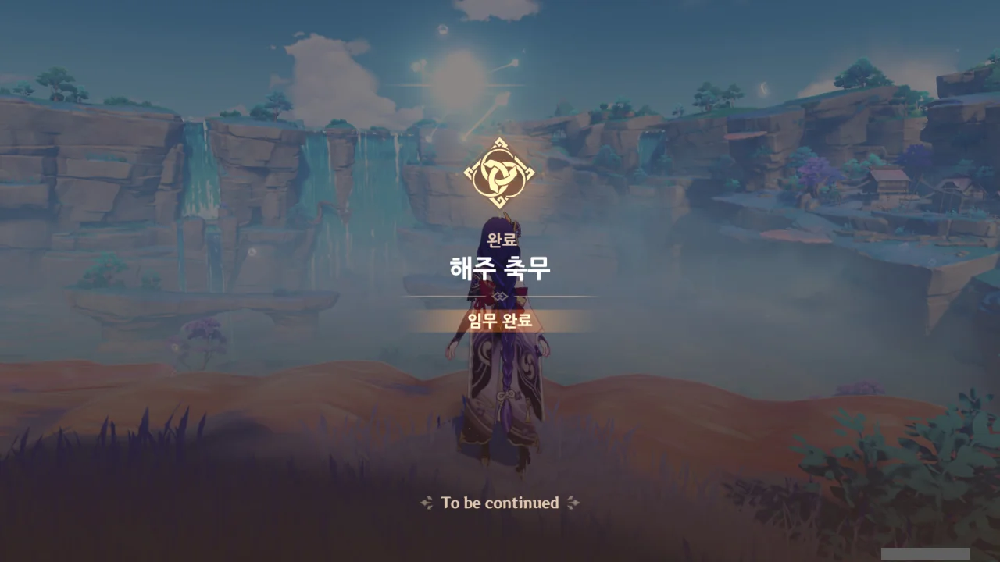

삼계 관문 제향 완료!

***

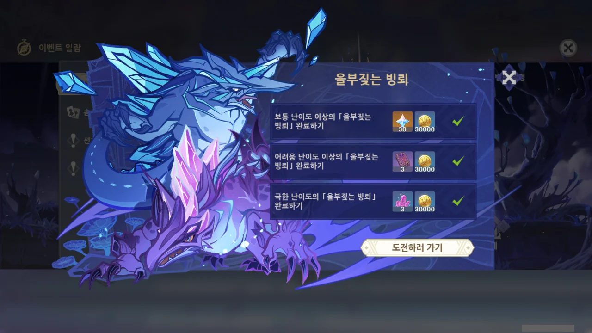

이후 추가적인 도전과제 같은 것으로 '울부짖는 빙뢰'가 있었는데, 없어졌다.

엊그저께, 다인 모드를 하면서 나도 모르게 이걸 깨버렸거든. 퀘스트 창을 분명 처음 보는 것일 텐데, 모든 보상이 해금되어 있더라.
