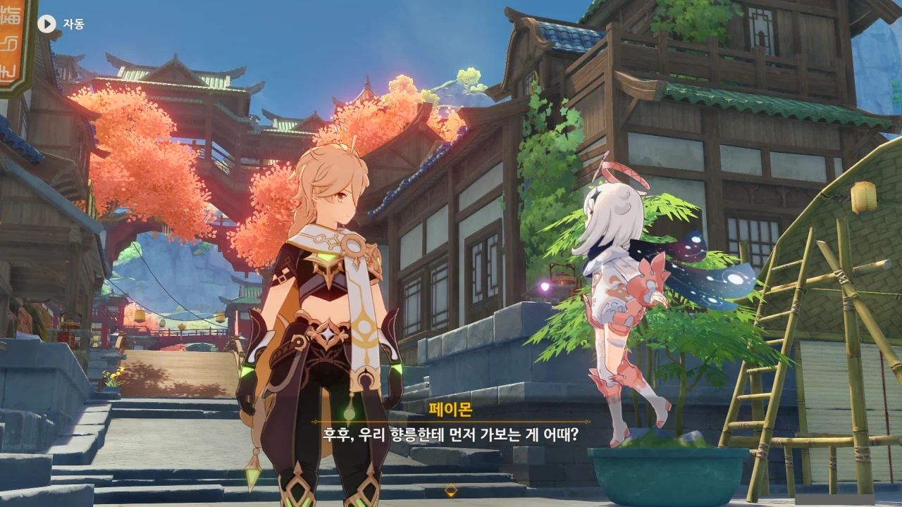
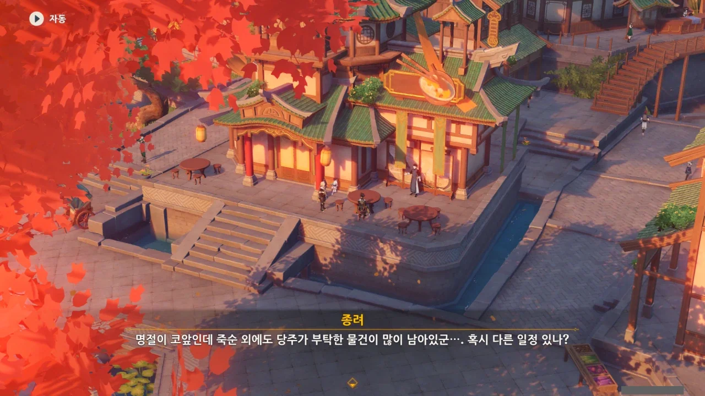
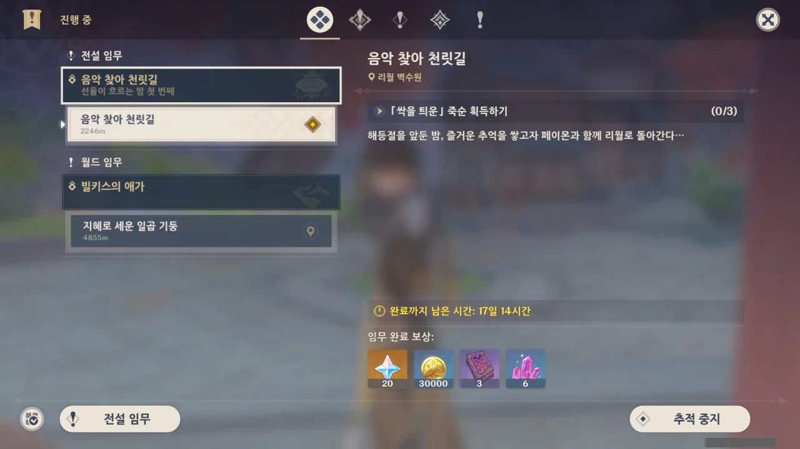

해등절이 돌아왔다.

내 머릿속에는 해등절이 추석과 비슷한 명절이라고 박혀있는데, 다시 곰곰이 생각해 보면, 해등절은 추석이 아니라 설날과 비슷한 명절이다. 정확히 말하면 중국의 춘절.

심지어 해등절 이벤트도 매년 1~2월에 했다는데, 왜 난 자꾸 해등절을 추석과 비슷한 명절이라고 기억하는 걸까?

&nbsp;

그나저나 크롬 맞춤법 검사기가 '천릿길'을 오타라고 말하기에 부산대 맞춤법 검사기로 검사를 다시 해봤는데 '천릿길'은 문제가 없는 단어라고 한다. 이래서 크롬 맞춤법 검사기는 도저히 믿을 수가 없다.

리월에 오랜만에 왔다고 말하고 싶지만, 얼마 전까지만 해도 리월 평판 만렙을 위해서 리월에 박혀있던 때가 있어, 그렇게 말할 수 없다.

향릉... 좋지. 가면 뭘 얻어먹으려나.

종려를 발견했다. 어째 종려는 매번 볼 때마다 여기에 있는 것 같다.



항상 여기에 있는 종려로서는 "그건 내가 할 말인 것 같군"이라고 할 수도 있겠네.

종려는 분명 왕생당의 객경이라고 하던데, 정작 객경 일을 하는 걸 본 적이 없다.

매일 하는 일이라곤 그저 차를 마시며 이야기를 듣는 게 전부인 것 같은데...



갑자기 죽순 이야기를 꺼내는 종려.

'새로 돋아난 죽순'을 이야기하는 걸 보니 종려의 특제 요리가 생각난다.

> 약불로 천천히 끓인 죽순 수프
> ***
> 종려의 특제 요리. 햄은 월해정의 기준을 만족한 최고급 부위를, 고기는 샘물 마을에서 당일 사냥한 삼겹살을, 죽순은 경책산장의 꽉 찬 봄 죽순을 사용한다. 꼼꼼하고 세심하게 약불로 천천히 푹 삶는다... 이렇게 「까다로운」 요리이기 때문에, 그는 이런 맛을 감상할 줄 아는 사람과만 나누고 싶어 한다.
{.bq}

'죽순 수프'의 종려 특제 요리 버전이다.

햄, 삼겹살, 죽순이 들어가, 죽순 수프인지 고기 수프인지 모를 요리가 되었는데, 고기가 들어갔으니 이건 맛이 없을 수가 없다.



> 아하! 알겠다. 종려의 엘레강스 라이프가 또 시작된 거구나?

ㅋㅋㅋㅋㅋㅋ 종려의 엘레강스 라이프라니 ㅋㅋㅋㅋㅋㅋ

생각해 보면 틀린 표현은 아닌데, 이게 왜 이렇게 웃긴 건지 ㅋㅋㅋㅋㅋㅋ

심지어 종려에게 "페이몬은 총명하군. 날 아주 잘 알아."라며 칭찬까지 들었다. 수메르에선 알하이탐에게 줄곧 바보 취급만 당했는데 말이다.

&nbsp;

그나저나 왜 종려의 "날 아주 잘 알아"라는 말이 마치 "날 너무 잘 알아"로 들리는 걸까?

홍염의 성좌에서 헨리 카밀턴이 저런 대사를 하며 투덜대는 게 너무 인상 깊어서 그런 걸까?

어... 설마 이거, 나에게 짬 때리는 건가? 그렇다는 느낌이 강하게 드는데.



별다른 일정이 없다고 하자, 곧바로 '그렇다면'으로 시작해 음식 표현을 맛깔나게 함으로써 짬 때리기에 시동을 거는 종려와 거기에 홀라당 넘어가 눈을 반짝이는 페이몬.

나, 페이몬이 저렇게 눈을 반짝이는 거, 처음 본 거 같아.

종려가 묘사하는 요리는 아무리 봐도 자기 특제 요리인 게 틀림없다.



결국 페이몬은 제대로 종려에게 낚였다. 아마 처음 페이몬을 낚았을 때, 낚시에 걸린 것도 낚싯바늘에 걸린 미끼 때문에 걸린 것일 테다.

아, 그래서 페이몬이 먹을 것에 잘 낚이는 건가?

> 음? 어린순이 맛있는 건 명명백백한 사실일세.

벌써 음란 마귀가 저 대사에 달려드는 장면이 눈에 훤하다.

> 다만 너무 조급하게 움직일 필요는 없어.

응? 조급하게 움직일 필요가 없다니?



아, 그러니까 이번 해등절에서 만날 사람 다 만나고, 하고 싶은 것 다 하고, 그러고 나서 왕생당에 새로 돋아난 죽순을 가져다 달라는 말이었다.

뭐, 그런 거라면야...

이번 해등절이 벌써 세 번째 해등절이던가?
