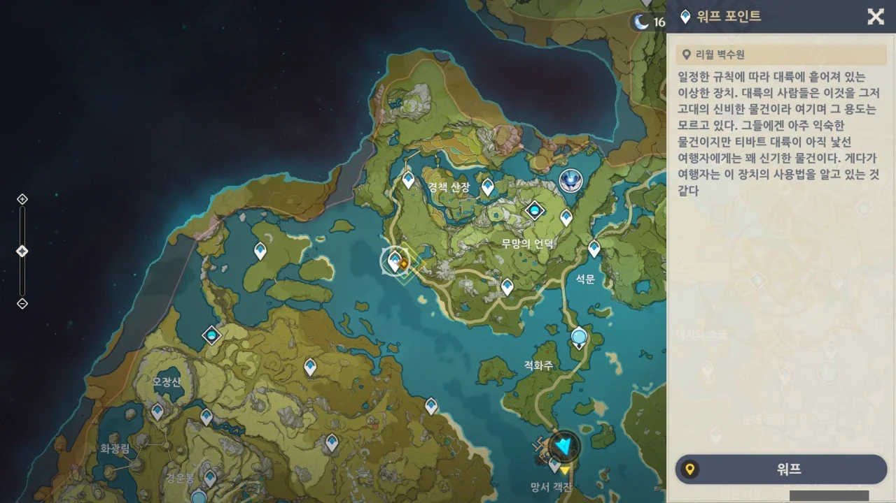

죽순을 캐러 벽수원으로 향한다.

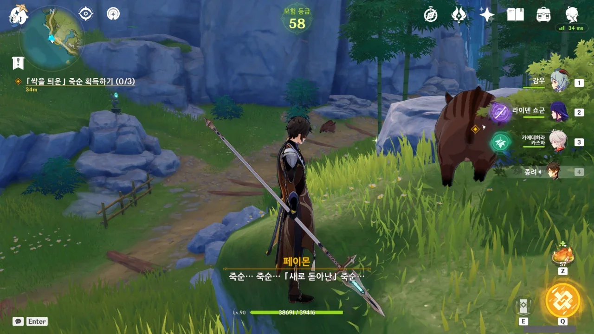

오자마자 멧돼지에게 한대 치였다. 여기가 멧돼지 조심 지역인 걸 깜빡했다.

로딩 화면이 페이드 아웃되는 와중에 이미 멧돼지에게 3연속으로 얻어맞고 있으니, 대응할 수 있을 리 없다. 얻어맞고 있을 때는 조작조차 불가능하니까.

죽순과 새로 돋아난 죽순 사이에 무슨 차이가 있나? 플레이버 텍스트를 보면 바로 알 수 있겠지만, 귀찮다.

나중에 종려에게 죽순을 주기 전에 확인해도 되겠지.



갑자기 어디선가 "사람 살려" 소리가 들리길래 그곳으로 가보니, 못 보던 캐릭터가 총총 뛰어오더니 제자리에 주저앉는다.

나 쟤 알아! 쟤가 그 요요인가 하는 그 캐릭터지?

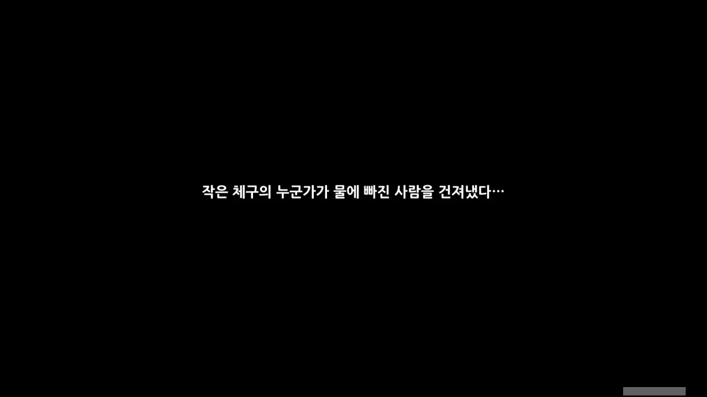



이 사람, 옷 입은 것만 봐도 벌써 폰타인에서 온 사람이란 걸 알 수 있겠다.



와, 요요 귀여워. 목소리도 귀여워. 하는 행동도 귀여워.

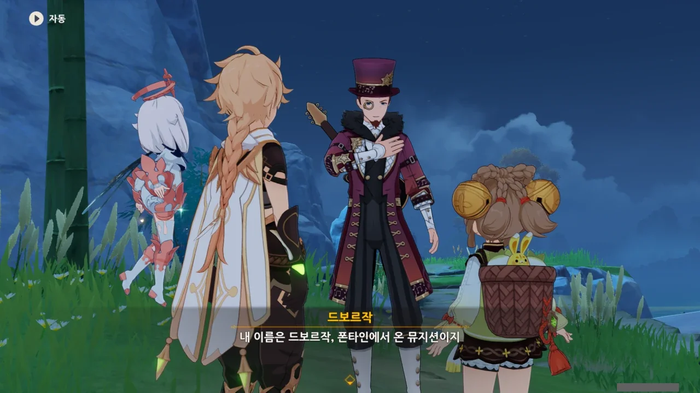

드보르작? 그거 작곡가 이름이잖아. 제9번 교향곡, '신세계로부터'를 작곡한 것으로 유명하다.





뭐, 난 저 교향곡의 멜로디를 Rhapsody of Fire의 The Wizard's Last Rhymes로 처음 들었지만.



드보르작은 리월의 풍경에 한눈을 팔다가 다리에서 그만 미끄러져 물에 빠졌다고 한다.

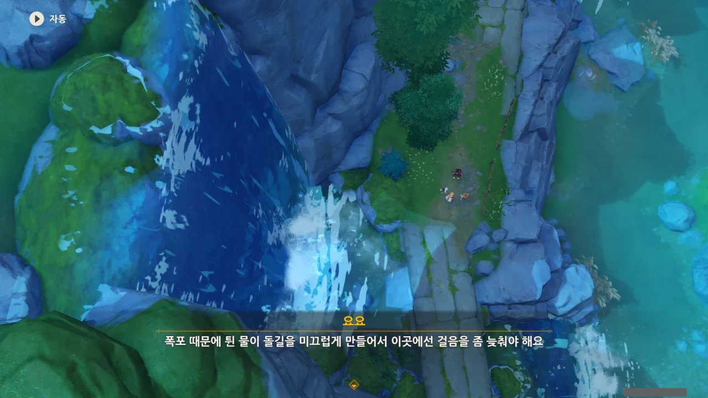

원신에는 '미끄러운 바닥'이 없어 몰랐던 사실이다.

요요 말대로라면 저 다리는 온통 이끼로 뒤덮여 있어야 할 것 같은데... 사람이 많이 다녀서 이끼가 자랄 곳이 돌 틈밖에 없었던 것일 수도 있지만.



뭐, 발밑을 잘 보고 다녔으면 애당초 미끄러질 일이 없었겠지만 말이다.

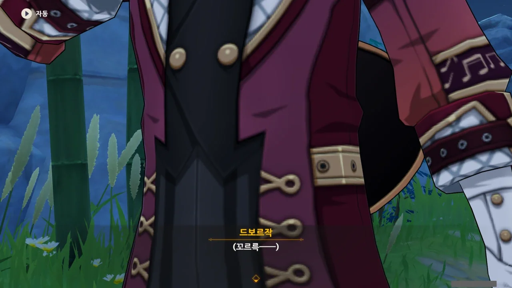

그리고 난데없이 들려오는, 드보르작의 위장이 비었다는 의미의 맑고 고운 소리.



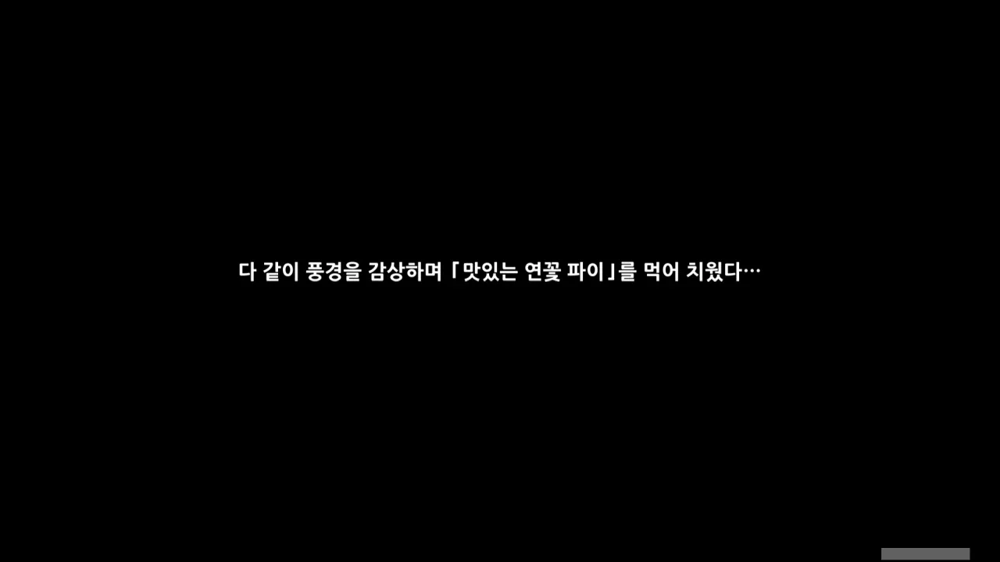

와, 요요, 심성도 착하네. 귀엽다, 귀여워!

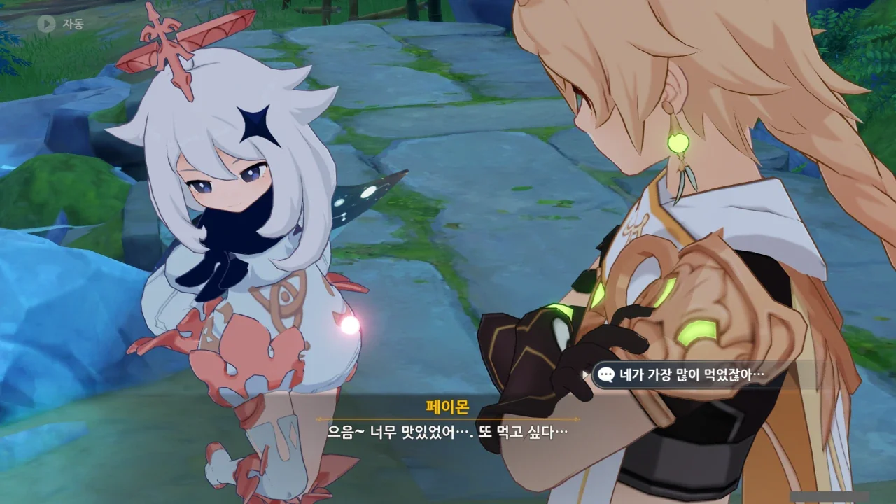

페이몬 돼지.



과연 그럴까? 난 페이몬의 성장기가 이미 끝난 줄로 알고 있었는데.

아, 페이몬도 아마 성장은 할 것이다. 위아래가 아니라 양옆으로.

&nbsp;

여행자를 고른 사람은 나처럼 남행자가 흘겨보는 표정 대신 여행자가 흘겨보는 표정을 보겠지? 부럽다!



몬드의 달빛 파이와 리월의 연꽃 파이는 생긴 게 다르던데, 둘 다 페이스트리 기법을 사용했다고?

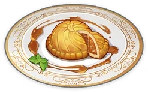

> 달빛 파이
> ***
> 몬드의 전통 주식. 소금에 절인 고기는 진한 풍미를 풍긴다. 껍질을 굽고 나면 더욱 향기롭고 촉촉하다. 몬드의 명절에 빠질 수 없는 요리이다.
{.bq}

> 연꽃 파이
> ***
> 리월의 전통 디저트. 밀가루로 얇고 바삭바삭한 피를 만들어 안에 달콤한 소를 넣고 튀겨서 만든다. 꽃잎이 펼쳐진 듯한 모양도 아름답다.
{.bq}

리월의 연꽃 파이에는 곧바로 페이스트리가 보이지만, 몬드의 달빛 파이에는 아무리 봐도 그런 구조가 보이지 않는다.



예전에 내가 '무지갯빛 투어'에 대해 들은 적이 있었나?

무지갯빛 투어는 분명 음악과 관련된 것일 테고, 그러면 신염과 연관이 있을 것이다. 예전에 신염이 어떤 공연에 참여했다고 했던 것 같은데, 아마 그게 무지갯빛 투어였던 모양이다.

&nbsp;

신염은 머리를 풀고 다녔으면 지금보다는 훨씬 인기가 좋았을 것 같은데. 예전에 머리를 푼 채 연주하는 컷신에서의 신염은 정말 예뻤거든. 그놈의 록이 뭐라고...



> 다만...

> 사람을 화나게 하는 방법은 두 가지가 있다고 한다.
> 하나는 말을 하다가 마는 것이고,
{.bq}

아잇, 궁금해 죽겠으니까 얼른 이야기 좀 해봐요!



드보르작의 조상이 여행하던 중, 물에 빠졌을 때의 이야기다.

그가 물에 빠져 죽기 일보 직전의 상황에서, 어디선가 매우 아름답고 감미로운 음악이 들려왔다고 한다.

그 음악이 얼마나 아름다웠는지, 드보르작의 조상은 자신이 죽기 일보 직전이라는 상황조차 잊어버릴 정도였다.





드보르작의 조상이 정신을 차려보니, 자신은 이미 물기슭으로 돌아와 있었고, 근처엔 속세에 속하지 않은 듯한 낯선 여인이 서 있었다고 한다.

그가 무사하다는 걸 확인한 여인이 떠나자, 그는 고마움을 전하기 위해 그녀의 뒤를 쫓았지만 어째서인지 따라잡을 수 없었다.

결국 드보르작의 조상은 그녀의 뒷모습을 향해 감사 인사를 하는 수밖에 없었다.



그리고 나중에 그 이야기는 폰타인에서 예술적 가공을 거친 끝에, <<선녀가 굽어보는 호수>>라는 이름의 전설이 되었다고 한다.

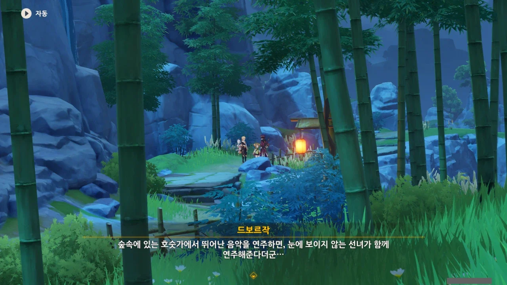

드보르작이 말하는 그 '낯선 여인'은 아마 선인이 아닐까?

지금껏 만난 여러 종족 중 그런 일을 가능케 하는 건 리월의 선인 아니면 이나즈마의 요괴밖에 없다. 하지만 드보르작이 리월에 온 건, 그가 추측하는 이야기의 배경은 리월이라는 의미이다.

드보르작의 조상이 그 여인을 따라잡을 수 없었던 것 역시 선법을 이용했다면 충분히 가능한 일일 것이고.



드보르작이 그렇게 나이들어 보이지 않는다고 생각했었는데, 지금 자세히 보니 눈 밑에 주름이 있다.

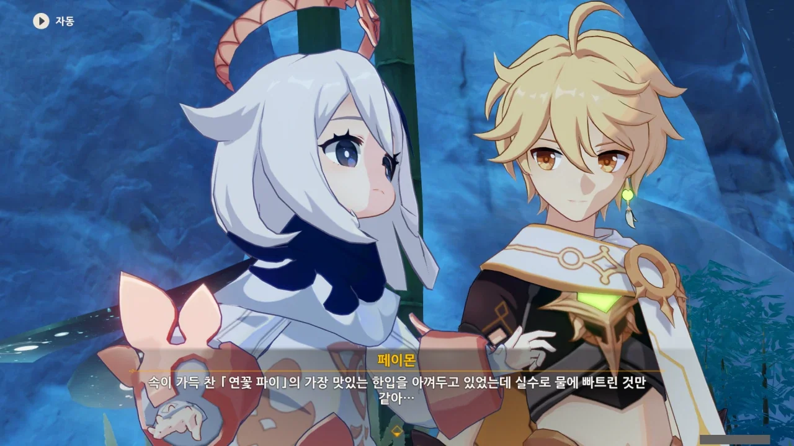

페이몬 요 녀석은 비유를 해도 어째 먹을 거로 비유하네...

그리고 그렇게 잘 들어맞는 비유도 아닌 것 같다.



드보르작이 그 이야기가 리월에서 일어났다고 생각하는 데에는 또 다른 이유가 있다.



맨 처음 몬드에 가서 기도했더니 바람이 리월로 그를 이끌었다고 한다.

그렇다면 정말로 리월에서 일어났던 일일 가능성이 높겠네.

벤티 녀석, 은근 놀고먹는 것 같아도, 할 일은 몰래몰래 제대로 하거든. 자기 몰래 벤티의 운명을 보려던 모나의 눈에 강한 바람을 불어넣어 눈을 제대로 뜨지도 못하게 만든 것이 바로 벤티지 않은가.



아니, 그렇게 이야기하니까 정말 드보르작이 몬드 사람들에게 사기당한 것처럼 들리잖아. ㅋㅋㅋㅋㅋㅋ

드보르작이 '신상에 술을 바쳤다'라고 했을 때, 난 신상에 술을 들이부은 줄 알고 '벤티가 그러면 싫어하지 않을까?'라고 생각했다.

그런데 여기가 동양도 아니고, 술을 신상에 들이붓기보다는 술병을 신상 밑에 곱게 놔두었을 것이다. 그렇다면 벤티가 좋다꾸나 하고 그 술병을 챙겨갈 수 있겠지.



그래, 어쩌면 저게 제일 확실한 방법일 수도 있다.

설령 그가 사기를 당했다고 해도, 과연 누구에게 따질 수 있을지는 잘 모르겠지만.



감우... 약초...

생각해 보니, 감우는 채식주의자였다. 정확히는 기린 혼혈인지라 풀만 먹어도 살 수 있는 거긴 하지만.

저 때 나도 모르게 달콤달콤꽃을 입에 한가득 물고 있는 감우의 모습이 생각나 버렸다.

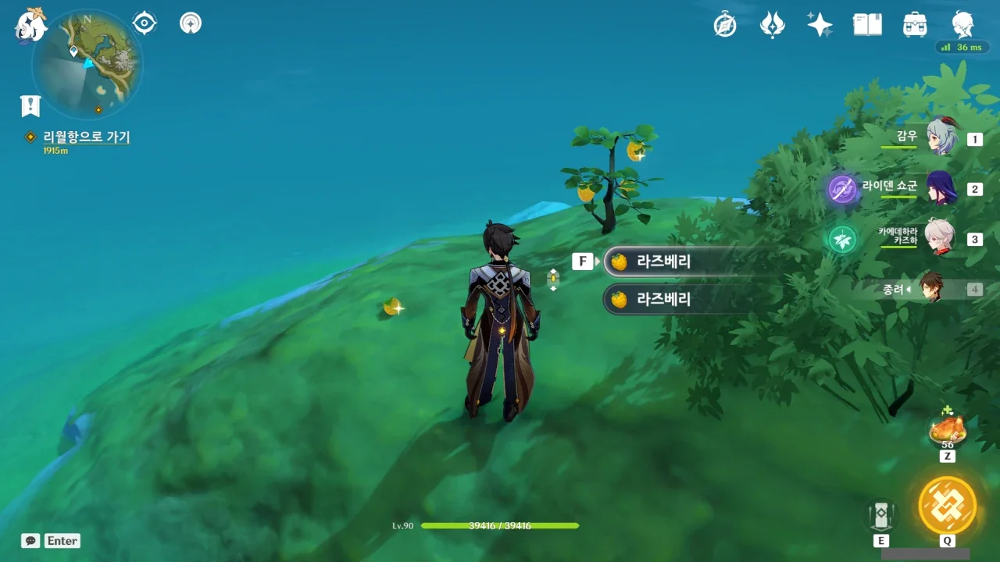

다음 장소로 가기 전에, 컷신 내내 신경 쓰였던 이 라즈베리 먼저 먹고 가기로 했다.

이 라즈베리 한 개는 대체 왜 나무에 매달려 있지 않고 떨어져 있는 것인지 잘 모르겠다. 처음 봤을 때, 난 이게 새고기인 줄 알았다니까?
