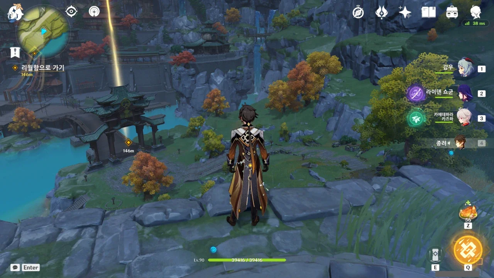
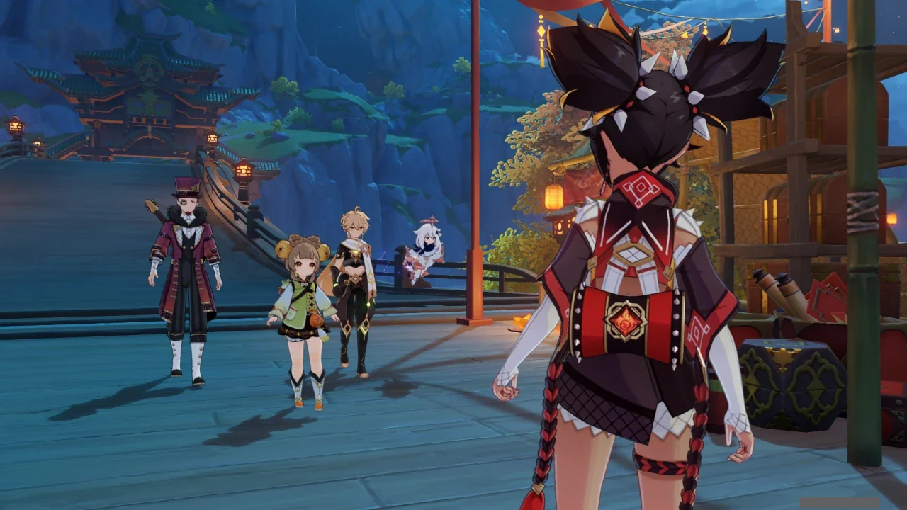
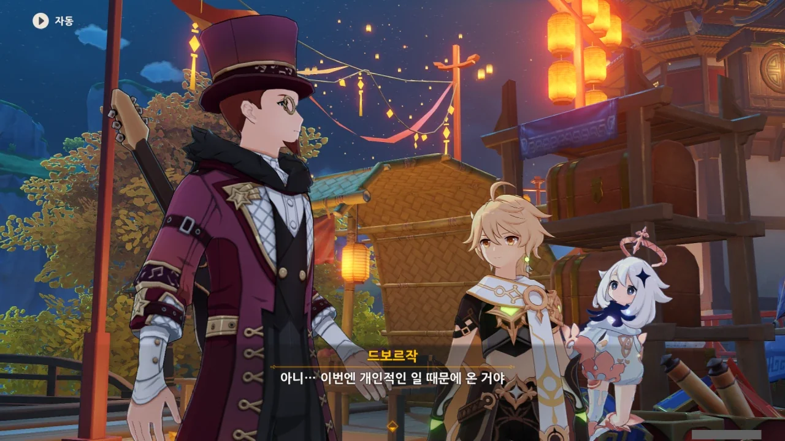
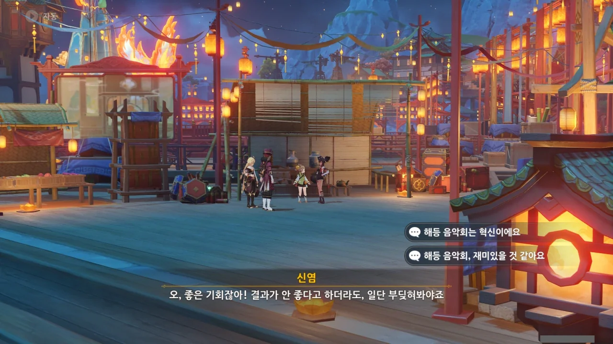
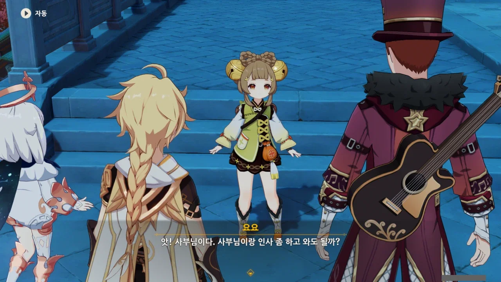
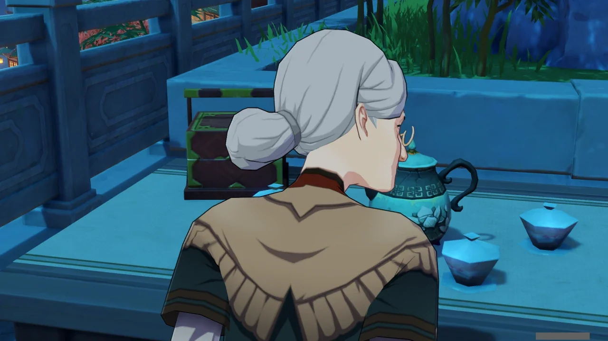
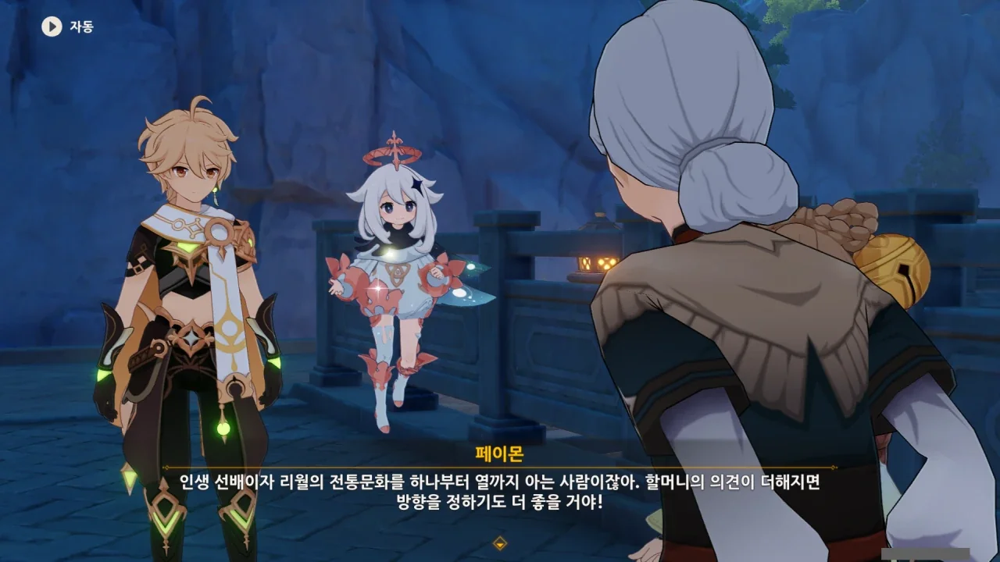
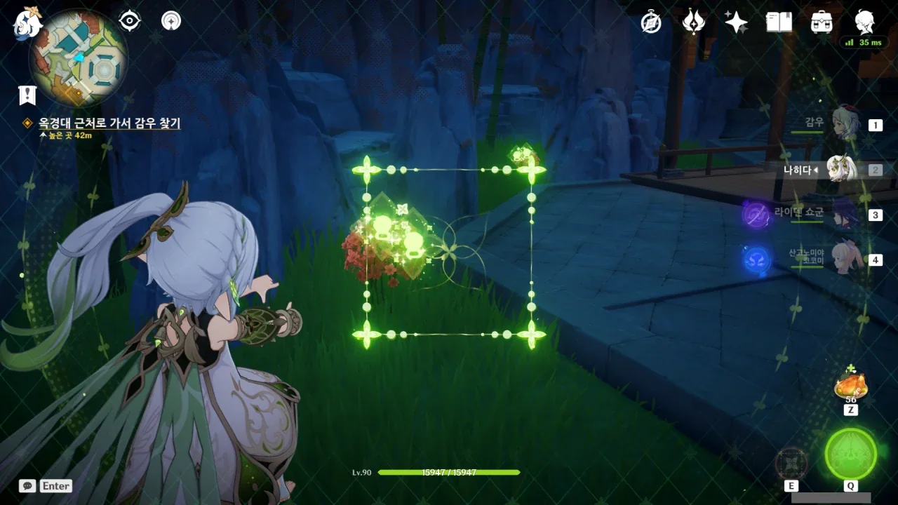

리월항 바로 앞에 있는 워프 포인트로 이동했는데, 난데없이 비가 좌락좌락 내리고 있다.

괜찮아. 어차피 리월항으로 들어가면 비가 거짓말처럼 갤 테니까.

&nbsp;

사진을 찍진 못했지만, 리월항에 들어가니 컷신이 재생되면서 날씨뿐만 아니라 시간대 역시 밤으로 조정되었다.

해등절의 리월항이 제일 이쁠 때가 밤이긴 하지.



아, 이거 내가 움직여야 하는 거야? 난 드보르작이 알아서 걸어갈 줄 알고 '왜 드보르작이 움직이지 않지?'라고 생각하고 있었는데.

아, 그래. 신염 네가 이런 이벤트에 빠질 리 없지.



응? 뭐야? 신염과 드보르작이 이미 서로 아는 사이였어?



신염이 무지갯빛 투어에 관해 이야기 한 걸 들은 기억은 얼핏 나지만, 그 투어가 정말 개최되었는지에 대한 건 들어보지 못한 것 같다.

아니면 내가 대강 대화를 넘기다 그것까지 같이 넘겨 버렸거나.



페이몬이 「무지갯빛 투어」를 「해등 음악회」라고 말하자, 투어가 무슨 「6시 내고향」이나 「광복절 기념 서울시향 음악회」 같은 느낌의 행사가 되어버렸다.

다시 말해, 촌스럽다는 말이다.

아, 그러고 보니, 드보르작이 리월에 온 건 자기 조상 이야기를 따라온 거였지.



여기서 갑자기 드보르작이 음악회를 열고 싶다고 해도, 필요한 것이 한둘이 아니다.

사람도 필요하고, 장소도 필요하다. 그리고 그걸 위한 돈도 필요하다. 시간이 필요한 건 두말할 것도 없다.

그리고 제일 중요한, 리월 행정부와의 사전 협의가 필요하다.



하지만 지금 우리가 만나러 가는 「리월 칠성」이 바로 그 '리월 행정부'인걸.

"어, 어?"하고 놀라는 드보르작의 얼굴이 아주 볼만하다.

갑자기 해등 음악회 이야기가 급물살을 타기 시작한다.



참가자, 그러니까 아마 공연에 참여해 곡을 연주할 사람은 신염이 다리를 놓아주겠다고 한다.

운근? 이번에 나와서 또 '이이잉'하는 건 아니겠지?

&nbsp;

예전에 이야기했는지 모르겠다.

운근의 노래가 그 자체로는 굉장히 좋았지만, 세 가지 이유 때문에 불호감이었거든.

첫째. 성우가 갑자기 중국 경극 가수로 바뀌어 매우 어색하다.  
둘째. 그 바뀐 경극 가수의 목소리가 기존 운근 캐릭터와 정말 안 어울린다.  
셋째. 시도 때도 없이 경극 가수가 대신 나와 노래를 부른다.



공과 사의 구분은 정말 확실히 하는 드보르작. 그래, 오프닝처럼 중요한 부분을 그냥 넘겨줄 수는 없겠지.



선배? 요요의 선배?



잠깐만, 잠깐만. 요요의 선배가 향릉이라는데, 향릉의 사부는 평 할머니 아냐? 향릉의 스킬 시전 대사 중 "사부의 창술을 감상하라구!"가 있는데, 그 사부가 바로 평 할머니거든.

그러니까 요요의 사부도 평 할머니란 거네?

정말이었네. 요요의 사부는 평 할머니였다.

분명 평 할머니가 천천히 고개를 돌리는 모습이지만, 여기에 'ゴゴゴ' 효과음을 붙여도 전혀 어색하지 않을 것이다.

이 할머니, 생긴 것과 다르게 선인이라 굉장히 강하거든.

그래서 그런가, 딱히 잘못한 게 없는데도 이 할머니 앞에 서면 뭔가 무섭다.



평 할머니 입장에선 요요가 그저 귀여운 손녀처럼 보이지 않을까?

나이를 생각하면 향릉 역시 귀여운 손녀겠지만, 향릉은 이제 다 컸지 않은가. 그에 비해 요요는 '아직 어린 손녀' 정도의 느낌일 것만 같다.



평 할머니는 「무지갯빛 투어」에 대해 들어본 적이 없는 것 같다.

어쩌면 당연할 수밖에 없다. 최근엔 투어를 아예 열지 못했고, 「무지갯빛 투어」는 폰타인에서 온 행사이니 리월 토박이인 평 할머니가 이에 대해 전혀 듣지 못한 것도 무리는 아니니 말이다.

&nbsp;

그리고 어째서인지, 대중적으로 유명한 행사가 아니라, 아는 사람만 아는 행사인 것으로 보이기도 하다.

그래서 해등절 때 음악회를 여는 것에 대해 리월 전통문화에 해박한 평 할머니의 고견을 듣고자 한다.

종려에게 물어도 상관없을 것 같긴 하지만, 종려는 일단 '평범한 일반인'이니까. 살아있는 화석이기도 하고.





뭐, 음악은 문화를 막론하고 어디에나 있는 것 아니던가. 클래식도 좋지만, 락이나 일렉트로닉도 좋은 법이다.

평 할머니로부터 긍정적인 반응을 얻었다.



> 앗! 저희 외조모를 제외하고 제가 만나본 분 중에 가장 지혜로우십니다!

난 왜 저 '저희 외조모를 제외하고' 부분이 뜬금없이 들어간 사족처럼 느껴지는 걸까?



아까 리월 칠성을 만나러 가던 길이었으니, 이제 평 할머니와는 헤어질 시간이다.

그래도 그 전에 근처에 있는 채집물은 전부 먹고.
