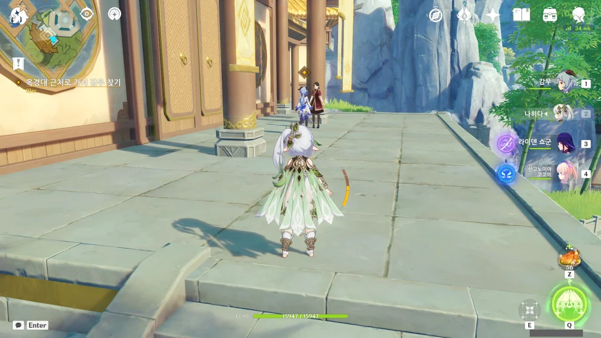

옥경대로 오니 감우가 바깥에 나와 있다. 이렇게 필드에 나와 있는 감우를 보는 게 대체 얼마 만이지? 물론 내가 평소 데리고 다니는 플레이어블 캐릭터인 감우 말고 말이다.



그래, 평소라면 하지 않았을 실수를 명절이라고 들떠 긴장을 풀고 있다 저질러 버리는 경우가 굉장히 많이 있다.



> 감우 언니---
> 요요, 이곳엔 무슨 일이니?

이렇게 둘을 놓고 보니, 마치 자매처럼 보인다.



정정하겠다. 자매가 아니라 요요가 엄마 같다.

어떻게 감우를 보자마자 나오는 소리가 잔소리? ㅋㅋㅋㅋㅋㅋ

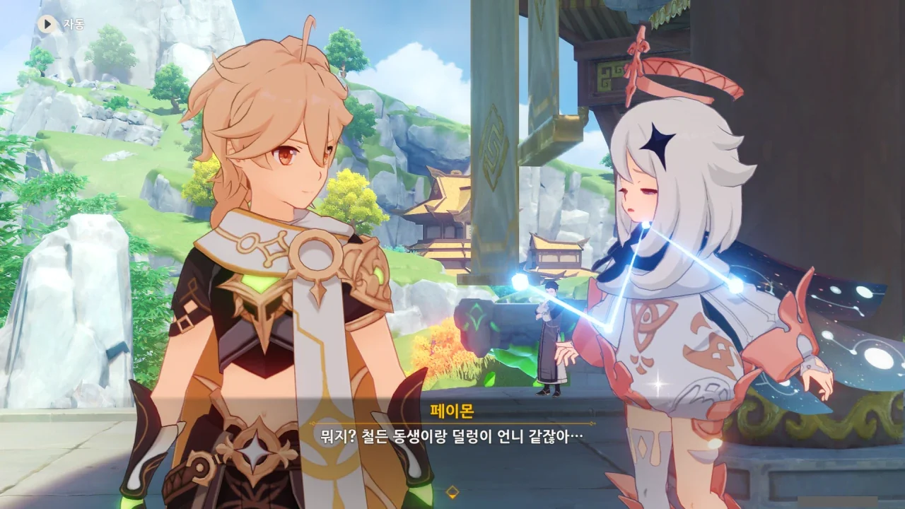

아, 그래. '철든 동생과 덜렁이 언니'라는 표현이 더 적절할 수도 있겠다.

와, 나 감우가 이렇게 쑥스러워하는 거, 처음 봐!

예전에 라즈베리를 구경하던 엄한 우인단을 오해해 두들겨 패고서도 별말 안 하던 감우였는데...

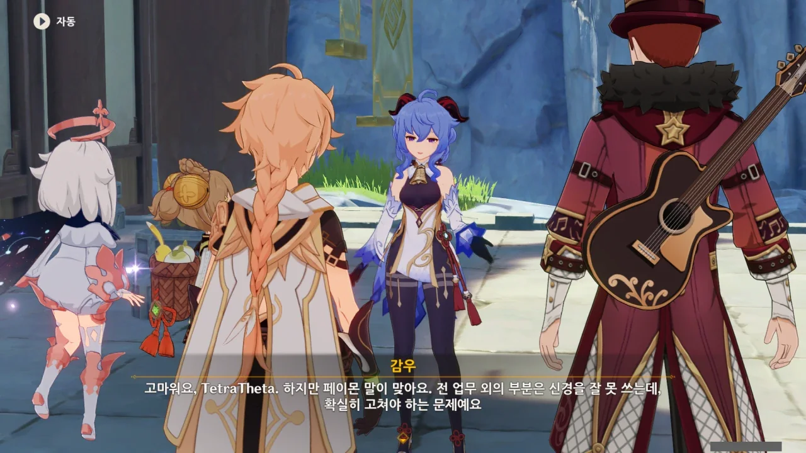

감우가 아마 워커홀릭이었던가? 취미가 '일'이라고 하니, 아마 워커홀릭이 맞을 것이다.

어떻게 취미가 일일 수 있지? 내 평생 워커홀릭은 이해하지 못할 것이다.

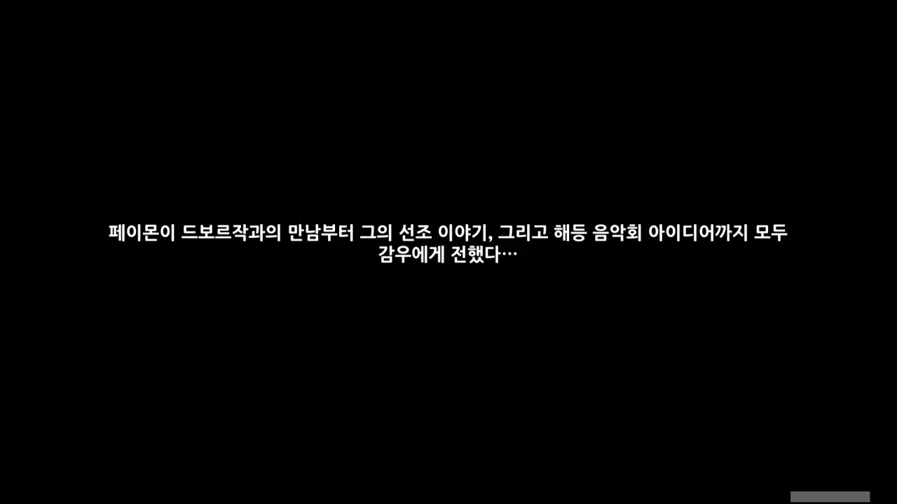

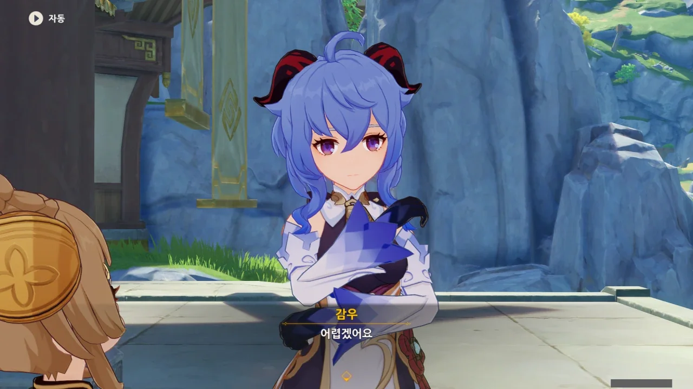

칼같이 나오는 "어렵겠어요".

어? 여기선 '좋은 생각이에요'라며 해등 음악회를 여는 전개 아니었어?





무지갯빛 투어가 리월에서의 지명도가 너무 낮아, 여기에 올인하기에는 너무 위험성이 크다고 한다.

아까 평 할머니가 간접적으로 돌려 말한 내용이기도 하다.

드보르작의 표정이 순식간이 침울해졌다.



응? 거절의 뜻이 아니었어?

기존 행사는 그대로 진행하고, 무지갯빛 투어를 일종의 보너스 행사로서 해등절 일정에 넣겠다고 한다.

&nbsp;

분명 감우가 처음에 "어렵겠어요"라고 할 때, 거절의 뜻인 줄 알았는데.



이번에도 아까처럼 일이 일사천리로 진행되기 시작한다.

아니, 여기서 곧바로 기획서를 만든다고? 물론 해등절이 막 시작한 만큼 기획서를 하루빨리 만들어야 하는 건 알지만, 여기서 바로?



그러더니 정말로 감우와 드보르작 둘이 이야기하러 이동한다.

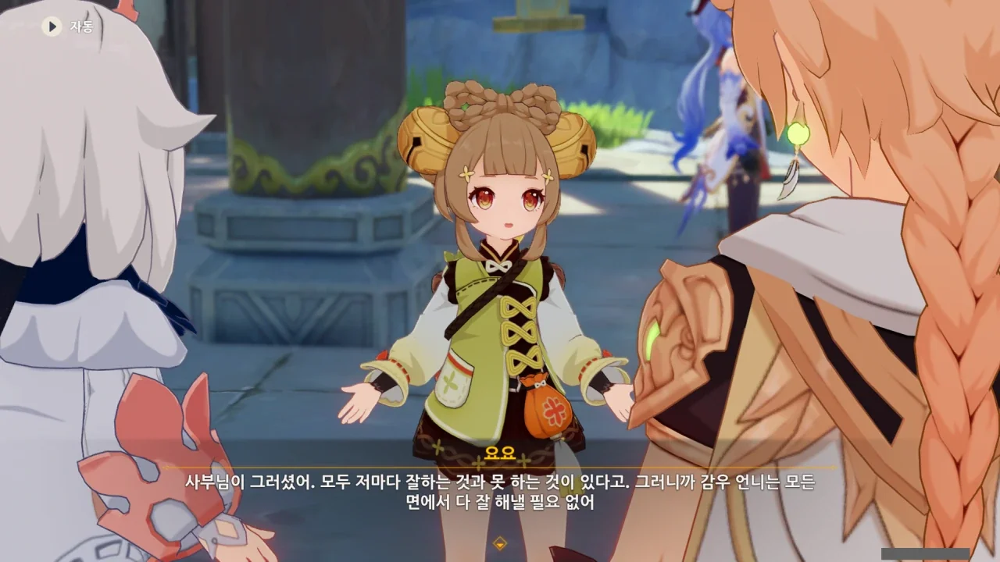

하지만 감우는 리월 정부의 총괄 비서인걸. 아마 그것 때문에 느끼는 부담이 장난 아니어서 모든 걸 다 잘 해내려고 하는 걸지도 모른다.

얼마나 일을 많이 한 건지, 대기 대사조차 이렇다니까.

> 일... 일을 아직 다 못 끝냈는데... 정말 미리 휴식해도 되는 걸까요?

게다가 가만히 놔두면 꾸벅꾸벅 졸기조차 한다.

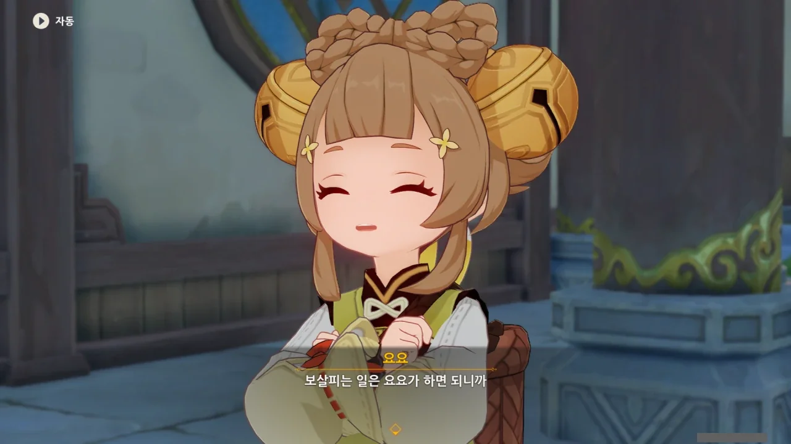

> 보살피는 일은 요요가 하면 되니까.

마... 마망!



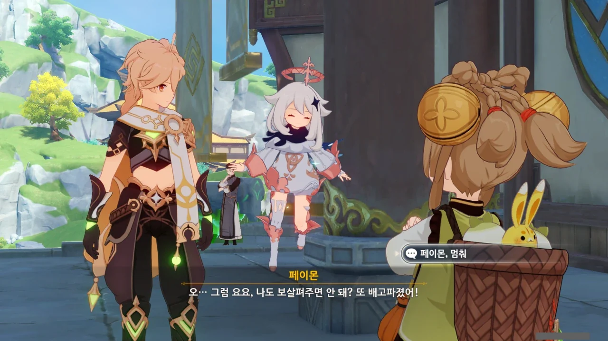

페이몬, 이 눈치 없는 녀석.



와... 이걸 또 받아주네...

그런데 페이몬이 말한 '슬라임'은 대체 뭘까? 슬라임은 식용이 아니잖아. 아니, 가공하면 먹을 수는 있긴 하지만, 그래도 슬라임이 달콤하다는 말은 들어본 적이 없는데.

혹시 허브 젤리를 말하는 걸까?





우리가 요요와 이야기하는 동안 감우와 드보르작도 이야기가 다 끝난 것 같다.

벌써 초안을 완성하다니, 대단한데.

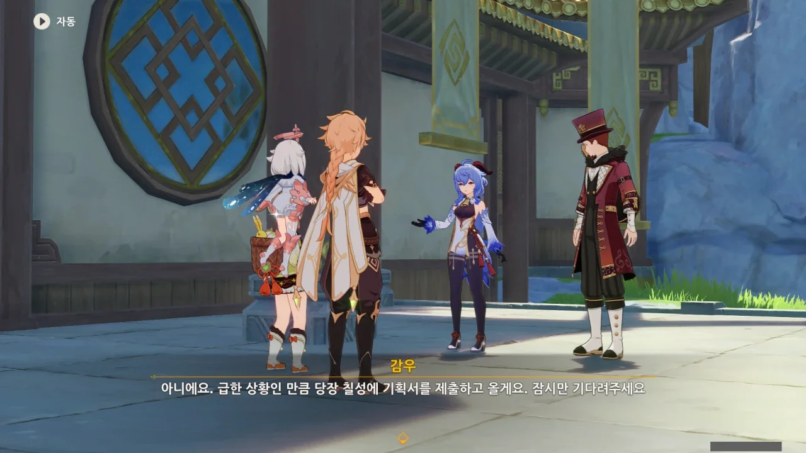

그래, 갑자기 생긴 일정이니 하루빨리 칠성에 기획서를 제출하지 않으면 안 된다.



> 잎은 그냥 씹으면 안 돼.

전에 이야기했듯이, 감우는 채식주의자라 채소나 풀을 그냥 씹어먹는다. 그렇게 먹어도 살이 찌는 걸 걱정해야 하는 체질이니.

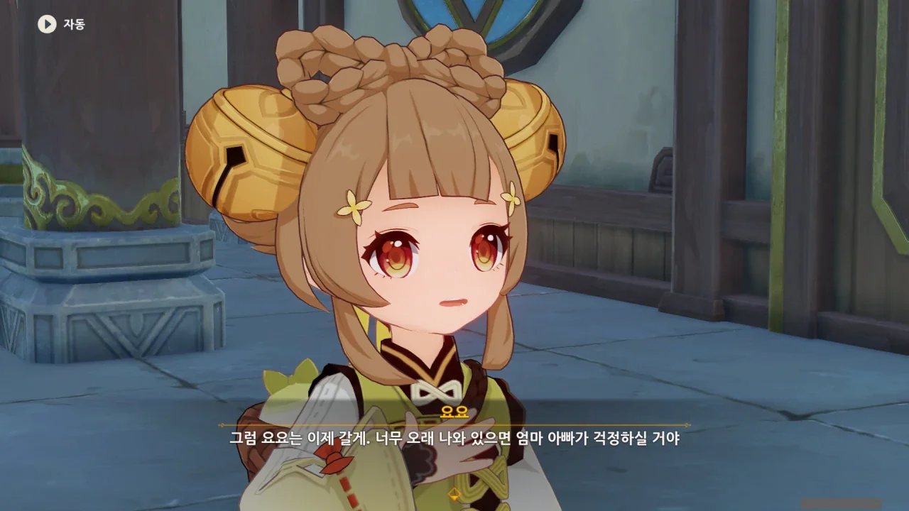

요요의 부모가 있었구나... 지금껏 원신에 등장한 플레이어블 캐릭터 중 부모에 관해 이야기가 나온 캐릭터가 별로 없어, 부모의 존재에 대해 크게 신경 쓰지 않고 있었다.

* 향릉: 만민당의 묘 사부가 향릉의 아버지이다.
* 클레: 앨리스가 클레의 어머니이다.
* 피슬: 양친 모두가 살아 계시지만, 저번 꿈사과 제도 이벤트 때의 이야기를 보면 피슬의 중이병을 영 못마땅해하는 것 같다.
* 쿠죠 사라: 친부모는 없지만 쿠죠 가문에 입양되었으니, 양부모는 있는 셈이다. 하지만 현재 양부가 수감 중이다.
* 디오나: 샘물 마을의 촌장, 두라프가 디오나의 아버지이다.

이외에도 아마 더 찾아보면 나오겠지만, 일단 기억나는 건 이게 전부이다.

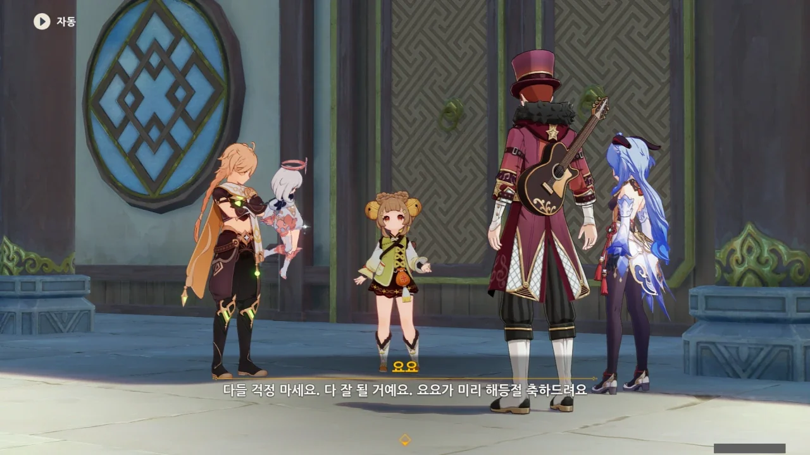

요요도 작별 인사를 하고 떠난다.

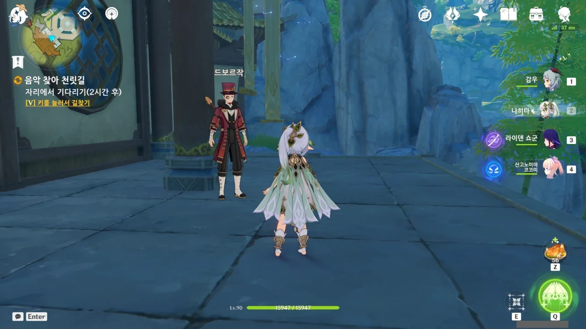

게임 시간으로 2시간을 기다려야 한다.
