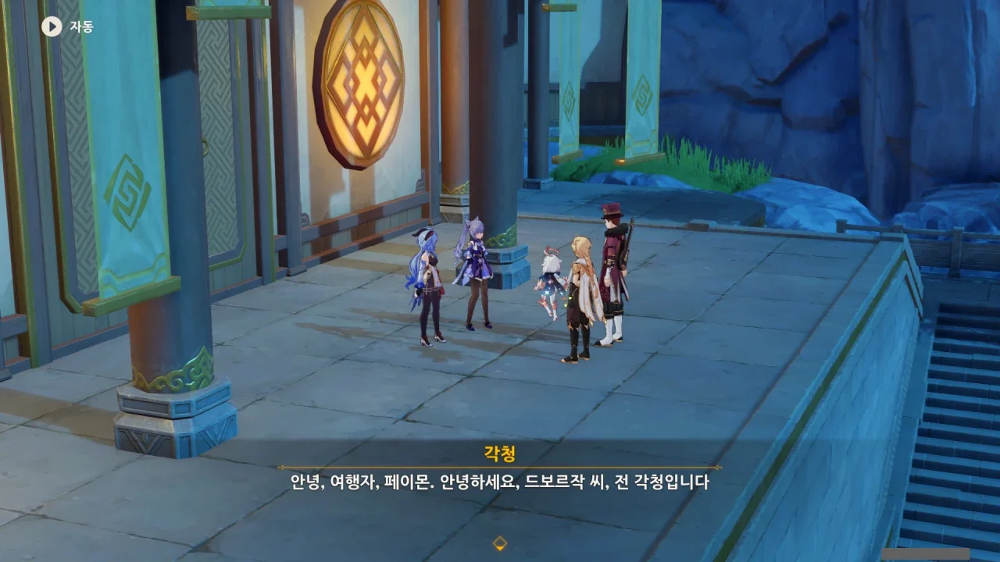
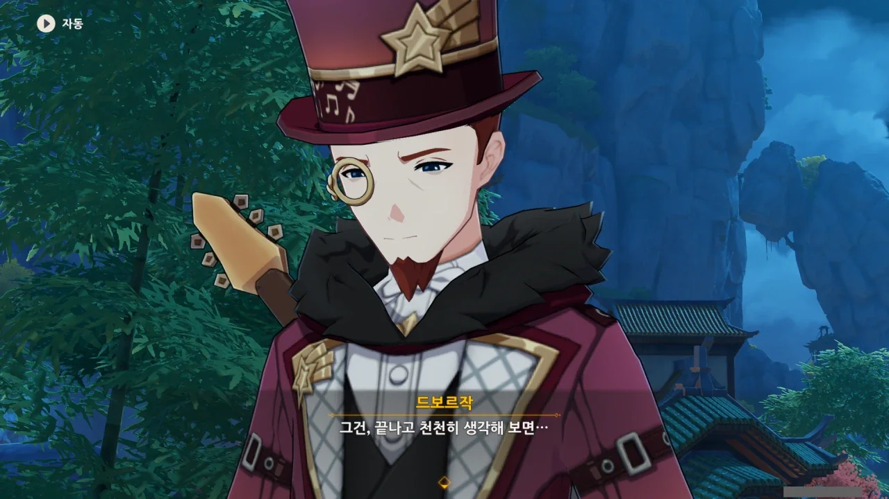
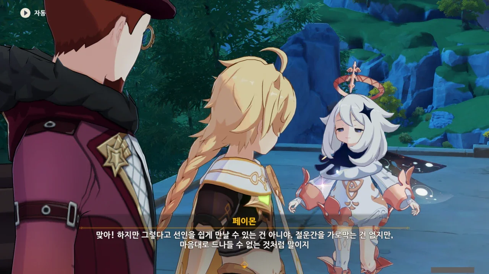
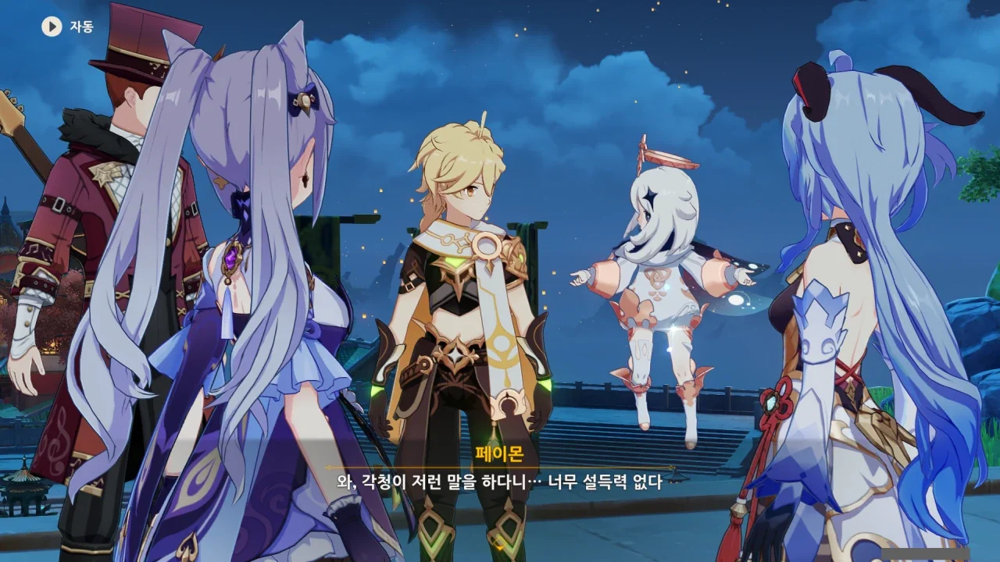
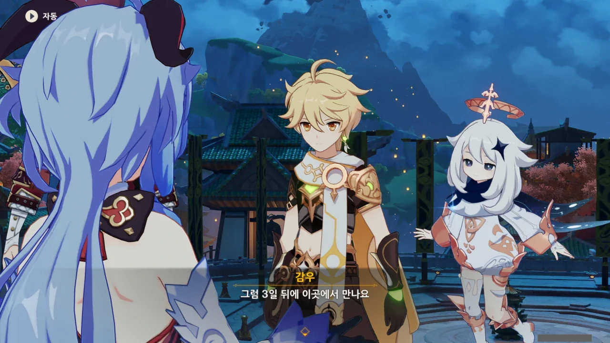
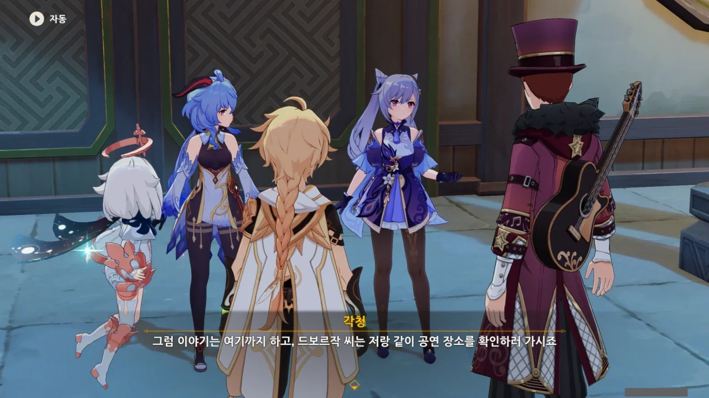

감우와 각청이 나왔다.



해등 음악회 기획서가 통과되었다. 각청이 음악회 준비를 도울 것이라고 하니, 이번 이벤트에서 각청도 꽤 자주 얼굴을 비출 것 같다.

그러고 보면, 리월 칠성중 얼굴이 알려진 게 셋밖에 없다.

* 천추성(역할 불명): 천추 아저씨
* 천권성(입법): 응광
* 옥형성(국토개발): 각청

나머진 뭘 하고 있는지조차 잘 모르겠다.



> 내 개인적인 입장에서도 새로운 변화는 바라던 바니까.

각청이 말하는 저 '새로운 변화'가 대체 뭘 의미하는지 잘 모르겠다. 예전 이야기에 관련 언급이 있나 궁금해 나무위키 문서를 대충 훑어봤지만, 별 소득이 없었다.

나에게 있어 각청은 신의 영향력이 막강한 나라에서 '신의 것은 신에게, 인간의 것은 인간에게'라고 주장하는, 당찬 사람 정도이다.



> 실은 몇 번의 실패를 겪고 지쳐있었어요.

드보르작이 말하는 '몇 번의 실패'는 연이은 무지갯빛 투어의 개최 실패를 말하는 걸까?



뭐, 콘서트를 열려면 일단 무대를 만들어야 하니.

그래도 잘하는 분야라고 하니, 하나하나 일일이 같이 다니지 않아도 좋을 것 같다.

> 그건, 끝나고 천천히 생각해 보면...

조금 전까지만 해도 흥겨운 리월 음악이 배경으로 나오다가 드보르작의 소원을 언급하자 갑자기 음악이 끊기는 걸 보고 피식 웃었다.

분명 이 아저씨, 자기 조상이 만났던 여자의 흔적을 찾아 리월에 온 거였으니까.

지금과 같은 상황을 바로 '본말전도'라고 하는 것이다.



같이 이야기를 들었던 감우 역시 기획서 이야기를 하느라 드보르작의 조상 이야기를 까맣게 잊고 있었다.



드보르작의 조상 이야기는 드보르작의 사적인 일이니, 해등 음악회를 준비해야 할 감우와 각청이 신경 쓸 일이 아니긴 하다.

드보르작의 조상 이야기는 해등절 행사가 끝나고 찾아보아도 무방하지만, 이미 통과된 기획인 해등 음악회는 지체할 시간이 없지 않은가.

그래. 나도 계속 그 생각을 해왔어.



> 저도 소속감을 찾기 위해 비슷한 일을 해봤거든요...

아마 감우 전설 임무 이야기를 뜻하는 거겠지. 「반신수」인 감우가 '구름의 바다'와 '인간의 바다' 중 어디에 속해야 할지 잘 몰라 일어난 일이 감우 전설 임무니까.



어허, '예술적인 가공'이라니. 바로 눈앞에 당사자가 있거늘.

감우 전설 임무에서 선인을 만나려고 무작정 달려들던 사람이 하나 있었지...

감우에게 '그 나이 먹었으면 우연보다는 일과 가족에 집중하는 게 좋다'라는 팩트 폭행을 당하자, '진짜 선인 맞냐, 어떻게 우리 동네 사람들이 하는 말과 하나도 다른 게 없냐'라며 투덜댔지만.

하지만 맞는 말이잖아.



그래, 감우는 오랜 세월을 살아왔으니, 아는 사람이 많을 것이다. 선인이라면 더더욱 그럴 테고.



드보르작의 조상이 만났던 여인이 선인일 가능성이 높으니, 선인과 연줄이 있는 감우가 드보르작의 조상 이야기를 처리하고, 각청은 드보르작과 함께 해등 음악회 일을 처리한다.

역할 분담이 잘 되는걸.





감우야, 그게 무슨 소리니. 감을 안 잔다니. 필드에 꺼내 두면 맨날 꾸벅꾸벅 조는 주제에 왜 또 잠을 안 잔다는 거야?

> 아무리 신수의 피가 흐른다고 해도, 그렇게 무리하다간 몸이 버티지 못할 거야.

아하하... 하기야, 각청도 꽤나 일을 열심히, 그리고 필사적으로 하는 노력파라서 각청이 저런 말을 하니 이상하게 보이긴 하다.



그럼 다행이고...

각청이 과로로 쓰러졌다는 이야기는 들어본 적이 없으니, 아마 평소에도 일과 휴식의 균형을 잘 조절하고 있었을 것이다.



중간에 하루 쉬는 것으로 해서, 이틀이 사흘이 되었다.



그래, 이렇게 물어볼 것 같았다.

해등절 이야기를 진행하려면 각청이나 감우 둘 중 하나를 따라가야 하는데, 각청 쪽에는 이미 드보르작이 붙었으니, 여행자가 감우에 붙어야 인원 균형이 맞을 것 같았거든.

3일 뒤에 여기서 만나자고? 진짜로 현실 시간으로 3일을 기다려야 하는 건 아니겠지? 해등절 이벤트가 꽤 길게 진행되니, 정말로 그럴 수도 있다.



지금까지 선인과 인간이 함께 모여 해등절을 즐긴 적이 있었던가? 아마 없었던 것 같은데.



그래... 명절에는 다 같이 모여 즐겨야지.

정작 이렇게 말하는 나는 이번 설날에 친척을 만나러 가지 않지만.

자, 이제 드보르작과 각청은 해등 음악회 준비를 하러 가고, 여행자와 감우는 드보르작의 조상이 만났던 여자에 대해 알아보러 갈 시간이다.





> 너희들은 음악이 뭐라고 생각해?
> 줄곧 음악이 사람들에게 주는 의미를 찾고 있었어.
> 공연이 끝나고 너희들의 대답을 다시 들어보고 싶군.

드보르작이 의미심장한 질문을 던진다.
