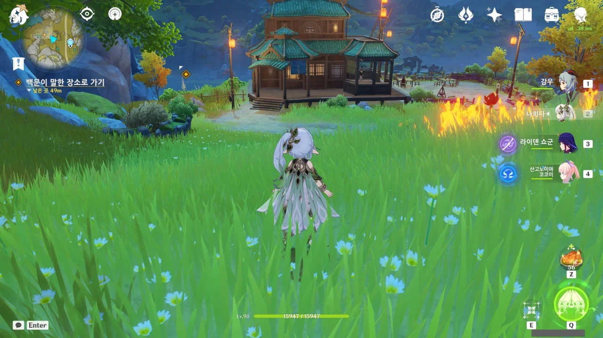
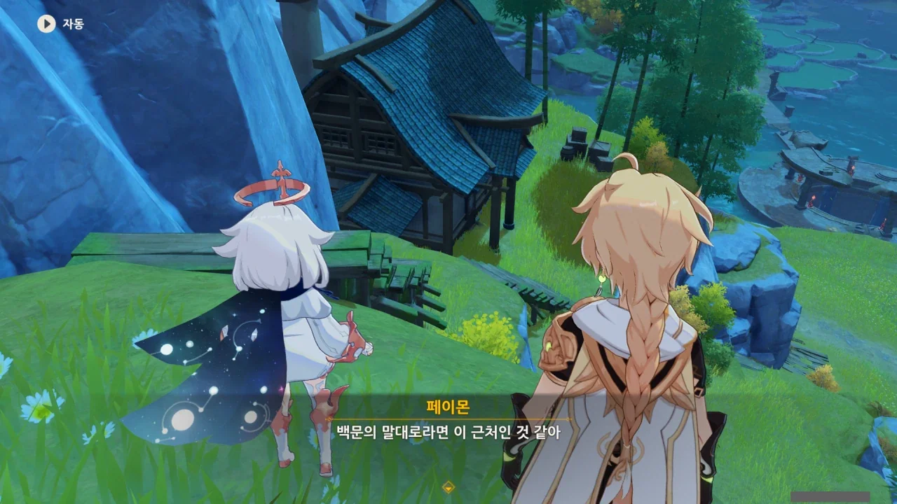
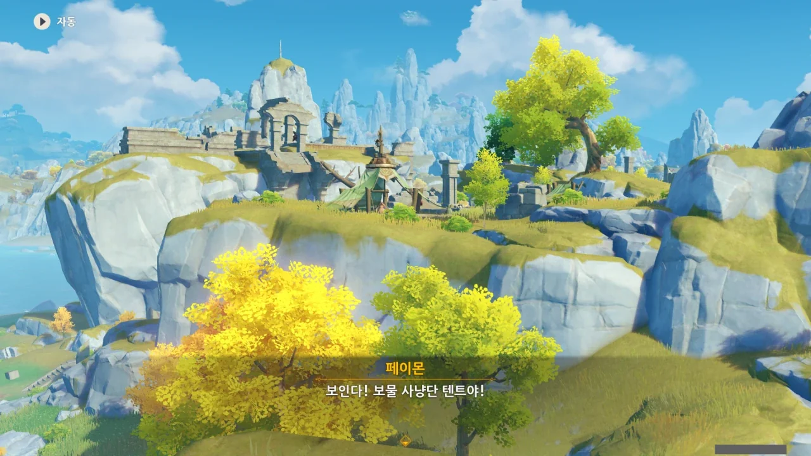

백문이 말한, 이상한 선율이 들려온다는 운래해로 가게 되었다.



일단 채집 요소 먼저 먹고. 이건 못 참지.

먹고 보니 당근이었다.

어... 여기 원래 집이 있었던가?

집이 아니라 아예 하나의 마을이 있었네. 여태 난 왜 이걸 몰랐지?

여기 겜안분 하나 추가요...



어허. '어떤 할 일 없는 사람'이라니.

이래 봬도 운래해에서 들려오는 이상한 선율에 대해 조사하는, 공무 수행 중이라고.



응? 밖은 안전하다고? 우리 설마 앞으로 싸우게 되는 거야?

그리고 난데없이 집 주변을 조사하게 되었다. 대체 뭐지?



버려진 집인 줄 알았는데, 얼마 전까지 사람이 살았던 집이라고 한다.



그런 것 치고는 안에 비싼 물건은 하나도 없이 텅 비어있다.



문이나 창문 역시 억지로 열린 흔적이 없다.

&nbsp;

음, 미니멀리스트의 집이네!



절도 흔적도 없고, 억지로 침입한 흔적도 없다. 그럼 면식범이지 않을까? 아는 얼굴이니 문을 열어주었겠지. 아니면 집주인이 집 열쇠를 바깥 어디에 숨겨뒀는지 알고 있는 사람이거나.

그런데 대체 이게 지금, 이 근방에서 들려오는 이상한 선율과 대체 무슨 상관인 건데?



아잇, 영문도 모른 채 여기에 끌고 와놓고선 뭐? "패배를 인정하는 거야?"

야, 난 CSI가 아니에요. 적어도 CCTV에 찍힌 자동차 뒤 번호판의 볼트에 반사된, 그 뒤 자동차의 앞 번호판 번호를 식별할 수 있는 분해능의 CCTV 정도는 가져다주고 이런 걸 시키던가!



또 또 저 혼자 아는 걸로만 자랑질이야.

야란의 성능은 좋아도, 성격은 저렇게 진짜 한 대 때리고 싶을 정도로 얄밉다.





... 그러니까 지금 어떤 도둑이 먼 옛날 산적이 불던 뿔피리 소리를 재연해서 마을 사람들을 공포에 빠져 도망가도록 유도한 후, 빈집 털이를 했단 거야?

여기 사람들은 무슨 100년 200년씩 살기라도 해? 먼 옛날이라면서! 아직도 그 선율을 정확히 기억한다고? 소리만 듣고 공포에 떨며 도망칠 정도로? 그게 말이나 돼?

&nbsp;

그래... 이건 분명 번역이 잘못된 것일 테다. 먼 옛날이 아니라 고작 10년이나 20년 전 이야기였겠지...

그렇지 않으면 도저히 이 이야기가 설명되지 않는다.

원소 시야는 원소 에너지를 쓰거나, 원소 에너지를 담은 물체를 지닌 상대만 추적이 가능하니, 땅에 남은 발자국을 추적하는 게 더 합리적인 선택일 것이다.

뭐? 너 또 너 혼자만 아는 이야기 할거지.



아니, 그러니까, 발자국 추적도 안 되고, 원소 시야도 별 소용이 없단 말 아냐.

자꾸 혼자만 아는 이야기 씨불일래?



> 유감스럽게도 나는 추적 전문가야. 이 정도 꼼수는 우습지.

네네, 정말 잘나셨습니다. 그러니까 앞장서.





야란 혼자서 이거 찾고 저거 찾고 하며 도착한 곳은...

짜잔, 보물 사냥단 텐트였습니다.

&nbsp;

아니, 이게 이렇게 싱겁게 끝난다고? 이게 드보르작의 조상과 대체 무슨 관계가 있는 거지?

운래해에서 들려오는 수상한 운율에 대해 조사하다, 드보르작의 조상이 만났던 선인과 마주치는 전개가 나올 거로 예상했는데.



야란이 말하길, 저기가 목적지가 맞는다고 하니, 일단 가보면 알겠지. 그러면 이 운래해의 선율과 드보르작의 조상이 만났던 선인이 과연 관련이 있는지 알 수 있을 것이다.

&nbsp;

야란, 난 자네가 밥맛이야. 내가 꿀맛인 건 더더욱 아니고.
