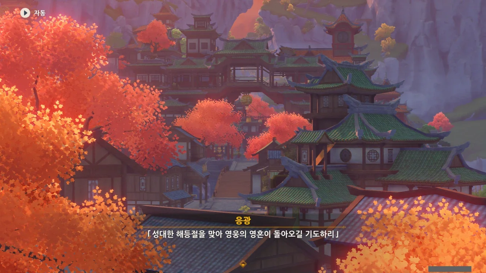
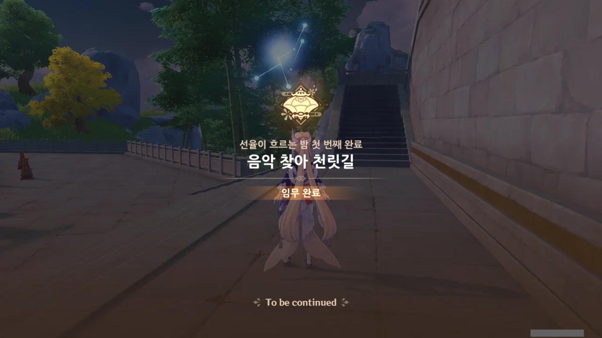
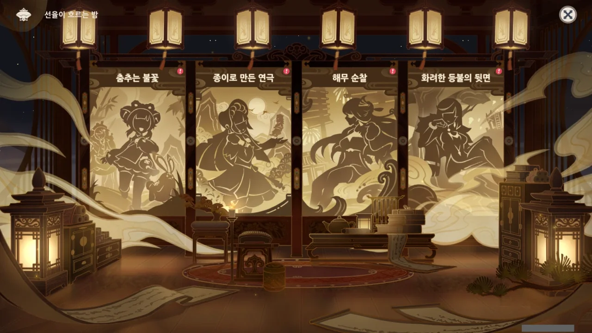
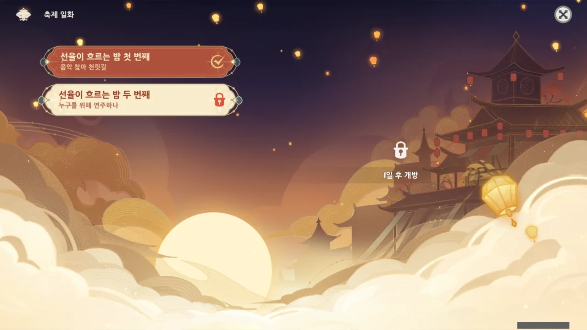
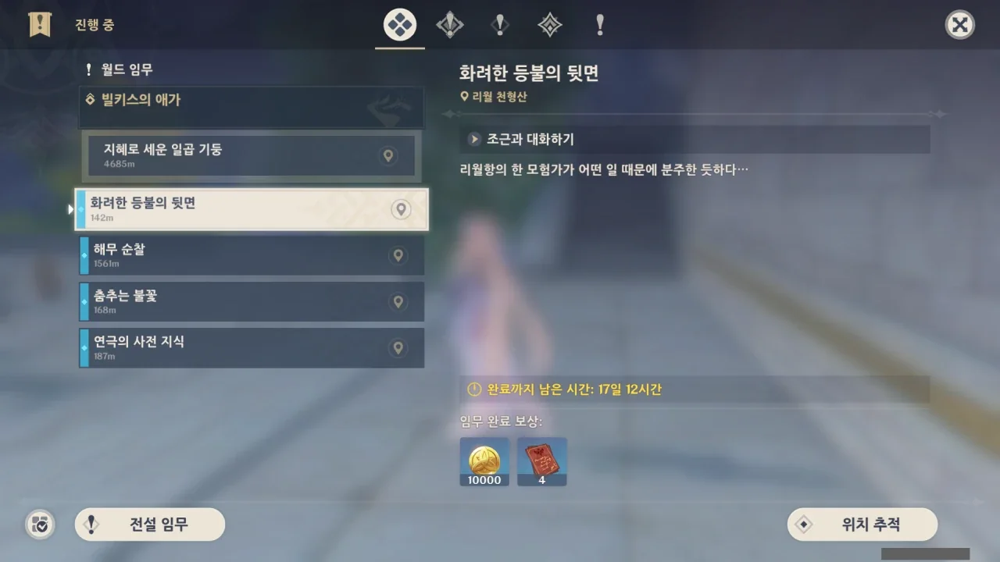



응? 우리가 오면 알려달라고 응광이 말했다고?

그러고 보니, 이번 해등절에서 아직 응광을 만나지 못했다.





> 잘 아는 사이라고 해서 예의를 안 차리면 안 되지.

오... 멋진 말이다.

친하다고 해서 예의를 차리지 않고 선을 조금씩 넘다가, 어느 순간 넘어서는 안 될 선을 넘어 관계가 파탄 나는 경우가 종종 있지 않은가. 아마 그걸 이야기하는 걸 테다.





당장의 일 뿐만 아니라 해등절 행사가 끝난 이후 「무지갯빛 투어」 관계자들과의 향후 협력에 대해 논의해야 한다고 말하는 응광.

우린 당장 해등절 음악회를 여는 데에만 온 정신이 팔렸는데, 응광은 그 너머의 일까지 생각하고 있다.

그녀가 부자가 된 데에는 다 이유가 있다니까.



음... 명소등이 뭐더라. 작년 해등절 이벤트에 참여하지 않아, 잘 모르겠다.



「명해서하진군」이 누군지도 모르겠다. 아마 작년 해등절에 언급된 선인이겠지?

> 「성대한 해등절을 맞아 영웅의 영혼이 돌아오길 기도하리」

해등절에 저런 의미가 있었나? 난 그냥 해등절이 중국 춘절을 모티브로 한 축제로 알고만 있었는데...

&nbsp;

그래서 중국 춘절과 가장 비슷한 명절인, 한국 설날의 행사를 알아보았다.

내 가족은 더 이상 설날이나 추석 같은 명절에 온 가족이 모이지 않은 지 오래되어, 따로 찾아봐야 이해할 수 있다는 것이 조금 씁쓸하다.

&nbsp;

설날에는 차례와 세배를 하는 것이 보통이다.

차례는 설날, 한식, 단오, 추석, 네 명절에 지내는 조상제사를 뜻한다. 일반적으로 부, 조부, 증조부, 고조부 4대조까지의 제사를 지낸다.

세배는 새해를 맞아 손아랫사람이 손위분들에게 인사를 드리는 풍습이다.

&nbsp;

그러니, 응광이 말한 해등절은 아마 '차례'를 말하는 것일 테지.



이 세상에 음악을 싫어하는 사람이 어디 있을까. 음악에 무슨 트라우마라도 있는 게 아닌 한, 아마 모두가 음악을 좋아할 것이다.

우리의 심장 소리 역시 이미 훌륭한 드럼 소리이니 말이다.



응광이 "감우와 함께 선녀의 후손을 찾고 있다고 들었어"라고 하기에, 뭔가 도움이 될 만한 정보를 주지 않을까 생각했는데, "재미있는 일이 생기면, 나에게도 들려줘"라고 한다.

세 번째 해등절, '선율이 흐르는 밤'의 첫 번째 이야기, '음악 찾아 천릿길'이 끝났다.

이 4개는 아마 보조 임무 같은데...

요요와 치치가 이렇게 있는 걸 보니, 분명 이 임무를 진행할 때 둘이 등장하지 않을까?

그렇지 않고서야는 저 둘을 그려 넣을 이유가 없지 않은가.

운근이 나올 것은 이미 이전 이야기를 통해 짐작하고 있긴 했었다.

제발 경극 노래만 부르지 말아다오.

북두도 나오네? 설마 배 타고 돌아다니는 거야?

야란 역시 해등절에도 쉬지 않고 일을 할 예정인가 보다.

다음 이야기는 하루 후 개방인데, 앞서 본 네 보조 임무를 하기 전에는 이 이야기를 진행하지 않을 예정이다.

이야, 오랜만에 이렇게 임무 창에 뭔가가 생기네.

저 '빌키스의 애가' 월드 임무는 대체 언제쯤 진행할 수 있을까? 지금은 할 게 너무 많은데...
