이전 글에서 보조 임무로 나온 네 가지 임무에 대해 이런저런 추측을 했었다.

'이 임무 이미지에 요요와 치치가 나오니, 분명 이 임무 이야기는 요요와 치치가 등장할 것이다'

'이 임무 이미지에는 야란이 나오니, 야란이 이 임무에서 등장할 것이다'

전부 틀렸더라. ㅋㅋㅋㅋㅋㅋ

> 네놈의 뇌피셜은 전부 틀렸어, 이 쓸모없는 버러지 같은 녀석아
{.bq}

ㅋㅋㅋㅋㅋㅋ

# 춤추는 불꽃{id="first"}

두근두근 설레는 첫 보조 임무, '춤추는 불꽃' 임무를 진행해 보자.

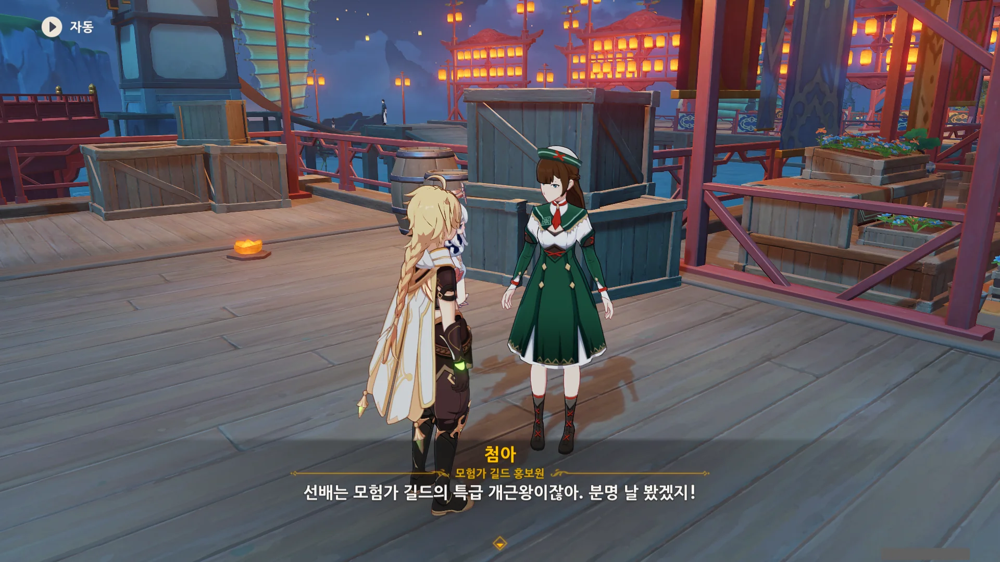

매일매일 모험가 길드에서 일일 임무 4개를 받아 해결하는 게 숙제니까, 특급 개근왕이라고 해도 큰 무리가 아니긴 하지.

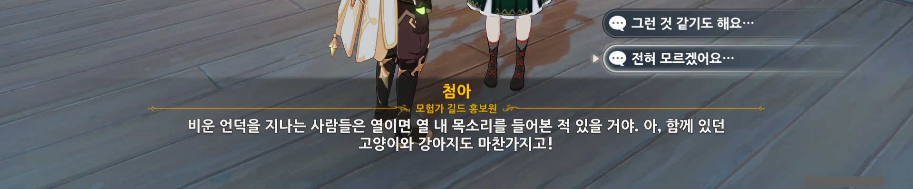

아뇨, 전혀 들어본 적 없는데요.

너... 방금 소설 내용을 '정보'라고 얼버무렸지.

그러니까... 기존의 등산이나 바람의 날개 이벤트에, 폭죽과 화약을 첨가한 것이 전부 아닌가?

그게 뭐가 재미있다는 거지?

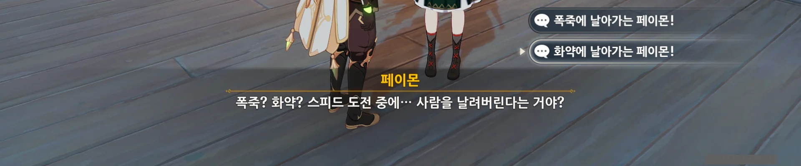

아, 이건 재미있을지도 모르겠다. 화약에 날아가는 페이몬이라니!

원신에 등장하는 플레이어블 캐릭터의 공통점이라면, 눈앞에서 슬라임 폭약통이 터져도 웬만해선 죽지 않는다는 점이겠지.

물론 체력이 극히 적은 상태에서 폭약통이 터진다면 당연히 죽겠지만, 특수한 경우가 아니면 대부분 체력을 가득 채우고 다니잖아.

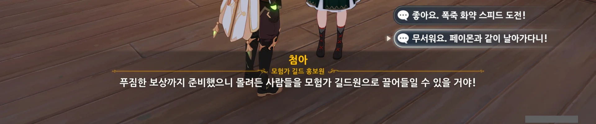

사람들이 이벤트를 하는 건 보상 때문이지.

"무서워요, 페이몬과 같이 날아가다니!" 선택지를 고르니, 페이몬이 '그런데 왜 실실 웃고 있냐?'라고 핀잔을 주더라.

아, 왜. 화약에 날아가는 페이몬이 얼마나 재미있을지 보고 싶다고.

그리하여 '춤추는 불꽃' 보조 임무에 요요와 치치가 나올 것이라는 내 뇌피셜은 하루도 채 되지 않아 저 깊은 심연 속으로 침몰해 버렸다.

일러스트가 날 속였어!

# 종이로 만든 연극{id="second"}

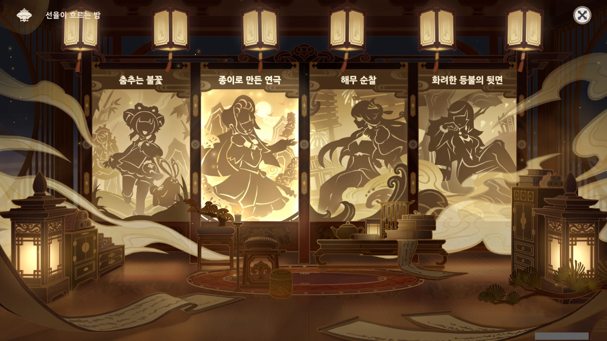

그다음은 '종이로 만든 연극'이다.

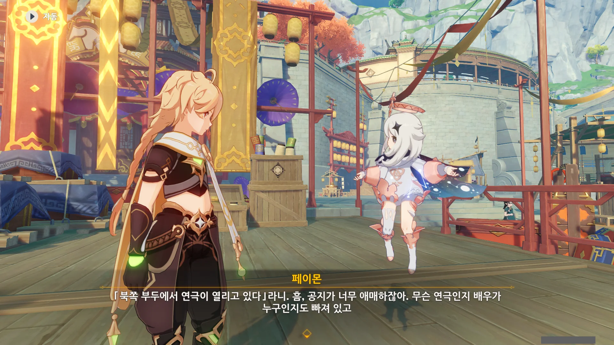

일단 임무 마커가 찍힌 곳으로 오긴 했는데, 여기서 무슨 일이 벌어지고 있는지, 앞으로 뭘 해야 하는지 하나도 모르겠다.



대체 종이극과 리월극은 뭔 차이지? 둘이 다르다고 하는데, 무슨 차이가 있는지 전혀 모르겠다.



저 설명을 들으니 최근 상영한 아바타 신작 영화가 생각났다.

아직 그 영화를 보지 않았고, 앞으로 볼 생각도 별로 없지만, 영화 상영 시간이 3시간이 넘어, 영화가 한창 진행 중일 때 자리에서 일어나 화장실을 가야 한다고 하더라.

상영 시간이 긴 영화라면 으레 중간에 그리 중요하지 않은 내용을 넣어 관객이 화장실을 갈 수 있도록 배려하는데, 그런 배려조차 없다고 하니, 신기할 따름이다.



여기서도 신작 아바타 영화가 생각났다.

듣기론, 특수 촬영 때문에 제작비가 많이 들어가니, 기왕 돈 쓰는 김에 후속작의 촬영 분량까지 전부 한 번에 찍고 하나하나 개봉한다고 하더라.

이야기의 제목으로 미루어 보면, 어떤 사람이 요괴를 쓱싹쓱싹 베어 넘기다 승천해 선인이 되었다는 이야기로 보이는데...

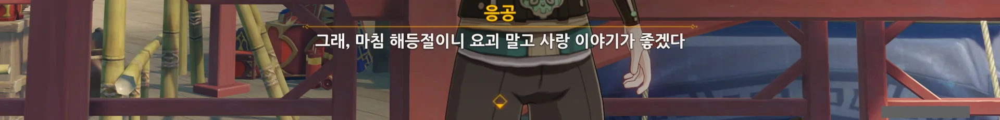

어떤 아이가 '그 이야기 말고, 규염공이 집으로 돌아가는 이야기를 해주세요'라고 하자, 다른 이야기를 꺼내는 응공.

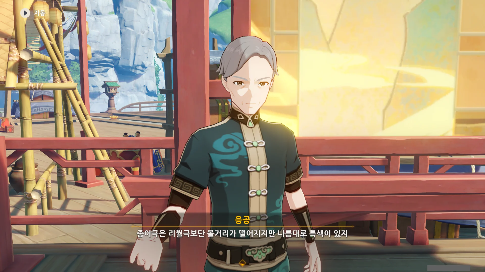

아, 내가 리월극에 대해 잘못 이해하고 있었구나.

리월극은 마치 뮤지컬처럼 실제 배우가 넓은 무대 위에서 공연하는 것이다.

종이극은 지금 응공의 뒤에 있는, 넓은 판 위에서 종이 인형을 이용해 공연하는 것이다.



종이 인형에는 각각 성우가 붙어 있고, 응공은 내레이션 역할을 맡는다.

인형극은 한 사람이 성우, 무대 및 등장인물 조작 등 모든 일을 도맡아 한다고 알고 있었기에, 그냥 규모가 좀 큰 인형극이라고 생각하기로 했다.



와, 프롤로그도 있는 이야기였어?





> 그는 선인의 명에 따라 검으로 온갖 요괴를 평정하고 쫒아냈다.

이 내레이션이 나올 때 「명해서하진군」의 모습을 비추는 것으로 보아, 규염공 이야기는 실제 있었던 이야기를 기반으로 해 만든 이야기가 아닐지 생각된다.





아잇, 이 아저씨, 정말 얄밉게 잘 끊네!

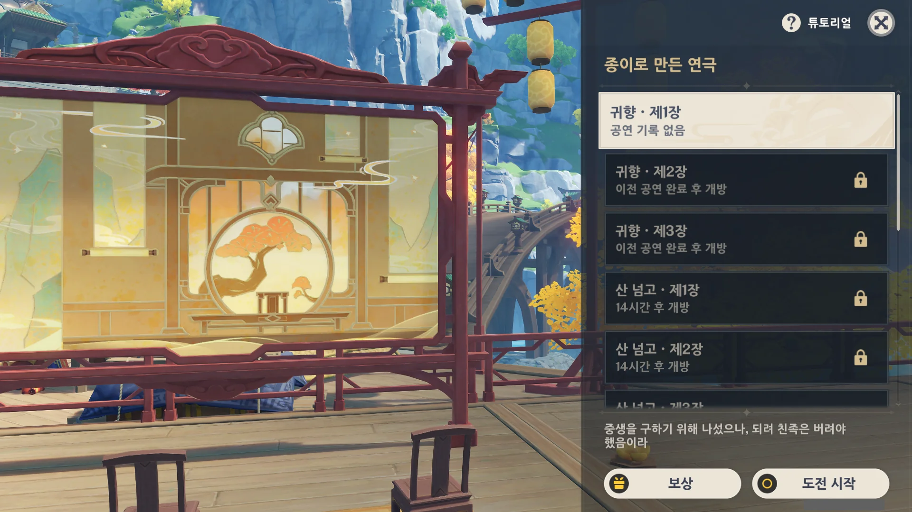

아무래도 플레이어가 규염공 이야기에 따라 직접 필드에 오브젝트를 배치하는 미니 게임인 것 같다.

# 해무 순찰{id="third"}

다음은 '해무 순찰'이다.

남십자 함대의 사조성 호로 가라고 하기에, 또 절벽 위에서 바람의 날개로 사조성 호로 날아가야 하나, 리월항에서 헤엄쳐서 가야 하나 생각했는데, 사조성 호가 워프 포인트 역할을 하도록 바뀌었다.

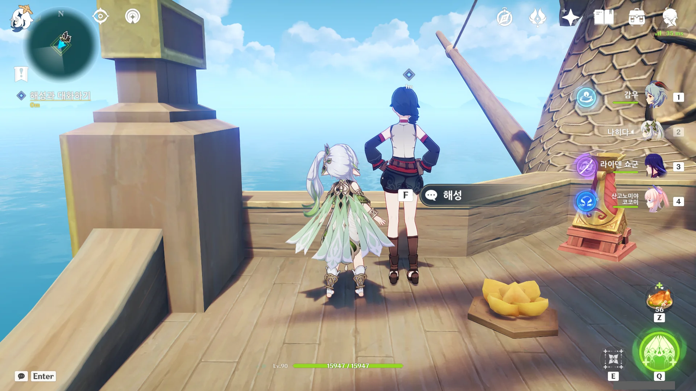

평안한가.

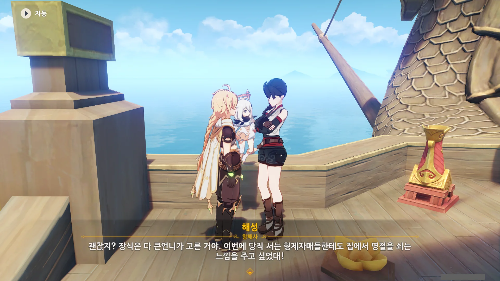

북두가 직원 복지에 굉장히 신경을 쓰고 있구나. 보너스에... 회식에... 와우.

그래, 당직 서느라 해등절도 제대로 즐기지 못할 선원들이 기분이라도 낼 수는 있어야겠지.

맞아. 북두는 거친 뱃사람이라는 느낌이 더 강한 사람이니까.

기본 지급금도 꽤 높고, 명절 때마다 선물 세트도 안겨주고, 사업이 잘되니 직원 대우도 큰 폭으로 개선해 주고...

이게 바로 참된 사장님이지!

아, 남십자 함대도 신입을 꾸준히 모집하는구나.

다들 함대에서 일한 지 오래되어 잔뼈가 굵은 사람일 줄 알았는데.

와... 당직도 전부 지원자로만 채운 거야? 오늘도 북두의 인성 평가는 하늘 높은 줄 모르고 승천한다.

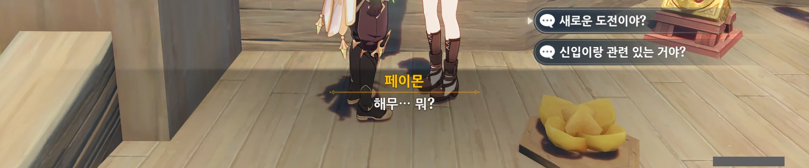

그나저나 이 '해무 순찰'이라는 게 신입 모집과 관련된 것 같다. '훈련 시험'이니 말이다.

아닐 수도 있지만...

지인 중 해군에 부사관으로 복무 중인 사람이 하나 있는데, 무슨 자격증을 따기 위해선 최소 3년간의 승선 경험이 있어야 한다고 하더라.

여기도 별로 다른 건 없어 보이네.

그러니까... 위험한 해역을 건너려면 '4대 증서', '5종 합격증' 말고도 '위험 해역 통행증' 역시 필요한 모양이다. 그리고 그 통행증을 발급받으려면 '해무 순찰'을 통과해야 하고.

&nbsp;

이건 누이 좋고 매부 좋은 일이다.

남십자 함대는 시험을 주관해서 신입을 제일 빠르고 많이 보충할 수 있어 좋다.

다른 지원자는 남십자 함대 말고도 다른 상단에 취직을 용이하게 해주는 '위험 해역 통행증'을 발급받을 수 있어 좋다.

리월 총무부는 시험을 남십자 함대에 아웃소싱해서 좋다.

그리고 여행자는 강제로 참가 당했다.

# 화려한 등불의 뒷면{id="fourth"}

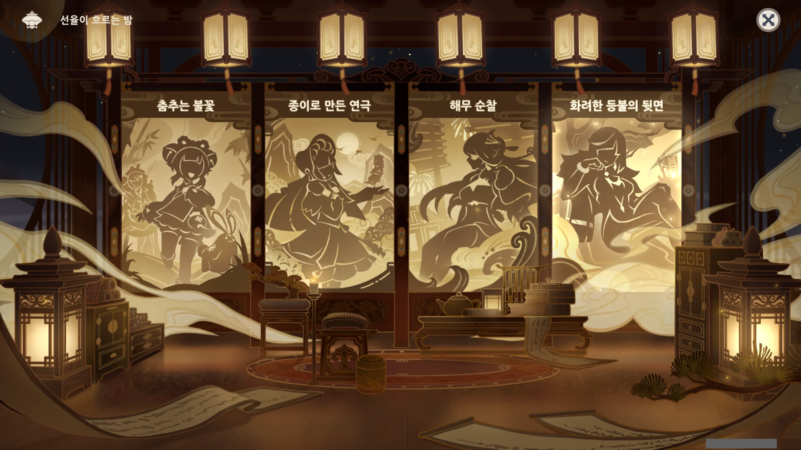

이제 마지막 보조 임무다. '화려한 등불의 뒷면'.

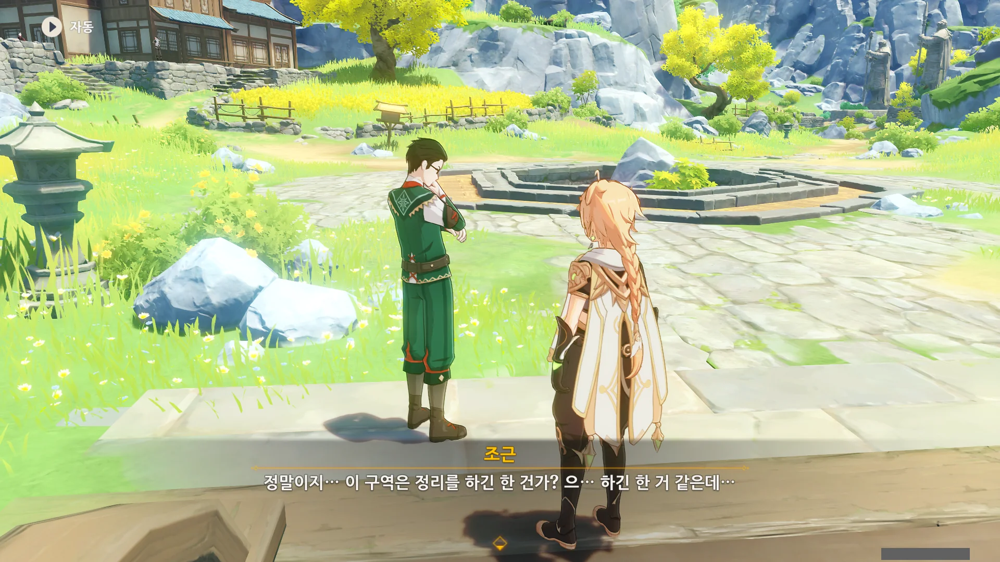

...? 뭔 정리? 웬 정리?

천암군은 해등절 기간 동안 리월 핵심 지역을 경비하느라 바쁘니, 그 외 지역의 다른 일은 모험가 길드에 의뢰 형식으로 맡긴 모양이다.

그런데 해등절 축제 동안 일을 하면 축제를 즐기지 못하잖아. 그래도 괜찮은 건가?

아, 특별 보너스! 분명 두둑하게 얹어주겠지. 그렇지 않고서야는 조근이 해등절 축제를 포기하고 이런 의뢰를 맡았을 리 없지 않은가.

음... 그러니까 지정된 장소에 가서 다 쓸어버리고, 폭죽을 터트려 '여기 다 처리했음'이라고 표시하면 나중에 기록관들이 가서 평가한다는 거네.

이거, 분명 점수제가 있을 것 같다.

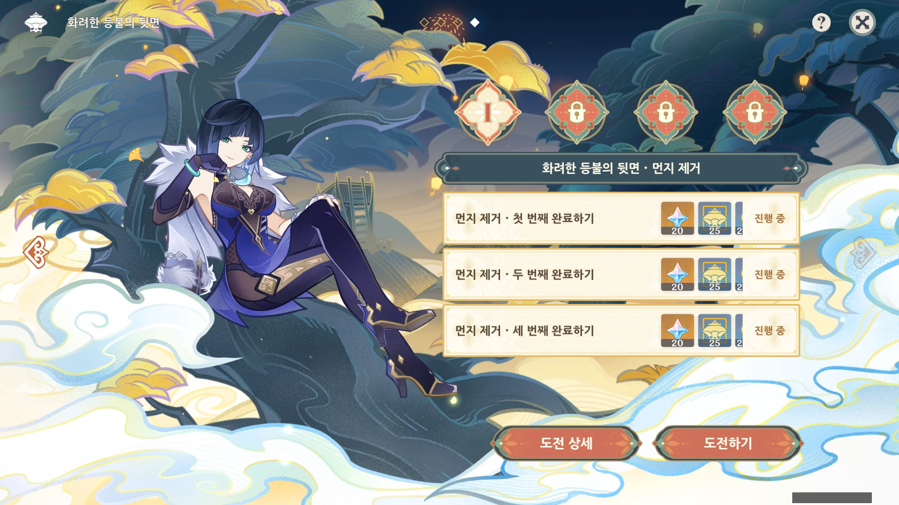

일이 이렇게 된다면... 다음 해등절 이야기는 해등절 두 번째 이야기, '누구를 위해 연주하나'에서 마저 한다는 이야기인데... 이건 내일이 돼야 열릴 예정이다.

씁, 어쩔 수 없지.
