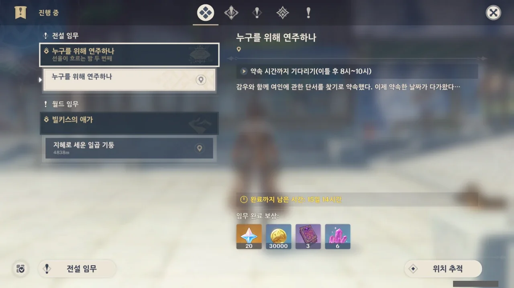
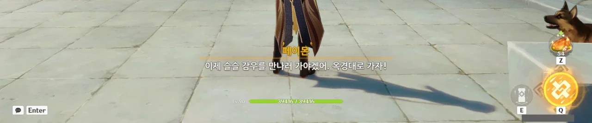
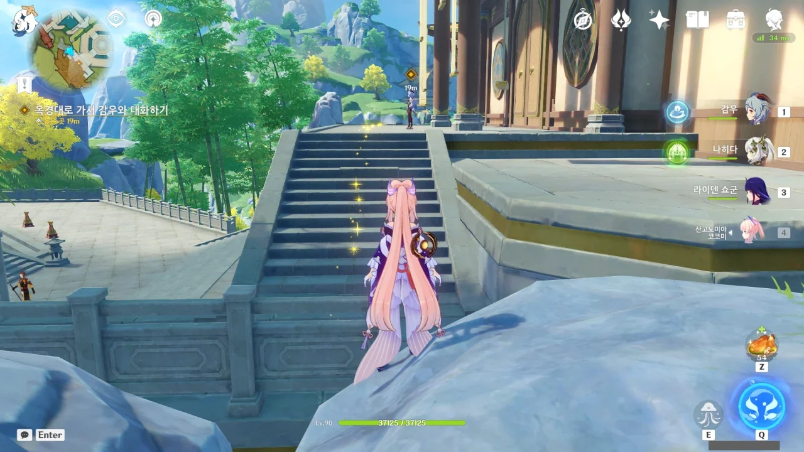
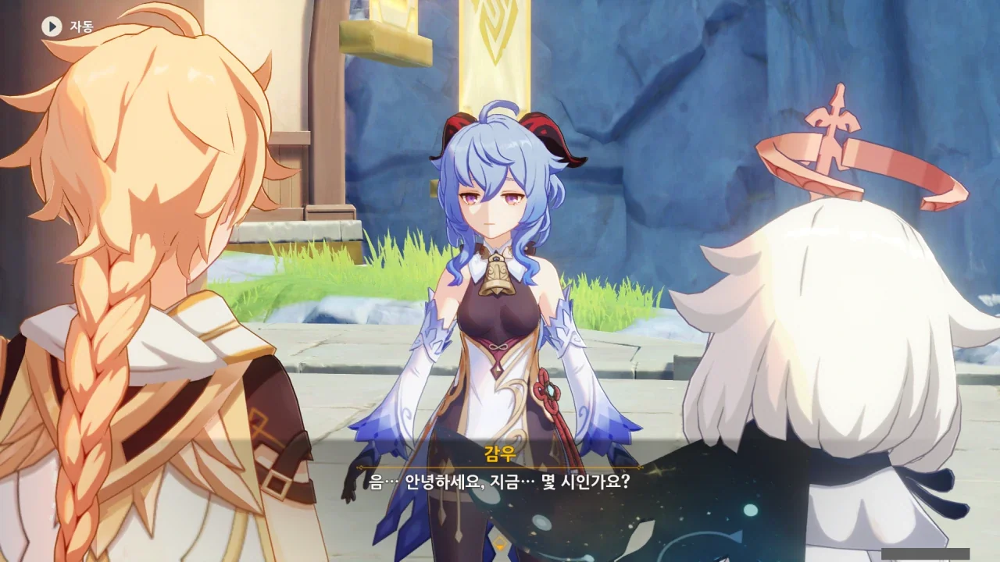
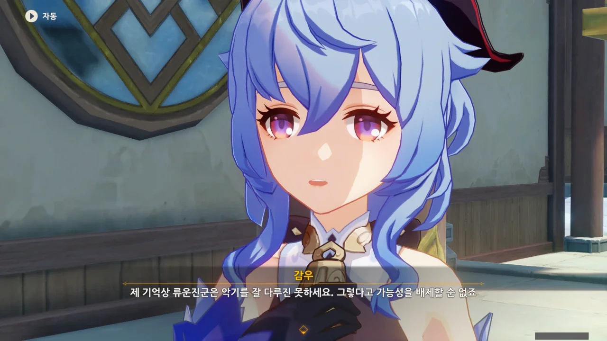
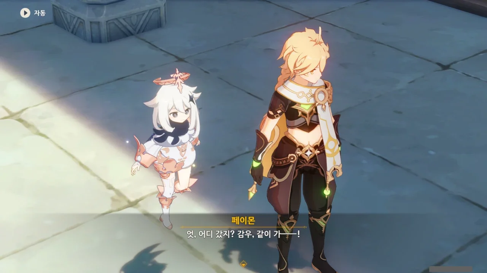
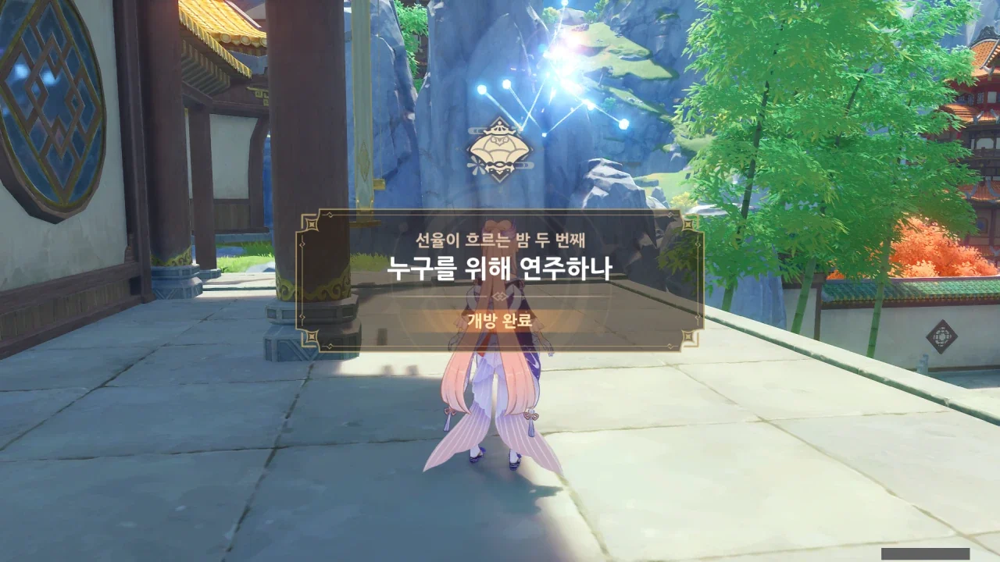

보조 임무에서 드보르작의 조상이 만났던 여인에 대한 힌트를 얻을 수 있을 줄 알았는데, 전혀 관련 없는 해등절 이야기만 가득했다.

그렇다면 지금 이 '누구를 위해 연주하나' 임무에서 관련 힌트를 찾을 수 있겠지.

이틀을 꼬박 기다리자, 페이몬이 옥경대로 가보자고 한다.

그런데 처음 감우가 말했던 기간은 사흘 아니었어? 설마 우리가 실제로 기다린 하루와 게임에서 기다린 이틀을 합해 사흘이 되는 구조인 거야?

옥경대 앞에 감우가 홀로 외로이 서 있다.



아니, 이 녀석, 왜 굳이 밖에 나와서 졸고 있는 거야...

감우가 꾸벅꾸벅 조는 동작이 감우의 대기 동작과 한치의 틀림도 없이 동일해서 피식 웃음이 나오더라.

솔직히 말해봐. 너 밤새웠지.



감우가 자기는 괜찮다며 말을 돌리는데, 아무리 봐도 밤을 새운 모양이다.

그게 아니라면 지금껏 너무 많이 밤을 새워서, 만성 피로에 걸렸거나.



그래. 「물에 빠진 사람을 구출하는 것」과 「아름다운 음악 연주」를 동시에 해낼 수 있는 건 선인뿐만이 아니긴 하다.

하지만 드보르작의 조상이 느꼈던 건 단순히 그뿐만이 아니었지.



생명이 경각에 달린 상황에서, 그 상황조차 잊게 할 정도의 곡은 쉬이 연주할 수 있는 것이 아니다. 게다가 정신을 잃은 후, 드보르작의 조상은 물기슭으로 이동해 있었다.

이건 선인이 아니면 불가능한 일 아니겠는가.



선녀라고 해서 꼭 뿔이나 날개가 있으리란 법은 없지. 전래 동화에 등장하는 선녀 역시 뿔이나 날개가 없지 않던가.

뿔이나 날개가 있다고 해도, 그게 어떻게 생겼느냐에 따라 주는 인상이 달라지기도 한다. 대부분 기독교의 영향이겠지만, 염소 뿔이나 박쥐 날개는 뭔가 사악하다는 인상을 주기 쉽다.





감우에게 물에 빠진 사람을 발견한다면 어떻게 할 것인지 묻자, 드보르작의 조상이 만났다던 여인처럼 일단 물 밖으로 끌어낸 후, 멀리서 상태를 관찰하다 무사를 확인하면 도망칠 것이라고 한다.

&nbsp;

나무 뒤에 숨어 상대를 관찰하는 감우를 상상해 본다.

제 딴에는 숨었다고 숨었는데, 푸른 머리카락이나 뿔 때문에 나무 뒤에 감우가 있다는 것이 다 들킬 것 같다. 그래 놓고서 '이러면 안보이겠지?'라고 생각하고 있을 감우가 떠오른다.

귀엽다!



그래, 그 선인 역시 복잡한 설명 대신 그냥 도망가는 걸 택한 걸 수도 있다.



> 「흥, 이 몸은 그저 지나가던 길에 겸사겸사 한 것이니 아무 말도 말거라.」
> 「작은 인간 주제에 이 몸의 연주를 방해할 뻔했구나.」

페이몬, 류운차풍진군 흉내를 정말 잘 내는구나.

그러고 보니, 나도 류운차풍진군이 악기를 다루는 건 전혀 보지 못했다.

기관 같은 신기한 기계 장치는 잘만 만들면서 말이다.



감우가 리월항에 오래 있어, 선인들과의 교류가 적은 탓에 선인으로 추정되는 드보르작의 이야기 속 여인에 대해 류운차풍진군에게 직접 물어보기 위해 오장산으로 찾아가기로 했다.

거기서 다른 선인들이 갖고 있는 정보도 얻을 수 있을 것이고 말이다.



아, 그래. 류운차풍진군은 한번 말의 물꼬가 터지면 입에서 이런저런 이야기가 수도 없이 쉬지 않고 튀어나온다.

감우 전설 임무에서도 감우의 어릴 적 이야기를 하는 류운차풍진군에 감우가 질색한 적이 있는데, 아마 이번에도 류운차풍진군의 입에서 또 다른 감우의 어릴 적 이야기가 나올 것 같다.

&nbsp;

하지만 솔직히 기대된다. 나만 그런 건 아니잖아. 늘 조곤조곤한 감우의 뜻밖의 모습을 보는 게 얼마나 재미있는데.





그래도 본인이 싫어하니, 류운차풍진군이 또다시 감우의 어릴 적 이야기를 꺼내면 최대한 이야기를 돌려보기로 했다.

감우는 벌써 출발했다. 빠르기도 해라.

'누구를 위해 연주하나' 임무 시작!
