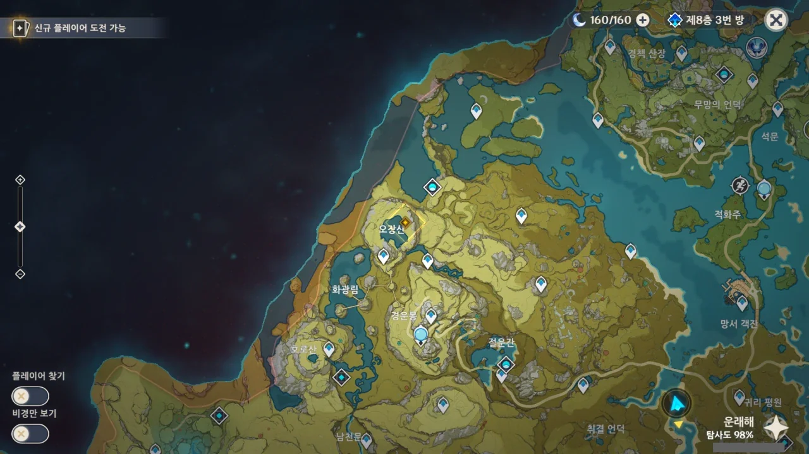

류운차풍진군은 오장산에 있다.

솔직히 말해, 이 부근은 여기가 저기 같고, 이 산이 저 산 같아, 산 이름만 말해선 대체 어디인지 잘 모르겠다.

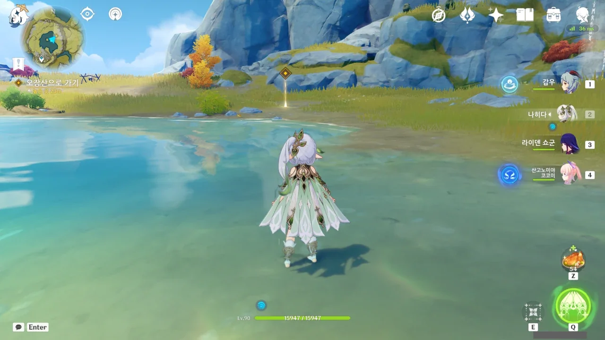

응? 아무도 없는데? 그냥 가면 되는 건가?

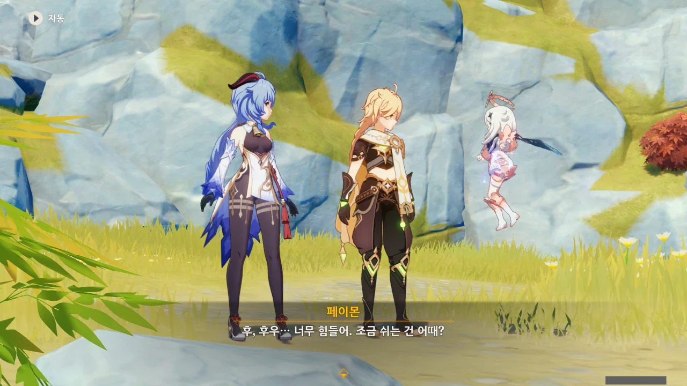

페이몬 이 녀석은 공중에서 둥둥 떠다니는 주제에 좀만 움직여도 힘들다고 한다.

보이지 않는 곳에서 열심히 달리고 있다고 말은 하지만, 글쎄...



류운차풍진군이 집에 없다고 한다. 아니, 그 히키코모리 선인이 무슨 바람이 불어서?



다른 사람이었다면 히키코모리가 집에 없다는 말에 '신변에 무슨 문제라도 생긴 게 아닐까?'라고 생각했겠지만, 류운차풍진군은 선인이니, 그럴 걱정은 전혀 없다.

선인을 상대하려면 적어도 다른 선인이나 마신을 데려와야 할 걸?

&nbsp;

> 진군은 밖으로 나가시는 일이 거의 없어 명절엔 항상 선인들이 문안을 오곤 했는데...

감우의 저 말을 듣고 머릿속에서 다음과 같은 상황이 펼쳐졌다.

다른 선인들이 '어차피 류운차풍진군은 집 밖으로 잘 안 나가니까, 우리 명절 때 기왕 모이는 거, 앞으로는 류운차풍진군 집에서 모이자!'라고 입을 모아 말하고, 류운차풍진군은 '아니, 왜 멀쩡한 다른 곳 놔두고 왜 하필 내 집에서!'라고 불평하는 그런 모습이 떠오른다.

마치 명절만 되면 큰집에 다 같이 모이는 것처럼 말이다. 전혀 근거 없는 머릿속 이야기이지만.

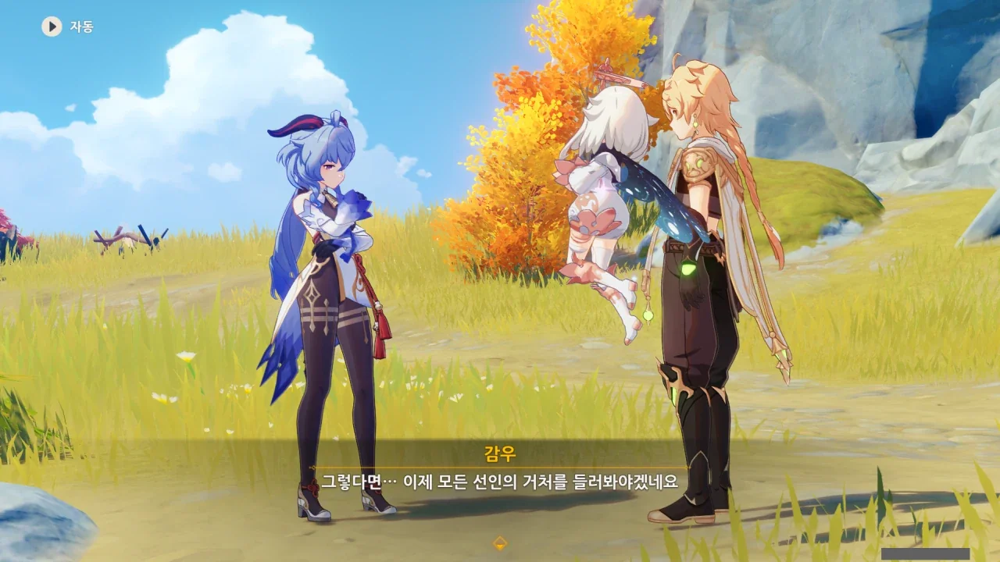

원래 계획은 류운차풍진군에게 드보르작의 조상 이야기를 한 후, 여기에 관련되었을 만한 선인을 알고 있냐 묻는 것이었는데, 류운차풍진군이 집에 없으니, 모든 선인의 거처를 찾아다니며 '당신이 그 선인입니까?'라고 물어봐야 하게 되었다.



더 이상 돌아다니기 싫은 페이몬이 한 가지 꾀를 낸다.

그런데 왜 난 벌써 불안해지는 걸까?





누군가가 물에 빠진 척해 선인을 낚자는 페이몬. 드보르작의 조상 때처럼 물에 빠진 여행자를 보고 그때의 선인이 다시 나타나리라는 것이다.

페이몬, 대체 네 양심은 어디다 갖다 팔아 버린 거니?

게다가 생글생글 웃으며 물에 빠지는 역할은 여행자가 맡으면 된다고 말한다. 어휴, 진짜 꿀밤 마렵네. 분명 딱- 소리가 나는, 아주 찰진 딱밤일 것이다.



굉장히 오글거리는 결말이 날 기다릴 것 같지만, 시스템이 시키니 어쩔 수 없이 한다.

아, 나 이제 그냥 무지성으로 스페이스 바만 누를래...

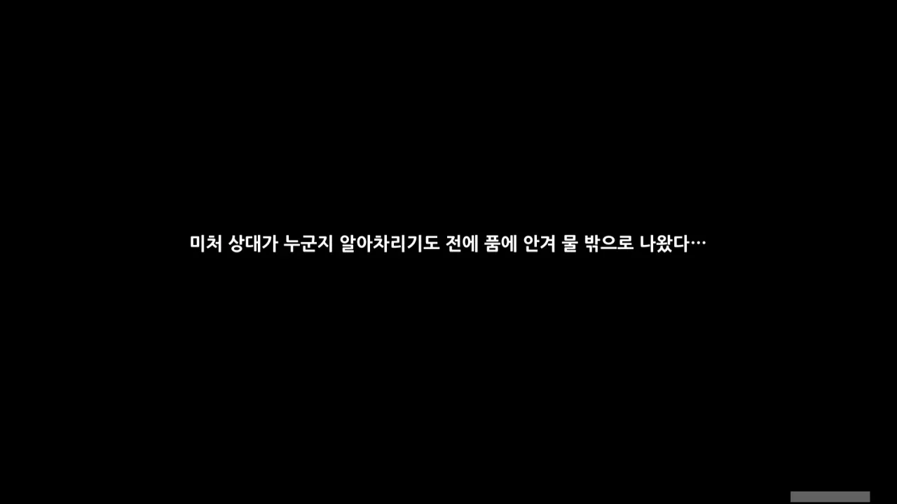



나오라는 이야기 속 선인은 나오지 않고, 소와 신학이 나타났다.

내 이럴 줄 알았다.

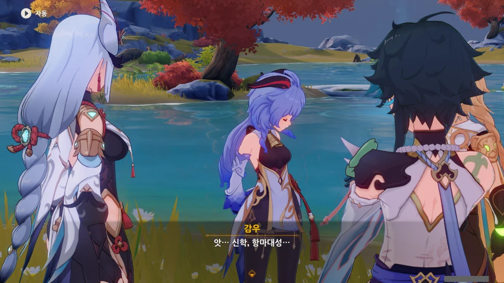

감우도 굉장히 쪽팔려하고 있다.

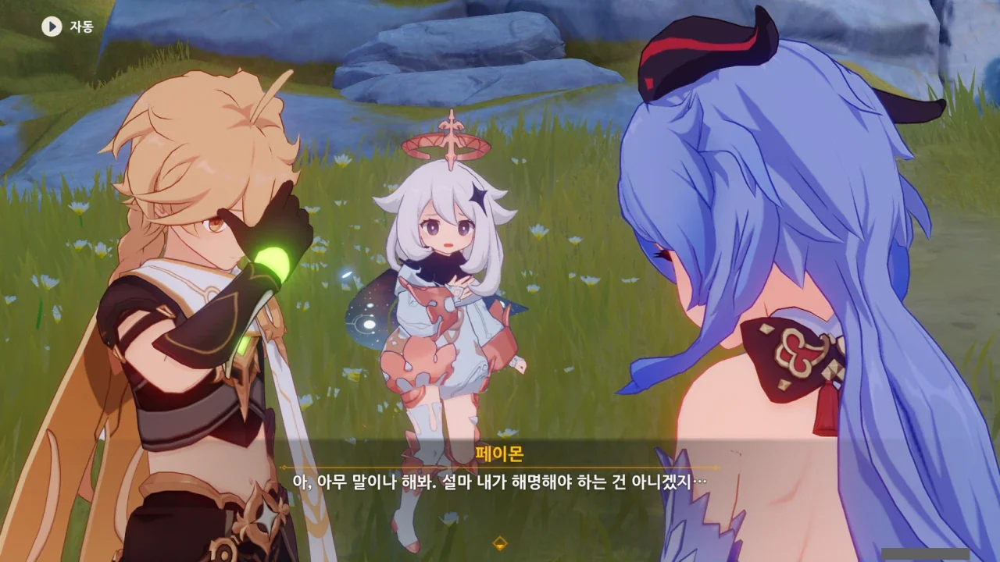

페이몬 네가 직접 해명해야지. 아이디어를 낸 건 너였잖아.

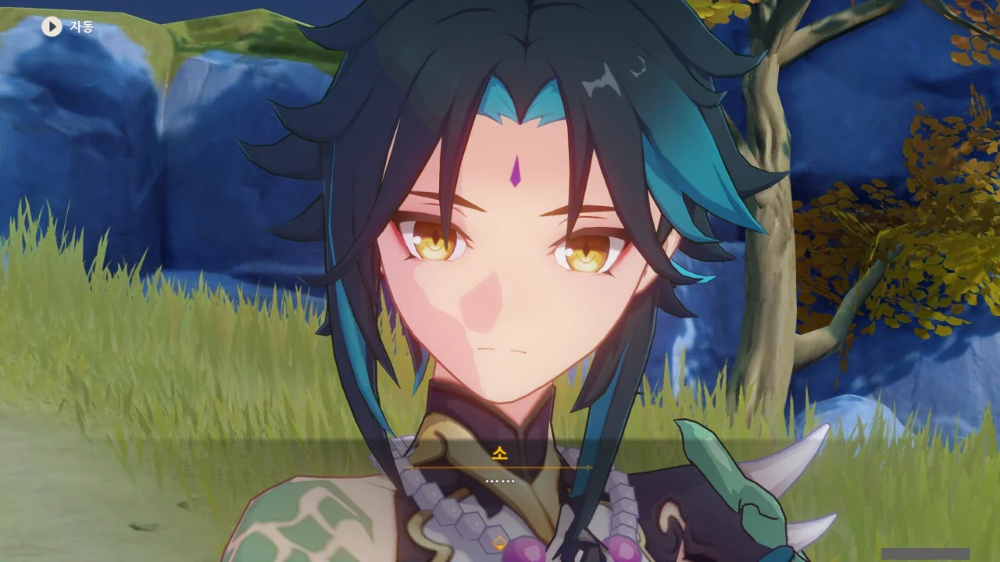

[해명을 요구하는 표정]



결국 이 웃기지도 않은 작전의 전말을 토로하는 페이몬.



당연한 말이겠지만, 소와 신학은 드보르작의 조상이 만났던 선인이 될 수 없다.

소는 남자고, 신학은 드보르작의 조상이 죽은 이후에나 태어났을 테니까.

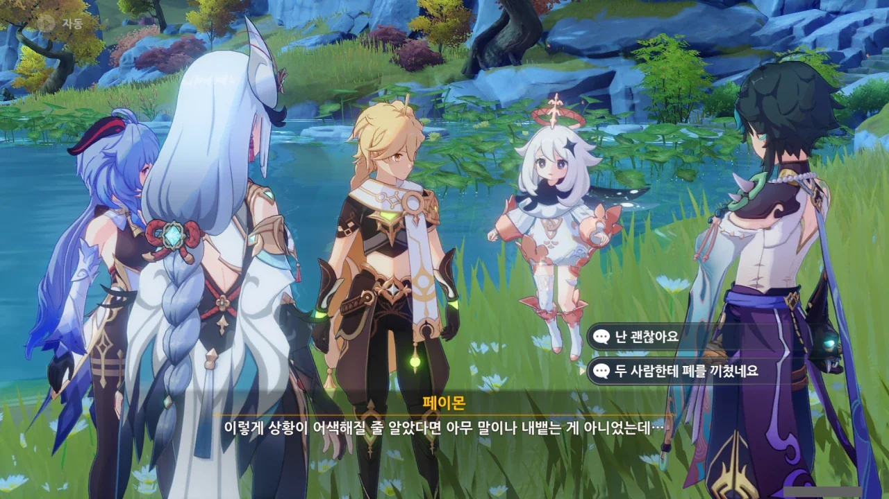

여행자까지 같이 낯부끄러운 꼴이 되었지만, 페이몬이 스스로 불러온 재앙에 짓눌려 부끄러워하는 걸 보니, 속이 시원하다.

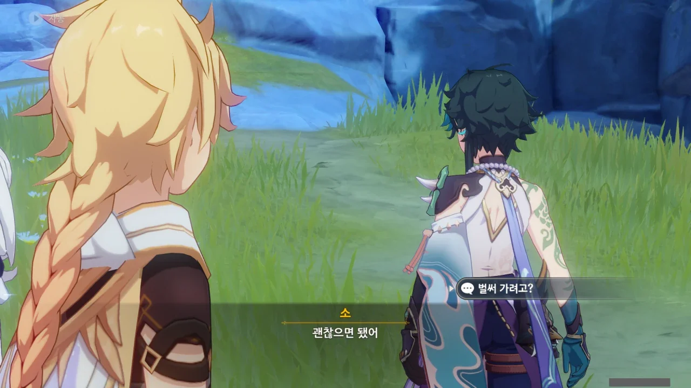

이왕 온 김에, 같이 해등절을 즐겼으면 좋겠지만, 소는 여행자가 무사하다는 걸 확인한 후, 곧바로 자리를 뜬다.



> 이런 방식은 좋지 않아. 다음부턴 하지 않는 게 좋겠어.

소에게 꾸중을 들었다.

이게 다 페이몬 때문이다.



소가 차갑긴 하지... 소가 그나마 말을 편하게 하는 게 아마 여행자나 종려 정도일 것이다.



소는 먼저 가버렸지만, 신학이라도 같이 해등절을 즐겼으면 좋겠다.

원래 축제는 같이 즐길 사람이 많을수록 좋은 거라고.





신학에게 류운차풍진군의 행방을 물으니, 냄비 같은 장치를 갖고 아침 일찍 호로산 쪽으로 갔다고 한다.



감우는 가져온 선물을 두고 오기 위해 잠시 자리를 비운다.



그러니까 신학은 봄과 가을에는 리월항에서 사람들과 함께 생활하고, 여름과 겨울에는 오장산에서 류운차풍진군과 함께 수련한다는 거네.

예전엔 일 년 내내 오장산에서 수련만 했는데, 이제 계절마다 리월항과 오장산을 오가는 건 분명 장족의 발전일 것이다.

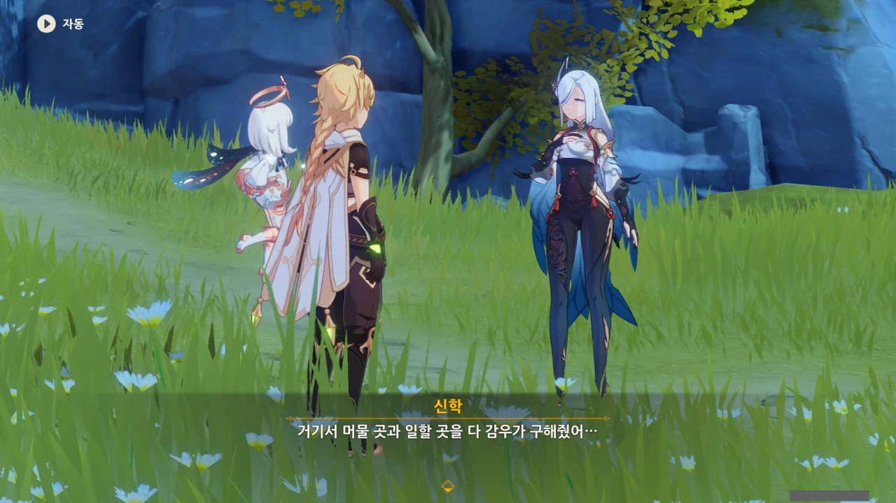

오... 신학이 리월항에서 지내는 동안, 숙소와 직장 모두를 감우가 알아봐 주었다고 한다.

완전 언니네... 엇, 그러면 요요-감우-신학의 의자매 관계가 만들어지는 것인가?



감우가 신학에게 언니라고 부르지 말라고 한 건, 아마 부끄러워서 그럴 것이다.



오, 이런. 신학은 음악이 뭔지 전혀 모른다.

나도 음악을 정확히 뭐라 설명해야 할지 잘 모르겠는데...

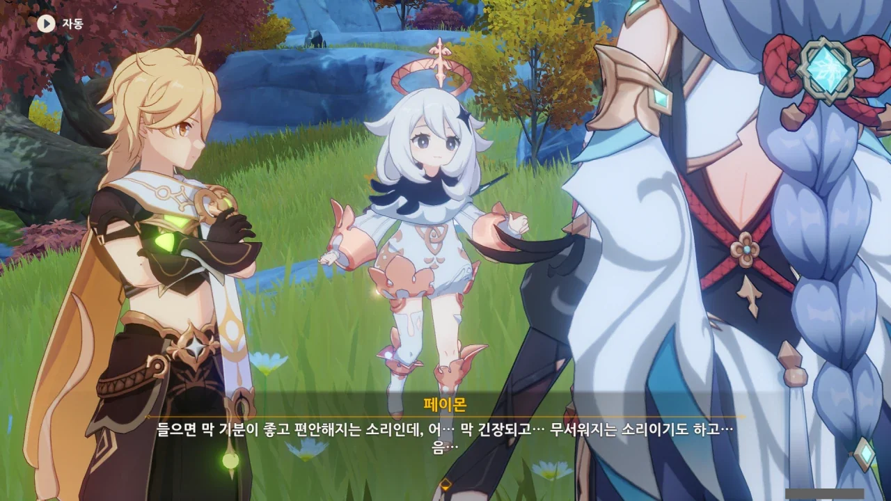

페이몬이 열심히 음악에 관해 설명하려는데...



감우가 돌아오는 바람에 설명이 끊겨버렸다. 뭐... 잘 알아들었겠지?



페이몬이 말한 「음악」을 매일 듣고 있다며, 일행을 안내하는 신학.
